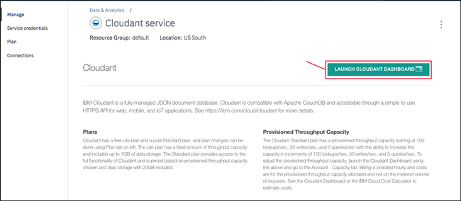
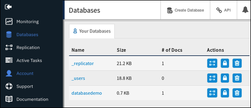
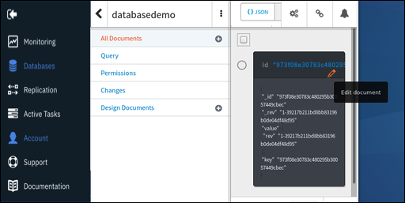

---

copyright:
  years: 2017, 2018
lastupdated: "2018-10-24"

---

{:new_window: target="_blank"}
{:shortdesc: .shortdesc}
{:screen: .screen}
{:codeblock: .codeblock}
{:pre: .pre}
{:tip: .tip}

<!-- Acrolinx: 2017-05-10 -->

# Creazione di una semplice applicazione {{site.data.keyword.cloud_notm}} per accedere a un database {{site.data.keyword.cloudant_short_notm}}: caricamento dell'applicazione

Questa sezione dell'esercitazione illustra come caricare
un'applicazione {{site.data.keyword.cloud}}.
{:shortdesc}

<div id="uploading"></div>

## Connessione a {{site.data.keyword.cloud_notm}}

La prima attività consiste nel connettersi a {{site.data.keyword.cloud_notm}}.

Il toolkit [{{site.data.keyword.cloud_notm}}](create_bmxapp_appenv.html#toolkits) ti aiuta a stabilire la connessione.

Cloud Foundry deve conoscere l'URL da utilizzare per effettuare le chiamate API,
ad esempio quando carichi un'applicazione.
Il toolkit {{site.data.keyword.cloud_notm}} utilizza il comando '`cf api`' per gestire l'endpoint API.
Ulteriori informazioni sul comando '`cf api`' sono
[disponibili
](https://console.ng.bluemix.net/docs/cli/reference/cfcommands/index.html#cf_api){:new_window}.

Utilizza il seguente comando per fornire a Cloud Foundry l'URL da utilizzare:

```sh
bluemix api https://api.ng.bluemix.net
```
{:pre}

È previsto un risultato simile al seguente output:

```
Invoking 'cf api https://api.ng.bluemix.net'...

Setting api endpoint to https://api.ng.bluemix.net...
OK

API endpoint:   https://api.ng.bluemix.net
API version:    2.54.0
Not logged in. Use 'bluemix login' to log in.
```
{:codeblock}

Cloud Foundry ora conosce dove inviare le chiamate API per la gestione delle applicazioni.

Il passo successivo consiste nell'accedere al tuo ambiente dell'applicazione {{site.data.keyword.cloud_notm}}.
Devi fornire i seguenti dettagli dell'account:

-   Il tuo nome utente, specificato come il parametro '`-u`'.
-   Il tuo nome dell'organizzazione, specificato come il parametro '`-o`'.
-   Il tuo spazio, specificato come il parametro '`-s`'.

  I dettagli dell'account sono disponibili nel nostro dashboard {{site.data.keyword.cloud_notm}} quando accedi tramite un browser web, come mostrato nel seguente esempio:
  {: tip}

  

Utilizza un comando simile al seguente esempio per accedere al tuo ambiente dell'applicazione
{{site.data.keyword.cloud_notm}}.
Tieni presente che ti viene richiesto di immettere la tua password dell'account.

```sh
bluemix login -u Adrian.Warman@uk.ibm.com -o Adrian.Warman@uk.ibm.com -s dev
```
{:pre}

È previsto un risultato simile al seguente output:

```
Invoking 'cf login -u Adrian.Warman@uk.ibm.com -o Adrian.Warman@uk.ibm.com -s dev'...

API endpoint: https://api.ng.bluemix.net

Password> 
Authenticating...
OK

Targeted org Adrian.Warman@uk.ibm.com

Targeted space dev
                
API endpoint:   https://api.ng.bluemix.net (API version: 2.54.0)
User:           adrian.warman@uk.ibm.com
Org:            Adrian.Warman@uk.ibm.com
Space:          dev
```
{:codeblock}

## Caricamento dell'applicazione

Il toolkit {{site.data.keyword.cloudant_short_notm}} Foundry ora sa come connettersi all'ambiente {{site.data.keyword.cloud_notm}}.

Il passo successivo consiste nel caricare l'applicazione stessa.
I dettagli di un'applicazione {{site.data.keyword.cloud_notm}}
sono forniti nel [file manifest](create_bmxapp_appenv.html#manifest).

Il file manifest per questa applicazione dell'esercitazione è stato aggiornato come descritto
[qui](create_bmxapp_createapp.html#essential-files)

Utilizza un comando simile al seguente esempio per accedere e per caricare la tua applicazione
{{site.data.keyword.cloud_notm}}.

```sh
cf push "Cloudant Python"
```
{:pre}

Viene visualizzata una sequenza di messaggi del risultato.

```
Using manifest file /..../BMXDemo/manifest.yml

Updating app {{site.data.keyword.cloudant_short_notm}} Python in org Adrian.Warman@uk.ibm.com / space dev as Adrian.Warman@uk.ibm.com...
OK
```
{:codeblock}

Il toolkit Cloud Foundry viene posizionato nel file manifest
e inizia a preparare il caricamento dell'applicazione utilizzando i dettagli di connessione
e identificazione che hai fornito [precedentemente](#uploading).

```
Using route Cloudant-Python.mybluemix.net
Uploading Cloudant Python...
Uploading app files from: /..../BMXDemo
Uploading 1.5K, 3 files
Done uploading               
OK
Binding service {{site.data.keyword.cloudant_short_notm}} Service 2017 to app {{site.data.keyword.cloudant_short_notm}} Python in org Adrian.Warman@uk.ibm.com / space dev as Adrian.Warman@uk.ibm.com...
OK
```
{:codeblock}

L'applicazione è stata caricata correttamente
ed è stata effettuata una connessione all'istanza del database {{site.data.keyword.cloudant_short_notm}}.

```
Starting app {{site.data.keyword.cloudant_short_notm}} Python in org Adrian.Warman@uk.ibm.com / space dev as Adrian.Warman@uk.ibm.com...
-----> Downloaded app package (4.0K)
-----> Downloaded app buildpack cache (29M)
-------> Buildpack version 1.5.5
     $ pip install -r requirements.txt
DEPRECATION: --allow-all-external has been deprecated and will be removed in the future. Due to changes in the repository protocol, it no longer has any effect.
       Collecting cloudant==2.3.1 (from -r requirements.txt (line 1))
         Downloading cloudant-2.3.1-py2-none-any.whl (63kB)
       Collecting requests<3.0.0,>=2.7.0 (from cloudant==2.3.1->-r requirements.txt (line 1))
         Downloading requests-2.12.4-py2.py3-none-any.whl (576kB)
       Installing collected packages: requests, cloudant
       Successfully installed cloudant-2.3.1 requests-2.12.4
You are using pip version 8.1.1, however version 9.0.1 is available.
You should consider upgrading via the 'pip install --upgrade pip' command.
You are using pip version 8.1.1, however version 9.0.1 is available.
You should consider upgrading via the 'pip install --upgrade pip' command.
-----> Uploading droplet (30M)

0 of 1 instances running, 1 starting
1 of 1 instances running

App started


OK

App {{site.data.keyword.cloudant_short_notm}} Python was started using this command `python server.py`
```
{:codeblock}

L'applicazione viene avviata automaticamente.
Come parte dell'avvio,
viene eseguito un controllo per garantire che siano stati soddisfatti tutti i requisiti,
valutando il contenuto del [file requirements.txt](create_bmxapp_appenv.html#requirements).
L'applicazione richiede l'accesso alla libreria {{site.data.keyword.cloudant_short_notm}},
che è stata [specificata](create_bmxapp_createapp.html#essential-files) quando è stata creata l'applicazione.

Dopo aver caricato e avviato l'applicazione,
vengono eseguiti alcuni piccoli controlli di sistema per confermare che l'applicazione sia correttamente in esecuzione
per quanto riguarda {{site.data.keyword.cloud_notm}}.

```
Showing health and status for app {{site.data.keyword.cloudant_short_notm}} Python in org Adrian.Warman@uk.ibm.com / space dev as Adrian.Warman@uk.ibm.com...
OK

requested state: started
instances: 1/1
usage: 128M x 1 instances
urls: Cloudant-Python.mybluemix.net
last uploaded: Thu Dec 22 15:58:18 UTC 2016
stack: cflinuxfs2
buildpack: python 1.5.5

     state     since                    cpu    memory          disk           details
#0   running   2016-12-22 03:59:21 PM   0.0%   49.9M of 128M   110.6M of 1G
```
{:codeblock}

## Verifica dell'applicazione di esempio

Esegui ora un test della tua applicazione e verifica che sia in esecuzione correttamente. 

1.  Apri il dashboard {{site.data.keyword.cloud_notm}}. Puoi vedere il link all'applicazione che hai creato in Applicazioni Cloud Foundry. Fai clic su `Cloudant CF app` per aprire la pagina dei dettagli.<br/>  


2.  Nella pagina dei dettagli `Cloudant CF app`, fai clic su `Routes` e fai clic sul link `Cloudant-CF-app.mybluemix.net`.<br/>


3. Una nuova finestra del browser viene aperta all'indirizzo https://cloudant-cf-app.mybluemix.net/. Il messaggio verifica che l'applicazione sia in esecuzione. Dice: "Hello World! Thanks for creating a Python Starter Application."<br/>


### Conferma dei dettagli del database

Dal dashboard {{site.data.keyword.cloud_notm}}, apri l'istanza del servizio {{site.data.keyword.cloudant_short_notm}} che hai creato. Fai clic sull'istanza del servizio. Vai alla scheda `Manage` e fai clic su `Launch Cloudant Dashboard`.<br/>


Per trovare la tua pagina del servizio {{site.data.keyword.cloudant_short_notm}}, fai riferimento ai dettagli nell'esercitazione [Creazione di un'istanza {{site.data.keyword.cloudant_short_notm}}](create_service.html#locating-your-service-credentials).
{: tip}

Quando si apre la pagina del dashboard,
puoi visualizzare che l'applicazione ha creato il database
'`databasedemo`':<br/>


Il database contiene un solo documento,
creato dall'applicazione.
Per verificare la presenza del documento
fai clic sul nome del database nel dashboard.
Viene visualizzato un elenco di opzioni del database.
Quando selezioni la scheda `All documents`,
vengono visualizzati i dettagli di un solo documento:<br/>


Per visualizzare i dettagli del documento,
fai clic sull'icona `Edit`,
che viene visualizzata con un'immagine di una matita:<br/>


Quando vengono visualizzati i dettagli del documento,
puoi visualizzare ogni campo creato dall'applicazione dell'esercitazione.<br/>
<br/>
In particolare,
il campo `rightNow` dispone della data e ora di creazione del documento.
Questo valore corrisponde all'ora registrata nel
[file di log dell'applicazione](#testing-the-sample-application).

## Passo successivo

Il passo successivo nell'esercitazione è di [gestire e mantenere l'applicazione](create_bmxapp_maintain.html),
ad esempio quando avvii, arresti ed esegui il debug dell'applicazione.
