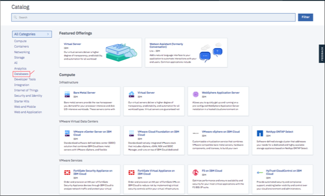

---

copyright:
  years: 2015, 2018
lastupdated: "2018-10-24"

---

{:new_window: target="_blank"}
{:shortdesc: .shortdesc}
{:screen: .screen}
{:codeblock: .codeblock}
{:pre: .pre}
{:tip: .tip}

<!-- Acrolinx: 2017-05-10 -->


# Creazione e utilizzo di un'istanza del piano {{site.data.keyword.cloudant_short_notm}} Hardware dedicato su {{site.data.keyword.cloud_notm}}

Questa esercitazione illustra come creare un'istanza del piano {{site.data.keyword.cloudantfull}} Hardware dedicato che utilizza il dashboard {{site.data.keyword.cloud}} e come eseguire successivamente il provisioning di una o più istanze del piano Standard da eseguire su di essa utilizzando il catalogo {{site.data.keyword.cloud_notm}} oppure la CLI {{site.data.keyword.cloud_notm}}. 

La creazione di un'istanza del piano Hardware dedicato {{site.data.keyword.cloudant_short_notm}} comporta il provisioning
di un ambiente {{site.data.keyword.cloudant_short_notm}} sull'hardware dedicato unicamente per il tuo utilizzo esclusivo. Un'istanza
del servizio viene creata nel dashboard {{site.data.keyword.cloud_notm}} ma non puoi
accedere direttamente all'istanza del piano Hardware dedicato e non avrai
alcuna credenziale del servizio per essa. Puoi utilizzare un'istanza del piano hardware {{site.data.keyword.cloudant_short_notm}} dedicato
dopo che è stata creata eseguendo su di essa il provisioning di una o più istanze del piano
Standard.

## Creazione di un'istanza del piano hardware {{site.data.keyword.cloudant_short_notm}} dedicato

1.  Accedi al tuo account {{site.data.keyword.cloud_notm}}.<br/>
    Il dashboard {{site.data.keyword.cloud_notm}} può essere trovato all'indirizzo:
    [http://bluemix.net ](http://bluemix.net){:new_window}.
    Dopo l'autenticazione con i tuoi nome utente e password,
    ti viene presentato il dashboard {{site.data.keyword.cloud_notm}}:<br/>
    

2.  Fai clic sul pulsante `Crea risorsa`:<br/>
    <br/>
    
3.  Vedi il catalogo {{site.data.keyword.cloud_notm}} e i servizi disponibili. Fai clic sulla categoria `Database`.
    

4.  Fai clic sul servizio {{site.data.keyword.cloudant_short_notm}}:<br/>
    <br/>
    Viene visualizzata la pagina per la creazione di un servizio.

5.  Seleziona il piano `Hardware dedicato` dall'elenco di piani dei prezzi nella parte inferiore della pagina:<br/>
    
    
6.  Compila i seguenti parametri nella parte superiore della pagina: <br/>
    -   Immetti un nome servizio.<br/>
    -   Specifica la regione/ubicazione dove vuoi eseguire la distribuzione.<br/>
    -   Seleziona un gruppo di risorse.</br>
    -   Seleziona un'ubicazione per la distribuzione.<br/>
    -   Seleziona `sì` o `no` alla domanda se è necessario HIPAA.<br/>
   
    HIPAA è valido solo per le ubicazioni degli Stati Uniti.{{site.data.keyword.IBM}}  può eseguire il provisioning di un cluster Dedicato o Bare Metal per implementare i controlli HIPAA. Il provisioning di un cluster può essere eseguito solo alla conferma di un BAA (Business Associate Agreement) stabilito con {{site.data.keyword.IBM_notm}}. Questo accordo è descritto nei termini Descrizione dei servizi. Il provisioning di un cluster per gestire i dati HIPAA può richiedere più tempo rispetto al periodo stimato di 5 giorni. {: tip}
    
    Distribuisci ed esegui il provisioning di istanze del piano Standard nella stessa regione e nello stesso spazio.
    {: tip}

    
        
7.  Fai clic sul pulsante `Crea` per avviare il processo di provisioning. <br/>

    La fatturazione è ripartita proporzionalmente tutti i giorni, quindi assicurati di voler eseguire il provisioning e
    il pagamento di un ambiente prima di fare clic sul pulsante **Crea**.{: tip}

    

    Durante il provisioning, nel tuo dashboard {{site.data.keyword.cloud_notm}}
    viene visualizzata una rotella che gira accanto all'istanza. Viene inviata una richiesta per eseguire il provisioning di un'istanza del piano Hardware dedicato su server
    bare metal. Il tempo di provisioning è asincrono e può richiedere fino a 5 giorni.
    {: tip}   

    
    
## Provisioning di un'istanza del piano Standard su un ambiente Hardware dedicato

1.  Accedi al tuo account {{site.data.keyword.cloud_notm}}.<br/>
    Il dashboard {{site.data.keyword.cloud_notm}} può essere trovato all'indirizzo:
    [http://bluemix.net ](http://bluemix.net){:new_window}.
    Dopo l'autenticazione con i tuoi nome utente e password,
    ti viene presentato il dashboard {{site.data.keyword.cloud_notm}}:<br/>
    

2.  Fai clic sul pulsante `Crea risorsa`:<br/>
    <br/>
    Viene visualizzato un elenco dei servizi disponibili in {{site.data.keyword.cloud_notm}}.

3.  Fai clic sulla categoria `Database` e seleziona il servizio `Cloudant`:<br/>
    </br>
    Viene visualizzata la pagina per la creazione di un servizio.<br/>  

4.  Fai clic su `Standard` dai piani dei prezzi. <br/>
    
    
    Non puoi eseguire il provisioning di un'istanza del piano Lite in un ambiente Hardware dedicato.
    {: tip}
    
5.  Compila i seguenti parametri: <br/>
    -   Immetti un nome servizio.<br/>
    -   Specifica la regione/ubicazione dove vuoi eseguire la distribuzione.<br/>
    -   Seleziona un gruppo di risorse.</br>
    -   Seleziona un metodo di autenticazione.</br>
    -   Seleziona un ambiente.</br>
    
    
6.  Fai clic sul pulsante `Crea`.<br/>
    Dopo alcuni secondi, viene eseguito il provisioning dell'istanza sull'ambiente che hai selezionato.<br/>
    
    
7.  Ottieni le tue credenziali del servizio e accedi al dashboard {{site.data.keyword.cloudant_short_notm}} come faresti per un'istanza {{site.data.keyword.cloudant_short_notm}} a più tenant. 
    
    Per ulteriori informazioni, vedi la sezione relativa alla [modalità di individuazione delle tue credenziali del servizio](../tutorials/create_service.html#locating-your-service-credentials){:new_window}. 
    
## Provisioning di un'istanza del piano Standard in un ambiente Hardware dedicato con la CLI {{site.data.keyword.cloud_notm}}

Per utilizzare la CLI {{site.data.keyword.cloud_notm}}, devi aver eseguito l'accesso. Per ulteriori informazioni su come eseguire l'accesso e impostare un gruppo di risorse di destinazione, vedi [Accesso al tuo account {{site.data.keyword.cloud_notm}}](create_service_cli.html#logging-in-to-your-ibm-cloud-account){:new_window}. 

Per creare un'istanza del piano {{site.data.keyword.cloudant_short_notm}} Standard nel tuo ambiente del piano {{site.data.keyword.cloudant_short_notm}} Hardware dedicato, il formato del comando di base è il seguente:


Campo | Descrizione
------|------------
`NAME`| Un nome arbitrario da te assegnato all'istanza.
`SERVICE_NAME` | `cloudantnosqldb`
`PLAN_NAME` | Piano Standard
`LOCATION` |  L'ubicazione dove desideri eseguire la distribuzione, ad esempio us-south, us-east oppure eu-gb. 

Vedi il seguente comando di esempio: 

```sh
ibmcloud resource service-instance-create NAME SERVICE_NAME SERVICE_PLAN_NAME LOCATION [-p, --parameters @JSON_FILE | JSON_STRING ]
```

Le istanze {{site.data.keyword.cloudant_short_notm}} distribuite in ambienti Hardware dedicato prendono altri due parametri:

Parametro | Descrizione
----------|------------
`environment_crn` | Questo parametro deve essere impostato sul CRN dell'istanza del piano {{site.data.keyword.cloudant_short_notm}} Hardware dedicato. Puoi determinare qual è il CRN consultando il comando CLI di esempio nella scheda Gestisci dell'istanza del piano {{site.data.keyword.cloudant_short_notm}} Hardware dedicato nel dashboard {{site.data.keyword.cloud_notm}}. In alternativa, puoi determinare qual è il CRN utilizzando il comando `ibmcloud resource service-instance SERVICE_INSTANCE_NAME`. 
`legacyCredentials` | Un parametro facoltativo che assume come valore predefinito true e indica se l'istanza utilizza sia le credenziali legacy che quelle IAM oppure solo le credenziali IAM. Consulta la [guida IAM ](../guides/iam.html#ibm-cloud-identity-and-access-management-iam-){:new_window} per ulteriori dettagli sulla scelta di un metodo di autenticazione.

Vedi il seguente comando di esempio: 

```sh
ibmcloud resource service-instance-create cloudant_on_ded_hardware_cli cloudantnosqldb standard us-south -p '{"environment_crn":"crn:v1:bluemix:public:cloudantnosqldb:us-south:a/b43434444bb7e2abb0841ca25d28ee4c:301a3118-7678-4d99-b1b7-4d45cf5f7b29::","legacyCredentials":false}'
```
     
