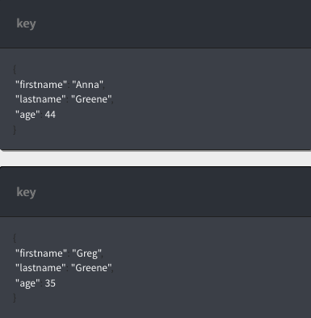

---

copyright:
  years: 2017
lastupdated: "2017-07-03"

---
{:new_window: target="_blank"}
{:shortdesc: .shortdesc}
{:screen: .screen}
{:codeblock: .codeblock}
{:pre: .pre}

# Creazione di una query Cloudant

Questa esercitazione illustra come creare un database, popolarlo
con documenti, creare un indice e utilizzare l'indice per eseguire la query del database.

Vengono forniti esercizi per la  _Riga comando_
e  e il _Dashboard Cloudant_. Gli esercizi per il dashboard
Cloudant ti forniscono una esempio visivo di ogni attività. Puoi seguire i link
nell'esercitazione per ulteriori informazioni.

Per iniziare, crea il database `query-demo` e alcuni documenti che contengono
i dati per queste esercitazioni.

## Premesse

Prima di cominciare, segui queste istruzioni per preparare l'esercitazione:

1.  [Crea un account Bluemix
](https://console.ng.bluemix.net/registration/){:new_window}.
2.  Accedi al dashboard Cloudant
  [ ](https://console.ng.bluemix.net/catalog/services/cloudant-nosql-db){:new_window}.
3.  [Crea un'istanza Cloudant su Bluemix](create_service.html#creating-a-cloudant-instance-on-bluemix).
4.  (Facoltativo) [Crea un alias acurl](../guides/acurl.html#authorized-curl-acurl-) per rendere più facile e veloce eseguire i comandi dalla riga di comando.
5.  Sostituisci la variabile `$ACCOUNT` nei comandi inclusi negli esercizi con il nome utente che utilizzi per accedere al dashboard Cloudant.
  Se decidi di non configurare `acurl`,
  utilizza il seguente URL invece di quello fornito negli esercizi:
  ``` sh
  curl https://$USERNAME:$PASSWORD@$ACCOUNT.cloudant.com/query-demo
  ```
  {:codeblock}

## Creazione di un database

In questa sezione, crea `query-demo` [database](../api/database.html#create) che è il
database che utilizziamo in questa esercitazione.

> **Nota:** in questa esercitazione, utilizziamo l'alias
  `acurl` invece del comando `curl`.
  L'alias `acurl` viene creato utilizzando i passi descritti [qui](../guides/acurl.html#authorized-curl-acurl-).
  Se preferisci utilizzare il comando `curl`
  o un altro metodo per richiamare gli endpoint API,
  sostituisci il tuo comando nell'esercitazione,
  insieme ai parametri richiesti dal tuo comando,
  come il nome utente e la password.

 _Riga di comando_

1.  Crea un database eseguendo questo comando:
  ``` sh
  acurl https://$ACCOUNT.cloudant.com/query-demo -X PUT
  ```
  {:codeblock}
2.  Controlla i risultati:
  ```json
  {
    "ok": true
    }
  ```
  {:codeblock}

 _Database Cloudant_

1.  Apri l'istanza del servizio Cloudant che hai creato.
2.  Seleziona la scheda Databases:

  
3.  Fai clic su **Create Database**.
4.  Immetti `query-demo` e fai clic su **Create**.

  Viene automaticamente aperto il database `query-demo`.

## Creazione di documenti nel database

I [documenti](../api/document.html#documents)
che crei in questo esercizio contengono i dati che utilizzi per eseguire la query del database `query-demo` nei successivi esercizi.

 _Riga di comando_

1.  Copia il testo di esempio in un file di dati denominato `bulkcreate.dat` per creare cinque documenti: 
  ```json
  {
    "docs": 
        [
      {
        "_id": "doc1",
                "firstname": "Sally",
                "lastname": "Brown",
                "age": 16,
                "location": "New York City, NY"
      },
      {
        "_id": "doc2",
                "firstname": "John",
                "lastname": "Brown",
                "age": 21,
                "location": "New York City, NY"
      },
      {
        "_id": "doc3",
                "firstname": "Greg",
                "lastname": "Greene",
                "age": 35,
                "location": "San Diego, CA"
      },
      {
        "_id": "doc4",
                "firstname": "Anna",
                "lastname": "Greene",
                "age": 44,
                "location": "Baton Rouge, LA"
      },
      {
        "_id": "doc5",
                "firstname": "Lois",
                "lastname": "Brown",
                "age": 33,
                "location": "Syracuse, NY"
            }
    ]
  }
  ```
  {:codeblock}

2.  Esegui questo comando per creare i documenti:
  ```sh
  acurl https://$ACCOUNT.cloudant.com/query-demo/_bulk_docs -X POST -H "Content-Type: application/json" -d \@bulkcreate.dat
  ```
  {:codeblock}

  **Nota:** nota che il simbolo '`@`', utilizzato per indicare che i dati
  sono inclusi in un file, viene identificato dal nome fornito.
3.  Controlla i risultati:
  ```json
  [
    {
      "ok": true,
        "id": "doc1",
        "rev": "1-57a08e644ca8c1bb8d8931240427162e"
    },
    {
      "ok": true,
        "id": "doc2",
        "rev": "1-bf51eef712165a9999a52a97e2209ac0"
    },
    {
      "ok": true,
        "id": "doc3",
        "rev": "1-9c9f9b893fcdd1cbe09420bc4e62cc71"
    },
    {
      "ok": true,
        "id": "doc4",
        "rev": "1-6aa4873443ddce569b27ab35d7bf78a2"
    },
    {
      "ok": true,
        "id": "doc5",
        "rev": "1-d881d863052cd9681650773206c0d65a"
      }
  ]
  ```
  {:codeblock}

 _Database Cloudant_

1.  Fai clic su **`+`** e seleziona **New Doc**. Viene aperta la finestra 'New Document'.
2.  Per creare un documento, copia il seguente testo di esempio e sostituisci il testo nel nuovo documento.

  _Primo documento di esempio_:
  ```json
  {
    "firstname": "Sally",
    "lastname": "Brown",
    "age": 16,
    "location": "New York City, NY",
    "_id": "doc1"
  }
  ```
  {:codeblock}

3.  Ripeti il passo 2 per aggiungere i rimanenti documenti al database.

  _Secondo documento di esempio_:
  ```json
  {
    "firstname": "John",
    "lastname": "Brown",
    "age": 21,
    "location": "New York City, NY",
    "_id": "doc2"
  }
  ```
  {:codeblock}

  _Terzo documento di esempio_:
  ```json
  {
    "firstname": "Greg",
    "lastname": "Greene",
    "age": 35,
    "location": "San Diego, CA",
    "_id": "doc3"
  }
  ```
  {:codeblock}

  _Quarto documento di esempio_:
  ```json
  {
    "firstname": "Anna",
    "lastname": "Greene",
    "age": 44,
    "location": "Baton Rouge, LA",
    "_id": "doc4"
  }
  ```
  {:codeblock}

  _Quinto documento di esempio_:
  ```json
  {
    "firstname": "Lois",
    "lastname": "Brown",
    "age": 33,
    "location": "New York City, NY",
    "_id": "doc5"
  }
  ```
  {:codeblock}

  Il database `query-demo` è stato creato. Puoi visualizzare i documenti nel pannello di destra.

  

  

  

  

        

## Creazione di un indice

Cloudant fornisce viste e indici per eseguire la query del database. Una vista esegue una query salvata nel database
e il risultato viene denominato serie di risultati. Quando invii una query nella vista, essa ricerca
la serie di risultati. Un indice è un modo di strutturare i dati che migliorano il tempo di richiamo.

Puoi utilizzare l'indice primario fornito con Cloudant o gli indici secondari come le viste
(MapReduce), gli indici di ricerca, le query geospaziali Cloudant o la query Cloudant come descritto nel seguente elenco: 

*	Indice primario - ricerca un documento o un elenco di documenti per ID.  
*	[Vista](../api/creating_views.html#views-mapreduce-) – ricerca le informazioni nel database che corrispondono ai criteri di ricerca che hai specificato, come conteggi, somme, medie e altre funzioni matematiche. I criteri che puoi ricercare sono specificati nella definizione della vista. Le viste utilizzano il paradigma MapReduce.
*	[Indice di ricerca](../api/search.html#search) – ricerca uno o più campi, grandi quantità di testo o utilizza i caratteri jolly, la ricerca fuzzy o facet con [Lucene Query Parser Syntax ](http://lucene.apache.org/core/4_3_0/queryparser/org/apache/lucene/queryparser/classic/package-summary.html#Overview){:new_window}.
*	[Geospaziale Cloudant](../api/cloudant-geo.html#cloudant-geospatial) – ricerca i documenti basati su correlazioni spaziali.
*	[Query Cloudant](../api/cloudant_query.html#query) – utilizza la sintassi di query di stile Mongo per ricercare i documenti utilizzando gli operatori logici. La query Cloudant è una combinazione di una vista e un indice di ricerca. Noi utilizziamo la query Cloudant in questa esercitazione.

> **Nota:** se non è disponibile alcun indice definito che corrisponde alla query specificata, Cloudant
> utilizza l'indice `_all_docs`.


 _Riga di comando_

1.  Copia i seguenti dati JSON di esempio in un file denominato `query-index.dat`.
  ```json
  {
    "index": {
      "fields": [
        "lastname",
        "location",
        "age"
      ]
    },
    "name": "query-index",
    "type": "json"
  }
  ```
  {:codeblock}

2.  Esegui il seguente comando per creare un indice:
  ```sh
  acurl https://$ACCOUNT.cloudant.com/query-demo/_index -X POST -H "Content-Type: application/json" -d \@query-index.dat
  ```
  {:codeblock}

3.  Controlla i risultati:
  ```json
  {
    "result":"created",
    "id":"_design/752c7031f3eaee0f907d18e1424ad387459bfc1d",
    "name":"query-index"
  }
  ```
  {:codeblock}


 _Database Cloudant_

1.  Fai clic su **`+` > Query Indexes** sulla scheda **All Documents** o **Design Documents**.
2.  Incolla i seguenti dati JSON di esempio nel campo **Index**:
  ```json
  {
    "index": {
      "fields": [
        "lastname",  
        "location",
        "age"
      ]
    },
    "name": "query-index",
    "type": "json"
  }
  ```
  {:codeblock}

  L'indice è stato creato. Puoi visualizzarlo nel pannello di destra.

  


## Creazione di una query

Le query ti permettono di estrarre i tuoi dati da Cloudant. Un
[query](../api/cloudant_query.html#query) ben scritta può restringere la ricerca
e includere solo i dati che desideri.

Questo esercizio ti mostra come scrivere ed eseguire una query semplice, una query con due campi
e una query con un [operatore](../api/cloudant_query.html#cloudant_query.html#operators).
Esegui la query con un operatore specificando almeno un campo e il suo valore corrispondente.
La query utilizza quindi questo valore per ricercare delle corrispondenze nel database.

Per tutto tranne che per la query più semplice, aggiungi JSON al file dei dati ed eseguita dalla riga di comando.

### Esecuzione di una query semplice

Questo esempio illustra come la query Cloudant utilizza `query-index` per trovare
`lastname` e filtrare i risultati nella memoria per trovare `firstaname`.   

 _Riga di comando_

1.  Copia i seguenti dati JSON di esempio in un file di dati denominato `query1.dat`.
  ```json
    {
      "selector": {
            "lastname" : "Greene",
            "firstname" : "Anna"            
         }        
    }       
  ```    
  {:codeblock}

2.  Esegui il seguente comando per eseguire la query per il database:
  ```sh
  acurl https://$ACCOUNT.cloudant.com/query-demo/_find -X POST -H "Content-Type: application/json" -d \@query1.dat
  ```
  {:codeblock}

3.  Controlla i risultati della query: 
  ```json
  {
    "docs": [
      {
        "_id":"doc4",
        "_rev":"3-751ab049e8b5dd1ba045cea010a33a72",
            "firstname":"Anna",
            "lastname":"Greene",
            "age":44,
            "location":"Baton Rouge, LA"
      }
    ]
  }
  ```
  {:codeblock}

 _Database Cloudant_

1.  Fai clic sulla scheda **Query**.
2.  Copia e incolla il seguente JSON di esempio nella finestra della query Cloudant:
  ```json
   {
      "selector": {
            "lastname" : "Greene",
            "firstname" : "Anna"            
         }        
   }
  ```
  {:codeblock}

3.  Fai clic su **Run Query**.

  I risultati della query vengono visualizzati nel pannello di destra. 

  

### Esecuzione di una query con due campi

Questo esempio utilizza due campi per trovare chiunque si chiama `Brown` che vive in `New York City, NY`.

Descriviamo la ricerca utilizzando un'[espressione 'selector'](../api/cloudant_query.html#selector-syntax)
che è simile al seguente esempio:
```json
  {
    "selector": {
      "lastname": "Brown",
      "location": "New York City, NY"
    }
  }
```
{:codeblock}

Possiamo personalizzare i risultati per soddisfare i nostri bisogni
aggiungendo ulteriori dettagli nell'espressione del selettore.
Il parametro `fields` specifica i campi da includere con i risultati. Nel nostro esempio,
i risultati includono il nome, il cognome e l'ubicazione. I risultati sono ordinati per nome
in ordine ascendente in base ai valori nel parametro `sort`.
Gli ulteriori dettagli sono simili al seguente esempio:
```json
{
  ...
  "fields" : [
    "lastname",
    "firstname",
    "location"
  ],
  "sort" : [
    {
      "lastname": "asc"
    },
    {
      "firstname": "asc"
    }
  ]
}
```  
{:codeblock}

 _Riga di comando_

1.  Copia il JSON di esempio in un file di dati denominato `query2.dat`.
  ```json
  {
    "selector": {
      "lastname": "Brown",
      "location": "New York City, NY"
    },
    "fields": [
      "firstname",
      "lastname",
      "location"
    ],
    "sort": [
      {
        "lastname": "asc"
      },
      {
        "firstname": "asc"
      }
    ]
  }
  ```
  {:codeblock}

2.  Esegui il seguente comando per eseguire la query per il database:
  ```sh
  acurl https://$ACCOUNT.cloudant.com/query-demo/_find -X POST -H "Content-Type: application/json" -d \@query2.dat
  ```
  {:codeblock}

3.  Controlla i risultati della query: 
  ```json
  {
    "docs": [
      {
        "firstname": "John",
        "lastname": "Brown",
        "location": "New York City, NY"
      },
      {
        "firstname": "Sally",
        "lastname": "Brown",
        "location": "New York City, NY"
      }
    ]
  }
  ```
  {:codeblock}

 _Database Cloudant_

1.  Fai clic sulla scheda **Query**.
2.  Copia e incolla il seguente JSON di esempio nella finestra della query Cloudant:
  ```json
  {
    "selector": {
      "lastname": "Brown",
      "location": "New York City, NY"
    },
    "fields": [
      "firstname",
      "lastname",
      "location"
    ],
    "sort": [
      {
        "lastname": "asc"
      },
      {
        "firstname": "asc"
      }
    ]  
  }
  ```
  {:codeblock}

3.  Fai clic su **Run Query**.

  I risultati della query vengono visualizzati nel pannello di destra. 

  

### Esecuzione di una query con operatori 

In questo esempio, gli operatori `$eq` (uguale) e `$gt` (maggiore di) sono utilizzati per ricercare
documenti che contengono il cognome `Greene` e un'età maggiore di `30`.

Utilizziamo un'espressione selettore come il seguente esempio:
```json
{
  "selector": {
    "lastname": {
      "$eq": "Greene"
    },
    "age": {
      "$gt": 30
    }
  }
}
```   
{:codeblock}

 _Riga di comando_

1.  Copia il seguente JSON di esempio in un file denominato `query3.dat`.
  ```json
  {
    "selector": {
      "lastname": {
        "$eq": "Greene"
      },
      "age": {
        "$gt": 30
      }
    },
    "fields" : [
      "firstname",
      "lastname",
      "age"
    ],
    "sort": [
      {
        "lastname": "asc"
      },
      {
        "firstname": "asc"
      }
    ]  
  }
  ```
  {:codeblock}

2. Esegui questa query
  ```sh
  acurl https://$ACCOUNT.cloudant.com/query-demo/_find -X POST -H "Content-Type: application/json" -d \@query3.dat
  ```
  {:codeblock}

3.  Controlla i risultati della query: 
  ```json
  {
    "docs": [
      {
        "firstname": "Anna",
        "lastname": "Greene",
        "age": 44
      },
      {
        "firstname": "Greg",
        "lastname": "Greene",
        "age": 35
      }
    ]
  }
  ```
  {:codeblock}

 _Database Cloudant_

1.  Fai clic sulla scheda **Query**.
2.  Copia e incolla il seguente JSON di esempio nella finestra della query Cloudant:
  ```json
  {
    "selector": {
      "lastname": {
        "$eq": "Greene"
      },
      "age": {
        "$gt": 30
      }
    },
    "fields" : [
      "firstname",
      "lastname",
      "age"
    ],
    "sort": [
      {
        "lastname": "asc"
      },
      {
        "firstname": "asc"
      }
    ]   
  }
  ```
  {:codeblock}

3.  Fai clic su **Run Query**.

  I risultati della query vengono visualizzati nel pannello di destra. 

  

Per ulteriori informazioni su Cloudant, consulta la [Documentazione Cloudant](../cloudant.html#overview).
