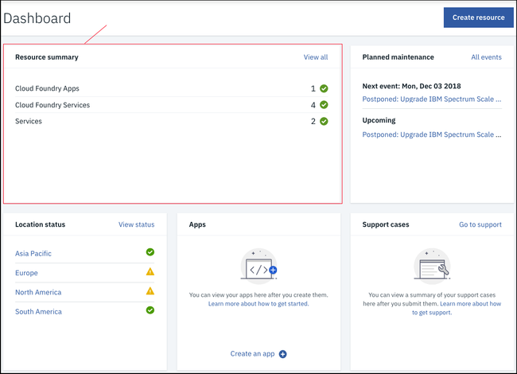
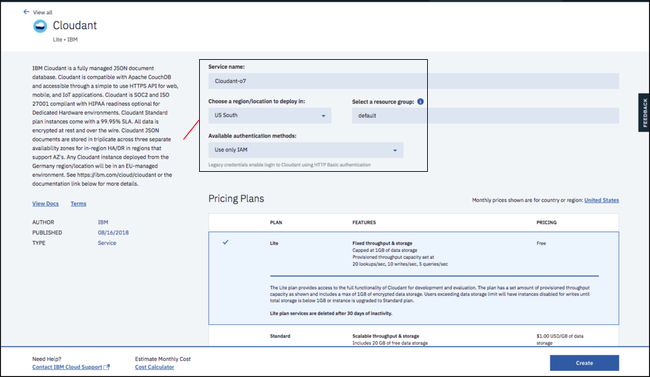
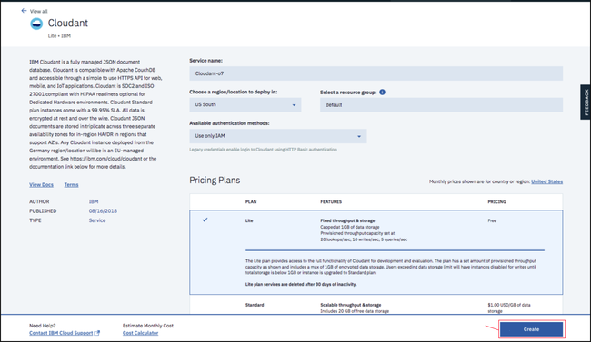
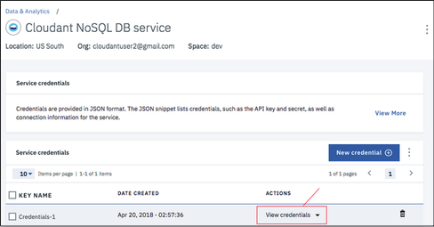
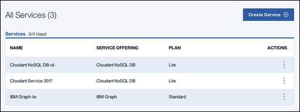
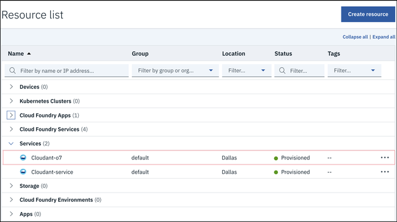

---

copyright:
  years: 2017, 2018
lastupdated: "2017-11-07"

---

{:new_window: target="_blank"}
{:shortdesc: .shortdesc}
{:screen: .screen}
{:codeblock: .codeblock}
{:pre: .pre}

# Creazione di un'istanza {{site.data.keyword.cloudant_short_notm}} su {{site.data.keyword.Bluemix_notm}}

Questa esercitazione mostra come creare un'istanza del servizio {{site.data.keyword.cloudantfull}}
utilizzando il dashboard {{site.data.keyword.Bluemix}}
e ti mostra dove trovare le informazioni essenziali per abilitare le tue applicazioni
ad utilizzare il database.
{:shortdesc}

Per accedere all'istanza del servizio {{site.data.keyword.cloudant_short_notm}},
hai bisogno di una serie di [Credenziali del servizio](#the-service-credentials).
Le credenziali vengono generate come parte del processo quando crei un'istanza del servizio.

Puoi anche trovare queste credenziali in qualsiasi momento, accedendo
al tuo account {{site.data.keyword.cloudant_short_notm}}.

## Creazione di un'istanza del servizio

1.  Accedi al tuo account {{site.data.keyword.Bluemix_notm}}. 
    Il dashboard {{site.data.keyword.Bluemix_notm}} può essere trovato all'indirizzo:
    [http://bluemix.net ](http://bluemix.net){:new_window}.
    Dopo l'autenticazione con i tuoi nome utente e password,
    ti viene presentato il dashboard {{site.data.keyword.Bluemix_notm}}: 
    

2.  Fai clic sul link `Catalogo`: 
     
    Viene visualizzato un elenco dei servizi disponibili in {{site.data.keyword.Bluemix_notm}}.

3.  Fai clic sulla voce `Data & Analytics` nell'intestazione `Servizi` : 
     
    Viene visualizzato un elenco dei servizi Data & Analytics
    disponibili in {{site.data.keyword.Bluemix_notm}}.

4.  Fai clic sul servizio {{site.data.keyword.cloudant_short_notm}}: 
    

5.  Nella finestra di configurazione del servizio,
    immetti un nome del servizio.
    In questo esempio,
    il nome del servizio è `Cloudant Service 2017`: 
    

6.  Per impostazione predefinita, il servizio viene creato utilizzando
    il piano dei prezzi 'Lite',
    che è gratuito ma offre capacità limitata.
    Altri piani dei prezzi,
    con maggiore capacità,
    [sono disponibili](../offerings/bluemix.html). 
    Per creare il servizio,
    fai clic sul pulsante `Create`: 
    

7.  Viene visualizzata una pagina del servizio,
    che conferma che il tuo nuovo servizio {{site.data.keyword.cloudant_short_notm}} è disponibile.
    Per accedere alle informazioni di collegamento di cui ha bisogno la tua applicazione per il collegamento al servizio,
    fai clic sulla scheda `Service Credentials`: 
    

8.  Viene visualizzata la finestra delle credenziali del servizio.
    Per visualizzare le credenziali necessarie per accedere al servizio,
    fai clic sul menu a discesa `View Credentials`: 
    

9.  Vengono visualizzati i dettagli delle credenziali del servizio: 
    

>   **Nota**: le credenziali del servizio in questi esempi
    sono state definite quando è stato creato un servizio dimostrativo {{site.data.keyword.cloudant_short_notm}} su {{site.data.keyword.cloudant_short_notm}}.
    Le credenziali vengono riprodotte qui per mostrare come dovrebbero essere visualizzate nel dashboard.
    Tuttavia,
    il servizio dimostrativo {{site.data.keyword.cloudant_short_notm}} è stato rimosso,
    per cui queste credenziali non sono più valide;
    _devi_ fornire e utilizzare le tue proprie credenziali del servizio.

## Le credenziali del servizio

>   **Nota**: e credenziali del servizio sono importanti.
    Chiunque o qualsiasi applicazione abbia accesso alle credenziali,
    può effettivamente fare qualsiasi cosa voglia con l'istanza del servizio
    ad esempio potrebbe creare dati fasulli
    o eliminare informazioni importanti.
    Proteggi queste credenziali attentamente.

Le credenziali del servizio sono composte da cinque campi:

Campo      | Scopo
-----------|--------
`host`     | Il nome host utilizzato dalle applicazioni per individuare l'istanza del servizio.
`username` | Il nome utente obbligatorio alle applicazioni per accedere all'istanza del servizio.
`password` | La password obbligatoria alle applicazioni per accedere all'istanza del servizio.
`port`     | Il numero di porta HTTP per l'accesso all'istanza del servizio sull'host. Normalmente 443 per forzare l'accesso HTTPS.
`url`      | Una stringa di aggregazione delle altre informazioni sulle credenziali in un solo URL, appropriata per l'utilizzo da parte delle applicazioni.

Per creare un'applicazione che possa accedere alla tua istanza del servizio,
hai bisogno di queste credenziali.

## Individuazione delle tue credenziali del servizio

In qualsiasi momento,
puoi trovare le credenziali per un servizio associato al tuo account.

1.  Inizia accedendo a {{site.data.keyword.cloudant_short_notm}}.
    Il dashboard {{site.data.keyword.Bluemix}} può essere trovato all'indirizzo:
    [http://bluemix.net ](http://bluemix.net){:new_window}.
    Dopo l'autenticazione con i tuoi nome utente e password,
    ti viene presentato il dashboard {{site.data.keyword.Bluemix_notm}}: 
    

2.  Scorri nel dashboard,
    finché non raggiungi la sezione che elenca tutti i tuoi servizi: 
    

3.  In questo esempio,
    vogliamo trovare le credenziali del servizio per l'istanza del servizio {{site.data.keyword.cloudant_short_notm}}
    creata precedentemente nell'esercitazione,
    denominata `Cloudant Service 2017`.
    Fai clic sulla riga corrispondente: 
    

3.  Viene visualizzata la finestra delle credenziali del servizio.
    Per visualizzare le credenziali necessarie per accedere al servizio,
    fai clic sul menu a discesa `View Credentials`: 
    

4.  Vengono visualizzati i dettagli delle credenziali del servizio: 
    

>   **Nota**: le credenziali del servizio in questi esempi
    sono state definite quando è stato creato un servizio dimostrativo {{site.data.keyword.cloudant_short_notm}} su {{site.data.keyword.cloudant_short_notm}}.
    Le credenziali vengono riprodotte qui per mostrare come dovrebbero essere visualizzate nel dashboard.
    Tuttavia,
    il servizio dimostrativo {{site.data.keyword.cloudant_short_notm}} è stato rimosso,
    per cui queste credenziali non sono più valide;
    _devi_ fornire e utilizzare le tue proprie credenziali del servizio.
