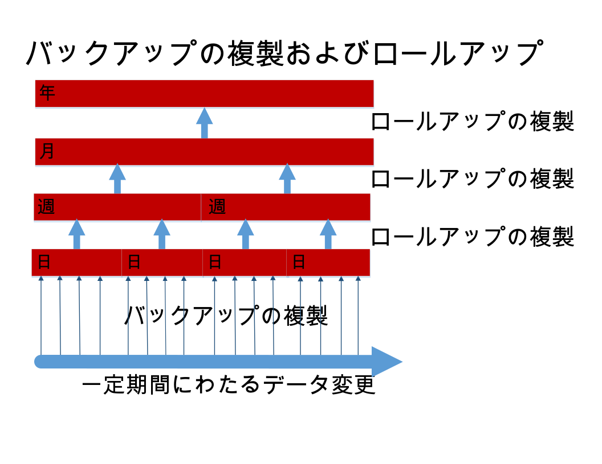

---

copyright:
  years: 2015, 2017
lastupdated: "2017-05-04"

---

{:new_window: target="_blank"}
{:shortdesc: .shortdesc}
{:screen: .screen}
{:codeblock: .codeblock}
{:pre: .pre}

# データのバックアップ

>   **注**: このガイドでは、*非推奨の*日次増分バックアップ機能 (以前、Enterprise のお客様が要求した場合にのみ利用可能であった機能) について説明します。現在のバックアップのガイダンスについては、『[災害復旧およびバックアップ](disaster-recovery-and-backup.html)』のガイドを参照してください。
この機能は、以下のとおりです。
-   デフォルトでは、有効になっていません。
-   Enterprise のお客様のみが使用可能であり、特別に要求する必要があります。
-   運用前に明示的に構成する必要があります。
-   [既知の制限](#known-limitations)を受けます。
-   [Cloudant Local ](https://www.ibm.com/support/knowledgecenter/SSTPQH_1.0.0/com.ibm.cloudant.local.doc/SSTPQH_1.0.0_welcome.html){:new_window} には適用できません。
詳しくは、[IBM Cloudant サポート・チーム ](mailto:support@cloudant.com){:new_window} にお問い合わせください。

>   **注**: 日次増分バックアップ機能は、[Cloudant Local ](https://www.ibm.com/support/knowledgecenter/SSTPQH_1.0.0/com.ibm.cloudant.local.doc/SSTPQH_1.0.0_welcome.html){:new_window} に対しては適用できません。Cloudant Local でデータをバックアップするには、[複製](../api/replication.html)を使用して、データベースのコピーを作成します。
高可用性を確保するために、{{site.data.keyword.cloudant}} は各文書の 3 つのコピーを作成し、クラスター内の異なる 3 つのサーバーに保管します。
このプラクティスは、すべての Cloudant ユーザーに対してデフォルトです。
データは、3 重に複製されていますが、それでもバックアップすることが重要です。

バックアップはどうして重要なのでしょうか。
一般的に、多くの形でデータへのアクセスが失われる可能性があります。
例えば、ハリケーンでデータ・センターが破壊され、3 つすべてのノードがその場所にあった場合、データは失われます。
異なる地理的位置にあるクラスター (専用またはマルチテナント) にデータを複製することで、災害時にデータが失われることを防止できます。
ただし、欠陥のあるアプリケーションがデータベース内のデータを削除したり上書きしたりした場合、重複データは役立ちません。

テスト済みの包括的なバックアップを用意しておくと、データが失われたり破損したりしたときにどのようにリストアすべきかという問題に安心して対応できます。

Cloudant では、Enterprise のお客様は、日次増分バックアップを使用できます。

Enterprise のお客様でない場合、あるいは独自のバックアップ・メカニズムを作成する場合は、[複製を使用したバックアップの実行](disaster-recovery-and-backup.html)を検討してください。

>   **注**: 現在、Enterprise のお客様用の日次増分バックアップは、*ベータ* 機能です。
デフォルトでは、有効になっていません。
日次増分バックアップ (「差分」) では、文書を比較したり、簡単に単一の文書をリストアしたりすることができます。
構成可能な定期的な間隔で、小さな日次の差分は、週次の差分にロールアップされます。
同様に、週次の差分は月次の差分にロールアップされ、月次の差分は年次の差分にロールアップされます。
差分をロールアップするこのプロセスは、リストアできる文書のバージョンの正確性と必要なストレージ・スペース量の間の実用的な妥協点です。

バックアップ機能により、個別の文書を手動でリストアできます。
(例えば、災害復旧シナリオの一環として) データベース全体をリストアする場合は、サポート・チームに連絡して、使用可能な差分に従い、特定の日、週、年、または年にデータを復旧できます。

Cloudant がデータをバックアップする方法について詳しくは、このトピックの残りの部分で説明します。
追加の支援が必要な場合、あるいはデータのバックアップの有効化を要求する場合は、Cloudant サポート・チーム ([support@cloudant.com ](mailto:support@cloudant.com){:new_window}) に連絡してください。

>   **注**: Cloudant のバックアップ機能は、Enterprise のお客様のみが使用できます。

>   **注**: デフォルトでは、`_design` 文書は、バックアップされないため、増分バックアップ・データベースでは、索引は作成_されません_。`_design` 文書をバックアップする必要がある場合は、任意のソース制御ツールで該当文書を保持する必要があります。
## 概念

バックアップの概念について言及する際には、以下の用語を理解しておくと役立ちます。

用語                 | 意味
---------------------|--------
バックアップのクリーンアップ (Backup cleanup)       | 差分データベースがロールアップされた場合、構成可能な期間の経過後に差分データベースは削除される。これにより、細かい細分度でデータの保存とストレージのコストとのバランスを取ることができる。
バックアップのロールアップ (Backup rollup)          | 日次のバックアップは、週次のロールアップ・データベースに結合される。これにより、日次の差分が粗い (細分度が低い) バックアップに結合される。同様に、週次のデータベースは、月次のデータベースにロールアップされ、月次のデータベースは年次のデータベースにロールアップされる。
バックアップ実行 (Backup run)                      | バックアップ期間に、ソース・データベースは、そのバックアップ期間中に変更された文書を判別するためのシーケンス値を使用して複製される。完了すると、この複製は、日次バックアップと呼ばれる。
ベースライン・バックアップ (Baseline backup)        | 差分データベースの比較基準となる文書のコレクション。
日次バックアップ (Daily backup)                     | 「バックアップ実行 (Backup run)」を参照。
日次の差分 (Daily delta)                            | 日次バックアップの別の名前。
差分データベース (Delta database)                   | 特定の期間に変更された文書のコレクション (「差分」)。
高い/低い細分度 (High/low granularity)              | これは、文書の変更の期間を指定できる精度を示す。高い細分度のロールアップは、変更の期間の時間尺度が短い (例えば、日次バックアップの場合の 1 日)。低い細分度のロールアップは、変更の期間の時間尺度が長い (例えば、年次バックアップの場合の 1 年)。
増分バックアップ (Incremental backup)               | 最後のバックアップ以降にデータベースで変更された文書のコレクション。
ロールアップ (Roll up)                              | 増分バックアップのコレクションを低い細分度のバックアップに集約すること。例えば、週の日次バックアップを単一の「週次」バックアップに集約する。

## 増分バックアップ

増分バックアップを有効にする際の最初のステップでは、データベース全体のフルバックアップを実行します。
これは、後続の増分バックアップの「ベースライン」となります。

最初の「ベースライン」バックアップの後、毎日、日時増分バックアップを実行します。
この日次増分バックアップには、最後のバックアップ以降にデータベースで変更されたデータのみが含まれます。
日次バックアップは、「日次の差分」です。

データ・バックアップの有効化要求の一環として、バックアップを実行する時刻を指定できます。
日次の差分は、毎日、指定された時刻に作成されます。

## ロールアップ

ロールアップでは、日次バックアップを週次ロールアップ・データベースに結合します。
このロールアップ・データベースは、日次の差分を粗い (「細分度が低い」) タイム・スライスに結合します。
週次データベースは、月次データベースにロールアップされ、月次データベースは年次データベースにロールアップされます。



バックアップの有効化を要求する際、保持する日次の差分の数を指定する必要があります。
この数に達すると、最も古い日次の差分が、最新の週次データベースにロールアップされます。
その後、週次データベースがロールアップされて月次データベースが作成され、その後も同様に進みます。

差分データベースは、ロールアップされると、ストレージ・スペースを解放するために削除されます。

## リストア

データベース用のバックアップがある場合、そのデータベース内の個別の文書を表示できます。また、その文書に対して行われた変更を確認することもできます。
特定の日付におけるバージョンに文書をリストアすることもできます (差分の細分度内で使用可能な場合)。

>   **注**: 文書は、バックアップからリストアする前に静的になっている必要があります。
つまり、文書が継続的に変更や更新を受け取っていてはなりません。
フルデータベース・リストアなどの複雑なリストアについては、[Cloudant サポート ](mailto:support@cloudant.com){:new_window} に支援を要求してください。

## ダッシュボードの使用

Enterprise のお客様は、Cloudant ダッシュボードを使用して、バックアップの状況および履歴を確認できます。

以下のタスクを実行できます。

-   最後のバックアップの状況 (日時など) を表示する。
-   日時ごとのバックアップ文書バージョンのリストを表示する。
-   現行文書、および現行文書と任意のバックアップ・バージョンとの差異を表示する。
-   バックアップ・バージョンから文書をリストアする。

### データベース・バックアップ状況の表示


Cloudant ダッシュボード内で「データベース」タブを選択すると、各データベースのバックアップ状況列を確認できます。

### 文書バックアップ状況の表示


データベース内で、特定の文書のバックアップ状況を表示できます。
これを行うには、まず、文書のバックアップ・アイコン () があるかどうかを確認します。
これは、特定の文書がバックアップ・タスクに含まれているかどうかを示します。

文書を選択すると、バックアップ・タブを確認できます。


### 文書バックアップ・バージョン間の差異の表示とリストア


文書のバックアップ・タブをクリックすると、文書の現行バージョンと任意の他のバックアップ・バージョンとの差異を確認できます。

その文書の特定のバックアップ・バージョンをリストアすることに決めた場合、単にリストアするバックアップの日付を選択し、「リストア (Restore)」ボタンをクリックしてください。

>   **注**: 文書は、バックアップからリストアする前に、安定した状態でなければなりません。
つまり、文書が継続的に変更や更新を受け取っていてはなりません。
## API の使用

Cloudant バックアップ機能を処理するために、多数の REST API 呼び出しが使用可能です。

### タスクの構成

`task` 呼び出しは、ユーザーのバックアップ・タスク構成を取得します。

`format` パラメーターを使用して、応答で使用されるフォーマットを指定できます。

_ユーザーのバックアップ・タスク構成を要求し、HTTP を使用して、リスト・フォーマット (デフォルト) で結果を返す例:_

```http
GET /_api/v2/backup/task HTTP/1.1
```
{:codeblock}

_ユーザーのバックアップ・タスク構成を要求し、コマンド・ラインを使用して、リスト・フォーマット (デフォルト) で結果を返す例:_

```sh
curl https://$ACCOUNT.cloudant.com/_api/v2/backup/task \
    -X GET
```
{:codeblock}

_ユーザーのバックアップ・タスク構成を要求し、HTTP を使用して、マッピング・フォーマットで結果を返す例:_

```http
GET /_api/v2/backup/task?format=mapping HTTP/1.1
```
{:codeblock}

_ユーザーのバックアップ・タスク構成を要求し、コマンド・ラインを使用して、マッピング・フォーマットで結果を返す例:_

```sh
curl https://$ACCOUNT.cloudant.com/_api/v2/backup/task?format=mapping \
     -X GET
```
{:codeblock}

デフォルトの応答フォーマットは、リストです。
`...backup/task?format=list` パラメーターを使用して、このフォーマットを直接要求できます。
応答には、ユーザーに対して定義されているバックアップ・タスクのシンプルなリストが含まれます。

例えば、以下のいずれかのコマンドを使用して、リスト・フォーマットの応答を要求できます。

```http
https://$ACCOUNT.cloudant.com/_api/v2/backup/task

https://$ACCOUNT.cloudant.com/_api/v2/backup/task?format=list
```
{:codeblock}

_リスト・フォーマット要求後の応答の例:_

```json
{
    "rows": [
          {
              "username": "$ACCOUNT",
            "task": "backup-0d0b0cf1b0ea42179f9c082ddc5e07cb",
            "source_db": "backmeup",
            "latest_completion": null
        },
        {
            "username": "$ACCOUNT",
        "task": "backup-d0ea6e8218074699a562af543db66615",
        "source_db": "backuptest",
        "latest_completion": "2016-01-17T05:57:44+00:00"
    },
        {
            "username": "$ACCOUNT",
            "task": "backup-24cd8359b94640be85b7d4071921e781",
            "source_db": "taskdb",
            "latest_completion": "2016-01-17T00:01:04+00:00"
        }
    ]
}
```
{:codeblock}

より包括的な応答がマッピング・フォーマットで使用可能です。
`...backup/task?format=mapping` パラメーターを使用して、このフォーマットを直接要求できます。

例えば、以下のコマンドを使用して、マッピング・フォーマットの応答を要求できます。

```http
https://$ACCOUNT.cloudant.com/_api/v2/backup/task?format=mapping
```
{:codeblock}

_マッピング・フォーマット要求後の応答の例:_

```json
{
    "backmeup": {
        "username": "$ACCOUNT",
        "task": "backup-0d0b0cf1b0ea42179f9c082ddc5e07cb",
        "source_db": "backmeup",
        "latest_completion": null
    },
    "backuptest": {
        "username": "$ACCOUNT",
        "task": "backup-d0ea6e8218074699a562af543db66615",
        "source_db": "backuptest",
        "latest_completion": "2016-01-17T05:57:44+00:00"
    },
    "taskdb": {
        "username": "$ACCOUNT",
        "task": "backup-24cd8359b94640be85b7d4071921e781",
        "source_db": "taskdb",
        "latest_completion": "2016-01-17T00:01:04+00:00"
    }
}
```
{:codeblock}

### 特定のデータベースのバックアップ・タスクの判別

`task` 要求の `databases` パラメーターは、特定のデータベースに関連付けられているバックアップ・タスクを検出するために使用します。

応答は、`source_db` フィールドで識別されたデータベースのバックアップ・タスク詳細をリストします。
識別された `task` は、[database listing](#list-of-databases) などの他のバックアップ API 呼び出しで使用できます。

_HTTP を使用して `backuptest` および `taskdb` データベースのバックアップ・タスクを検出するコマンドの例:_

```http
GET /_api/v2/backup/task?databases=backuptest,taskdb HTTP/1.1
```
{:codeblock}

_コマンド・ラインを使用して `backuptest` および `taskdb` データベースのバックアップ・タスクを検出するコマンドの例:_

```sh
curl https://$ACCOUNT.cloudant.com/_api/v2/backup/task?databases=backuptest,taskdb \
    -X GET
```
{:codeblock}

_特定のデータベースのバックアップ・タスクの検出に対する応答の例:_

```json
{
    "rows": [
          {
              "username": "$ACCOUNT",
        "task": "backup-d0ea6e8218074699a562af543db66615",
        "source_db": "backuptest",
        "latest_completion": "2016-01-17T05:57:44+00:00"
    },
        {
            "username": "$ACCOUNT",
            "task": "backup-24cd8359b94640be85b7d4071921e781",
            "source_db": "taskdb",
            "latest_completion": "2016-01-17T00:01:04+00:00"
        }
    ]
}
```
{:codeblock}

### データベースのリスト

`monitor` 要求は、文書 `$DOCID` も含まれた、バックアップ・タスク `$TASKNAME` によって作成されたデータベースのリストを取得します。

この要求では、オプションの引数 `include_docs` がサポートされます。
デフォルト値は `false` です。`true` に設定されている場合、`monitor` 要求は、`$DOCID` が含まれている各バックアップ・データベースの完全な文書の内容を返します。

_HTTP を使用した、特定の文書が含まれている、バックアップ・タスクによって作成されたデータベースのリストの取得:_

```http
GET /_api/v2/backup/monitor/$TASKNAME/$DOCID?include_docs=true HTTP/1.1
```
{:codeblock}

_コマンド・ラインを使用した、特定の文書が含まれている、バックアップ・タスクによって作成されたデータベースのリストの取得:_

```sh
curl https://$ACCOUNT.cloudant.com/_api/v2/backup/monitor/$TASKNAME/$DOCID?include_docs=true \
    -X GET
```
{:codeblock}

### 文書のリストア

`restore` 呼び出しは、ソース・データベースからの、`$DOCID` で指定された文書を置き換えます。
ソース・データベースは、`$TASKNAME` で指定されます。
`$TASKDATE` は、特定のバックアップのタイム・スタンプであり、いつバックアップが実行されたのかを示します。
`$FREQUENCY` は、以下の 4 つの値のいずれかです。
-   `"daily"`
-   `"weekly"`
-    `"monthly"`
-   `"yearly"`

>   **注**: 文書は、バックアップからリストアする前に、安定した状態でなければなりません。
つまり、リストアの進行中に文書が変更や更新を受け取っていてはなりません。
_HTTP を使用した文書のリストア要求の例:_

```http
POST /_api/v2/backup/restore/document --data=@RESTORE.json HTTP/1.1
Content-Type: application/json
```
{:codeblock}

_コマンド・ラインを使用した、特定のバックアップ・データベースで保持されている最新バージョンからの文書のリストア要求の例:_

```sh
curl https://$ACCOUNT.cloudant.com/_api/v2/backup/restore/document --data=@RESTORE.json \
    -X POS \
    -H "Content-Type: application/json" \
    -d "$JSON"
```
{:codeblock}

_特定のバックアップ・データベースに保持されている最新のバージョンから文書をリストアするように要求する JSON 文書の例:_

```json
{
    "doc_id": $DOCID,
    "task_name": $TASKNAME,
    "task_date": $TASKDATE,
    "frequency": $FREQUENCY
}
```
{:codeblock}

## 増分複製を使用したバックアップの仕組み

バックアップの非常にシンプルな形式では、データベースを日付付きバックアップ・データベースに[複製](../api/replication.html)します。

この方法は効果的で、実行するのが簡単です。
ただし、データベースが大規模で、複数のポイント・イン・タイムのバックアップ (例えば、日次バックアップが 7 つ、週次バックアップが 4 つ) が必要な場合、各新規バックアップ・データベースにすべての文書の完全なコピーを保管することになります。
これには恐らく、大量のストレージ・スペースが必要になります。

最後のバックアップ以降に変更された文書のみを保管するのには、増分バックアップが優れたソリューションです。

最初、データベース全体のバックアップを実行します。
最初のバックアップ以降は、定期的な増分バックアップを実行して、最後のバックアップ以降にデータベースで変更された内容のみをバックアップします。
通常、この増分バックアップは、1 日に 1 回行われるため、この複製は日次バックアップです。

増分バックアップでは、バックアップ間の差分のみが保存されます。
定期的な間隔で、ソース・データベースはターゲット・データベースに複製されます。
複製では、シーケンス値を使用して、各間隔期間に変更された文書を識別します。

バックアップ操作は複製を使用して、チェックポイントを取得および保管します。
このチェックポイントは、内部名を持つ別のデータベースです。

データベースの複製プロセスは、`since_seq` パラメーターの値を検出することから開始します。
このパラメーターは、最後の複製がどこで終了したのかを示します。

>   **注**: 本質的に、`since_seq` オプションを使用すると、通常の複製チェックポイント機能が無効になります。`since_seq` を使用する際には、必ず注意してください。 

以下のステップでは、増分バックアップがどのように作成されるのかの概要を示します。

1.  [最後の複製のチェックポイント文書の ID を検出する。](#find-the-id-of-the-checkpoint-document-for-the-last-replication)
2.  [`recorded_seq` の値を取得する。](#get-the-recorded_seq-value)
3.  [増分バックアップを実行する。](#run-an-incremental-backup)

### 最後の複製のチェックポイント文書の ID を検出する

チェックポイント ID 値は、`_replicator` データベース内の複製文書の `_replication_id` フィールドに保管されます。

_HTTP を使用した、`original` という名前のデータベースの最後の増分バックアップのチェックポイント ID を取得する要求の例:_

```http
GET /_replicator/original HTTP/1.1
```
{:codeblock}

_コマンド・ラインを使用した、`original` という名前のデータベースの最後の増分バックアップのチェックポイント ID を取得する要求の例:_

```sh
replication_id=$(curl "${url}/_replicator/original" | jq -r '._replication_id')
```
{:pre}

### `recorded_seq` の値を取得する

チェックポイント ID を取得した後に、その ID を使用して、original データベース内の `/_local/${replication_id}` 文書にある history 配列の最初の要素から `recorded_seq` の値を取得します。

_HTTP を使用した、`original` という名前のデータベースから `recorded_seq` の値を取得する例:_

```http
GET /original/_local/${replication_id} HTTP/1.1
```
{:codeblock}

_コマンド・ラインを使用した、`original` という名前のデータベースから `recorded_seq` の値を取得する例:_

```sh
recorded_seq=$(curl "${url}/original/_local/${replication_id}" | jq -r '.history[0].recorded_seq')
```
{:pre}

### 増分バックアップを実行する

チェックポイント ID と `recorded_seq` の取得が終わったので、新規増分バックアップを開始できます。

_HTTP を使用した、`newbackup` という名前の増分データベースへの新規増分バックアップを開始する例:_

```http
PUT /_replicator/newbackup HTTP/1.1
Content-Type: application/json
```
{:codeblock}

_コマンド・ラインを使用した、`newbackup` という名前の増分データベースへの新規増分バックアップを開始する例:_

```sh
curl -X PUT "${url}/_replicator/newbackup" -H "${ct}" -d @newbackup.json
```
{:codeblock}

_増分バックアップを指定する JSON ファイルの例:_

```json
{
    "_id": "newbackup",
    "source": "${url}/original",
    "target": "${url}/newbackup",
    "since_seq": "${recorded_seq}"
}
```
{:codeblock}

## 既知の制限

>   **注**: 現在、Enterprise のお客様用の日次増分バックアップは、ベータ機能です。
デフォルトでは、有効になっていません。
-   IBM Cloudant バックアップおよび関連リストア機能は、基盤の複製テクノロジーに基づいています。複製に影響する (さらには複製を妨害する) 要因が、バックアップまたはリストア・プロセスに影響する (さらにはプロセスを停止する) ことがあります。
-   大規模データベース (例えば、サイズが 100 GB を超えるものなど) では、バックアップおよびリストア・プロセスに長時間がかかることがあります。これは、最初のバックアップに当てはまり、大規模データベースでは完了するまでに数日かかることがあります。同様に、リストア・プロセスの場合も、データベースのサイズに応じて、数時間から数日かかることがあります。
-   大規模な日次バックアップの場合、バックアップ・プロセスが 1 日 (24 時間) で完了できない可能性があります。バックアップ・プロセスは通常、完了するまで実行されるため、1 日を超える増分的変更が含まれることになります。
-   現在、完全なユーザー・アカウントをバックアップするためのサポートはありません。代わりに、バックアップまたはリストアで有効にするユーザー・アカウント内の各データベースを指定する必要があります。現在、任意の 1 つのユーザー・アカウント内でバックアップを有効にできるデータベース数は 50 までという制限があります。
-   現在、IBM Cloudant バックアップ機能では、[設計文書](../api/design_documents.html)のバックアップおよびリストアはサポートされません。設計文書をバックアップする必要がある場合は、任意のソース制御ツールで該当文書を保持する必要があります。

-   現在、データベース・リストアを実行するためのターゲット・データベースは、元のソース・データベースとは異なるものでなければなりません。
