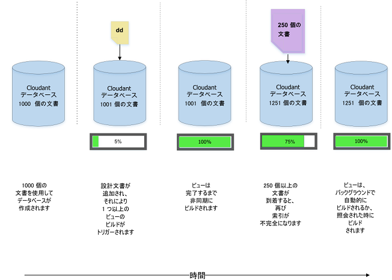
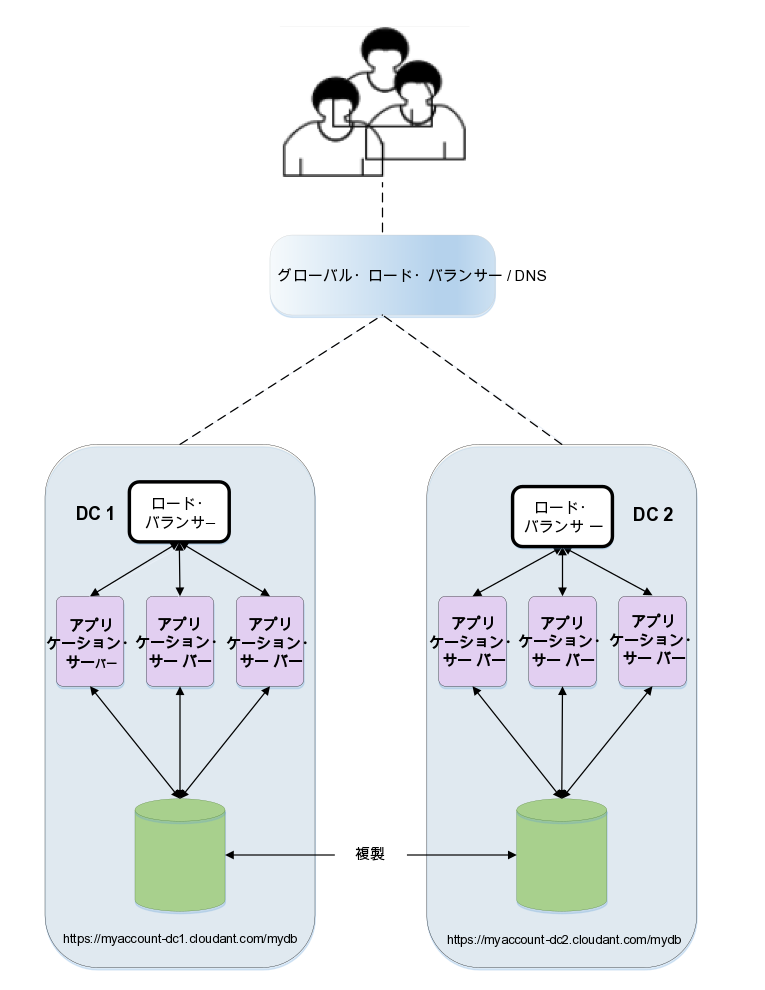

---

copyright:
  years: 2015, 2019
lastupdated: "2019-06-12"

keywords: multiple views, changes, versioned design documents, move and switch, the stale parameter

subcollection: cloudant

---

{:new_window: target="_blank"}
{:shortdesc: .shortdesc}
{:screen: .screen}
{:codeblock: .codeblock}
{:pre: .pre}
{:tip: .tip}
{:note: .note}
{:important: .important}
{:deprecated: .deprecated}

<!-- Acrolinx: 2017-05-10 -->

# 設計文書の管理
{: #design-document-management}

*IBM Cloudant の Developer Advocate である Glynn Bird によって提供された記事[glynn@cloudant.com ](mailto:glynn@cloudant.com){: new_window}*

{{site.data.keyword.cloudantfull}} のスケーラブルな JSON データ・ストアには複数の照会メカニズムがあります。それらはすべて、コア・データとは別に作成および維持される索引を生成します。
索引付けは、文書が保存されると即時実行されるわけではありません。
代わりに、後で実行するようにスケジュールに入れられ、より高速でノンブロッキングの書き込みスループットを提供します。

-   MapReduce ビューは、キーまたはキー範囲による効率的な検索のために B ツリー内に保管されるキー/値ペアを持つデータ・セットの索引です。
-   フリー・テキスト検索、ファセッティング照会、および複雑なアドホック照会を可能にするために、検索索引は Apache Lucene を使用して作成されます。

{{site.data.keyword.cloudant_short_notm}} の[検索索引](/docs/services/Cloudant?topic=cloudant-search#search)と [MapReduce ビュー](/docs/services/Cloudant?topic=cloudant-views-mapreduce#views-mapreduce)は、
設計文書をデータベースに追加して構成されます。
設計文書は、ビューまたは索引の作成方法に関する指示を含む JSON 文書です。
単純な例を見てみましょう。
以下の例のような、単純なデータ文書コレクションがあると仮定します。

_単純なデータ文書の例:_

```json
{
    "_id": "23966717-5A6F-E581-AF79-BB55D6BBB613",
    "_rev": "1-96daf2e7c7c0c277d0a63c49b57919bc",
    "doc_name": "Markdown Reference",
    "body": "Lorem Ipsum",
    "ts": 1422358827
}
```
{: codeblock}

各データ文書には、名前、本文、およびタイム・スタンプが含まれています。
[MapReduce ビュー](/docs/services/Cloudant?topic=cloudant-views-mapreduce#views-mapreduce)を作成してタイム・スタンプで文書をソートしたいと考えます。

以下の例のように、マップ関数を作成して実行することができます。

_文書のタイム・スタンプ・フィールド (ある場合) を返すマップ関数の例:_

```javascript
function(doc) {
    if (doc.ts) {
        emit( doc.ts, null);
    }
}
```
{: codeblock}

この関数は文書のタイム・スタンプを排出するため、それを索引のキーとして使用できます。索引の値には興味がないため、`null` が排出されます。
この結果として、時刻で順序付けされた索引が文書セットに提供されます。

このビューを "`by_ts`"
と呼び、以下の例のように、"`fetch`"
という名前の設計文書に入れます。

_マップ関数を使用してビューを定義する設計文書の例:_

```json
{
    "_id": "_design/fetch",
    "views": {
      "by_ts": {
        "map": "function(doc) {
          if (doc.ts) {
            emit( doc.ts, null);
    }
        }"
      }
    },
    "language": "javascript"
}
```
{: codeblock}

この結果として、マップ・コードは JSON 準拠のストリングに変換され、
設計文書に組み込まれます。

設計文書が保存されると、
{{site.data.keyword.cloudant_short_notm}} はサーバー・サイド・プロセスをトリガーして `fetch/by_ts` ビューを作成します。
{{site.data.keyword.cloudant_short_notm}} はデータベース内のすべての文書で反復処理を行い、それぞれを Javascript のマップ関数に送信することによってこれを実行します。
この関数は、排出されたキー/値ペアを返します。
反復が継続されるにつれて、各キー/値ペアが B ツリー索引に保管されます。
初めて索引が作成された後、後続の再索引付けは、新規文書および更新された文書に対してのみ行われます。
削除された文書は、索引付けから除外されます。
以下の図に示すように、この時間節約プロセスは *増分 MapReduce* と呼ばれます。



この時点では以下のことを覚えておいてください。

-   索引の作成は非同期で行われる。
    {{site.data.keyword.cloudant_short_notm}} は設計文書が保存されていることを確認しますが、
    索引作成の進行状況を確認するには、
    {{site.data.keyword.cloudant_short_notm}} の [`_active_tasks`](/docs/services/Cloudant?topic=cloudant-active-tasks#active-tasks) エンドポイントをポーリングする必要があります。
-   データ量が多いほど、索引の準備ができるまでの時間は長くなる。
-   初期索引作成の進行中、_その索引に対して行われた照会はすべてブロックされる_。
-   ビューを照会すると、まだ増分で索引付けされていない文書の「マッピング」がトリガーされる。
    これにより、データの最新ビューの取得が確保されます。
    この規則の例外については、以下の[「`stale`」パラメーター](#the-stale-parameter)の説明を参照してください。

## 同じ設計文書内の複数のビュー
{: #multiple-views-in-the-same-design-document}

同じ設計文書に複数のビューを定義すると、それらは効率的に同時に作成されます。
各文書の読み取りは 1 回のみ行われ、各ビューのマップ関数を通じて渡されます。
この方法のマイナス点は、設計文書を変更すると、その文書に定義されている_すべての既存の MapReduce ビューが無効化される_ことです。これは、それらのビューのいくつかが未変更のままでも変わりません。 

MapReduce ビューを互いに独立して変更する必要がある場合は、それらの定義を別々の設計文書に入れます。 

この動作は、Lucene 検索索引には適用されません。 それらの索引は、同じ設計文書内の他の未変更の索引を無効化せずに、同じ文書内で変更できます。
{: note}


## 設計文書に対する変更の管理
{: #managing-changes-to-a-design-document}

将来のある時点でビューの設計の変更を決断すると想像してください。
その時、実際のタイム・スタンプ結果を返す代わりに、関心があるのは、何個の文書が基準に一致するかというカウントだけです。
これを達成するには、マップ関数は同じままで、"`_count`" の _reduce_ を使用します。
この結果、設計文書は以下の例のようになります。

_reduce 関数を使用する設計文書の例:_

```json
{
    "_id": "_design/fetch",
    "_rev": "2-a2324c9e74a76d2a16179c56f5315dba",
    "views": {
        "by_ts": {
            "map": "function(doc) {
                if (doc.ts) {
                  emit( doc.ts, null);
    }
            }
        }",
        "reduce": "_count"
    },
    "language": "javascript"
}
```
{: codeblock}

この設計文書を保存すると、{{site.data.keyword.cloudant_short_notm}} は古い索引を完全に無効化し、すべての文書で順番に反復処理を行って、最初から新しい索引の作成を開始します。
元のビルドと同様に、作成にかかる時間はデータベースに含まれている文書の数によって決まり、完了するまではそのビューでの着信照会はブロックされます。

ただし、問題があります。

このビューに_リアルタイムで_アクセスしているアプリケーションがある場合、次のようなデプロイメント・ジレンマに遭遇する可能性があります。

-   古いビューが無効化されているため、
    元の設計文書に依存しているコードのバージョン 1
    は機能しない可能性がある。
-   新しいビューの作成が
    まだ終了しないため (特にデータベース内に
    多くの文書が含まれている場合)、
    新しい設計文書を使用しているコードの
    バージョン 2 をすぐにリリースできない。
-   コードに影響を与える、よる微妙な問題は、バージョン 1 とバージョン 2 がビューから異なる結果データを予期していることです。バージョン 1 は、一致する文書のリストを予期しており、一方でバージョン 2 は、結果の「削減された」カウントを予期しています。

## 設計文書に対する変更の調整
{: #coordinating-changes-to-design-documents}

この変更制御問題を処理するには 2 つの方法があります。

### バージョン管理された設計文書
{: #versioned-design-documents}

1 つの解決策は、以下のようにバージョン管理された設計文書名を使用することです。

-   コードは、最初、`_design/fetchv1` という名前のビューを使用するように作成されます。
-   新しいバージョンをリリースする時、`_design/fetchv2` という名前の新しいビューを作成し、ビューを照会して作成が開始されることを確認します。
-   新しい索引の作成作業が完了するまで `_active_tasks` をポーリングします。
-   これで、2 番目のビューに依存するコードをリリースする準備ができました。
-   もう必要ないと確信したら、`_design/fetchv1` を削除します。

後で古いバージョンを削除することを覚えている限り、バージョン管理された
設計文書の使用は、設計文書で変更制御を管理するための単純な方法です。

### 設計文書の「移動および切り替え」
{: #-move-and-switch-design-documents}

もう 1 つの方法は、{{site.data.keyword.cloudant_short_notm}} が、2 つの全く同じ設計文書があることを認識すると、既にあるビューの再作成に時間とリソースを浪費しないという事実に依存します。
つまり、設計文書 `_design/fetch` を使用し、完全な重複である `_design/fetch_OLD` を作成すると、再索引付けはトリガーされずに、両方のエンドポイントが交換可能な状態で機能します。

新しいビューへの切り替え手順は以下のとおりです。

1.  例えば、名前に `_OLD` を追加して (`_design/fetch_OLD`)、変更したい設計文書の重複コピーを作成します。
2.  `_NEW` という接尾部を持つ名前 (`_design/fetch_NEW`) を使用して、新規または「後任」の設計文書をデータベースに入れます。
3.  `fetch_NEW` ビューを照会して、作成が開始されることを確認します。
4.  `_active_tasks` エンドポイントをポーリングし、索引の作成が終了するまで待ちます。
5.  新しい設計文書の重複コピーを `_design/fetch` に入れます。
6.  設計文書 `_design/fetch_NEW` を削除します。
7.  設計文書 `_design/fetch_OLD` を削除します。

## 「移動および切り替え」のツール
{: #move-and-switch-tooling}

「移動および切り替え」手順を自動化する、「`couchmigrate`」という名前のコマンド・ライン Node.js スクリプトがあります。
これは以下のようにインストールできます。

_Node.js `couchmigrate` スクリプトをインストールするためのコマンド:_

```sh
npm install -g couchmigrate
```
{: codeblock}

`couchmigrate` スクリプトを使用するには、最初に、`COUCH_URL` という名前の環境変数を設定して CouchDB/{{site.data.keyword.cloudant_short_notm}} インスタンスの URL を定義します。

_{{site.data.keyword.cloudant_short_notm}} インスタンスの URL の定義:_

```sh
export COUCH_URL=http://127.0.0.1:5984
```
{: codeblock}

この URL は、HTTP でも HTTPS でもかまいません。また、認証資格情報を含めることができます。

_認証資格情報付きの {{site.data.keyword.cloudant_short_notm}} インスタンスの URL の定義:_

```sh
export COUCH_URL=https://$ACCOUNT:$PASSWORD@$HOST.cloudant.com
```
{: codeblock}

ファイルに保管されている、JSON フォーマットの設計文書があると仮定して、次にマイグレーション・コマンドを実行できます。

この例で、
`db` は、変更するデータベースの名前を指定し、
`dd` は、設計文書ファイルのパスを指定しています。

_`couchmigrate` コマンドの実行:_

```sh
couchmigrate --db mydb --dd /path/to/my/dd.json
```
{: pre}

このスクリプトは、戻る前にビューが作成されるまで待って、
「移動および切り替え」手順を調整します。
後任の設計文書が、現在の文書と同じ場合、スクリプトはほぼすぐに戻ります。

このスクリプトのソース・コードは、[https://github.com/glynnbird/couchmigrate ](https://github.com/glynnbird/couchmigrate){: new_window}から入手できます。

## 「`stale`」パラメーター
{: #the-stale-parameter}

索引は完了したが、新しいレコードがデータベースに追加された場合、索引はバックグラウンドで更新するようスケジュールされます。
これは、以下の図に示すデータベースの状態になります。



ビューを照会する際、次の 3 つの選択があります。

-   デフォルト動作は、応答を返す前に、索引が最新であり、データベース内に最新文書が含まれていることを確認します。
    ビューを照会すると、{{site.data.keyword.cloudant_short_notm}} は最初に 250 個の新しい文書に索引付けし、それから応答を返します。
-   代替方法は、API 呼び出しに "`stale=ok`" パラメーターを追加することです。
    このパラメーターは、「既に索引付けされているデータを返してください。最新の更新には関心がありません」という意味です。
    つまり、"`stale=ok`" を指定してビューを照会すると、{{site.data.keyword.cloudant_short_notm}} は、追加の再索引付けを行わず、即時に応答を返します。
-   2 番目の代替方法は、"`stale=update_after`" パラメーターを API 呼び出しに追加するというものです。
    このパラメーターは、「既に索引付けされているデータを返してください。_さらに_、新しい文書の再索引付けを行ってください」という意味になります。
    つまり、"`stale=update_after`" を指定してビューを照会すると、{{site.data.keyword.cloudant_short_notm}} は即時に応答を返し、次に、新しいデータの索引付けを行うバックグラウンド・タスクをスケジュールに入れます。

"`stale=ok`" または "`stale=update_after`" を追加することは、ビューからより素早く応答を得るには良い方法の可能性がありますが、鮮度が犠牲になります。 

デフォルト動作は、{{site.data.keyword.cloudant_short_notm}} クラスター内のノードにロードを均等に分散します。 `stale=ok` または `stale=update_after` の代替オプションを使用すると、結果整合セットから整合する結果を返すために、クラスター・ノードのサブセットが優遇される可能性があります。 つまり、「`stale`」パラメーターは、すべてのユース・ケースに最適な解決策ではないということです。 ただし、アプリケーションが、失効した結果を問題なく許容できるのであれば、変更が速いデータ・セットでタイムリーな応答を提供するために有用な場合があります。 データの変更の頻度が少ない場合は、"`stale=ok`" または "`stale=update_after`" を追加してもパフォーマンス上のメリットはなく、大規模なクラスターではロードが不均等に分散される可能性があります。
{: note}

`stale=ok` または `stale=update_after` の使用は、できるだけ回避するようにしてください。
この理由は、デフォルト動作は、最も新鮮なデータを提供し、クラスター内でデータを分散するからです。
大規模なデータ処理タスクが (例えば、定期的なバルク・データ更新中に) 進行中であることをクライアント・アプリに認識させることが可能であれば、アプリはこの期間、一時的に `stale=ok` に切り替え、後でデフォルト動作に戻すことができます。

`stale` オプションはまだ使用可能ですが、より有用なオプションである `stable` および `update` が使用可能なため、それらを代わりに使用する必要があります。 詳しくは、[失効したビューへのアクセス](/docs/services/Cloudant?topic=cloudant-using-views#view-freshness)を参照してください。
{: note}
