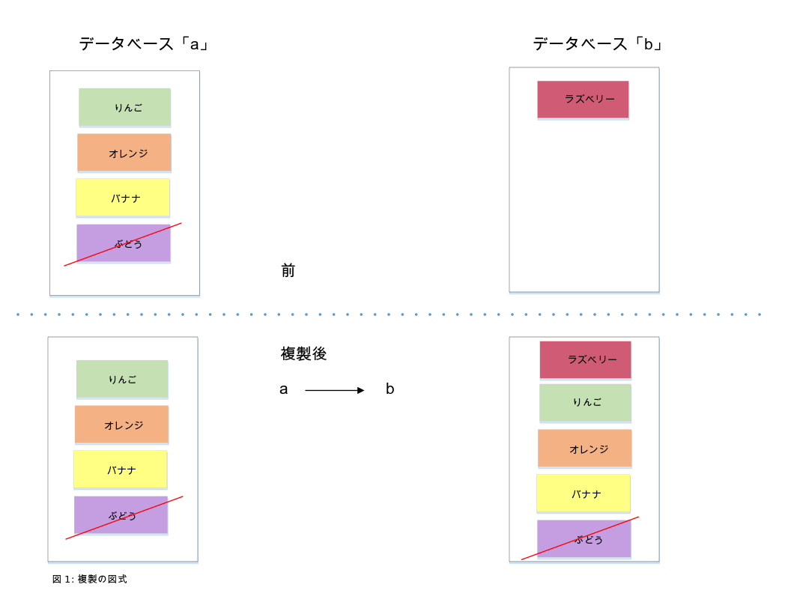
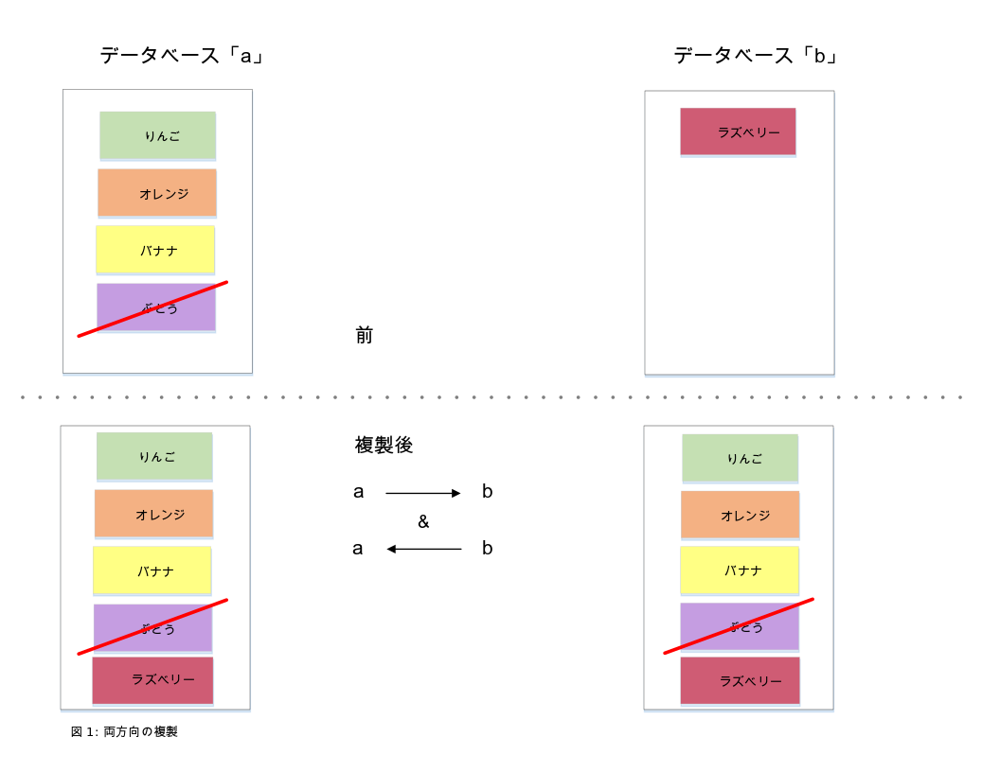

---

copyright:
  years: 2015, 2018
lastupdated: "2018-10-24"

---

{:new_window: target="_blank"}
{:shortdesc: .shortdesc}
{:screen: .screen}
{:codeblock: .codeblock}
{:pre: .pre}
{:tip: .tip}

<!-- Acrolinx: 2017-05-10 -->

# 複製

データは、同じ {{site.data.keyword.cloudantfull}} アカウント内のあるデータベースから別のデータベースへコピーしたり、あるアカウントから別のアカウントにコピーしたり、あるデータ・センターから別のデータ・センターにコピーしたりすることができます。
{:shortdesc}

データは、[{{site.data.keyword.cloudant_short_notm}} Sync ](https://cloudant.com/product/cloudant-features/sync/){:new_window} や [PouchDB ](http://pouchdb.com/){:new_window} を使用することにより、{{site.data.keyword.cloudant_short_notm}} アカウントとモバイル・デバイスの間で複製することも可能です。
複製は、「単発」操作または継続的操作として、1 方向または両方向で実行でき、パラメーターを使用して細かく調整することができます。

{{site.data.keyword.cloudant_short_notm}} の複製プロトコルは、他のさまざまなデータベースやライブラリーと互換性があるため、Internet of Things (IoT) アプリケーションおよびモバイル・アプリケーションに最適です。

このガイドでは、{{site.data.keyword.cloudant_short_notm}} の複製機能の概要を提供し、一般的なユースケースについて検討し、アプリケーションで複製を正常に行うための方法を示します。

## 複製とは?

{{site.data.keyword.cloudant_short_notm}} は、HTTP API を使用する分散型 JSON データ・ストアです。
{{site.data.keyword.cloudant_short_notm}} は、複数のクラウド上、またはユーザーのサーバー・ラック内でサービスとして実行することができます。
文書はデータベースに保管されており、{{site.data.keyword.cloudant_short_notm}} が多くのノードにわたってそのデータを入れるためのシャードを作成するサイズだけ増加できます。
複製は、ソース・データベースからターゲット・データベースへのデータのコピーです。
ソース・データベースとターゲット・データベースは、同じ {{site.data.keyword.cloudant_short_notm}} アカウント上にある必要はなく、同じデータ・センター内にある必要すらありません。



複製は、ソース内の各文書の最新バージョンが宛先データベースに転送されると完了します。
転送には、新しい文書、既存の文書の更新、および削除が含まれます。
複製後は、文書の最新バージョンだけが残り、古いバージョンは除外されます。

ソース・データベースは、最後の既知の位置から部分複製を再開できるようにするために書き込まれるチェックポイント・データ以外は未変更のままになります。
宛先データベース内の既存のデータはすべて残されます。

<div id="how-do-i-initiate-replication-via-the-dashboard-"></div>

## ダッシュボードを使用した複製の開始方法

{{site.data.keyword.cloudant_short_notm}} ダッシュボードには、複製をトリガーするための便利なユーザー・インターフェースが提供されています。
{{site.data.keyword.cloudant_short_notm}} ダッシュボードで`「複製 (Replication)」`タブをクリックし、`「複製の開始 (Start Replication)」`をクリックします。
次のフォームに入力します。


このフォームを使用して、
ソース・データベースとターゲット・データベースを定義し、
`「複製の開始 (Start Replicatation)」`をクリックします。


各複製タスクの状況は、`「複製 (Replication)」`タブをクリックすることで確認できます。
各ジョブは、進行するにしたがって`「実行中」`から`「完了」`に状態が変化します。


<div id="how-do-i-run-replication-across-different-cloudant-accounts-"></div>

## 複数の異なる {{site.data.keyword.cloudant_short_notm}} アカウントにわたる複製の実行方法

以下の例に示すように、複製のソースとターゲットは {{site.data.keyword.cloudant_short_notm}} データベースの URL です。

_複製のためのソース URL とターゲット URL の定義例:_

```json
{
    "source": "https://myfirstaccount.cloudant.com/a",
    "target": "https://mysecondaccount.cloudant.com/b"
}
```
{:codeblock}

ソースとターゲットは同じアカウント上にある必要はありません。
ソース・データベースとターゲット・データベースの名前は一致する必要はありません。
ユーザーは、ソースとターゲットの両方へのアクセスを許可されている必要があり、ターゲットへの書き込み権限を持っている必要があります。

<div id="do-i-run-replication-on-the-source-or-the-destination-"></div>

## 複製はソースで実行されるのか、それとも宛先で実行されるのか?

複製は、ソース側からも宛先側からも開始できます。
この選択は、アカウント A がアカウント B にデータをプッシュしているのか、それともアカウント B がアカウント A からデータをプルしているのかをユーザーが決められることを意味します。
場合によっては、いずれの構成でも複製を実行できない可能性があります。例えば、あるアカウントがファイアウォールによって保護されている場合などです。
複製は、HTTP または HTTPS で行われるため、非標準ポートをオープンする必要はありません。
どちらのデバイスで複製を開始するかの決定は、ユーザーが行うことになります。

<div id="how-do-i-initiate-replication-via-the-cloudant-api-"></div>

## {{site.data.keyword.cloudant_short_notm}} API を使用した複製の開始方法

すべての {{site.data.keyword.cloudant_short_notm}} アカウントには、`_replicator` という名前の特別なデータベースがあり、このデータベースに複製ジョブを挿入することができます。
複製を開始するには、`_replicator` データベースに文書を追加します。
この文書は、実行する複製を記述し、以下のフィールドを含んでいます。

フィールド           | 目的
----------------|--------
`_id`           | `_id` フィールドの指定はオプションですが、複製タスクの識別に役立ちます。 指定しない場合は、{{site.data.keyword.cloudant_short_notm}} がユーザーの代わりに値を生成します。
`source`        | ログイン資格情報を含めたソース {{site.data.keyword.cloudant_short_notm}} データベースの URL。
`target`        | ログイン資格情報を含めた宛先 {{site.data.keyword.cloudant_short_notm}} データベースの URL。
`create_target` | (オプション) 宛先データベースがまだ存在しない場合、作成するかどうかを決定します。

_HTTP を使用した複製ジョブの開始例:_

```http
POST /_replicator HTTP/1.1
Content-Type: application/json
Host: $ACCOUNT.cloudant.com
Authorization: ...
```
{:codeblock}

_コマンド・ラインを使用した複製ジョブの開始例:_

```sh
curl -X POST \
    -H 'Content-type: application/json' \
    'https://$ACCOUNT.cloudant.com/_replicator' \
    -d '@replication.json'
```
{:codeblock}

_必要な複製を記述する JSON 文書の例:_

```json
{
    "_id": "weekly_backup",
    "source": "https://$ACCOUNT:$PASSWORD@$ACCOUNT1.cloudant.com/source",
    "target": "https://$ACCOUNT:$PASSWORD@$ACCOUNT2.cloudant.com/destination",
    "create_target": true
}
```
{:codeblock}

## 複製は変更リストにどのような影響を与えるか?

[`_changes` エンドポイント](../api/database.html#get-changes)を使用して、文書に対して行われた変更のリストを取得することができます。
しかし、{{site.data.keyword.cloudant_short_notm}} データベースの分散の性質は、`_changes` のフィードによって提供される応答を、特定の日時後に発生した単純な変更リストにできないことを意味します。

[CAP 定理](cap_theorem.html)での考察で、{{site.data.keyword.cloudant_short_notm}} が「結果整合性」モデルを使用していることが明言されています。
このモデルは、ある文書について、データベースの 2 つの異なるレプリカに同時に要求を行うと、データベース・コピーの 1 つがまだ複製の完了を待っている場合、異なる結果になることがあることを意味しています。
最終的な_結果として_、データベース・コピーはそれぞれの複製を完了するため、文書に対するすべての変更はそれぞれのコピー内に存在します。

この「結果整合性」モデルには、変更リストに影響を与える以下の 2 つの特性があります。

1.  文書に影響を与える変更は、ほぼ確実に、データベースの別々のコピーで、別々の時間に行われる。
2.  変更が文書に影響を与える順序は、複製がいつ、どこから行われるかによって、データベースの別々のコピー間で異なる可能性がある。

最初の特性の結果、変更リストを要求する際、ある特定のポイント・イン・タイム後の変更のリストを要求することは無意味ということになります。
この理由は、変更リストが、異なる時間の文書更新によって作成された、異なるデータベース・コピーによって提供される可能性があるからです。
ただし、シーケンス ID を使用して指定される特定の変更後の変更リストを要求することは_意味があります_。

最初の特性の追加の結果として、変更リストの一致を得るために、以前の変更を「振り返る」必要がある場合があるというものがあります。
言い換えると、変更のリストを取得するには、複数のデータベース・コピーが一致する最新の変更から開始します。
データベース・コピー間の一致点は、データベース・コピー間の複製の同期化を可能にする[チェックポイント](#checkpoints)・メカニズムを使用して {{site.data.keyword.cloudant_short_notm}} 内で識別されます。

最後に、2 番目の特性の結果として、変更リストに現れる個別の変更は、異なるデータベース・コピーによって応答される後続の要求では、異なる順序で提示される可能性があります。
言い換えると、初期変更リストでは、`A`、`B`、`C` の順序で変更が報告される可能性があります。
しかし、後続のリストでは、`C`、`A`、`B` の順序で変更が報告される可能性があります。
すべての変更はリストされますが、順序は異なります。
この違いが発生する理由は、複製中に受け取った変更のシーケンスが、2 つのデータベース・コピーで異なる場合があるためです。

<div id="what-this-means-for-the-list-of-changes"></div>

### 変更リストにとって「結果整合性」は何を意味するか

変更リストを要求すると、どのデータベース・コピーがリストを提供するかによって、受け取る応答が異なる場合があります。

特定の更新シーケンス ID の後の変更リストを取得するために `since` オプションを使用すると、常にその更新後の変更リストを取得します。そして_さらに_、その更新より前の変更も一部取得する場合があります。
この理由は、リスト要求に応答するデータベース・コピーが、すべてのレプリカと整合している変更をリストしていることを確実にする必要があるからです。
その整合性を実現するために、そのデータベース・コピーは、すべてのコピーが一致する時点から変更リストを開始する必要がある場合があります。
この時点は、チェックポイントを使用して識別されます。

したがって、`_changes` フィードを使用するアプリケーションは[「べき等」](http://www.eaipatterns.com/IdempotentReceiver.html){:new_window}でなければなりません。
べき等とは、アプリケーションが同じデータを複数回、(および繰り返される要求に対して潜在的に異なる順序で) 安全に受信できなければならないことを意味します。

## チェックポイント

複製プロセスは内部で、ソース・データベースと宛先データベースの両方に保管される「チェックポイント」文書に状態を書き込みます。
チェックポイントにより、複製タスクを最初から開始するのではなく、停止した場所から再開することが可能になります。
チェックポイントの作成は、複製を要求する時に [`"use_checkpoints": false`](../api/replication.html#checkpoints) オプションを指定して防止することができます。
複製を最後の既知の位置から効率的に再開するには、機能をオンにしておくと有用です。

## 許可

文書を `_replicator` データベースに挿入するには管理アクセスが必要です。
ソース・パラメーターとターゲット・パラメーターに指定するログイン資格情報には、フル管理権限は必要ありません。
資格情報は以下のことができれば十分です。

-   宛先の側に文書を書き込む。
-   両方の側にチェックポイント文書を書きこむ。

{{site.data.keyword.cloudant_short_notm}} には、特別な `_replicator` ユーザー許可があります。
この許可は、チェックポイント文書の作成を許可しますが、データベースへの通常文書の作成は許可しません。
一般的に、以下を持つ [API キーを作成](../api/authorization.html#creating-api-keys)します。

-   ソース側の `_reader` および `_replicator` アクセス。
-   宛先側の `_reader` および `_writer` アクセス。

API キーは、データベースごとを基本として {{site.data.keyword.cloudant_short_notm}} ダッシュボード内に作成および構成することができます。


それらは、{{site.data.keyword.cloudant_short_notm}} API を使用して[プログラマチックに](../api/authorization.html#creating-api-keys)作成することもできます。

## 両方向の複製

データは、両方向複製または同期と呼ばれるプロセスで両方向にコピーすることができます。
この同期は、2 つの別々の複製プロセス (A から B にデータをコピーするプロセスと、B から A にデータをコピーするプロセス) をセットアップすることによって使用可能にします。
両方の複製プロセスは独立して実行され、データは両方行にシームレスに移動されます。



## 継続的複製

これまでは、すべてのソース・データがターゲット・データベースに書き込まれると終了する単発複製のみを扱っています。
継続的複製では、データは継続的にフローします。
ソース・データベースに対するすべての後続変更が、リアルタイムでターゲット・データベースに転送されます。

継続的複製は、{{site.data.keyword.cloudant_short_notm}} ダッシュボードで複製タスクを定義する時に `Make this replication continuous` チェック・ボックスをクリックするか、{{site.data.keyword.cloudant_short_notm}} API で ["`continuous`"](../api/replication.html#checkpoints) フラグを設定することによってトリガーされます。

両方向複製は、`continuous` フラグを設定することにより、1 方向または両方向で継続させることができます。

_HTTP を使用した継続的複製の開始例:_

```http
POST /_replicator HTTP/1.1
Content-Type: application/json
Host: $ACCOUNT.cloudant.com
Authorization: ...
```
{:codeblock}

_コマンド・ラインを使用した継続的複製の開始例:_

```sh
curl -X POST \
    -H "Content-type: application/json" \
    https://$ACCOUNT.cloudant.com/_replicator \
    -d @continuous-replication.json
```
{:codeblock}

_継続複製を定義する JSON 文書の例:_

```json
{
    "_id": "weekly_continuous_backup",
    "source": "https://$ACCOUNT:$PASSWORD@$ACCOUNT1.cloudant.com/source",
    "target": "https://$ACCOUNT:$PASSWORD@$ACCOUNT2.cloudant.com/destination",
    "continuous": true
}
```
{:codeblock}

## 複製のモニター

ダッシュボードまたは API を使用して、{{site.data.keyword.cloudant_short_notm}} の `_replicator` データベースの状況をいつでも確認することができます。

複製が失敗すると (例えば、認証資格情報が無効だった場合は)、エラー状態が `_replicator` 文書に記録されます。
さらに、{{site.data.keyword.cloudant_short_notm}} アカウントの `/_active_tasks` エンドポイントを使用して、複製作業を進行中に見ることができます。
詳細情報については、[ここ](../api/active_tasks.html)を参照してください。

_HTTP を使用した複製プロセスのモニター例:_

```http
GET /_replicator/weekly_backup HTTP/1.1
HOST: $ACCOUNT.cloudant.com
Authorization: ...
```
{:codeblock}

_コマンド・ラインを使用した複製プロセスのモニター例:_

```sh
curl 'https://$ACCOUNT.cloudant.com/_replicator/weekly_backup'
```
{:codeblock}

_複製の状況の要求に対する応答例:_

```json
{
    "_id": "weekly_backup",
    "_rev": "22-c57c18f7e761f1a76fa977caa03cd098",
    "source": "https://u:p@myaccount.cloudant.com/a",
    "create_target": false,
    "target": "https://u:p@myaccount.cloudant.com/b",
    "continuous": true,
    "_replication_state": "triggered",
    "_replication_state_time": "2014-12-01T15:19:01+00:00",
    "_replication_id": "4514b08cb4c2ded7da9ab04a87182ceb"
}
```
{:codeblock}

## 複製のキャンセル

実行中の複製ジョブを停止するには、ダッシュボードまたは API のいずれかを使用して `_replicator` データベースから複製文書を削除します。

_HTTP を使用した複製のキャンセル例:_

```http
DELETE /_replicator/weekly_backup?rev=22-c57c18f7e761f1a76fa977caa03cd098 HTTP/1.1
Host: $ACCOUNT.cloudant.com
Authorization:
```
{:codeblock}

_コマンド・ラインを使用した複製のキャンセル例:_

```sh
curl -X DELETE 'https://$ACCOUNT.cloudant.com/_replicator/weekly_backup?rev=22-c57c18f7e761f1a76fa977caa03cd098'
```
{:codeblock}

## その他の複製のユースケース

複製は、{{site.data.keyword.cloudant_short_notm}} 間のデータ転送のみに使用されるわけではありません。
{{site.data.keyword.cloudant_short_notm}} の複製プロトコルは、その他の、さまざまな実世界のアプリケーション用のデータベースおよびライブラリーとも互換性があります。

### Apache CouchDB

[Apache CouchDB ](http://couchdb.apache.org/){:new_window} は、{{site.data.keyword.cloudant_short_notm}} との通信が可能で、最小のセットアップを必要とするオープン・ソース・データベースです。
アプリケーションには以下が含まれます。

-   バックアップ: {{site.data.keyword.cloudant_short_notm}} から独自の CouchDB データベースにデータを複製し、アーカイブの目的で夜間にデータのスナップショットを取ります。
    安全に保持するためには、[Amazon Glacier ](https://aws.amazon.com/glacier/){:new_window} などのバックアップ・サービスにデータを送信します。
-   ローカル・ファースト・データ収集: ローカル Apache CouchDB に最初にデータに書き込み、次にそのデータを長期保管、集約、および分析のために {{site.data.keyword.cloudant_short_notm}} に複製します。

### PouchDB

[PouchDB ](http://pouchdb.com/){:new_window} は、ブラウザーと {{site.data.keyword.cloudant_short_notm}} 間で両方向のデータ複製を可能にする、オープン・ソースのインブラウザー・データベースです。
クライアント・サイドの Web ブラウザーにデータを保管すると、Web アプリケーションはインターネット接続がなくても機能します。
PouchDB は、インターネット接続がある場合、変更されたすべてのデータを {{site.data.keyword.cloudant_short_notm}} との間で同期化することができます。
クライアント・サイドからの複製のセットアップには、数行の JavaScript が必要です。

_PouchDB を使用して複製を有効にする JavaScript 例:_

```javascript
var db = new PouchDB("myfirstdatabase");
var URL = "https://u:p@username.cloudant.com/my_database");
db.sync(URL, { live: true });
```
{:codeblock}

### CloudantSync

[CloudantSync ](https://cloudant.com/cloudant-sync-resources/){:new_window} は、iOS および Android 用のライブラリーのセットです。これにより、データをモバイル・デバイスにローカルに保管し、モバイル接続で許可される時に {{site.data.keyword.cloudant_short_notm}} と同期化することができます。
　
[PouchDB](#pouchdb) と同様に、複製をセットアップするには数行のコードが必要です。

_CloudantSync を使用して複製を有効にする JavaScript 例:_

```javascript
URI uri = new URI("https://u:p@username.cloudant.com/my_database");
Datastore ds = manager.openDatastore("my_datastore");
// Replicate from the local to remote database
Replicator replicator = ReplicatorFactory.oneway(ds, uri);
// Fire-and-forget (there are easy ways to monitor the state too)
replicator.start();
```
{:codeblock}

CloudantSync は、iPhone および Android のゲームなどのモバイル・アプリケーションで幅広く使用されています。そこでは、複製によりアプリケーションの状態は {{site.data.keyword.cloudant_short_notm}} へと持続されますが、データはオフラインで使用するためにデバイス上でも使用可能です。

## フィルター処理された複製

あるデータベースから別のデータベースに複製する時に、一部のデータを複製プロセス中に削除できると便利です。
以下に例を挙げます。

-   削除された文書のすべてのトレースを削除して、ターゲット・データベースをソース・データベースより小さくする。
-   UK データをあるデータベースに保管し、US データを別のデータベースに保管するなど、データを小さいチャンクに分離する。

<div id="replication-filter-function"></div>

### 複製のフィルター関数

{{site.data.keyword.cloudant_short_notm}} のフィルター処理された複製により、戻り値を使用してデータベース内の各文書をフィルター処理するかどうかを決定する JavaScript 関数の定義が可能になります。
[フィルター関数](../api/design_documents.html#filter-functions)は、[設計文書](../api/design_documents.html)内に保管されます。

以下の例は、削除されていない文書のみの複製を許可するフィルター関数です。

_削除されていない文書を複製するためのフィルター関数例:_

```javascript
function(doc, req) {
    if (doc._deleted) {
        return false;
    }
    return true;
}
```
{:codeblock}

複製ジョブが開始されると、フィルター関数の名前が、保管されている設計文書と、フィルター関数の名前を組み合わせて指定されます。
また、`query_params` 値も指定できます。
この値は、2 番目の (`req`) 引数の `query` フィールドでフィルター関数に渡されるプロパティーを含むオブジェクトです。

_HTTP を使用した、フィルターされた複製の開始例:_

```http
POST /_replicator HTTP/1.1
Content-Type: application/json
Host: $ACCOUNT.cloudant.com
Authorization: ...
```
{:codeblock}

_コマンド・ラインを使用した、フィルターされた複製の開始例:_

```sh
curl -X POST \
    -H "Content-type: application/json" \
    https://$ACCOUNT.cloudant.com/_replicator \
    -d @filtered-replication.json
```
{:codeblock}

_フィルターされた複製を定義する JSON 文書の例:_

```json
{
    "_id": "weekly_backup",
    "source": "https://$ACCOUNT:$PASSWORD@$ACCOUNT1.cloudant.com/source",
    "target": "https://$ACCOUNT:$PASSWORD@$ACCOUNT2.cloudant.com/destination",
    "filter": "mydesigndoc/myfilter",
    "query_params": {
        "foo": "bar",
        "baz": 5
    }
}
```
{:codeblock}

## 変更フィード

{{site.data.keyword.cloudant_short_notm}} は、[`_changes` エンドポイント](../api/database.html#get-changes)からの単一 HTTP フィードを使用してデータベースに影響を与える追加、編集、および削除を発行します。
このフィードは、アプリケーションがイベントをトリガーするために使用できます。
このフィードには、例に示すように、HTTP または `curl` を使用してアクセスできます。
`feed=continuous` オプションの使用は、ストリームが、データベース内のすべての文書の最新バージョンを取得するために必要なすべての変更を提供することを意味します。

_HTTP を使用した変更フィードの照会例:_

```http
GET /$DATABASE/_changes?feed=continuous HTTP/1.1
Host: $ACCOUNT.cloudant.com
Authorization: ...
```
{:codeblock}

_コマンド・ラインを使用した変更フィードの照会例:_

```sh
curl "https://$ACCOUNT.cloudant.com/$DATABASE/_changes?feed=continuous"
```
{:codeblock}

変更は、1 つの変更につき 1 行を使用して記述されます。
各変更は、以下で構成されます。

1.  シーケンス番号 (`seq`) を含むストリング。
2.  変更された文書の ID を含むストリング。
3.  変更の配列。

文書の本体自体を表示するには、curl コマンドに `&include_docs=true` を付加します。

各変更は、以下の (簡略) 例に示されたフォーマットを使用して記述されます。

_`_changes` フィードの例:_

```json
{
    "seq":"11-g1A...c1Q",
    "id":"6f8ab9fa52c117eb76240daa1a55827f",
    "changes":[
        {
          "rev":"1-619d7981d7027274a4b88810d318a7b1"
        }
    ]
}
```
{:codeblock}

<div id="changes-feed-since"></div>

既知の位置からの変更フィードを結合するには、[`since` 引数](../api/database.html#the-since-argument) を、開始したいシーケンス番号と共に渡します。

_HTTP を使用し、`since` オプションを指定して、既知の位置の `_changes` フィードを結合する例 (簡略):_

```http
GET /$DATABASE/_changes?feed=continuous&include_docs=true&since=11-g1A...c1Q HTTP/1.1
HOST: $ACCOUNT.cloudant.com
Authorization: ...
```
{:codeblock}

_コマンド・ラインを使用し、`since` オプションを指定して、既知の位置の `_changes` フィードを結合する例 (簡略):_

```sh
curl "https://$ACCOUNT.cloudant.com/$DATABASE/_changes?feed=continuous&include_docs=true&since=11-g1A...c1Q"
```
{:codeblock}

<div id="changes-feed-since-now"></div>

現時点の変更フィードを再結合するには、`since=now` を設定します。

_HTTP を使用し、`since=now` を指定して、現時点の `_changes` フィードを結合する例:_

```http
GET /$DATABASE/_changes?feed=continuous&include_docs=true&since=now HTTP/1.1
Host: $ACCOUNT.cloudant.com
Authorization: ...
```
{:codeblock}

_コマンド・ラインを使用し、`since=now` を指定して、現時点の `_changes` フィードを結合する例:_

```sh
curl "https://$ACCOUNT.cloudant.com/$DATABASE/_changes?feed=continuous&include_docs=true&since=now"
```
{:codeblock}

_JavaScript を使用し、`since=now` を指定して、現時点の `_changes` フィードを結合する例:_

```javascript
var feed = db.follow({since: "now", include_docs: true})
feed.on('change', function (change) {
    console.log("change: ", change);
})
feed.follow();
```
{:codeblock}

プログラマチックに `_changes` データにアクセスすることは簡単です。
例えば、[{{site.data.keyword.cloudant_short_notm}} Node.js ライブラリー](../libraries/supported.html#node-js)を使用して、数行のコードで変更をフォローします。

ユースケース例としては以下のようなものがあります。

-   アプリケーション内でアクションをトリガーするためにメッセージ・キューに項目を追加する。例えば、顧客 E メールの送信など。
-   アクティビティーのリアルタイムのカウントを記録するためにメモリー内データベースを更新する。
-   SQL データベースにデータをプッシュするためにテキスト・ファイルにデータを書きこむ。

<div id="changes-feed-filtering"></div>

変更フィードは、[複製中のフィルター処理](#filtered-replication)に似た手法を使用して、フィルター関数によりフィルター処理することができます。

_HTTP を使用した変更フィードのフィルター処理の例:_

```http
GET /$DATABASE/_changes?feed=continuous&include_docs=true&since=now&filter=mydesigndoc/myfilter HTTP/1.1
Host: $ACCOUNT.cloudant.com
Authorization: ...
```
{:codeblock}

_コマンド・ラインを使用した変更フィードのフィルター処理の例:_

```sh
curl "https://$ACCOUNT.cloudant.com/$DATABASE/_changes?feed=continuous&include_docs=true&since=now&filter=mydesigndoc/myfilter"
```
{:codeblock}

    `_changes` フィード内の文書の順序は常に同じではありません。 つまり、変更は、厳密な時間順序で現れない可能性があります。 この理由は、複数の {{site.data.keyword.cloudant_short_notm}} ノードからデータが返され、結果整合性のルールが適用されるからです。
    {: tip}

## 複製の落とし穴

複製を使用する際は、いくつかの考慮事項が適用されます。

### 誤ったユーザー許可

データベース「a」からデータベース「b」に複製する際に複製を適切に進めるには、提供されている資格情報が以下の権限を持っている必要があります。

*   データベース「a」の `_reader` 権限と `_replicator` 権限。
*   データベース「b」の `_writer` 権限。

{{site.data.keyword.cloudant_short_notm}} ダッシュボード内に、または[API を介して](../api/authorization.html#creating-api-keys) API キーが作成されます。
各キーには、特定の {{site.data.keyword.cloudant_short_notm}} データベースに関連する個別の権限が与えられます。
{{site.data.keyword.cloudant_short_notm}} は、複製の「読み取り」側にチェックポイント文書を書き込める必要があります。さもないと、状態は保存されず、複製を停止したところから再開できません。
状態が保存されないと、大規模なデータ・セットの複製を再開する時にパフォーマンス上の問題が発生する可能性があります。
この理由は、チェックポイントがないと、複製プロセスは毎回再開するたびに最初から再始動されるからです。

### 複製文書の競合

ユーザー許可を誤って設定した場合のもう 1 つの結果は、`_replicator` 文書が競合するというものです。
`_replicator` 文書は、複製プロセスの現行状態を記録します。
極端なケースでは、多くの未解決の競合を含んでいるために文書が巨大になることがあります。
そのような大きい文書は、使用可能なスペースの多くを使用し、余分なサーバー負荷の原因となります。

`_replicator` データベースのサイズは、以下のように `GET` 要求を `/_replicator` エンドポイントに送信して確認できます。

```http
GET https://$ACCOUNT.cloudant.com/_replicator
```
{:codeblock}

返された JSON で、`disk_size` 値を検索します。
この値が 1 GB を超えるサイズを示している場合は、[{{site.data.keyword.cloudant_short_notm}} サポート・チーム](mailto:support@cloudant.com){:new_window} に連絡して、さらなるアドバイスを依頼してください。

以下の例に示すように、競合がないか個別の `_replicator` 文書を確認することができます。

```http
GET https://$ACCOUNT.cloudant.com/_replicator/<<docid>>?conflicts=true
```
{:codeblock}

<div id="resetting-replicator-database"></div>

すべての複製をキャンセルして、新しくてクリーンな `_replicator` データベースから開始したい場合は、`replicator` データベースを削除してから再作成してください。

_HTTP を使用した `_replicator` データベースの削除と再作成:_

```http
DELETE /_replicator HTTP/1.1
HOST: $ACCOUNT.cloudant.com
Authorization: ...

PUT /_replicator HTTP/1.1
HOST: $ACCOUNT.cloudant.com
Authorization: ...
```
{:codeblock}

_コマンド・ラインを使用した `_replicator` データベースの削除と再作成:_

```sh
curl -X DELETE 'https://$ACCOUNT.cloudant.com/_replicator'
curl -X PUT 'https://$ACCOUNT.cloudant.com/_replicator'
```
{:codeblock}

### 多くの同時複製

2 つのデータベース間の複製を以前セットアップしたことを忘れて、追加の複製プロセスを作成してエラーになることがよくあります。
それぞれの複製ジョブは他のジョブからは独立しているため、{{site.data.keyword.cloudant_short_notm}} は、ユーザーが追加の複製プロセスの作成を行うのを止めません。
しかし、各複製タスクはシステム・リソースを使用します。

{{site.data.keyword.cloudant_short_notm}} ダッシュボードで「アクティブ複製」をチェックして、不要な複製タスクが進行中でないことを確認することができます。
もう必要ない `_replicator` 文書は削除してください。

## 複製速度の調整

デフォルトで、{{site.data.keyword.cloudant_short_notm}} 複製は、パフォーマンスに悪影響を与えずに、ソースからターゲットにデータを複製するために適切な速度で実行されます。
複製速度と、他のタスクでのクラスター・パフォーマンスとの間の選択はトレードオフです。
ユースケースによっては、他の {{site.data.keyword.cloudant_short_notm}} サービスを犠牲にして複製速度を上げる必要がある場合があります。
あるいは、複製をバックグラウンド・プロセスとして処理し、クラスター・パフォーマンスを優先させる必要がある場合もあります。

高度な複製 API オプションが[使用可能](../api/advanced_replication.html)です。これらのオプションは、複製中に使用されるコンピューティング能力の量を増加したり削減したりすることができます。
例えば次のようにします。

*   文書に添付ファイルが含まれている場合は、小さいバッチに大きい文書を入れるために、batch_size の削減と、worker_processes の増加を検討することをお勧めします。
*   多くの小さい文書がある場合は、[`worker_process`](../api/advanced_replication.html#performance-related-options) および [`http_connections`](../api/advanced_replication.html#performance-related-options) の値を増加することを検討できます。
*   インパクトを最小にして複製を実行したい場合は、`worker_processes` および `http_connections` を 1 に設定すると適切な可能性があります。

お客様のユースケースに最良の構成についてさらに支援が必要な場合は、[{{site.data.keyword.cloudant_short_notm}} サポート・チーム ](mailto:support@cloudant.com){:new_window} までお問い合わせください。
