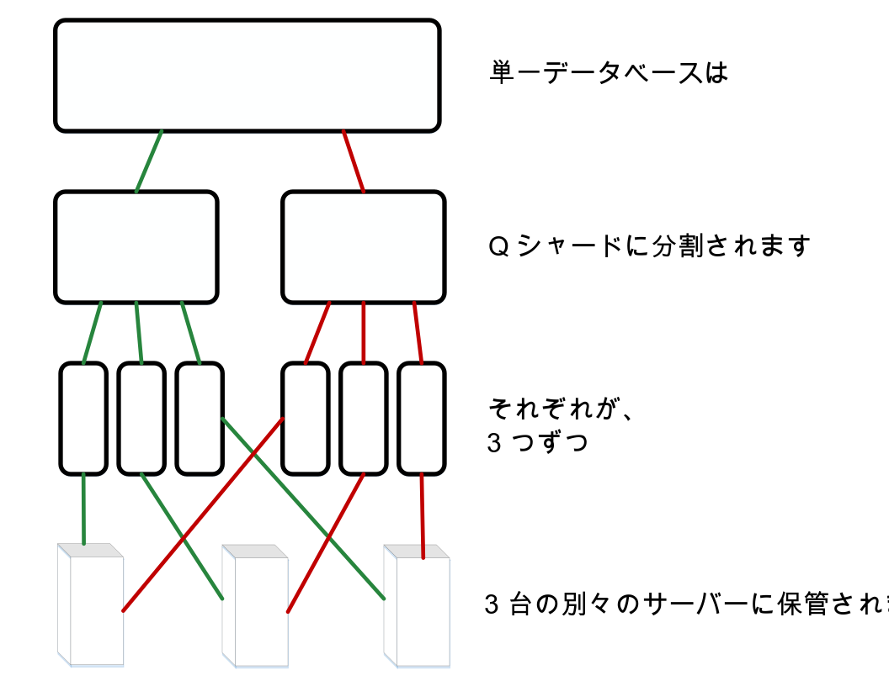
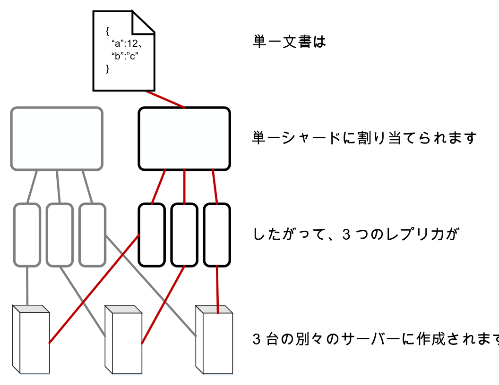

---

copyright:
  years: 2017
lastupdated: "2017-05-15"

---

{:new_window: target="_blank"}
{:shortdesc: .shortdesc}
{:screen: .screen}
{:codeblock: .codeblock}
{:pre: .pre}

<!-- Acrolinx: 2017-05-15 -->

# データはどのように Cloudant に保管されるか?

## 概念

Cloudant 内のすべてのデータベースは、1 つ以上の異なる_シャード_で形成されています。ここでは、シャードの数を _Q_ と呼びます。シャードは、データベースからの異なる文書サブセットです。_Q_ 個のすべてのシャードが合わさって、データベース内のデータを含んでいます。各シャードは、3 つの別々のコピーに保管されています。それぞれのシャード・コピーは、シャード・_レプリカ_と呼ばれます。各シャード・レプリカは、別々のサーバーに保管されます。それらのサーバーは、単一の場所のデータ・センター内で使用可能です。データ・センター内のサーバーの集合は、クラスターと呼ばれます。



文書は、その ID のコンシステント・ハッシュ法を使用して、特定のシャードに割り当てられます。この割り当ては、文書が常に既知のシャードおよび既知のサーバー・セットに保管されることを意味します。



時々、シャードの_リバランス_が行われます。リバランスでは、別々のサーバーへのレプリカの移動が実行されます。リバランスが行われる理由はいくつかあります。例えば、サーバーのモニタリングにより、あるサーバーの使用率が他のサーバーよりも高かったり低かったりすることが示唆された場合や、保守のためにあるサーバーを一時的にサービス休止にしなければならない場合などがあります。シャードとレプリカの数は同じままであり、文書は同じシャードに割り当てられたままになりますが、シャード・レプリカのサーバー・ストレージ・ロケーションは変更されます。

_Q_ のデフォルト値は、さまざまなクラスターによって異なります。この値は、時間の経過とともに調整できます。

レプリカの数 (シャードのコピー数) も構成可能です。実際上、多くのシステムの観察と測定により、ほとんどのケースにおいて、パフォーマンスとデータの安全との間の良好なバランスを実現するためには、3 つのレプリカが実用的であることが示唆されています。Cloudant システムで、異なるレプリカ・カウントが使用されることは例外的であり、珍しいことです。

## シャーディングはパフォーマンスにどのような影響を与えるか? 

データベースのシャードの数は構成可能です。その理由は、それがさまざまな方法でデータベースのパフォーマンスに影響を与えるからです。

クライアント・アプリケーションからデータベースに要求が届くと、1 台のサーバー、すなわちクラスター内の「ノード」が、その要求の_コーディネーター_として割り当てられます。このコーディネーターは、その要求に関連するデータを保持しているノードに内部要求を出し、要求への応答を決定し、その応答をクライアントに返します。

データベースのシャードの数は、次の 2 つの方法でパフォーマンスに影響を与える可能性があります。

1.	データベース内の各文書は、単一のシャードに保管されます。したがって、数多くシャードを持つことにより、1 つの文書要求に対する並列処理の増加が可能になります。この理由は、コーディネーターが、文書を保持しているノードのみに要求を送信するからです。したがって、データベースが多くのシャードを持っている場合、要求に応答する必要がない他の多くのノードが存在する可能性が高くなります。それらのノードは、コーディネーター要求からの割り込みなしに、他のタスクの作業を継続することができます。
2.	照会要求に応答するために、データベースはすべてのシャードからの要求を処理する必要があります。したがって、シャードの数が増えれば増えるほど、処理要求が大きくなります。この理由は、コーディネーターが 1 つのシャードにつき 1 つの要求を行い、次に、クライアントに応答を返す前にそれらの結果を結合しなければならないからです。

データベースに適したシャード・カウントの判別に役立てるには、アプリケーションによって行われる最も一般的なタイプの要求を特定することから開始します。例えば、要求のほとんどが単一文書操作に対するものかどうかについて考えてみます。または、要求はほとんど照会でしょうか? 操作の中に時間依存のものはありますか? 

すべての照会に対して、コーディネーターはすべてのレプリカに読み取り要求を出します。この方法が使用される理由は、各レプリカが、照会の応答に役立つ索引の独自のコピーを維持しているためです。この構成の重要な結果として、シャードの数が増加すると、_もし_文書の書き込みが、クラスター内の複数のシャードに均等に分散される傾向がある場合、並列索引作成が可能になります。

実際上は、クラスター内の複数のノードで行われる可能性のある索引作成ロードを予測することは困難です。さらに、索引作成ロードの予測は、要求パターンに対処するよりも有用でない傾向があります。この理由は、索引作成は文書書き込みの後に必要になる可能性はありますが、文書要求の後では必要がないからです。したがって、索引作成のみを検討しても、適切なシャード・カウントを見積もるのに十分な情報は提供されません。

データ・サイズを検討する際、重要な考慮事項は、1 つのシャード当たりの文書数です。各シャードは、ディスク上の大きな [B ツリー](https://en.wikipedia.org/wiki/B-tree){:new_window}内に文書を保持します。索引は同じ方法で保管されます。シャードに追加される文書の数が増加するにしたがって、標準的な文書検索または照会中に B ツリーの全探索に使用されるステップの数が増加します。この「深さの増加」により、キャッシュまたはディスクから読み取らなければならないデータの量が増加するため、要求がスローダウンする傾向があります。

一般に、1 つのシャードにつき 1000 万個を超える文書を持たないようにしてください。全体的なシャードのサイズに関しては、シャードを 10 GB 未満に保持すると、操作上の理由により有用です。例えば、シャードを小さくすると、リバランスの際のネットワークにおける移動が容易になります。

あまり多くの文書を持たないようにするということと、シャードのサイズを小さく保つという矛盾する要件を考えた場合、1 つの _Q_ 値がすべてのケースに最適に機能するということは不可能です。Cloudant は、使用パターンが変化するにしたがって時間の経過とともにクラスターのデフォルト値を調整します。

それにもかかわらず、ある特定のデータベースについて、観察される要求パターンとサイジングを検討するために時間を取り、この情報を、適切なシャード数の将来の選択の指針として使用することは有用なことがよくあります。代表的なデータと要求のパターンを使用してテストを行うことは、適切な _Q_ 値をより的確に見積もるために不可欠です。実動経験により、こうした予想は修正される可能性があることに留意してください。

<div id="summary"></div>

以下のシンプルな指針は、初期の計画立案段階で役立つ可能性があります。処理した構成は、特に大規模なデータベースの場合、代表的なデータを使用してテストを行って、必ず検証するようにしてください。

*	データのサイズが小さい (数十 MB から数百 MB、または数千個の文書) の場合、複数のシャードが必要になることはほとんどありません。
*	数 GB または数百万個の文書のデータベースの場合、シャード・カウントは 1 桁 (例えば、8) で問題ない可能性が高くなります。
*	何千万から何億個もの文書を持つ、または何十 GB ものサイズの大規模なデータベースの場合は、16 のシャードを使用するようにデータベースを構成することを検討してください。
*	それより大規模なデータベースの場合は、データを複数のデータベースに手動でシャーディングすることを検討してください。そのような大規模なデータベースの場合は、[Cloudant サポート](mailto:support@cloudant.com){:new_window} にアドバイスを依頼してください。

>	**注:** これらの指針における数値は、正確な計算ではなく、観察と経験から導き出されたものです。

<div id="API"></div>

## シャードの操作

### シャード・カウントの設定

データベースのシャードの数である _Q_ は、データベースの作成時に設定されます。この _Q_ 値は後で変更できません。

データベースを作成する時に _Q_ を指定するには、`q` 照会ストリング・パラメーターを使用します。

以下の例では、`mynewdatabase` という名前のデータベースが作成されます。`q` パラメーターは、このデータベースで 8 個のシャードが作成されることを指定しています。

```sh
curl -X PUT -u myusername https://myaccount.cloudant.com/mynewdatabase?q=8
```
{:codeblock}

>	**注:** データベースでの _Q_ の設定は、Bluemix 上の Cloudant データベースでは有効になっていません。_Q_ 値は、多くの `cloudant.com` マルチテナント・クラスターでは使用できません。

使用可能でないところで _Q_ 値の設定を試行すると、その結果として、以下の例のような、JSON 本体を含む [`403` 応答](../api/http.html#403)が返されます。

```json
{
	"error": "forbidden",
	"reason": "q is not configurable"
}
```
{:codeblock}

### レプリカ・カウントの設定

CouchDB バージョン 2 以降、データベースを作成する際に[レプリカ・カウントの指定](http://docs.couchdb.org/en/2.0.0/cluster/databases.html?highlight=replicas#creating-a-database){:new_window} が許可されるようになりました。ただし、デフォルトの 3 からレプリカ・カウント値を変更することは許可されません。特に、データベースを作成する際に異なるレプリカ・カウント値を指定することはできません。さらなる支援が必要な場合は、[Cloudant サポート](mailto:support@cloudant.com){:new_window} までお問い合わせください。

### _R_ 引数および _W_ 引数とは?

いくつかの要求は、要求に応答する時にコーディネーターの動作に影響を与える引数を持つことができます。これらの引数は、要求照会ストリングでのそれらの名前を取って _R_ および _W_ として知られます。それらは、単一文書操作にのみ使用できます。一般的な「照会スタイル」要求には効果はありません。

実際上、_R_ および _W_ の値を指定することが有用なことはめったにありません。例えば、_R_ または _W_ のいずれかを指定しても、読み取りまたは書き込みの整合性が変更されることはありません。

#### _R_ とは?

_R_ 引数は、単一の文書要求にのみ指定できます。_R_ は、クライアントに応答する前にコーディネーターによって受信されなければならない応答の数に影響を与えます。それらの応答は、文書を含むシャードのレプリカをホストしているノードからの応答でなければなりません。 

_R_ を _1_ に設定すると、コーディネーターがより素早く応答を返せるため、全体的な応答時間が向上する可能性があります。この理由は、コーディネーターが待たなければならないのは、適切なシャードをホストしているいずれかのレプリカからの単一の応答のみであるためです。

>	**注:** _R_ 値を削減すると、Cloudant によって使用されている[結果整合性](cap_theorem.html)モデルのため、返される応答が最新データに基づいていない可能性が高くなります。デフォルトの _R_ 値を使用すると、この効果を軽減するのに役立ちます。

_R_ のデフォルト値は _2_ です。この値は、3 つのシャード・レプリカを使用する標準的データベースのレプリカの多くに対応しています。データベースが持っているレプリカの数が 3 より多い場合や 3 より少ない場合は、_R_ のデフォルト値もそれに対応して変化します。

#### _W_ とは?

_W_ は、単一の文書書き込み要求にのみ指定できます。

_W_ は、クライアントに応答する前にコーディネーターによって受信される必要がある応答の数に影響を与えるため、_R_ に似ています。

>	**注:** _W_ が実際の書き込み動作に影響を与えることは決してありません。

_W_ の値は、データベース内に文書が書き込まれるかどうかには影響しません。_W_ 値を指定することにより、クライアントは応答で HTTP 状況コードを調べて、_W_ レプリカがコーディネーターに応答したかどうかを判断することができます。コーディネーターは、クライアントに応答を返す前に、文書のコピーをホストしているノードからの _W_ 応答を、定義済みタイムアウトに達するまで待機します。
