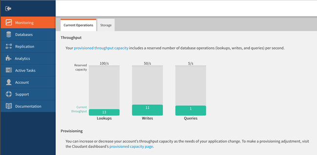

---

copyright:
  years: 2015, 2019
lastupdated: "2019-06-12"

keywords: standard plan, lite plan, dedicated hardware plan, event type, provisioned throughput capacity, consumption, capacity, monitor usage, data usage, size limits, locations, tenancy, authentication methods, high availability, disaster recovery, backup, support

subcollection: cloudant

---

{:new_window: target="_blank"}
{:shortdesc: .shortdesc}
{:screen: .screen}
{:codeblock: .codeblock}
{:pre: .pre}
{:tip: .tip}
{:note: .note}
{:important: .important}
{:deprecated: .deprecated}

<!-- Acrolinx: 2017-05-10 -->

# プランおよびプロビジョニング
{: #ibm-cloud-public}

{{site.data.keyword.cloudantfull}} Public は、最も豊富な機能を備えた {{site.data.keyword.cloudant_short_notm}} のオファリングであり、最初に更新と新しいフィーチャーを受け取ります。 料金は割り振られたプロビジョン済みスループット能力と使用されたデータ・ストレージに基づいており、どのような負荷が必要になっても適用可能です。 
{: shortdesc}

無料の[ライト・プラン](#lite-plan)には、開発と評価のために、
固定されたスループット能力とデータ量が含まれます。 有料の[標準プラン](#standard-plan)では、
アプリケーション要件の変更に合わせて増減される、
構成可能なプロビジョン済みのスループット能力とデータ・ストレージの料金を提供します。  専用ハードウェア環境で 1 つ以上の標準プラン・インスタンスを実行するために、追加の月次料金でオプションの[専用ハードウェア・プラン](#dedicated-hardware-plan)を利用することもできます。 専用ハードウェア環境は自分専用であり、
専用ハードウェア・プラン・インスタンスが米国のロケーション内でプロビジョンされる場合は、
オプションで [HIPAA ](https://en.wikipedia.org/wiki/Health_Insurance_Portability_and_Accountability_Act){: new_window} 準拠の構成を選択できます。

## プラン
{: #plans}

[{{site.data.keyword.cloudant_short_notm}} サービス・インスタンスをプロビジョンする](#provisioning-a-cloudant-nosql-db-instance-on-ibm-cloud)時に、使用するプランを選択できます。
デフォルトでは、[ライト・プラン](#lite-plan)が選択されます。

### ライト・プラン
{: #lite-plan}

ライト・プランは無料であり、開発および評価を目的として設計されています。 {{site.data.keyword.cloudant_short_notm}} の全機能が含まれていますが、ライト・プランのインスタンスには、プロビジョン済みスループット能力とデータ・ストレージの固定量が設定されています。 プロビジョン済みスループット能力は、20 読み取り/秒、10 書き込み/秒、および 5 グローバル照会/秒で固定され、データ・ストレージ容量は 1 GB の上限があります。 

ストレージ使用量は毎日チェックされます。 1 GB のストレージ制限を超えると、{{site.data.keyword.cloudant_short_notm}} インスタンスへの要求は 402 状況コードを受け取り、「アカウントがデータ使用割り当て量を超えました。有料プランへのアップグレードが必要です」というエラー・メッセージが表示されます。
バナーも {{site.data.keyword.cloudant_short_notm}} ダッシュボードに表示されます。 データの読み取りと削除はまだ実行できます。 ただし、新規データを書き込むには、2 つのオプションがあります。 1 つ目は、有料の[標準プラン](#standard-plan)へのアップグレードです。それにより、書き込み制限は即時除去されます。 もう 1 つの方法として、合計ストレージが 1 GB の制限未満になるようにデータを削除し、インスタンスに対する次の日次ストレージ・チェックが実行されて再び書き込みが許可されるまで待つこともできます。 

1 GB を超えるデータを保管したい場合やプロビジョン済みスループット能力を拡大できるようにしたい場合は、[標準プラン](#standard-plan)に移行してください。

{{site.data.keyword.cloudant_short_notm}} ライト・プランのインスタンスは、{{site.data.keyword.cloud_notm}} アカウント 1 つにつき 1 つに制限されています。 既にライト・プラン・インスタンスが 1 つある場合は、ライト・プランの新しいインスタンスを作成しようとしたり、標準プランのインスタンスをライト・プランに変更したりしようとすると、「使用できるライト・プランのインスタンスは 1 つのサービスにつき 1 つのみとなります。新しいインスタンスを作成するには、既存のライト・プラン・インスタンスを削除するか、有料プランを選択してください (You can only have one instance of a Lite plan per service. To create a new instance, either delete your existing Lite plan instance or select a paid plan)」というエラー・メッセージが返されます。 
{: note}

### 標準プラン
{: #standard-plan}

{{site.data.keyword.cloudant_short_notm}} 標準プランは、すべての有料 {{site.data.keyword.cloud}} アカウント (従量課金 (PAYG) またはサブスクリプションのいずれでも) で利用可能であり、ご使用のアプリケーションのニーズに合わせて拡大されます。 標準プランの料金は、割り当てられているプロビジョン済みスループット能力と、インスタンスに保管されているデータ量という 2 つの要因に基づいて決定されます。 

料金は時間割計算となり、開始プロビジョン済みスループット能力は 100 読み取り/秒、50 書き込み/秒、および 5 グローバル照会/秒で、開始コストは USD $0.105/時です。 プロビジョン済みスループット能力の増減は、{{site.data.keyword.cloudant_short_notm}} ダッシュボードで、100 読み取り/秒、50 書き込み/秒、5 グローバル照会/秒の単位で切り替えることができます。 コストは、計量された要求ボリュームではなく、割り振られているプロビジョン済みスループット能力を対象にして計算されます。 標準プランには、20 GB のデータ・ストレージが含まれています。 20 GB を超えるデータを保管する場合は、GB/時間当たりで定義されているコストを請求されます。 

コストを見積もるための例については、『{{site.data.keyword.cloud_notm}} Pricing Calculator for pricing at different capacities and currencies, and the [pricing](/docs/services/Cloudant?topic=cloudant-pricing#pricing){: new_window}』情報を参照してください。

### 専用ハードウェア・プラン
{: #dedicated-hardware-plan}

{{site.data.keyword.cloudant_short_notm}} 専用ハードウェア・プラン・インスタンスとは、{{site.data.keyword.cloudant_short_notm}} 標準プラン・インスタンス専用でプロビジョンされているベアメタル {{site.data.keyword.cloudant_short_notm}} 環境です。 {{site.data.keyword.cloudant_short_notm}} 専用ハードウェア・プラン環境は、どの [{{site.data.keyword.IBM}} グローバル・データ・センター ](https://www.ibm.com/cloud/data-centers/){:new_window} にもプロビジョンできます。このプランは
HIPAA のコンプライアンスのために必要であり、プロビジョン時に選択する必要があります。 {{site.data.keyword.cloudant_short_notm}} 専用ハードウェア・プラン環境のユーザーは、IP ホワイトリスティング、および {{site.data.keyword.IBM_notm}} Key Protect を使用する bring-your-own-key (BYOK) カスタマー管理暗号鍵を使用できます。 さらに、2019 年 1 月 1 日以降に EU 管理環境の外部でプロビジョンされる専用ハードウェア環境は、その環境にデプロイされるすべての標準プラン・インスタンス用の内部エンドポイントを含みます。内部エンドポイントを使用すると内部 {{site.data.keyword.cloud}} ネットワークを経由して {{site.data.keyword.cloudant_short_notm}} インスタンスに接続できるため、アップストリーム・アプリケーション・トラフィックがパブリック・ネットワークを通過することで発生する帯域幅のコストを低減できます。 {{site.data.keyword.cloud}} アカウントのサービス・エンドポイントを有効にする方法について詳しくは、[サービス・エンドポイントの資料 ](https://cloud.ibm.com/docs/services/service-endpoint/getting-started.html#about){:new_window} を参照してください。

1 つ以上の標準プラン・インスタンスをプロビジョンでき、標準プラン・インスタンスで使用される容量およびデータに基づいて、必要に応じて専用ハードウェア環境を拡大したり縮小したりできます。 {{site.data.keyword.cloudant_short_notm}} 専用ハードウェア・プラン・インスタンスには、デプロイされている標準プラン・インスタンスの使用量に伴う料金に加えて固定料金も存在します。 請求処理は日割り計算で行われ、環境に対する最小課金期間は 1 カ月になります。 {{site.data.keyword.cloudant_short_notm}} 専用ハードウェア・プランのプロビジョニングは非同期であり、5 から 7 営業日かかる可能性があります。 {{site.data.keyword.cloudant_short_notm}} 専用ハードウェア・プラン・インスタンスを作成し、そこに標準プラン・インスタンスをプロビジョンするには、『[{{site.data.keyword.cloud_notm}} での {{site.data.keyword.cloudant_short_notm}} 専用ハードウェア・プラン・インスタンスの作成および活用](/docs/services/Cloudant?topic=cloudant-creating-and-leveraging-an-ibm-cloudant-dedicated-hardware-plan-instance-on-ibm-cloud#creating-and-leveraging-an-ibm-cloudant-dedicated-hardware-plan-instance-on-ibm-cloud)』チュートリアルに従ってください。 

{{site.data.keyword.cloud_notm}} Dedicated のお客様は専用ハードウェア・プランを利用できません。 専用ハードウェア・プランを利用できるのは、{{site.data.keyword.cloud_notm}} Public のお客様のみになります。
{: important}

## イベント・タイプ
{: #event-types}

スループットのプロビジョンは、以下のタイプのいずれかのイベントとして識別および測定されます。

1.	_読み取り_、
    (旧称「ルックアップ」) 内容は以下のとおりです:
    1. 文書の `_id` に基づいた特定の文書の読み取り。
    2. _パーティション化された_ 照会、つまり
        要求パスの `_partition` 名前空間内の {{site.data.keyword.cloudant_short_notm}} 照会エンドポイントに対して行われる要求。 以下のタイプがあります:
        -	1 次索引 ([`_all_docs`](/docs/services/Cloudant?topic=cloudant-databases#get-documents))
        -	MapReduce ビュー ([`_view`](/docs/services/Cloudant?topic=cloudant-using-views#using-views))
        -	ルックアップ索引 ([`_search`](/docs/services/Cloudant?topic=cloudant-search#queries))
        -	{{site.data.keyword.cloudant_short_notm}} 照会 ([`_find`](/docs/services/Cloudant?topic=cloudant-query#finding-documents-by-using-an-index))
    
        パーティション化された照会要求により使用される読み取り操作の数は、
        返される結果に応じて異なります。
2.	_書き込み_、
    つまり、個別文書の作成、変更、または削除。
3.	グローバル索引に対する _グローバル照会_ (旧称「照会」)、
        つまり、`_partition` 名前空間内**にはない** {{site.data.keyword.cloudant_short_notm}} 照会エンドポイントに対して行われる要求。以下のタイプがあります:
	-	1 次索引 ([`_all_docs`](/docs/services/Cloudant?topic=cloudant-databases#get-documents))
	-	MapReduce ビュー ([`_view`](/docs/services/Cloudant?topic=cloudant-using-views#using-views))
	-	ルックアップ索引 ([`_search`](/docs/services/Cloudant?topic=cloudant-search#queries))
	-	地理情報索引 ([`_geo`](/docs/services/Cloudant?topic=cloudant-cloudant-nosql-db-geospatial#querying-a-cloudant-nosql-db-geo-index))
	-	{{site.data.keyword.cloudant_short_notm}} 照会 ([`_find`](/docs/services/Cloudant?topic=cloudant-query#finding-documents-by-using-an-index))

## プロビジョンされているスループット能力
{: #provisioned-throughput-capacity}

スループットのプロビジョンは、以下の操作タイプのいずれかのイベントとして識別して測定されます：
_読み取り_、_書き込み_、_グローバル照会_。

スループットの測定は、1 秒当たりの各タイプのイベント数の単純なカウントです。ここでの秒は_スライディング_・ウィンドウです。
プランでプロビジョンされているスループット・イベント数をアカウントが超えると、スライディング・ウィンドウ内のイベント数が、プロビジョンされている数を超えなくなるまで、要求は拒否されます。
1 秒のスライディング・ウィンドウを、1,000 ミリ秒の連続期間と考えるとわかりやすいかもしれません。

例えば、標準プランは毎秒 200 回の読み取り用にプロビジョンされます。 アカウントでは、連続する 1,000 ミリ秒 (1 秒) の期間中に最大 200 個の読み取りイベントを使用することができます。 1,000 ミリ秒のスライディング期間中に行われる、その後の読み取り要求は、その期間内の読み取りイベント数が再び 200 個未満に減少するまで拒否されます。

イベント数を超えているために要求が拒否されると、アプリケーションは [`429` Too Many Requests](/docs/services/Cloudant?topic=cloudant-http#http-status-codes) 応答を受け取ります。

サポートされているクライアント・ライブラリー ([Java](/docs/services/Cloudant?topic=cloudant-supported-client-libraries#java-supported)、[Node.js](/docs/services/Cloudant?topic=cloudant-supported-client-libraries#node-js-supported)、および [Python](/docs/services/Cloudant?topic=cloudant-supported-client-libraries#python-supported) の各言語用) の最新バージョンは、`429` 応答の処理に役立ちます。 例えば、
Java ライブラリーは、
[`TooManyRequestsException` ](http://static.javadoc.io/com.cloudant/cloudant-client/2.5.1/com/cloudant/client/org/lightcouch/TooManyRequestsException.html){: new_window} 応答を生成します。

デフォルトで、サポートされているクライアント・ライブラリーは、`429` 応答を受け取った時、自動的に要求の再試行を実行しません。

ご使用のアプリケーションで `429` 応答が正しく処理されることを確認することをお勧めします。
この理由は、再試行回数が制限されているからです。要求数をたびたび超過することは、別のプラン構成への移行を示す強力な指標です。

既存のアプリケーションを移植する場合、`429` 応答を処理できない場合があります。 マイグレーション検査の一部として、アプリケーションで `429` 応答が正しく処理されることを確認してください。
{: note}

つまり、ご使用のアプリケーションが [`429`](/docs/services/Cloudant?topic=cloudant-http#http-status-codes) 応答を正しく処理できることを確実にする必要があります。

### パーティション化された照会による読み取り操作の使用量
{: #consumption-of-lookup-operations-by-partitioned-queries}

パーティション化された照会要求が使用する読み取り操作の数は、返される結果の数に応じて異なります。 使用量は以下の 2 つの軸を基準にしています。

1. 照会に関与する索引から読み取られる行の数。
1. 照会の実行中にデータベース (存在する場合) から読み取られる文書の数。
    
#### `_all_docs`、ビュー、および検索の照会

索引からの 100 行ブロックの読み取りごとに、1 読み取り操作を使用します。 さらに、照会の実行中のデータベースからの文書読み取りごとに 1 読み取り単位を使用します。

索引からの読み取り行数は返される結果の数と同じです。 文書がデータベースから読み取られるのは、照会要求中に照会ストリング・パラメーターとして `include_docs=true`
が渡された場合のみです。

以下の表にコスト例を示します。

| 結果の数 | 文書の組み込み | 合計読み取り使用量 | 読み取り行の使用量 | 読み取り文書の使用量 |
|--------------|----------------|-------------|---------------------| --- |
| 199      | いいえ     | **2** | 2 | 0 |
| 199      | はい     | **201** | 2 | 199 |
| 301      | いいえ     | **4** | 4 | 0 |
| 301      | はい     | **305** | 4 | 301 |

`include_docs=true` の使用を減らすことが、パーティション化された
`_all_docs`、ビュー、および検索の照会の読み取り使用量を減らす鍵となります。

#### {{site.data.keyword.cloudant_short_notm}} 照会

{{site.data.keyword.cloudant_short_notm}} 照会要求の場合、索引行読み取りのために使用される読み取り操作の数は、索引によって対応できない場合に selector のパーツに基づいてフィルター処理が実施される_前_ の、基礎となる索引からの読み取り行に関連します。
これは、読み取り行の値、つまり使用される読み取り単位が、
最終的に受け取る結果数より大きくなる可能性があることを意味します。

また、{{site.data.keyword.cloudant_short_notm}} 照会は、照会に渡される selector によって必要なきめ細かなフィルター操作を実行できるように、基礎となる索引により返されたすべての行の文書を読み取る必要があります。

| 結果の数 | 索引により返された行数 | 合計読み取り使用量 | 読み取り行の使用量 | 読み取り文書の使用量 |
|--------------|----------------|-------------|---------------------| --- |
| 5      | 199     | **201** | 2 | 199 |
| 199      | 199     | **201** | 2 | 199 |
| 5      | 301     | **305** | 4 | 301 |
| 301      | 301     | **305** | 4 | 301 |

適切な索引を使用することが、パーティション化された
{{site.data.keyword.cloudant_short_notm}} 照会で行われる照会に関して読み取り使用量を減らす鍵となります。

### 能力の表示および変更
{: #viewing-and-changing-capacity}

ご使用のアカウントで使用可能なプラン内のスループット能力の詳細を確認することができます。
使用するプロビジョニングのレベルは、{{site.data.keyword.cloudant_short_notm}} アカウント・ダッシュボードの「アカウント」タブを介して選択できます。

別のスループット能力に移行するには、必要なプロビジョニングを選択してから、
`「更新」`をクリックします。 変更を確認するよう求められ、プロビジョニングの変更完了までに最大で 24 時間かかる可能性があるという注意喚起が表示されます。

能力増加のサイズは、1 回の変更につき 10 ユニット (1000 読み取り/秒、500 書き込み/秒、および 50 グローバル照会/秒) に制限されています。 削減は、ユニット数によって制限されません。 増加または削減のいずれの場合も、容量の変更は、1 時間につき 1 回に制限されています。 {{site.data.keyword.cloudant_short_notm}} ダッシュボードで使用可能な容量より多くの容量が必要な場合は、[{{site.data.keyword.cloudant_short_notm}} サポート ](mailto:support@cloudant.com){: new_window} までご連絡ください。
{: note}

### 使用状況のモニタリング 
{: #monitoring-usage}

使用状況に関する情報は、{{site.data.keyword.cloudant_short_notm}} ダッシュボード内の「モニタリング」タブの「Current Operations」ペインで使用可能です。 

現在の[スループット](#provisioned-throughput-capacity)と、[保管データ](#disk-space-included)の量が示された詳細が提供されています。

モニタリングは、プランでのプロビジョニングの変更が推奨される可能性があることを認識するのに役立ちます。
例えば、データベースの読み取りの最大数に頻繁に近づく場合は、ダッシュボードの「アカウント」タブの[「容量」ペイン](#viewing-and-changing-capacity)を介してプロビジョニングを変更できます。

## データ使用量
{: #data-usage}

### 含まれるディスク・スペース
{: #disk-space-included}

この値は、プランに含まれているストレージ容量です。
これは、データと索引両方のストレージに使用されます。

### ディスク超過料金
{: #disk-overage}

すべての標準プランとライト・プランには、JSON データ、添付ファイル、および索引に使用されるディスク・スペースが含まれています。 すべての標準プランおよびライト・プランでは、使用されているディスク・スペースがモニターされています。 プランの割り振り量より多くのデータを使用した場合は、以下の表に記載されている条件が適用されますので注意してください。

<table>

<tr>
<th id="disk-overage-plan">プラン</th><th id="description">説明</th>
</tr>
<tr>
<th headers="standard-plan">標準</td>
<td headers="description">

<ul><li>ご使用のプラン構成で割り振られているストレージ量より多くの量がアカウントで使用された場合は、「オーバーフロー」と見なされます。 オーバーフローでは、プラン割り振りを超えて使用された追加の GB ごとに、示された金額でアカウントに料金が請求されます。</li>
<li>プランで提供されているディスク・スペースを超えて使用した分に対して支払わなければならない追加の金額は、「超過料金」と呼ばれます。 超過料金は、時間ベースで計算されます。</li></ul>
</td>
</tr>
<tr>
<th headers="lite-plan">ライト</td>
<td headers="description">

<ul><li>ライト・プランでは、ディスク使用量の上限が設定されています。 上限に達すると、新しいデータを書き込めなくなります。 新しいデータを書き込むには、標準プランにアップグレードするか、データを削除して、アカウントを再アクティブ化するための次のチェックが実行されるまで待たなければなりません。

</li></ul></td>
</tr>
</table>

例えば、標準プランで、半日 (12 時間) にわたりディスク使用量が 107 GB に増加したと仮定します。 この変化は、12 時間にわたり、インスタンスで、20 GB のプラン割り振りより 87 GB 多いオーバーフローが発生したことを意味します。
したがって、その追加スペースに対し、87 GB x 12 時間 = 1044 GB 時間の計算に基づいて超過料金が請求されます。

超過料金の計算は、請求処理サイクル内のある特定の時間中の、プラン割り振りを超える最大 GB 数を使用して行われます。

### ディスク超過料金の例
{: #disk-overage-example}

9 GB のストレージを使用する標準プランのサービス・インスタンスで 1 か月 (30 日間) を開始したと仮定します。
次に、ストレージは、3 日目の 02:00 時から 15 分間、21.5 GB まで増加します。
02:00 時台の次の 10 分間、インスタンスは 9.5 GB まで減少し、その後 02:00 時台の次の 25 分間、108 GB に増加します。
最後に、インスタンスは 28 GB まで減少してその時間を終了し、実際、その月の残りも 28 GB で終了します。

このパターンは、プラン割り振りを超える最大 GB 数は、3 日目の 2 時台に 88 GB だったことを意味します。
3 日目の 03:00 時台とこの月の残りに関しては、インスタンスがプラン割り振りを超えていた量は 8 GB でした。

したがって、3 日目の 02:00 時台については、
請求には、88 GB x 1 時間 = 88 GB 時間に基づいた超過料金が含まれます。

3 日目の 03:00 時から 3 日目の終わりまでについては、
請求には、8 GB x 21 時間 = 168 GB 時間に基づいた超過料金が含まれます。

4 日目の 00:00 時からその月 (30 日間) の終わりまでについては、
請求には、8 GB x 24 時間 x 27 日 = 5184 GB 時間に基づいた超過料金が含まれます。

この月の超過料金の合計額の請求は、88 + 168 + 5184 = 5440 GB 時間に基づいて行われます。

## 要求および文書のサイズ制限
{: #request-and-document-size-limits}

{{site.data.keyword.cloudant_short_notm}} JSON 文書および要求には、
以下の最大サイズ制限があります。 

制限 | 最大サイズ
------|-------------
個別文書サイズ | 1 MB
単一の添付ファイルのサイズ | 10 MB
要求本体のサイズ | 11 MB

これらの制限のいずれかを超えると、[413 応答](/docs/services/Cloudant?topic=cloudant-http#http-status-codes)になります。

バイナリー添付ファイルまたは大きな JSON Blob はオブジェクト・ストレージに保管し、そのロケーションへのリンクを {{site.data.keyword.cloudant_short_notm}} JSON 文書に保存することをお勧めします。   

複製する場合、これらの制限を超える文書または添付ファイルは、
ターゲット・データベースに複製されません。 複製エラーを検出する方法について詳しくは、『[複製エラー](/docs/services/Cloudant?topic=cloudant-replication-api#replication-errors)』を参照してください。

## ロケーションとテナンシー
{: #locations-and-tenancy}

デフォルトでは、すべてのライト・プラントと標準プランがマルチテナント環境にデプロイされます。 プラン選択の一部として、以下の {{site.data.keyword.cloud_notm}}Public 地域から選択できます。

-   ワシントン DC
-   ダラス
-   London (ロンドン)
-   シドニー
-   フランクフルト&Dagger;
-   東京

専用ハードウェア・プラン・インスタンスは、ほとんどの
[{{site.data.keyword.IBM_notm}} データ・センター・ロケーション ](https://www.ibm.com/cloud/data-centers/) にデプロイできます。 
使用可能なロケーションの最新のリストについては、{{site.data.keyword.cloud_notm}} カタログでドロップダウン・メニューを確認してください。

&Dagger; {{site.data.keyword.cloud_notm}} Public フランクフルト地域からデプロイされたすべての {{site.data.keyword.cloudant_short_notm}} インスタンスは、
EU 管理環境でデプロイされます。 EU 管理環境外で生成された {{site.data.keyword.cloudant_short_notm}}
アカウントや API キーでは、EU 管理
{{site.data.keyword.cloudant_short_notm}} インスタンスに対するアクセスは
許可されません。

## 認証方式
{: #authentication-methods}

{{site.data.keyword.cloudant_short_notm}} には、HTTPS API を使用してアクセスします。 API エンドポイントによって要求されれば、
  {{site.data.keyword.cloudant_short_notm}} が受け取るすべての HTTPS 要求
  についてユーザーが認証されます。 プロビジョン中に使用可能な認証方式には、`Use both legacy credentials and IAM` (レガシー資格情報と IAM の両方を使用) または `Use only IAM` (IAM のみを使用) があります。詳しくは、『[IAM ガイド](/docs/services/Cloudant?topic=cloudant-ibm-cloud-identity-and-access-management-iam-#ibm-cloud-identity-and-access-management-iam-)』またはレガシー『[認証 API 文書](/docs/services/Cloudant?topic=cloudant-authentication#authentication)』を参照してください。

{{site.data.keyword.cloudant_short_notm}} インスタンスをプロビジョニングした後は、{{site.data.keyword.cloud_notm}} ダッシュボードの「サービス資格情報」タブで新規資格情報を生成するときに、接続 URL と IAM 許可の詳細が表示されます。 プロビジョニング中にこのオプションを選択した場合は、{{site.data.keyword.cloudant_short_notm}} のレガシー・ユーザー名とパスワードも含まれます。

{{site.data.keyword.cloudant_short_notm}} チームでは、可能な場合は認証に IAM アクセス制御を使用することをお勧めしています。 {{site.data.keyword.cloudant_short_notm}} のレガシー認証を使用している場合、プログラマチック・アクセスと複製ジョブを行う際にはアカウント・レベルの資格情報ではなく [API キー](/docs/services/Cloudant?topic=cloudant-authorization#api-keys){: new_window}を使用することをお勧めします。 
{: important}

## データ・センターでの高可用性、災害復旧、およびバックアップ
{: #high-availability-disaster-recovery-and-backup-in-a-data-center}

データ・センター内で高可用性 (HA) および災害復旧 (DR) を提供するため、すべてのデータは、クラスター内の 3 つの別々の物理サーバーに三重に保管されます。 複数のデータ・センター内にアカウントをプロビジョンし、次に継続的データ複製を使用して、複数のデータ・センターにわたって HA/DR を提供することができます。 {{site.data.keyword.cloudant_short_notm}} データは自動的にバックアップされませんが、バックアップを処理するためにサポートされるツールが用意されています。 アプリケーション要件を満たすための、HA、DR、およびバックアップのすべての考慮事項を調べるには、[災害復旧およびバックアップのガイド](/docs/services/Cloudant?topic=cloudant-authorization#api-keys)を参照してください。 

## {{site.data.keyword.cloud_notm}} サポート
{: #ibm-cloud-support}

標準プランおよび専用プランのサービス・インスタンスのサポートはオプションです。
これは、「*{{site.data.keyword.cloud_notm}} 標準サポート*」を購入することにより提供されます。 ライト・プランでは、サポートは利用できません。

サポート・プランについて詳しくは、『[{{site.data.keyword.cloud_notm}} 標準サポート・プラン ](https://www.ibm.com/cloud/support#944376){: new_window}』を参照してください。 サポートについて詳しくは、『[{{site.data.keyword.IBM_notm}} サポート・ガイド ](https://www.ibm.com/support/home/pages/support-guide/){: new_window}』を参照してください。

{{site.data.keyword.cloudant_short_notm}} で使用されるサポート・システムでは、医療情報、健康情報、保護医療情報、または追加の規制上の要件の対象となるデータを含む内容を保護するための機能は提供されていません。 したがって、お客様はそのようなデータを入力または提供してはなりません。
{: note}

## {{site.data.keyword.cloudant_short_notm}} での {{site.data.keyword.cloud_notm}} インスタンスのプロビジョニング
{: #provisioning-a-cloudant-nosql-db-instance-on-ibm-cloud}

{{site.data.keyword.cloud_notm}} 上で {{site.data.keyword.cloudant_short_notm}} ライト・プラン・インスタンスまたは標準プラン・インスタンスをプロビジョンするには、次の 2 つの方法があります。

- ダッシュボードを使用する。 詳しくは、そのプロセスが記載されている『[{{site.data.keyword.cloud_notm}} での {{site.data.keyword.cloudant_short_notm}} インスタンスの作成 ](/docs/services/Cloudant?topic=cloudant-creating-an-ibm-cloudant-instance-on-ibm-cloud#creating-an-ibm-cloudant-instance-on-ibm-cloud){: new_window}』チュートリアルを参照してください。
- Cloud Foundry コマンド・ツールを使用する。 詳しくは、そのプロセスが記載されている『[{{site.data.keyword.cloud_notm}} CLI を使用した{{site.data.keyword.cloud_notm}} での {{site.data.keyword.cloudant_short_notm}} インスタンスの作成 ](/docs/services/Cloudant?topic=cloudant-creating-an-ibm-cloudant-instance-on-ibm-cloud-by-using-the-ibm-cloud-cli#creating-an-ibm-cloudant-instance-on-ibm-cloud-by-using-the-ibm-cloud-cli){: new_window}』チュートリアルを参照してください。
 
{{site.data.keyword.cloudant_short_notm}} 専用ハードウェア・プラン・インスタンスを作成して活用するには、そのプロセスが記載されている『[{{site.data.keyword.cloud_notm}} での {{site.data.keyword.cloudant_short_notm}} 専用ハードウェア・プラン・インスタンスの作成と活用 ](/docs/services/Cloudant?topic=cloudant-creating-and-leveraging-an-ibm-cloudant-dedicated-hardware-plan-instance-on-ibm-cloud#creating-and-leveraging-an-ibm-cloudant-dedicated-hardware-plan-instance-on-ibm-cloud){: new_window}』チュートリアルを参照してください。

