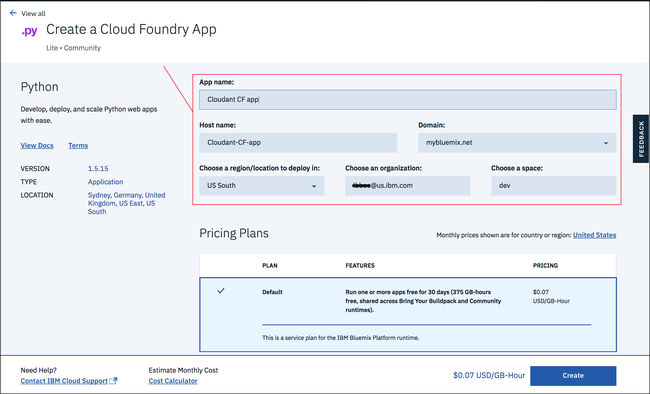

---

copyright:
  years: 2017
lastupdated: "2017-08-25"

---

{:new_window: target="_blank"}
{:shortdesc: .shortdesc}
{:screen: .screen}
{:codeblock: .codeblock}
{:pre: .pre}

<!-- Acrolinx: 2017-01-10 -->

# Cloudant データベースにアクセスする単純な Bluemix アプリケーションの作成: アプリケーション環境

チュートリアルのこのセクションでは、
{{site.data.keyword.Bluemix}} アプリケーションの作成に必要なアプリケーション環境をセットアップする方法について説明します。
{:shortdesc}

<div id="creating"></div>

## Bluemix アプリケーション環境の作成

1.  {{site.data.keyword.Bluemix_notm}} アカウントにログインします。
    {{site.data.keyword.Bluemix_notm}} ダッシュボードは、
    [http://bluemix.net ](http://bluemix.net){:new_window} にあります。
    ユーザー名とパスワードで認証すると、
    {{site.data.keyword.Bluemix_notm}} ダッシュボードが表示されます。<br/>
    

2.  「`カタログ`」リンクをクリックします。<br/>
    <br/>
    {{site.data.keyword.Bluemix_notm}} で使用可能なサービスのリストが表示されます。

3.  「`アプリ`」の見出しの下で「`Cloud Foundry アプリ`」項目をクリックします。<br/>
    <br/>
    {{site.data.keyword.Bluemix_notm}} で使用可能な Cloud Foundry アプリケーションのリストが表示されます。

4.  「`Python`」項目をクリックします。<br/>
    <br/>
    「`Cloud Foundry アプリの作成`」フォームが表示されます。

5.  「`Cloud Foundry アプリの作成`」フォームを使用して、
    Python Cloud Foundry アプリケーションの環境を指定して作成します。
    アプリケーションの名前を入力します
    (例えば、「`Cloudant Python`」など)。
    ホスト名は自動で生成されますが、カスタマイズすることも可能です。<br/>
    <br/>
    >   **注**: ホスト名は、{{site.data.keyword.Bluemix_notm}} ドメイン内で固有でなければなりません。この例では、ドメイン名が「`mybluemix.net`」で、完全なホスト名は「`Cloudant-Python.mybluemix.net`」になります。

6.  「`作成`」をクリックして、アプリケーション環境を作成します。<br/>
    

7.  しばらく間をおいて、
    新しいアプリケーション環境の「`開始`」ウィンドウが表示されます。
    環境内にテスト・アプリケーションが自動的に作成されます。
    アプリケーションが自動的に開始され、
    緑色のアイコンと「`アプリは実行中です`」の状況で示されます。
    このアプリケーションは、新しいアプリケーション環境が作動可能で使用できることを示すのに十分な「ハートビート」プログラムです。
    「`ダッシュボード`」リンクをクリックして、{{site.data.keyword.Bluemix_notm}} アカウント・ダッシュボードに戻ります。<br/>
    

8.  新しく作成されたアプリケーション環境が、ダッシュボードに含まれています。<br/>
    

{{site.data.keyword.Bluemix_notm}} Python アプリケーション環境を使用する準備ができました。

{{site.data.keyword.cloudant_short_notm}} データベース・インスタンスで作業するには、
次のステップとして、アプリケーション環境とデータベース・インスタンス間の「接続」を作成します。

<div id="connecting"></div>

## Bluemix アプリケーションとサービスの接続

チュートリアルのこのセクションでは、アプリケーションの構成および管理エリアを使用して、
{{site.data.keyword.Bluemix_notm}} アプリケーション環境とサービスを接続する方法を説明します。

1.  {{site.data.keyword.Bluemix_notm}} ダッシュボードから、アプリケーションのエントリーをクリックします。<br/>
    <br/>
    >   **注**: 「`経路`」列は避けてください。アプリケーションに関連付けられたリンクをクリックすると、構成エリアに進まずに、アプリケーションが起動されます。なるべくアプリケーションの名前の上をクリックしてください。

    アプリケーションの構成および管理の概要エリアが表示されます。

2.  アプリケーション環境を別のサービスに接続するには、
    「`接続`」リンクをクリックします。<br/>
    <br/>
    アプリケーションと、アカウント内で使用可能な他のサービスとの接続を構成するエリアが表示されます。

3.  このチュートリアルでは、既存の {{site.data.keyword.cloudant_short_notm}}
    データベース・インスタンスが[前提条件](create_bmxapp_prereq.html#prerequisites)です。
    「`既存に接続`」をクリックして、そのデータベース・インスタンスとアプリケーション間の接続を確立します。<br/>
    <br/>
    アカウントの既存サービス・インスタンスのリストが表示されます。

4.  使用する {{site.data.keyword.cloudant_short_notm}} データベース・インスタンスをクリックします。
    このチュートリアルでは、「`Cloudant Service 2017`」のインスタンスを使用します。<br/>
    

5.  本当にデータベース・インスタンスをアプリケーションに接続するか、確認を求められます。
    「`接続`」をクリックして、接続することを確定します。<br>
    

6.  アプリケーションのサービス接続を変更すると、構成全体に影響します。
    変更にはアプリケーションの「再ステージ」が必要で、これには実行中アプリケーションの停止が必要です。
    「再ステージ」に進む準備ができているかを確認するウィンドウが表示されます。
    「`再ステージ`」をクリックして続行します。<br/>
    

7.  サービス接続ページが再表示されます。
    新しく接続されたデータベース・インスタンスが含まれています。<br/>
    

アプリケーション環境とデータベース・インスタンスが接続されました。
次のステップでは、{{site.data.keyword.Bluemix_notm}} アプリケーションの処理に必要なツールがインストールされていることを確認します。

<div id="toolkits"></div>

## Cloud Foundry および Bluemix のコマンド・ツールキット

チュートリアルのこのセクションでは、
{{site.data.keyword.Bluemix_notm}} 環境、アプリケーション、サービスを処理するためにインストールされていなければならないツールキットについて説明します。

[Cloud Foundry ](https://en.wikipedia.org/wiki/Cloud_Foundry){:new_window}
ツールキットは、Cloud Foundry 互換環境にデプロイされたアプリケーションを処理するためのツール・コレクションです。
デプロイされたアプリケーションの更新や実行中アプリケーションの開始および停止などのタスクに、
これらのツールを使用します。

{{site.data.keyword.Bluemix_notm}} ツールキットでは、
{{site.data.keyword.Bluemix_notm}} 環境内でホストされて実行中のアプリケーションの処理に必要な、追加の機能が提供されます。

> **注**: Cloud Foundry _および_
  {{site.data.keyword.Bluemix_notm}} の両方のツールキットを必ずインストールしてください。

ツールキットのダウンロードとインストールは、一回限りのタスクです。
ツールキットがシステムに既にインストールされて動作していれば、
それらが更新されない限り、再度ダウンロードする必要はありません。

ツールキットに関する一般情報については、[こちら ](https://console.ng.bluemix.net/docs/cli/index.html){:new_window} を参照してください。

### Cloud Foundry ツールキットのインストール

一部のオペレーティング・システム・ディストリビューションでは、Cloud Foundry ツールキットの何らかのバージョンが既に使用可能になっています。
サポートされるバージョンが 6.11 以上であれば、
{{site.data.keyword.Bluemix_notm}} と互換であり、使用することができます。
[以下のテスト](#checkCFversion)を実行して、インストールされているバージョンを確認できます。

あるいは、Cloud Foundry ツールキットをシステムにダウンロードしてインストールするには、以下の手順を使用します。 

1.  Cloud Foundry ツールキットをダウンロードするリンクは、アプリケーション環境の「`開始`」ウィンドウにあります。<br/>
    

2.  リンクをクリックすると、
    [GitHub のダウンロード・ページ ](https://github.com/cloudfoundry/cli/releases){:new_window} に移動します。<br/>
    

3.  システムのインストーラーの最新バージョンをダウンロードして実行します。

4.  <div id='checkCFversion'></div>有効な Cloud Foundry ツールキットがあるかを確認するには、
    プロンプトで以下のコマンドを実行します。

    ```sh
    cf --version
    ```
    {:pre}
    
    以下の出力のような結果が期待されます。
    
    ```
    cf version 6.20.0+25b1961-2016-06-29
    ```
    {:codeblock}
    
    >   **注**: {{site.data.keyword.Bluemix_notm}} との互換性のために、Cloud Foundry ツールキットは、バージョン 6.11 以降でなければなりません。

### Bluemix ツールキットのインストール

{{site.data.keyword.Bluemix_notm}} ツールキットをシステムにダウンロードしてインストールするには、以下の手順を使用します。

1.  {{site.data.keyword.Bluemix_notm}} ツールキットをダウンロードするリンクは、アプリケーションの「`開始`」ウィンドウにあります。<br/>
    

2.  リンクをクリックすると、
    [ダウンロード・ページ ](http://clis.ng.bluemix.net/ui/home.html){:new_window} に移動します。<br/>
    

3.  システムの適切なインストーラーをダウンロードして実行します。

    インストーラーは、Cloud Foundry ツールキットの適切なバージョンがインストールされているか、確認します。
    状況がすべて適切であれば、{{site.data.keyword.Bluemix_notm}} ツールキットがシステムにインストールされます。

4.  有効な {{site.data.keyword.Bluemix_notm}} ツールキットがあるかを確認するには、
    プロンプトで以下のコマンドを実行します。
    
    ```sh
    bluemix --version
    ```
    {:pre}
    
    以下の出力のような結果が期待されます。
    
    ```
    bluemix version 0.4.5+03c29de-2016-12-08T07:01:01+00:00
    ```
    {:codeblock}
    
{{site.data.keyword.Bluemix_notm}} アプリケーションを処理するためのツールが使用可能になりました。
次のステップでは、{{site.data.keyword.Bluemix_notm}} アプリケーションの作成に利用できる「スターター」のマテリアルを入手します。

<div id="starter"></div>

## 「スターター」アプリケーション

チュートリアルのこのセクションでは、{{site.data.keyword.Bluemix_notm}}
スターター・アプリケーションと、それをカスタマイズして
{{site.data.keyword.cloudant_short_notm}} データベース・インスタンスにアクセスする方法について説明します。

{{site.data.keyword.Bluemix_notm}} スターター・アプリケーションは、
動作する {{site.data.keyword.Bluemix_notm}} アプリケーションの作成に必要な、ソース・ファイルと構成ファイルの最小限の集合です。
基本的なシステムと構成が正しく動作していることを示すだけの
[「Hello World」アプリケーション ](https://en.wikipedia.org/wiki/%22Hello,_World!%22_program){:new_window}
と似ている点があります。

{{site.data.keyword.Bluemix_notm}} スターター・アプリケーションは、サンプル・ファイルのアーカイブで、
{{site.data.keyword.Bluemix_notm}} アプリケーションを開発する際には、これらを修正または拡張する必要があります。

特に、以下の 3 つのファイルが重要です。

-   [「`Procfile`」](#procfile)
-   [「`manifest.yml`」](#manifest)
-   [「`requirements.txt`」](#requirements)

<div id="procfile"></div>

### 「`Procfile`」ファイル

「`Procfile`」には、アプリケーションの実行に {{site.data.keyword.Bluemix_notm}} が必要とする詳細情報が含まれます。

もっと具体的に言うと、
「`Procfile`」は、アプリケーション・プロセス・タイプとアプリケーション実行コマンドを定義する Cloud Foundry 成果物です。
「`Procfile`」に関する詳細については、
[こちら ](https://docs.cloudfoundry.org/buildpacks/prod-server.html#procfile){:new_window}を参照してください。

{{site.data.keyword.Bluemix_notm}} Python スターター・アプリケーションの「`Procfile`」は、以下のサンプルのようなものです。

```
web: python server.py
```
{:codeblock}

このサンプルでは、アプリケーションが Python Web アプリケーションであることと、
それが次のコマンドを実行して開始されることを示しています。

```sh
python server.py
```
{:codeblock}

スターターの Python ソース・ファイル「`server.py`」は、スターター・アプリケーションのアーカイブに含まれています。
アプリケーションに合わせて、「`server.py`」ファイルを変更します。
あるいは、全く新しい Python ソース・ファイルを作成し、
アプリケーションの開始時にそのファイルが使用されるように、
「`Procfile`」を更新します。

<div id="manifest"></div>

### 「`manifest.yml`」ファイル

「`manifest.yml`」ファイルは、アプリケーションと、その実行に必要な環境についてすべて記述したものです。

{{site.data.keyword.Bluemix_notm}} Python スターター・アプリケーションのファイルは、以下のサンプルのようなものです。

```
applications:
- path: .
  memory: 128M
  instances: 1
  domain: mybluemix.net
  name: Cloudant Python
  host: Cloudant-Python
  disk_quota: 1024M
  services:
  - Cloudant Service 2017
```
{:codeblock}

ここで、3 つの点に注目してください。

-   「`domain`」、
    「`name`」、
    「`host`」の値は、
    {{site.data.keyword.Bluemix_notm}} アプリケーションの[作成](#creating)時に入力された値に対応します。
-   「`name`」の値は、管理されているアプリケーションを識別するために Cloud Foundry ツールキットが使用します。
-   「`services`」の値は、「`Cloudant Service 2017`」の
    {{site.data.keyword.cloudant_short_notm}} データベース・インスタンスがアプリケーション環境に接続されることを確定します。

通常、「`manifest.yml`」ファイルの変更は不要ですが、
アプリケーションの動作にその存在が必要な理由を理解すると役立ちます。

<div id="requirements"></div>

### 「`requirements.txt`」ファイル

「`requirements.txt`」ファイルは、アプリケーションの動作に必要な追加のコンポーネントを指定します。

スターター・アプリケーションで、「`requirements.txt`」ファイルは空です。

ただし、このチュートリアルの Python アプリケーションは、
{{site.data.keyword.cloudant_short_notm}} データベース・インスタンスにアクセスします。
そのため、アプリケーションは、
[Python アプリケーションの {{site.data.keyword.cloudant_short_notm}} クライアント・ライブラリー](../libraries/supported.html#python)を使用することが可能でなければなりません。

Python クライアント・ライブラリーを有効にするには、
「`requirements.txt`」ファイルを以下のように変更します。
```
cloudant==2.3.1
	```
{:codeblock}

## 次のステップ

チュートリアルの次のステップでは、[アプリケーションを作成します](create_bmxapp_createapp.html)。
