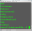
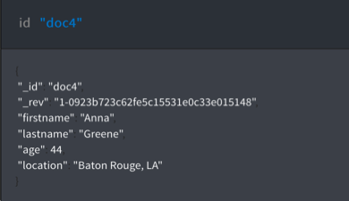

---

copyright:
  years: 2017, 2018
lastupdated: "2018-03-02"

---
{:new_window: target="_blank"}
{:shortdesc: .shortdesc}
{:screen: .screen}
{:codeblock: .codeblock}
{:pre: .pre}

# {{site.data.keyword.cloudant_short_notm}} 照会の作成

このチュートリアルでは、データベースを作成して文書を取り込み、索引を作成してデータベースの照会に使用する方法を示します。

 _コマンド・ライン_
と  _{{site.data.keyword.Bluemix_notm}} ダッシュボード_ の両方の演習が用意されています。 {{site.data.keyword.Bluemix}} ダッシュボードの演習では、各タスクの視覚的な例が示されています。 チュートリアル内のリンクをクリックすると、詳細が得られます。

まず、`query-demo` データベースと、以下の演習用のデータが入ったいくつかの文書を作成します。

## 前提事項

始める前に、次の手順に従って、チュートリアルの準備をします。

1.  [{{site.data.keyword.Bluemix}} アカウント  を作成します](https://console.ng.bluemix.net/registration/){:new_window}。
2.  [{{site.data.keyword.Bluemix_notm}} ダッシュボード ](https://console.ng.bluemix.net/catalog/services/cloudant-nosql-db){:new_window} にログインします。
3.  [{{site.data.keyword.Bluemix_notm}} で {{site.data.keyword.cloudant_short_notm}} インスタンスを作成します](create_service.html#creating-a-cloudant-instance-on-bluemix)。
4.  (オプション) コマンド・ラインから簡単・迅速にコマンドを実行できるように、[acurl 別名を作成します](../guides/acurl.html#authorized-curl-acurl-)。
5.  演習内に含まれるコマンドの `$ACCOUNT` 変数を、{{site.data.keyword.cloudant_short_notm}} ダッシュボードへのログインに使用するユーザー名に置き換えます。
  `acurl` をセットアップしない場合は、
  演習で示されている URL の代わりに、以下の URL を使用してください。
  ``` sh
  curl https://$USERNAME:$PASSWORD@$ACCOUNT.cloudant.com/query-demo
  ```
  {:codeblock}

## データベースの作成

このセクションでは、このチュートリアルで使用する[データベース](../api/database.html#create) `query-demo` を作成します。

> **注:** このチュートリアルでは、`curl` コマンドではなく、
  `acurl` 別名を使用します。
  `acurl` 別名は、[該当の説明手順](../guides/acurl.html#authorized-curl-acurl-)を使用して作成されます。
  `curl` コマンドを使用する場合、または別の方法で API エンドポイントを呼び出す場合は、
  使用するコマンドと、コマンドで必要なパラメーター (ユーザー名やパスワードなど) をこのチュートリアルで使用してください。

 _コマンド・ライン_

1.  次のコマンドを実行して、データベースを作成します。
  ``` sh
  acurl https://$ACCOUNT.cloudant.com/query-demo -X PUT
  ```
  {:codeblock}
2.  結果を確認します。
  ```json
  {
    "ok": true
    }
  ```
  {:codeblock}

 _{{site.data.keyword.Bluemix_notm}} ダッシュボード_

1.  作成した {{site.data.keyword.cloudant_short_notm}} サービス・インスタンスを開きます。
2.  「データベース (Databases)」タブを選択します。

  
3.  **「データベースの作成 (Create Database)」**をクリックします。
4.  `query-demo` と入力し、**「作成」**をクリックします。

  `query-demo` データベースが自動的に開きます。

## データベース内の文書の作成

この演習で作成する[文書](../api/document.html#documents)には、後の演習で `query-demo` データベースの照会に使用するデータが含まれます。

 _コマンド・ライン_

1.  サンプル・テキストをデータ・ファイル `bulkcreate.dat` にコピーし、5 つの文書を作成します。
  ```json
  {
    "docs": 
        [
      {
        "_id": "doc1",
                "firstname": "Sally",
                "lastname": "Brown",
                "age": 16,
                "location": "New York City, NY"
      },
      {
        "_id": "doc2",
                "firstname": "John",
                "lastname": "Brown",
                "age": 21,
                "location": "New York City, NY"
      },
      {
        "_id": "doc3",
                "firstname": "Greg",
                "lastname": "Greene",
                "age": 35,
                "location": "San Diego, CA"
      },
      {
        "_id": "doc4",
                "firstname": "Anna",
                "lastname": "Greene",
                "age": 44,
                "location": "Baton Rouge, LA"
      },
      {
        "_id": "doc5",
                "firstname": "Lois",
                "lastname": "Brown",
                "age": 33,
                "location": "Syracuse, NY"
            }
    ]
  }
  ```
  {:codeblock}

2.  次のコマンドを実行して、文書を作成します。
  ```sh
  acurl https://$ACCOUNT.cloudant.com/query-demo/_bulk_docs -X POST -H "Content-Type: application/json" -d \@bulkcreate.dat
  ```
  {:codeblock}

  **注:** データがファイル内に含まれることを示すための「`@`」記号は、指定された名前で識別されます。
3.  結果を確認します。
  ```json
  [
    {
      "ok":true,
      "id":"doc1",
      "rev":"1-57a08e644ca8c1bb8d8931240427162e"
    },
    {
      "ok":true,
      "id":"doc2",
      "rev":"1-bf51eef712165a9999a52a97e2209ac0"
    },
    {
      "ok":true,
      "id":"doc3",
      "rev":"1-9c9f9b893fcdd1cbe09420bc4e62cc71"
    },
    {
      "ok":true,
      "id":"doc4",
      "rev":"1-6aa4873443ddce569b27ab35d7bf78a2"
    },
    {
      "ok":true,
      "id":"doc5",
      "rev":"1-d881d863052cd9681650773206c0d65a"
    }
  ]
  ```
  {:codeblock}

 _{{site.data.keyword.Bluemix_notm}} ダッシュボード_

1.  **`+`** をクリックして**「新規文書 (New Doc)」**を選択します。 「新規文書 (New Document)」ウィンドウが開きます。
2.  文書を作成するために、次のサンプル・テキストをコピーして、新規文書内の既存テキストを置き換えます。

  _最初のサンプル文書_:
  ```json
  {
    "firstname": "Sally",
    "lastname": "Brown",
    "age": 16,
    "location": "New York City, NY",
    "_id": "doc1"
  }
  ```
  {:codeblock}

3.  ステップ 2 を繰り返して、残りの文書をデータベースに追加します。

  _2 番目のサンプル文書_:
  ```json
  {
    "firstname": "John",
    "lastname": "Brown",
    "age": 21,
    "location": "New York City, NY",
    "_id": "doc2"
  }
  ```
  {:codeblock}

  _3 番目のサンプル文書_:
  ```json
  {
    "firstname": "Greg",
    "lastname": "Greene",
    "age": 35,
    "location": "San Diego, CA",
    "_id": "doc3"
  }
  ```
  {:codeblock}

  _4 番目のサンプル文書_:
  ```json
  {
    "firstname": "Anna",
    "lastname": "Greene",
    "age": 44,
    "location": "Baton Rouge, LA",
    "_id": "doc4"
  }
  ```
  {:codeblock}

  _5 番目のサンプル文書_:
  ```json
  {
    "firstname": "Lois",
    "lastname": "Brown",
    "age": 33,
    "location": "New York City, NY",
    "_id": "doc5"
  }
  ```
  {:codeblock}

  `query-demo` データベースが作成されました。 右側のペインに文書が表示されます。

  

  

  

  

        

## 索引の作成

{{site.data.keyword.cloudant_short_notm}} には、データベースを照会するためのビューと索引があります。 ビューは、データベースに保存された照会を実行し、その結果が結果セットと呼ばれます。 ビューに対して照会をサブミットすると、照会はその結果セットを検索します。 索引は、データを構造化して検索時間を向上させるための方法です。

以下のリストに説明したように、{{site.data.keyword.cloudant_short_notm}} に付属の 1 次索引、ビューのような 2 次索引
(MapReduce)、検索索引、{{site.data.keyword.cloudant_short_notm}} 地理情報照会、または {{site.data.keyword.cloudant_short_notm}} 照会を使用できます。

*	1 次索引 – ID で文書または一連の文書を検索します。  
*	[ビュー](../api/creating_views.html#views-mapreduce-) – count、sum、average、その他の数学関数など、指定した検索基準に一致する情報をデータベースで検索します。 検索の基準は、ビューの定義で指定されます。 ビューは MapReduce パラダイムを使用します。
*	[検索索引](../api/search.html#search) – 1 つ以上のフィールドや大量のテキストを検索したり、[Lucene 照会パーサー構文 ](http://lucene.apache.org/core/4_3_0/queryparser/org/apache/lucene/queryparser/classic/package-summary.html#Overview){:new_window} でワイルドカード、ファジー検索、ファセットを使用したりします。
*	[{{site.data.keyword.cloudant_short_notm}} 地理情報](../api/cloudant-geo.html#cloudant-geospatial) – 空間の関係に基づいて文書を検索します。
*	[{{site.data.keyword.cloudant_short_notm}} 照会](../api/cloudant_query.html#query) – Mongo 形式の照会構文で、論理演算子を使用して文書を検索します。 {{site.data.keyword.cloudant_short_notm}} 照会は、ビューと検索索引の組み合わせです。 このチュートリアルでは、{{site.data.keyword.cloudant_short_notm}} 照会を使用します。

> **注:** 指定された照会に一致する定義済みの索引がない場合、{{site.data.keyword.cloudant_short_notm}} は
> `_all_docs` 索引を使用します。


 _コマンド・ライン_

1.  以下のサンプル JSON データをファイル `query-index.dat` にコピーします。
  ```json
{
	"index": {
		"fields": [
			"age",
			"lastname"
		],
		"partial_filter_selector": {
			"age": {
				"$gte": 30
			},
			"lastname": {
				"$eq": "Greene"
			}
		}
	},
  		"ddoc": "partial-index",
		"type": "json"
}
  ```
  {:codeblock}

2.  以下のコマンドを実行して、索引を作成します。
  ```sh
  acurl https://$ACCOUNT.cloudant.com/query-demo/_index -X POST -H "Content-Type: application/json" -d \@query-index.dat
  ```
  {:codeblock}

3.  結果を確認します。
  ```json
  {
    "result":"created",
    "id":"_design/752c7031f3eaee0f907d18e1424ad387459bfc1d",
    "name":"query-index"
  }
  ```
  {:codeblock}


 _{{site.data.keyword.Bluemix_notm}} ダッシュボード_

1.  **「すべての文書 (All Documents)」**または**「設計文書」**のいずれかのタブで
**`+` > 照会索引**をクリックします。
2.  以下のサンプル JSON データを**「索引」**フィールドに貼り付けます。
  ```json
{
	"index": {
		"fields": [
			"age",
			"lastname"
		],
		"partial_filter_selector": {
			"age": {
				"$gte": 30
			},
			"lastname": {
				"$eq": "Greene"
			}
		}
	},
  		"ddoc": "partial-index",
		"type": "json"
}
  ```
  {:codeblock}

  索引が作成されました。 右側のペインにそれが表示されます。

  


## 照会の作成

照会により、{{site.data.keyword.cloudant_short_notm}} からデータを抽出できます。 適切に作成された[照会](../api/cloudant_query.html#query)では、必要なデータのみが含まれるように検索とその結果を絞り込むことができます。

この演習では、単純な照会、2 つのフィールドによる照会、
[演算子](../api/cloudant_query.html#cloudant_query.html#operators)による照会を作成して実行する方法を示します。
演算子による照会では、少なくとも 1 つのフィールドと、それに対応する値を指定します。
その後、照会はこの値を使用して、データベースで一致を検索します。

ごく単純な照会を除き、JSON をデータ・ファイルに追加してコマンド・ラインからそれを実行します。

### 単純照会の実行

この例では、{{site.data.keyword.cloudant_short_notm}} 照会で `query-index` を使用して
`lastname` を検索し、メモリー内の結果をフィルタリングして `firstaname` を検索する方法を示します。   

 _コマンド・ライン_

1.  以下のサンプルの JSON をデータ・ファイル `query1.dat` にコピーします。
  ```json
    {
      "selector": {
            "lastname" : "Greene",
            "firstname" : "Anna"            
         }        
    }       
  ```    
  {:codeblock}

2.  以下のコマンドを実行して、データベースを照会します。
  ```sh
  acurl https://$ACCOUNT.cloudant.com/query-demo/_find -X POST -H "Content-Type: application/json" -d \@query1.dat
  ```
  {:codeblock}

3.  照会結果を確認します。
  ```json
  {
    "docs": [
      {
        "_id":"doc4",
        "_rev":"3-751ab049e8b5dd1ba045cea010a33a72",
            "firstname":"Anna",
            "lastname":"Greene",
            "age":44,
            "location":"Baton Rouge, LA"
      }
    ]
  }
  ```
  {:codeblock}

 _{{site.data.keyword.Bluemix_notm}} ダッシュボード_

1.  **「照会」**タブをクリックします。
2.  以下のサンプル JSON をコピーして {{site.data.keyword.cloudant_short_notm}} 照会ウィンドウに貼り付けます。
  ```json
   {
      "selector": {
            "lastname" : "Greene",
            "firstname" : "Anna"            
         }        
    }
  ```
  {:codeblock}

3.  **「照会の実行」**をクリックします。

  右側のペインに照会結果が表示されます。

  

### 2 つのフィールドによる照会の実行

この例では、2 つのフィールドを使用して、名前が `Brown` で、`New York City, NY` に住むすべての人を検索します。

この検索を記述するには、以下の例のような[「selector」式](../api/cloudant_query.html#selector-syntax)を使用します。
```json
  {
    "selector": {
      "lastname": "Brown",
      "location": "New York City, NY"
    }
  }
```
{:codeblock}

selector 式の詳細を追加することで、ニーズを満たすように結果を調整できます。
`fields` パラメーターでは、結果に含めるフィールドを指定します。 この例では、firstname、lastname、location を結果に含めます。 結果は、`sort` パラメーターの値に基づき、firstname の昇順でソートされます。
追加の詳細は、以下の例のようなものになります。
```json
{
  ...
  "fields": [
    "lastname",
    "firstname",
    "location"
  ],
  "sort" : [
    {
      "lastname": "asc"
    },
    {
      "firstname": "asc"
    }
  ]
}
```  
{:codeblock}

 _コマンド・ライン_

1.  サンプルの JSON をデータ・ファイル `query2.dat` にコピーします。
  ```json
  {
    "selector": {
      "lastname": "Brown",
      "location": "New York City, NY"
    },
    "fields": [
      "firstname",
      "lastname",
      "location"
    ],
  "sort" : [
    {
        "lastname": "asc"
      },
      {
        "firstname": "asc"
    }
    ]
  }
  ```
  {:codeblock}

2.  以下のコマンドを実行して、データベースを照会します。
  ```sh
  acurl https://$ACCOUNT.cloudant.com/query-demo/_find -X POST -H "Content-Type: application/json" -d \@query2.dat
  ```
  {:codeblock}

3.  照会結果を確認します。
  ```json
  {
    "docs": [
      {
        "firstname": "John",
        "lastname": "Brown",
        "location": "New York City, NY"
      },
      {
        "firstname": "Sally",
        "lastname": "Brown",
        "location": "New York City, NY"
      }
    ]
  }
  ```
  {:codeblock}

 _{{site.data.keyword.Bluemix_notm}} ダッシュボード_

1.  **「照会」**タブをクリックします。
2.  以下のサンプル JSON をコピーして {{site.data.keyword.cloudant_short_notm}} 照会ウィンドウに貼り付けます。
  ```json
  {
    "selector": {
      "lastname": "Brown",
      "location": "New York City, NY"
    },
    "fields": [
      "firstname",
      "lastname",
      "location"
    ],
  "sort" : [
    {
        "lastname": "asc"
      },
      {
        "firstname": "asc"
    }
    ]  
  }
  ```
  {:codeblock}

3.  **「照会の実行」**をクリックします。

  右側のペインに照会結果が表示されます。

  

### 演算子による照会の実行

この例では、`$eq` (等しい) と `$gt` (より大) の演算子を使用して、
`Greene` という lastname と、`30` を超える age を含む文書を検索します。

以下の例のような selector 式を使用します。
```json
{
  "selector": {
    "age": {
      "$gt": 30
    },
    "lastname": {
      "$eq": "Greene"
    }
  }
}
``` 
{:codeblock}

結果は、`sort` パラメーターの値に基づき、last name の昇順でソートされます。


```json
    "sort": [
      {
        "age": "asc"   
      },        
      {
        "lastname": "asc"
      }
    ] 
```  
{:codeblock}

 _コマンド・ライン_

1.  以下のサンプルの JSON をファイル `query3.dat` にコピーします。
  ```json
{
   "selector": {
      "age": {
         "$gt": 30
      },
    "lastname": {
         "$eq": "Greene"
    }
   },
    "fields": [
      "age",
      "firstname"
   ],
  "sort" : [
    {
         "age": "asc"
      },
      {
         "lastname": "asc"
      }
   ],
   "use_index": "_design/partial-index"
}
  ```
  {:codeblock}

2. この照会を実行します。
  ```sh
  acurl https://$ACCOUNT.cloudant.com/query-demo/_find -X POST -H "Content-Type: application/json" -d \@query3.dat
  ```
  {:codeblock}

3.  照会結果を確認します。
  ```json
{"docs":[
     {"age":35,"firstname":"Greg"},
     {"age":44,"firstname":"Anna"}
   ],
"bookmark": "g1AAAABCeJzLYWBgYMpgSmHgKy5JLCrJTq2MT8lPzkzJBYqzAFkmIDkOmFwOSHWiDkiSzb0oNTUvNSsLAEsmEeQ"
}
  ```
  {:codeblock}

 _{{site.data.keyword.Bluemix_notm}} ダッシュボード_

1.  **「照会」**タブをクリックします。
2.  以下のサンプル JSON をコピーして {{site.data.keyword.cloudant_short_notm}} 照会ウィンドウに貼り付けます。
  ```json
{
   "selector": {
      "age": {
         "$gt": 30
      },
    "lastname": {
         "$eq": "Greene"
    }
   },
    "fields": [
      "age",
      "firstname"
   ],
  "sort" : [
    {
         "age": "asc"
      },
      {
         "lastname": "asc"
      }
   ],
   "use_index": "_design/partial-index"
}
  ```
  {:codeblock}

3.  **「照会の実行」**をクリックします。

  右側のペインに照会結果が表示されます。

  

{{site.data.keyword.cloudant_short_notm}} について詳しくは、[{{site.data.keyword.cloudant_short_notm}} の資料](../cloudant.html#overview)を参照してください。
