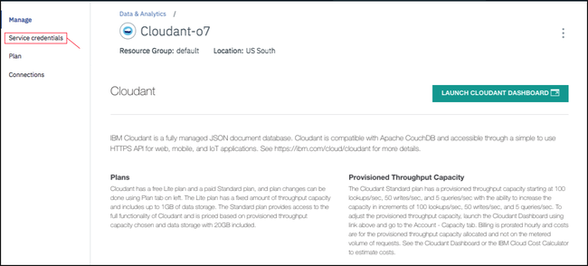

---

copyright:
  years: 2017, 2019
lastupdated: "2019-06-12"

keywords: create service instance, service credentials, locate service credentials

subcollection: cloudant

---

{:new_window: target="_blank"}
{:shortdesc: .shortdesc}
{:screen: .screen}
{:codeblock: .codeblock}
{:pre: .pre}
{:tip: .tip}
{:note: .note}
{:important: .important}
{:deprecated: .deprecated}

<!-- Acrolinx: 2018-09-19 -->

# {{site.data.keyword.cloudant_short_notm}} での {{site.data.keyword.cloud_notm}} インスタンスの作成
{: #creating-an-ibm-cloudant-instance-on-ibm-cloud}

このチュートリアルでは、{{site.data.keyword.cloud}} ダッシュボードを使用して{{site.data.keyword.cloudantfull}}
サービス・インスタンスを作成する方法を示します。
また、アプリケーションでデータベースを操作するための重要情報がある場所も示します。
{: shortdesc} 

## サービス・インスタンスの作成
{: #creating-a-service-instance}

1.  {{site.data.keyword.cloud_notm}} アカウントにログインします。 
    {{site.data.keyword.cloud_notm}} ダッシュボードは、
    [https://cloud.ibm.com/ ](https://cloud.ibm.com/){: new_window} にあります。
    ユーザー名とパスワードで認証すると、
    {{site.data.keyword.cloud_notm}} ダッシュボードが表示されます。 `「リソースの作成」`ボタンをクリックします。  
    

2.  メニューから「`データベース`」をクリックし、データベース・サービスのリストから「`Cloudant`」をクリックします。 
     

3.  サービス構成ウィンドウで、サービス名を入力します。 サービス名、地域/場所、リソース・グループ、および認証方式が正しいことを確認します。 必要に応じてタグを追加します。 使用可能な認証方式には、「`Use only IAM`」または「`Use both legacy credentials and IAM`」が含まれます。 詳しくは、『[認証方式](/docs/services/Cloudant?topic=cloudant-ibm-cloud-identity-and-access-management-iam-#ibm-cloud-identity-and-access-management-iam-){: new_window}』を参照してください。 
    この例で、サービス名は `Cloudant-o7` です。 
    
    
{{site.data.keyword.cloudant_short_notm}} チームでは、可能な場合は {{site.data.keyword.cloudant_short_notm}} レガシー認証を介した IAM アクセス制御を使用することをお勧めしています。
{: important}

4.  デフォルトで、サービスは「ライト」料金プランを使用して作成されます。これは、無料ですが、固定量のプロビジョン済みスループット能力とデータ・ストレージが付いてきます。 有料の {{site.data.keyword.cloud_notm}} アカウントを持っている場合は、「標準」プランも選択できるため、必要に応じてプロビジョン済みスループット能力を切り替えてデータ使用量を拡大できます。 料金プランについて詳しくは、『[プラン](/docs/services/Cloudant?topic=cloudant-ibm-cloud-public#plans){: new_window}』を参照してください。 サービスを作成するには、`「作成」`ボタンをクリックします。  
    

5.  新しい {{site.data.keyword.cloudant_short_notm}} サービスが利用可能であることを確認するサービス・ページが表示されます。
    アプリケーションがサービスに接続するために必要な接続情報を作成するには、
    `「サービス資格情報」`タブをクリックします。 
    

6.  以下のようにして、新規の {{site.data.keyword.cloudant_short_notm}} サービス資格情報を作成します。
   a. `「新規資格情報」`ボタンをクリックします。
   
   b. 「新規資格情報の追加」ウィンドウで新規資格情報の名前を入力します。 画像を参照。
   c. マネージャーの役割を受け入れます。
   d. (オプション) 新規サービス ID を作成するか、自動的に生成します。 
   d. (オプション) インライン構成パラメーターを追加します。 このパラメーターは現在 {{site.data.keyword.cloudant_short_notm}} サービス資格情報によって使用されていない点に注意し、無視してください。 
   e. `「追加」`ボタンをクリックします。 
   
   表の後に新規資格情報が表示されます。 
   f. 「アクション」の下の「`資格情報の表示`」をクリックします。
   

7.  以下のようにサービス資格情報の詳細が表示されます。 
    

これらの例のサービス資格情報は、デモの {{site.data.keyword.cloudant_short_notm}} サービスが {{site.data.keyword.cloudant_short_notm}} で作成されたときに定義されたものです。 これらの資格情報は、ダッシュボードでどう表示されるかを示すためにここで再現されています。 {{site.data.keyword.cloudant_short_notm}} サービスは削除されたため、これらの資格情報はもう有効ではありません。_必ず_、ご自分のサービス資格情報を提供して使用してください。
{: note}

## サービス資格情報
{: #the-service-credentials}

サービス資格情報は大切です。 資格情報にアクセスできるユーザーまたはアプリケーションは、サービス・インスタンスに対して事実上何でも実行できます。 例えば、偽造データを作成したり、重要な情報を削除したりする可能性があります。 これらの資格情報は、大切に保護してください。
    
{{site.data.keyword.cloudant_short_notm}} では、プロビジョニング時に「`Use only IAM`」または「`Use both legacy credentials and IAM`」の 2 つの認証方式が使用可能です。 レガシー資格情報の詳細を表示できるのは、「`Use both legacy credentials and IAM`」認証方式を選択した場合のみになります。 資格情報は、インスタンスの「サービス資格情報」タブに表示されます。 これらの認証スタイルの使用について詳しくは、『[IAM ガイド](/docs/services/Cloudant?topic=cloudant-ibm-cloud-identity-and-access-management-iam-#ibm-cloud-identity-and-access-management-iam-)』および 『[レガシー認証](/docs/services/Cloudant?topic=cloudant-authentication#authentication)』文書を参照してください。

サービス資格情報には以下のフィールドがあります。

フィールド | 目的
------|--------
`username` | URL でのサービス・インスタンス・ユーザーのサービス名。 このフィールドは、管理ユーザー名としても機能します。 
`password` | アプリケーションがサービス・インスタンスにアクセスするために必要なレガシー資格情報のパスワード。 このフィールドは、「`Use both legacy credentials and IAM`」オプションが選択されている場合にのみ表示されます。 
`host` | アプリケーションがサービス・インスタンスを検索するために使用するホスト名。 このフィールドは、「`Use both legacy credentials and IAM`」オプションが選択されている場合にのみ表示されます。 
`port` | ホスト上のサービス・インスタンスにアクセスするための HTTPS ポート番号。 {{site.data.keyword.cloudant_short_notm}} では HTTPS アクセスのみが許可されるため、これは 443 になります。 このフィールドは、「`Use both legacy credentials and IAM`」オプションが選択されている場合にのみ表示されます。 
`url`	| {{site.data.keyword.cloudant_short_notm}} インスタンスにアクセスするための HTTPS URL。 「`Use both legacy credentials and IAM`」オプションが選択されている場合は、組み込まれたレガシー・ユーザー名とパスワードも含まれます。 
`apikey` | IAM API キー。 
`iam_apikey_description` | IAM API キーの説明。 
`iam_apikey_name` | IAM API キーの ID。
`iam_role_crn` | IAM API キーの IAM 役割。
`iam_serviceid_crn`	| サービス ID の CRN。

サービス・インスタンスにアクセスできるアプリケーションを作成するには、これらの資格情報が必要です。

## サービス資格情報の検索
{: #locating-your-service-credentials}

アカウントに関連付けられたサービスの資格情報は、いつでも参照することができます。

1.  まず、{{site.data.keyword.cloud_notm}} にログインします。
    {{site.data.keyword.cloud_notm}} ダッシュボードは、
    [https://cloud.ibm.com/ ](https://cloud.ibm.com/){: new_window} にあります。
    ユーザー名とパスワードで認証すると、
    {{site.data.keyword.cloud_notm}} ダッシュボードが表示されます。 
    

2.  この例では、このチュートリアルで前に作成された {{site.data.keyword.cloudant_short_notm}} サービス・インスタンス `Cloudant-o7` のサービス資格情報を検索します。 **「メニュー」** アイコン > **「リソース・リスト」**をクリックし、該当する行をクリックします。 
    

3.  サービスへのアクセスに必要な資格情報を表示するには、
    `「資格情報の表示」`をクリックします。 
    

4.  以下のようにサービス資格情報の詳細が表示されます。 
    

これらの例のサービス資格情報は、デモの {{site.data.keyword.cloudant_short_notm}} サービスが {{site.data.keyword.cloudant_short_notm}} で作成されたときに定義されたものです。 これらの資格情報は、ダッシュボードでどう表示されるかを示すためにここで再現されています。 {{site.data.keyword.cloudant_short_notm}} サービスは削除されたため、これらの資格情報はもう有効ではありません。_必ず_、ご自分のサービス資格情報を提供して使用してください。
{: note}

