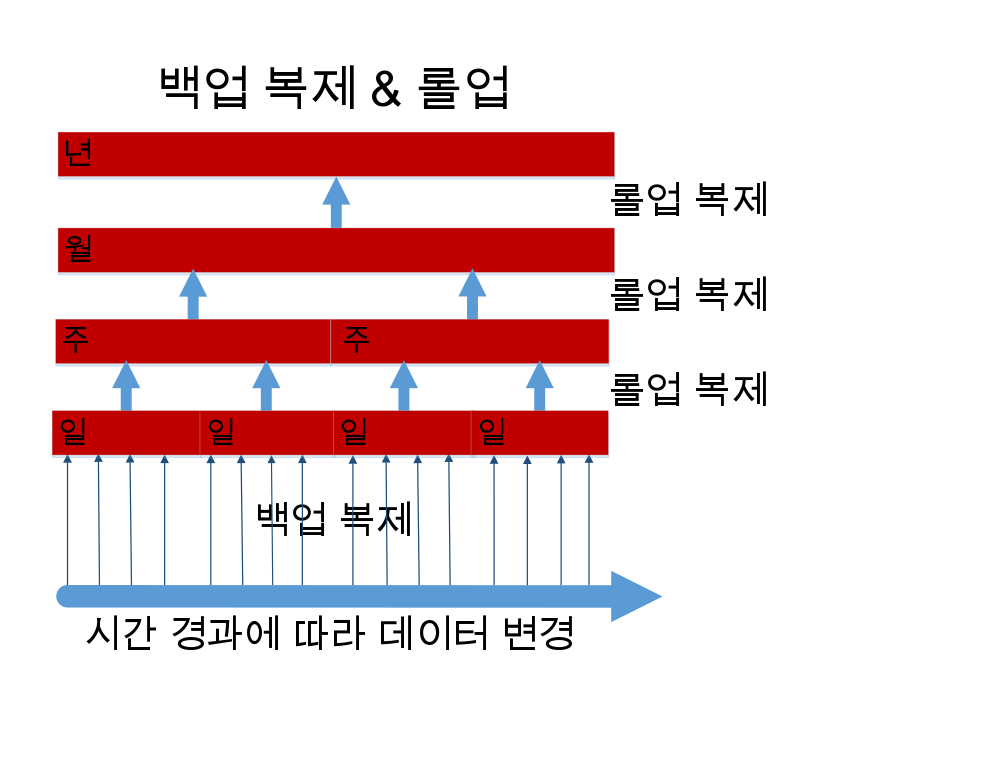

---

copyright:
  years: 2015, 2017
lastupdated: "2017-05-04"

---

{:new_window: target="_blank"}
{:shortdesc: .shortdesc}
{:screen: .screen}
{:codeblock: .codeblock}
{:pre: .pre}

# 데이터 백업

>   **참고**: 이 안내서는 *더 이상 사용되지 않는* 일별 증분 백업 기능에 대해 안내하고 있습니다. 
    이전에는 엔터프라이즈 고객이 요청하는 경우에만 이 기능을 사용할 수 있었습니다.
    현재 백업에 대한 안내는 [재해 복구 및 백업](disaster-recovery-and-backup.html) 안내서를 참조하십시오.

이 기능은 다음과 같습니다. 
-   기본적으로, 사용으로 설정되어 있지 않습니다. 
-   이를 명시적으로 요청한 엔터프라이즈 고객만 사용할 수 있습니다. 
-   작동 가능하려면 명시적으로 구성되어 있어야 합니다. 
-   [알려진 제한사항](#known-limitations)의 대상입니다. 
-   [Cloudant Local ](https://www.ibm.com/support/knowledgecenter/SSTPQH_1.0.0/com.ibm.cloudant.local.doc/SSTPQH_1.0.0_welcome.html){:new_window}에 적용할 수 없습니다.
자세한 정보는 [IBM Cloudant 지원 팀 ](mailto:support@cloudant.com){:new_window}에 문의하십시오. 

>   **참고**: 일별 증분 백업 기능은 
    [Cloudant Local ](https://www.ibm.com/support/knowledgecenter/SSTPQH_1.0.0/com.ibm.cloudant.local.doc/SSTPQH_1.0.0_welcome.html){:new_window}에 적용할 수 없습니다.
    Cloudant Local의 데이터를 백업하려면
    [복제](../api/replication.html)를 사용하여 데이터베이스의 사본을 작성하십시오.

고가용성을 보장하기 위해
{{site.data.keyword.cloudant}}에서는 각 문서의 사본을 세 개 작성하며
이를 각각 클러스터 내의 서로 다른 세 개 서버에 저장합니다.
모든 Cloudant 사용자는 기본적으로 이 방식을 따릅니다.
데이터가 3중으로 복제되는 경우라도
데이터를 백업하는 것은 여전히 중요합니다. 

백업이 중요한 이유는 무엇일까요?
사용자는 다양한 방식으로 데이터에 액세스하지 못하게 될 수 있습니다.
예를 들어, 허리케인으로 인해 데이터 센터와 해당 위치에 있는 세 개 노드가 모두 손상되는 경우에는 데이터가 유실됩니다.
사용자는 다른 지리적 위치의 클러스터(데디케이티드 또는 멀티 테넌트)에 데이터를 복제하여
재해 발생 시 데이터가 유실되는 경우를 방지할 수 있습니다.
그러나 결함이 있는 애플리케이션이 데이터베이스의 데이터를 삭제하거나 겹쳐쓰는 경우
데이터 복제는 도움이 되지 않습니다. 

검증된 종합적인 백업 기능을 갖추고 있으면 "유실되거나 손상되는 경우 데이터를 어떻게 복원할 수 있습니까?"라는
질문에 자신있게 응답할 수 있게 됩니다. 

엔터프라이즈 고객은 Cloudant를 사용하여 일별 증분 백업을 확보할 수 있습니다. 

엔터프라이즈 고객이 아니거나 고유한 백업 메커니즘을 작성하려는 경우에는
[복제를 사용한 백업 수행](disaster-recovery-and-backup.html)을 고려하십시오. 

>   **참고**: 엔터프라이즈 고객을 위한 일별 증분 백업은 현재 *베타* 기능입니다. 
    기본적으로, 사용으로 설정되어 있지 않습니다.

일별 증분 백업 또는 '델타'는 문서 비교를 가능하게 하며
단일 문서 복원을 더 쉽게 수행하도록 지원합니다.
정기적으로, 소량의 일별 델타가 주별 델타로 수집됩니다. 주기는 구성할 수 있습니다.
마찬가지로, 주별 델타는 월별 델타로 롤업되고, 월별 델타는 연간 델타로 롤업됩니다.
이러한 델타 롤업 프로세스는 문서의 특정 버전을 정확하게 복원하는 기능과
많은 스토리지 공간을 필요로 하는 점을 실용적으로 절충한 결과입니다. 

이 백업 기능을 통해 개별 문서를 수동으로 복원할 수 있습니다.
예를 들어, 재해 복구 시나리오의 일부처럼
전체 데이터베이스를 복원해야 하는 경우에는
지원 팀에 문의하여 사용 가능한 델타 내에서 데이터를
특정 일, 주, 월 또는 년으로 복원할 수 있습니다. 

Cloudant가 데이터를 백업하는 방법에 대한 자세한 정보는 이 주제의 나머지 내용에서 제공됩니다.
추가 지원이 필요하거나 이 데이터 백업을 사용으로 설정하도록 요청하려는 경우에는
Cloudant 지원 팀([support@cloudant.com ](mailto:support@cloudant.com){:new_window})에 문의하십시오. 

>   **참고**: Cloudant 백업 기능은 엔터프라이즈 고객만 사용할 수 있습니다. 

>   **참고**: 기본적으로, 
    `_design` 문서는 백업되지 않으며
    따라서 인덱스는 증분 백업 데이터베이스에 빌드되지 _않습니다_.
    `_design` 문서의 백업이 필요한 경우에는
    사용자가 이를 원하는 소스 제어 도구에 보존해야 합니다.

## 개념

백업 개념을 알아볼 때는 다음 용어를 이해하면 도움이 됩니다. 

용어                 | 의미
---------------------|--------
백업 정리            | 델타 데이터베이스가 롤업되면 구성 가능한 기간 후 델타 데이터베이스가 제거됩니다. 이를 통해 데이터 보존과 스토리지 비용 간의 균형을 적절히 조정할 수 있습니다. 
백업 롤업            | 일별 백업은 주별 롤업 데이터베이스로 결합됩니다. 이는 일별 델타를 더 큰 단위의 백업으로 결합합니다. 마찬가지로 주별 데이터베이스는 월별 데이터베이스로, 월별 데이터베이스는 연간 데이터베이스로 롤업됩니다. 
백업 실행            | 백업 기간 동안, 소스 데이터베이스는 백업 기간 내에 문서가 변경되었는지 판별하는 시퀀스 값을 사용하여 복제됩니다. 완료되면 이 복제가 일별 백업이 됩니다. 
기준선 백업          | 델타 데이터베이스를 비교할 수 있는 문서 콜렉션입니다. 
일별 백업            | 백업 실행을 참조하십시오 .
일별 델타            | 일별 백업의 다른 이름입니다. 
델타 데이터베이스    | 특정 기간 내에 변경된 문서의 콜렉션('델타')입니다. 
작은/큰 단위         | 이는 문서 변경 기간을 얼마나 정확히 지정할 수 있는지 나타냅니다. 작은 단위 롤업은 변경 기간에 대한 시간 스케일이 짧습니다(예: 일별 백업의 경우 1일). 큰 단위 롤업은 변경 기간에 대한 시간 스케일이 깁니다(예: 연간 백업의 경우 1년). 
증분 백업            | 마지막 백업 이후 데이터베이스에서 변경된 문서의 콜렉션입니다. 
롤업                 | 증분 백업의 콜렉션을 더 큰 단위의 백업으로 집계합니다(예: 일주일 전체의 여러 일별 백업을 하나의 '주별' 백업으로 집계). 

## 증분 백업

증분 백업 사용 설정의 첫 번째 단계는 전체 데이터베이스의 백업을 수행하는 것입니다.
이 작업은 후속 증분 백업의 '기준선'을 제공합니다. 

매일, 첫 번째 '기준선' 백업 후 일별 증분 백업이 수행됩니다.
이 일별 증분 백업은 마지막 백업 후 데이터베이스에서 변경된 데이터만을 포함합니다.
이 일별 백업이 '일별 델타'입니다. 

데이터 백업 사용 설정 요청의 일부로서,
사용자는 백업을 실행할 특정 시간을 지정할 수 있습니다.
일별 델타는 매일 사용자가 지정한 시간에 작성됩니다. 

## 롤업

롤업은 일별 백업을 주별 롤업 데이터베이스로 결합합니다.
이러한 롤업 데이터베이스는 일별 델타를 더 큰 시간 단위로 결합합니다. 주별 데이터베이스는 월별 데이터베이스로,
월별 데이터베이스는 연간 데이터베이스로 롤업됩니다. 



백업을 사용으로 설정하도록 요청하는 경우 보존할 일별 델타의 수를 지정해야 합니다.
해당 숫자에 도달하면 가장 오래된 일별 델타가 최신 월별 데이터베이스에 롤업됩니다.
그 후 주별 데이터베이스가 롤업되어 월별 데이터베이스를 작성하며, 더 큰 단위로 이 작업이 반복됩니다. 

델타 데이터베이스가 롤업되고 나면 스토리지 공간을 확보하기 위해 데이터베이스는 제거됩니다. 

## 복원

데이터베이스의 백업을 작성한 후에는 해당 데이터베이스 내의 개별 문서를 볼 수 있으며 해당 문서에 작성된 변경사항도 볼 수 있습니다.
또한 해당 델타의 단위 내에서 사용 가능한 특정 날짜의 버전으로 해당 문서를 복원할 수도 있습니다. 

>   **참고**: 백업에서 복원하려면 문서가 정적이어야 합니다. 
    즉, 해당 문서가 지속적으로 변경 또는 업데이트를 허용하는 상태가 아니어야 합니다.

전체 데이터베이스 복원과 같은 더 복잡한 복원의 경우에는
[Cloudant 지원 ](mailto:support@cloudant.com){:new_window}에 지원을 요청하십시오. 

## 대시보드 사용

엔터프라이즈 고객은 Cloudant 대시보드를 사용하여 백업의 상태 및 히스토리를 검토할 수 있습니다. 

수행할 수 있는 태스크는 다음과 같습니다. 

-   날짜 및 시간을 포함하여 마지막 백업의 상태를 봅니다. 
-   날짜 및 시간별로 백업 문서 버전의 목록을 봅니다. 
-   현재 문서를 보고 이 문서와 백업된 버전 간의 차이점을 봅니다. 
-   백업된 버전에서 문서를 복원합니다. 

### 데이터베이스 백업 상태 보기


Cloudant 대시보드에서 데이터베이스 탭을 선택하면 각 데이터베이스에 대한 백업 상태 열을 볼 수 있습니다. 

### 문서 백업 상태 보기


데이터베이스 내에 있는 특정 문서의 백업 상태를 볼 수 있습니다.
이를 수행하려면 먼저, 문서에 대한 백업 아이콘()이
있는지 확인하십시오. 이는 특정 문서가 백업 태스크 내에 포함되어 있는지 보여줍니다. 

문서를 선택하면 백업 탭이 표시됩니다. 


### 문서 백업 버전 간 차이점 보기 및 복원


문서의 백업 탭을 클릭하면 해당 문서의 현재 버전과 백업 버전 간의 차이점을 볼 수 있습니다. 

이 문서의 특정 백업 버전을 복원하기로 결정한 경우에는 복원할 백업의 날짜를 선택한 후 '복원' 단추를 클릭하기만 하면 됩니다. 

>   **참고**: 백업에서 복원하려면 문서가 정적 상태여야 합니다. 
    즉, 해당 문서가 지속적으로 변경 또는 업데이트를 허용하는 상태가 아니어야 합니다.

## API 사용

Cloudant 백업 기능 관련 작업에는 몇 가지 REST API를 사용할 수 있습니다. 

### 태스크 구성

`task` 호출은 사용자의 백업 태스크 구성을 가져옵니다. 

`format` 매개변수를 사용하여 응답에서 사용되는 형식을 지정할 수 있습니다. 

_결과를 목록 형식(기본값)으로 리턴하는 사용자의 백업 태스크 구성 요청의 HTTP를 사용한 예:_

```http
GET /_api/v2/backup/task HTTP/1.1
```
{:codeblock}

_결과를 목록 형식(기본값)으로 리턴하는 사용자의 백업 태스크 구성 요청의 명령행을 사용한 예:_

```sh
curl https://$ACCOUNT.cloudant.com/_api/v2/backup/task \
    -X GET
```
{:codeblock}

_결과를 맵핑 형식으로 리턴하는 사용자의 백업 태스크 구성 요청의 HTTP를 사용한 예:_

```http
GET /_api/v2/backup/task?format=mapping HTTP/1.1
```
{:codeblock}

_결과를 맵핑 형식으로 리턴하는 사용자의 백업 태스크 구성 요청의 명령행을 사용한 예:_

```sh
curl https://$ACCOUNT.cloudant.com/_api/v2/backup/task?format=mapping \
     -X GET
```
{:codeblock}

기본 응답 형식은 목록입니다. `...backup/task?format=list` 매개변수를 사용하여 이 형식을 직접 요청할 수 있습니다.
이 응답은 사용자가 정의한 백업 태스크의 단순 목록을 포함합니다. 

예를 들면, 다음 명령 중 하나를 사용하여 목록 형식의 응답을 요청할 수 있습니다. 

```http
https://$ACCOUNT.cloudant.com/_api/v2/backup/task

https://$ACCOUNT.cloudant.com/_api/v2/backup/task?format=list
```
{:codeblock}

_목록 형식 요청 뒤의 응답 예:_

```json
{
    "rows": [
        {
            "username": "$ACCOUNT",
            "task": "backup-0d0b0cf1b0ea42179f9c082ddc5e07cb",
            "source_db": "backmeup",
            "latest_completion": null
        },
        {
            "username": "$ACCOUNT",
            "task": "backup-d0ea6e8218074699a562af543db66615",
            "source_db": "backuptest",
            "latest_completion": "2016-01-17T05:57:44+00:00"
        },
        {
            "username": "$ACCOUNT",
            "task": "backup-24cd8359b94640be85b7d4071921e781",
            "source_db": "taskdb",
            "latest_completion": "2016-01-17T00:01:04+00:00"
        }
    ]
}
```
{:codeblock}

더 포괄적인 응답은 맵핑 형식으로 사용 가능합니다. `...backup/task?format=mapping` 매개변수를 사용하여 이 형식을 직접 요청할 수 있습니다. 

예를 들면, 다음 명령을 사용하여 맵핑 형식의 응답을 요청할 수 있습니다. 

```http
https://$ACCOUNT.cloudant.com/_api/v2/backup/task?format=mapping
```
{:codeblock}

_맵핑 형식 요청 뒤의 응답 예:_

```json
{
    "backmeup": {
        "username": "$ACCOUNT",
        "task": "backup-0d0b0cf1b0ea42179f9c082ddc5e07cb",
        "source_db": "backmeup",
        "latest_completion": null
    },
    "backuptest": {
        "username": "$ACCOUNT",
        "task": "backup-d0ea6e8218074699a562af543db66615",
        "source_db": "backuptest",
        "latest_completion": "2016-01-17T05:57:44+00:00"
    },
    "taskdb": {
        "username": "$ACCOUNT",
        "task": "backup-24cd8359b94640be85b7d4071921e781",
        "source_db": "taskdb",
        "latest_completion": "2016-01-17T00:01:04+00:00"
    }
}
```
{:codeblock}

### 특정 데이터베이스에 대한 백업 태스크 판별

`task` 요청의 `databases` 매개변수는 어떤 백업 태스크가 지정된 데이터베이스와 연관되어 있는지 알아보는 데 사용됩니다. 

응답은 데이터베이스에 대해 식별된 백업 태스크 세부사항을 `source_db` 필드에 나열합니다.
식별된 `task`는 [데이터베이스 나열](#list-of-databases)과 같은 기타 백업 API 호출에 사용할 수 있습니다. 

_`backuptest` 및 `taskdb` 데이터베이스에 대한 백업 태스크 찾기 명령의 HTTP를 사용한 예:_

```http
GET /_api/v2/backup/task?databases=backuptest,taskdb HTTP/1.1
```
{:codeblock}

_`backuptest` 및 `taskdb` 데이터베이스에 대한 백업 태스크 찾기 명령의 명령행을 사용한 예:_

```sh
curl https://$ACCOUNT.cloudant.com/_api/v2/backup/task?databases=backuptest,taskdb \
    -X GET
```
{:codeblock}

_특정 데이터베이스에 대한 백업 태스크 찾기에 대한 응답 예:_

```json
{
    "rows": [
        {
            "username": "$ACCOUNT",
            "task": "backup-d0ea6e8218074699a562af543db66615",
            "source_db": "backuptest",
            "latest_completion": "2016-01-17T05:57:44+00:00"
        },
        {
            "username": "$ACCOUNT",
            "task": "backup-24cd8359b94640be85b7d4071921e781",
            "source_db": "taskdb",
            "latest_completion": "2016-01-17T00:01:04+00:00"
        }
    ]
}
```
{:codeblock}

### 데이터베이스 목록

`monitor` 요청은 백업 태스크 `$TASKNAME`에 의해 작성되었으며
문서 `$DOCID`를 포함하는 데이터베이스의 목록을 가져옵니다. 

이 요청은 선택적 인수 `include_docs`를 지원합니다.
기본값은 `false`입니다. `true`로 지정된 경우
`monitor` 요청은 `$DOCID`를 포함하는 각 백업 데이터베이스에 대해 전체 문서 컨텐츠를 리턴합니다. 

_HTTP를 사용하여, 백업 태스크에 의해 작성되었으며 특정 문서를 포함하는 데이터베이스의 목록 검색:_

```http
GET /_api/v2/backup/monitor/$TASKNAME/$DOCID?include_docs=true HTTP/1.1
```
{:codeblock}

_명령행을 사용하여, 백업 태스크에 의해 작성되었으며 특정 문서를 포함하는 데이터베이스의 문서 검색:_

```sh
curl https://$ACCOUNT.cloudant.com/_api/v2/backup/monitor/$TASKNAME/$DOCID?include_docs=true \
    -X GET
```
{:codeblock}

### 문서 복원

`restore` 호출은 소스 데이터베이스에서 `$DOCID`로 식별된 문서를 대체합니다.
소스 데이터베이스는 `$TASKNAME`으로 식별됩니다.
`$TASKDATE`는 특정 백업의 시간소인이며 백업이 수행된 시점을 지정합니다.
`$FREQUENCY`는 다음 네 가지 값 중 하나입니다. 
-   `"daily"`
-   `"weekly"`
-    `"monthly"`
-   `"yearly"`

>   **참고**: 백업으로부터 문서를 복원하려면 문서가 정적 상태여야 합니다. 
    즉, 해당 문서가 복원이 진행 중인 동안 변경 또는 업데이트를 허용하는 상태가 아니어야 합니다.

_HTTP를 사용한 문서 복원 요청의 예:_

```http
POST /_api/v2/backup/restore/document --data=@RESTORE.json HTTP/1.1
Content-Type: application/json
```
{:codeblock}

_특정 백업 데이터베이스에 저장되어 있는 특정 문서의 최신 버전 복원 요청의 명령행을 사용한 예:_

```sh
curl https://$ACCOUNT.cloudant.com/_api/v2/backup/restore/document --data=@RESTORE.json \
    -X POS \
    -H "Content-Type: application/json" \
    -d "$JSON"
```
{:codeblock}

_특정 백업 데이터베이스에 보존되어 있는 특정 문서의 최신 버전을 복원하도록 요청하는 JSON 문서의 예:_

```json
{
    "doc_id": $DOCID,
    "task_name": $TASKNAME,
    "task_date": $TASKDATE,
    "frequency": $FREQUENCY
}
```
{:codeblock}

## 증분 복제를 사용한 백업의 작동 방식

매우 단순한 형식의 백업은 데이터베이스를 날짜 지정된 백업 데이터베이스에 [복제](../api/replication.html)하는 것입니다. 

이 방법은 백업 방법으로 사용 가능하며 수행하기 쉽습니다.
그러나 데이터베이스가 크고 여러 시점의 백업을 필요로 하는 경우(예:
일곱 개의 일별 백업과 네 개의 주별 백업)에는 결국
모든 문서의 전체 사본을 각 새 백업 데이터베이스에 저장하게 됩니다.
이렇게 되면 매우 많은 스토리지 공간이 필요하게 됩니다. 

증분 백업은 마지막 백업 후 변경된 문서만 저장하므로 이러한 문제에 대한 좋은 해결책입니다. 

처음에는 전체 데이터베이스의 백업을 수행합니다.
첫 번째 백업 후에는 정기적인 증분 백업을 실행하여
마지막 백업 후 데이터베이스에서 변경된 것만 백업합니다.
일반적으로 이러한 증분 백업은 하루에 한 번 수행되므로
이 복제가 일별 백업이 됩니다. 

증분 백업은 각 백업 간의 델타만 저장합니다.
정기적인 간격으로 소스 데이터베이스가 대상 데이터베이스에 복제됩니다.
복제는 시퀀스 값을 사용하여 간격 기간 중에 변경된 문서를 식별합니다. 

백업 오퍼레이션은 복제를 사용하여 체크포인트를 가져오고 저장합니다.
이 체크포인트는 내부 이름을 가진 다른 데이터베이스입니다. 

데이터베이스의 복제 프로세스는 `since_seq` 매개변수의 값을 찾는 것으로 시작됩니다.
이 매개변수는 마지막 복제가 완료된 지점을 표시합니다. 

>   **참고**: 의미상, `since_seq` 옵션을 사용하는 것은 일반 복제 체크포인트 작성 기능을 사용 안함으로 설정합니다. `since_seq`는 신중하게 사용하십시오.  

다음 단계는 증분 백업이 작성되는 방식을 간략하게 보여줍니다. 

1.  [마지막 복제에 대한 체크포인트 문서의 ID를 찾으십시오. ](#find-the-id-of-the-checkpoint-document-for-the-last-replication)
2.  [`recorded_seq` 값을 가져오십시오. ](#get-the-recorded_seq-value)
3.  [증분 백업을 실행하십시오. ](#run-an-incremental-backup)

### 마지막 복제에 대한 체크포인트 문서의 ID 찾기

체크포인트 ID 값은 `_replicator` 데이터베이스에 있는 복제 문서의 `_replication_id` 필드에 저장되어 있습니다. 

_`original`이라는 데이터베이스의 마지막 증분 백업 체크포인트 ID를 가져오는 요청의 HTTP를 사용한 예:_

```http
GET /_replicator/original HTTP/1.1
```
{:codeblock}

_`original`이라는 데이터베이스의 마지막 증분 백업 체크포인트 ID를 가져오는 요청의 명령행을 사용한 예:_

```sh
replication_id=$(curl "${url}/_replicator/original" | jq -r '._replication_id')
```
{:pre}

### `recorded_seq` 값 가져오기

체크포인트 ID를 가져온 후에는 이를 사용하여 원래 데이터베이스의 `/_local/${replication_id}` 문서에 있는 히스토리 배열의 첫 번째 요소에서 `recorded_seq` 값을 가져옵니다. 

_`original`이라는 데이터베이스에서 `recorded_seq` 값 가져오기의 HTTP를 사용한 예_

```http
GET /original/_local/${replication_id} HTTP/1.1
```
{:codeblock}

_`original`이라는 데이터베이스에서 `recorded_seq` 값 가져오기의 명령행을 사용한 예:_

```sh
recorded_seq=$(curl "${url}/original/_local/${replication_id}" | jq -r '.history[0].recorded_seq')
```
{:pre}

### 증분 백업 실행

체크포인트 ID 및 `recorded_seq`를 확보하고 나면 새 증분 백업을 시작할 수 있습니다. 

_`newbackup`이라는 증분 데이터베이스로의 새 증분 백업 시작의 HTTP를 사용한 예:_

```http
PUT /_replicator/newbackup HTTP/1.1
Content-Type: application/json
```
{:codeblock}

_`newbackup`이라는 증분 데이터베이스로의 새 증분 백업 시작의 명령행을 사용한 예:_

```sh
curl -X PUT "${url}/_replicator/newbackup" -H "${ct}" -d @newbackup.json
```
{:codeblock}

_증분 백업을 지정하는 JSON 파일의 예:_

```json
{
    "_id": "newbackup",
    "source": "${url}/original",
    "target": "${url}/newbackup",
    "since_seq": "${recorded_seq}"
}
```
{:codeblock}

## 알려진 제한사항

>   **참고**: 엔터프라이즈 고객을 위한 일별 증분 백업은 현재 베타 기능입니다. 
    기본적으로, 사용으로 설정되어 있지 않습니다.

-   IBM Cloudant 백업 및 연관된 복원 기능은
    기존 복제 기술을 기반으로 하고 있습니다.
    복제에 영향을 주거나 인터럽트시키는 요소는
    백업 또는 복원 프로세스에 영향을 주거나 이를 지연시킬 수 있습니다. 
-   대형 데이터베이스(예: 100GB 이상의 크기)에 대한 백업 및 복원 프로세스에는
    상당한 시간이 소요될 수 있습니다. 이는 첫 백업에 적용되며,
    완료되는 데 몇 일이 소요될 수도 있습니다. 마찬가지로,
    복원 프로세스 또한 데이터베이스의 크기에 따라 몇 시간에서
    며칠이 소요될 수 있습니다. 
-   용량이 큰 일별 백업의 경우에는 백업 프로세스가
    하루(24시간) 안에 완료되지 않을 수 있습니다.
    백업 프로세스는 보통 완료될 때까지 실행되므로,
    하루 이상의 증분 변경사항이 포함될 수 있습니다. 
-   현재 전체 사용자 계정 백업에 대한 지원은 없습니다.
    대신, 사용자가 백업 또는 복원을 사용으로 설정할 사용자 계정 내 데이터베이스를 지정해야 합니다.
    현재 하나의 사용자 계정에서 백업을 사용으로 설정할 수 있는 데이터베이스 개수에 대한 한계는 50개입니다. 
-   IBM Cloudant 백업 기능은 현재 [디자인 문서](../api/design_documents.html)에 대한
    백업 또는 복원을 지원하지 않습니다. 디자인 문서에 대한 백업이 필요한 경우에는 사용자가 이를
    원하는 소스 제어 도구에 보존해야 합니다. 
-   현재, 데이터베이스 복원을 수행하는 데 필요한 대상 데이터베이스는 소스 데이터베이스와 달라야 합니다. 
