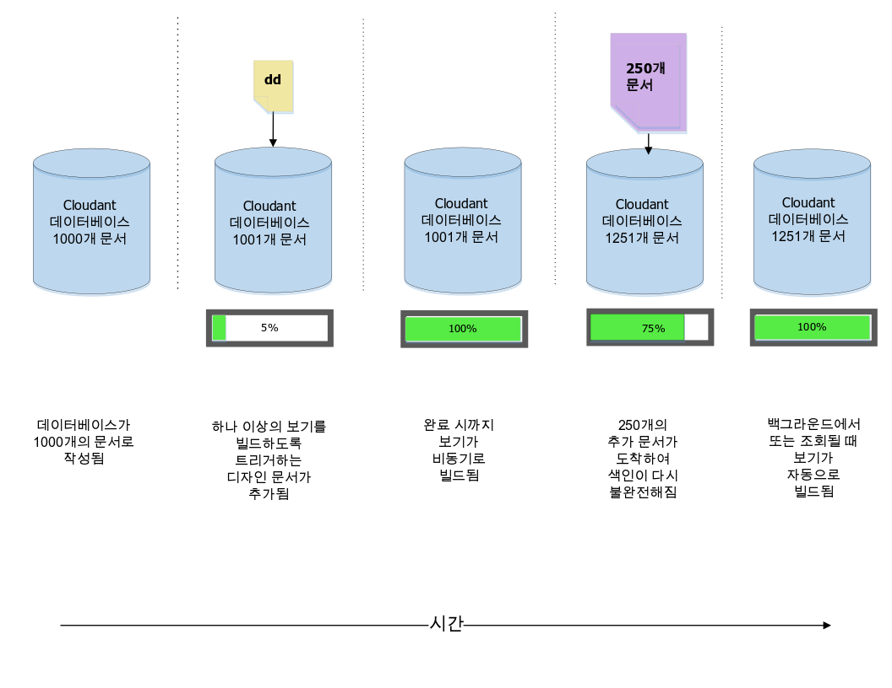
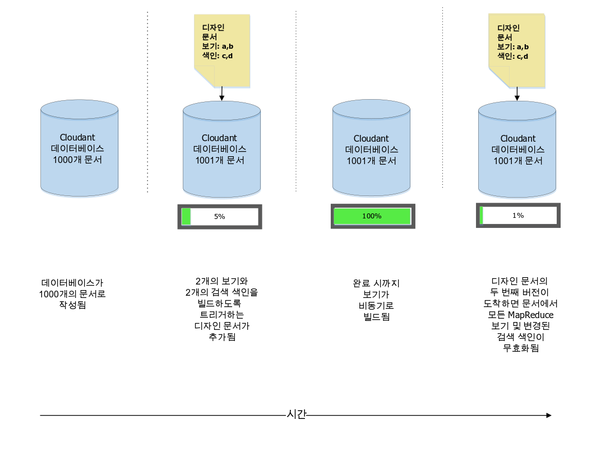
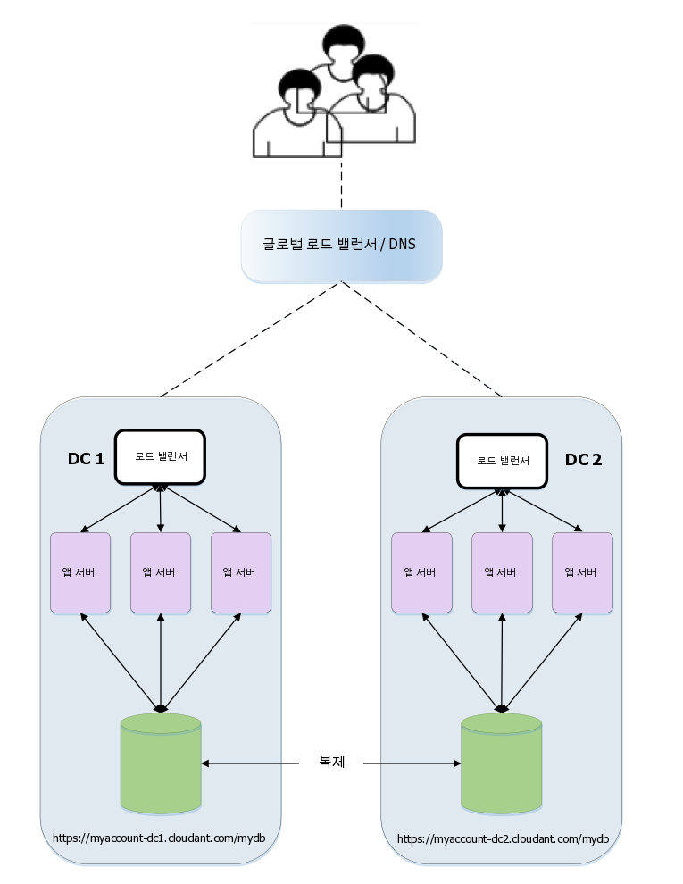

---

copyright:
  years: 2015, 2019
lastupdated: "2019-06-12"

keywords: multiple views, changes, versioned design documents, move and switch, the stale parameter

subcollection: cloudant

---

{:new_window: target="_blank"}
{:shortdesc: .shortdesc}
{:screen: .screen}
{:codeblock: .codeblock}
{:pre: .pre}
{:tip: .tip}
{:note: .note}
{:important: .important}
{:deprecated: .deprecated}

<!-- Acrolinx: 2017-05-10 -->

# 디자인 문서 관리
{: #design-document-management}

*IBM Cloudant의 Developer Advocate인 Glynn Bird([glynn@cloudant.com ](mailto:glynn@cloudant.com){: new_window})가 기고한 글*

{{site.data.keyword.cloudantfull}}의 스케일링 가능한 JSON 데이터 저장소에는 여러 조회 메커니즘이 있으며, 이 조회 메커니즘 모두 코어 데이터와 별도로 작성 및 유지보수되는 인덱스를 생성합니다.
인덱싱은 문서 저장 시 즉시 수행되지 않습니다.
대신, 빠르고 막힘없는 쓰기 처리량을 달성하기 위해 나중에 수행되도록 스케줄됩니다.

-   MapReduce 보기는 데이터 세트에 대한 인덱스이며, 키 또는 키 범위를 사용한 효율적인 검색을 위해 키 값 쌍이 B-트리에 저장됨
-   검색 인덱스는 자유 텍스트 검색, 다면화 및 복잡한 임시 조회를 수행할 수 있도록 하기 위해 Apache Lucene을 사용하여 생성됨

{{site.data.keyword.cloudant_short_notm}}의 [검색 인덱스](/docs/services/Cloudant?topic=cloudant-search#search) 및 [MapReduce 뷰](/docs/services/Cloudant?topic=cloudant-views-mapreduce#views-mapreduce)는
데이터베이스에 디자인 문서를 추가하여 구성됩니다.
디자인 문서는 뷰 또는 인덱스를 빌드하는 방식에 대한 지시사항을 포함하는 JSON 문서입니다.
간단한 예를 들어 보겠습니다.
다음 예와 같은 간단한 데이터 문서 콜렉션이 있다고 가정해 보십시오.

_간단한 데이터 문서의 예:_

```json
{
    "_id": "23966717-5A6F-E581-AF79-BB55D6BBB613",
    "_rev": "1-96daf2e7c7c0c277d0a63c49b57919bc",
    "doc_name": "Markdown Reference",
    "body": "Lorem Ipsum",
    "ts": 1422358827
}
```
{: codeblock}

각 데이터 문서에는 이름, 본문 및 시간소인이 포함되어 있습니다.
여기서는 시간소인으로 문서를 정렬하기 위해 [MapReduce 보기](/docs/services/Cloudant?topic=cloudant-views-mapreduce#views-mapreduce)를 작성할 것입니다.

이는 다음 예와 같은 map 함수를 작성하여 수행할 수 있습니다.

_문서의 시간소인 필드가 있는 경우 이를 리턴하는 map 함수 예:_

```javascript
function(doc) {
    if (doc.ts) {
        emit( doc.ts, null);
    }
}
```
{: codeblock}

이 함수는 인덱스에 대한 키로 사용할 수 있는 문서의 시간소인을 생성합니다. 여기서는 인덱스의 값이 무엇이든 상관없으므로 `null`이 리턴됩니다.
이 함수의 효과는 문서 세트에 대한 시간 순서 인덱스를 제공하는 것입니다.

이제 다음 예와 같이 이 뷰의 이름을 "`by_ts`"라고
지정하고 이를 "`fetch`"라는 디자인 문서에
삽입합니다. 

_map 함수를 사용하여 보기를 정의하는 디자인 문서 예:_

```json
{
    "_id": "_design/fetch",
    "views": {
      "by_ts": {
        "map": "function(doc) {
          if (doc.ts) {
            emit( doc.ts, null);
          }
        }"
      }
    },
    "language": "javascript"
}
```
{: codeblock}

결과적으로 맵핑 코드가 JSON 호환 문자열로 변환되어
디자인 문서에 포함되었습니다. 

디자인 문서가 저장되면
{{site.data.keyword.cloudant_short_notm}}가 `fetch/by_ts` 뷰를 빌드하는 서버 측 프로세스를 트리거합니다.
이는 데이터베이스에 있는 모든 문서에 대해 반복한 후 각 항목을 Javascript map 함수에 전송하여 수행됩니다.
이 함수는 생성된 키/값 쌍을 리턴합니다.
반복이 계속되면서 각 키/값 쌍은 B-트리 인덱스에 저장됩니다.
인덱스가 처음으로 빌드되고 나면 후속 재인덱싱은 신규 또는 업데이트된 문서에 대해서만 수행됩니다.
삭제된 문서는 인덱싱이 해제됩니다.
*증분 MapReduce*라고 하는 이 프로세스를 사용하면
다음 다이어그램에 표시된 바와 같이 시간이 절약됩니다.



다음 항목을 기억해 두는 편이 좋습니다.

-   인덱스 구축은 비동기로 수행됩니다.
    {{site.data.keyword.cloudant_short_notm}}에서는 디자인 문서가 저장된 것을 확인하지만,
    인덱스 구축 진행상태를 확인하기 위해서는 {{site.data.keyword.cloudant_short_notm}}의
    [`_active_tasks`](/docs/services/Cloudant?topic=cloudant-active-tasks#active-tasks) 엔드포인트를 폴링해야 합니다. 
-   데이터가 많아질수록 인덱스가 준비되는 데 오랜 시간이 소요됩니다.
-   첫 인덱스 빌드가 진행 중인 동안에는 _해당 인덱스에 대한 모든 조회가 차단됩니다_.
-   보기를 조회하면 아직 증분 인덱싱되지 않은 모든 문서의 '맵핑'이 트리거됩니다.
    이를 통해 데이터에 대한 최신 보기를 가져올 수 있습니다.
    이 규칙에 대한 예외는 다음
    ['`stale`' 매개변수](#the-stale-parameter) 설명을
    참조하십시오.

## 동일한 디자인 문서 내의 여러 보기
{: #multiple-views-in-the-same-design-document}

동일한 디자인 문서에 여러 보기를 정의하면 이들은 동시에 효율적으로 빌드됩니다.
각 문서는 한 번만 읽힌 후 각 보기의 map 함수를 거칩니다.
이 접근법의 단점은 디자인 문서를 수정하면 일부 보기는
변경되지 않은 경우에도 해당 문서에 정의된
_모든 기존 MapReduce 보기가 무효화된다_는 점입니다. 

MapReduce 보기를 개별적으로 변경해야 하는 경우에는 이들의 정의를 각각 별도의 디자인 문서에 배치하십시오. 

이 동작은 Lucene 검색 인덱스에는 적용되지 않습니다.     이들은 동일한 디자인 문서에 있는 다른 변경되지 않은 인덱스를 무효화시키지 않으면서 변경될 수 있습니다.
{: note}



## 디자인 문서에 대한 변경사항 관리
{: #managing-changes-to-a-design-document}

미래의 한 시점에 보기의 디자인을 변경하기로 결정했다고 가정해 보십시오.
이제는
실제 시간소인 결과를 리턴하는 대신 기준과 일치하는 문서의 개수에만 관심이 있습니다.
이를 달성하기 위해, map 함수는 그대로 두고 "`_count`"라는 _reduce_ 함수를 사용합니다.
이는 디자인 문서를 다음 예와 같이 변경합니다.

_reduce 함수를 사용하는 디자인 문서 예_

```json
{
    "_id": "_design/fetch",
    "_rev": "2-a2324c9e74a76d2a16179c56f5315dba",
    "views": {
        "by_ts": {
            "map": "function(doc) {
                if (doc.ts) {
                  emit( doc.ts, null);
                }
            }
        }",
        "reduce": "_count"
    },
    "language": "javascript"
}
```
{: codeblock}

이 디자인 문서가 저장되면, {{site.data.keyword.cloudant_short_notm}}는 이전 인덱스를 완전히 무효화하고,
모든 문서에 대해 차례대로 반복되며 새 인덱스를 처음부터 빌드하기 시작합니다.
원래 빌드와 마찬가지로, 소요되는 시간은 데이터베이스에 있는 문서의 수에 따라 달라지며
완료될 때까지 해당 보기에 대한 조회를 차단합니다.

그러나 여기에는 문제점이 있습니다.

이 보기에 _실시간으로_ 액세스 중인 애플리케이션이 있는 경우에는 배치 딜레마가 발생할 수 있습니다.

-   이전 뷰가 무효화되었으므로
    원래 디자인 문서에 의존하던 코드 버전 1이
    더 이상 작동하지 않을 수 있습니다. 
-   새 디자인 보기를 사용하는
    코드 버전 2는 새 뷰의 빌드가
    아직 완료되지 않아(데이터베이스에
    문서가 많은 경우에는 더욱 느림) 즉시
    릴리스할 수 없습니다. 
-   코드에 영향을 주는 더 잠재적인 문제는 코드 버전 1과 2가 보기로부터 서로 다른 결과 데이터를 기대한다는 점입니다.
    버전 1은 일치하는 문서의 목록을 기대하는 반면 버전 2는 '감소된' 결과 개수를 기대합니다.

## 디자인 문서에 대한 변경사항 조율
{: #coordinating-changes-to-design-documents}

이 변경 제어 문제점을 해결하는 데는 두 가지 방법이 있습니다.

### 버전화된 디자인 문서
{: #versioned-design-documents}

한 가지 해결책은 버전화된 디자인 문서 이름을 사용하는 것입니다.

-   코드가 처음에 `_design/fetchv1`이라는 보기를 사용하도록 작성되었다고 가정해 보십시오.
-   그 후 새 버전을 릴리스할 때는 `_design/fetchv2`라는 새 보기를 작성하고 이 보기를 조회하여 빌드가 시작되도록 합니다.
-   새 인덱스 빌드 작업이 완료될 때까지 `_active_tasks`를 폴링합니다.
-   이제 두 번째 보기에 의존하는 코드를 릴리스할 준비가 되었습니다.
-   `_design/fetchv1`이 더 이상 필요없다고 확인되면 이를 삭제합니다.

버전화된 디자인 문서 사용은 디자인 문서의 변경 제어를 관리하는 간단한 방법이지만,
나중에 이전 버전을 제거하는 것은 잊지 말아야 합니다. 

### 디자인 문서 '이동 및 전환'
{: #-move-and-switch-design-documents}

다른 접근법은 {{site.data.keyword.cloudant_short_notm}}가 두 개의 동일한 디자인 문서가 있는 경우
이를 인식하고 이미 있는 보기를 다시 빌드하는 데 시간과 리소스를 낭비하지 않는다는 점을 이용합니다.
즉, 디자인 문서 `_design/fetch`의
정확한 복제인 `_design/fetch_OLD`를 작성하면 두 엔드포인트는 재인덱싱을 트리거하지 않으면서 교환 가능하게 작동합니다.

새 보기로 전환하는 프로시저는 다음과 같습니다.

1.  이름에 `_OLD` 등을 추가하여(`_design/fetch_OLD`) 변경할 디자인 문서의 복제본을 작성합니다.
2.  이름에 접미부 `_NEW`를 사용하여(`_design/fetch_NEW`)  신규 또는 '수신' 디자인 문서를 데이터베이스에 저장합니다.
3.  `fetch_NEW` 보기를 조회하여 이 보기의 빌드가 시작되도록 합니다.
4.  `_active_tasks` 엔드포인트를 폴링하고 인덱스 빌드가 완료될 때까지 기다립니다.
5.  새 디자인 문서의 복제본을 `_design/fetch`에 저장합니다.
6.  디자인 문서 `_design/fetch_NEW`를 삭제합니다. 
7.  디자인 문서 `_design/fetch_OLD`를 삭제합니다. 

## 도구 '이동 및 전환'
{: #move-and-switch-tooling}

'이동 및 전환' 프로시저를 자동화하는, '`couchmigrate`'라는 명령행 Node.js 스크립트가 있습니다.
이는 다음과 같이 설치할 수 있습니다.

_Node.js `couchmigrate` 스크립트 설치 명령:_

```sh
npm install -g couchmigrate
```
{: codeblock}

`couchmigrate` 스크립트를 사용하려면 먼저 `COUCH_URL`이라는 환경 변수를 설정하여 CouchDB/{{site.data.keyword.cloudant_short_notm}} 인스턴스의 URL을 정의하십시오.

_{{site.data.keyword.cloudant_short_notm}} 인스턴스의 URL 정의:_

```sh
export COUCH_URL=http://127.0.0.1:5984
```
{: codeblock}

이 URL은 HTTP 또는 HTTPS일 수 있으며 인증 인증 정보를 포함할 수 있습니다.

_인증 인증 정보를 포함하는 {{site.data.keyword.cloudant_short_notm}} 인스턴스의 URL 정의:_

```sh
export COUCH_URL=https://$ACCOUNT:$PASSWORD@$HOST.cloudant.com
```
{: codeblock}

파일에 저장된 JSON 형식의 디자인 문서가 있다고 가정해 보십시오. 이 경우에는 마이그레이션 명령을 실행할 수 있습니다.

이 예에서
`db`는 변경할 데이터베이스의 이름을 지정하고
`dd`는 디자인 문서 파일의 경로를 지정합니다. 

_`couchmigrate` 명령 실행:_

```sh
couchmigrate --db mydb --dd /path/to/my/dd.json
```
{: pre}

이 스크립트는 '이동 및 전환' 프로시저를 조율하며
리턴하기 전에 뷰가 빌드되기를 기다립니다.
수신 디자인 문서가 현재 디자인 문서와 동일한 경우에는 스크립트가 거의 즉시 리턴됩니다.

이 스크립트의 소스 코드는 여기([https://github.com/glynnbird/couchmigrate ](https://github.com/glynnbird/couchmigrate){: new_window})에 있습니다.

## '`stale`' 매개변수
{: #the-stale-parameter}

인덱스가 완료된 상태에서 새 레코드가 데이터베이스에 추가되면 인덱스가 백그라운드에서 업데이트되도록 스케줄됩니다.
다음 다이어그램에 표시된 데이터베이스 상태가 이 상태입니다.



보기를 조회할 때는 세 가지 선택사항이 있습니다.

-   기본 동작은 응답을 리턴하기 전에 인덱스가 데이터베이스에 있는 최신 문서에 대해 최신 상태가 되도록 하는 것입니다.
    사용자가 보기를 조회하면, {{site.data.keyword.cloudant_short_notm}}에서는 먼저 250개의 새 문서를 인덱싱한 후 응답을 리턴합니다.
-   대체 방법은 "`stale=ok`" 매개변수를 API 호출에 추가하는 것입니다.
    이 매개변수는 "최신 업데이트 여부는 상관없으니 이미 인덱싱된 데이터를 리턴하라"는 의미입니다.
    즉, "`stale=ok`"를 사용하여 보기를 조회하면 {{site.data.keyword.cloudant_short_notm}}에서는 추가 재인덱싱 없이
    응답을 즉시 리턴합니다.
-   두 번째 대체 방법은 "`stale=update_after`" 매개변수를 API 호출에 추가하는 것입니다.
    이 매개변수는 "이미 인덱싱된 데이터를 리턴한 _후_, 새 문서를 재인덱싱하라"는 의미입니다.
    즉, "`stale=update_after`"를 사용하여 보기를 조회하면 {{site.data.keyword.cloudant_short_notm}}에서는 응답을 즉시 리턴한 후
    새 데이터 인덱싱을 위한 백그라운드 태스크를 스케줄합니다.

"`stale=ok`" 또는 "`stale=update_after`"를 추가하는 것은 보기로부터 응답을 더 빨리 받는 좋은 방법이지만 데이터가 최신 상태가 아닐 수 있습니다. 

기본 동작은 {{site.data.keyword.cloudant_short_notm}} 클러스터에 속한 노드 전체에 로드를 균등하게 분배하는 것입니다. 대체 방법인 `stale=ok` 또는 `stale=update_after` 옵션을 사용하면 결과적으로 일관된 세트로부터 일관된 결과를 리턴하기 위해 클러스터 노드의 특정 서브세트에 로드가 집중될 수 있습니다. 이는 '`stale`' 매개변수가 모든 사용 사례에서 완벽한 해결책은 아님을 의미합니다. 그러나 애플리케이션에서 시간이 경과된(stale) 결과를 수신해도 괜찮은 경우 이는 빠르게 변경되는 데이터 세트에 대해 적시에 응답을 제공받는 데 유용합니다. 데이터의 변경 비율이 작은 경우에는 "`stale=ok`" 또는 "`stale=update_after`"를 추가해도 성능 이점이 없을 수 있으며, 대규모 클러스터에서 로드가 균등하지 않게 분배될 수 있습니다.
{: note}

가능하면 `stale=ok` 또는 `stale=update_after`를 사용하지 마십시오.
이는 기본 동작이 가장 최신의 데이터를 제공하며 클러스터 내에 데이터를 분배하기 때문입니다.
클라이언트 앱이 큰 데이터 처리 태스크가 진행 중(예: 정기적인 대량 데이터 업데이트 중)임을
감지하도록 할 수 있는 경우, 이 앱은 이러한 태스크 중에 임시로 `stale=ok`로
전환한 후 나중에 기본 동작으로 돌아올 수 있습니다.

`stale` 옵션은 여전히 사용할 수 있지만 더 유용한 옵션인 `stable`과 `update`가 사용 가능하며 필요한 경우에는 이들을 대신 사용해야 합니다. 자세한 정보는 [시간이 경과된(stale) 보기에 액세스](/docs/services/Cloudant?topic=cloudant-using-views#view-freshness)를 참조하십시오.
{: note}
