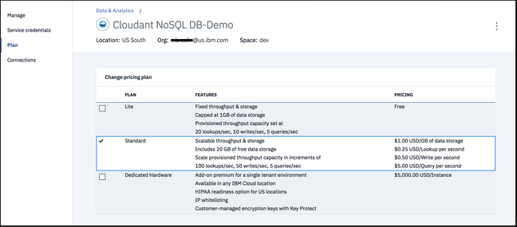

---

copyright:
  years: 2015, 2019
lastupdated: "2019-06-12"

keywords: curl and jq basics, monitor view builds and search indexes, estimate time to complete task, monitor replication, troubleshooting

subcollection: cloudant

---

{:new_window: target="_blank"}
{:shortdesc: .shortdesc}
{:screen: .screen}
{:codeblock: .codeblock}
{:pre: .pre}
{:tip: .tip}
{:note: .note}
{:important: .important}
{:deprecated: .deprecated}

<!-- Acrolinx: 2018-08-14 -->

# {{site.data.keyword.cloud_notm}}의 {{site.data.keyword.cloudant_short_notm}}로 마이그레이션
{: #migrating-to-ibm-cloudant-on-ibm-cloud}

[{{site.data.keyword.cloudantfull}} ](https://www.ibm.com/cloud/cloudant){: new_window}의 DBaaS(Database-as-a-Service) 오퍼링은 멀티 테넌트 클러스터에서 실행되는 JSON 문서 저장소입니다. 이 서비스는 여러 지리적 위치에서 예측 가능한 비용, 확장성 및 서비스 레벨 계약(SLA)을 선택하여 사용할 수 있습니다.

이 문서에서는 다음 플랜 중 하나에서 {{site.data.keyword.cloud_notm}}의 {{site.data.keyword.cloudant_short_notm}} Lite 또는 표준 플랜 인스턴스로 마이그레이션하는 방법을 설명합니다.

플랜 |설명
-----|------------
{{site.data.keyword.cloudant_short_notm}} 엔터프라이즈 | 데디케이티드 싱글 테넌트 클러스터
{{site.data.keyword.cloudant_short_notm}} 공유 플랜 | 레거시 종량과금제 멀티 테넌트 {{site.data.keyword.cloudant_short_notm}} 서비스입니다. `cloudant.com` 공유 플랜은 2018년 3월에 폐지되었습니다. {{site.data.keyword.cloudant_short_notm}} 공유 플랜은 2016년 10월부터 새 등록에 대해 더 이상 사용되지 않게 되었으며 2018년 4분기에 폐지될 예정입니다.
{{site.data.keyword.cloudant_localfull}} | 자체 호스팅되는, 패키지된 {{site.data.keyword.cloudant_short_notm}} 설치입니다.
Apache CouchDB | {{site.data.keyword.cloudant_short_notm}}의 기반이 되는, 자체 호스팅 오픈 소스 데이터베이스입니다.

## {{site.data.keyword.cloudant_short_notm}} Lite 및 표준 플랜의 이점은 무엇입니까?
{: #what-are-the-benefits-of-the-ibm-cloudant-lite-and-standard-plans-}

표준 플랜은 사용자가 데이터베이스 서비스를 위한 *처리량 용량을 예약*할 수 있게, 즉 수요를 처리하기 위해 애플리케이션의 데이터베이스가 필요로 하는 처리량을 지정할 수 있게 해 줍니다. 표준 플랜은 사용자가 사용하는 스토리지의 양에 대해서도 비용을 청구합니다. 용량은 다음 메트릭을 사용하여 측정됩니다.

메트릭 |설명
-------|------------
초당 읽기 수 | 단순 문서 페치가 수행된 비율로, 예를 들면 `_id`로 검색한 경우 또는 파티션 키를 사용하여 파티션된 데이터베이스에 대해 조회하는 경우가 있습니다.
초당 쓰기 | 데이터가 데이터베이스에 기록된 비율입니다. 문서 작성, 업데이트 또는 삭제를 처리하는 API 호출은 '쓰기'로 간주됩니다.
초당 글로벌 조회 수 | 글로벌 인덱스를 사용하여 데이터베이스가 조회된 비율로, 일반적으로 `_find` 엔드포인트에 액세스하거나 2차 MapReduce, 검색 또는 지리공간 인덱스를 사용하여 조회할 수 있습니다.
스토리지 | JSON 데이터, 첨부 파일 및 2차 인덱스에서 사용하는 디스크 공간의 양입니다 .

예를 들면, Lite 플랜은 20회의 초당 읽기, 10회의 초당 쓰기, 5회의 초당 글로벌 조회 및 1GB의 스토리지를 무료로 제공합니다. 이 플랜은 제품의 실행 가능성을 빠르게 확인하는 경우나 제품 개발 기간에 적합합니다. 애플리케이션이 QA나 프로덕션으로 바뀌면 표준 플랜으로 전환하여 인스턴스를 스케일링하십시오. 표준 플랜의 가장 작은 용량에는 100회의 초당 읽기, 50회의 초당 쓰기, 5회의 초당 글로벌 조회, 20GB의 스토리지(추가 스토리지는 GB당 비용 청구됨)가 포함되며 비용은 매월 약 $76.65(USD)입니다. 

{{site.data.keyword.cloudant_short_notm}} 대시보드의 슬라이더를 사용하면 필요할 때마다 {{site.data.keyword.cloudant_short_notm}} 서비스를 위한 용량을 적게, 또는 많이 예약할 수 있습니다. 

변경할 수 있는 처리량 용량의 양은 1회 변경당 최대 10개 단위(슬라이더의 '변경 한계' 지점 참조), 1시간당 최대 1회 변경으로 제한됩니다. 감소시키는 변경에는 양에 제한이 없지만, 시간 제한은 여전히 적용됩니다.
{: tip}

사용자에게는 특정 시간대에서 선택된 가장 높은 용량에 따라 비용이 청구됩니다. 데이터베이스 처리량은 특정 시기의 수요를 처리하기 위해 확장시키고, 한가한 시기에는 다시 축소시킬 수 있습니다. 사용자의 월별 청구 비용은 항상 예측 가능하고, 업그레이드는 자동이며, SLA는 [99.95% ](http://www-03.ibm.com/software/sla/sladb.nsf/sla/bm?OpenDocument){: new_window}입니다. 

지정된 시간(초)의 읽기, 쓰기 및 글로벌 조회 할당량을 초과하면 {{site.data.keyword.cloudant_short_notm}} API가 `HTTP 429 너무 많은 요청` 응답으로 응답합니다. 사용자의 애플리케이션은 나중에 해당 요청을 재시도할 수 있으며, 공식 라이브러리는 이러한 요청을 기하급수적 백오프와 함께 재시도하는 선택사항을 제공합니다. 

## 내 {{site.data.keyword.cloudant_short_notm}} 플랜에는 어떤 유형이 있습니까?
{: #which-type-of-ibm-cloudant-plan-do-i-have-}

{{site.data.keyword.cloudant_short_notm}}를 사용하는 경우, {{site.data.keyword.cloud_notm}} 대시보드로 이동하고 **메뉴** 아이콘 > **리소스 목록**을 클릭하여 모든 서비스 인스턴스를 보십시오. 

자세한 정보는 특정 인스턴스로 드릴 다운하여 플랜 탭을 볼 수도 있습니다. 더 이상 사용되지 않는 공유 플랜을 사용하는 {{site.data.keyword.cloudant_short_notm}} 인스턴스에는 강조표시된 플랜이 없습니다. {{site.data.keyword.cloudant_short_notm}} 표준 플랜의 인스턴스는 다음 예와 유사합니다. 

{{site.data.keyword.cloudant_short_notm}} 대시보드를 열고 **계정** 탭을 클릭할 수도 있습니다. Lite 플랜은 다음 예와 유사합니다.

레거시 `cloudant.com` 계정을 사용하고 있는 경우에는 {{site.data.keyword.cloudant_short_notm}} 대시보드에 로그인하여 계정 탭으로 이동할 수 있습니다. 레거시 `cloudant.com` 공유 플랜에는 다음 예와 같이 현재 월에 대한 그래프 및 예상 비용 청구 금액이 표시되는 사용량 탭이 있습니다.

데디케이티드 클러스터의 `cloudant.com` 엔터프라이즈 사용자에게는 계정 탭에 사용량 탭이 없습니다. 이는 다음 예와 유사합니다.

계정 탭이 이미 사용자가 표준 플랜을 사용 중임을 나타내는 경우에는 나머지 내용을 읽을 필요가 없습니다. 이 경우에는 이미 유료 SLA 기반 {{site.data.keyword.cloudant_short_notm}} 서비스를 사용하고 있는 것입니다. 추가 조치가 필요하지 않습니다.

## {{site.data.keyword.cloudant_short_notm}} Lite에서 {{site.data.keyword.cloudant_short_notm}} 표준으로 마이그레이션
{: #migrating-from-ibm-cloudant-lite-to-ibm-cloudant-standard}

다음 단계에 따라 무료 Lite 플랜에서 표준 플랜으로 마이그레이션하십시오. 

1.  {{site.data.keyword.cloud_notm}} 대시보드로 이동하십시오.
2.  **메뉴** 아이콘 > **리소스 목록**으로 이동하여 모든 서비스 인스턴스를 보십시오. 
3.  마이그레이션할 {{site.data.keyword.cloudant_short_notm}} 인스턴스를 선택하십시오. 
4.  메뉴에서 **플랜** 탭을 선택하십시오.  
5.  가격 플랜 목록에서 **표준** 선택란을 선택하십시오.

6.  **업그레이드**를 클릭하십시오.
모든 기존 데이터가 보존됩니다.

필요에 따라 용량을 늘리거나 줄이려면 처리량 용량 슬라이더를 사용하여 용량을 조정하십시오.
{: tip} 
 
이제 모든 준비가 끝났습니다.

## 다른 모든 항목을 {{site.data.keyword.cloudant_short_notm}} Lite 또는 표준 플랜으로 마이그레이션
{: #migrating-everything-else-to-ibm-cloudant-lite-or-standard-plan}

공유 또는 엔터프라이즈 플랜에서 {{site.data.keyword.cloudant_short_notm}} Lite 또는 표준 플랜으로 마이그레이션하는 작업에는 다음 단계에 설명되어 있는 태스크가 포함됩니다. 

공유 플랜 인스턴스를 Lite 또는 표준 플랜 인스턴스로 직접 변경할 수는 없습니다. 마이그레이션을 위해서는 새 Lite 또는 표준 플랜을 작성하고 공유 플랜 인스턴스로부터 데이터를 복제해야 합니다. 
{: tip}

### 1단계: {{site.data.keyword.cloud_notm}} 등록
{: #step-1-sign-up-for-ibm-cloud}

아직 등록하지 않은 경우에는 [{{site.data.keyword.cloud_notm}} 계정을 등록하십시오 ](https://www.ibm.com/cloud/){: new_window}.  

### 2단계: {{site.data.keyword.cloudant_short_notm}} 인스턴스 작성
{: #step-2-create-an-ibm-cloudant-instance}

{{site.data.keyword.cloud_notm}} 계정에 로그인한 후 {{site.data.keyword.cloudant_short_notm}} 서비스를 추가하십시오. 대시보드에 있는 `Create resource` 단추를 클릭한 후 `Databases` 및 `Cloudant`를 클릭하십시오. 자세한 정보는 [{{site.data.keyword.cloud_notm}}에서 {{site.data.keyword.cloudant_short_notm}} 인스턴스를 작성하는 방법](/docs/services/Cloudant?topic=cloudant-creating-an-ibm-cloudant-instance-on-ibm-cloud#creating-an-ibm-cloudant-instance-on-ibm-cloud)을 참조하십시오. 

### 3단계: 애플리케이션이 {{site.data.keyword.cloudant_short_notm}}에 대해 준비되었는지 확인
{: #step-3-find-out-whether-your-application-is-ready-for-ibm-cloudant}

{{site.data.keyword.cloudant_short_notm}} 엔터프라이즈 서비스 또는 {{site.data.keyword.cloudant_short_notm}} 공유 플랜으로부터 이동하는 경우에는 애플리케이션의 {{site.data.keyword.cloudant_short_notm}} 사용량을 다시 확인하여 표준 플랜의 용량 한계를 처리할 준비가 되었는지 확인해야 합니다. 자세한 정보는 [{{site.data.keyword.cloudant_short_notm}} API 작동 방식](/docs/services/Cloudant?topic=cloudant-ibm-cloud-public#provisioned-throughput-capacity)을 참조하십시오. 가장 중요한 것은 프로비저닝된 처리량 용량을 초과하는 경우 애플리케이션이 `429: too many requests` HTTP 응답을 처리할 수 있는지 확인하는 것입니다. 

플랜의 용량을 초과하도록 하는 우발적인 과다 트래픽 발생의 경우에는 `429` 응답이 리턴되는 요청을 재시도하는 것이 문제가 되지 않습니다. 애플리케이션 트래픽이 일상적으로 `429` 응답을 발생시키는 경우에는 더 큰 플랜으로 업그레이드해야 할 가능성이 높습니다.

또한 {{site.data.keyword.cloudant_short_notm}}에서는 개별 문서의 최대 크기가 1MB이며, 이 한계를 초과하면 `413: request entity too large` 메시지를 수신하게 된다는 점 또한 기억해야 합니다. 자세한 정보는 [요청 및 문서 크기 한계](/docs/services/Cloudant?topic=cloudant-ibm-cloud-public#request-and-document-size-limits)를 참조하십시오. 

### 4단계: 이전 서비스에서 새 서비스로 마이그레이션 
{: #step-4-migrate-data-from-the-old-service-to-the-new-service}

기존 서비스에서 {{site.data.keyword.cloudant_short_notm}} 계정으로의 연속 복제를 설정하십시오. 자세한 정보는 [복제 안내서](/docs/services/Cloudant?topic=cloudant-replication-api#replication-api) 및 [API 문서](/docs/services/Cloudant?topic=cloudant-ibm-cloudant-basics#ibm-cloudant-basics)에서 복제 태스크를 설정하고 모니터하는 방법에 대해 참조하십시오.

또는 한 {{site.data.keyword.cloudant_short_notm}} 계정에서 다른 계정으로의 전송 작업을 조정하는 데 도움을 주는 명령행 유틸리티인 [`couchreplicate`](https://www.npmjs.com/package/couchreplicate) 도구를 살펴 보십시오. 이 도구는 여러 소스 계정과 대상 계정 간에 여러 복제 애플리케이션 작업을 설정하여 많은 복제 작업이 한 번에 진행되도록 합니다. 수백 개의 데이터베이스를 마이그레이션해야 하는 경우에는 `couchreplicate`가 복제 작업을 조정하는 데 도움을 줄 수 있습니다.

모든 데이터가 새 서비스로 복제되며 인덱스가 빌드되는지 확인하십시오.

### 5단계: 테스트
{: #step-5-testing}

애플리케이션에서 로드 및 기능 테스트를 수행하여 프로덕션으로 마이그레이션하기 전에 문제가 없는지 확인하십시오.

### 6단계: 새 인스턴스로의 이동 준비 확인
{: #step-6-ready-to-move-to-the-new-instance-}

새 인스턴스로 이동할 준비가 된 경우에는 {{site.data.keyword.cloudant_short_notm}} 인스턴스에 새 계정 URL 및 인증 정보를 사용하도록 애플리케이션을 업데이트하십시오. 자세한 정보는 [프로비저닝 튜토리얼](/docs/services/Cloudant?topic=cloudant-creating-an-ibm-cloudant-instance-on-ibm-cloud#creating-an-ibm-cloudant-instance-on-ibm-cloud)에서 {{site.data.keyword.cloudant_short_notm}} 인스턴스에 대한 서비스 인증 정보를 얻는 방법을 참조하십시오.

### 7단계: 이전 서비스 끄기
{: #step-7-turn-off-the-old-service}

 애플리케이션이 {{site.data.keyword.cloudant_short_notm}} Lite 또는 표준 인스턴스로 완전히 마이그레이션된 후에는 {{site.data.keyword.cloud_notm}} 콘솔에서 이전 {{site.data.keyword.cloudant_short_notm}} 공유 플랜 인스턴스를 삭제하여 해당 서비스에 대해 더 이상 비용이 청구되지 않도록 할 수 있습니다.

## FAQ - 자주 묻는 질문
{: #faq-frequently-asked-questions}

자주 묻는 질문(FAQ)은 {{site.data.keyword.IBM_notm}} 고객이 {{site.data.keyword.cloud_notm}}의 {{site.data.keyword.cloudant_short_notm}} Lite 또는 표준 플랜 인스턴스로 마이그레이션하는 데 도움을 줄 수 있도록 {{site.data.keyword.cloudant_short_notm}} 조직에서 발표합니다.

## 다른 작업을 수행하기 전에 내 데이터를 백업할 수 있습니까?
{: #can-i-back-up-my-data-before-doing-anything-}

{{site.data.keyword.cloudant_short_notm}}에서는 [couchbackup](/docs/services/Cloudant?topic=cloudant-ibm-cloudant-backup-and-recovery#ibm-cloudant-backup-and-recovery) 유틸리티를 사용하여 데이터를 디스크로 내보내는 것을 권장합니다. [{{site.data.keyword.cloud_notm}} Object Storage ](https://www.ibm.com/cloud/object-storage){: new_window}는 내보낸 파일을 저장하는 데 사용할 수 있는, 저렴하며 스케일링 가능한 솔루션입니다.  

## `username.cloudant.com` 도메인을 유지하면서 이를 {{site.data.keyword.cloudant_short_notm}}의 새 서비스로 경로 재지정할 수 있습니까?
{: #can-i-keep-my-username-cloudant-com-domain-and-redirect-it-to-the-new-service-on-ibm-cloudant-}

아니오, 도메인을 유지하는 것은 불가능합니다. 사용자는 {{site.data.keyword.cloudant_short_notm}} 인스턴스에 대해 생성된 새 계정 URL 및 인증 정보를 사용하도록 애플리케이션을 업데이트할 계획을 세워야 합니다.

## 질문이 있는 경우에는 누구에게 문의해야 합니까?
{: #who-do-i-contact-if-i-have-questions-}

마이그레이션에 대한 질문이 있는 경우에는 [{{site.data.keyword.cloudant_short_notm}} 지원](mailto:support@cloudant.com)에 문의하거나 {{site.data.keyword.cloudant_short_notm}} 대시보드 내에서 티켓을 여십시오. {{site.data.keyword.cloudant_short_notm}} 지원에서는 기꺼이 자세한 정보를 제공할 것입니다.
