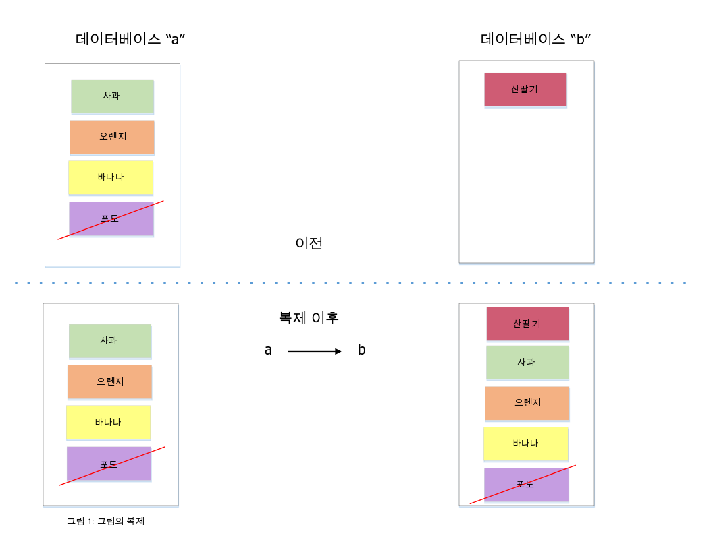
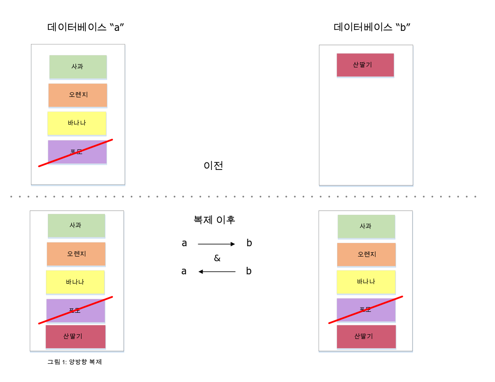

---

copyright:
  years: 2015, 2019
lastupdated: "2019-03-15"

keywords: start replicating with dashboard, run replication across different accounts, run replication on source or destination, start replication with api, checkpoints, permissions, two-way replication, continuous replication, monitoring replication, canceling replication, filtered replication, changes feed, pitfalls, tuning replication speed

subcollection: cloudant

---

{:new_window: target="_blank"}
{:shortdesc: .shortdesc}
{:screen: .screen}
{:codeblock: .codeblock}
{:pre: .pre}
{:tip: .tip}
{:note: .note}
{:important: .important}
{:deprecated: .deprecated}

<!-- Acrolinx: 2017-05-10 -->

# 복제 안내서
{: #replication-guide}

동일한 {{site.data.keyword.cloudantfull}} 계정에 있거나, 서로 다른 계정에 있거나, 서로 다른 데이터 센터에 있는 한 데이터베이스에서 다른 데이터베이스로 데이터를 복사할 수 있습니다.
{: shortdesc}

데이터는 [{{site.data.keyword.cloudant_short_notm}} Sync ](https://cloudant.com/product/cloudant-features/sync/){: new_window}
또는 [PouchDB ](http://pouchdb.com/){: new_window}를 사용하여 {{site.data.keyword.cloudant_short_notm}} 계정 또는 모바일 디바이스를
대상으로 복제할 수도 있습니다.
복제는 '일회성' 또는 지속적 오퍼레이션으로 단방향 또는 양방향으로 실행될 수 있으며, 매개변수를 사용하여 세밀하게 조정할 수 있습니다.

{{site.data.keyword.cloudant_short_notm}}의 복제 프로토콜은 다양한 데이터베이스 및 라이브러리와 호환되므로 IoT(Internet of Things) 및 모바일 애플리케이션에 적합합니다.

이 안내서는 {{site.data.keyword.cloudant_short_notm}}의
복제 기능을 소개하고, 일반적인 유스 케이스에 대해 알아보며,
애플리케이션에서 복제를 수행하는 방법을 보여줍니다.

## 복제의 개념
{: #what-is-replication}

{{site.data.keyword.cloudant_short_notm}}는 HTTP API를 사용하는 분산 JSON 데이터 저장소입니다.
{{site.data.keyword.cloudant_short_notm}}는 여러 클라우드 또는 사용자의 서버 랙에서 서비스로 실행될 수 있습니다.
문서는 데이터베이스에 저장되며 {{site.data.keyword.cloudant_short_notm}}가 해당 데이터를 여러 노드에 분산시키는 경우 문서의 크기를 늘릴 수 있습니다.
복제는 소스 데이터베이스에서 대상 데이터베이스로 데이터를 복제하는 것입니다.
소스 및 대상 데이터베이스가 동일한 {{site.data.keyword.cloudant_short_notm}} 계정 또는 동일한 데이터 센터에
속해야 할 필요는 없습니다.



소스에 있는 각 문서의 최신 버전이 대상 데이터베이스에 전송되면 복제가 완료됩니다.
전송에는 새 문서, 기존 문서에 대한 업데이트, 삭제가 포함됩니다.
복제 후에는 특정 문서의 최신 버전만 남게 되며, 이전 버전은 생략됩니다.

소스 데이터베이스는 마지막으로 알려진 위치에서 부분 복제가 재개될 수 있도록 체크포인트 데이터가 기록되는 것을 제외하면 복제에 의해 변경되지 않습니다.
대상 데이터베이스의 기존 데이터는 유지됩니다.

## 대시보드를 사용하여 복제를 시작하는 방법
{: #how-to-start-replication-by-using-the-dashboard}

{{site.data.keyword.cloudant_short_notm}} 대시보드는 복제를 트리거할 수 있는 편리한 사용자 인터페이스를 제공합니다.
{{site.data.keyword.cloudant_short_notm}} 대시보드의 `Replication` 탭을 클릭하고 `Start Replication`을 클릭하십시오.
다음 양식을 완료하십시오.


보안을 이유로 {{site.data.keyword.cloudant_short_notm}} 팀에서는 복제 작업을 위해 계정 레벨 인증 정보가 아닌 IAM API 키 또는 {{site.data.keyword.cloudant_short_notm}} 레거시 인증 [API 키](/docs/services/Cloudant?topic=cloudant-authorization#api-keys){: new_window}를 사용할 것을 권장합니다. 자세한 정보는 [IAM 안내서](/docs/services/Cloudant?topic=cloudant-ibm-cloud-identity-and-access-management-iam-#ibm-cloud-identity-and-access-management-iam-){: new_window} 또는 레거시 [인증 API 문서](/docs/services/Cloudant?topic=cloudant-authentication#authentication){: new_window} 및 레거시 [권한 부여 API 문서](/docs/services/Cloudant?topic=cloudant-authorization#authorization){: new_window}를 참조하십시오.
{: important}

이 양식을 사용하여
소스 및 대상 데이터베이스를 정의한 후
`Start Replication`을 클릭하십시오.


각 복제 태스크의 상태는 `Replication` 탭을 클릭하여 볼 수 있습니다.
각 작업의 상태는 진행됨에 따라 `Running`에서 `Completed`로 변경됩니다.


## 서로 다른 {{site.data.keyword.cloudant_short_notm}} 계정 간에 복제를 실행하는 방법
{: #how-to-run-replication-across-different-ibm-cloudant-accounts}

복제의 소스 및 대상은 다음 예에 표시되어 있는 바와 같이 {{site.data.keyword.cloudant_short_notm}} 데이터베이스의 URL입니다.

_복제의 소스 및 대상 URL 정의 예:_

```json
{
    "source": "https://myfirstaccount.cloudant.com/a",
    "target": "https://mysecondaccount.cloudant.com/b"
}
```
{: codeblock}

소스 및 대상이 동일한 계정에 속해야 할 필요는 없습니다.
소스 및 대상 데이터베이스 이름이 일치해야 할 필요도 없습니다.
사용자는 소스 및 대상에 모두 액세스할 수 있도록 권한 부여되어야 하며, 대상에 쓸 수 있는 권한이 부여되어야 합니다.

## 복제의 실행 위치(소스 또는 대상)
{: #is-replication-run-on-the-source-or-the-destination}

복제는 소스 또는 대상에서 시작될 수 있습니다.
이 선택사항은 계정 A가 계정 B로 데이터를 전송하는지, 또는 계정 B가 계정 A로부터 데이터를 가져오는지를 사용자가 결정할 수 있음을 의미합니다.
한 계정이 방화벽으로 차단되어 있는 경우와 같이 두 구성 모두 복제를 실행할 수 없는 경우도 있습니다.
복제는 HTTP 또는 HTTPS를 통해 이뤄지므로 비표준 포트가 열려 있어야 합니다.
복제를 시작하는 디바이스는 사용자가 결정합니다.

## {{site.data.keyword.cloudant_short_notm}} API를 사용하여 복제를 시작하는 방법
{: #how-to-start-replication-by-using-the-ibm-cloudant-api}

모든 {{site.data.keyword.cloudant_short_notm}} 계정에는 복제 작업을 삽입할 수 있는 `_replicator`라는 특수 데이터베이스가 있습니다.
복제를 시작하려면 `_replicator` 데이터베이스에 문서를 추가하십시오.
이 문서는 원하는 복제를 나타내며 다음 필드를 포함합니다.

필드           |용도
----------------|--------
`_id`           |`_id` 필드 제공은 선택사항이지만 복제 태스크를 식별하는 데 유용합니다. 값을 제공하지 않으면 {{site.data.keyword.cloudant_short_notm}}에서 이를 생성합니다.
`source`        |로그인 인증 정보를 포함한 소스 {{site.data.keyword.cloudant_short_notm}} 데이터베이스의 URL입니다.
`target`        |로그인 인증 정보를 포함한 대상 {{site.data.keyword.cloudant_short_notm}} 데이터베이스의 URL입니다.
`create_target` |(선택사항) 대상 데이터베이스가 아직 없는 경우 이 데이터베이스의 작성 여부를 결정합니다.

_HTTP를 사용한 복제 작업 시작 예:_

```http
POST /_replicator HTTP/1.1
Content-Type: application/json
Host: $ACCOUNT.cloudant.com
Authorization: ...
```
{: codeblock}

_명령행을 사용한 복제 작업 시작 예:_

```sh
curl -X POST \
    -H 'Content-type: application/json' \
    'https://$ACCOUNT.cloudant.com/_replicator' \
    -d '@replication.json'
```
{: codeblock}

_원하는 복제를 나타내는 JSON 문서 예:_

```json
{
    "_id": "weekly_backup",
    "source": "https://$ACCOUNT:$PASSWORD@$ACCOUNT1.cloudant.com/source",
    "target": "https://$ACCOUNT:$PASSWORD@$ACCOUNT2.cloudant.com/destination",
    "create_target": true
}
```
{: codeblock}

## 복제가 변경사항 목록에 미치는 영향
{: #how-does-replication-affect-the-list-of-changes-}

[`_changes` 엔드포인트](/docs/services/Cloudant?topic=cloudant-databases#get-changes)를 사용하여 문서에 수행된 변경사항의 목록을 가져올 수 있습니다.
그러나 {{site.data.keyword.cloudant_short_notm}} 데이터베이스의 분산 특성은 `_changes` 피드에서 제공하는 응답이 단순히 특정 날짜 및 시간 이후 발생한 변경사항의 목록이 아님을 의미합니다.

[CAP 정리](/docs/services/Cloudant?topic=cloudant-cap-theorem#cap-theorem)에는 {{site.data.keyword.cloudant_short_notm}}가 '결과적으로 일관된' 모델을 사용한다고 명시되어 있습니다.
이 모델은 특정 문서에 대해 데이터베이스의 서로 다른 두 복제본을 동시에 요청하는 경우, 하나의 데이터베이스 사본이
복제가 완료되기를 기다리고 있는 상태라면 두 요청이 다른 결과를 얻을 수 있다는 것을 의미합니다.
결과적으로
데이터베이스 사본이 복제를 완료하므로 문서에 대한 모든 변경사항이
각 사본에 반영됩니다.

이 '결과적 일관된' 모델에는 변경사항 목록에 영향을 미치는 두 가지 특성이 있습니다.

1.  특정 문서에 영향을 주는 변경사항은 거의 확실하게 서로 다른 시간에 데이터베이스의 각 사본에 적용됩니다.
2.  문서에 영향을 주는 변경사항의 순서는 복제가 발생한 시점과 위치에 따라 데이터베이스의 각 사본 간에 서로 다를 수 있습니다.

첫 번째 특성의 영향은, 변경사항의 목록을 요청할 때 특정 시점 이후의 변경사항 목록을 요청하는 것이 무의미하다는 것입니다.
이는 변경사항 목록이 서로 다른 시간에 업데이트되는 서로 다른 데이터베이스 사본에 의해 제공될 수 있기 때문입니다.
그러나 시퀀스 ID를 사용하여 지정되는, 특정 변경사항 이후의 변경사항 목록을 요청하는 것은 의미가 _있습니다_.

첫 번째 특성의 또 다른 영향은 변경사항 목록이 일치하는지 확인하기 위해 이전 변경을 '다시 살펴볼' 필요가 있을 수 있다는 것입니다.
즉, 사용자는 변경사항 목록을 가져오기 위해 각 데이터베이스 사본이 일치하는 최신 변경사항부터 시작합니다.
데이터베이스 사본 간 일치 지점은 {{site.data.keyword.cloudant_short_notm}} 내에서 데이터베이스 사본 간 복제의 동기화를 가능하게 하는
[체크포인트](#checkpoints) 메커니즘을 사용하여 식별됩니다.

마지막으로, 두 번째 특성의 영향은 변경사항 목록에 표시되는 개별 변경사항이 다른 데이터베이스 사본에서 응답한 후속 요청에
다른 순서로 표시될 수 있다는 점입니다.
예를 들면, 첫 변경사항 목록이 `A`, `B`, `C`의 순서로 변경사항을 보고합니다.
그러나 후속 변경사항 목록은 `C`, `A`, `B`의 순서로 변경될 수 있습니다.
모든 변경사항이 나열되었지만 순서는 서로 다릅니다.
이 차이는 복제 중에 수신한 변경사항의 순서가 데이터베이스의 각 사본에서 서로 다를 수 있기 때문에 발생합니다.

### 변경사항 목록에 대한 '결과적으로 일관된'의 의미
{: #what-eventual-consistency-means-for-the-list-of-changes}

변경사항 목록을 요청했을 때, 목록을 제공하는 데이터베이스에 따라 받게 되는 응답이 달라질 수 있습니다.

특정 업데이트 시퀀스 ID 이후의 변경사항 목록을 얻기 위해 `since` 옵션을 사용하면 항상 해당 업데이트 이후의 변경사항 목록을 얻게 되며, _또한_ 해당 업데이트 이전의 몇 가지 변경사항을 얻게 될 가능성도 있습니다.
이는 목록 요청에 응답하는 데이터베이스 사본에서, 자신이 다른 모든 복제본과 일치하는 변경사항을 나열하는지 확인해야 하기 때문입니다.
이러한 일관성을 달성하기 위해, 데이터베이스 사본은 모든 사본이 일치했던 지점부터 변경사항 목록을 시작해야 할 수 있습니다.
이 지점은 체크포인트를 사용하여 식별됩니다.

따라서 `_changes` 피드를 사용하는 애플리케이션은 ['멱등(idempotent)' ](http://www.eaipatterns.com/IdempotentReceiver.html){: new_window}이어야 합니다.
멱등성은 애플리케이션이 동일한 데이터를 여러 번 수신해도, 잠재적으로 반복된 요청의 순서가 달라지더라도 문제가 없어야 함을 의미합니다.

## 체크포인트
{: #checkpoints}

내부적으로, 복제 프로세스는 소스 및 대상 데이터베이스에 모두 저장되는 "체크포인트" 문서에 해당 상태를 기록합니다.
체크포인트를 통해 복제 태스크를 처음부터 다시 시작할 필요 없이 중지된 지점부터 재개할 수 있습니다.
복제를 요청할 때 [`"use_checkpoints": false`](/docs/services/Cloudant?topic=cloudant-replication-api#replication-document-format) 옵션을 제공하여
체크포인트가 작성되지 않도록 할 수 있습니다.
복제가 마지막으로 알려진 위치부터 효율적으로 재개될 수 있게 하려면 이 기능을 설정된 채로 두는 것이 좋습니다.

## 권한
{: #permissions}

`_replicator` 데이터베이스에 문서를 삽입하려면 관리자 액세스 권한이 필요합니다.
소스 및 대상 매개변수에 제공된 로그인 인증 정보는 전체 관리자 권한을 필요로 하지 않습니다.
이 인증 정보로 다음 작업을 수행할 수 있으면 충분합니다.

-   대상 데이터베이스에 문서를 기록합니다.
-   두 데이터베이스 모두에 체크포인트 문서를 기록합니다.

{{site.data.keyword.cloudant_short_notm}}에는 특수 `_replicator` 사용자 권한이 있습니다.
이 권한은 데이터베이스에서의 체크포인트 문서 작성을 허용하지만 다른 일반 문서 작성은 허용하지 않습니다.
일반적으로는 다음 권한이 있는 [API 키를 작성하십시오](/docs/services/Cloudant?topic=cloudant-authorization#creating-api-keys).

-   소스 측의 `_reader` 및 `_replicator` 액세스 권한
-   대상 측의 `_reader` 및 `_writer` 액세스 권한

API 키는 {{site.data.keyword.cloudant_short_notm}} 대시보드에서 데이터베이스별로
작성하고 구성할 수 있습니다.


또한 {{site.data.keyword.cloudant_short_notm}} API를 사용하여 [프로그래밍 방식으로](/docs/services/Cloudant?topic=cloudant-authorization#creating-api-keys) 작성할 수도 있습니다.

보안을 이유로 {{site.data.keyword.cloudant_short_notm}} 팀에서는 복제 작업을 위해 계정 레벨 인증 정보가 아닌 IAM API 키 또는 {{site.data.keyword.cloudant_short_notm}} 레거시 인증 [API 키](/docs/services/Cloudant?topic=cloudant-authorization#creating-api-keys){: new_window}를 사용할 것을 권장합니다. 자세한 정보는 [IAM 안내서](/docs/services/Cloudant?topic=cloudant-ibm-cloud-identity-and-access-management-iam-#ibm-cloud-identity-and-access-management-iam-){: new_window} 또는 레거시 [인증 API 문서](/docs/services/Cloudant?topic=cloudant-authentication#authentication){: new_window} 및 레거시 [권한 부여 API 문서](/docs/services/Cloudant?topic=cloudant-authorization#authorization){: new_window}를 참조하십시오.
{: important}

## 양방향 복제
{: #two-way-replication}

데이터는 양방향 복제 또는 동기화라고 하는 프로세스에서 양방향으로 복사될 수 있습니다.
사용자는 두 개의 개별 복제 프로세스(A에서 B로 데이터를 가져가는 프로세스와 B에서 A로 데이터를 가져가는 프로세스)를 설정하여
이 동기화를 가능하게 합니다.
두 복제 프로세스는 모두 독립적으로 작동하며 데이터가 양방향으로 이동됩니다.



## 연속 복제에 대한 논의
{: #discussion-about-continuous-replication}

지금까지는 모든 소스 데이터가 대상 데이터베이스에 작성되면 완료되는 일회성 복제에 대해 다뤘습니다.
연속 복제를 사용하면 데이터가 지속적으로 이동하게 됩니다.
소스 데이터베이스에 대한 모든 후속 변경사항이 대상 데이터베이스에 실시간으로 전송됩니다.

연속 복제는 {{site.data.keyword.cloudant_short_notm}} 대시보드에서 복제 태스크를 정의할 때 `Make this replication continuous` 선택란을 클릭하거나,
{{site.data.keyword.cloudant_short_notm}} API에 [`continuous`](/docs/services/Cloudant?topic=cloudant-replication-api#replication-document-format) 플래그를 설정하여 트리거됩니다.

양방향 복제는 `continuous` 플래그를 설정하여
단방향 또는 양방향으로 지속되도록 설정할 수 있습니다.

_HTTP를 사용한 연속 복제 시작 예:_

```http
POST /_replicator HTTP/1.1
Content-Type: application/json
Host: $ACCOUNT.cloudant.com
Authorization: ...
```
{: codeblock}

_명령행을 사용한 연속 복제 시작 예:_

```sh
curl -X POST \
    -H "Content-type: application/json" \
    https://$ACCOUNT.cloudant.com/_replicator \
    -d @continuous-replication.json
```
{: codeblock}

_연속 복제를 정의하는 JSON 문서의 예:_

```json
{
    "_id": "weekly_continuous_backup",
    "source": "https://$ACCOUNT:$PASSWORD@$ACCOUNT1.cloudant.com/source",
    "target": "https://$ACCOUNT:$PASSWORD@$ACCOUNT2.cloudant.com/destination",
    "continuous": true
}
```
{: codeblock}

## 복제 상태 모니터링
{: #monitoring-replication-status}

{{site.data.keyword.cloudant_short_notm}}의 `_replicator` 데이터베이스 상태는 대시보드 또는 API를 사용하여
언제든지 확인할 수 있습니다.

복제가 실패하는 경우 예를 들어, 인증 인증 정보가 올바르지 않은 경우에는 오류 상태가 `_replicator` 문서에 기록됩니다.
또한, {{site.data.keyword.cloudant_short_notm}} 계정의 [`/_active_tasks` 엔드포인트](/docs/services/Cloudant?topic=cloudant-active-tasks#active-tasks)를 사용하여
진행 중인 복제 작업을 확인할 수도 있습니다.


_HTTP를 사용한 복제 프로세스 모니터링 예:_

```http
GET /_replicator/weekly_backup HTTP/1.1
HOST: $ACCOUNT.cloudant.com
Authorization: ...
```
{: codeblock}

_명령행을 사용한 복제 프로세스 모니터링 예:_

```sh
curl 'https://$ACCOUNT.cloudant.com/_replicator/weekly_backup'
```
{: codeblock}

_복제 상태 요청에 대한 응답 예:_

```json
{
    "_id": "weekly_backup",
    "_rev": "22-c57c18f7e761f1a76fa977caa03cd098",
    "source": "https://u:p@myaccount.cloudant.com/a",
    "create_target": false,
    "target": "https://u:p@myaccount.cloudant.com/b",
    "continuous": true,
    "_replication_state": "triggered",
    "_replication_state_time": "2014-12-01T15:19:01+00:00",
    "_replication_id": "4514b08cb4c2ded7da9ab04a87182ceb"
}
```
{: codeblock}

복제할 때 문서 또는 첨부 파일이 대상의 최대 한계를 초과하는 경우 복제가 실패합니다. 문서 쓰기가 실패할 때마다 `doc_write_failures`에서 복제 통계 수가 증가합니다. 이러한 이유로 해당 필드를 모니터해야 합니다.

## 복제 취소
{: #canceling-replication}

진행 중인 복제 작업을 중지하려면
대시보드 또는 API를 사용하여 `_replicator` 데이터베이스에서
복제 문서를 삭제하십시오.

_HTTP를 사용한 복제 취소 예:_

```http
DELETE /_replicator/weekly_backup?rev=22-c57c18f7e761f1a76fa977caa03cd098 HTTP/1.1
Host: $ACCOUNT.cloudant.com
Authorization:
```
{: codeblock}

_명령행을 사용한 복제 취소 예:_

```sh
curl -X DELETE 'https://$ACCOUNT.cloudant.com/_replicator/weekly_backup?rev=22-c57c18f7e761f1a76fa977caa03cd098'
```
{: codeblock}

## 기타 복제 유스 케이스
{: #other-replication-use-cases}

{{site.data.keyword.cloudant_short_notm}}의 복제 프로토콜은 실제 상황에서의 다양한 활용을 위해 다른 데이터베이스 및 라이브러리와 호환됩니다.

### Apache CouchDB
{: #apache-couchdb}

[Apache CouchDB ](http://couchdb.apache.org/){: new_window}는
{{site.data.keyword.cloudant_short_notm}}와 통신하는 오픈 소스 데이터베이스이며 간단한 설정을 통해 사용할 수 있습니다.
이 애플리케이션에는 다음 항목이 포함되어 있습니다.

-   백업: {{site.data.keyword.cloudant_short_notm}}에서 사용자의 CouchDB 데이터베이스로 데이터를 복제하며
    아카이브 목적으로 매일 밤 데이터의 스냅샷을 작성합니다.
    안전하게 보관하기 위해 데이터를 [Amazon Glacier ](https://aws.amazon.com/glacier/){: new_window}와 같은 백업 서비스에 전송합니다.
-   로컬 우선 데이터 수집: 데이터를 로컬 Apache CouchDB에 먼저 기록한 후
    이를 장기 보관, 집계 및 분석을 위해 {{site.data.keyword.cloudant_short_notm}}에 복제합니다.

### PouchDB
{: #pouchdb}

[PouchDB ](http://pouchdb.com/){: new_window}는 브라우저와 {{site.data.keyword.cloudant_short_notm}} 간의
양방향 데이터 복제를 허용하는 브라우저 내 오픈 소스 데이터베이스입니다.
클라이언트 측의 웹 브라우저에 데이터를 저장하면 인터넷 연결 없이도 웹 애플리케이션이 작동할 수 있습니다.
PouchDB는 인터넷 연결이 있는 경우 {{site.data.keyword.cloudant_short_notm}} 대상으로 변경된 데이터를 동기화할 수 있습니다.
클라이언트 측에서 복제를 설정하려면 JavaScript 코드 행이 필요합니다.

_복제를 사용으로 설정하기 위해 PouchDB를 사용하는 JavaScript 예:_

```javascript
var db = new PouchDB("myfirstdatabase");
var URL = "https://u:p@username.cloudant.com/my_database");
db.sync(URL, { live: true });
```
{: codeblock}

### CloudantSync
{: #cloudantsync}

[CloudantSync ](https://cloudant.com/cloudant-sync-resources/){: new_window}는
모바일 디바이스에 데이터를 저장하고 모바일 연결이 허용하는 경우 이를 {{site.data.keyword.cloudant_short_notm}}와 동기화할 수 있게 해 주는 iOS 및 Android용 라이브러리 세트입니다.
[PouchDB](#pouchdb)와 마찬가지로,
복제를 설정하려면 코드 행이 필요합니다.

_복제를 사용으로 설정하기 위해 CloudantSync를 사용하는 JavaScript 예:_

```javascript
URI uri = new URI("https://u:p@username.cloudant.com/my_database");
Datastore ds = manager.openDatastore("my_datastore");
// Replicate from the local to remote database
Replicator replicator = ReplicatorFactory.oneway(ds, uri);
// Fire-and-forget (there are easy ways to monitor the state too)
replicator.start();
```
{: codeblock}

CloudantSync는 애플리케이션의 상태가 복제를 통해 {{site.data.keyword.cloudant_short_notm}}에 저장되지만, 오프라인에서의 사용을 위해 디바이스에서도 데이터가 사용 가능한 모바일 애플리케이션(iPhone 및 Android 게임 등)에서 널리 사용됩니다.

## 필터링된 복제
{: #filtered-replications}

한 데이터베이스에서 다른 데이터베이스로 복제할 때, 복제 프로세스 중에 일부 데이터를 제거할 수 있으면 편리합니다.
예를 들면, 다음과 같습니다.

-   삭제된 문서의 모든 흔적을 제거하면 대상 데이터베이스의 크기가 소스보다 작아집니다.
-   영국 데이터를 한 데이터베이스에 저장하고, 미국 데이터를 다른 데이터베이스에 저장하는 등과 같이 데이터를 더 작은 청크로 분리합니다.

### 복제 필터 기능
{: #replication-filter-functions}

{{site.data.keyword.cloudant_short_notm}}의 필터링된 복제를 통해 데이터베이스의 각 문서를 필터링할지 결정하기 위해 리턴값을 사용하는 JavaScript 함수를 정의할 수 있습니다.
[필터 함수](/docs/services/Cloudant?topic=cloudant-design-documents#filter-functions)는 [디자인 문서](/docs/services/Cloudant?topic=cloudant-design-documents#design-documents)에 저장됩니다.

다음 예는 삭제되지 않은 문서만 복제되도록 하는 필터 함수입니다.

_삭제되지 않은 문서를 복제하는 필터 함수 예:_

```javascript
function(doc, req) {
    if (doc._deleted) {
        return false;
    }
    return true;
}
```
{: codeblock}

복제 작업이 시작되면, 필터 함수의 이름이 해당 함수가 저장된 디자인 문서와 해당 필터 함수 이름의 조합으로 지정됩니다.
`query_params` 값을 지정할 수도 있습니다.
이 값은 필터 함수에 전달되는 특성을 포함하는 오브젝트이며,
이는 함수의 두 번째(`req`) 인수의 `query` 필드에서 전달됩니다.

_HTTP를 사용한 필터링된 복제 시작 예:_

```http
POST /_replicator HTTP/1.1
Content-Type: application/json
Host: $ACCOUNT.cloudant.com
Authorization: ...
```
{: codeblock}

_명령행을 사용한 필터링된 복제 시작 예:_

```sh
curl -X POST \
    -H "Content-type: application/json" \
    https://$ACCOUNT.cloudant.com/_replicator \
    -d @filtered-replication.json
```
{: codeblock}

_필터링된 복제를 정의하는 JSON 문서의 예:_

```json
{
    "_id": "weekly_backup",
    "source": "https://$ACCOUNT:$PASSWORD@$ACCOUNT1.cloudant.com/source",
    "target": "https://$ACCOUNT:$PASSWORD@$ACCOUNT2.cloudant.com/destination",
    "filter": "mydesigndoc/myfilter",
    "query_params": {
        "foo": "bar",
        "baz": 5
    }
}
```
{: codeblock}

## 변경사항 피드
{: #changes-feed}

{{site.data.keyword.cloudant_short_notm}}는 [`_changes` 엔드포인트](/docs/services/Cloudant?topic=cloudant-databases#get-changes)로부터의 단일 HTTP 피드를 통해 데이터베이스에 영향을 주는 추가, 편집 및 삭제 항목을 공개합니다.
사용자의 애플리케이션은 이 피드를 사용하여 이벤트를 트리거할 수 있습니다.
사용자는 예에 표시된 바와 같이 HTTP 또는 `curl`을 사용하여 이 피드에 액세스할 수 있습니다.
`feed=continuous` 옵션 사용은 스트림이 데이터베이스에 있는 모든 문서의 최신 버전을 가져오기 위해 필요한 모든 변경사항을 제공함을 의미합니다.

_HTTP를 사용한 변경사항 피드 조회 예:_

```http
GET /$DATABASE/_changes?feed=continuous HTTP/1.1
Host: $ACCOUNT.cloudant.com
Authorization: ...
```
{: codeblock}

_명령행을 사용한 변경사항 피드 조회 예:_

```sh
curl "https://$ACCOUNT.cloudant.com/$DATABASE/_changes?feed=continuous"
```
{: codeblock}

변경사항은 각 변경사항마다 하나의 행을 사용하여 표시됩니다.
각 변경사항은 다음 항목으로 구성됩니다.

1.  순서 번호(`seq`)를 포함하는 문자열
2.  변경된 문서의 ID를 포함하는 문자열
3.  변경사항의 배열

문서 본문 자체를 보려면 curl 명령에 `&include_docs=true`를 추가하십시오.

각 변경사항은 다음 예(축약됨)에 표시된 형식을 사용하여 표시됩니다.

_`_changes` 피드 예:_

```json
{
    "seq":"11-g1A...c1Q",
    "id":"6f8ab9fa52c117eb76240daa1a55827f",
    "changes":[
        {
          "rev":"1-619d7981d7027274a4b88810d318a7b1"
        }
    ]
}
```
{: codeblock}

알려진 위치부터 변경사항 피드를 결합하려면 시작할 순서 번호와 함께 [`since` 인수](/docs/services/Cloudant?topic=cloudant-databases#the-since-argument)를 전달하십시오.

_알려진 위치의 `_changes` 피드와 결합하기 위해 HTTP를 사용하여 `since` 옵션을 제공하는 예(축약됨):_

```http
GET /$DATABASE/_changes?feed=continuous&include_docs=true&since=11-g1A...c1Q HTTP/1.1
HOST: $ACCOUNT.cloudant.com
Authorization: ...
```
{: codeblock}

_알려진 위치의 `_changes` 피드와 결합하기 위해 명령행을 사용하여 `since` 옵션을 제공하는 예(축약됨):_

```sh
curl "https://$ACCOUNT.cloudant.com/$DATABASE/_changes?feed=continuous&include_docs=true&since=11-g1A...c1Q"
```
{: codeblock}

현재 시간의 변경사항 피드와 다시 결합하려면 `since=now`를 설정하십시오.

_현재 시간의 `_changes` 피드와 결합하기 위해 HTTP를 사용하여 `since=now`를 제공하는 예:_

```http
GET /$DATABASE/_changes?feed=continuous&include_docs=true&since=now HTTP/1.1
Host: $ACCOUNT.cloudant.com
Authorization: ...
```
{: codeblock}

_현재 시간의 `_changes` 피드와 결합하기 위해 명령행을 사용하여 `since=now`를 제공하는 예:_

```sh
curl "https://$ACCOUNT.cloudant.com/$DATABASE/_changes?feed=continuous&include_docs=true&since=now"
```
{: codeblock}

_현재 시간의 `_changes` 피드와 결합하기 위해 JavaScript를 사용하여 `since=now`를 제공하는 예:_

```javascript
var feed = db.follow({since: "now", include_docs: true})
feed.on('change', function (change) {
    console.log("change: ", change);
})
feed.follow();
```
{: codeblock}

`_changes` 데이터에 대한 프로그래밍 방식의 액세스는 직관적입니다.
예를 들면, [{{site.data.keyword.cloudant_short_notm}} Node.js 라이브러리](/docs/services/Cloudant?topic=cloudant-supported-client-libraries#node-js)를 사용하여 코드 행을 통해 변경사항을 추적합니다.

예제 유스 케이스는 다음과 같습니다.

-   고객 이메일 발송과 같은 애플리케이션 내 조치를 트리거하기 위해 메시지 큐에 항목을 추가합니다.
-   실시간 활동 수를 기록하기 위해 인메모리 데이터베이스를 업데이트합니다.
-   SQL 데이터베이스에 데이터를 전송하기 위해 텍스트 파일에 데이터를 기록합니다.

변경사항 피드는 [복제 중 필터링](#filtered-replication)과 유사한 기법을 사용하여, 필터 함수를 사용해 필터링할 수 있습니다.

_HTTP를 사용한 변경사항 피드 필터링 예:_

```http
GET /$DATABASE/_changes?feed=continuous&include_docs=true&since=now&filter=mydesigndoc/myfilter HTTP/1.1
Host: $ACCOUNT.cloudant.com
Authorization: ...
```
{: codeblock}

_명령행을 사용한 변경사항 피드 필터링 예:_

```sh
curl "https://$ACCOUNT.cloudant.com/$DATABASE/_changes?feed=continuous&include_docs=true&since=now&filter=mydesigndoc/myfilter"
```
{: codeblock}

`_changes` 피드 내 문서의 순서 지정이 항상 동일하지는 않습니다.     즉, 변경사항이 정확한 시간 순서대로 표시되지 않을 수 있습니다. 이는 데이터가 여러 {{site.data.keyword.cloudant_short_notm}} 노드로부터 리턴되며 결과적으로 일관성 규칙이 적용되기 때문입니다.
{: tip}

## 복제의 위험성
{: #replication-pitfalls}

복제에 성공하려면 문서 크기와 모든 첨부 파일 크기의 합이 대상 클러스터의 최대 요청 크기보다 작아야 합니다. 예를 들어, 최대 HTTP 요청 크기가 11MB인 경우 다음 시나리오가 적용됩니다.

문서 크기 | 첨부 파일 크기 | 총 크기 | 복제 여부
--------------|----------------------|------------|------------
1MB | 다섯 개의 2MB 첨부 파일 | 11MB | 예
1MB | 한 개의 10MB 첨부 파일 | 11MB | 예
0MB | 백 개의 1MB 첨부 파일 | 100MB | 아니오

복제를 사용할 때는 몇 가지 사항을 고려해야 합니다.

### 올바르지 않은 사용자 권한
{: #incorrect-user-permissions}

데이터베이스 "a"에서 데이터베이스 "b"로 복제할 때 복제가 최적의 상태로 진행되도록 하려면 제공되는 인증 정보에 다음 항목이 포함되어 있어야 합니다.

*   데이터베이스 "a"의 `_reader` 및 `_replicator` 권한
*   데이터베이스 "b"의 `_writer` 권한.

API 키는 {{site.data.keyword.cloudant_short_notm}} 대시보드에서 또는 [API](/docs/services/Cloudant?topic=cloudant-authorization#creating-api-keys)를 통해 생성됩니다.
각 키에는 특정 {{site.data.keyword.cloudant_short_notm}} 데이터베이스와 관련된 개별 권한을 부여할 수 있습니다.
{{site.data.keyword.cloudant_short_notm}}는 복제 작업 중 "읽기" 부분에서 자신의 체크포인트 문서를 쓸 수 있어야 하며,
그렇지 않으면 상태가 저장되지 않아 복제를 중지된 지점에서 재개할 수 없게 됩니다.
상태가 저장되지 않은 경우에는 대형 데이터 세트의 복제가 재개되는 경우
성능 문제가 발생할 수 있습니다.
이는 체크포인트가 없는 경우 복제 프로세스가 재개될 때마다 처음부터 다시 시작하기 때문입니다.

### 복제 문서 충돌
{: #replication-document-is-conflicted}

사용자 권한을 잘못 설정하여 발생하는 또 다른 결과는 `_replicator` 문서의 충돌입니다.
`_replicator` 문서는 복제 프로세스의 현재 상태를 기록합니다.
극단적인 경우에는 해결되지 않은 충돌이 다수 포함되어 문서가 매우 커질 수 있습니다.
이렇게 커진 문서는 사용 가능한 공간을 많이 사용하며 추가적인 서버 로드를 발생시킵니다.

`GET` 요청을 `/_replicator` 엔드포인트에 전송하여 `_replicator` 데이터베이스의 크기를 확인할 수 있습니다.

```http
GET https://$ACCOUNT.cloudant.com/_replicator
```
{: codeblock}

리턴되는 JSON에서 `disk_size` 값을 찾으십시오.
이 값이 1GB가 넘는 크기를 나타내는 경우에는
[{{site.data.keyword.cloudant_short_notm}} 지원 팀 ](mailto:support@cloudant.com){: new_window}에 문의하여 조언을 구하십시오.

다음 예에 표시된 바와 같이 개별 `_replicator` 문서의 충돌 여부를 확인할 수 있습니다.

```http
GET https://$ACCOUNT.cloudant.com/_replicator/<<docid>>?conflicts=true
```
{: codeblock}

모든 복제를 취소하고 새로운 `_replicator` 데이터베이스를 시작하려는 경우에는 `replicator` 데이터베이스를 삭제한 후 다시 작성하십시오.

_HTTP를 사용한 `_replicator` 데이터베이스 제거 및 다시 작성 예:_

```http
DELETE /_replicator HTTP/1.1
HOST: $ACCOUNT.cloudant.com
Authorization: ...

PUT /_replicator HTTP/1.1
HOST: $ACCOUNT.cloudant.com
Authorization: ...
```
{: codeblock}

_명령행을 사용한 `_replicator` 데이터베이스 제거 및 다시 작성 예:_

```sh
curl -X DELETE 'https://$ACCOUNT.cloudant.com/_replicator'
curl -X PUT 'https://$ACCOUNT.cloudant.com/_replicator'
```
{: codeblock}

### 다수의 동시 복제
{: #many-simultaneous-replications}

이전에 두 데이터베이스 간에 복제를 설정한 것을 잊어버려 실수로
추가 복제 프로세스를 작성하는 경우가 종종 발생합니다.
각 복제 작업은 서로 독립되어 있으며, 따라서 {{site.data.keyword.cloudant_short_notm}}는 사용자가 추가 복제 프로세스를 작성하는 것을 막지 않습니다.
그러나 각 복제 태스크는 시스템 리소스를 사용합니다.

{{site.data.keyword.cloudant_short_notm}} 대시보드의 "활성 복제"를 확인하여
진행 중인 원치 않는 복제 태스크가 있는지 확인할 수 있습니다.
더 이상 필요하지 않은 `_replicator` 문서는 삭제하십시오.

## 복제 속도 조정
{: #tuning-replication-speed}

기본적으로, {{site.data.keyword.cloudant_short_notm}} 복제는 성능에 악영향을 주지 않으면서 소스에서 대상으로 데이터를 가져오기 위해 적절한 속도로 실행됩니다.
복제 속도와 다른 태스크를 위한 클러스터 성능은 양립할 수 없습니다.
다른 {{site.data.keyword.cloudant_short_notm}} 서비스의 성능이 떨어지는 것을 감수하고 더 빠른 복제를 수행해야 하는 유스 케이스가 있을 수 있습니다.
또는, 복제를 백그라운드 프로세스로 취급하여 클러스터 성능을 우선해야 하는 경우도 있을 수 있습니다.

[고급 복제 API 옵션](/docs/services/Cloudant?topic=cloudant-advanced-replication#advanced-replication)이 사용 가능하며, 복제 중에 사용되는 컴퓨팅 성능을 높이거나 낮출 수 있습니다. 예를 들면 다음과 같습니다.

*   문서에 첨부 파일이 포함되어 있는 경우에는 batch_size를 줄이고 worker_processes를 늘려 일괄처리의 양을 줄이고 더 큰 문서를 처리할 수 있도록 설정할 수 있습니다.
*   작은 문서가 많은 경우에는 [`worker_process`](/docs/services/Cloudant?topic=cloudant-advanced-replication#performance-related-options) 및
    [`http_connections`](/docs/services/Cloudant?topic=cloudant-advanced-replication#performance-related-options) 값을 늘릴 수 있습니다.
*   성능에 대한 영향을 최소화하면서 복제를 실행하려면 `worker_processes` 및 `http_connections`를 1로 설정하는 것이 적절합니다.

사용자의 유스 케이스에 대한 최적의 구성과 관련된 추가 지원을 받으려면
[{{site.data.keyword.cloudant_short_notm}} 지원 팀 ](mailto:support@cloudant.com){: new_window}에 문의하십시오.
