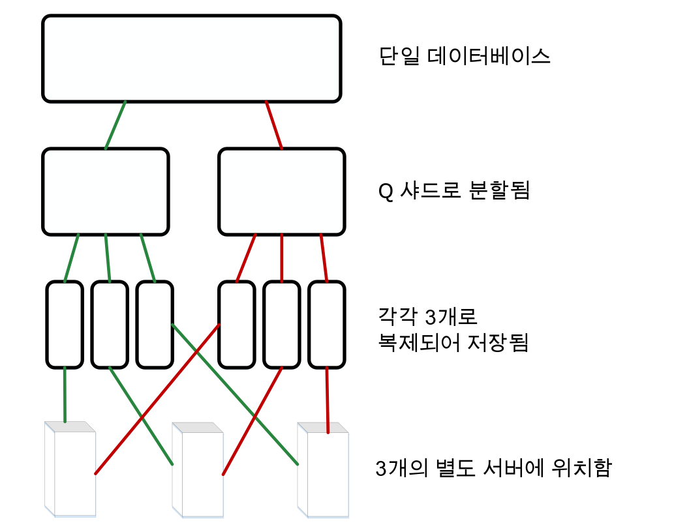
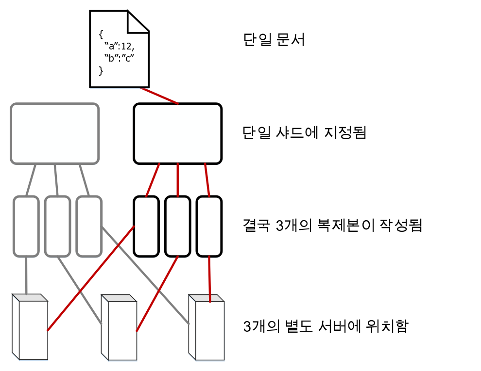

---

copyright:
  years: 2017, 2018
lastupdated: "2018-10-24"

---

{:new_window: target="_blank"}
{:shortdesc: .shortdesc}
{:screen: .screen}
{:codeblock: .codeblock}
{:pre: .pre}
{:tip: .tip}

<!-- Acrolinx: 2017-05-10 -->

# 데이터가 {{site.data.keyword.cloudant_short_notm}}에 저장되는 방식

## 개념

{{site.data.keyword.cloudantfull}}내의 모든 데이터베이스는 하나 이상의 개별 _샤드_로 구성되어 있으며, 샤드의 수는 _Q_로 표현됩니다.
샤드는 데이터베이스의 개별 문서 서브세트입니다.
모든 _Q_ 샤드가 모여 데이터베이스 내에 데이터를 저장합니다.
각 샤드는 세 개의 서로 다른 사본으로 저장됩니다.
각 샤드 사본을 샤드 _복제본_이라고 합니다.
각 샤드 복제본은 서로 다른 서버에 저장됩니다.
이러한 서버는 한 위치의 데이터 센터에서 사용 가능한 서버입니다.
데이터 센터에 있는 서버의 집합을 클러스터라고 합니다.



문서는 해당 ID의 일치 해싱을 사용하여 특정 샤드에 지정됩니다.
이 지정은 특정 문서가 항상 알려진 샤드 및 서버 세트에 저장됨을 의미합니다.



때때로 샤드는 _재밸런싱_됩니다.
재밸런싱에서는 다른 서버로 복제본을 이동합니다.
이는 서버 모니터링에서
특정 서버가 다른 서버보다 더 또는 덜 사용되고 있음을 알리거나, 유지보수를 위해 특정 서버의 서비스를 중단해야 하는 등과 같은
몇 가지 이유로 인해 발생합니다.
샤드 및 복제본의 수는 변경되지 않으며 문서는 동일한 샤드에 지정된 상태를 유지하지만,
샤드 복제본의 서버 저장 위치가 변경됩니다.

_Q_의 기본값은 클러스터에 따라 다릅니다.
이 값은 시간 경과에 따라 조정될 수 있습니다.

복제본(샤드의 사본)의 수 또한 구성할 수 있습니다.
실제 사용되고 있는 많은 시스템을 관찰하고 측정한 결과,
대부분의 경우 성능과 데이터 안정성 간에 균형을 이루기 위해서는 세 개의 복제본을 사용하는 것이 가장 실용적이라는 결과가 나왔습니다.
{{site.data.keyword.cloudant_short_notm}} 시스템에서 다른 복제본 개수를 사용하는 것은 일반적이지 않은, 예외적인 경우입니다.

## 샤딩이 성능에 미치는 영향

데이터베이스의 샤드 수는 다양하게 데이터베이스 성능에 영향을 주므로 구성 가능합니다.

클라이언트 애플리케이션으로부터 데이터베이스에 요청이 전송되면 클러스터 내의 한 서버 또는 '노드'가 요청의 _조정자_로 지정됩니다.
이 조정자는 요청과 관련된 데이터를 저장하고 있는 노드에 내부 요청을 보내고, 요청에 대한 응답을 결정한 후 이 응답을 클라이언트에 리턴합니다.

데이터베이스의 샤드 수는 두 가지 면에서 성능에 영향을 줄 수 있습니다.

1.	데이터베이스 내의 각 문서는 하나의 샤드에 저장됩니다.
	따라서, 여러 샤드가 있으면 하나의 문서 요청에 대한 병렬 처리 능력이 향상됩니다.
	이는 조정자가 문서를 저장하고 있는 노드에만 요청을 전송하기 때문입니다.
	그러므로, 데이터베이스에 여러 샤드가 있는 경우에는 요청에 응답하지 않아도 되는
	다른 여러 노드가 있을 가능성이 높습니다.
	이러한 노드는 조정자 요청으로 인한 인터럽트 없이 다른 태스크에 대한 작업을 계속할 수 있습니다.
2.	데이터베이스는 조회 요청에 응답하려는 경우
	모든 샤드의 결과를 처리해야 합니다.
	따라서 샤드가 많으면 처리해야 하는 양이 많아집니다.
	이는 조정자가 샤드당 하나의 요청을 전송한 후
	클라이언트에 응답을 리턴하기 전에 모든 결과를 결합해야 하기 때문입니다.

사용자의 데이터베이스에 적합한 샤드 개수를 좀 더 쉽게 판별하려면,
애플리케이션에서 전송하는 요청에서 가장 공통된 유형을 식별하십시오.
예를 들면, 요청이 대부분 단일 문서 오퍼레이션에 대한 것인지, 또는
조회인지 고려하십시오.
오퍼레이션의 시간 관련 여부도 고려하십시오.

모든 조회에서, 조정자는 모든 복제본에 읽기 요청을 발행합니다.
이 접근법이 사용되는 이유는 각 복제본이 조회 응답에 도움을 주는 고유 인덱스 사본을 유지하기 때문입니다.
이 구성의 주된 영향은 _만약_ 문서 쓰기가 클러스터 내 샤드에 균등하게 분배되는 경우,
여러 샤드가 있으면 병렬 인덱스 빌드가 가능하다는 것입니다.

실제 상황에서는 클러스터 내 노드 전체의 인덱싱 로드 경향을 예측하기 어렵습니다.
또한, 인덱싱 로드 예측은 일반적으로 요청 패턴 처리보다 유용하지 않습니다.
이는 문서 요청 후에는 인덱싱이 필요없으나, 문서 쓰기 후에는 필요할 수 있기 때문입니다.
따라서, 인덱싱만 고려하는 것은 적절한 샤드 개수를 가늠하기에 충분한 정보를 제공하지 않습니다.

데이터 크기에 대한 중요 고려사항은 샤드당 문서 수입니다.
갹 샤드는 해당 문서를 디스크에 있는
큰 [B-트리](https://en.wikipedia.org/wiki/B-tree){:new_window}에 저장합니다.
인덱스도 동일한 방식으로 저장됩니다.
샤드에 추가되는 문서가 늘어남에 따라 일반적인 문서 검색 또는 조회 중에 B-트리 순회에 사용되는 단계 수도 증가합니다.
이러한 '깊이 증가'는
캐시 또는 디스크에서 더 많은 데이터를 읽게 하므로 요청의 처리 속도를 감소시킵니다.

일반적으로는 샤드당 문서 수가 천만 개를 넘지 않도록 하십시오.
전체 샤드 크기의 경우에는 운영 상의 이유로 샤드 크기를 10GB 미만으로 유지하는 것이 좋습니다.
예를 들어, 작은 샤드는 재밸런싱 중에 네트워크를 통해 이동하기 쉽습니다.

문서 수를 줄이는 것과 샤드 크기를 줄이는 것은 서로 충돌하는 요구사항이므로, 하나의 _Q_ 값이 모든 경우에 대해 최적일 수는 없습니다.
{{site.data.keyword.cloudant_short_notm}}에서는 시간이 경과하며 사용 패턴이 변경됨에 따라 클러스터의 기본값을 조정합니다.

어쨌든, 특정 데이터베이스에서 관찰된 패턴 및 크기 지정을 고려하는 시간을 갖고,
이 정보를 사용하여 미래의 적절한 샤드 수를 선택하는 것은 도움이 됩니다.
대표 데이터 및 요청 패턴을 테스트하는 것은 적절한 _Q_ 값을 예상하는 데 있어서 필수적입니다.
프로덕션 환경에서는 이러한 예상값을 변경할 준비가 되어 있어야 합니다.

<div id="summary"></div>

간단한 다음 가이드라인은 초기 계획 단계에서 유용합니다.
계획된 구성(특히 대형 데이터베이스의 경우)을 대표 데이터에 대해 테스트하여 유효성을 검증하는 것을 잊지 마십시오.

*	데이터의 크기가 별로 크지 않거나(수십 - 수백 메가바이트),
	문서 수가 수천 개 정도인 경우에는 하나의 샤드만 있으면 됩니다.
*	용량이 수 GB 정도이거나 문서 수가 수백만 개 정도인 데이터베이스의 경우에는
	8과 같은 한자리 수의 샤드 개수가 적절할 가능성이 높습니다.
*	용량이 수십 GB이거나 문서 수가 수천만 - 수억 개인 큰 데이터베이스의 경우에는
	16개 샤드를 사용하도록 데이터베이스를 구성하는 것을 고려하십시오.
*	이보다 더 큰 데이터베이스의 경우에는 데이터를 수동으로 여러 데이터베이스로
	샤딩하는 것을 고려하십시오.
	이렇게 큰 데이터베이스의 경우에는
	[{{site.data.keyword.cloudant_short_notm}} 지원 ](mailto:support@cloudant.com){:new_window}에 문의하여 조언을 구하십시오.

>	**참고:** 이러한 가이드라인의 숫자는 정확한 계산이 아니라 관찰 및 경험을 통해 파악된 숫자입니다.

<div id="API"></div>

## 샤드 관련 작업

### 샤드 개수 설정

데이터베이스의 샤드 수 _Q_는 데이터베이스가 작성될 때 설정됩니다.
_Q_ 값은 나중에 변경할 수 없습니다.

데이터베이스를 작성할 때 _Q_를 지정하려면 `q` 조회 문자열 매개변수를 사용하십시오.

다음 예에서는 `mynewdatabase`라는 데이터베이스가 작성됩니다.
`q` 매개변수는 이 데이터베이스에 대해 여덟 개의 샤드를 작성하도록 지정합니다.

```sh
curl -X PUT -u myusername https://myaccount.cloudant.com/mynewdatabase?q=8
```
{:codeblock}

>	**참고:** {{site.data.keyword.cloud}}의 {{site.data.keyword.cloudant_short_notm}} 데이터베이스에서는 데이터베이스의 _Q_ 설정이 사용으로 설정되어 있지 않습니다.
	대부분의 `cloudant.com` 멀티 테넌트 클러스터에서는 _Q_ 값을 사용할 수 없습니다.

_Q_ 값이 사용 불가능한 경우에 이 값을 설정하려 시도하면 JSON 본문이 다음 예와 같은 [`403` 응답](../api/http.html#403)을 수신하게 됩니다.

```json
{
	"error": "forbidden",
	"reason": "q is not configurable"
}
```
{:codeblock}

### 복제본 개수 설정

CouchDB 버전 2 이상에서는 데이터베이스를 작성할 때
[복제본 개수 지정 ](http://docs.couchdb.org/en/2.0.0/cluster/databases.html?highlight=replicas#creating-a-database){:new_window}을 수행할 수 있습니다.
그러나 복사본 개수 값을 기본값인 3에서 변경할 수는 없습니다.
특히, 데이터베이스를 작성할 때는 다른 복제본 개수 값을 지정할 수 없습니다.
추가적인 도움을 받으려면 [{{site.data.keyword.cloudant_short_notm}} 지원 ](mailto:support@cloudant.com){:new_window}에 문의하십시오.

### _R_ 및 _W_ 인수에 대한 정보

일부 요청은 조정자가 요청에 응답할 때의 동작에 영향을 줄 수 있는 인수를 포함할 수 있습니다.
이러한 인수를 요청 조회 문자열의 해당 인수 이름에 따라 _R_ 및 _W_라 합니다.
이들은 단일 문서 오퍼레이션에만 사용할 수 있습니다.
이들은 일반적인 '조회 스타일' 요청에 아무런 영향을 주지 않습니다.

실제 상황에서 _R_ 및 _W_ 값을 지정하는 것이 효과적인 경우는 드뭅니다.
예를 들어, _R_ 또는 _W_ 지정은 읽기 또는 쓰기의 일관성을 변경하지 않습니다.

#### _R_의 개념

_R_ 인수는 단일 문서 요청에만 지정할 수 있습니다.
_R_은 조정자가 클라이언트에 응답하기 전에 수신해야 하는 응답의 수에 영향을 줍니다.
이 응답은 문서를 포함하는 샤드의 복제본을 호스팅하는 노드에서 제공되어야 합니다. 

_R_을 _1_로 설정하면 조정자가 응답을 더 빨리 리턴할 수 있으므로 전체 응답 시간이 향상될 수 있습니다.
이는 해당 샤드를 호스팅하는 복제본으로부터 하나의 응답만 기다리면 되기 때문입니다.

>	**참고:** {{site.data.keyword.cloudant_short_notm}}에서 사용하는 [결과적 일관성](cap_theorem.html) 모델로 인해, _R_ 값을 줄이면 리턴되는 응답이 최신 데이터가 아닐 가능성이 높아집니다.
	기본 _R_ 값을 사용하면 이 효과를 완화시키는 데 도움이 됩니다.

_R_의 기본값은 _2_입니다.
이 값은 세 개의 샤드 복제본을 사용하는 일반적인 데이터베이스의 대부분의 복제본에 해당됩니다.
데이터베이스에 3개보다 많거나 적은 수의 복제본이 있는 경우 _R_의 기본값은 이에 맞춰 변경됩니다.

#### _W_의 개념

_W_는 단일 문서 쓰기 요청에만 지정할 수 있습니다.

_W_는 조정자가 클라이언트에 응답하기 전에 수신해야 하는 응답의 수에 영향을 주므로 _R_과 유사합니다.

>	**참고:** _W_는 실제 쓰기 동작에 전혀 영향을 주지 않습니다.

_W_의 값은 문서의 데이터베이스 내 기록 여부에 영향을 주지 않습니다.
_W_ 값을 지정하면
_W_ 복제본이 조정자에 응답했는지 여부를 판별하기 위해 클라이언트가 응답의 HTTP 상태 코드를 검사할 수 있게 됩니다.
조정자는 응답을 클라이언트에 리턴하기 전에, 문서의 사본을 호스팅하는 노드의 응답을 사전 설정된 _W_초의 제한시간 동안 기다립니다.
