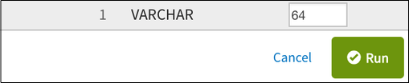

---

copyright:
  years: 2015, 2018
lastupdated: "2018-03-06"

---

{:new_window: target="_blank"}
{:shortdesc: .shortdesc}
{:screen: .screen}
{:codeblock: .codeblock}
{:pre: .pre}

# 데이터 웨어하우징

## {{site.data.keyword.cloudant_short_notm}}의 {{site.data.keyword.dashdbshort_notm}} 기능이 더 이상 사용되지 않음(2018년 2월 7일)
{: #deprecating-cloudant-nosql-db-s-db2-warehouse-on-cloud-feature-february-7-2018-}

{{site.data.keyword.cloudantfull}}의 {{site.data.keyword.dashdblong}} 기능이 아래 타임라인에 따라 더 이상 사용되지 않고 지원 중단됩니다. 데이터가 시스템에서 제거되진 않지만 동기화는 중지됩니다.  

지원 중단 날짜   | 지원 중단 세부사항
-----------------|--------------------------
2018년 1월 16일  | 웨어하우스 탭에 {{site.data.keyword.dashdbshort_notm}} 작업을 이미 작성한 {{site.data.keyword.cloudant_short_notm}} 서비스 인스턴스에서만 웨어하우스 탭을 이용할 수 있습니다. {{site.data.keyword.dashdbshort_notm}} 작업을 작성하지 않았으면 이 기능에 액세스할 수 없습니다. 
2018년 3월 31일  | 1월 16일 전에 {{site.data.keyword.dashdbshort_notm}} 기능의 사용을 시작한 고객은 신규 {{site.data.keyword.dashdbshort_notm}} 작업을 작성할 수 없습니다. 
2018년 5월 5일   | 기존 {{site.data.keyword.dashdbshort_notm}} 작업이 중단됩니다. 최종 상태는 여전히 대시보드에서 볼 수 있습니다. 
2018년 5월 31일  | {{site.data.keyword.dashdbshort_notm}} 기능에 대한 사용자 인터페이스가 제거됩니다. {{site.data.keyword.dashdbshort_notm}} 작업의 상태가 사용 불가능해집니다. 
 
2018년 4월 30일까지 {{site.data.keyword.dashdbshort_notm}}로 전송된 데이터는 {{site.data.keyword.dashdbshort_notm}}에 남아 있으며 {{site.data.keyword.cloudant_short_notm}} 데이터 역시 영향을 받지 않습니다. 

### {{site.data.keyword.dashdbshort_notm}} 기능의 대체

{{site.data.keyword.cloudant_short_notm}} 문서 추출 및 {{site.data.keyword.dashdbshort_notm}} 테이블에 데이터 쓰기에 관한 튜토리얼은 [데이터 플로우 예제 저장소 ](https://github.com/cloudant-labs/data-flow-examples){:new_window}를 참조하십시오. 

## 데이터 웨어하우징 개요

데이터베이스는 데이터를 저장하는 데 있어서 필수적입니다.
그러나 데이터베이스의 진가는 관련 데이터를 빠르고 쉽게 검색하고,
데이터를 애플리케이션 내에서 이용함으로써 비즈니스 목적으로 이러한 데이터를 활용할 수 있을 때 발휘됩니다.
{:shortdesc}

그러나 사용자가 데이터에 대해 수행하는 저장, 처리 및 분석 태스크는 애플리케이션 내에서 반복적으로 사용됩니다.
또는, 이들이 업계 우수 사례의 좋은 예인 경우도 있습니다.

따라서 추가 기능을 사용하여 표준 데이터베이스 기능을 확장함으로써 보고 또는 분석과 같은 태스크를 지원하는 것이 좋습니다.

30년 가까이 '데이터 웨어하우스'는 관계형 데이터베이스 기술을 기반으로 데이터 저장, 보고 및 분석에 대한 업계 표준의 위치를 유지했습니다.
대개, [데이터 웨어하우스 ](https://en.wikipedia.org/wiki/Data_warehouse){:new_window}는
"하나 이상의 소스의 통합된 데이터에 대한 중앙 저장소입니다.
이는 현재 및 히스토리 데이터를 저장합니다.
엔터프라이즈 내 IT 관련 작업자는 이를 사용하여 분석 및 보고서 작성을 수행할 수 있습니다."

데이터 저장, 보고 및 분석을 가능하게 하는 기술은 '[빅데이터 ](https://en.wikipedia.org/wiki/Big_data){:new_window}'
처리 방법에 대한 시장의 요구에 따라 최근에 개발되었습니다. "빅데이터는 너무 크고 복잡하여 기존의 데이터 처리 애플리케이션이 적합하지 않은 데이터 세트입니다."

동시에, 데이터 웨어하우스 및 관련 제품의 특성은 데이터 웨어하우스를 실현하는 관계형 데이터베이스 기술이 빅데이터 관련 태스크에 대해서도 즐겨 사용됨을 의미합니다.

다음 예와 같이, {{site.data.keyword.cloudant_short_notm}} 기능을 관계형 데이터 웨어하우스와 통합하여 얻을 수 있는 이점을 잘 보여주는 다양한 유스 케이스가 있습니다. 

## 이 통합이 내 유스 케이스에도 적합합니까?

{{site.data.keyword.cloudant_short_notm}}의 웨어하우징 통합은 사용자 문서의 스키마를 자동으로 검색하고 데이터를 지능적으로 {{site.data.keyword.Db2_on_Cloud_short}} 또는 {{site.data.keyword.dashdbshort_notm}}로 가져오는 간소화된 프로세스입니다. {{site.data.keyword.cloudant_short_notm}}에 웨어하우스를 작성하면 스키마가 먼저 자동으로 검색되고 그 다음 데이터가 연결된 {{site.data.keyword.dashdbshort_notm}} 데이터베이스로 가져오기됩니다.  

데이터에 다음과 같은 특성이 있을 때 통합에 적합합니다. 

* 대부분 정적 스키마 세트를 가집니다. 스키마를 변경하면 웨어하우스를 다시 시작해야 하고 데이터를 처음부터 다시 가져옵니다. 
* 스키마는 비교적 적은 수의 문서에서 최대 몇 만개의 문서까지 스캔하여 검색될 수 있습니다. 일단 스키마가 검색되면 물론 수 백만 개의 문서를 웨어하우스로 가져올 수 있습니다. 
* 웨어하우징은 엄격하게 실시간일 필요는 없습니다. 업데이트된 문서는 일반적으로 몇 초 내에 웨어하우스에 표시되지만 보장되는 것은 아니며 데이터베이스 로드에 따라 달라질 수 있습니다.
* {{site.data.keyword.Db2_on_Cloud_short}}에서는 스키마를 1,012개 필드로 제한합니다. 중첩된 오브젝트 및 대형 배열을 포함하여 다수의 필드가 있는 JSON 문서는 이 한계를 초과할 수 있습니다. 

## 데이터 결합

상호 도메인 분석을 위한 여러 데이터 저장소의 데이터 결합은 관계형 데이터 웨어하우스를 사용하여 쉽고 효율적으로 수행할 수 있는 태스크입니다.

데이터 웨어하우스의 로드 중에는 다양한 소스의 데이터가 준비되어 공통 형식으로 변환됩니다.
레코드는 테이블에 저장되며, 통합 분석을 가능하게 하기 위해 이러한 테이블을 결합하는 데 사용할 수 있는 여러 오퍼레이션이 있습니다.

관계형 데이터 웨어하우스에서의 결합은 일부 데이터가 이미 관계형 표현으로 사용 가능한 경우(예: 마스터 데이터 또는 참조 데이터) 특히 유용합니다.

## 유연성

{{site.data.keyword.cloudant_short_notm}} 데이터베이스는 데이터 표현에 있어서 유연합니다. 예를 들면, 읽기 또는 쓰기 중에 스키마를 강제하지 않습니다.

반면, 보고 및 분석 태스크를 위해서는 주의깊게 정의되어 엄격히 적용되는 모델이 필요합니다.

관계형 웨어하우스에서 문서가 사용 가능한 상태가 되면 고정된 테이블 정의 세트를 기반으로 모델을 작성할 수 있습니다.
해당 테이블 스키마에 맞는 문서만 로드될 수 있으며 맞지 않는 문서는 거부됩니다.
고정된 관계형 스키마를 사용하여 일관된 데이터로 모델을 훈련시킬 수 있습니다.

## 데이터 무결성 확인

데이터 웨어하우스는 제한조건을 사용하여 데이터 무결성을 확인할 수 있습니다.
예를 들면 다음과 같습니다.

-   두 레코드는 동일한 기본 키를 가질 수 없습니다.
-   외부 키는 레코드가 완전한 것임을 보장합니다.
-   비즈니스 규칙에 대해 레코드를 유효성 검증하는 데 함수를 사용할 수 있습니다.

고유성, 정확성 및 완전성은 모든 엔터프라이즈 서비스의 필수 요구사항입니다.
{{site.data.keyword.cloudant_short_notm}} 문서를 데이터 웨어하우스에 로드하면 이러한 요구사항을 만족시키는 데 도움이 됩니다. 

## {{site.data.keyword.cloudant_short_notm}}와 데이터 웨어하우징

데이터 웨어하우스는 주목할 만한 중요한 기술입니다.
{{site.data.keyword.cloudant_short_notm}}는 관계형 데이터 웨어하우스와의 긴밀한 통합을 제공하며 이 기술의 이점을 활용할 수 있습니다. 

{{site.data.keyword.cloudant_short_notm}}에는 기본 분석 태스크를 수행할 수 있도록 기본적으로 제공되는 기본 웨어하우징 기능([MapReduce 보기](../api/using_views.html))이 있습니다. 

고급 웨어하우징 태스크를 위해서는 IBM Cloud 기반 웨어하우징 서비스인 [{{site.data.keyword.IBM}} {{site.data.keyword.dashdbshort_notm}} ](https://www.ibm.com/analytics/us/en/data-management/data-warehouse/){:new_window}에서 제공하는 전체 기능을 이용할 수 있습니다. 

{{site.data.keyword.cloudant_short_notm}}를 사용할 때는 다음과 같은 통합된 고급 웨어하우징 기능을 쉽게 이용할 수 있습니다. 

-   관계형 데이터베이스 형식으로 JSON 데이터를 봅니다.
-   데이터에 대한 SQL 기반 조회를 수행합니다.
-   데이터로부터 분석을 빌드합니다.

이러한 고급 웨어하우징 기능은 {{site.data.keyword.cloudant_short_notm}}에 대한 최적의 보완 서비스인 {{site.data.keyword.dashdbshort_notm}}와 같은 서비스를 통해 사용할 수 있습니다. 

또는, 웨어하우징 기능 없이 문서에 대한 관계형 데이터 저장소만 필요한 경우에는 {{site.data.keyword.cloudant_short_notm}} 문서를 [{{site.data.keyword.Db2_on_Cloud_short}}](#ibm-db2-on-cloud) 서비스에 로드할 수 있습니다. 

## {{site.data.keyword.dashdblong_notm}}

{{site.data.keyword.dashdbshort_notm}}는 분석 작업을 위해 개발된 클라우드 기반 데이터 웨어하우스 서비스입니다.
{{site.data.keyword.dashdbshort_notm}}는 {{site.data.keyword.cloudant_short_notm}} JSON 데이터에 최적화된 서비스이긴 하지만, 로드된 데이터의 구조를 조사함으로써 다양한 소스의 데이터를 허용할 수 있습니다. 

자세한 정보는 [{{site.data.keyword.dashdblong_notm}} 문서 ](https://www.ibm.com/support/knowledgecenter/SS6NHC/com.ibm.swg.im.dashdb.kc.doc/welcome.html){:new_window}를 참조하십시오. 

## {{site.data.keyword.Db2Hosted_notm}}

[{{site.data.keyword.Db2Hosted_full}} ](https://console.ng.bluemix.net/catalog/services/ibm-db2-on-cloud){:new_window}에서는 IBM SoftLayer® 글로벌 클라우드 인프라의 데이터베이스를 제공합니다. 고유 인프라를 관리하는 데 따른 비용, 복잡성 및 위험성 없이 온프레미스 DB2 배치의 다양한 기능을 제공합니다. 

자세한 정보는 [{{site.data.keyword.Db2Hosted_short}} 문서 ](https://console.ng.bluemix.net/docs/services/DB2OnCloud/index.html#DB2OnCloud){:new_window}를 참조하십시오. 

## 웨어하우스 작성

웨어하우스를 작성하는 방법에는 두 가지가 있습니다.

1.  [{{site.data.keyword.cloudant_short_notm}}를 사용하여 {{site.data.keyword.dashdbshort_notm}} 웨어하우스 작성](#use-cloudant-to-create-a-db2-warehouse-on-cloud-warehouse)
2.  [{{site.data.keyword.cloudant_short_notm}}를 기존 웨어하우스에 연결](#connect-cloudant-to-an-existing-warehouse)

### {{site.data.keyword.cloudant_short_notm}}를 사용하여 {{site.data.keyword.dashdbshort_notm}} 웨어하우스 작성

웨어하우스를 작성하는 가장 간단한 방법은 {{site.data.keyword.cloudant_short_notm}}가 사용자를 대신하여 {{site.data.keyword.Bluemix}} 내에 {{site.data.keyword.dashdbshort_notm}} 웨어하우스 인스턴스를 작성하도록 하는 것입니다.
{{site.data.keyword.cloudant_short_notm}} 대시보드의 `Integrations` 탭 내에 있는 `Warehouse` 태스크의 `Create Warehouse` 단추를 클릭하여 이를 수행하십시오. 

{{site.data.keyword.Bluemix_notm}}에 아직 로그인하지 않은 경우에는 로그인 요청을 받게 됩니다. 

>   **참고**: 기본적으로 {{site.data.keyword.cloudant_short_notm}}는 사용자의 웨어하우스를 위해 {{site.data.keyword.Bluemix_notm}}에 {{site.data.keyword.dashdbshort_notm}} 인스턴스를 작성합니다. 

인증하고 나면 {{site.data.keyword.Bluemix_notm}} 계정을 사용하여 새 {{site.data.keyword.dashdbshort_notm}} 인스턴스를 작성하도록 요청할 수 있습니다. 

이를 수행하려면 다음 작업을 수행하십시오.

1.  `Warehouse Name` 필드에 웨어하우스에 대해 사용할 이름을 제공하십시오.
2.  `Data Sources` 필드에 {{site.data.keyword.cloudant_short_notm}} 내 기존 데이터베이스의 이름을 제공하십시오. 
3.  양식에 `Create new {{site.data.keyword.dashdbshort_notm}} instance` 옵션이 선택되어 있는지 확인하십시오. 
4.  `Create Warehouse` 단추를 클릭하십시오.

### {{site.data.keyword.cloudant_short_notm}}를 기존 웨어하우스에 연결

{{site.data.keyword.cloudant_short_notm}}를 사용하여 {{site.data.keyword.dashdbshort_notm}} 웨어하우스 데이터베이스를 작성하는 대신, 기존 {{site.data.keyword.dashdbshort_notm}} 인스턴스에 연결할 수 있습니다. 

프로세스는 [{{site.data.keyword.cloudant_short_notm}}를 사용하여 {{site.data.keyword.dashdbshort_notm}} 웨어하우스 작성](#use-cloudant-to-create-a-db2-warehouse-on-cloud-warehouse)과 유사하지만,
`Create new {{site.data.keyword.dashdbshort_notm}} instance` 옵션을 선택하는 대신 `{{site.data.keyword.dashdbshort_notm}} service instance`를 선택하고
{{site.data.keyword.Bluemix_notm}}에 이미 있는 {{site.data.keyword.dashdbshort_notm}} 웨어하우스를 선택하십시오. 

### {{site.data.keyword.Db2_on_Cloud_short}} 웨어하우스 인스턴스 사용

원하면 {{site.data.keyword.dashdbshort_notm}} 대신 기존 {{site.data.keyword.Db2_on_Cloud_short}} 웨어하우스 인스턴스에 연결할 수도 있습니다. 이를 수행하려면 {{site.data.keyword.cloudant_short_notm}} 대시보드 내의 `DB2` 옵션을 선택하여 기존 {{site.data.keyword.Db2_on_Cloud_short}} 인스턴스에 연결하십시오. 

{{site.data.keyword.Db2_on_Cloud_short}} 인스턴스에 연결하려는 경우에는 다음 세부사항을 제공해야 합니다. 

-   호스트 주소
-   포트 번호
-   데이터베이스 이름
-   데이터베이스의 사용자 ID
-   사용자 ID의 비밀번호

>   **참고**: 이 주제의 나머지 내용에서는 {{site.data.keyword.dashdbshort_notm}}를 웨어하우스 인스턴스로 지칭하고 있습니다. 
    그러나 이 주제는 {{site.data.keyword.Db2_on_Cloud_short}} 인스턴스를 사용하는 경우에도 동일하게 적용됩니다.
    [{{site.data.keyword.cloudant_short_notm}}에서 {{site.data.keyword.dashdbshort_notm}}로의 JSON 데이터 로드 ](https://developer.ibm.com/clouddataservices../dashdb/get/load-json-from-cloudant-database-in-to-dashdb/){:new_window}를 수행하는 방법을 설명하는 튜토리얼 또한 사용 가능하며, 여기에는 {{site.data.keyword.Db2_on_Cloud_short}}를 웨어하우스 데이터베이스로 사용하는 예가 포함되어 있습니다.

## 웨어하우스 스키마

{{site.data.keyword.cloudant_short_notm}} 내에 처음으로 웨어하우스를 작성할 때, {{site.data.keyword.dashdbshort_notm}}는 데이터베이스 내의 데이터에 대해 가능한 최적의 스키마를
작성함으로써 JSON 문서 내의 각 필드가 새 스키마 내에서 해당 항목을 갖도록 하는 데 도움을 줍니다.
선택적으로, 웨어하우스를 작성할 때는 수동으로 [스키마를 사용자 정의](#customizing-the-warehouse-schema)하도록 선택할 수 있습니다.

스키마가 작성되면 웨어하우스가 데이터를 관계형 형식으로 저장할 수 있게 됩니다.
{{site.data.keyword.cloudant_short_notm}}는 그 후 [복제](../api/replication.html)하여 웨어하우스에 데이터베이스 문서의 '초기 로드'를 수행함으로써 사용자에게 {{site.data.keyword.dashdbshort_notm}} 관계형 데이터베이스 내에 활성화된 데이터 콜렉션을 제공합니다. 

시간 경과에 따라 {{site.data.keyword.cloudant_short_notm}} 데이터베이스 컨텐츠가 변경될 수 있습니다. 사용자는 기존 웨어하우스의 스키마를 수정할 수 있습니다.

>   **참고**: 기존 웨어하우스의 스키마를 수정하면,
    {{site.data.keyword.cloudant_short_notm}} 데이터베이스의 데이터를 웨어하우스 데이터베이스로 다시 복제해야 합니다.
    사실상 스키마 수정은 웨어하우스로의 '초기 로드'가 다시 수행되도록 합니다.

## 웨어하우스 관련 작업

{{site.data.keyword.cloudant_short_notm}} 웨어하우징에서는 {{site.data.keyword.dashdbshort_notm}} 콘솔에서 '기존' SQL 조회 실행 및 결과 보기를 모두 수행할 수 있습니다. 

외부 애플리케이션은 다른 관계형 데이터베이스와 동일한 방식으로 데이터와 상호작용할 수 있습니다.
{{site.data.keyword.dashdbshort_notm}}의 장점은 다른 소스로부터 추가 데이터를 로드하거나 기본 제공 분석 도구를 사용하여 데이터를 분석하는 등의 다른 웨어하우징 태스크를 수행할 수 있다는 점입니다. {{site.data.keyword.dashdbshort_notm}}는 통계 컴퓨팅 및 그래픽을 위한
[`'R'` 프로그래밍 언어 ](https://en.wikipedia.org/wiki/R_%28programming_language%29){:new_window}와
소프트웨어 환경을 지원합니다. 이는 사용자가 선형 회귀, 'k-평균' 클러스터링 및 지리공간 분석과 같은 데이터베이스 분석 태스크를 수행할 수 있게 해 주는 알고리즘에 액세스할 수 있음을 의미합니다.

`RStudio` 도구를 통해 `'R'` 스크립트를 작성하고 {{site.data.keyword.dashdbshort_notm}}에 업로드한 후 데이터를 사용하여 실행할 수 있습니다. 

{{site.data.keyword.dashdbshort_notm}}로 작업에 대한 자세한 정보는 [{{site.data.keyword.dashdblong_notm}} 문서 ](https://www.ibm.com/support/knowledgecenter/SS6NHC/com.ibm.swg.im.dashdb.kc.doc/welcome.html){:new_window}를 참조하십시오.

## 데이터 및 구조의 최신 상태 유지

데이터는 [복제](../api/replication.html) 프로세스를 사용하여 {{site.data.keyword.cloudant_short_notm}}에서 {{site.data.keyword.dashdbshort_notm}}로 로드됩니다.
이는 {{site.data.keyword.cloudant_short_notm}} 데이터가 어떤 방식으로든 업데이트되거나 수정되는 경우 분석 태스크가 최신 정보를 사용하여
작업을 계속하도록 하려면 {{site.data.keyword.dashdbshort_notm}}로의 문서 복제를 다시 수행해야 함을 의미합니다. 

보통 {{site.data.keyword.cloudant_short_notm}} 복제와 마찬가지로 데이터는 단방향으로만 전송되며, 웨어하우스의 경우 전송은 {{site.data.keyword.cloudant_short_notm}}에서 {{site.data.keyword.dashdbshort_notm}}로 이뤄집니다.
초기 데이터 로드가 완료되면 웨어하우스는 {{site.data.keyword.cloudant_short_notm}} 데이터베이스 내 데이터 컨텐츠 변경사항을 구독합니다.
모든 변경사항은 {{site.data.keyword.cloudant_short_notm}} 소스에서 {{site.data.keyword.dashdbshort_notm}} 대상으로 복제됩니다. 이는 웨어하우징이 {{site.data.keyword.cloudant_short_notm}}에서 {{site.data.keyword.dashdbshort_notm}}로의 연속 복제의 유형임을 의미합니다. 

시간 경과에 따라 {{site.data.keyword.cloudant_short_notm}} 데이터베이스의 구조 또한 변경될 수도 있습니다. 여기에는 JSON 문서의 필드 추가 또는 제거가 포함될 수 있습니다.
이러한 변경이 발생하면 웨어하우스에서 사용하는 스키마가 올바르지 않게 되어 새 데이터가 {{site.data.keyword.cloudant_short_notm}}에서 {{site.data.keyword.dashdbshort_notm}}로 복제될 때 오류가 보고될 수 있습니다. 

{{site.data.keyword.cloudant_short_notm}} 웨어하우징에는 이 문제점을 해결하기 위한 '다시 스캔' 기능이 있습니다.
이는 {{site.data.keyword.cloudant_short_notm}} 데이터베이스의 구조를 다시 스캔한 후 {{site.data.keyword.dashdbshort_notm}}에 필요한 새 스키마를 결정합니다.
그 후에는 이전 스캔 중에 작성된 {{site.data.keyword.dashdbshort_notm}} 내의 이전 테이블이 삭제되고, 새 스키마를 사용하여 새 테이블이 작성된 후
현재 {{site.data.keyword.cloudant_short_notm}} 데이터가 새 '초기 로드'로서 로드됩니다. 

다시 스캔 기능을 사용하려면 먼저 웨어하우스가 실행 중인 아닌지 확인하십시오.
다음과 같이 이 작업을 수행하십시오.

1.  {{site.data.keyword.cloudant_short_notm}} 대시보드 내의 `Integrations` 탭을 선택하십시오. 
2.  `Warehouse` 태스크에서 다시 스캔할 웨어하우스의 이름을 찾으십시오. 
3.  웨어하우스의 이름을 클릭하십시오.
    이 이름은 링크이며, 클릭하면 해당 웨어하우스 세부사항 보기가 열립니다. 

4.  웨어하우스의 현재 상태를 확인하십시오.
    회전하는 녹색 원은 웨어하우스가 실행 중임을 표시합니다.
    웨어하우스를 중지하려면 조치 열에 있는 `Stop Database` 아이콘을 클릭하십시오. 
5.  웨어하우스 데이터베이스가 실행 중이 아닌 경우에는 조치 열의 `Rescan` 아이콘이 사용 가능한 상태가 됩니다. 

### 소스 데이터베이스 다시 스캔

`다시 스캔` 아이콘을 클릭하면 두 가지 선택사항 중 하나를 선택할 수 있습니다.

-   데이터베이스를 스캔합니다.
    이는 기본 조치이며 웨어하우스가 처음 작성되었을 때 수행된 데이터베이스 초기 스캔과 매우 유사합니다.
-   웨어하우스 스키마를 사용자 정의합니다.

단순 다시 스캔을 수행하는 기본 조치를 선택한 경우에는 소스 데이터베이스가 검사된 후 새 웨어하우스 데이터베이스 스키마가 생성됩니다.
다시 스캔이 완료되는 즉시 웨어하우스가 시작됩니다.

웨어하우스 스키마를 사용자 정의하려는 경우에는 `Rescan` 단추를 누르기 전에 `Customize Schema` 선택란을 선택하십시오. 

`Customize Schema` 선택란은 두 가지 옵션을 사용할 수 있습니다. 

1.  사용되는 검색 알고리즘
2.  샘플 크기

### 검색 알고리즘

다시 스캔의 기본 옵션은 `Union` 알고리즘입니다.
이는 모든 샘플링된 {{site.data.keyword.cloudant_short_notm}} 데이터베이스 문서의 모든 속성을 사용하여
웨어하우스 데이터베이스에 하나의 테이블 세트를 작성합니다. 이 알고리즘의 결과로 모든 {{site.data.keyword.cloudant_short_notm}} 데이터베이스 문서가 웨어하우스 데이터베이스에 저장될 수 있으나,
데이터베이스 내 일부 행에서는 몇몇 필드에 컨텐츠가 없을 수 있습니다. 

다시 스캔에 대한 대체 옵션은 `Cluster` 알고리즘입니다.
이는 {{site.data.keyword.cloudant_short_notm}} 데이터베이스 내에서 속성 세트가 동일한 문서를 식별한 후 해당 웨어하우스 데이터베이스 테이블 스키마를 작성합니다. 

### 샘플 크기

이 옵션은 스키마 결정 과정에서 검사되는 {{site.data.keyword.cloudant_short_notm}} 데이터베이스 내 문서의 수를 결정합니다. 

기본값은 10,000개 문서입니다.

이 값을 너무 낮게 설정하면 일부 {{site.data.keyword.cloudant_short_notm}} 문서의 속성이 발견되지 않아 웨어하우스 데이터베이스 구조에서 생략될 위험성이 발생합니다. 

이 값을 너무 높게 설정하면 웨어하우스 데이터베이스 구조를 결정하기 위한 스캔 프로세스가 완료되는 데 오랜 시간이 소요됩니다.

### 다시 스캔 후

{{site.data.keyword.cloudant_short_notm}} 데이터베이스 다시 스캔이 완료된 후 웨어하우스는 자동으로 시작되지 않습니다. 대신 웨어하우스 데이터베이스를 사용자 정의할 수 있도록 정지된 상태를 유지합니다.

## 웨어하우스 스키마 사용자 정의

초기 웨어하우스 작성 프로세스 도중, 또는 다시 스캔 후 자동으로 결정된 데이터베이스 스키마를 수정할 수 있습니다.
이를 수행하려면 작성 프로세스 중에 `Customize Schema` 옵션을 선택해야 합니다.

평소처럼 웨어하우스가 {{site.data.keyword.dashdbshort_notm}}에 작성되지만, 즉시 시작되지 않습니다. 대신, 사용자는 진행하기 전에 이 스키마를 사용자 정의할 수 있습니다.

이를 수행하려면 웨어하우스에 대한 링크를 클릭하십시오.

'

이 링크를 클릭하면 소스 데이터베이스에 사용되는 스키마를 사용자 정의하는 단추가 표시됩니다.
상태 표시기 위로 마우스 커서를 이동하면 스키마가 사용자 정의할 준비가 되었는지 확인할 수 있습니다.

'사용자 정의' 단추를 누르면 데이터베이스 스키마의 필드를 수정할 수 있는 패널이 표시됩니다.

기본값으로 스키마를 재설정하려면 `Rescan` 단추를 클릭하십시오.

웨어하우스의 데이터베이스 스키마 사용자 정의를 완료했으면 `Run` 단추를 클릭하십시오. 

스키마가 저장되며 웨어하우스가 시작됩니다.

### 기존 웨어하우스 스키마 사용자 정의

웨어하우스에 대한 데이터베이스 스키마가 이미 있는 경우에는 [이를 사용자 정의할 수 있습니다](#keeping-the-data-and-structure-fresh).

## 문제점 해결

가끔 웨어하우징 기능을 사용하는 중에 문제점이 발생할 수 있습니다.
이러한 문제점 중 일부에 대한 정보는 이 주제의 뒷부분에 제공되어 있습니다.

또한 [Stack Overflow ](http://stackoverflow.com/questions/tagged/cloudant+dashdb){:new_window}에는
몇 가지 일반적인 오류 또는 문제점에 대한 해설과 이를 문제점 해결하는 방법에 대한 세부사항이 있습니다.

추가적인 도움이 필요하거나 Stack Overflow에서 해결책을 찾을 수 없는 경우에는
[{{site.data.keyword.cloudant_short_notm}} 지원 ](mailto:support@cloudant.com){:new_window}에 문의하십시오. 

### 대시보드에 표시되는 예외

가끔 웨어하우스에서 오류 상태가 발생할 수 있습니다.
예를 들어, 기존 {{site.data.keyword.Db2_on_Cloud_short}} 데이터베이스를 사용하여 웨어하우스를 작성하려고 할 때 올바른 데이터베이스 세부사항을 입력하지 않으면 웨어하우스가 작성되지 않습니다. 

오류 상태가 발생하면 웨어하우스의 상태가 빨간색 원으로 변경되어 사용자의 주의를 요하는 문제점이 있음을 표시합니다.

이 표시기 '위로' 마우스 커서를 이동하면 추가 정보가 제공됩니다.

표시기를 클릭하면 문제점이 정확히 무엇인지 자세히 알려주는 창이 표시됩니다.
다음 예에서는 {{site.data.keyword.Db2_on_Cloud_short}} 연결에 대해 입력된 호스트 세부사항이 올바르지 않습니다. 

### 경고 및 오류

{{site.data.keyword.cloudant_short_notm}} 데이터베이스의 변경사항은 웨어하우스 데이터베이스 전체로 복제됩니다. 특정 변경사항이 웨어하우스 또는 해당 스키마에 적합하지 않은 경우가 있습니다.
이러한 유형의 문제점은 발견되어 웨어하우스 데이터베이스의 `OVERFLOW` 테이블에 로그됩니다.

예를 들어, 웨어하우스 스키마에 유형이 `VARCHAR`이며 최대 32자를 저장하는 `Movie_earnings_rank` 필드가 있으나
{{site.data.keyword.cloudant_short_notm}} 데이터베이스의 변경사항이 40자의 저장 공간을 필요로 하는 경우에는 이 필드가 '오버플로우'됩니다. 이는 '경고' 상태를 발생시키며
이 상태는 웨어하우스 대시보드의 상태 아이콘에 표시됩니다.

웨어하우스 데이터베이스의 표시된 오버플로우 테이블을 살펴보면 경고의 세부사항을 볼 수 있습니다.

이 예에서, 이 경고는 {{site.data.keyword.cloudant_short_notm}} 문서의 `Movie_earnings_rank` 필드의 `_ID`가 `70f6284d2a395396dbb3a60b4cf1cac2`가 되도록 하는 잘림이 발생했음을 명시하고 있습니다. 

여기에는 두 가지 해결책 옵션이 있습니다.

-   {{site.data.keyword.cloudant_short_notm}} 문서 내에서 오버플로우되는 필드를 정정합니다. 
-   [웨어하우스 스키마를 업데이트합니다](#customizing-the-warehouse-schema).

선택하는 옵션은 필드의 추가 컨텐츠가 의도적인 것인지 또는 아닌지에 따라 달라집니다.
애플리케이션에서 추가 컨텐츠를 필요로 하는 경우에는
[웨어하우스 스키마를 업데이트](#customizing-the-warehouse-schema)하여 경고 상태를 제거해야 합니다.

더 심각한 문제는 {{site.data.keyword.cloudant_short_notm}} 데이터베이스의 문서 내에 새 필드가 삽입되었으나 이 필드에 대응하는 항목이 웨어하우스 데이터베이스 스키마에 없는 경우입니다. 이는 '오류' 상태를 발생시킵니다.

예를 들면 {{site.data.keyword.cloudant_short_notm}} 데이터베이스에 있는 특정 문서에, 웨어하우스 데이터베이스 스키마에 없는 `my key`라는 추가 필드가 삽입될 수 있습니다. 

이는 오류 상태를 발생시키며 이 상태는 웨어하우스 대시보드의 상태 아이콘에 표시됩니다.

웨어하우스 데이터베이스의 표시된 오버플로우 테이블을 살펴보면 오류의 세부사항을 볼 수 있습니다.

이 예에서, 오류는 웨어하우스 데이터베이스 스키마가 작성될 때 없었던 필드를 발견했음을 명시하고 있습니다.
{{site.data.keyword.cloudant_short_notm}} 문서에서 필드의 `_ID`가 `70f6284d2a395396dbb3a60b4cf1cac2`인 것이 발견되었습니다. 

여기에는 두 가지 해결책 옵션이 있습니다.

-   {{site.data.keyword.cloudant_short_notm}} 문서에서 추가 필드를 제거합니다. 
-   [웨어하우스 스키마를 업데이트합니다](#customizing-the-warehouse-schema).

선택하는 옵션은 추가 필드가 의도적인 것인지 또는 아닌지에 따라 달라집니다.
애플리케이션에서 추가 필드를 필요로 하는 경우에는
[웨어하우스 스키마를 업데이트](#customizing-the-warehouse-schema)하여 오류 상태를 제거해야 합니다.
