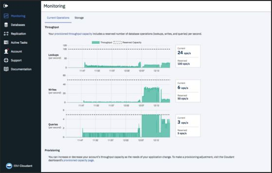

---

copyright:
  years: 2015, 2018
lastupdated: "2018-10-24"

---

{:new_window: target="_blank"}
{:shortdesc: .shortdesc}
{:screen: .screen}
{:codeblock: .codeblock}
{:pre: .pre}
{:tip: .tip}

<!-- Acrolinx: 2017-05-10 -->

# {{site.data.keyword.cloud_notm}} 퍼블릭
{: #ibm-cloud-public}

{{site.data.keyword.cloudantfull}} 퍼블릭은 {{site.data.keyword.cloudant_short_notm}}의 최다 기능 오퍼링으로 업데이트와 신규 기능을 제일 먼저 수신합니다. 가격은 사용자의 처리량과 스토리지 요구사항을 기반으로 하며 필수 로드에 적합하게 이루어집니다. 

무료 [Lite 플랜](#lite-plan)에는 개발 및 평가 용도로 고정 처리량 용량 및 데이터가 포함됩니다. 유료 [표준 플랜](#standard-plan)은
사용자의 애플리케이션 요구사항이 변경됨에 따라 스케일링되는 구성 가능한 프로비저닝된 처리량 용량 및 데이터 스토리지 가격을 제공합니다.  데디케이티드 하드웨어 환경에서 하나 이상의 표준 플랜 인스턴스를 실행할 수 있는 추가 월별 비용의 옵션인 [데디케이티드 하드웨어 플랜](#dedicated-hardware-plan)도 이용할 수 있습니다. 데디케이티드 하드웨어 환경은 사용자 단독 사용을 위한 것이며
데디케이티드 하드웨어 플랜 인스턴스가 미국 내에서 프로비저닝된 경우에는
[HIPAA ](https://en.wikipedia.org/wiki/Health_Insurance_Portability_and_Accountability_Act){:new_window} - 규제 준수 구성을 선택할 수 있습니다.

다음 표에서는 Lite 플랜에 대한 프로비저닝된 처리량 용량 및 디스크 공간 구성 및 표준 플랜의 몇 가지 예를 요약하여 보여줍니다.

<table>

<tr>
<th id="capacity-config-plan">플랜</th><th id="lite">Lite</th><th id="standard" colspan='4'>표준</th>
</tr>
<tr>
<th id="base-priceperhour" headers="capacity-config-plan">기본 가격(시간당)</td>
<td headers="lite base-priceperhour">$0.00</td>
<td headers="standard base-priceperhour" colspan='4'><a href="../offerings/pricing.html#pricing" target="_blank">가격 세부사항 </a>을 참조하십시오.</td>
</tr>
<tr>
<th id="provisionedthroughputcapacity-lookupspersecond" headers="capacity-config-plan">프로비저닝되는 처리량 용량(초당 검색 수)</td>
<td headers="lite provisionedthroughputcapacity-lookupspersecond-lite">20</td>
<td headers="standard provisionedthroughputcapacity-lookupspersecond">100</td>
<td headers="standard provisionedthroughputcapacity-lookupspersecond">1,000</td>
<td headers="standard provisionedthroughputcapacity-lookupspersecond">5,000</td>
<td headers="standard provisionedthroughputcapacity-lookupspersecond">20,000</td>
</tr>
<tr>
<th id="provisionedthroughputcapacity-writespersecond" headers="capacity-config-plan">프로비저닝되는 처리량 용량(초당 쓰기 수)</td>
<td headers="lite provisionedthroughputcapacity-writespersecond">10</td>
<td headers="standard provisionedthroughputcapacity-writespersecond">50</td>
<td headers="standard provisionedthroughputcapacity-writespersecond">500</td>
<td headers="standard provisionedthroughputcapacity-writespersecond">2,500</td>
<td headers="standard provisionedthroughputcapacity-writespersecond">10,000</td>
</tr>
<tr>
<th id="provisionedthroughputcapacity-queriespersecond" headers="capacity-config-plan">프로비저닝되는 처리량 용량(초당 조회 수)</td>
<td headers="lite provisionedthroughputcapacity-queriespersecond">5</td>
<td headers="standard provisionedthroughputcapacity-queriespersecond">5</td>
<td headers="standard provisionedthroughputcapacity-queriespersecond">50</td>
<td headers="standard provisionedthroughputcapacity-queriespersecond">250</td>
<td headers="standard provisionedthroughputcapacity-queriespersecond">1,000</td>
</tr>
<tr>
<th id="diskspaceincluded" headers="capacity-config-plan">포함된 디스크 공간</td>
<td headers="lite diskspaceincluded">1GB</td>
<td headers="standard diskspaceincluded" colspan='4'>20GB</td>
</tr>
<tr>
<th id="diskoveragepergbhour" headers="capacity-config-plan">디스크 초과 사용량(GB/시간당)</td>
<td headers="lite diskoveragepergbhour">사용할 수 없음</td>
<td headers="standard diskoveragepergbhour" colspan='4'><a href="../offerings/pricing.html#pricing" target="_blank">가격 세부사항 </a>을 참조하십시오.</td>
</tr>

</table>

## 플랜
{: #plans}

[{{site.data.keyword.cloudant_short_notm}} 서비스 인스턴스를 프로비저닝](#provisioning-a-cloudant-nosql-db-instance-on-ibm-cloud)할 때는
사용할 플랜을 선택할 수 있습니다.
기본적으로, [Lite 플랜](#lite-plan)이 선택됩니다.

### Lite 플랜
{: #lite-plan}

Lite 플랜은 무료이며 개발 및 평가 목적을 위해 디자인되었습니다. Lite 플랜 인스턴스는 {{site.data.keyword.cloudant_short_notm}}의 전체 기능을 포함하지만, 프로비저닝된 처리량 용량 및 데이터 스토리지의 양은 고정되어 있습니다. 프로비저닝된 처리량 용량은 20회 검색/초, 10회 쓰기/초, 5회 조회/초로 고정되며 데이터 스토리지는 1GB로 제한됩니다.  

스토리지 사용량은 매일 확인됩니다. 1GB 스토리지 한계를 초과하면 {{site.data.keyword.cloudant_short_notm}} 인스턴스에 대한
HTTP 요청이 402 상태 코드와 함께 오류 메시지 "Account has exceeded its data usage quota. An upgrade to a paid plan is required."를 수신합니다.
{{site.data.keyword.cloudant_short_notm}} 대시보드에도 배너가 표시됩니다. 사용자는 여전히 데이터를 읽고 삭제할 수 있습니다. 그러나 새 데이터를 기록하는 데는 두 가지 선택사항이 있습니다. 첫 번째로, 사용자는 쓰기 한계를 즉시 제거하는 유료 [표준 플랜](#standard-plan)으로 업그레이드할 수 있습니다. 또는 전체 스토리지가 1GB 한계를 초과하지 않도록 데이터를 삭제한 후 다음 날의 일별 스토리지 확인까지 기다려 인스턴스가 다시 쓰기를 허용하도록 할 수 있습니다.  

1GB보다 많은 데이터를 저장하려 하거나 프로비저닝된 처리량 용량을 스케일링할 수 있도록 하려면 [표준 플랜](#standard-plan)으로 변경하십시오. 

{{site.data.keyword.cloudant_short_notm}} Lite 플랜은 {{site.data.keyword.cloud_notm}} 계정당 하나로 제한됩니다. 이미 하나의 Lite 플랜 인스턴스가 있는 경우에는 새 Lite 플랜 인스턴스를 작성하려 하거나 표준 플랜 인스턴스를 Lite 플랜으로 변경하려 하면 "You can only have one instance of a Lite plan per service. To create a new instance, either delete your existing Lite plan instance or select a paid plan."이라는 메시지가 리턴됩니다.
{: tip}

### 표준 플랜
{: #standard-plan}

{{site.data.keyword.cloudant_short_notm}} 표준 플랜은 모든 유료 {{site.data.keyword.cloud}} 계정에서 종량과금제 또는 구독 형식으로 사용 가능하며 사용자 애플리케이션의 필요에 맞춰 스케일링할 수 있습니다. 표준 플랜의 가격은 두 가지 요소, 즉 할당된 프로비저닝된 처리량 용량과 인스턴스에 저장된 데이터의 양을 기반으로 책정됩니다.  

가격은 100회 검색/초, 50회 쓰기/초, 5회 조회/초의 프로비저닝된 처리량 용량을 시작으로 시간당 비례 계산되며, 시작 비용은 $0.105/시간(USD)입니다. {{site.data.keyword.cloudant_short_notm}} 대시보드에서 100회 검색/초, 50회 쓰기/초, 5회 조회/초 단위로 프로비저닝된 처리량 용량을 늘리거나 줄일 수 있습니다. 비용은 할당된 프로비저닝된 처리량 용량에 대해 계산되며 측정된 요청의 양에 따라 계산되지는 않습니다. 표준 플랜에는 20GB의 데이터 스토리지가 포함되어 있습니다. 20GB를 초과하여 저장하면 GB/시간당 정의된 비용이 청구됩니다. 

다양한 용량 및 통화의 가격, 그리고 비용 예상 예에 대한 [가격](../offerings/pricing.html#pricing){:new_window} 정보는 {{site.data.keyword.cloud_notm}} 가격 계산기를 참조하십시오. 

### 데디케이티드 하드웨어 플랜
{: #dedicated-hardware-plan}

{{site.data.keyword.cloudant_short_notm}} 데디케이티드 하드웨어 플랜 인스턴스는 {{site.data.keyword.cloudant_short_notm}} 표준 플랜 인스턴스만을 사용하기 위해 프로비저닝되는 베어메탈 {{site.data.keyword.cloudant_short_notm}} 환경입니다. {{site.data.keyword.cloudant_short_notm}} 데디케이티드 하드웨어 플랜 환경은 모든 [{{site.data.keyword.IBM}} 데이터 센터 ](https://www.ibm.com/cloud-computing/bluemix/data-centers)에서 프로비저닝될 수 있습니다. 이 플랜은 HIPAA 규제 준수에 필요하며 프로비저닝할 때 선택해야 합니다. 또한, {{site.data.keyword.cloudant_short_notm}} 데디케이티드 하드웨어 플랜 환경의 사용자는 IP 화이트리스트 지정, 그리고 IBM Key Protect를 사용한 BYOK(Bring-Your-Own-Key) 고객 관리 암호화 키를 이용할 수 있습니다.  

사용자는 하나 이상의 표준 플랜 인스턴스를 프로비저닝할 수 있으며, 데디케이티드 하드웨어 환경은 표준 플랜 인스턴스가 사용하는 용량 및 데이터를 기반으로 필요에 따라 확장되거나 축소됩니다. 이는 {{site.data.keyword.cloudant_short_notm}} 표준 플랜 인스턴스의 이용 가격에 추가되는 고정 가격입니다. 비용 청구는 일별로 비례 계산되며, 환경에 대해서는 최소 1개월의 기간이 비용 청구됩니다. {{site.data.keyword.cloudant_short_notm}} 데디케이티드 하드웨어 플랜의 프로비저닝은 비동기로 이뤄지며 5 - 7영업일이 소요될 수 있습니다. {{site.data.keyword.cloudant_short_notm}} 데디케이티드 하드웨어 플랜 인스턴스를 작성하고 여기에 표준 플랜 인스턴스를 프로비저닝하려면 [{{site.data.keyword.cloud_notm}}에서의 {{site.data.keyword.cloudant_short_notm}} 데디케이티드 하드웨어 플랜 인스턴스 작성 및 활용 ](../tutorials/create_dedicated_hardware_plan.html#creating-and-leveraging-a-cloudant-dedicated-hardware-plan-instance-on-bluemix){:new_window} 튜토리얼을 따르십시오.  

{{site.data.keyword.cloud_notm}} 데디케이티드 고객은 데디케이티드 하드웨어 플랜을 사용할 수 없습니다. 데디케이티드 하드웨어 플랜은 {{site.data.keyword.cloud_notm}} 퍼블릭 고객만 사용할 수 있습니다.
{: tip}

## 프로비저닝되는 처리량 용량
{: #provisioned-throughput-capacity}

프로비저닝되는 처리량은 세 가지 유형의 이벤트 중 하나로 식별되고 측정됩니다.

1.	문서의 `_id`를 기반으로 하는, 특정 문서의 읽기인 검색
2.	개별 문서의 작성, 수정 또는 삭제이거나, 인덱스 빌드로 인한 업데이트인 쓰기
3.	다음 유형을 포함하는, {{site.data.keyword.cloudant_short_notm}} 조회 엔드포인트 중 하나에 대한 요청인 조회
	-	1차 인덱스([`_all_docs`](../api/database.html#get-documents))
	-	MapReduce 보기([`_view`](../api/creating_views.html#using-views))
	-	검색 인덱스([`_search`](../api/search.html#queries))
	-	지리공간 인덱스([`_geo`](../api/cloudant-geo.html#querying-a-cloudant-geo-index))
	-	{{site.data.keyword.cloudant_short_notm}} 조회([`_find`](../api/cloudant_query.html#finding-documents-using-an-index))

처리량 수치는 각 유형 이벤트의 초당 개수이며, 여기서 초는 _슬라이딩_ 윈도우입니다.
계정이 플랜에 대해 프로비저닝되는 처리량 이벤트 수를 초과하면 슬라이딩 윈도우 내 이벤트 수가
프로비저닝되는 이벤트 수를 초과하지 않을 때까지 요청이 거부됩니다.
1초의 슬라이딩 윈도우를
연속된 1,000밀리초라고 생각하면 이해하는 데 도움이 됩니다.

예를 들어, 표준 플랜은 초당 200회 검색을 프로비저닝합니다. 계정은 연속된 1,000밀리초(1초) 동안 최대 200회의 검색 요청을 수행할 수 있습니다. 1,000밀리초의 슬라이딩 기간 중에 이뤄진 후속 검색 요청은 해당 기간 내의 검색 요청 수가
다시 200 미만으로 떨어질 때까지 거부됩니다.

이벤트 수를 초과하여 요청이 거부되면 애플리케이션이 [`429` 너무 많은 요청](../api/http.html#429) 응답을 수신합니다.

지원되는 클라이언트 라이브러리([Java](../libraries/supported.html#java), [Node.js](../libraries/supported.html#node-js) 및
[Python](../libraries/supported.html#python) 언어용)의 최신 버전은 `429` 응답을 처리하는 데 도움을 줍니다.
예를 들면,
Java 라이브러리는 [`TooManyRequestsException` ](http://static.javadoc.io/com.cloudant/cloudant-client/2.5.1/com/cloudant/client/org/lightcouch/TooManyRequestsException.html){:new_window} 응답을
생성합니다.

기본적으로, 지원되는 클라이언트 라이브러리는 `429` 응답이 수신되는 경우 자동으로 요청을 재시도하지 않습니다.

애플리케이션이 `429` 응답을 올바르게 처리하도록 하는 것이 더 바람직합니다.
이는 재시도 횟수가 제한되어 있기 때문입니다.
빈번하게 요청 수가 한계를 초과하는 경우에는 다른 플랜 구성으로 변경하는 것이 좋습니다.

기존 애플리케이션을 포팅하는 경우에는 `429` 응답을 처리하지 못할 수 있습니다. 마이그레이션 확인 작업의 일부로서, 애플리케이션이 `429` 응답을 올바르게 처리하는지 확인하십시오.
{: tip}

요컨대, 사용자는 애플리케이션이 [`429`](../api/http.html#429) 응답을 올바르게 처리할 수 있는지 확인해야 합니다.

### 용량 보기 및 변경
{: #viewing-and-changing-capacity}

사용자는 자신의 계정에 사용 가능한 플랜 내의 처리량 용량에 대한 세부사항을 볼 수 있습니다.
{{site.data.keyword.cloudant_short_notm}} 계정 대시보드의 계정 탭을 통해
사용할 프로비저닝 레벨을 선택할 수 있습니다. 

다른 처리량 용량으로 이동하려면 원하는 프로비저닝을 선택한 후 `업데이트`를 클릭하십시오. 사용자는 변경을 확인해달라는 요청과, 프로비저닝 변경이 완료되려면 최대 24시간이 소요될 수 있다는 알림을 받습니다.

용량 증가의 크기는 변경당 10개 단위(1000회 검색/초, 500회 쓰기/초, 50회 조회/초)로 제한됩니다. 감소의 경우에는 단위 수에 제한이 없습니다. 모든 용량 변경은 증가 또는 감소 모두 시간당 한 번으로 제한됩니다. {{site.data.keyword.cloudant_short_notm}} 대시보드에서 사용할 수 있는 것보다 더 많은 용량이 필요한 경우에는 [{{site.data.keyword.cloudant_short_notm}} 지원 ](mailto:support@cloudant.com){:new_window}에 문의하십시오.
{: tip}

### 사용량 모니터링 
{: #monitoring-usage}

사용량에 대한 정보는 {{site.data.keyword.cloudant_short_notm}} 대시보드 내 모니터링 탭의 현재 오퍼레이션 분할창에 있습니다.  

여기서는 현재 [처리량](#provisioned-throughput-capacity)과 [저장된 데이터](#disk-space-included)의 양에 대한 세부사항을 보여줍니다.

모니터링은 플랜의 프로비저닝 용량에 변경이 필요한 경우를 인식하는 데 도움을 줍니다.
예를 들어,
빈번하게 최대 데이터베이스 검색 횟수에 도달하는 경우에는
대시보드의 계정 탭에 있는 [서비스 분할창](#servicetier)을 통해 프로비저닝 용량을 수정할 수 있습니다. 

## 데이터 사용량
{: #data-usage}

### 포함된 디스크 공간
{: #disk-space-included}

이 값은 플랜에 포함된 스토리지 용량입니다.
이는 데이터 및 인덱스 저장에 사용됩니다.

### 디스크 초과 사용량
{: #disk-overage}

모든 표준 및 Lite 플랜은 JSON 데이터, 첨부 파일 및 인덱스에 사용되는 디스크 공간을 포함합니다. 모든 표준 및 Lite 플랜의 사용된 디스크 공간은 모니터됩니다. 플랜이 할당하는 것보다
더 많은 데이터를 사용하는 경우에는 다음 표에 설명되어 있는 조건이 적용될 것으로 예상할 수 있습니다. 

<table>

<tr>
<th id="disk-overage-plan">플랜</th><th id="description">설명</th>
</tr>
<tr>
<th headers="standard-plan">표준</td>
<td headers="description">

<ul><li>계정이 플랜 구성에서 할당된 것보다 더 많은 양의 스토리지를 사용하는 경우 이는 '오버플로우'로 간주됩니다. 오버플로우가 발생하면 플랜 할당량을 초과하여 사용된 각 GB에 대해 표시된 가격이 청구됩니다.</li>
<li>플랜에 제공된 것보다 더 많은 디스크 공간을 사용하여 지불해야 하는 추가 금액을 '초과 사용량'이라고 합니다. 초과 사용량은 시간별로 계산됩니다. </li></ul>
</td>
</tr>
<tr>
<th headers="lite-plan">Lite</td>
<td headers="description">

<ul><li>Lite 플랜에서는 디스크 사용량이 제한됩니다. 한계에 도달하면 새 데이터를 기록할 수 없습니다. 새 데이터를 기록하려면 표준 플랜으로 업그레이드하거나, 계정이 다시 활성화되도록 데이터를 삭제하고 다음 확인이 실행될 때까지 기다려야 합니다. 

</li></ul></td>
</tr>
</table>

예를 들어, 표준 플랜 인스턴스의 디스크 사용량이 반일(12시간) 동안 107GB로 늘어났다고 가정해 보십시오. 이 변경은 12시간 동안 인스턴스에서 20GB의 플랜 할당량을 초과하여 87GB의 오버플로우가 발생했음을 의미합니다.
따라서 이 추가 공간에 대해, 87GB x 12시간 = 1044GB/시간에 대한 초과 사용량이 청구됩니다.

초과 사용량은 비용 청구 기간 내의 특정 시간 동안 플랜 할당량을 초과한 최대 GB를 사용하여 계산됩니다.

### 디스크 초과 사용량 예
{: #disk-overage-example}

사용자가 9GB 스토리지를 사용하는 표준 플랜 서비스 인스턴스를 1개월(30일)의 1일에 시작했다고 가정해 보십시오.
그리고, 3일 2시부터 15분 간 스토리지가 21.5GB로 증가했습니다.
인스턴스의 스토리지는 2시에 다음 10분 간 다시 9.5GB로 떨어졌다가,
그 후 2시에 다음 25분 간 108GB로 증가했습니다.
마지막으로, 인스턴스는 이 시간을 마치고 1개월의 나머지 기간 동안 28GB로 떨어지며 마감했습니다.

이 패턴은 플랜 할당량을 초과한 최대 GB가 3일 2시에 발생한 88GB임을 의미합니다.
3일 3시부터 1개월의 나머지 기간 동안은 인스턴스가 플랜 할당량을 8GB 초과했습니다.

따라서 3일 2시에 대해서는 청구서에 88GB x 1시간 = 88GB/시간에 대한 초과 사용량이 포함됩니다.

3일 3시부터 3일의 끝까지에 대해서는 청구서에 8GB x 21시간 = 168GB/시간에 대한 초과 사용량이 포함됩니다.

4일 자정부터 1개월(30일)의 끝까지에 대해서는 청구서에 8GB x 24시간 x 27일 = 5184GB/시간에 대한 초과 사용량이 포함됩니다.

한 달 동안의 총 초과 사용량 청구는 88 + 168 + 5184 = 5440GB/시간입니다.

## 요청 및 문서 크기 한계
{: #request-and-document-size-limits}

{{site.data.keyword.cloudant_short_notm}} JSON 문서 및 요청에는
다음과 같은 최대 크기 한계가 있습니다. 

한계 | 최대 크기
------|-------------
개별 문서 크기 |1MB
단일 첨부 문서 크기 | 10MB
요청 본문 크기 | 11MB

이러한 한계를 초과하면 [413 응답](../api/http.html#413)이 발생합니다.

2진 첨부 파일 또는 대형 JSON BLOB를 Object Storage에 저장하고 {{site.data.keyword.cloudant_short_notm}} JSON 문서에
위치에 대한 링크를 저장하는 것이 좋습니다.   

복제할 때 해당 한계보다 큰 문서 또는 첨부 파일은 대상 데이터베이스로 복제되지 않습니다. 복제 오류를
발견하는 방법에 대한 자세한 정보는 [여기](../api/replication.html#replication-errors)에서 사용 가능합니다.

## 위치 및 테넌시
{: #locations-and-tenancy}

기본적으로 모든 Lite 및 표준 플랜은 멀티 테넌트 환경에 배치됩니다. 플랜 선택의 일부로서, 사용자는 다음 {{site.data.keyword.cloud_notm}} 퍼블릭 지역 중 하나를 선택할 수 있습니다.

-   미국 동부
-   미국 남부
-   영국
-   시드니
-   독일&Dagger;
-   아시아/태평양 북부(도쿄)

데디케이티드 하드웨어 플랜 인스턴스는 대부분 [{{site.data.keyword.IBM_notm}} 데이터 센터 위치 ](https://www.ibm.com/cloud-computing/bluemix/data-centers)에 배치될 수 있습니다. 
사용 가능한 위치의 최신 목록은 {{site.data.keyword.cloud_notm}} 카탈로그의 드롭 다운 메뉴를 참조하십시오.

&Dagger;{{site.data.keyword.cloud_notm}} 퍼블릭 독일 지역에서 배치된 모든
{{site.data.keyword.cloudant_short_notm}} 인스턴스는 EU 관리 환경에 배치됩니다. EU 관리 환경 외부에서
생성된 모든 {{site.data.keyword.cloudant_short_notm}} 계정 또는 API 키는 EU 관리
{{site.data.keyword.cloudant_short_notm}} 인스턴스에 대한 액세스 권한을 부여 받을 수 없습니다.

## 인증 방법
{: #authentication-methods}

 {{site.data.keyword.cloudant_short_notm}}는 HTTPS API를 사용하여 액세스됩니다. API 엔드포인트가 요구하는 경우, 사용자는 {{site.data.keyword.cloudant_short_notm}}가 수신하는 모든 HTTPS 요청에 대해 인증됩니다. 프로비저닝 동안 사용 가능한 인증 방법에는 '레거시 인증 정보와 IAM을 둘 다 사용' 또는 'IAM만 사용'이 있습니다. 자세한 정보는 [IAM 안내서](../guides/iam.html){:new_window} 또는 레거시 [인증 API 문서](../api/authentication.html){:new_window}를 참조하십시오 .

{{site.data.keyword.cloudant_short_notm}} 인스턴스를 프로비저닝하고 나면 {{site.data.keyword.cloud_notm}} 대시보드의 서비스 인증 정보 탭에서 새 인증 정보를 생성할 때 연결 URL 및 IAM 권한 부여 세부사항을 볼 수 있습니다. 프로비저닝 중에 이 옵션을 선택한 경우에는 {{site.data.keyword.cloudant_short_notm}} 레거시 사용자 이름 및 비밀번호 또한 포함됩니다. 

## 고가용성, 재해 복구 및 백업
{: #high-availability-disaster-recovery-and-backup}

데이터 센터 내에서 고가용성(HA) 및 재해 복구(DR) 기능을 제공하기 위해, 모든 데이터는 클러스터 내 세 개의 개별 실제 서버에 삼중으로 저장됩니다. 사용자는 여러 데이터 센터에 계정을 프로비저닝한 후 지속적 데이터 복제를 사용하여 데이터 센터 간에 HA/DR 기능을 제공할 수 있습니다. {{site.data.keyword.cloudant_short_notm}} 데이터는 자동으로 백업되지 않지만, 백업을 처리할 수 있도록 지원되는 도구가 제공됩니다. [재배 복구 및 백업 안내서 ](https://console.bluemix.net/docs/services/Cloudant/guides/disaster-recovery-and-backup.html#disaster-recovery-and-backup)를 검토하여 사용자의 애플리케이션 요구사항에 부합하기 위한 모든 HA, DA 및 백업 고려사항을 확인하십시오. 

## 지원
{: #support}

표준 및 데디케이티드 플랜 서비스 인스턴스에 대한 지원은 선택사항입니다.
이는 *{{site.data.keyword.cloud_notm}} 표준 지원*을 구매하면 제공됩니다. Lite 플랜은 이 지원을 사용할 수 없습니다.

지원 플랜에 대한 자세한 정보는 [{{site.data.keyword.cloud_notm}} 표준 지원 플랜 ](https://www.ibm.com/cloud/support#944376){:new_window}을 참조하십시오. 지원에 대한 자세한 정보는 [{{site.data.keyword.IBM_notm}} support guide ](https://www.ibm.com/support/home/pages/support-guide/){:new_window}를 참조하십시오. 

{{site.data.keyword.cloudant_short_notm}}에 대해 사용되는 지원 시스템은 의료 보험 정보, 건강 관련 데이터, PHI(Protected Health Information) 또는 추가 규제 요구사항의 대상이 되는 데이터를 포함하는 컨텐츠에 대한 보호 기능을 제공하지 않습니다. 따라서 고객은 이러한 데이터를 입력하거나 제공하지 않아야 합니다.
{: tip}

## {{site.data.keyword.cloud_notm}}에서의 {{site.data.keyword.cloudant_short_notm}} 인스턴스 프로비저닝
{: #provisioning-a-cloudant-nosql-db-instance-on-ibm-cloud}

{{site.data.keyword.cloud_notm}}에서는 {{site.data.keyword.cloudant_short_notm}} Lite 또는 표준 플랜 인스턴스를 두 가지 방법으로 프로비저닝할 수 있습니다. 

- 대시보드를 사용합니다. 이 프로세스를 설명하는 튜토리얼은 [여기 ](https://console.bluemix.net/docs/services/Cloudant/tutorials/create_service.html#creating-a-cloudant-instance-on-bluemix){:new_window}에 있습니다.
- Cloud Foundry 명령 도구를 사용합니다. 이 프로세스를 설명하는 튜토리얼은 [여기 ](https://console.bluemix.net/docs/services/Cloudant/tutorials/create_service_cli.html#creating-a-cloudant-instance-on-bluemix-using-the-cloud-foundry-tools){:new_window}에 있습니다.
 
{{site.data.keyword.cloudant_short_notm}} 데디케이티드 하드웨어 플랜 인스턴스를 작성하고 활용하려면 [여기 ](https://console.bluemix.net/docs/services/Cloudant/tutorials/create_dedicated_hardware_plan.html#creating-and-leveraging-a-cloudant-dedicated-hardware-plan-instance-on-bluemix){:new_window}에서 프로세스를 설명하는 튜토리얼을 따르십시오.

