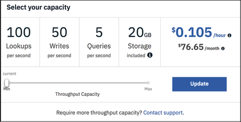

---

copyright:
  years: 2015, 2018
lastupdated: "2018-10-24"

---

{:new_window: target="_blank"}
{:shortdesc: .shortdesc}
{:screen: .screen}
{:codeblock: .codeblock}
{:pre: .pre}
{:tip: .tip}

<!-- Acrolinx: 2017-05-10 -->

# 가격
{: #pricing}

{{site.data.keyword.cloudantfull}}에서는 인스턴스에 할당된 각 초당 검색, 쓰기 및 조회의 예약된 수를
의미하는 프로비저닝된 처리량 용량을 줄이거나 늘이도록 튜닝하는 것을
허용합니다. 처리량 용량 레벨은 최대 사용량 레벨입니다. 예약된 용량을 초과하려고 시도하면
애플리케이션이 프로비저닝된 처리량 용량 허용량을 초과하려고 시도 중임을 표시하는 HTTP 429 상태 코드를
수신하게 됩니다.

## 가격 예제 
{: #pricing-examples}

{{site.data.keyword.cloudant_short_notm}}를 사용하여 모바일 앱을
빌드 중이며 아직 필요한 용량을 모른다고 가정합니다. 이 경우, 최소한의
프로비저닝된 처리량 용량으로 시작하여 시간의 경과에 따라 필요한 애플리케이션 사용량만큼
증가시키도록 권장합니다. {{site.data.keyword.cloudant_short_notm}}는
시간에 비례하여 청구하며 프로비저닝된 처리량 용량을 변경한다고 해서 시스템 중단이 발생하지는 않습니다. 

모바일 앱 예제의 경우, 초당 100회의 검색, 초당 50회의 쓰기 및 초당 5회의 조회를 포함하는
표준 플랜에 대한 최소한의 프로비저닝된 처리량 용량으로 시작하십시오. 이 용량에 대한 비용은 시간당 0.105 달러입니다. 초당 100회의 검색, 초당 50회의 쓰기 및 초당 5회의 조회는
프로비저닝된 처리량 용량의 한 블록입니다. 확장 또는 축소가 필요한 하는 경우, 이러한 용량 블록 단위로 스케일링할 수 있습니다. 인스턴스에
표준 플랜에 포함된 20GB의 스토리지 미만인 인스턴스가 있는 경우, 스토리지 비용이 발생하지 않습니다. {{site.data.keyword.cloudant_short_notm}} 대시보드의 > 계정 > 용량
탭에서 프로비저닝된 처리량 용량 설정은 다음 화면 캡처와 같이 표시됩니다.

용량 슬라이더는 시간당 0.105달러(미국 달러 단위)에 초당 100회의 검색, 초당 50회의 쓰기 및 초당 5회의 조회라는
프로비저닝된 처리량 용량의 시간당 비용을 표시합니다. 슬라이더는 월별 약 76.65달러의 비용을 표시합니다. 월별 금액은
월별 평균 730시간을 기반으로 하여 추정됩니다. 매월 비용은 월별 시간 수에 따라 약간씩 다를 수 있습니다.

견적 예제: 

- 초당 100회의 검색, 초당 50회의 쓰기 및 초당 5회의 조회 프로비저닝된 처리량 용량의 1블록에 대한 시간당 0.105달러 * 730시간(한 달 내의 대략적인 시간 수)
- 총계 = 76.65달러

검색, 쓰기 및 조회는 따로 스케일링될 수 없습니다. 이 슬라이더를 사용하여 애플리케이션에 필요한 초당 검색, 초당 쓰기 또는 초당 조회의 최대 한계를 기준으로 하여 프로비저닝된 처리량 용량의 블록 수를 선택하십시오. 예를
들어, 애플리케이션에 초당 1,000회의 검색이 필요한 경우, 쓰기 또는 조회에 대해서는 해당 수가 필요하지 않더라도
슬라이더를 사용하여 초당 1,000회의 검색, 초당 500회의 쓰기 및 초당 50회의 조회를 제공하는 용량을 선택하십시오.

1,000회의 검색, 500회의 쓰기 및 50회의 조회라는 프로비저닝된 처리량 용량에 대한 월별 총 비용을 어떻게 추정합니까? 

- 초당 100회의 검색, 초당 50회의 쓰기 및 초당 5회의 조회 프로비저닝된 처리량 용량의 10블록에 대한 시간당 0.105달러 * 730시간(한 달 내의 대략적인 시간 수)
- 또는 슬라이더가 초당 1,000회의 검색, 초당 500회의 쓰기 및 초당 50회의 조회의 프로비저닝된 처리량 용량이 1.050달러/시간 * 730시간임을 표시합니다.
- 총계 = 766.50달러

## 데이터 사용량 
{: #data-usage}

데이터 초과량에 대한 가격은 어떻게 이루어집니까?

플랜 | 포함된 스토리지 | 초과량 한계
-----|------------------|--------------
Lite |1GB |  1GB 한계 미만이 되도록 충분한 데이터를 삭제할 때까지 새 데이터를 쓰지 못하도록 계정이 차단됩니다. 또는 더 높은 플랜으로 업그레이드하십시오.
표준 |20GB | 추가 스토리지는 매시간 GB당 0.0014달러의 비용이 발생하며 이는 매월 약 1달러/GB입니다.

데이터가 어떤 방법으로 {{site.data.keyword.cloud_notm}} 사용량 대시보드에 표시됩니까?

이 보기는 이 월 동안 발생한 총 사용량을 표시하므로 해당 월에 대한 지금까지의 비용만 표시합니다. 추정된 총계는 월에 대한 지금까지의 청구만 반영합니다. 월의 마지막에
총 월별 청구인 월에 대한 평균을 볼 수 있습니다. `STORAGE_MANAGED_PER_MONTH` 필드는
포함된 20GB를 초과하는 금액에 대해서만 표시하므로 다음 예제에서는
계정 내에 약 40GB의 총 데이터가 표시됩니다.  

20GB 미만의 스토리지를 사용하는 경우, 한계를 초과하지 않았으므로 디스플레이에 0GB가 표시됩니다.
