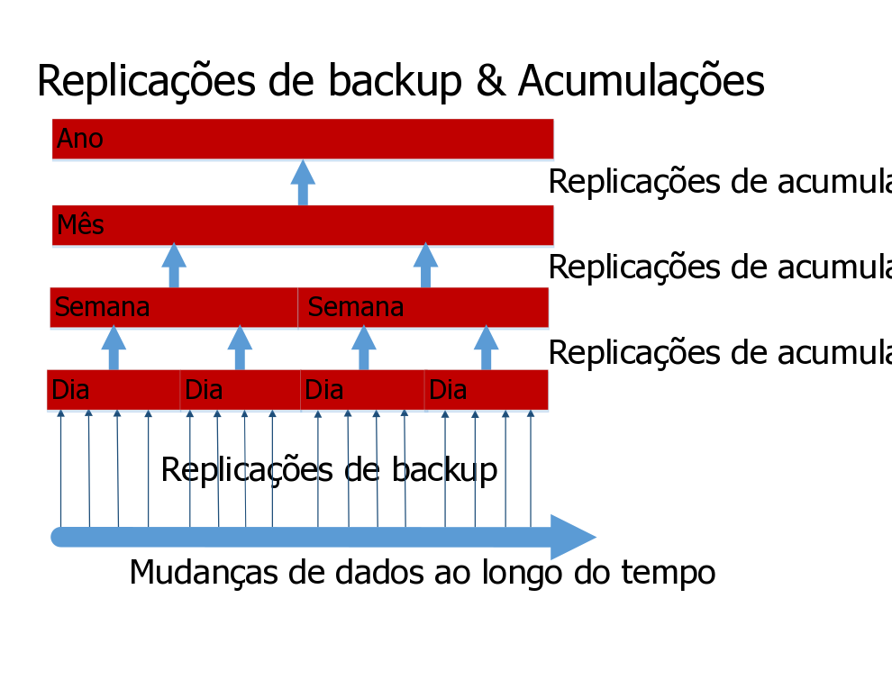

---

copyright:
  years: 2015, 2017
lastupdated: "2017-05-04"

---

{:new_window: target="_blank"}
{:shortdesc: .shortdesc}
{:screen: .screen}
{:codeblock: .codeblock}
{:pre: .pre}

# Fazer backup dos dados

>   **Nota**: este guia se refere a um recurso de backup incremental diário *descontinuado*,
disponível anteriormente apenas por solicitação para clientes corporativos.
Para obter orientação de backup atual,
veja o guia [Recuperação de desastre e backup](disaster-recovery-and-backup.html).

Este recurso:
-   Não fica ativado por padrão.
-   Está disponível apenas para clientes corporativos, que devem solicitá-lo especificamente.
-   Deve ser configurado explicitamente antes de ficar operacional.
-   Esta sujeito a [limitações conhecidas](#known-limitations).
-   Não é aplicável ao [Cloudant Local ](https://www.ibm.com/support/knowledgecenter/SSTPQH_1.0.0/com.ibm.cloudant.local.doc/SSTPQH_1.0.0_welcome.html){:new_window}.
Para obter mais informações,
entre em contato com a [equipe de suporte do IBM Cloudant ](mailto:support@cloudant.com){:new_window}.

>   **Nota**: o recurso de backup incremental diário não é aplicável para o
    [Cloudant Local ](https://www.ibm.com/support/knowledgecenter/SSTPQH_1.0.0/com.ibm.cloudant.local.doc/SSTPQH_1.0.0_welcome.html){:new_window}.
Para fazer backup dos dados no Cloudant Local,
use a [replicação](../api/replication.html) para fazer uma cópia de seu banco de dados.

Para assegurar alta disponibilidade,
o {{site.data.keyword.cloudant}} cria três cópias de cada documento
e as armazena em três servidores diferentes em um cluster.
Essa prática é o padrão para todos os usuários do Cloudant.
Mesmo quando seus dados são replicados em triplicidade,
ainda é importante fazer backup deles.

Por que fazer backup é importante?
Em geral,
você poderia perder o acesso aos dados de várias maneiras.
Por exemplo,
se um furacão destruir seu data center e os três nós estiverem nesse local,
você perderá os dados.
É possível evitar a perda dos dados em um desastre replicando-os para um
cluster (dedicado ou com diversos locatários) em uma localização geográfica diferente.
No entanto,
se um aplicativo com falha excluir ou sobrescrever os dados no banco de dados,
os dados duplicados não serão úteis.

Ter um backup testado
abrangente permite responder à pergunta a seguir com confiança:
"Como podemos restaurar dados em caso de perda ou dano?"

Com o Cloudant,
os clientes corporativos podem ter backups incrementais diários.

Se você não for um cliente corporativo
ou se desejar criar seu próprio mecanismo de backup,
considere [usar a Replicação para executar backups](disaster-recovery-and-backup.html).

>   **Nota**: o backup incremental diário para clientes corporativos é atualmente um recurso *Beta*.
Ele não fica ativado por padrão.

Os backups incrementais diários ou 'deltas' permitem a comparação de documentos
e restauração mais fácil de documentos únicos.
Em intervalos regulares,
que podem ser configurados,
os deltas diários menores são acumulados em deltas semanais.
Da mesma forma,
os deltas semanais são acumulados em deltas mensais
e os deltas mensais em anuais.
Esse processo de acumulação de deltas é um compromisso pragmático entre
ser capaz de restaurar exatamente a versão correta de um documento
e requerer muito espaço de armazenamento.

O recurso de backup permite restaurar documentos individuais manualmente.
Se você desejar restaurar um banco de dados inteiro,
por exemplo, como parte de um cenário de recuperação de desastre,
será possível entrar em contato com a equipe de suporte e ter seus dados restaurados para um dia, uma semana,
um mês ou um ano
específico,
sujeito aos deltas que estiverem disponíveis.

Mais informações sobre como o Cloudant faz backup dos dados são fornecidas no restante deste tópico.
Para obter assistência adicional
ou para solicitar que o backup de dados seja ativado,
entre em contato com a equipe de suporte do Cloudant:
[support@cloudant.com ](mailto:support@cloudant.com){:new_window}.

>   **Nota**: o recurso de backup do Cloudant está disponível somente para clientes corporativos.

>   **Nota**: por padrão,
    documentos `_design` não são submetidos a backup,
para que os índices _não_ sejam construídos nos bancos de dados de backup incremental.
Se você precisar de backups dos documentos `_design`,
deverá mantê-los em sua ferramenta de controle de versão preferencial.

## Conceitos

É útil entender os termos a seguir ao se referir a conceitos de backup:

Termo                 | Significado
---------------------|--------
Limpeza de backup    | Quando um banco de dados delta é acumulado, ele é removido após um período configurável. Isso permite balancear a retenção de dados em uma granularidade alta com relação ao custo de armazenamento.
Acumulação de backup | Os backups diários são combinados em bancos de dados acumulados semanalmente. Eles combinam os deltas diários em um backup mais grosso (menos granular). Da mesma forma, bancos de dados semanais são acumulados em bancos de dados mensais e bancos de dados mensais em bancos de dados anuais.
Execução de backup   | Para um período de backup, o banco de dados de origem é replicado usando os valores de sequência para determinar os documentos que mudaram durante o período de backup. Na conclusão, essa replicação é chamado de backup diário.
Backup de linha de base| Uma coleção de documentos, com os quais um banco de dados delta pode ser comparado.
Backup diário        | Veja Execução de backup.
Delta diário         | Outro nome para um backup diário.
Banco de dados delta | A coleção de documentos que foram mudados em um período de tempo (o 'delta').
Alta/baixa granularidade| Isso indica quão precisamente é possível especificar o período de mudança de um documento. Uma acumulação de alta granularidade tem uma escala de tempo curta para o período de mudança, por exemplo, um dia no caso de um backup diário. Uma acumulação de baixa granularidade tem uma escala de tempo longa para o período de mudança, por exemplo, um ano no caso de um backup anual.
Backup incremental   | A coleção de documentos que foram mudados no banco de dados desde o último backup.
Acumular             | Agregar uma coleção de backups incrementais em um backup de granularidade mais baixa, por exemplo, agregar os backups diários de uma semana em um único backup 'semanal'.

## Backups incrementais

A primeira etapa na ativação de backups incrementais é executar um backup completo do banco de dados inteiro.
Isso fornece uma 'linha de base' para os backups incrementais subsequentes.

Todos os dias,
após o primeiro backup de 'linha de base',
um backup
incremental diário é executado.
Esse backup incremental diário contém apenas os dados que foram mudados no banco de dados desde o último backup.
O backup diário é o 'delta diário'.

Como parte da solicitação para ativar backups de dados,
é possível especificar um horário do dia para execução do backup.
O delta diário é criado todos os dias,
no momento especificado.

## Acumulações

Uma acumulação combina backups diários em bancos de dados
acumulados semanalmente.
Esses bancos de dados de acumulação combinam os deltas diários em uma fatia de tempo
mais grossa ou 'menos granular'.
Os bancos de dados semanais são acumulados em bancos de dados mensais
e os bancos de dados mensais são acumulados em bancos de dados anuais.



Ao solicitar que os backups sejam ativados,
será necessário especificar quantos deltas diários manter.
Quando esse número for atingido,
o delta diário mais antigo será acumulado no banco de dados semanal mais recente.
Depois disso,
os bancos de dados semanais serão acumulados para criar os bancos de dados mensais
e assim por diante.

Quando os bancos de dados delta tiverem sido acumulados,
eles serão removidos para liberar espaço de armazenamento.

## Restaurações

Quando você tiver backups para um banco de dados,
será possível visualizar documentos individuais dentro desse banco de dados
e também ver as mudanças feitas nesse documento.
Também será possível restaurar o documento para a versão que era atual em uma data específica,
se ela estiver disponível dentro da granularidade do delta.

>   **Nota**: os documentos devem estar estáticos antes da restauração do backup.
Ou seja, o documento não deve estar recebendo mudanças e atualizações constantemente.

Para restaurações mais complexas,
como uma restauração completa do banco de dados,
solicite assistência do [suporte do Cloudant ](mailto:support@cloudant.com){:new_window}.

## Usando o Painel

Os clientes corporativos podem revisar o status e o histórico de backups usando o Painel do Cloudant.

As tarefas que podem ser executadas incluem:

-   Visualizar o status do último backup,
incluindo sua data e hora.
-   Visualizar uma lista de versões de documentos de backup por data e hora.
-   Visualizar um documento atual e a diferença entre ele e qualquer versão submetida a backup.
-   Restaurar um documento de uma versão submetida a backup.

### Visualizando o status de backup do banco de dados


Ao selecionar a guia Banco de dados no Painel do Cloudant,
é possível ver uma coluna de status de backup de cada um dos bancos de dados.

### Visualizando o status de backup do documento


Em um banco de dados,
é possível visualizar o status de backup de um documento específico.
Para fazer isso,
verifique primeiro se há um ícone de backup
()
para se documento.
Isso mostra se o documento específico está incluído na tarefa de backup.

Ao selecionar o documento,
é possível ver uma guia de backup.


### Visualizando diferenças entre as versões de backup do documento e restaurando


Ao clicar na guia de backup de um documento,
será possível ver as diferenças entre a versão atual do documento
e qualquer outra versão submetida a backup.

Se você decidir que gostaria de restaurar uma versão de backup específica desse documento,
bastará selecionar a data do backup a ser restaurado
e, em seguida, clicar no botão 'Restaurar'.

>   **Nota**: os documentos devem estar em um estado estável antes de serem restaurados do backup.
Ou seja,
o documento não deve estar recebendo mudanças e atualizações constantemente.

## Usando a API

Várias chamadas API de REST estão disponíveis para trabalhar com o recurso de backup do Cloudant.

### Configuração da tarefa

A chamada `task` obtém configuração de tarefa de backup para o usuário.

É possível especificar o formato usado na resposta usando o parâmetro `format`.

_Exemplo de solicitação da configuração de tarefa de backup para o usuário,
retornando os resultados em um formato de lista (padrão), usando HTTP:_

```http
GET /_api/v2/backup/task HTTP/1.1
```
{:codeblock}

_Exemplo de solicitação da configuração de tarefa de backup para o usuário,
retornando os resultados em um formato de lista (padrão), usando a linha de comandos:_

```sh
curl https://$ACCOUNT.cloudant.com/_api/v2/backup/task \
    -X GET
```
{:codeblock}

_Exemplo de solicitação da configuração de tarefa de backup para o usuário,
retornando os resultados em um formato de mapeamento, usando HTTP:_

```http
GET /_api/v2/backup/task?format=mapping HTTP/1.1
```
{:codeblock}

_Exemplo de solicitação da configuração de tarefa de backup para o usuário,
retornando os resultados em um formato de mapeamento, usando a linha de comandos:_

```sh
curl https://$ACCOUNT.cloudant.com/_api/v2/backup/task?format=mapping \
     -X GET
```
{:codeblock}

O formato de resposta padrão é uma lista.
É possível solicitar esse formato diretamente usando o parâmetro `...backup/task?format=list`.
A resposta contém uma lista simples das tarefas de backup definidas para o usuário.

Por exemplo,
você poderia solicitar uma resposta no formato de lista usando um dos comandos a seguir:

```http
https://$ACCOUNT.cloudant.com/_api/v2/backup/task

https://$ACCOUNT.cloudant.com/_api/v2/backup/task?format=list
```
{:codeblock}

_Exemplo de resposta depois de uma solicitação no formato de lista:_

```json
{
    "rows": [
        {
            "username": "$ACCOUNT",
            "task": "backup-0d0b0cf1b0ea42179f9c082ddc5e07cb",
            "source_db": "backmeup",
            "latest_completion": null
        },
        {
            "username": "$ACCOUNT",
            "task": "backup-d0ea6e8218074699a562af543db66615",
            "source_db": "backuptest",
            "latest_completion": "2016-01-17T05:57:44+00:00"
        },
        {
            "username": "$ACCOUNT",
            "task": "backup-24cd8359b94640be85b7d4071921e781",
            "source_db": "taskdb",
            "latest_completion": "2016-01-17T00:01:04+00:00"
        }
    ]
}
```
{:codeblock}

Uma resposta mais abrangente está disponível no formato de mapeamento.
É possível solicitar esse formato diretamente usando o parâmetro `...backup/task?format=mapping`.

Por exemplo, você poderia solicitar uma resposta no formato de mapeamento usando o comando a seguir:

```http
https://$ACCOUNT.cloudant.com/_api/v2/backup/task?format=mapping
```
{:codeblock}

_Exemplo de resposta depois de uma solicitação no formato de mapeamento:_

```json
{
    "backmeup": {
        "username": "$ACCOUNT",
        "task": "backup-0d0b0cf1b0ea42179f9c082ddc5e07cb",
        "source_db": "backmeup",
        "latest_completion": null
    },
    "backuptest": {
        "username": "$ACCOUNT",
        "task": "backup-d0ea6e8218074699a562af543db66615",
        "source_db": "backuptest",
        "latest_completion": "2016-01-17T05:57:44+00:00"
    },
    "taskdb": {
        "username": "$ACCOUNT",
        "task": "backup-24cd8359b94640be85b7d4071921e781",
        "source_db": "taskdb",
        "latest_completion": "2016-01-17T00:01:04+00:00"
    }
}
```
{:codeblock}

### Determinando tarefas de backup para bancos de dados específicos

O parâmetro `databases` para a solicitação `task` é usado
para localizar quais tarefas de backup estão associadas a um banco de dados especificado.

A resposta lista os detalhes da tarefa de backup para o banco de dados identificado no campo `source_db`.
A `task` identificada pode ser usada em outras chamadas API de backup,
como a [listagem de banco de dados](#list-of-databases).

_Exemplo de comando para localizar tarefas de backup para os bancos de dados `backuptest` e `taskdb`, usando HTTP:_

```http
GET /_api/v2/backup/task?databases=backuptest,taskdb HTTP/1.1
```
{:codeblock}

_Exemplo de comando para localizar tarefas de backup para os bancos de dados `backuptest` e `taskdb`, usando a linha de comandos:_

```sh
curl https://$ACCOUNT.cloudant.com/_api/v2/backup/task?databases=backuptest,taskdb \
    -X GET
```
{:codeblock}

_Exemplo de resposta para localizar tarefas de backup para bancos de dados específicos:_

```json
{
    "rows": [
        {
            "username": "$ACCOUNT",
            "task": "backup-d0ea6e8218074699a562af543db66615",
            "source_db": "backuptest",
            "latest_completion": "2016-01-17T05:57:44+00:00"
        },
        {
            "username": "$ACCOUNT",
            "task": "backup-24cd8359b94640be85b7d4071921e781",
            "source_db": "taskdb",
            "latest_completion": "2016-01-17T00:01:04+00:00"
        }
    ]
}
```
{:codeblock}

### Lista de bancos de dados

A solicitação `monitor` obtém uma lista dos bancos de dados criados pela tarefa de backup `$TASKNAME`,
que também contém o documento `$DOCID`.

A solicitação suporta um argumento opcional: `include_docs`.
O valor padrão é `false`.
Se configurada como `true`,
a solicitação `monitor` retornará o conteúdo completo do documento para cada banco de dados de backup que contiver `$DOCID`.

_Recuperando a lista de bancos de dados criados por uma tarefa de backup, que contém um documento específico, usando HTTP:_

```http
GET /_api/v2/backup/monitor/$TASKNAME/$DOCID?include_docs=true HTTP/1.1
```
{:codeblock}

_Recuperando a lista de bancos de dados criados por uma tarefa de backup, que contém um documento específico, usando a linha de comandos:_

```sh
curl https://$ACCOUNT.cloudant.com/_api/v2/backup/monitor/$TASKNAME/$DOCID?include_docs=true \
    -X GET
```
{:codeblock}

### Restaurar um documento

A chamada `restore` substitui um documento,
identificado por `$DOCID`,
de um banco de dados de origem.
O banco de dados de origem é identificado pelo `$TASKNAME`.
O `$TASKDATE` é o registro de data e hora do backup específico
e especifica quando o backup foi executado.
O `$FREQUENCY` é um dos quatro valores a seguir:
-   `"daily"`
-   `"weekly"`
-    `"monthly"`
-   `"yearly"`

>   **Nota**: os documentos devem estar em um estado estável antes de serem restaurados do backup.
Ou seja,
o documento não deverá estar recebendo mudanças e atualizações enquanto a restauração estiver em andamento.

_Exemplo de solicitação para restaurar um documento, usando HTTP:_

```http
POST /_api/v2/backup/restore/document --data=@RESTORE.json HTTP/1.1
Content-Type: application/json
```
{:codeblock}

_Exemplo de solicitação para restaurar um documento da versão mais recente retida em um banco de dados de backup específico, usando a linha de comandos:_

```sh
curl https://$ACCOUNT.cloudant.com/_api/v2/backup/restore/document --data=@RESTORE.json \
    -X POS \
    -H "Content-Type: application/json" \
    -d "$JSON"
```
{:codeblock}

_Exemplo de um documento JSON solicitando que um documento seja restaurado
da versão mais recente retida em um banco de dados de backup específico:_

```json
{
    "doc_id": $DOCID,
    "task_name": $TASKNAME,
    "task_date": $TASKDATE,
    "frequency": $FREQUENCY
}
```
{:codeblock}

## Como o backup usando replicação incremental funciona

Uma forma muito simples de fazer backup é [replicar](../api/replication.html) o banco de dados para um banco de dados de backup com data.

Esse método funciona e é fácil de executar.
Mas se o banco de dados for grande e você precisar de backups para múltiplos momentos,
por exemplo, sete backups diários e quatro semanais,
você terminará armazenando uma cópia completa de todos os documentos em cada novo banco de dados de backup.
É provável que isso exigirá muita espaço de armazenamento.

Backups incrementais são uma boa solução para armazenar somente os documentos que foram mudados desde o último backup.

Inicialmente,
você executa um backup do banco de dados inteiro.
Após o primeiro backup,
você executará backups
incrementais regulares,
fazendo backup apenas do que tiver sido mudado no banco de dados desde o último backup.
Geralmente esses backups incrementais ocorrem uma vez por dia,
portanto, essa replicação é um backup diário.

Os backups incrementais salvam apenas o delta entre os backups.
Em intervalos regulares,
o banco de dados de origem é replicado para um banco de dados de destino.
A replicação usa valores de sequência para identificar os documentos mudados durante o período de intervalo.

A operação de backup usa a replicação para obter e armazenar um ponto de verificação.
Esse ponto de verificação é outro banco de dados com um nome interno.

O processo de replicação para um banco de dados começa localizando o valor do parâmetro `since_seq`.
O parâmetro indica onde a última replicação foi concluída.

>   **Nota**: por definição, o uso da opção `since_seq` desativa o recurso de ponto de verificação de replicação normal. Somente use `since_seq` com cuidado. 

As etapas a seguir descrevem como os backups incrementais são criados:

1.  [Localizar o ID do documento de ponto de verificação da última replicação.](#find-the-id-of-the-checkpoint-document-for-the-last-replication)
2.  [Obter o valor `recorded_seq`.](#get-the-recorded_seq-value)
3.  [Executar um backup incremental.](#run-an-incremental-backup)

### Localizar o ID do documento de ponto de verificação da última replicação

O valor checkpoint ID é armazenado no campo `_replication_id`
do documento de replicação no banco de dados `_replicator`.

_Exemplo de solicitação para obter o ID do ponto de verificação do último backup incremental
para um banco de dados chamado `original`, usando HTTP:_

```http
GET /_replicator/original HTTP/1.1
```
{:codeblock}

_Exemplo de solicitação para obter o ID do ponto de verificação do último backup incremental
para um banco de dados chamado `original`, usando a linha de comandos:_

```sh
replication_id=$(curl "${url}/_replicator/original" | jq -r '._replication_id')
```
{:pre}

### Obter o valor `recorded_seq`

Depois de obter o ID do ponto de verificação,
você o usará para obter o valor `recorded_seq` do
primeiro elemento da matriz do histórico no documento `/_local/${replication_id}` no banco de dados original.

_Exemplo de como obter o valor `recorded_seq` de um banco de dados chamado `original`, usando HTTP:_

```http
GET /original/_local/${replication_id} HTTP/1.1
```
{:codeblock}

_Exemplo de como obter o valor `recorded_seq` de um banco de dados chamado `original`, usando a linha de comandos:_

```sh
recorded_seq=$(curl "${url}/original/_local/${replication_id}" | jq -r '.history[0].recorded_seq')
```
{:pre}

### Executar um backup incremental

Agora que você tem o ID de ponto de verificação e `recorded_seq`,
será possível iniciar o novo backup incremental.

_Exemplo de como iniciar um novo backup incremental para um banco de dados incremental chamado `newbackup`, usando HTTP:_

```http
PUT /_replicator/newbackup HTTP/1.1
Content-Type: application/json
```
{:codeblock}

_Exemplo de como iniciar um novo backup incremental para um banco de dados incremental chamado `newbackup`, usando a linha de comandos:_

```sh
curl -X PUT "${url}/_replicator/newbackup" -H "${ct}" -d @newbackup.json
```
{:codeblock}

_Exemplo de arquivo JSON especificando um backup incremental:_

```json
{
    "_id": "newbackup",
    "source": "${url}/original",
    "target": "${url}/newbackup",
    "since_seq": "${recorded_seq}"
}
```
{:codeblock}

## Limitações Conhecidas

>   **Nota**: o backup incremental diário para clientes corporativos é atualmente um recurso Beta.
Ele não fica ativado por padrão.

-   O IBM Cloudant Backup
e os recursos de restauração associados
se baseiam na tecnologia de replicação subjacente.
Fatores que afetem
ou até mesmo interrompam
a replicação afetarão ou até mesmo paralisarão os processos de backup ou restauração.
-   Os processos de backup e restauração poderiam levar um período de tempo significativo para bancos de dados grandes,
por exemplo, acima de 100 GB de tamanho.
Isso se aplica ao backup inicial,
que poderia levar alguns dias para ser concluído para um banco de dados grande.
Da mesma forma,
o processo de restauração poderia levar de algumas horas a vários dias,
dependendo novamente do tamanho do banco de dados.
-   Para backups diários grandes,
é possível que o processo de backup não possa ser concluído em um dia (24 horas).
O processo de backup normalmente é executado até a conclusão,
portanto, ele incluiria mudanças incrementais por mais de um dia.
-   Atualmente não há nenhum suporte para fazer backup de uma conta de usuário completa.
Como alternativa,
deve-se especificar cada um dos bancos de dados de uma conta do usuário que você deseja que seja ativado para backup ou restauração.
Atualmente,
há um limite de 50 bancos de dados ativados para backup dentro da conta de usuário de qualquer pessoa.
-   O recurso IBM Cloudant Backup não suporta atualmente
backup ou restauração para [documentos de design](../api/design_documents.html).
Se você precisar de backups de documentos de design,
deverá mantê-los em sua ferramenta de controle de versão preferencial.
-   Atualmente,
o banco de dados de destino para executar uma restauração do banco de dados deve ser diferente do banco de dados de origem original.
