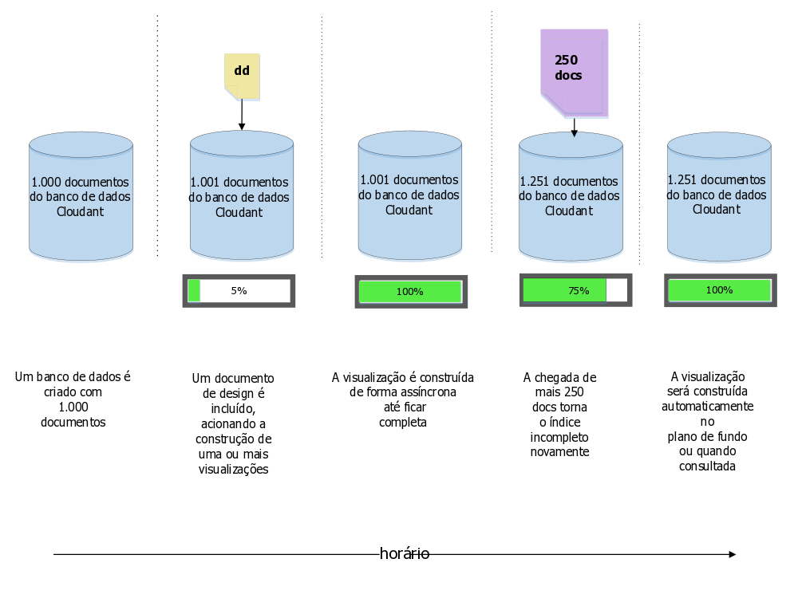
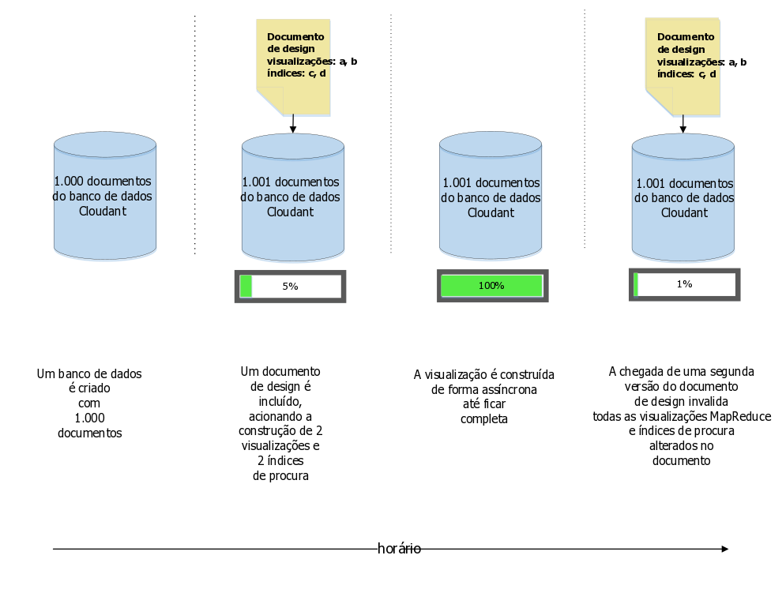
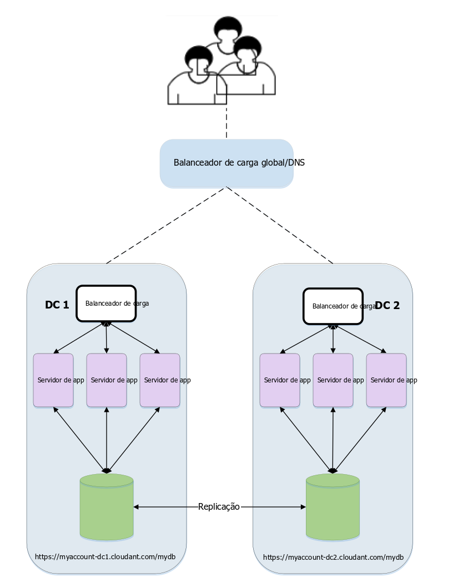

---

copyright:
  years: 2015, 2017
lastupdated: "2017-01-06"

---

{:new_window: target="_blank"}
{:shortdesc: .shortdesc}
{:screen: .screen}
{:codeblock: .codeblock}
{:pre: .pre}

# Gerenciamento do documento de design

*Artigo fornecido por Glynn Bird, advogado geral no IBM Cloudant,
[glynn@cloudant.com ](mailto:glynn@cloudant.com){:new_window}*

O armazenamento de dados JSON escalável do Cloudant possui vários mecanismos de consulta,
todos os quais geram índices que são criados e mantidos separadamente para os dados principais.
A indexação não é executada imediatamente quando um documento é salvo.
Em vez disso,
ela é planejada para acontecer posteriormente, fornecendo um
rendimento de gravação mais rápido e sem bloqueio.

-   As visualizações MapReduce são índices para o conjunto de dados
com pares chave-valor armazenados em uma BTree para recuperação eficiente por chave ou intervalo de chaves
-   Os índices de procura são construídos usando o Apache Lucene para permitir a procura de texto livre,
consultas ad hoc complexas e com facetas

Os [índices de procura](../api/search.html) e as [visualizações MapReduce](../api/creating_views.html) do Cloudant
são configurados pela inclusão de Documentos de design em um banco de dados.
Os Documentos de design são documentos JSON que contêm as instruções sobre como a visualização ou o índice devem ser construídos.
Vamos observar um exemplo simples.
Suponha que tenhamos uma coleção simples de documentos de dados,
semelhante ao exemplo a seguir.

_Exemplo de um documento de dados simples:_

```json
{
    "_id": "23966717-5A6F-E581-AF79-BB55D6BBB613",
    "_rev": "1-96daf2e7c7c0c277d0a63c49b57919bc",
    "doc_name": "Markdown Reference",
    "body": "Lorem Ipsum",
    "ts": 1422358827
}
```
{:codeblock}

Cada documento de dados inclui um nome,
um corpo
e um registro de data e hora.
Desejamos criar uma [visualização MapReduce](../api/creating_views.html) para classificar nossos documentos pelo registro de data e hora.

Podemos fazer isso criando uma função de Mapa,
semelhante ao exemplo a seguir.

_Exemplo de função de mapa retornando o campo do registro de data e hora de um documento, se presente:_

```javascript
function(doc) {
    if (doc.ts) {
        emit( doc.ts, null);
    }
}
```
{:codeblock}

A função emite o registro de data e hora do documento para que possamos usá-lo como a chave para o índice;
como não estamos interessados no valor no índice,
`null` é emitido.
O efeito é fornecer um índice ordenado pelo tempo para o conjunto de documentos.

Vamos chamar essa visualização de "`by_ts`"
e colocá-la em um Documento de design chamado "`fetch`",
como no exemplo a seguir.

_Exemplo de documento de design que define uma visualização usando uma função de mapa:_

```json
{
    "_id": "_design/fetch",
    "views": {
      "by_ts": {
        "map": "function(doc) {
          if (doc.ts) {
            emit( doc.ts, null);
          }
        }"
      }
    },
    "language": "javascript"
}
```
{:codeblock}

O resultado é que nosso código de mapa foi transformado em uma sequência compatível com JSON
e incluído em um Documento de design.

Depois que o Documento de design é salvo,
o Cloudant aciona os processos do lado do servidor para construir a visualização `fetch/by_ts`.
Ele faz isso ao iterar sobre cada documento no banco de dados
e ao enviar cada um para a função de mapa Javascript.
A função retorna o emitido par chave-valor emitido.
Conforme a iteração continua,
cada par chave-valor é armazenado em um índice de árvore B.
Depois que o índice for construído pela primeira vez,
a reindexação subsequente será executada apenas em documentos novos e atualizados.
Os documentos excluídos são desindexados.
Esse processo de economia de tempo é conhecido como *MapReduce incremental*,
conforme mostrado no diagrama a seguir:



Vale a pena lembrar neste momento que:

-   A construção de um índice acontece de forma assíncrona.
O Cloudant confirma que o nosso Documento de design foi salvo,
mas para verificar o progresso na construção de nosso índice,
temos que pesquisar o terminal [`_active_tasks`](../api/active_tasks.html) do Cloudant.
-   Quanto mais dados tivermos,
mais tempo levará para o índice ficar pronto.
-   Enquanto a construção do índice inicial estiver em andamento,
_as consultas feitas nesse índice serão bloqueadas_.
-   Consultar uma visualização acionará o 'mapeamento' de quaisquer documentos que ainda não tenham sido indexados incrementalmente.
Isso assegura que tenhamos uma visualização atualizada dos dados.
Veja a discussão do [parâmetro '`stale`'](#stale) a seguir
para obter exceções a essa regra.

## Múltiplas visualizações no mesmo documento de design

Se definirmos várias visualizações no mesmo documento de design,
elas serão construídas de forma eficiente ao mesmo tempo.
Cada documento é lido somente uma vez
e passado pela função de Mapa de cada visualização.
O aspecto negativo dessa abordagem é que modificar um documento de design
_invalida todas as visualizações MapReduce existentes_ definidas nesse documento,
mesmo se algumas das visualizações permanecerem inalteradas. 

Se as visualizações MapReduce tiverem que ser alteradas de forma independente uma da outra,
coloque suas definições em documentos de design separados. 

>   **Nota**: esse comportamento não se aplica a índices de procura do Lucene.
Eles podem ser alterados no mesmo documento de design
sem invalidar outros índices inalterados no mesmo documento.



## Gerenciando mudanças em um documento de design

Imagine que em algum momento no futuro decidamos mudar o design de nossa visualização.
Agora,
em vez de retornar o resultado real do registro de data e hora,
estamos apenas interessados na contagem de quantos documentos correspondem aos critérios.
Para conseguir isso,
a função de mapa permanece a mesma,
mas agora usamos uma _redução_ de "`_count`".
O efeito é que o nosso documento de design é semelhante ao exemplo a seguir.

_Exemplo de documento de design que usa uma função de redução:_

```json
{
    "_id": "_design/fetch",
    "_rev": "2-a2324c9e74a76d2a16179c56f5315dba",
    "views": {
        "by_ts": {
            "map": "function(doc) {
                if (doc.ts) {
                  emit( doc.ts, null);
                }
            }
        }",
        "reduce": "_count"
    },
    "language": "javascript"
}
```
{:codeblock}

Quando esse documento de design é salvo,
o Cloudant invalida completamente o índice antigo e começa a construir o novo índice do zero,
iterando sobre cada documento por vez.
Como com a construção original,
o tempo gasto depende de quantos documentos estão no banco de dados
e dos blocos de consultas recebidas nessa visualização até sua conclusão.

Mas há um problema...

Se tivermos um aplicativo que esteja acessando essa visualização _em tempo real_,
poderemos encontrar um dilema de implementação:

-   A versão 1 do nosso código,
que contava com o Documento de design original,
pode não funcionar mais porque a visualização antiga foi invalidada.
-   A versão 2 do nosso código,
que usa o novo Documento de design
não pode ser liberada imediatamente,
porque a nova visualização ainda não terá terminado a construção,
especialmente se houver muitos documentos no banco de dados.
-   Um problema mais sutil que afeta nosso código é que as versões 1 e 2 esperam diferentes dados de resultado da visualização:
a versão 1 espera uma lista de documentos correspondentes,
enquanto a versão 2 espera uma contagem 'reduzida' de resultados.

## Coordenando mudanças para Documentos de design

Há duas maneiras de lidar com esse problema de controle de mudança.

### Documentos de design com versão 

Uma solução é usar nomes de documentos de design com versão:

-   Nosso código é gravado inicialmente para usar uma visualização chamada `_design/fetchv1`.
-   Quando chegamos para liberar uma nova versão,
criamos uma nova visualização chamada `_design/fetchv2`
e consultamos a visualização para assegurar que ela comece a ser construída.
-   Nós pesquisamos `_active_tasks` até que o trabalho de construção do novo índice esteja concluído.
-   Agora estamos prontos para liberar o código que depende da segunda visualização.
-   Excluiremos `_design/fetchv1` quanto tivermos certeza de que não é mais necessário.

Usar documentos de design com versão é uma maneira simples de gerenciar o controle de mudança nos Documentos de design,
contanto que você se lembre de remover as versões mais antigas em uma data posterior.

### Documentos de design 'Mover e alternar'

Outra abordagem,
documentada [aqui ](http://wiki.apache.org/couchdb/How_to_deploy_view_changes_in_a_live_environment){:new_window},
conta com o fato de que o Cloudant reconhece quando ele tem dois documentos de design idênticos
e não perderá tempo e recursos reconstruindo visualizações que já tem.
Ou seja,
se pegarmos nosso documento de design `_design/fetch` e criarmos uma duplicata exata `_design/fetch_OLD`,
ambos os terminais funcionarão de forma intercambiável sem acionar qualquer reindexação.

O procedimento para alternar para a nova visualização é este:

1.  Crie uma cópia duplicada do documento de design que queremos mudar,
por exemplo, incluindo `_OLD` em seu nome:
`_design/fetch_OLD`.
2.  Coloque o documento de design novo ou 'recebido' no banco de dados,
usando um nome com o sufixo `_NEW`: `_design/fetch_NEW`.
3.  Consulte a visualização `fetch_NEW`
para assegurar-se de que ela comece a ser construída.
4.  Pesquise o terminal `_active_tasks` e aguarde até que o índice tenha concluído a construção.
5.  Coloque uma cópia duplicada do novo documento de design em `_design/fetch`.
6.  Exclua o Documento de design `_design/fetch_NEW`.
7.  Exclua o Documento de design `_design/fetch_OLD`.

## Conjunto de ferramentas Mover e alternar

Há um script Node.js da linha de comandos que automatiza o procedimento 'mover e alternar',
chamado '`couchmigrate`'.
Ele pode ser instalado como a seguir.

_Comando para instalar o script `couchmigrate` de Node.js:_

```sh
npm install -g couchmigrate
```
{:codeblock}

Para usar o script `couchmigrate`,
primeiro defina a URL da instância CouchDB/Cloudant configurando uma variável de ambiente chamada `COUCH_URL`.

_Definindo a URL de uma instância do Cloudant:_

```sh
export COUCH_URL=http://127.0.0.1:5984
```
{:codeblock}

A URL pode ser HTTP ou HTTPS
e pode incluir credenciais de autenticação.

_Definindo a URL da instância do Cloudant com credenciais de autenticação:_

```sh
export COUCH_URL=https://$ACCOUNT:$PASSWORD@$HOST.cloudant.com
```
{:codeblock}

Supondo que tenhamos um documento de design no formato JSON
armazenado em um arquivo,
poderemos então executar o comando de migração.

Neste exemplo,
`db` especifica o nome do banco de dados a ser mudado
e `dd` especifica o caminho para o nosso arquivo de Documento de design.

_Executando o comando `couchmigrate`:_

```sh
couchmigrate --db mydb --dd /path/to/my/dd.json
```
{:pre}

O script coordena o procedimento 'mover e alternar',
aguardando até que a visualização seja construída antes de retornar.
Se o documento de design recebido for o mesmo que o incumbente,
o script será retornado quase que imediatamente.

O código-fonte para o script está disponível aqui:
[https://github.com/glynnbird/couchmigrate ](https://github.com/glynnbird/couchmigrate){:new_window}.

<div id="stale"></div>

## O parâmetro '`stale`'

Se um índice estiver completo,
mas novos registros forem incluídos no banco de dados,
o índice será planejado para ser atualizado em segundo plano.
Este é o estado do banco de dados mostrado no diagrama a seguir:



Ao consultar a visualização, temos três opções:

-   O comportamento padrão é assegurar que o índice seja atualizado
com os documentos mais recentes no banco de dados,
antes de retornar a resposta.
Quando consultamos a visualização,
o Cloudant primeiro indexa os 250 novos documentos
e, em seguida, retorna a resposta.
-   Uma alternativa é incluir o parâmetro "`stale=ok`" na chamada API.
O parâmetro significa "retornar-me os dados já indexados,
não me importo com as atualizações mais recentes".
Ou seja,
quando você consulta a visualização com "`stale=ok`",
o Cloudant retorna a resposta imediatamente,
sem qualquer indexação adicional.
-   Uma segunda alternativa é incluir o parâmetro "`stale=update_after`" na chamada API.
O parâmetro significa "retornar-me os dados já indexados
_e_, em seguida, reindexar quaisquer novos documentos".
Ou seja,
quando você consulta a visualização com "`stale=update_after`",
o Cloudant retorna a resposta imediatamente
e, em seguida, planeja uma tarefa em segundo plano para indexar os novos dados.

A inclusão de "`stale=ok`" ou "`stale=update_after`" pode ser uma boa maneira de obter respostas mais rapidamente de uma visualização,
mas às custas de criação recente. 

>   **Nota**: o comportamento padrão distribui carga uniformemente entre nós no cluster do Cloudant.
Se você usar as opções alternativas `stale=ok` ou `stale=update_after`,
isso poderá favorecer um subconjunto de nós do cluster
para retornar resultados consistentes de todo o conjunto eventualmente consistente.
Isso significa que o parâmetro '`stale`' não é uma solução perfeita para todos os casos de uso.
No entanto,
ele poderá ser útil para fornecer respostas adequadas em conjuntos de dados de rápida mudança
se o seu aplicativo estiver satisfeito em aceitar os resultados antigos.
Se a taxa de mudança de seus dados for pequena,
incluir "`stale=ok`" ou "`stale=update_after`" não trará um benefício de desempenho
e poderá distribuir a carga irregularmente em clusters maiores.

Evite usar `stale=ok` ou `stale=update_after` sempre que possível.
O motivo é que o comportamento padrão fornece os dados mais novos
e distribui dados dentro do cluster.
Se for possível tornar um app cliente ciente de que há uma tarefa de processamento de dados grande em andamento
(durante uma atualização de dados em massa regular, por exemplo),
o app poderá alternar para `stale=ok` provisoriamente durante esses horários
e, então, reverter para o comportamento padrão, posteriormente.

>   **Nota**: a opção `stale` ainda está disponível,
mas as opções mais úteis `estable` e `update` estão disponíveis e devem ser usadas no lugar.
Para obter mais detalhes,
veja [Acessando uma visualização antiga](../api/using_views.html#accessing-a-stale-view).
