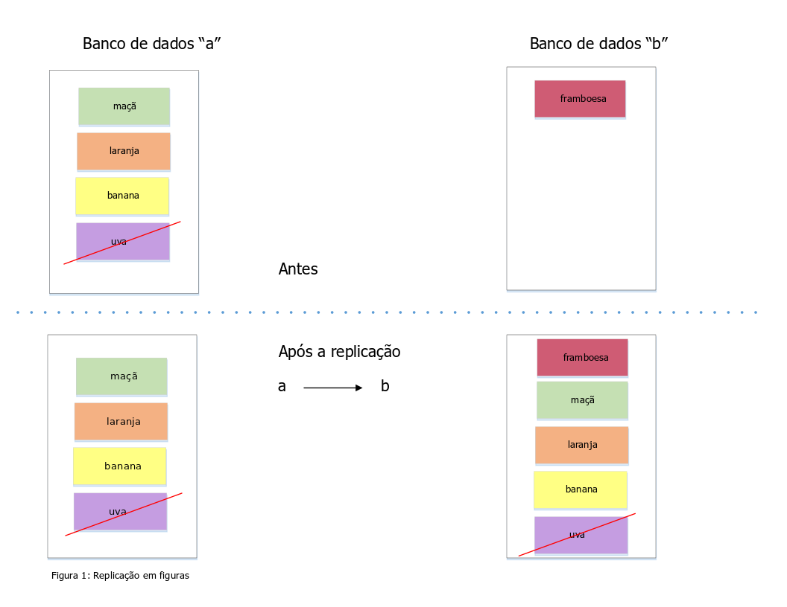
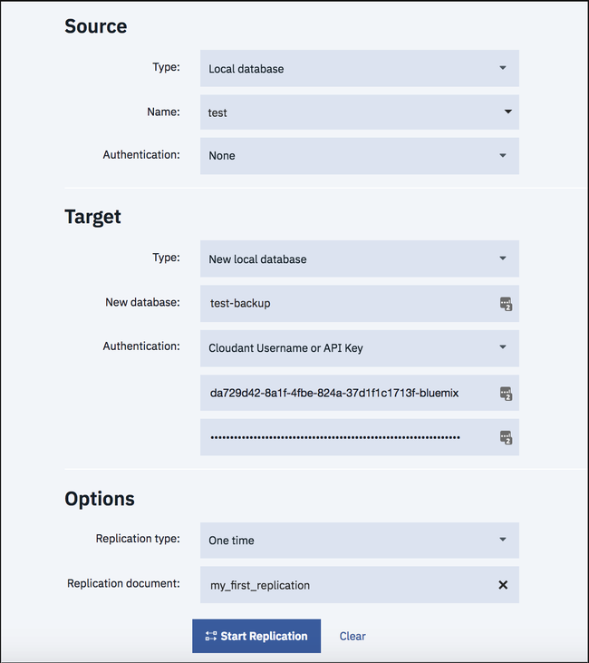
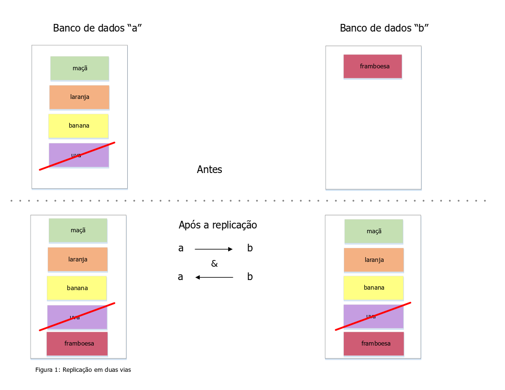

---

copyright:
  years: 2015, 2018
lastupdated: "2017-11-06"

---

{:new_window: target="_blank"}
{:shortdesc: .shortdesc}
{:screen: .screen}
{:codeblock: .codeblock}
{:pre: .pre}

<!-- Acrolinx: 2017-04-20 -->

# Replicação

Os dados podem ser copiados de um banco de dados para outro na mesma conta do {{site.data.keyword.cloudantfull}},
entre contas e entre data centers.
{:shortdesc}

Os dados podem até ser replicados para/de uma conta do {{site.data.keyword.cloudant_short_notm}} e um dispositivo móvel
usando [Sincronização do {{site.data.keyword.cloudant_short_notm}} ](https://cloudant.com/product/cloudant-features/sync/){:new_window}
ou [PouchDB ](http://pouchdb.com/){:new_window}.
A replicação pode ser executada em uma direção ou em ambas as direções,
como uma operação 'única' ou contínua
e pode ser finamente ajustada usando parâmetros.

O protocolo de replicação do {{site.data.keyword.cloudant_short_notm}} é compatível com um intervalo de outros bancos de dados e bibliotecas,
tornando-o um bom ajuste para Internet of Things (IoT) e aplicativos móveis.

Este guia apresenta as funções de replicação do {{site.data.keyword.cloudant_short_notm}},
discute casos de uso comuns
e mostra como fazer seu aplicativo replicar com sucesso.

## O que é replicação?

O {{site.data.keyword.cloudant_short_notm}} é um armazenamento de dados JSON distribuído com uma API HTTP.
O {{site.data.keyword.cloudant_short_notm}} pode ser executado como um serviço em múltiplas nuvens
ou em seu rack de servidor.
Os documentos são armazenados em bancos de dados e podem chegar a qualquer tamanho, pois o {{site.data.keyword.cloudant_short_notm}} fragmenta seus dados em vários nós.
A replicação é a cópia de dados de um banco de dados de origem para um banco de dados de destino.
Os bancos de dados de origem e de destino não precisam estar na mesma conta do {{site.data.keyword.cloudant_short_notm}}
ou ainda no mesmo data center.



A replicação é concluída quando a versão mais recente de cada documento na origem é transferida para o banco de dados de destino.
As transferências incluem novos documentos,
atualizações para documentos existentes
e exclusões.
Apenas a versão mais recente de um documento permanece após a replicação;
as versões mais antigas são omitidas.

O banco de dados de origem permanece inalterado por replicação,
separadamente dos dados de ponto de verificação que são gravados nele para permitir que replicações parciais continuem da última posição conhecida.
Os dados preexistentes no banco de dados de destino permanecem.

<div id="how-do-i-initiate-replication-via-the-dashboard-"></div>

## Como iniciar a replicação usando o Painel

O Painel do {{site.data.keyword.cloudant_short_notm}} fornece uma interface com o usuário conveniente para acionar a replicação.
Abra a guia Replicação do Painel do {{site.data.keyword.cloudant_short_notm}} e clique no botão de ação `Nova replicação`.
Preencha o formulário simples:



Usando o formulário,
defina os bancos de dados de origem e de destino e,
em seguida, clique em "`Replicate`".


O status de cada tarefa de replicação pode ser visto na seção "`All Replications`" do Painel.
Cada tarefa muda o estado de "`Triggered`" para "`Complete`" à medida que progride.


<div id="how-do-i-run-replication-across-different-cloudant-accounts-"></div>

## Como executar a replicação entre diferentes contas do {{site.data.keyword.cloudant_short_notm}}

A origem e o destino de uma replicação são URLs de bancos de dados {{site.data.keyword.cloudant_short_notm}},
conforme mostrado no exemplo a seguir.

_Exemplo de definição de URLs de origem e de destino para replicação:_

```json
{
    "source": "https://myfirstaccount.cloudant.com/a",
    "target": "https://mysecondaccount.cloudant.com/b"
}
```
{:codeblock}

A origem e o destino não precisam estar na mesma conta.
Os nomes dos bancos de dados de origem e de destino não precisam corresponder.
Deve-se estar autorizado a acessar a origem e o destino
e estar autorizado a gravar no destino.

<div id="do-i-run-replication-on-the-source-or-the-destination-"></div>

## A replicação é executada na origem ou no destino?

A replicação pode ser iniciada na extremidade de origem ou de destino.
Essa opção significa que é possível decidir se a conta A enviará dados por push para a conta B
ou a conta B puxará dados da conta A.
Em alguns casos,
talvez não seja possível executar a replicação em nenhuma das configurações,
por exemplo, quando uma conta estiver protegida por um firewall.
A replicação acontece por meio de HTTP ou HTTPS e, portanto, portas não padrão não precisam ser abertas.
A decisão quanto a qual dispositivo iniciará a replicação é sua.

<div id="how-do-i-initiate-replication-via-the-cloudant-api-"></div>

## Como iniciar a replicação usando a API do {{site.data.keyword.cloudant_short_notm}}

Cada conta do {{site.data.keyword.cloudant_short_notm}} tem um banco de dados especial que é chamado `_replicator`,
no qual as tarefas de replicação podem ser inseridas.
Inclua um documento no banco de dados `_replicator` para iniciar a replicação.
O documento descreve a replicação desejada
e contém os campos a seguir:

Campo           | Propósito
----------------|--------
`_id`           | O fornecimento de um campo `_id` é opcional, mas pode ser útil para identificar tarefas de replicação. O {{site.data.keyword.cloudant_short_notm}} gerará um valor se você não fornecer um.
`source`        | A URL do banco de dados {{site.data.keyword.cloudant_short_notm}} de origem, incluindo credenciais de login.
`target`        | A URL do banco de dados {{site.data.keyword.cloudant_short_notm}} de destino, incluindo credenciais de login.
`create_target` | (Opcional) Determine se o banco de dados de destino deverá ser criado se ele ainda não existir.

_Exemplo de como usar HTTP para iniciar uma tarefa de replicação:_

```http
POST /_replicator HTTP/1.1
Content-Type: application/json
Host: $ACCOUNT.cloudant.com
Authorization: ...
```
{:codeblock}

_Exemplo de como usar a linha de comandos para iniciar uma tarefa de replicação:_

```sh
curl -X POST \
    -H 'Content-type: application/json' \
    'https://$ACCOUNT.cloudant.com/_replicator' \
    -d '@replication.json'
```
{:codeblock}

_Exemplo de documento JSON que descreve a replicação desejada:_

```json
{
    "_id": "weekly_backup",
    "source": "https://$ACCOUNT:$PASSWORD@$ACCOUNT1.cloudant.com/source",
    "target": "https://$ACCOUNT:$PASSWORD@$ACCOUNT2.cloudant.com/destination",
    "create_target": true
}
```
{:codeblock}

## Como a replicação afeta a lista de mudanças?

É possível obter uma lista de mudanças feitas em um documento usando
o [terminal `_changes`](../api/database.html#get-changes).
No entanto,
a natureza distribuída de bancos de dados {{site.data.keyword.cloudant_short_notm}}
significa que a resposta que é fornecida pelo feed `_changes`
não pode ser uma lista simples de mudanças que ocorreram após uma determinada data e hora.

A discussão de [Teorema CAP](cap_theorem.html) deixa claro que
o {{site.data.keyword.cloudant_short_notm}} usa um modelo 'eventualmente consistente'.
Esse modelo significa que se você tiver solicitado duas réplicas diferentes de um banco de dados para um documento
ao mesmo tempo,
poderá obter resultados diferentes se uma das cópias do banco de dados ainda estiver aguardando a conclusão da replicação.
_Eventualmente_,
as cópias do banco de dados concluirão a replicação
para que todas as mudanças em um documento estejam presentes em cada cópia.

Esse modelo de 'consistência eventual' tem duas características que afetam uma lista de mudanças:

1.  Uma mudança que afeta um documento quase certamente ocorrerá em diferentes momentos em diferentes cópias do banco de dados.
2.  A ordem em que as mudanças afetam documentos pode diferir entre cópias diferentes do banco de dados,
dependendo de quando e de onde a replicação ocorreu.

Uma consequência da primeira característica é que,
ao solicitar uma lista de mudanças,
não fará sentido solicitá-la após um momento específico.
O motivo é que a lista de mudanças pode ser fornecida por uma cópia de banco de dados diferente,
que resultou em atualizações de documentos em momentos diferentes.
No entanto,
_fará_ sentido solicitar uma lista de mudanças após uma mudança específica,
que será especificada usando um identificador de sequência.

Uma consequência extra da primeira característica é que
poderá ser necessário 'olhar para trás' em mudanças anteriores para concordar com a lista de mudanças.
Em outras palavras,
para obter uma lista de mudanças,
você começará da mudança mais recente com a qual as cópias do banco de dados concordarem.
O ponto de concordância entre cópias do banco de dados é identificado no
{{site.data.keyword.cloudant_short_notm}} usando o mecanismo de [ponto de verificação](#checkpoints)
que permite que a replicação entre cópias do banco de dados seja sincronizada.

Finalmente,
uma consequência da segunda característica é que as mudanças individuais que aparecem na
lista de mudanças podem ser apresentadas em uma ordem diferente
em solicitações subsequentes que são respondidas por uma cópia de banco de dados diferente.
Em outras palavras,
uma lista inicial de mudanças pode relatar mudanças `A`,
`B`
e, em seguida, `C`, nessa ordem.
Mas uma lista subsequente de mudanças pode relatar mudanças `C`,
`A`
e, em seguida, `B`, nessa ordem.
Todas as mudanças são listados,
mas em uma ordem diferente.
Essa diferença é porque a sequência de mudanças recebidas durante a replicação
pode variar entre duas cópias diferentes do banco de dados.

<div id="what-this-means-for-the-list-of-changes"></div>

### O que 'consistência eventual' significa para a lista de mudanças

Ao solicitar uma lista de mudanças,
a resposta obtida poderá variar, dependendo de qual cópia do banco de dados fornecer a lista.

Se você usar a opção `since` para obter uma lista de mudanças após um identificador de sequência de atualização específico,
você sempre obterá a lista de mudanças após essa atualização _e_ também poderá obter algumas mudanças anteriores a essa atualização.
O motivo é que a cópia do banco de dados que responde à solicitação de lista deve assegurar que ela
liste as mudanças,
consistente com todas as réplicas.
Para alcançar essa consistência,
a cópia do banco de dados poderá ter que iniciar a lista de mudanças do ponto
em que todas as cópias tiverem concordado.
Esse ponto é identificado usando pontos de verificação.

Portanto,
um aplicativo que usar o feed `_changes` deverá
ser ['idempotente' ](http://www.eaipatterns.com/IdempotentReceiver.html){:new_window}.
Idempotência significa que o aplicativo deverá ser capaz de receber com segurança os mesmos dados múltiplas vezes
e potencialmente, se uma ordem diferente para solicitações repetidas.

## Pontos de verificação

Internamente,
o processo de replicação grava seu estado em documentos de "ponto de verificação" armazenados
nos bancos de dados de origem e de destino.
Os pontos de verificação permitem que uma tarefa de replicação continue de onde parou,
sem precisar começar do início.
A criação do ponto de verificação pode ser evitada fornecendo a opção
[`"use_checkpoints": false`](../api/replication.html#checkpoints) ao solicitar a replicação.
Será útil deixar o recurso ativado, se a sua replicação tiver que continuar de maneira eficiente da última posição conhecida.

## Permissões

O acesso de administrador é necessário para inserir um documento no banco de dados `_replicator`.
As credenciais de login fornecidas nos parâmetros de origem e de destino não requerem direitos de administrador completos.
Será suficiente se as credenciais conseguirem:

-   Gravar documentos na extremidade de destino.
-   Gravar documentos de ponto de verificação em ambas as extremidades.

O {{site.data.keyword.cloudant_short_notm}} tem uma permissão de usuário `_replicator` especial.
Essa permissão permite que os documentos de ponto de verificação sejam criados,
mas não permite a criação de documentos comuns em um banco de dados.
Em geral,
[crie chaves API](../api/authorization.html#creating-api-keys) que tenham:

-   Acesso `_reader` e `_replicator` no lado de origem.
-   Acesso `_reader` e `_writer` no lado de destino.

As chaves API podem ser criadas e configuradas no Painel do {{site.data.keyword.cloudant_short_notm}},
em uma base por banco de dados.


Elas também podem ser criadas [programaticamente](../api/authorization.html#creating-api-keys) usando a API do {{site.data.keyword.cloudant_short_notm}}.

## Replicação em duas vias

Os dados podem ser copiados em ambas as direções em um processo conhecido como replicação em duas vias ou sincronização.
Você ativa essa sincronização configurando dois processos de replicação separados,
um levando os dados de A para B,
o outro levando dados de B para A.
Ambos os processos de replicação trabalham de forma independente,
com dados movidos perfeitamente em ambas as direções.



## Replicação contínua

Até agora,
a discussão lida apenas com replicação única,
que é concluída quando todos os dados de origem são gravados no banco de dados de destino.
Com a replicação contínua,
os dados fluem continuamente.
Todas as mudanças subsequentes no banco de dados de origem são transmitidas para o banco de dados de destino em tempo real.

A replicação contínua é acionada clicando na caixa de seleção "`Tornar esta replicação contínua`" quando você define uma tarefa de replicação no Painel do {{site.data.keyword.cloudant_short_notm}}
ou configurando a sinalização ["`continuous`"](../api/replication.html#checkpoints) na API do {{site.data.keyword.cloudant_short_notm}}.

A replicação em duas vias pode se tornar contínua em uma ou em ambas as direções,
configurando a sinalização "`continuous`".

_Exemplo de como usar HTTP para iniciar uma replicação contínua:_

```http
POST /_replicator HTTP/1.1
Content-Type: application/json
Host: $ACCOUNT.cloudant.com
Authorization: ...
```
{:codeblock}

_Exemplo de como usar a linha de comandos para iniciar uma replicação contínua:_

```sh
curl -X POST \
    -H "Content-type: application/json" \
    https://$ACCOUNT.cloudant.com/_replicator \
    -d @continuous-replication.json
```
{:codeblock}

_Exemplo de um documento JSON que define uma replicação contínua:_

```json
{
    "_id": "weekly_continuous_backup",
    "source": "https://$ACCOUNT:$PASSWORD@$ACCOUNT1.cloudant.com/source",
    "target": "https://$ACCOUNT:$PASSWORD@$ACCOUNT2.cloudant.com/destination",
    "continuous": true
}
```
{:codeblock}

## Monitorando a replicação

É possível verificar o status do banco de dados `_replicator` do {{site.data.keyword.cloudant_short_notm}} a qualquer momento,
usando o Painel ou a API.

Se a replicação tiver falhado,
por exemplo, em razão de as credenciais de autenticação serem inválidas,
o estado de erro será registrado no documento `_replicator`.
Além disso,
o terminal `/_active_tasks` da conta do {{site.data.keyword.cloudant_short_notm}} pode ser usado para ver o trabalho de replicação à medida que progride.
Mais detalhes estão disponíveis [aqui](../api/active_tasks.html).

_Exemplo de como usar HTTP para monitorar um processo de replicação:_

```http
GET /_replicator/weekly_backup HTTP/1.1
HOST: $ACCOUNT.cloudant.com
Authorization: ...
```
{:codeblock}

_Exemplo de como usar a linha de comandos para monitorar um processo de replicação:_

```sh
curl 'https://$ACCOUNT.cloudant.com/_replicator/weekly_backup'
```
{:codeblock}

_Exemplo de resposta para solicitar o status de uma replicação:_

```json
{
    "_id": "weekly_backup",
    "_rev": "22-c57c18f7e761f1a76fa977caa03cd098",
    "source": "https://u:p@myaccount.cloudant.com/a",
    "create_target": false,
    "target": "https://u:p@myaccount.cloudant.com/b",
    "continuous": true,
    "_replication_state": "triggered",
    "_replication_state_time": "2014-12-01T15:19:01+00:00",
    "_replication_id": "4514b08cb4c2ded7da9ab04a87182ceb"
}
```
{:codeblock}

## Cancelando a replicação

Para parar uma tarefa de replicação contínua,
exclua o documento de replicação do banco de dados `_replicator`
usando o Painel ou a API.

_Exemplo de como usar HTTP para cancelar uma replicação:_

```http
DELETE /_replicator/weekly_backup?rev=22-c57c18f7e761f1a76fa977caa03cd098 HTTP/1.1
Host: $ACCOUNT.cloudant.com
Authorization:
```
{:codeblock}

_Exemplo de como usar a linha de comandos para cancelar uma replicação:_

```sh
curl -X DELETE 'https://$ACCOUNT.cloudant.com/_replicator/weekly_backup?rev=22-c57c18f7e761f1a76fa977caa03cd098'
```
{:codeblock}

## Outros casos de uso de replicação

A replicação não é apenas para transferência de dados do {{site.data.keyword.cloudant_short_notm}} para o {{site.data.keyword.cloudant_short_notm}}.
O protocolo de replicação do {{site.data.keyword.cloudant_short_notm}} é compatível com outros bancos de dados e bibliotecas para vários aplicativos do mundo real.

### Apache CouchDB

[Apache CouchDB ](http://couchdb.apache.org/){:new_window} é um banco de dados de software livre
que pode se comunicar com o {{site.data.keyword.cloudant_short_notm}}
e que requer configuração mínima.
Os aplicativos incluem:

-   Backup: replique seus dados do {{site.data.keyword.cloudant_short_notm}} para seus próprios bancos de dados CouchDB
    e tome capturas instantâneas todas as noites de seus dados para propósitos de arquivamento.
    Envie os dados para um serviço de backup como o
[Amazon Glacier ](https://aws.amazon.com/glacier/){:new_window} para manutenção segura.
-   Coleta de dados primeiro no local: grave seus dados no Apache CouchDB local primeiro
    e, em seguida, replique-os para o {{site.data.keyword.cloudant_short_notm}} para armazenamento de longo prazo,
    agregação
    e análise.

### PouchDB

[PouchDB ](http://pouchdb.com/){:new_window} é um banco de dados
de navegador de software livre que permite que os dados sejam replicados em ambas as direções entre o navegador e o {{site.data.keyword.cloudant_short_notm}}.
Armazenar os dados em um navegador da web no lado do cliente permite que os aplicativos da web funcionem
mesmo sem uma conexão com a Internet.
O PouchDB pode sincronizar quaisquer dados mudados para/do {{site.data.keyword.cloudant_short_notm}} quando uma conexão de Internet está presente.
Configurar a replicação do lado do cliente requer algumas linhas de JavaScript.

_Exemplo de JavaScript que usa o PouchDB para ativar a replicação:_

```javascript
var db = new PouchDB("myfirstdatabase");
var URL = "https://u:p@username.cloudant.com/my_database");
db.sync(URL, { live: true });
```
{:codeblock}

### CloudantSync

[CloudantSync ](https://cloudant.com/cloudant-sync-resources/){:new_window} é um conjunto de bibliotecas
para iOS e Android que permite que os dados sejam armazenados localmente em um dispositivo móvel
e sincronizados com o {{site.data.keyword.cloudant_short_notm}} quando a conectividade móvel permite.
Como com o [PouchDB](#pouchdb),
a configuração da replicação requer algumas linhas de código.

_Exemplo de JavaScript que usa o CloudantSync para ativar a replicação:_

```javascript
URI uri = new URI("https://u:p@username.cloudant.com/my_database");
Datastore ds = manager.openDatastore("my_datastore");
// Replicate from the local to remote database
Replicator replicator = ReplicatorFactory.oneway(ds, uri);
// Fire-and-forget (there are easy ways to monitor the state too)
replicator.start();
```
{:codeblock}

O CloudantSync é usado amplamente em aplicativos móveis,
como jogos do iPhone e do Android,
em que o estado do aplicativo é persistido no {{site.data.keyword.cloudant_short_notm}} por replicação,
mas os dados também estão disponíveis no dispositivo para uso off-line.

## Replicação filtrada

Será útil ser capaz de remover alguns dados durante o processo de replicação
ao replicar um banco de dados para outro.
Os exemplos incluem:

-   Remoção de todos os rastreios de documentos excluídos,
tornando o banco de dados de destino menor que o de origem.
-   Segregação de dados em chunks menores,
como armazenar dados do Reino Unido em um banco de dados e dados dos EUA em outro.

<div id="replication-filter-function"></div>

### Funções do filtro de replicação

A replicação filtrada do {{site.data.keyword.cloudant_short_notm}} permite a definição de uma função JavaScript que usa o valor de retorno
para determinar se cada documento em um banco de dados deve ser filtrado ou não.
As [funções de filtro](../api/design_documents.html#filter-functions) são armazenadas
em [documentos de design](../api/design_documents.html).

O exemplo a seguir é uma função de filtro que permite que somente documentos não excluídos sejam replicados.

_Exemplo de função de filtro para replicar documentos não excluídos:_

```javascript
function(doc, req) {
    if (doc._deleted) {
        return false;
    }
    return true;
}
```
{:codeblock}

Quando uma tarefa de replicação é iniciada,
o nome de uma função de filtro é especificado como uma combinação do documento de design de onde está armazenado
e o nome da função de filtro.
Também é possível especificar um valor `query_params`.
Esse valor é um objeto que contém propriedades que são passadas para a
função de filtro no campo `query` de seu segundo argumento (`req`).

_Exemplo de como usar HTTP para iniciar uma replicação filtrada:_

```http
POST /_replicator HTTP/1.1
Content-Type: application/json
Host: $ACCOUNT.cloudant.com
Authorization: ...
```
{:codeblock}

_Exemplo de como usar a linha de comandos para iniciar uma replicação filtrada:_

```sh
curl -X POST \
    -H "Content-type: application/json" \
    https://$ACCOUNT.cloudant.com/_replicator \
    -d @filtered-replication.json
```
{:codeblock}

_Exemplo de um documento JSON que define uma replicação filtrada:_

```json
{
    "_id": "weekly_backup",
    "source": "https://$ACCOUNT:$PASSWORD@$ACCOUNT1.cloudant.com/source",
    "target": "https://$ACCOUNT:$PASSWORD@$ACCOUNT2.cloudant.com/destination",
    "filter": "mydesigndoc/myfilter",
    "query_params": {
        "foo": "bar",
        "baz": 5
    }
}
```
{:codeblock}

## Feed de mudanças

O {{site.data.keyword.cloudant_short_notm}} publica as inclusões,
as edições
e exclusões que afetam um banco de dados por meio de um único feed de HTTP do
[terminal `_changes`](../api/database.html#get-changes).
Esse feed pode ser usado por seu aplicativo para acionar eventos.
É possível acessar o feed usando HTTP ou `curl`,
conforme mostrado nos exemplos.
O uso da opção `feed=continuous` significa que o fluxo fornecerá a você
todas as mudanças necessárias para obter a versão mais recente de cada documento no banco de dados.

_Exemplo de como usar HTTP para consultar o feed de mudanças:_

```http
GET /$DATABASE/_changes?feed=continuous HTTP/1.1
Host: $ACCOUNT.cloudant.com
Authorization: ...
```
{:codeblock}

_Exemplo de como usar a linha de comandos para consultar o feed de mudanças:_

```sh
curl "https://$ACCOUNT.cloudant.com/$DATABASE/_changes?feed=continuous"
```
{:codeblock}

As mudanças são descritas usando uma linha por mudança.
Cada mudança consiste em:

1.  Uma sequência que contém um número de sequência (`seq`).
2.  Uma sequência que contém o ID do documento que foi mudado.
3.  Uma matriz de mudanças.

Para ver o próprio corpo do documento,
anexe `&include_docs=true` ao comando curl.

Cada mudança é descrita usando o formato mostrado no exemplo (abreviado) a seguir.

_Exemplo do feed `_changes`:_

```json
{
    "seq":"11-g1A...c1Q",
    "id":"6f8ab9fa52c117eb76240daa1a55827f",
    "changes":[
        {
          "rev":"1-619d7981d7027274a4b88810d318a7b1"
        }
    ]
}
```
{:codeblock}

<div id="changes-feed-since"></div>

Para associar o feed de mudanças de uma posição conhecida,
passe um [argumento `since`](../api/database.html#the-since-argument) com o número de sequência do qual você deseja iniciar.

_Exemplo (abreviado) de como usar HTTP para fornecer a opção `since` para associar um feed `_changes` em uma posição conhecida:_

```http
GET /$DATABASE/_changes?feed=continuous&include_docs=true&since=11-g1A...c1Q HTTP/1.1
HOST: $ACCOUNT.cloudant.com
Authorization: ...
```
{:codeblock}

_Exemplo (abreviado) de como usar a linha de comandos para fornecer a opção `since` para associar um feed `_changes` em uma posição conhecida:_

```sh
curl "https://$ACCOUNT.cloudant.com/$DATABASE/_changes?feed=continuous&include_docs=true&since=11-g1A...c1Q"
```
{:codeblock}

<div id="changes-feed-since-now"></div>

Para unir novamente o feed de mudanças do momento atual,
configure `since=now`.

_Exemplo de como usar HTTP para fornecer `since=now` para associar um feed `_changes` no momento atual:_

```http
GET /$DATABASE/_changes?feed=continuous&include_docs=true&since=now HTTP/1.1
Host: $ACCOUNT.cloudant.com
Authorization: ...
```
{:codeblock}

_Exemplo de como usar a linha de comandos para fornecer `since=now` para associar um feed `_changes` no momento atual:_

```sh
curl "https://$ACCOUNT.cloudant.com/$DATABASE/_changes?feed=continuous&include_docs=true&since=now"
```
{:codeblock}

_Exemplo de como usar JavaScript para fornecer `since=now` para associar um feed `_changes` no momento atual:_

```javascript
var feed = db.follow({since: "now", include_docs: true})
feed.on('change', function (change) {
    console.log("change: ", change);
})
feed.follow();
```
{:codeblock}

O acesso aos dados `_changes` programaticamente é feito de forma direta.
Por exemplo,
use a [biblioteca Node.js do {{site.data.keyword.cloudant_short_notm}}](../libraries/supported.html#node-js)
para seguir as mudanças com algumas linhas de código.

Os exemplos de casos de uso podem ser:

-   Inclusão de itens em uma fila de mensagens para emitir ações em seu aplicativo,
como enviar um e-mail do cliente.
-   Atualização de um banco de dados contido na memória para registrar contagens de atividades em tempo real.
-   Gravação de dados em um arquivo de texto para enviar dados por push para um banco de dados SQL.

<div id="changes-feed-filtering"></div>

O feed de mudanças pode ser filtrado com uma função de filtro
usando uma técnica semelhante à [filtragem durante a replicação](#filtered-replication).

_Exemplo de como usar HTTP para filtrar o feed de mudanças:_

```http
GET /$DATABASE/_changes?feed=continuous&include_docs=true&since=now&filter=mydesigndoc/myfilter HTTP/1.1
Host: $ACCOUNT.cloudant.com
Authorization: ...
```
{:codeblock}

_Exemplo de como usar a linha de comandos para filtrar o feed de mudanças:_

```sh
curl "https://$ACCOUNT.cloudant.com/$DATABASE/_changes?feed=continuous&include_docs=true&since=now&filter=mydesigndoc/myfilter"
```
{:codeblock}

>   **Nota**: a ordenação de documentos no feed `_changes` nem sempre é a mesma.
    Em outras palavras, as mudanças podem não aparecer em ordem estrita de tempo.
    A razão é que os dados são retornados de múltiplos nós do {{site.data.keyword.cloudant_short_notm}}
    e as regras de consistência eventual se aplicam.

## Armadilhas da replicação

Várias considerações se aplicam quando você usa a replicação.

### Permissões de usuário incorretas

Para que a replicação continue de forma ideal ao replicar do banco de dados "a" para o banco de dados "b",
as credenciais fornecidas deverão ter:

*   Os direitos `_reader` e `_replicator` no banco de dados "a".
*   Os direitos `_writer` no banco de dados "b".

As chaves API são geradas no Painel do {{site.data.keyword.cloudant_short_notm}} ou [por meio da API](../api/authorization.html#creating-api-keys).
Cada chave pode receber direitos individuais que se relacionam a um banco de dados {{site.data.keyword.cloudant_short_notm}} específico.
O {{site.data.keyword.cloudant_short_notm}} deve ser capaz de gravar seus documentos de ponto de verificação na extremidade de "leitura" da replicação,
caso contrário, nenhum estado é salvo e a replicação não pode continuar de onde parou.
Se o estado não for salvo,
ele poderá levar a problemas de desempenho quando a replicação de conjuntos de dados grandes continuar.
O motivo é que sem os pontos de verificação,
o processo de replicação é reiniciado do começo sempre que é continuado.

### O documento de replicação entra em conflito

Outra consequência da configuração de permissões de usuário incorretamente é que o documento `_replicator` torna-se conflituoso.
O documento `_replicator` registra o estado atual do processo de replicação.
Em um caso extremo,
o documento pode se tornar grande porque contém muitos conflitos não resolvidos.
Um documento tão grande usa muito do espaço disponível e causa carregamento extra do servidor.

É possível verificar o tamanho do banco de dados `_replicator` enviando uma solicitação `GET` para o terminal `/_replicator`:

```http
GET https://$ACCOUNT.cloudant.com/_replicator
```
{:codeblock}

No JSON retornado,
procure o valor `disk_size`.
Se o valor indica um tamanho acima de 1 GB,
entre em contato com a [equipe de suporte do IBM {{site.data.keyword.cloudant_short_notm}} ](mailto:support@cloudant.com){:new_window} para avisos adicionais.

É possível verificar um documento `_replicator` individual para conflitos,
conforme mostrado no exemplo a seguir:

```http
GET https://$ACCOUNT.cloudant.com/_replicator/<<docid>>?conflicts=true
```
{:codeblock}

<div id="resetting-replicator-database"></div>

Se desejar cancelar todas as replicações e iniciar com uma nova,
limpe o banco de dados `_replicator`,
exclua e, em seguida, recrie o banco de dados `replicator`.

_Exemplo de como usar HTTP para remover e recriar o banco de dados `_replicator`:_

```http
DELETE /_replicator HTTP/1.1
HOST: $ACCOUNT.cloudant.com
Authorization: ...

PUT /_replicator HTTP/1.1
HOST: $ACCOUNT.cloudant.com
Authorization: ...
```
{:codeblock}

_Exemplo de como usar a linha de comandos para remover e recriar o banco de dados `_replicator`:_

```sh
curl -X DELETE 'https://$ACCOUNT.cloudant.com/_replicator'
curl -X PUT 'https://$ACCOUNT.cloudant.com/_replicator'
```
{:codeblock}

### Muitas replicações simultâneas

É fácil esquecer que você anteriormente configurava a replicação entre dois bancos de dados
e, portanto, criava processos extras de replicação por engano.
Cada tarefa de replicação é independente da outra,
então o {{site.data.keyword.cloudant_short_notm}} não evita a criação de processos extras de replicação.
No entanto, cada tarefa de replicação esgota os recursos do sistema.

É possível verificar suas "replicações ativas" no Painel do {{site.data.keyword.cloudant_short_notm}}
para assegurar que não haja tarefas de replicação indesejadas em andamento.
Exclua os documentos `_replicator` que não são mais necessários.

## Ajustando a velocidade de replicação

Por padrão,
a replicação do {{site.data.keyword.cloudant_short_notm}} é executada em uma taxa apropriada para obter os dados da origem para o destino
sem afetar negativamente o desempenho.
Escolher entre a taxa de replicação e o desempenho do cluster para outras tarefas é uma troca.
Seu caso de uso pode requerer replicação mais rápida às custas de outros serviços do {{site.data.keyword.cloudant_short_notm}}.
Como alternativa,
talvez você requeira que o desempenho do cluster tenha prioridade,
com a replicação tratada como um processo de segundo plano.

Há opções avançadas de API de replicação [disponíveis](../api/advanced_replication.html)
que permitem um aumento ou uma diminuição na quantia de energia de computação usada durante a replicação.
Por exemplo:

*   Se os seus documentos contiverem anexos,
talvez você queira considerar a redução de batch_size e o aumento de worker_processes
para acomodar documentos maiores em lotes menores.
*   Se você tiver muitos documentos pequenos,
poderá considerar aumentar os valores
[`worker_process`](../api/advanced_replication.html#performance-related-options) e
[`http_connections`](../api/advanced_replication.html#performance-related-options).
*   Se desejar executar a replicação com impacto mínimo,
a configuração de `worker_processes` e `http_connections` como 1 poderá ser apropriada.

Para obter assistência adicional sobre a melhor configuração para seu caso de uso,
entre em contato com a [equipe de suporte do IBM {{site.data.keyword.cloudant_short_notm}} ](mailto:support@cloudant.com){:new_window}.
