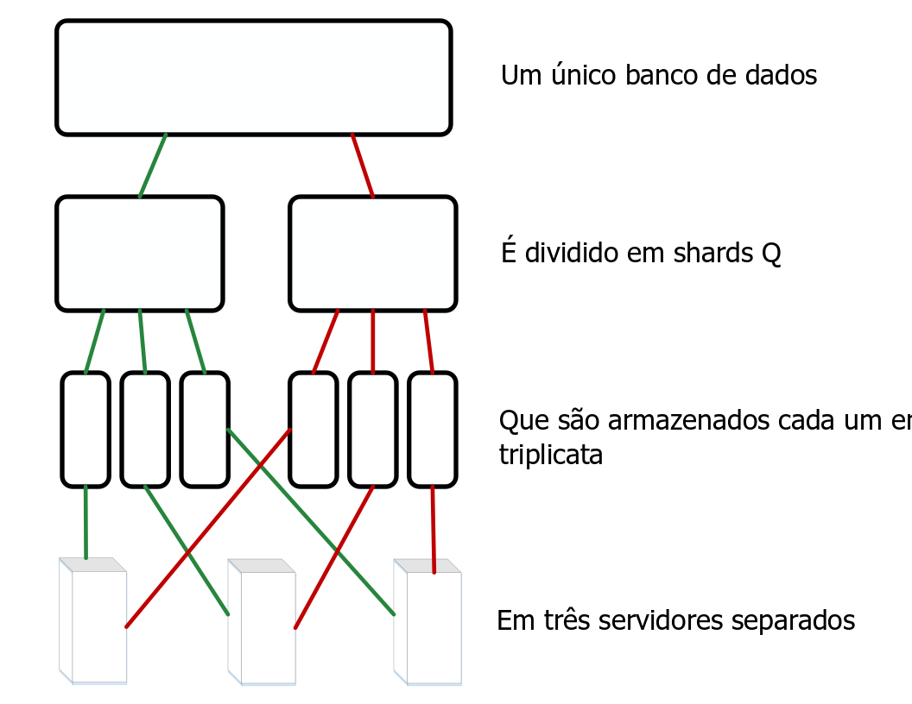
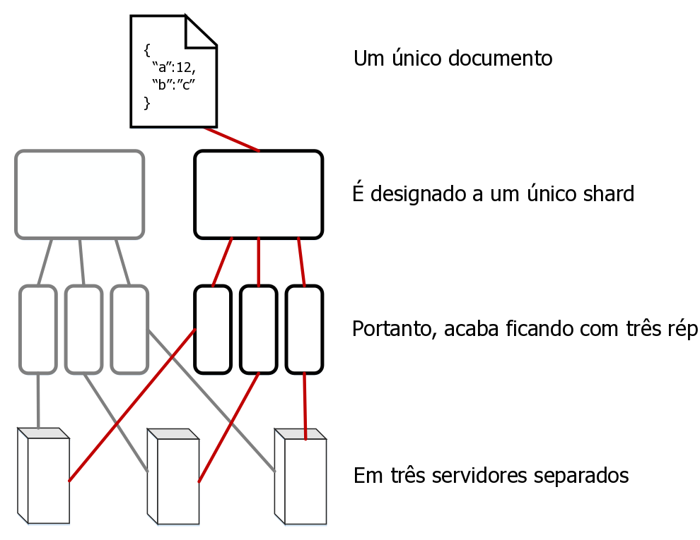

---

copyright:
  years: 2017, 2019
lastupdated: "2019-06-12"

keywords: how data is stored, sharding and performance, work with shards, shard count, replica count

subcollection: cloudant

---

{:new_window: target="_blank"}
{:shortdesc: .shortdesc}
{:screen: .screen}
{:codeblock: .codeblock}
{:pre: .pre}
{:tip: .tip}
{:note: .note}
{:important: .important}
{:deprecated: .deprecated}

<!-- Acrolinx: 2017-05-10 -->

# Como os dados são armazenados no {{site.data.keyword.cloudant_short_notm}}?
{: #how-is-data-stored-in-ibm-cloudant-}

## Conceitos
{: #concepts}

Cada banco de dados no {{site.data.keyword.cloudantfull}} é formado de um ou mais _shards_ distintos,
em que o número de shards é referido como _Q_.
Um shard é um subconjunto distinto de documentos do banco de dados.
Todos os shards _Q_ juntos contêm os dados dentro do banco de dados.
Cada shard é armazenado em três cópias separadas.
Cada cópia de shard é chamada de _réplica_ de shard.
Cada réplica de shard é armazenada em um servidor diferente.
Os servidores estão disponíveis dentro de um único data center local.
A coleção de servidores em um data center é chamada de cluster.



Um documento é designado a um shard específico usando o hashing consistente de seu ID.
Essa designação significa que um documento é sempre armazenado em um shard conhecido e um conjunto conhecido de servidores.



Ocasionalmente,
os shards são _rebalanceados_.
O rebalanceamento envolve mover réplicas para servidores diferentes.
Ele ocorre por vários motivos,
por exemplo, quando o monitoramento do servidor sugere que um servidor é usado mais intensamente ou levemente que outros servidores
ou quando um servidor deve ser retirado de serviço temporariamente para manutenção.
O número de shards e réplicas permanece o mesmo
e os documentos permanecem designados ao mesmo shard,
mas o local de armazenamento do servidor para uma réplica de shard muda.

O valor padrão para _Q_ varia para clusters diferentes.
O valor pode ser ajustado ao longo do tempo.

O número de réplicas (cópias de um shard) também é configurável.
Na prática,
a observação e a medição de muitos sistemas sugere que três réplicas é um número pragmático na maioria dos casos
para atingir um bom balanceamento entre o desempenho e a segurança de dados.
Seria excepcional e incomum para um sistema {{site.data.keyword.cloudant_short_notm}} usar uma contagem de réplica diferente.

## Como a fragmentação afeta o desempenho?
{: #how-does-sharding-affect-performance-}

O número de shards para um banco de dados é configurável
porque afeta o desempenho do banco de dados de várias maneiras.

Quando chega uma solicitação para o banco de dados de um aplicativo cliente,
um servidor ou um 'nó' no cluster é designado como o _coordenador_ da solicitação.
Esse coordenador faz solicitações internas para os nós que contêm os dados relevantes para a solicitação,
determina a resposta para a solicitação
e retorna essa resposta ao cliente.

O número de shards para um banco de dados pode afetar o desempenho de duas maneiras:

1.	Cada documento no banco de dados é armazenado em um único shard.
	Portanto,
ter muitos shards permite maior paralelismo para qualquer solicitação de documento único.
	O motivo é que o coordenador envia solicitações apenas para os nós que contêm o documento.
	Portanto,
se o banco de dados tiver muitos shards,
é provável que haja muitos outros nós que não precisam responder à solicitação.
	Esses nós podem continuar a funcionar em outras tarefas sem interrupção da solicitação do coordenador.
2.	Para responder a uma solicitação de consulta,
um banco de dados deve processar os resultados de todos os shards.
	Portanto,
ter mais shards introduz uma maior demanda de processamento.
	O motivo é que o coordenador deve fazer uma solicitação por shard e,
em seguida, combinar os resultados antes que ele retorne a resposta para o cliente.

Para ajudar a determinar uma contagem adequada de shards para seu banco de dados,
comece identificando os tipos mais comuns de solicitações feitas pelos aplicativos.
Por exemplo,
considere se as solicitações são principalmente para operações de documentos únicos
ou as solicitações são na maioria consultas?
Alguma das operações é sensível ao tempo?

Para todas as consultas,
o coordenador emite solicitações de leitura para todas as réplicas.
Essa abordagem é usada porque cada réplica mantém sua própria cópia dos índices que ajudam a responder consultas.
Uma consequência importante dessa configuração é que ter mais shards permitirá a construção de índice paralelo _se_
as gravações de documentos tenderem a ser distribuídas uniformemente entre os shards no cluster.

Na prática,
é difícil predizer o provável carregamento de indexação entre os nós no cluster.
Além disso,
predizer o carregamento de indexação tende a ser menos útil do que tratar de padrões de solicitação.
O motivo é que a indexação poderá ser necessária após a gravação de um documento,
mas não após a solicitação de um documento.
Portanto,
considerar a indexação sozinha não fornece informações suficientes
para estimar uma contagem de shard apropriada.

Ao considerar o tamanho dos dados,
uma consideração importante é o número de documentos por shard.
Cada shard retém seus documentos em uma grande
[árvore B ](https://en.wikipedia.org/wiki/B-tree){: new_window}
no disco.
Os índices são armazenados da mesma maneira.
Conforme mais documentos são incluídos em um shard,
o número de etapas usadas para atravessar a árvore B
durante uma consulta típica de documento ou uma consulta aumenta.
Esse 'aumento de profundidade' tende a desacelerar as solicitações,
porque mais dados devem ser lidos de caches ou do disco.

Em geral,
evite ter mais de 10 milhões de documentos por shard.
Em termos de tamanho geral do shard,
manter os shards abaixo de 10 GB é útil por motivos operacionais.
Por exemplo,
shards menores são mais fáceis de mover pela rede durante o rebalanceamento.

Dados os requisitos conflitantes para evitar ter muitos documentos e manter o tamanho do shard baixo,
um único valor _Q_ não pode funcionar de forma ideal para todos os casos.
O {{site.data.keyword.cloudant_short_notm}} ajusta os padrões para clusters ao longo do tempo conforme os padrões de uso mudam.

Contudo,
para um banco de dados específico,
muitas vezes é útil dedicar um tempo para considerar padrões de solicitação e dimensionamento observados
e usar essas informações para orientar a futura seleção de um número apropriado de shards.
Testar com dados representativos e padrões de solicitação é essencial para uma melhor estimativa de bons valores _Q_.
Esteja preparado para uma experiência de produção para alterar essas expectativas.

As diretrizes simples a seguir podem ser úteis durante os estágios de planejamento iniciais.
Lembre-se de validar sua configuração proposta testando com dados representativos,
especificamente para bancos de dados maiores:

*	Se o tamanho de seus dados for trivial,
como algumas dezenas ou centenas de MB,
ou milhares de documentos,
então há pouca necessidade de mais de um único shard.
*	Para bancos de dados com alguns GB ou alguns milhões de documentos,
é provável que uma contagem de shards de único dígito, como 8, seja aceitável.
*	Para bancos de dados maiores de dezenas a centenas de milhões de documentos ou dezenas de GB,
considere configurar seu banco de dados para usar 16 shards.
*	Para bancos de dados ainda maiores,
considere fragmentar manualmente seus dados em vários bancos de dados.
	Para bancos de dados grandes assim,
entre em contato com [suporte do {{site.data.keyword.cloudant_short_notm}}](mailto:support@cloudant.com){: new_window} para obter conselhos.

Os números destas orientações derivam da observação e da experiência, e não de cálculos exactos.
{: tip}

## Trabalhando com shards
{: #working-with-shards}

### Configurando a contagem de shards
{: #setting-shard-count}

O número de shards,
_Q_,
para um banco de dados é configurado quando o banco de dados é criado.
O valor _Q_ não poderá ser mudado posteriormente.

Para especificar o _Q_ ao criar um banco de dados,
use o parâmetro de sequência de consultas `q`.

No exemplo a seguir,
um banco de dados chamado `mynewdatabase` é criado.
O parâmetro `q` especifica que oito shards foram criados para o banco de dados.

```sh
curl -X PUT -u myusername https://myaccount.cloudant.com/mynewdatabase?q=8
```
{: codeblock}

A configuração de _Q_ para bancos de dados não está ativada para bancos de dados do {{site.data.keyword.cloudant_short_notm}} no {{site.data.keyword.cloud}}. O valor _Q_ não está disponível na maioria dos clusters `cloudant.com` de diversos locatários.
{: note}

Se você tentar configurar o valor _Q_ onde ele não está disponível, o resultado será uma [resposta`403`](/docs/services/Cloudant?topic=cloudant-http#http-status-codes) com um corpo JSON semelhante ao exemplo a seguir:

```json
{
	"error": "forbidden",
	"reason": "q is not configurable"
}
```
{: codeblock}

### Configurando a contagem de réplicas
{: #setting-the-replica-count}

No CouchDB versão 2 em diante,
você tem permissão para [especificar a contagem de réplicas ](http://docs.couchdb.org/en/2.0.0/cluster/databases.html?highlight=replicas#creating-a-database){: new_window}
ao criar um banco de dados.
No entanto,
não tem permissão para mudar o valor da contagem de réplicas do padrão de 3.
Especificamente,
não é possível especificar um valor de contagem de réplicas diferente ao criar um banco de dados.
Para obter ajuda adicional, entre em contato com o [suporte do {{site.data.keyword.cloudant_short_notm}}](mailto:support@cloudant.com){: new_window}.

### Quais são os argumentos _R_ e _W_?
{: #what-are-the-_r_-and-_w_-arguments-}

Algumas solicitações podem ter argumentos que afetam o comportamento do coordenador quando ele responde à solicitação.
Esses argumentos são conhecidos como _R_ e _W_ após seus nomes na sequência de consultas da solicitação.
Eles podem ser usados somente para operações de documento único.
Eles não têm efeito nas solicitações gerais de 'estilo de consulta'.

Na prática,
raramente é útil especificar os valores _R_ e _W_.
Por exemplo,
especificar _R_ ou _W_ não altera a consistência para a leitura ou gravação.

#### O que é _R_?
{: #what-is-_r_-}

O argumento _R_ pode ser especificado somente em solicitações de documento único.
_R_ afeta a quantia de respostas que devem ser recebidas pelo coordenador antes de ele responder ao cliente.
As respostas devem vir dos nós que hospedam as réplicas do shard que contém o documento. 

Configurar _R_ como _1_ pode melhorar o tempo de resposta geral
porque o coordenador pode retornar uma resposta mais rapidamente.
O motivo é que o coordenador deve aguardar apenas uma única resposta
de qualquer uma das réplicas que hospedam o shard apropriado.

Se você reduzir o valor _R_, ele aumentará a probabilidade de que a resposta que é retornada não seja baseada nos dados mais atualizados por causa do modelo de [consistência eventual](/docs/services/Cloudant?topic=cloudant-cap-theorem)usado pelo {{site.data.keyword.cloudant_short_notm}}. Usar o valor _R_ padrão ajuda a minimizar esse efeito.
{: note}

O valor padrão para _R_ é _2_.
Esse valor corresponde à maioria das réplicas para um banco de dados típico que usa três réplicas de shard.
Se o banco de dados tiver um número de réplicas maior ou menor que 3,
o valor padrão para _R_ mudará de forma correspondente.

#### O que é _W_?
{: #what-is-_w_-}

_W_ pode ser especificado somente em solicitações de gravação de documento único.

_W_ é semelhante a _R_,
porque afeta a quantia de respostas que devem ser recebidas pelo coordenador antes de ele responder ao cliente.

O _W_ não afeta o comportamento de gravação real de nenhuma maneira.
{: note}

O valor de _W_ não afeta se o documento é gravado no banco de dados ou não.
Ao especificar um valor _W_,
o cliente pode inspecionar o código de status de HTTP na resposta para determinar se réplicas de _W_ responderam ao coordenador.
O coordenador aguarda um tempo limite pré-determinado por respostas _W_ de nós que hospedam cópias do documento,
antes de retornar a resposta para o cliente.
