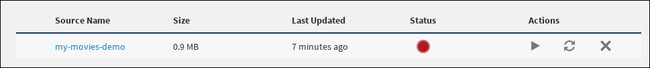
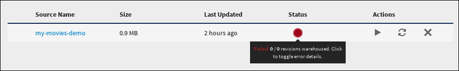
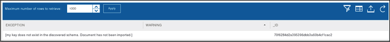

---

copyright:
  years: 2015, 2018
lastupdated: "2018-03-06"

---

{:new_window: target="_blank"}
{:shortdesc: .shortdesc}
{:screen: .screen}
{:codeblock: .codeblock}
{:pre: .pre}

# Data Warehousing

## Descontinuando o recurso {{site.data.keyword.dashdbshort_notm}} do {{site.data.keyword.cloudant_short_notm}} (7 de fevereiro de 2018)
{: #deprecating-cloudant-nosql-db-s-db2-warehouse-on-cloud-feature-february-7-2018-}

O recurso {{site.data.keyword.dashdblong}} do {{site.data.keyword.cloudantfull}} está descontinuado e será retirado de acordo com a linha de tempo abaixo. Os dados
não serão removidos de qualquer sistema, mas a sincronização irá parar. 

Data de descontinuação | O que está sendo descontinuado
-----------------|--------------------------
16 de janeiro de 2018 | A guia Warehouse está disponível somente para instâncias de serviço do {{site.data.keyword.cloudant_short_notm}} que já criaram tarefas do {{site.data.keyword.dashdbshort_notm}} na guia Warehouse. Se você não tiver criado uma tarefa do {{site.data.keyword.dashdbshort_notm}}, não poderá acessar esse recurso.
31 de março de 2018   | As novas tarefas do {{site.data.keyword.dashdbshort_notm}} não podem ser criadas por clientes que começaram a usar o recurso {{site.data.keyword.dashdbshort_notm}} antes de 16 de janeiro.
5 de maio de 2018     | As tarefas existentes d {{site.data.keyword.dashdbshort_notm}} serão interrompidas. O status final ainda pode ser visualizado no painel.
31 de maio de 2018    | A interface com o usuário para o recurso {{site.data.keyword.dashdbshort_notm}} foi removida. O status de tarefas do {{site.data.keyword.dashdbshort_notm}} torna-se indisponível.
 
Os dados que foram transferidos para o{{site.data.keyword.dashdbshort_notm}} em 30 de abril de 2018 permanecerão no {{site.data.keyword.dashdbshort_notm}} e os dados {{site.data.keyword.cloudant_short_notm}} também não serão afetados.

### Alternativas para o recurso {{site.data.keyword.dashdbshort_notm}}

Veja o
[repositório data-flow-examples ](https://github.com/cloudant-labs/data-flow-examples){:new_window}
para os tutoriais sobre
como extrair documentos do {{site.data.keyword.cloudant_short_notm}} e gravar os dados em uma
tabela do {{site.data.keyword.dashdbshort_notm}}.

## Visão geral de data warehousing

Um banco de dados é essencial para armazenar dados.
Mas ser capaz de aplicar esses dados para propósitos comerciais é o que torna um banco de dados valioso:
ser capaz de recuperar dados relevantes
rápida e facilmente
e colocar os dados para trabalhar nos aplicativos.
{:shortdesc}

Mas muitas das tarefas
de armazenamento,
processamento
e análise executadas com os dados são usadas repetidamente nos aplicativos.
Ou podem ser bons exemplos de melhores práticas do segmento de mercado.

Portanto,
faz sentido ampliar os recursos do banco de dados padrão com recursos adicionais,
tarefas de apoio, como relatório
ou análise.

Por quase 30 anos,
os 'Data Warehouses' têm sido o padrão de mercado para armazenamento de dados,
relatório
e análise,
com base na tecnologia de banco de dados relacional.
Em geral,
um [data warehouse é ](https://en.wikipedia.org/wiki/Data_warehouse){:new_window}:
"... um repositório central de dados integrados de uma ou mais fontes.
Ele armazena dados atuais e históricos.
Ele pode ser usado para executar análise e criar relatórios para os profissionais da área do conhecimento em toda a empresa."

As tecnologias que permitem armazenamento de dados,
relatório
e análise surgiram nos últimos anos como uma resposta à necessidade
de processar '[Big Data ](https://en.wikipedia.org/wiki/Big_data){:new_window}':
"Big data é um termo para conjuntos de dados que são tão grandes ou complexos
que aplicativos de processamento de dados tradicionais são inadequados."

Ao mesmo tempo,
as propriedades e as características dos Data Warehouses e dos produtos relacionados significam que
usar a tecnologia de banco de dados relacional para ativar os Data Warehouses é uma escolha popular,
mesmo para tarefas de big data.

Há muitos casos de uso que ilustram bem os benefícios da
integração de recursos do {{site.data.keyword.cloudant_short_notm}} com um data warehouse relacional,
como os exemplos a seguir.

## Esta integração está correta para meu caso de uso?

A integração de warehousing do {{site.data.keyword.cloudant_short_notm}} é um processo simplificado que
irá descobrir automaticamente os esquemas dos seus documentos e importar dados
de forma inteligente para o {{site.data.keyword.dashdbshort_notm}} ou {{site.data.keyword.Db2_on_Cloud_short}}. Quando você cria
um warehouse no {{site.data.keyword.cloudant_short_notm}}, o esquema é primeiro descoberto automaticamente e, em seguida, os dados
são importados para o banco de dados conectado do {{site.data.keyword.dashdbshort_notm}}. 

A integração é adequada quando os dados têm as características a seguir:

* Eles têm um conjunto mais estático de esquemas. Um esquema mudado necessita
    reiniciar o warehouse, que reimporta seus dados do zero.
* Os esquemas podem ser descobertos varrendo relativamente alguns documentos -- até
    algumas dezenas de milhares. Quando os esquemas são descobertos, milhões
    de documentos podem ser importados para seu warehouse, obviamente.
* O warehousing não é necessário ser estritamente em tempo real. Os documentos atualizados
    normalmente aparecem em um warehouse em alguns segundos, mas isso não é garantido
    e varia com base em sua carga de banco de dados.
* O {{site.data.keyword.Db2_on_Cloud_short}} limita os esquemas a 1.012 campos. Os documentos JSON com um grande número de campos, incluindo objetos aninhados e matrizes grandes, podem exceder esse limite.

## Associando dados

A junção de dados de múltiplos armazenamentos de dados para análise de domínio cruzado
é uma tarefa que pode ser executada de modo fácil e eficiente usando um data warehouse relacional.

Os dados de diferentes fontes são preparados e transformados em um formato comum durante o carregamento de um data warehouse.
Os registros são armazenados em tabelas
e as operações ficam disponíveis para associar essas tabelas para ativar a análise combinada.

Executar a junção em um data warehouse relacional será especialmente útil
se alguns dos dados já estiverem disponíveis em uma representação relacional,
por exemplo, dados principais ou dados de referência.

## Flexibilidade

Os bancos de dados {{site.data.keyword.cloudant_short_notm}} são flexíveis para representar dados.
Por exemplo,
eles não utilizam um esquema durante a leitura ou a gravação.

Em contrapartida,
um modelo bem definido e rigorosamente utilizado é necessário para tarefas de relatório e análise.

Com seus documentos disponíveis em um warehouse relacional será possível basear seu modelo em um conjunto fixo de definições de tabela.
Somente documentos que se ajustem ao esquema de tabela poderão ser carregados enquanto as violações serão rejeitadas.
É possível treinar seus modelos com dados consistentes usando um esquema relacional fixo.

## Asserção de integridade de dados

Os Data warehouses podem usar restrições para impor a integridade de dados.
Por exemplo:

-   Dois registros não podem ter a mesma chave primária.
-   As chaves estrangeiras garantem que os registros estejam completos.
-   Há funções disponíveis para validar os registros nas regras de negócios.

Exclusividade,
exatidão
e completude são requisitos essenciais para qualquer serviço corporativo.
Carregar seus documentos do {{site.data.keyword.cloudant_short_notm}} em um data warehouse ajuda a atender a esses requisitos.

## {{site.data.keyword.cloudant_short_notm}} e data warehousing

Os Data Warehouses são uma tecnologia madura e importante.
O {{site.data.keyword.cloudant_short_notm}} fornece uma forte integração com data warehouses relacionais,
fornecendo o benefício dessa tecnologia.

O {{site.data.keyword.cloudant_short_notm}} tem um recurso básico de warehousing integrado
na forma de [visualizações MapReduce](../api/using_views.html)
que permitem executar uma gama de tarefas analíticas básicas.

Para tarefas de warehousing mais avançadas,
é possível alavancar os recursos integrais fornecidos pelo
serviço de warehousing baseado no IBM Cloud [{{site.data.keyword.IBM}} {{site.data.keyword.dashdbshort_notm}} ](https://www.ibm.com/analytics/us/en/data-management/data-warehouse/){:new_window}.

Ao usar o {{site.data.keyword.cloudant_short_notm}},
você tem acesso integrado e fácil a recursos avançados de warehousing,
como:

-   Ver os dados JSON em um formato de banco de dados relacional.
-   Executar consultas baseadas em SQL nos dados.
-   Construir análise dos dados.

Esses recursos avançados de warehousing são ativados por meio de serviços como o {{site.data.keyword.dashdbshort_notm}},
que é um complemento natural para o {{site.data.keyword.cloudant_short_notm}}.

Como alternativa,
se você precisar somente de um armazenamento de dados relacionais para seus documentos,
sem os recursos de warehousing,
será possível carregar os documentos do {{site.data.keyword.cloudant_short_notm}} no serviço [{{site.data.keyword.Db2_on_Cloud_short}}](#ibm-db2-on-cloud).

## {{site.data.keyword.dashdblong_notm}}

O {{site.data.keyword.dashdbshort_notm}} é um serviço de data warehouse baseado em nuvem
construído com propósito de trabalho analítico.
Embora especialmente adequado para dados JSON do {{site.data.keyword.cloudant_short_notm}},
o {{site.data.keyword.dashdbshort_notm}} pode aceitar dados de uma variedade de fontes
examinando a estrutura de dados quando ele é carregado.

Para obter mais informações,
veja a documentação do [{{site.data.keyword.dashdblong_notm}} ](https://www.ibm.com/support/knowledgecenter/SS6NHC/com.ibm.swg.im.dashdb.kc.doc/welcome.html){:new_window}.

## {{site.data.keyword.Db2Hosted_notm}}

O [{{site.data.keyword.Db2Hosted_full}} ](https://console.ng.bluemix.net/catalog/services/ibm-db2-on-cloud){:new_window}
fornece um banco de dados na infraestrutura de nuvem global do IBM SoftLayer®.
Ele oferece os recursos avançados de uma implementação local do DB2,
mas sem o custo,
a complexidade
e o risco de gerenciar sua própria infraestrutura.

Para obter mais informações, veja a documentação do [{{site.data.keyword.Db2Hosted_short}} ](https://console.ng.bluemix.net/docs/services/DB2OnCloud/index.html#DB2OnCloud){:new_window}.

## Criando um warehouse

Há duas maneiras de criar um warehouse:

1.  [Usar o {{site.data.keyword.cloudant_short_notm}} para criar um warehouse do {{site.data.keyword.dashdbshort_notm}}](#use-cloudant-to-create-a-db2-warehouse-on-cloud-warehouse)
2.  [Conectar o {{site.data.keyword.cloudant_short_notm}} a um warehouse existente](#connect-cloudant-to-an-existing-warehouse)

### Usar o {{site.data.keyword.cloudant_short_notm}} para criar um warehouse do {{site.data.keyword.dashdbshort_notm}}

O método mais simples para criar um warehouse é o {{site.data.keyword.cloudant_short_notm}} criar uma instância de warehouse do {{site.data.keyword.dashdbshort_notm}} no {{site.data.keyword.Bluemix}},
em seu nome.
Faça isso clicando no botão `Create Warehouse` na tarefa `Warehouse`
na guia `Integrations` de seu painel do {{site.data.keyword.cloudant_short_notm}}.

Se você ainda não tiver efetuado login no {{site.data.keyword.Bluemix_notm}},
será solicitado que faça isso.

>   **Nota**: por padrão, o {{site.data.keyword.cloudant_short_notm}} cria uma instância do {{site.data.keyword.dashdbshort_notm}} no {{site.data.keyword.Bluemix_notm}} para seu warehouse.

Após a autenticação,
será possível solicitar que uma nova instância do {{site.data.keyword.dashdbshort_notm}} seja criada usando sua conta do {{site.data.keyword.Bluemix_notm}}.

Para fazer isso:

1.  Forneça o nome que gostaria de usar para o Warehouse no campo `Warehouse Name`.
2.  Forneça o nome de seu banco de dados existente no {{site.data.keyword.cloudant_short_notm}}, no campo `Data Sources`campo.
3.  Assegure-se de que a opção `Create new {{site.data.keyword.dashdbshort_notm}} instance` esteja selecionada no formulário.
4.  Clique no botão `Create Warehouse`.

### Conectar o {{site.data.keyword.cloudant_short_notm}} a um warehouse existente

Em vez de usar o {{site.data.keyword.cloudant_short_notm}} para criar o banco de dados de warehouse do {{site.data.keyword.dashdbshort_notm}},
é possível se conectar a uma instância do {{site.data.keyword.dashdbshort_notm}} existente.

O processo é semelhante a [usar o {{site.data.keyword.cloudant_short_notm}} para criar um warehouse do {{site.data.keyword.dashdbshort_notm}}](#use-cloudant-to-create-a-db2-warehouse-on-cloud-warehouse),
entretanto, em vez de selecionar a opção `Criar nova instância do {{site.data.keyword.dashdbshort_notm}}`,
selecione a instância de serviço do `{{site.data.keyword.dashdbshort_notm}}` e escolha o warehouse do {{site.data.keyword.dashdbshort_notm}} que já existe no {{site.data.keyword.Bluemix_notm}}.

### Usando uma instância de warehouse do {{site.data.keyword.Db2_on_Cloud_short}}

Se preferir,
é possível se conectar a uma instância de warehouse do {{site.data.keyword.Db2_on_Cloud_short}} existente em vez do {{site.data.keyword.dashdbshort_notm}}.
Faça isso selecionando a opção `DB2` em seu painel do {{site.data.keyword.cloudant_short_notm}} para se conectar a uma instância do {{site.data.keyword.Db2_on_Cloud_short}} existente.

Se você deseja se conectar a uma instância do {{site.data.keyword.Db2_on_Cloud_short}},
deve-se fornecer os detalhes a seguir:

-   Endereço do host
-   Número da porta
-   Nome do banco de dados
-   ID do usuário para o banco de dados
-   Senha para o ID do usuário

>   **Nota**: o restante deste tópico refere-se ao {{site.data.keyword.dashdbshort_notm}} como a instância do warehouse.
    No entanto,
    o tópico se aplicará igualmente se você estiver usando uma instância do {{site.data.keyword.Db2_on_Cloud_short}}.
    Um tutorial também está disponível descrevendo como
    [carregar dados JSON do {{site.data.keyword.cloudant_short_notm}} no {{site.data.keyword.dashdbshort_notm}} ](https://developer.ibm.com/clouddataservices../dashdb/get/load-json-from-cloudant-database-in-to-dashdb/){:new_window}
    e inclui exemplos de como usar o {{site.data.keyword.Db2_on_Cloud_short}} como o banco de dados do armazém.

## Esquema de warehouse

Quando você cria primeiro um warehouse de dentro do {{site.data.keyword.cloudant_short_notm}},
o {{site.data.keyword.dashdbshort_notm}} cria o melhor esquema possível para os dados dentro do banco de dados,
ajudando a assegurar que cada um dos campos nos documentos JSON tenha uma entrada correspondente no novo esquema.
Opcionalmente,
ao criar o warehouse,
será possível optar por [customizar o esquema](#customizing-the-warehouse-schema) manualmente.

Após a criação do esquema,
o warehouse é capaz de manter os dados em um formato relacional.
O {{site.data.keyword.cloudant_short_notm}} então [replica](../api/replication.html) para executar
um 'carregamento inicial' dos documentos do banco de dados no warehouse,
fornecendo uma coleção de trabalho de seus dados no banco de dados relacional do {{site.data.keyword.dashdbshort_notm}}.

Com o tempo,
seu conteúdo do banco de dados {{site.data.keyword.cloudant_short_notm}} pode mudar.
É possível modificar o esquema de um warehouse existente.

>   **Nota**: se você modificar o esquema de um warehouse existente,
    os dados de seu banco de dados {{site.data.keyword.cloudant_short_notm}} deverão ser replicados novamente no banco de dados de warehouse.
    De fato,
modificar o esquema causa um novo 'carregamento inicial' no warehouse.

## Trabalhando com seu warehouse

Com o warehousing do {{site.data.keyword.cloudant_short_notm}},
é possível executar consultas SQL 'tradicionais'
e visualizar os resultados,
todos de dentro do console do {{site.data.keyword.dashdbshort_notm}}.

Os aplicativos externos podem interagir com os dados da mesma maneira que com qualquer outro banco de dados relacional.
A vantagem do {{site.data.keyword.dashdbshort_notm}} é a possibilidade de executar outras tarefas de warehousing,
como carregar mais dados de outras fontes e
analisar os dados usando ferramentas analíticas integradas.
O {{site.data.keyword.dashdbshort_notm}} suporta a
linguagem de programação [`'R'` ](https://en.wikipedia.org/wiki/R_%28programming_language%29){:new_window}
e o ambiente de software para computação estatística e gráficos.
Isso significa que você terá acesso a algoritmos que permitem executar tarefas analíticas do banco de dados, como regressão linear,
armazenamento em cluster 'k-médias'
e análise geoespacial.

A ferramenta `RStudio` permite criar scripts `'R'` que são então transferidos por upload para o {{site.data.keyword.dashdbshort_notm}},
em seguida, executados usando seus dados.

Para obter mais informações sobre como trabalhar com o {{site.data.keyword.dashdbshort_notm}},
veja a [documentação do {{site.data.keyword.dashdblong_notm}} ](https://www.ibm.com/support/knowledgecenter/SS6NHC/com.ibm.swg.im.dashdb.kc.doc/welcome.html){:new_window}.

## Mantendo os dados e a estrutura atualizados

Os dados são carregados do {{site.data.keyword.cloudant_short_notm}} para o {{site.data.keyword.dashdbshort_notm}} usando um processo de [replicação](../api/replication.html).
Isso significa que se seus dados do {{site.data.keyword.cloudant_short_notm}} forem atualizados ou modificados de alguma maneira,
a replicação dos documentos para o {{site.data.keyword.dashdbshort_notm}} deverá ocorrer novamente
para assegurar que as tarefas analíticas continuem funcionando usando as informações mais atualizadas.

Assim como ocorre com a replicação normal do {{site.data.keyword.cloudant_short_notm}},
os dados são transferidos somente de forma unidirecional:
para um warehouse, a transferência é de {{site.data.keyword.cloudant_short_notm}} para {{site.data.keyword.dashdbshort_notm}}.
Após o carregamento inicial de dados,
o warehouse assina as mudanças de conteúdo de dados no banco de dados {{site.data.keyword.cloudant_short_notm}}.
Quaisquer mudanças são replicadas da origem do {{site.data.keyword.cloudant_short_notm}} para o destino do {{site.data.keyword.dashdbshort_notm}}.
Isso significa que o warehousing é uma forma de replicação contínua do {{site.data.keyword.cloudant_short_notm}} para o {{site.data.keyword.dashdbshort_notm}}.

Com o tempo,
o banco de dados {{site.data.keyword.cloudant_short_notm}} também pode ter mudanças estruturais.
Isso pode incluir a inclusão ou a remoção de campos dos documentos JSON.
Quando isso acontece,
o esquema usado pelo warehouse pode se tornar inválido,
resultando em erros relatados quando dados novos são replicados do {{site.data.keyword.cloudant_short_notm}} para o {{site.data.keyword.dashdbshort_notm}}.

Para resolver esse problema,
o warehousing do {{site.data.keyword.cloudant_short_notm}} tem um recurso 'nova varredura'.
Isso varre novamente a estrutura do banco de dados {{site.data.keyword.cloudant_short_notm}}
e determina o novo esquema requerido no {{site.data.keyword.dashdbshort_notm}}.
As tabelas antigas no {{site.data.keyword.dashdbshort_notm}} que foram criadas durante a varredura anterior são então eliminadas,
novas tabelas criadas usando o novo esquema
e finalmente os dados atuais do {{site.data.keyword.cloudant_short_notm}} são carregados como um novo 'carregamento inicial'.

Para usar o recurso de nova varredura,
assegure-se primeiro de que o warehouse não esteja em execução.
Faça isso como a seguir:

1.  Selecione a guia `Integrations` no painel do {{site.data.keyword.cloudant_short_notm}}.
2.  Localize o nome do Warehouse que você deseja varrer novamente na tarefa `Warehouse`: 
3.  Clique no nome do Warehouse.
    É um link
e quando clicado, ele abre a visualização de detalhes do warehouse: 
4.  Verifique o status atual do warehouse.
    Um círculo verde rotativo indica que o warehouse está em execução.
    Para parar o warehouse,
clique no ícone `Stop Database` na coluna Ações: 
5.  Quando o banco de dados de warehouse não está em execução,
o ícone `Rescan` na coluna Ação fica ativado: 

### Varrendo novamente o banco de dados de origem

Ao clicar no ícone `Rescan`,
você terá duas opções:

-   Uma varredura direta de seu banco de dados.
    Esta é a ação padrão
e é muito semelhante à varredura inicial de seu banco de dados executada quando o warehouse foi criado pela primeira vez.
-   Customize o esquema de warehouse.

Se você escolher a ação padrão de uma nova varredura simples,
seu banco de dados de origem será inspecionado e um novo esquema de banco de dados do warehouse será gerado.
Assim que a nova varredura for concluída,
o warehouse será iniciado.

Se você deseja customizar o esquema de warehouse,
ative a caixa de seleção `Customize Schema`
antes de clicar no botão `Rescan`.

A caixa de seleção `Customize Schema` ativa duas opções.

1.  O algoritmo de descoberta usado.
2.  O tamanho da amostra.

### O algoritmo de descoberta

A opção padrão para varrer novamente é o algoritmo `Union`.
Isso usa todos os atributos em todos os documentos do banco de dados {{site.data.keyword.cloudant_short_notm}} de amostra
para criar um único conjunto de tabelas no banco de dados de warehouse.
O resultado é que todos os documentos do banco de dados {{site.data.keyword.cloudant_short_notm}} podem ser armazenados no banco de dados de warehouse,
mas algumas linhas no banco de dados podem não ter conteúdo em alguns dos campos.

A opção alternativa para varrer novamente é o algoritmo `Cluster`.
Isso identifica documentos no banco de dados {{site.data.keyword.cloudant_short_notm}} que têm o mesmo conjunto de atributos
e, em seguida, cria esquemas de tabela de banco de dados de warehouse correspondentes.

### O tamanho da amostra

Essa opção determina quantos documentos no banco de dados {{site.data.keyword.cloudant_short_notm}}
são inspecionados como parte da determinação do esquema.

O valor padrão é 10.000 documentos.

Configurar o valor muito baixo apresenta o risco de que alguns documentos do {{site.data.keyword.cloudant_short_notm}} têm atributos que não são detectados
e, portanto, omitidos da estrutura do banco de dados de warehouse.

Configurar o valor muito alto significa que o processo de varredura
para determinar a estrutura do banco de dados de warehouse levará mais tempo para ser concluído.

### Após a nova varredura

Quando a nova varredura do banco de dados {{site.data.keyword.cloudant_short_notm}} tiver sido concluída,
o warehouse não será iniciado automaticamente.
Em vez disso,
ele permanecerá em um estado parado,
para que o banco de dados de warehouse possa ser customizado.

## Customizando o esquema de warehouse

É possível modificar o esquema do banco de dados determinado automaticamente
durante o processo de criação inicial do warehouse
ou após uma nova varredura.
Para fazer isso,
assegure-se de verificar a opção `Customize Schema` durante o processo de criação:

O warehouse é criado no {{site.data.keyword.dashdbshort_notm}} normalmente,
no entanto, ele não é iniciado imediatamente.
Em vez disso,
você tem a oportunidade de customizar o esquema antes de continuar.

Para fazer isso,
clique no link para seu warehouse:

A exibição resultante fornecerá um botão para customizar o esquema usado para seu banco de dados de origem.
Passar o mouse sobre o indicador de Status confirma que o esquema está pronto para customização:

Clicar no botão 'Customize' resultará em um painel no qual é possível modificar os campos no esquema do banco de dados:

Para reconfigurar o esquema para o padrão,
clique no botão `Rescan`:

Quando estiver satisfeito com o esquema do banco de dados para o warehouse,
clique no botão `Executar`:

O esquema é salvo
e o warehouse é iniciado.

### Customizando um esquema de warehouse existente

Se o esquema do banco de dados para o warehouse já existir,
você terá a [opção para customizá-lo](#keeping-the-data-and-structure-fresh).

## Solucionando problemas

De tempos em tempos,
é possível que você encontre problemas ao usar o recurso de warehousing.
Informações sobre alguns desses problemas são fornecidas posteriormente neste tópico.

Além disso,
a discussão de alguns erros ou problemas comuns,
além dos detalhes de como solucioná-los,
estão disponíveis no [Stack Overflow ](http://stackoverflow.com/questions/tagged/cloudant+dashdb){:new_window}.

Se precisar de ajuda adicional
e não puder localizar soluções no Stack Overflow,
entre em contato com o [suporte do {{site.data.keyword.cloudant_short_notm}} ](mailto:support@cloudant.com){:new_window}.

### Exceções visíveis no painel

Às vezes,
o warehouse encontra uma condição de erro.
Por exemplo,
se você tentar criar um warehouse usando um banco de dados {{site.data.keyword.Db2_on_Cloud_short}} existente,
mas falhar ao inserir os detalhes corretos do banco de dados,
o warehouse não poderá ser criado com sucesso.

Quando existir uma condição de erro,
o status do warehouse mudará para um círculo vermelho,
indicando que há um problema que requer sua atenção:

Se você 'passar o mouse sobre' o indicador,
serão fornecidas mais algumas informações:

Quando você clica no indicador,
aparece uma janela fornecendo mais detalhes sobre o que é o problema exatamente.
Neste exemplo,
os detalhes do host inseridos para a conexão do {{site.data.keyword.Db2_on_Cloud_short}} não eram válidos:

### Avisos e erros

As mudanças no banco de dados {{site.data.keyword.cloudant_short_notm}} são replicadas para o banco de dados de warehouse.
É possível que uma mudança possa não se ajustar ao warehouse ou a seu esquema.
Problemas desse tipo são detectados e registrados na tabela `OVERFLOW` do banco de dados de warehouse.

Por exemplo,
se o esquema de warehouse tiver um campo `Movie_earnings_rank` do tipo `VARCHAR`
e puder conter até 32 caracteres,
mas uma mudança no banco de dados {{site.data.keyword.cloudant_short_notm}} requerer armazenamento de 40 caracteres,
o campo 'estourará'.
Isso produziria uma condição de 'aviso',
que é indicado no ícone de status do painel do warehouse:

Ao verificar a tabela de estouro indicada no banco de dados de warehouse,
você vê mais detalhes sobre o aviso:

Neste exemplo,
um aviso torna claro que um truncamento ocorreu,
afetando o campo `Movie_earnings_rank` do documento do {{site.data.keyword.cloudant_short_notm}} que tem um `_ID` de `70f6284d2a395396dbb3a60b4cf1cac2`.

Há duas opções de solução possíveis:

-   Corrija o campo de estouro no documento do {{site.data.keyword.cloudant_short_notm}}.
-   [Atualizar o esquema de warehouse](#customizing-the-warehouse-schema).

A opção escolhida depende de se o conteúdo extra no campo é intencional ou não.
Se você requerer o conteúdo extra para seu aplicativo,
será necessário
[atualizar o esquema de warehouse](#customizing-the-warehouse-schema) para remover a condição de aviso.

Um problema mais significativo será se um campo inteiramente novo for introduzido em um documento no banco de dados {{site.data.keyword.cloudant_short_notm}},
mas o campo não tiver uma contraparte no esquema do banco de dados de warehouse.
Isso causa uma condição de 'erro'.

Por exemplo,
um documento no banco de dados {{site.data.keyword.cloudant_short_notm}} pode 'ganhar' um campo extra chamado `my key`
que não existe no esquema do banco de dados de warehouse:

O resultado é uma condição de erro,
que é indicada no ícone de status do painel do warehouse:

Ao verificar a tabela de estouro indicada no banco de dados de warehouse,
você vê mais detalhes sobre o erro:

Neste exemplo,
o erro deixa claro que foi encontrado um campo
que não estava presente quando o esquema do banco de dados de warehouse foi criado.
O próprio campo foi detectado no documento do {{site.data.keyword.cloudant_short_notm}} que tem um `_ID` de `70f6284d2a395396dbb3a60b4cf1cac2`.

Há duas opções de solução possíveis:

-   Remova o campo extra do documento do {{site.data.keyword.cloudant_short_notm}}.
-   [Atualizar o esquema de warehouse](#customizing-the-warehouse-schema).

A opção escolhida depende de se o campo extra é intencional ou não.
Se você requerer o campo extra para seu aplicativo,
será necessário [atualizar o esquema de warehouse](#customizing-the-warehouse-schema) para remover a condição de erro.
