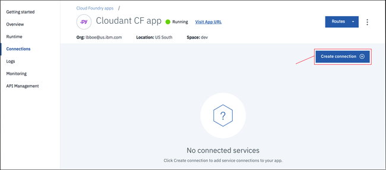

---

copyright:
  years: 2017, 2019
lastupdated: "2019-04-02"

keywords: ibm cloud application environment, ibm cloud applications and services, connect, the cloud foundry command toolkits, ibm cloud command toolkits, install the cloud foundry toolkit, install ibm cloud toolkit, the starter application

subcollection: cloudant

---

{:new_window: target="_blank"}
{:shortdesc: .shortdesc}
{:screen: .screen}
{:codeblock: .codeblock}
{:pre: .pre}
{:tip: .tip}
{:note: .note}
{:important: .important}
{:deprecated: .deprecated}

<!-- Acrolinx: 2017-05-10 -->

# Criando um aplicativo {{site.data.keyword.cloud_notm}} simples para acessar um banco de dados do {{site.data.keyword.cloudant_short_notm}}: o ambiente de aplicativos
{: #creating-a-simple-ibm-cloud-application-to-access-an-ibm-cloudant-database-the-application-environment}

Esta seção do tutorial descreve como configurar o ambiente de aplicativos que deve-se ter
para criar um aplicativo {{site.data.keyword.cloud}}.
{: shortdesc}

## Criando um ambiente de aplicativos do {{site.data.keyword.cloud_notm}}
{: #creating-an-ibm-cloud-application-environment}

1.  Efetue login em sua conta {{site.data.keyword.cloud_notm}}.<br/>
    O painel do {{site.data.keyword.cloud_notm}}pode ser localizado em:
   [https://cloud.ibm.com/ ](https://cloud.ibm.com/){: new_window}.
    Depois de autenticar-se com seu nome de usuário e senha,
o painel do {{site.data.keyword.cloud_notm}} aparece. Clique em `Catálogo`a partir do menu: <br/>
   

2.  Clique na categoria `Compute`:<br/>
   <br/>
    Uma lista de vários serviços e apps que estão disponíveis no {{site.data.keyword.cloud_notm}} é exibida.

3.  Role para baixo até a seção `Cloud Foundry`e clique na entrada `Python`:<br/>
   <br/>
    Um formulário `Criar um app Cloud Foundry` é exibido.

4.  Use o formulário `Criar um app Cloud Foundry` para especificar e criar o ambiente para seu aplicativo Python Cloud Foundry. Insira um nome para seu aplicativo, por exemplo, `App Cloudant CF`. O nome do host é gerado para você automaticamente, embora seja possível customizá-lo:</br>
   
    
    O nome do host deve ser exclusivo dentro do domínio do {{site.data.keyword.cloud_notm}}. Neste exemplo, o domínio é `mybluemix.net`, fornecendo um nome de host completo de `Cloudant-CF-app.mybluemix.net`.
    {: tip}

5.  Clique em `Criar`para criar o ambiente de aplicativos:</br>
   

6.  Após uma pausa curta, a janela `Introdução` para seu novo ambiente de aplicativos é exibida.
    Um aplicativo de teste é criado automaticamente no ambiente.
    O aplicativo é iniciado automaticamente, conforme mostrado pelo ícone verde e o status `Em execução`.
    O aplicativo é um programa 'pulsação',
suficiente para mostrar que o novo ambiente de aplicativos está pronto para você usar.
    Clique no link `Apps Cloud Foundry`para retornar ao painel do {{site.data.keyword.cloud_notm}}.<br/>
   

7.  Sua lista de recursos agora inclui o ambiente de aplicativo recém-criado:<br/>
   

Agora você tem um ambiente de aplicativo Python do {{site.data.keyword.cloud_notm}} que está pronto para uso.

Para trabalhar com uma instância de banco de dados do {{site.data.keyword.cloudant_short_notm}},
crie uma 'conexão' entre o ambiente de aplicativos e a instância de banco de dados.

## Conectando aplicativos e serviços do {{site.data.keyword.cloud_notm}}
{: #connecting-ibm-cloud-applications-and-services}

Esta seção do tutorial explica como você conecta
ambientes de aplicativos e serviços do {{site.data.keyword.cloud_notm}} usando
a área de configuração e gerenciamento de seu aplicativo.

1.  No painel do {{site.data.keyword.cloud_notm}}, acesse o ícone de **Menu**>**Lista de Recursos**e abra sua instância de serviço. <br/>
   </br>
    Aparece a área de visão geral de configuração e gerenciamento para seu aplicativo.

2.  Para conectar o ambiente de aplicativos a outro serviço,
    Clique na guia `Conexões`:<br/>
   <br/>
    Aparece uma área para configurar uma conexão entre seu aplicativo e quaisquer outros serviços disponíveis em sua conta.

3.  Um [pré-requisito](/docs/services/Cloudant?topic=cloudant-creating-a-simple-ibm-cloud-application-to-access-an-ibm-cloudant-database-prerequisites#prerequisites) para esse tutorial é uma
instância de banco de dados existente do {{site.data.keyword.cloudant_short_notm}}.
    Clique em `Criar conexão`para estabelecer uma conexão entre essa instância de serviço e seu aplicativo:<br/>
   <br/>
    Aparece uma lista das instâncias de serviço existentes em sua conta.

4.  Clique na instância de serviço do {{site.data.keyword.cloudant_short_notm}} que você deseja usar.
    Este tutorial usa a instância `Cloudant-service`:<br/>
   

5.  Você é solicitado a confirmar que realmente deseja conectar a instância de banco de dados a seu aplicativo.
    Clique em  ` Conectar `  para confirmar a conexão:<br>
    

6.  Antes de continuar, será solicitado que você customize o ID do serviço e a função de acesso. Clique em `Conectar` para continuar.      

6.  Modificar as conexões de serviço de um aplicativo afeta sua configuração geral. A modificação requer uma 'remontagem' do aplicativo,
que também força um aplicativo em execução a parar. Aparece uma janela para você confirmar que está pronto para que a 'remontagem' continue.
    Clique em `Restage`para continuar:<br/>
   

7.  A página de conexões de serviço reaparece.
    Ele agora inclui a instância de banco de dados recém-conectada:<br/>
   

O ambiente de aplicativos e a instância de banco de dados estão agora conectados.
A próxima etapa é assegurar-se de que as ferramentas necessárias estejam instaladas para você
trabalhar com aplicativos {{site.data.keyword.cloud_notm}}.

## Os kits de ferramentas de comandos do Cloud Foundry e {{site.data.keyword.cloud_notm}}
{: #the-cloud-foundry-and-ibm-cloud-command-toolkits}

Esta seção do tutorial descreve os kits de ferramentas que devem ser instalados para funcionar com
seu ambiente,
aplicativos
e serviços do {{site.data.keyword.cloud_notm}}.

O kit de ferramentas do [Cloud Foundry ](https://en.wikipedia.org/wiki/Cloud_Foundry){: new_window}
é uma coleção de ferramentas para trabalhar com aplicativos que são
implementados em um ambiente compatível com o Cloud Foundry.
Use essas ferramentas para tarefas como a atualização de um aplicativo implementado
ou para iniciar e parar um aplicativo em execução.

O kit de ferramentas do {{site.data.keyword.cloud_notm}} fornece recursos extras,
que são necessários para trabalhar com aplicativos hospedados e em execução em um ambiente do {{site.data.keyword.cloud_notm}}.

Certifique-se de instalar o Cloud Foundry _e_ os kits de ferramentas do {{site.data.keyword.cloud_notm}}.
{: tip}

Fazer download e instalar os kits de ferramentas é uma tarefa única.
Se os kits de ferramentas já estiverem instalados e funcionando em seu sistema,
não será necessário fazer download deles novamente,
a menos que sejam atualizados.

Informações gerais sobre os kits de ferramentas estão disponíveis
[aqui ](/docs/services/Cloudant?topic=cloudant-getting-started-with-cloudant#getting-started){: new_window}.

### Instalando o kit de ferramentas do Cloud Foundry
{: #installing-the-cloud-foundry-toolkit}

Algumas distribuições do sistema operacional possuem uma versão do kit de ferramentas do Cloud Foundry já disponível.
Se a versão suportada for 6.11 ou superior,
ela será compatível com o {{site.data.keyword.cloud_notm}} e poderá ser usada.
É possível verificar qual versão está instalada ao executar o comando a seguir.

Como alternativa,
use as etapas a seguir para fazer download e instalar o kit de ferramentas do Cloud Foundry em seu sistema: 

1.  Clique em `Introdução` para ver informações sobre como fazer download do kit de ferramentas do Cloud Foundry.

2.  Clique em  ` CLI `. O link leva você à documentação do {{site.data.keyword.cloud_notm}} Developer Tools (CLI e Ferramentas de desenvolvimento).

3.  Clique em `Plug-ins da CLI do Cloud Foundry` e, em seguida, clique em `CLI do admin {{site.data.keyword.cloud_notm}}`. 

4.  Siga as instruções na página para fazer download e executar a versão mais recente do instalador para seu sistema.

5.  Para verificar se você tem um kit de ferramentas operacional do Cloud Foundry,
execute o comando a seguir em um prompt:

    ```sh
    cf --version
    ```
    {: pre}
    
    Espere um resultado semelhante à saída a seguir:
    
    ```
    cf version 6.20.0+25b1961-2016-06-29
    ```
    {:codeblock}
    
    A versão do kit de ferramentas do Cloud Foundry deve ser 6.11 ou mais recente para compatibilidade com o {{site.data.keyword.cloud_notm}}.
    {: tip}

### Instalando o kit de ferramentas do {{site.data.keyword.cloud_notm}}
{: #installing-the-ibm-cloud-toolkit}

Use as etapas a seguir para fazer download e instalar o kit de ferramentas do {{site.data.keyword.cloud_notm}} em seu sistema.

1.  Clique em `Introdução` para ver informações sobre como fazer download do kit de ferramentas da CLI do admin do {{site.data.keyword.cloud_notm}}.

2.  Clique em `CLI` para abrir o documento [Introdução às ferramentas do desenvolvedor do {{site.data.keyword.cloud_notm}} ](https://cloud.ibm.com/docs/cli?topic=cloud-cli-ibmcloud-cli#getting-started){: new_window}.

3.  Siga as instruções na página para fazer download e executar o instalador apropriado para seu sistema.

    O instalador verifica para assegurar que você tenha uma versão adequada do kit de ferramentas do Cloud Foundry instalada.
    Se tudo estiver correto,
o kit de ferramentas do {{site.data.keyword.cloud_notm}} será instalado em seu sistema.

4.  Para verificar se você tem um kit de ferramentas funcional do {{site.data.keyword.cloud_notm}},
    execute o comando a seguir em um prompt:
    
    ```sh
    bluemix --version
    ```
    {: pre}
    
    Espere um resultado semelhante à saída a seguir:
    
    ```
    bluemix version 0.4.5+03c29de-2016-12-08T07:01:01+00:00
    ```
    {: codeblock}
    
As ferramentas que funcionarão com os aplicativos {{site.data.keyword.cloud_notm}} estão agora disponíveis.
A próxima etapa é obter os materiais 'iniciadores' para ajudá-lo a criar
um aplicativo {{site.data.keyword.cloud_notm}}.

Depois de instalar a interface da linha de comandos, volte para a guia `Introdução` no painel para fazer download, modificar e reimplementar seus aplicativos Cloud Foundry e instâncias de serviço com a interface da linha de comandos. 
{: note}

## O aplicativo `starter`
{: #the-starter-application}

Essa seção do tutorial descreve um aplicativo iniciador do {{site.data.keyword.cloud_notm}}
e explica como customizá-lo para acessar
uma instância de banco de dados do
{{site.data.keyword.cloudant_short_notm}}.

Um aplicativo iniciador do {{site.data.keyword.cloud_notm}} é a coleção mínima possível
de arquivos de origem e de configuração necessários
para criar um aplicativo funcional do {{site.data.keyword.cloud_notm}}.
Em alguns aspectos,
é semelhante a um [aplicativo 'Hello World' ](https://en.wikipedia.org/wiki/%22Hello,_World!%22_program){: new_window};
suficiente apenas para mostrar que o sistema básico e a configuração estão funcionando corretamente.

Um aplicativo iniciador do {{site.data.keyword.cloud_notm}} é um archive de arquivos de exemplo que deve ser modificado ou estendido à medida que você desenvolve seu aplicativo {{site.data.keyword.cloud_notm}}.

Três arquivos especificamente são essenciais:

-   [`Procfile`](#the-procfile-file)
-   [`manifest.yml`](#the-manifest.yml-file)
-   [`requirements.txt`](#the-requirements.txt-file)

### O arquivo  ` Procfile `
{: #the-procfile-file}

O `Procfile` contém os detalhes que o {{site.data.keyword.cloud_notm}} precisa para executar seu aplicativo.

Mais especificamente, um `Procfile` é um artefato do Cloud Foundry que define um tipo de processo de aplicativo e o comando para executar o aplicativo.
Mais informações sobre `Procfile` estão disponíveis [aqui ](https://docs.cloudfoundry.org/buildpacks/prod-server.html#procfile){: new_window}.

O `Procfile` para um aplicativo iniciador {{site.data.keyword.cloud_notm}} Python é semelhante ao exemplo a seguir:

```
web: python server.py
```
{: codeblock}

Esse exemplo indica que o aplicativo é um aplicativo da web Python
e que é iniciado executando o comando:

```sh
python server.py
```
{: codeblock}

Um arquivo de origem Python `server.py` iniciador é incluído no archive de aplicativo iniciador.
O arquivo `server.py` é modificado para seu aplicativo.
Como alternativa,
crie um arquivo de origem Python inteiramente novo.
Em seguida, atualize o `Procfile` para que o novo arquivo seja usado quando seu aplicativo for iniciado.

### O arquivo  ` manifest.yml `
{: #the-manifest.yml-file}

O arquivo `manifest.yml` é uma descrição completa do aplicativo e do ambiente que ele requer para execução.

O arquivo para um aplicativo iniciador do Python do {{site.data.keyword.cloud_notm}} é semelhante ao exemplo a seguir:

```
applications:
- path: .
  memory: 128M
  instances: 1
  domain: mybluemix.net
  name: Cloudant Python
  host: Cloudant-Python
  disk_quota: 1024M
  services:
  - Cloudant Service 2017
```
{: codeblock}

Três pontos são dignos de nota:

-   Os valores `domain`,
    `name`
    e `host` correspondem aos valores inseridos quando
    o aplicativo {{site.data.keyword.cloud_notm}} foi [criado](#creating-an-ibm-cloud-application-environment).
-   O valor `name` é usado pelo kit de ferramentas Cloud Foundry para identificar o aplicativo que você está administrando.
-   O valor `services` confirma que a instância de banco de dados do `Cloudant Service 2017`{{site.data.keyword.cloudant_short_notm}} está conectada ao ambiente de aplicativos.

Normalmente, não é necessário modificar o arquivo `manifest.yml`, no entanto, é útil entender por que ele deve estar presente para que seu aplicativo funcione.

### O arquivo  ` requirements.txt `
{: #the-requirements.txt-file}

O arquivo `requirements.txt` especifica os componentes adicionais que são necessários para que seu aplicativo funcione.

No aplicativo iniciador, o arquivo `requirements.txt` está vazio.

No entanto, neste tutorial o aplicativo Python acessa uma
instância de banco de dados do {{site.data.keyword.cloudant_short_notm}}.
Portanto,
o aplicativo deve ser capaz de usar a
biblioteca do cliente [{{site.data.keyword.cloudant_short_notm}} para aplicativos Python](/docs/services/Cloudant?topic=cloudant-supported-client-libraries#python-supported).

Para ativar a biblioteca do cliente Python,
modifique o arquivo `requirements.txt` para conter o texto a seguir: ​​​
```
cloudant==2.3.1
```
{: codeblock}

A próxima etapa no tutorial é [criar o aplicativo](/docs/services/Cloudant?topic=cloudant-creating-a-simple-ibm-cloud-application-to-access-an-ibm-cloudant-database-the-application-environment#creating-a-simple-ibm-cloud-application-to-access-an-ibm-cloudant-database-the-application-environment).
