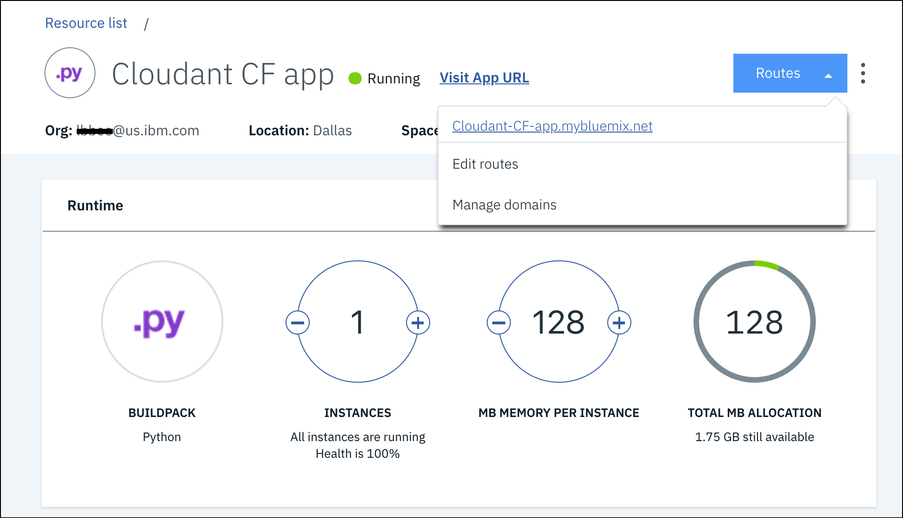

---

copyright:
  years: 2017, 2018
lastupdated: "2017-11-07"

---

{:new_window: target="_blank"}
{:shortdesc: .shortdesc}
{:screen: .screen}
{:codeblock: .codeblock}
{:pre: .pre}

<!-- Acrolinx: 2017-01-11 -->

# Criando um aplicativo {{site.data.keyword.Bluemix_notm}} simples para acessar um banco de dados {{site.data.keyword.cloudant_short_notm}}: fazendo upload do aplicativo

Esta seção do tutorial descreve como fazer upload de um
aplicativo {{site.data.keyword.Bluemix}}.
{:shortdesc}

<div id="uploading"></div>

## Conectando-se ao {{site.data.keyword.Bluemix_notm}}

A primeira tarefa é se conectar ao {{site.data.keyword.Bluemix_notm}}.

O [kit de ferramentas do {{site.data.keyword.Bluemix_notm}}](create_bmxapp_appenv.html#toolkits) ajuda a fazer a conexão.

O Cloud Foundry precisa saber a URL a ser usada para fazer chamadas API,
por exemplo, ao fazer upload de um aplicativo.
O kit de ferramentas do {{site.data.keyword.Bluemix_notm}} usa o comando '`cf api`' para gerenciar o terminal de API.
Mais informações sobre o comando '`cf api`' estão
[disponíveis](https://console.ng.bluemix.net/docs/cli/reference/cfcommands/index.html#cf_api){:new_window}.

Use o comando a seguir para informar ao Cloud Foundry a URL a ser usada:

```sh
bluemix api https://api.ng.bluemix.net
```
{:pre}

Espere um resultado semelhante à saída a seguir:

```
Invoking 'cf api https://api.ng.bluemix.net'...

Setting api endpoint to https://api.ng.bluemix.net...
OK

API endpoint:   https://api.ng.bluemix.net
API version:    2.54.0
Not logged in. Use 'bluemix login' to log in.
```
{:codeblock}

Agora o Cloud Foundry sabe onde enviar chamadas API para gerenciar aplicativos.

A próxima etapa é efetuar login no ambiente de aplicativos do {{site.data.keyword.Bluemix_notm}}.
Deve-se fornecer os detalhes de conta a seguir:

-   Seu nome de usuário, especificado como o parâmetro '`-u`'.
-   O nome de sua organização, especificado como o parâmetro '`-o`'.
-   Seu espaço, especificado como o parâmetro '`-s`'.

>   **Nota**: os detalhes da conta ficam disponíveis no painel do {{site.data.keyword.Bluemix_notm}}
    ao efetuar login por meio de um navegador da web,
conforme mostrado no exemplo a seguir:<br/>
    

Use um comando semelhante ao exemplo a seguir para efetuar login no
ambiente de aplicativos do {{site.data.keyword.Bluemix_notm}}.
Observe que você é solicitado a inserir a senha de sua conta.

```sh
bluemix login -u Adrian.Warman@uk.ibm.com -o Adrian.Warman@uk.ibm.com -s dev
```
{:pre}

Espere um resultado semelhante à saída a seguir:

```
Invoking 'cf login -u Adrian.Warman@uk.ibm.com -o Adrian.Warman@uk.ibm.com -s dev'...

API endpoint: https://api.ng.bluemix.net

Password> 
Authenticating...
OK

Targeted org Adrian.Warman@uk.ibm.com

Targeted space dev
                
API endpoint:   https://api.ng.bluemix.net (API version: 2.54.0)
User:           adrian.warman@uk.ibm.com
Org:            Adrian.Warman@uk.ibm.com
Space:          dev
```
{:codeblock}

## Fazendo upload do aplicativo

O kit de ferramentas do {{site.data.keyword.cloudant_short_notm}} Foundry agora sabe como se conectar ao ambiente {{site.data.keyword.Bluemix_notm}}.

A próxima etapa é fazer upload do próprio aplicativo.
Detalhes de um aplicativo {{site.data.keyword.Bluemix_notm}}
são fornecidos no [arquivo manifest](create_bmxapp_appenv.html#manifest).

O arquivo manifest para o aplicativo tutorial foi atualizado
conforme descrito [aqui](create_bmxapp_createapp.html#essential-files)

Use um comando semelhante ao exemplo a seguir para efetuar login para fazer upload do
aplicativo {{site.data.keyword.Bluemix_notm}}.

```sh
cf push "Cloudant Python"
```
{:pre}

Uma sequência de mensagens de resultado é exibida.

```
Using manifest file /..../BMXDemo/manifest.yml

Updating app {{site.data.keyword.cloudant_short_notm}} Python in org Adrian.Warman@uk.ibm.com / space dev as Adrian.Warman@uk.ibm.com...
OK
```
{:codeblock}

O kit de ferramentas do Cloud Foundry localizou o arquivo manifest
e está se preparando para fazer upload do aplicativo usando os detalhes de
conexão e identificação fornecidos [anteriormente](#uploading).

```
Using route Cloudant-Python.mybluemix.net
Uploading Cloudant Python...
Uploading app files from: /..../BMXDemo
Uploading 1.5K, 3 files
Done uploading               
OK
Binding service {{site.data.keyword.cloudant_short_notm}} Service 2017 to app {{site.data.keyword.cloudant_short_notm}} Python in org Adrian.Warman@uk.ibm.com / space dev as Adrian.Warman@uk.ibm.com...
OK
```
{:codeblock}

O aplicativo foi transferido por upload com sucesso
e uma conexão feita com a instância de banco de dados do {{site.data.keyword.cloudant_short_notm}}.

```
Starting app {{site.data.keyword.cloudant_short_notm}} Python in org Adrian.Warman@uk.ibm.com / space dev as Adrian.Warman@uk.ibm.com...
-----> Downloaded app package (4.0K)
-----> Downloaded app buildpack cache (29M)
-------> Buildpack version 1.5.5
     $ pip install -r requirements.txt
DEPRECATION: --allow-all-external has been deprecated and will be removed in the future. Due to changes in the repository protocol, it no longer has any effect.
       Collecting cloudant==2.3.1 (from -r requirements.txt (line 1))
         Downloading cloudant-2.3.1-py2-none-any.whl (63kB)
       Collecting requests<3.0.0,>=2.7.0 (from cloudant==2.3.1->-r requirements.txt (line 1))
         Downloading requests-2.12.4-py2.py3-none-any.whl (576kB)
       Installing collected packages: requests, cloudant
       Successfully installed cloudant-2.3.1 requests-2.12.4
You are using pip version 8.1.1, however version 9.0.1 is available.
You should consider upgrading via the 'pip install --upgrade pip' command.
You are using pip version 8.1.1, however version 9.0.1 is available.
You should consider upgrading via the 'pip install --upgrade pip' command.
-----> Uploading droplet (30M)

0 of 1 instances running, 1 starting
1 of 1 instances running

App started


OK

App {{site.data.keyword.cloudant_short_notm}} Python was started using this command `python server.py`
```
{:codeblock}

O aplicativo é iniciado automaticamente.
Como parte da inicialização,
é feita uma verificação para assegurar que todos os requisitos sejam atendidos,
avaliando o conteúdo do [arquivo requirements.txt](create_bmxapp_appenv.html#requirements).
O aplicativo requer acesso à biblioteca do {{site.data.keyword.cloudant_short_notm}},
que foi [especificada](create_bmxapp_createapp.html#essential-files) durante a criação do aplicativo.

Depois que você faz upload e inicia o aplicativo,
algumas verificações simples do sistema são executadas para confirmar que o aplicativo está sendo executado corretamente,
no que diz respeito ao {{site.data.keyword.Bluemix_notm}}.

```
Showing health and status for app {{site.data.keyword.cloudant_short_notm}} Python in org Adrian.Warman@uk.ibm.com / space dev as Adrian.Warman@uk.ibm.com...
OK

requested state: started
instances: 1/1
usage: 128M x 1 instances
urls: Cloudant-Python.mybluemix.net
last uploaded: Thu Dec 22 15:58:18 UTC 2016
stack: cflinuxfs2
buildpack: python 1.5.5

     state     since                    cpu    memory          disk           details
#0   running   2016-12-22 03:59:21 PM   0.0%   49.9M of 128M   110.6M of 1G
```
{:codeblock}

## Testando o aplicativo de amostra

Quando o ambiente de aplicativos do {{site.data.keyword.Bluemix_notm}} foi criado pela primeira vez,
o painel incluía um link na coluna `Route` para o aplicativo:<br/>


Clicar no link abre uma janela do navegador,
que solicita alguns dados do aplicativo que está atendendo na porta correspondente.
O aplicativo responde retornando o conteúdo do
arquivo de log que foi gerado quando o aplicativo estava sendo iniciado:<br/>


O conteúdo desse arquivo de log é interessante.
Os horários de início e de encerramento são claramente exibidos.
No meio,
o log registra cada um dos detalhes conforme as informações de conexão
para o {{site.data.keyword.cloudant_short_notm}} são recuperadas.
Os valores reais da conexão não são importantes.
O log mostra que o aplicativo tutorial foi capaz de localizar,
recuperar
e usar esses valores para criar um novo documento no
banco de dados {{site.data.keyword.cloudant_short_notm}}.

### Confirmando os detalhes do banco de dados

Comece abrindo o Painel do {{site.data.keyword.cloudant_short_notm}}.
Clique no ícone `Launch` na guia `Manage` da
página do serviço {{site.data.keyword.cloudant_short_notm}}:<br/>


> **Nota**: para localizar a página do serviço {{site.data.keyword.cloudant_short_notm}},
consulte os detalhes no [tutorial 'Criando uma instância do {{site.data.keyword.cloudant_short_notm}}'](create_service.html#locating-your-service-credentials).

Quando o painel for aberto,
será possível ver que o aplicativo
criou o banco de dados '`databasedemo`':<br/>


O banco de dados contém um único documento,
criado pelo aplicativo.
Para verificar a presença do documento,
clique no nome do banco de dados dentro do painel.
Aparece uma lista de opções para o banco de dados.
Quando você seleciona a guia `All documents`,
aparecem detalhes para um único documento:<br/>


Para ver o conteúdo do documento,
clique no ícone `Edit`,
que aparece como uma imagem de um lápis:<br/>


Quando o conteúdo do documento aparecer,
será possível ver cada um dos campos criados pelo aplicativo tutorial.<br/>
<br/>
Especificamente,
o campo `rightNow` tem a data e hora em que o documento foi criado.
Esse valor corresponde ao tempo que foi registrado no
[arquivo de log do aplicativo](#testing-the-sample-application).

## A próxima etapa

A próxima etapa no tutorial é [operar e manter o aplicativo](create_bmxapp_maintain.html),
por exemplo, quando você iniciar,
parar
e depurar o aplicativo.
