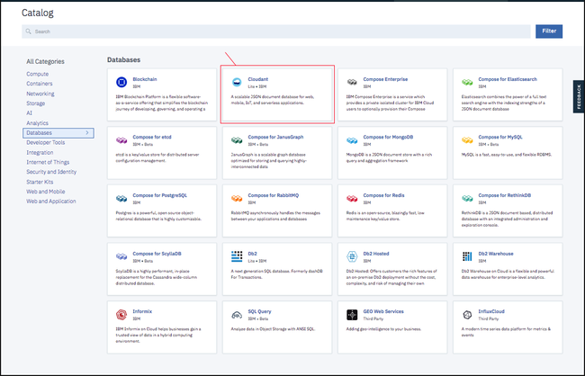
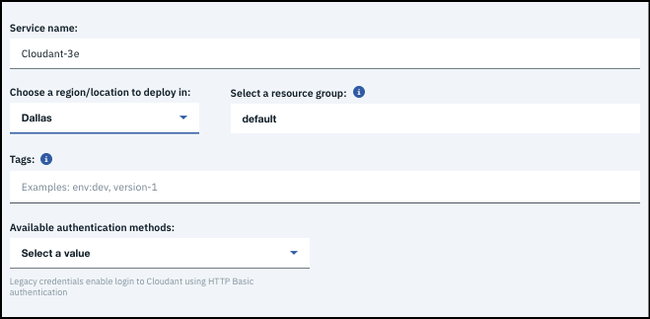

---

copyright:
  years: 2015, 2018
lastupdated: "2018-10-24"

---

{:new_window: target="_blank"}
{:shortdesc: .shortdesc}
{:screen: .screen}
{:codeblock: .codeblock}
{:pre: .pre}
{:tip: .tip}

<!-- Acrolinx: 2017-05-10 -->


# Criando e alavancando uma instância de plano de Hardware dedicado do {{site.data.keyword.cloudant_short_notm}} no {{site.data.keyword.cloud_notm}}

Este tutorial mostra como criar uma instância do plano de Hardware dedicado do {{site.data.keyword.cloudantfull}} que usa o painel do {{site.data.keyword.cloud}} e mostra como provisionar subsequentemente uma ou mais instâncias do plano Padrão para serem executadas nela usando o Catálogo do {{site.data.keyword.cloud_notm}} ou a CLI do {{site.data.keyword.cloud_notm}}. 

A criação de uma instância do plano Dedicated
Hardware do {{site.data.keyword.cloudant_short_notm}} resulta no fornecimento
de um ambiente do {{site.data.keyword.cloudant_short_notm}} no hardware dedicado para seu uso exclusivo. Uma instância de serviço é criada no painel do {{site.data.keyword.cloud_notm}}, mas não é possível acessar a instância do plano de Hardware dedicado diretamente e não haverá nenhuma Credencial de serviço para ela. É possível usar uma instância do plano Dedicated
Hardware do {{site.data.keyword.cloudant_short_notm}}
após ela ser criada pelo fornecimento de uma ou mais instâncias de plano
Standard nela.

## Criando uma instância de plano Dedicated Hardware do {{site.data.keyword.cloudant_short_notm}}

1.  Efetue login em sua conta do {{site.data.keyword.cloud_notm}}.<br/>
    O painel do {{site.data.keyword.cloud_notm}} pode ser localizado em:
[http://bluemix.net ](http://bluemix.net){:new_window}.
    Após a autenticação com seu nome de usuário e senha,
será apresentado o painel do {{site.data.keyword.cloud_notm}}:<br/>
    

2.  Clique no botão  ` Criar Recurso ` :<br/>
    <br/>
    
3.  Consulte o catálogo do {{site.data.keyword.cloud_notm}} e os serviços que estão disponíveis. Clique na categoria `Bancos de dados`.
    

4.  Clique no serviço {{site.data.keyword.cloudant_short_notm}}:<br/>
    <br/>
    A página para criar um serviço aparece.

5.  Selecione o plano `Hardware dedicado` na lista de planos de precificação na parte inferior da página:<br/>
    
    
6.  Preencha os parâmetros a seguir na parte superior da página: <br/>
    -   Insira um nome de serviço.<br/>
    -   Especifique a região/o local em que deseja implementar.<br/>
    -   Selecione um grupo de recursos.</br>
    -   Selecione um local para implementação.<br/>
    -   Selecione `sim` ou `não` para responder se HIPAA é necessário.<br/>
   
    HIPAA é válido apenas para locais dos EUA. O {{site.data.keyword.IBM}} pode fornecer um cluster Dedicado ou Bare Metal para implementar controles HIPAA. Um cluster é fornecido apenas na confirmação de um Contrato de associação de negócios (BAA) que é estabelecido com o {{site.data.keyword.IBM_notm}}. Esse contrato é descrito nos termos de Descrição de serviço. Fornecer um cluster para gerenciar dados HIPAA pode levar mais tempo do que o período estimado de 5 dias.
    {: tip}
    
    Implemente e provisione instâncias de plano Padrão na mesma região e espaço.
    {: tip}

    
        
7.  Clique no botão `Criar` para iniciar o processo de fornecimento. <br/>

    O faturamento é rateado diariamente para se certificar de que deseja provisionar e pagar por um ambiente antes de clicar no botão **Criar**.
    {: tip}

    

    Durante o fornecimento, uma roda giratória aparece ao lado da instância em seu painel do {{site.data.keyword.cloud_notm}}. Uma solicitação é enviada para provisionar uma instância do plano Hardware dedicado nos
    servidores bare metal. O tempo de fornecimento é assíncrono e pode levar até 5 dias.
    {: tip}   

    
    
## Provisionando uma instância do plano Padrão em um ambiente de Hardware dedicado

1.  Efetue login em sua conta do {{site.data.keyword.cloud_notm}}.<br/>
    O painel do {{site.data.keyword.cloud_notm}} pode ser localizado em:
[http://bluemix.net ](http://bluemix.net){:new_window}.
    Após a autenticação com seu nome de usuário e senha,
será apresentado o painel do {{site.data.keyword.cloud_notm}}:<br/>
    

2.  Clique no botão  ` Criar Recurso ` :<br/>
    <br/>
    Aparece uma lista dos serviços disponíveis no {{site.data.keyword.cloud_notm}}.

3.  Clique na categoria `Bancos de dados` e selecione o serviço `Cloudant`:<br/>
    </br>
    A página para criar um serviço aparece.<br/>  

4.  Clique em  ` Padrão `  a partir dos planos de precificação. <br/>
    
    
    Não é possível provisionar uma instância de plano Lite em um ambiente de Hardware dedicado.
    {: tip}
    
5.  Preencha os parâmetros a seguir: <br/>
    -   Insira um nome de serviço.<br/>
    -   Especifique a região/o local em que deseja implementar. <br/>
    -   Selecione um grupo de recursos. </br>
    -   Selecione um método de autenticação.</br>
    -   Selecione um ambiente.</br>
    
    
6.  Clique no botão  ` Criar ` .<br/>
    Após alguns segundos, a instância é provisionada no ambiente que você selecionou.<br/>
    
    
7.  Obtenha suas Credenciais de serviço e acesse o Painel do {{site.data.keyword.cloudant_short_notm}} tal como você faz para uma instância de diversos locatários do {{site.data.keyword.cloudant_short_notm}}. 
    
    Para obter mais informações, consulte [Como localizar suas credenciais de serviço](../tutorials/create_service.html#locating-your-service-credentials){:new_window}. 
    
## Provisionando uma instância do plano Padrão em um ambiente de Hardware dedicado com a CLI do {{site.data.keyword.cloud_notm}}

Para usar a CLI do {{site.data.keyword.cloud_notm}}, o login deve estar efetuado. Para obter mais informações sobre como efetuar login e configurar um grupo de recursos de destino, consulte [Efetuando login em sua conta {{site.data.keyword.cloud_notm}}](create_service_cli.html#logging-in-to-your-ibm-cloud-account){:new_window}. 

Para criar uma instância de plano {{site.data.keyword.cloudant_short_notm}} Padrão em seu ambiente de plano de Hardware dedicado do {{site.data.keyword.cloudant_short_notm}}, o formato de comando básico é o seguinte:


Campo | Descrição
------|------------
`NAME`| Um nome arbitrário que você designa à instância.
`SERVICE_NAME` | ` cloudantnosqldb `
`PLAN_NAME` | Plano padrão
`LOCATION` |  O local no qual você deseja implementar, por exemplo, Sul dos EUA, Leste dos EUA ou UE - Grã-Bretanha. 

Consulte o seguinte comando de exemplo: 

```sh
ibmcloud resource service-instance-create NAME SERVICE_NAME SERVICE_PLAN_NAME LOCATION [-p, --parameters @JSON_FILE | JSON_STRING ]
```

As instâncias do {{site.data.keyword.cloudant_short_notm}} que são implementadas em ambientes de Hardware dedicados levam mais dois parâmetros:

Parâmetro | Descrição
----------|------------
`environment_crn` | Esse parâmetro deve ser configurado para o CRN da instância do plano de Hardware dedicado do {{site.data.keyword.cloudant_short_notm}}. É possível determinar o que o CRN é ao consultar o comando da CLI de exemplo na guia Gerenciar da instância do plano de Hardware dedicado do {{site.data.keyword.cloudant_short_notm}} no Painel do {{site.data.keyword.cloud_notm}}. Ou é possível determinar o que o CRN é usando o comando `ibmcloud resource service-instance SERVICE_INSTANCE_NAME`. 
`legacyCredentials` | Um parâmetro opcional padronizado como true e que determina se a instância usa credenciais anteriores e do IAM ou somente credenciais do IAM. Consulte o [guia do IAM ](../guides/iam.html#ibm-cloud-identity-and-access-management-iam-){:new_window} para obter mais detalhes sobre a escolha de um método de autenticação.

Consulte o seguinte comando de exemplo: 

```sh
ibmcloud resource service-instance-create cloudant_on_ded_hardware_cli cloudantnosqldb standard us-south -p '{"environment_crn":"crn:v1:bluemix:public:cloudantnosqldb:us-south:a/b43434444bb7e2abb0841ca25d28ee4c:301a3118-7678-4d99-b1b7-4d45cf5f7b29::","legacyCredentials":false}'
```
     
