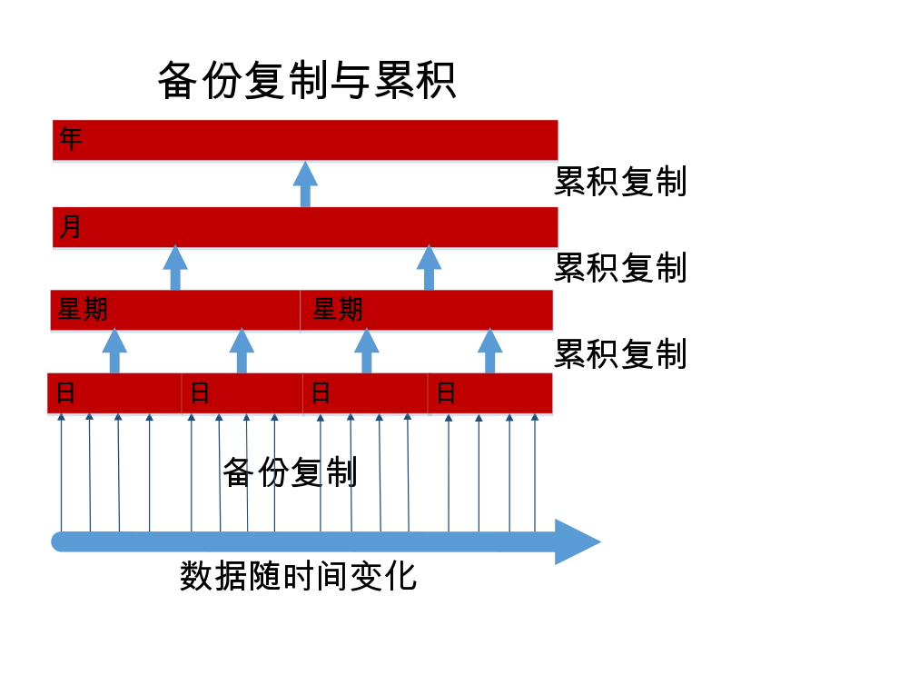

---

copyright:
  years: 2015, 2017
lastupdated: "2017-05-04"

---

{:new_window: target="_blank"}
{:shortdesc: .shortdesc}
{:screen: .screen}
{:codeblock: .codeblock}
{:pre: .pre}

# 备份数据

>   **注**：本指南描述了*不推荐使用*的每日增量备份功能。
先前，此功能仅在企业客户请求时提供。有关最新的备份指导信息，请参阅[灾难恢复和备份](disaster-recovery-and-backup.html)指南。
此功能：
-   缺省情况下未启用。
-   仅供特别请求此功能的企业客户使用。
-   必须显式配置后方可正常运行。
-   存在[已知限制](#known-limitations)。
-   不适用于 [Cloudant Local ](https://www.ibm.com/support/knowledgecenter/SSTPQH_1.0.0/com.ibm.cloudant.local.doc/SSTPQH_1.0.0_welcome.html){:new_window}。有关更多信息，请联系 [IBM Cloudant 支持团队 ](mailto:support@cloudant.com){:new_window}。

>   **注**：每日增量备份功能不适用于
    [Cloudant Local ](https://www.ibm.com/support/knowledgecenter/SSTPQH_1.0.0/com.ibm.cloudant.local.doc/SSTPQH_1.0.0_welcome.html){:new_window}。要在 Cloudant Local 中备份数据，请使用[复制](../api/replication.html)来生成数据库副本。
为了确保高可用性，{{site.data.keyword.cloudant}} 会为每个文档创建三个副本，并将其存储在集群中的三个不同服务器上。此实践是所有 Cloudant 用户的缺省设置。但即便将数据复制了三份，对其进行备份也仍然很重要。

为什么备份很重要呢？通常，可能会因多种原因而无法访问数据。例如，如果飓风毁坏了数据中心，而所有三个节点都位于该位置，那么数据会丢失。您可以通过将数据复制到不同地理位置的集群（专用或多租户）来防止在灾难中丢失数据。但是，如果发生故障的应用程序删除或覆盖了数据库中的数据，那么重复的数据也无济于事。

如果拥有经过测试的全面备份，您就能信心十足地回答以下问题：“数据丢失或损坏时，该如何复原数据？”

通过 Cloudant，企业客户可以拥有每日增量备份。

如果您不是企业客户，或者希望创建自己的备份机制，请考虑[使用复制执行备份](disaster-recovery-and-backup.html)。

>   **注**：目前，面向企业客户的每日增量备份是 *Beta* 功能。
缺省情况下，未启用此功能。

每日增量备份（即“变化量”）支持文档比较，并且支持更轻松地复原单个文档。较小的每天变化量会定期（时间间隔可配置）累积到每周变化量中。同样，每周变化量会累积到每月变化量，每月变化量会累积到每年变化量。这种变化量累积过程是很实用的折衷过程，能在完全复原文档的正确版本和需要大量存储空间之间保持平衡。

备份工具支持手动复原个别文档。如果希望复原整个数据库（例如，作为灾难恢复方案的一部分），那么可以联系支持团队，根据拥有的可用变化量，将数据复原到特定日期、周、月或年。

本主题的其余部分提供了有关 Cloudant 如何备份数据的更多信息。要获取进一步的帮助或请求启用数据备份，请联系 Cloudant 支持团队：[support@cloudant.com ](mailto:support@cloudant.com){:new_window}。

>   **注**：Cloudant 备份工具仅可供企业客户使用。

>   **注**：缺省情况下，
    不会备份 `_design` 文档，因此_不会_在增量备份数据库上构建索引。如果需要 `_design` 文档的备份，那么必须在首选的源代码控制工具中对其进行维护。

## 概念

在描述备份概念时，了解以下术语会很有帮助：

术语                 | 含义
---------------------|--------
备份清除             | 已累积变化量数据库时，将在可配置的时间段之后除去该变化量数据库。这样您可以平衡高详细程度的数据保留时间与存储成本。
备份累积             | 每日备份将合并到每周累积的数据库。这些备份将每天的变化量合并成一个较粗颗粒度（详细程度较低）的备份。同样，每周数据库会累积到每月数据库，每月数据库会累积到每年数据库。
备份运行             | 对于某个备份时间段，将使用序列值来复制源数据库，以确定在该备份时间段内更改的文档。完成时，此复制被称为每日备份。
基线备份             | 文档的集合，可以将变化量数据库与该集合进行比较。
每日备份             | 请参阅“备份运行”。
每日变化量           | 每日备份的另一个名称。
变化量数据库         | 在一段时间内更改的文档的集合（“变化量”）。
高/低详细程度        | 这指示可以指定多么精确的文档更改时间段。高详细程度累积的更改时间段的时间刻度短，例如，对于每日备份，刻度为天。低详细程度累积的更改时间段的时间刻度长，例如，对于每年备份，刻度为年。
增量备份             | 自上次备份以来，数据库中已更改的文档的集合。
累积                 | 将一组增量备份聚集到较低详细程度的备份中，例如将一周中的每日备份聚集到单个“每周”备份中。

## 增量备份

启用增量备份的第一步是对整个数据库进行完全备份。这将为后续增量备份提供“基线”。

每天，在首次“基线”备份之后，将执行每日增量备份。此每日增量备份仅包含自上次备份以来数据库中已更改的数据。每日备份是“每日变化量”。

在启用数据备份的请求中，可以指定一天中要运行备份的时间。每日变化量会每天在指定的时间创建。

## 累积

累积将每日备份合并到每周累积数据库。这些累积数据库将每日变化量合并到一个较粗颗粒度（或“详细程度较低”）的时间片中。每周数据库会累积到每月数据库，每月数据库会累积到每年数据库。



请求启用备份时，应该指定要保留的每日变化量数。一旦达到此数字后，最早的每日变化量将累积到最新的每周数据库中。之后，每周数据库将进行累积以创建每月数据库，依此类推。

一旦累积了变化量数据库，就会除去这些数据库以释放存储空间。

## 复原

如果您拥有数据库的备份，可以查看该数据库中的单个文档，还可以查看对该文档所做的更改。如果该文档有特定日期的最新版本并在变化量详细程度内可用，那么还可以将文档复原到该版本。

>   **注**：从备份复原之前，文档必须是静态的。
换言之，文档不应在持续接收更改和更新。

对于更复杂的复原（例如，完全数据库复原），请向 [Cloudant 支持 ](mailto:support@cloudant.com){:new_window} 请求帮助。

## 使用仪表板

企业客户可以使用 Cloudant 仪表板来查看备份的状态和历史记录。

可以执行的任务包括：

-   查看上次备份的状态，包括其日期和时间。
-   按日期和时间查看备份文档版本的列表。
-   查看当前文档及其与任何已备份版本之间的差异。
-   从备份的版本复原文档。

### 查看数据库备份状态


在 Cloudant 仪表板中选择“数据库”选项卡时，可以看到每个数据库的备份状态列。

### 查看文档备份状态


在数据库中，可以查看特定文档的备份状态。为此，请首先检查文档是否有“备份”图标 ()。此图标表明特定文档是否包含在备份任务中。

选择文档时，可以看到“备份”选项卡。


### 查看文档备份版本之间的差异以及复原


单击文档的“备份”选项卡时，可以看到文档的当前版本和其他任何备份版本之间的差异。

如果决定要复原该文档的特定备份版本，只需选择要复原的备份日期，然后单击“复原”按钮。

>   **注**：在从备份复原之前，文档必须处于稳定状态。
换言之，文档不应在持续接收更改和更新。

## 使用 API

有若干 REST API 调用可用于使用 Cloudant 备份工具。

### 任务配置

`task` 调用用于获取用户的备份任务配置。

可以使用 `format` 参数来指定响应中使用的格式。

_使用 HTTP 请求用户备份任务配置的示例，结果以列表格式（缺省值）返回：_

```http
GET /_api/v2/backup/task HTTP/1.1
```
{:codeblock}

_使用命令行请求用户备份任务配置的示例，结果以列表格式（缺省值）返回：_

```sh
curl https://$ACCOUNT.cloudant.com/_api/v2/backup/task \
    -X GET
```
{:codeblock}

_使用 HTTP 请求用户备份任务配置的示例，结果以映射格式返回：_

```http
GET /_api/v2/backup/task?format=mapping HTTP/1.1
```
{:codeblock}

_使用命令行请求用户备份任务配置的示例，结果以映射格式返回：_

```sh
curl https://$ACCOUNT.cloudant.com/_api/v2/backup/task?format=mapping \
     -X GET
```
{:codeblock}

缺省响应格式为列表。可以使用 `...backup/task?format=list` 参数直接请求此格式。响应包含为用户定义的备份任务的简单列表。

例如，可以使用以下任一命令来请求列表格式响应：

```http
https://$ACCOUNT.cloudant.com/_api/v2/backup/task

https://$ACCOUNT.cloudant.com/_api/v2/backup/task?format=list
```
{:codeblock}

_列表格式请求后的示例响应：_

```json
{
    "rows": [
        {
            "username": "$ACCOUNT",
            "task": "backup-0d0b0cf1b0ea42179f9c082ddc5e07cb",
            "source_db": "backmeup",
            "latest_completion": null
        },
        {
            "username": "$ACCOUNT",
            "task": "backup-d0ea6e8218074699a562af543db66615",
            "source_db": "backuptest",
            "latest_completion": "2016-01-17T05:57:44+00:00"
        },
        {
            "username": "$ACCOUNT",
            "task": "backup-24cd8359b94640be85b7d4071921e781",
            "source_db": "taskdb",
            "latest_completion": "2016-01-17T00:01:04+00:00"
        }
    ]
}
```
{:codeblock}

映射格式中提供了更全面的响应。可以使用 `...backup/task?format=mapping` 参数直接请求此格式。

例如，可以使用以下命令来请求映射格式响应：

```http
https://$ACCOUNT.cloudant.com/_api/v2/backup/task?format=mapping
```
{:codeblock}

_映射格式请求后的示例响应：_

```json
{
    "backmeup": {
        "username": "$ACCOUNT",
        "task": "backup-0d0b0cf1b0ea42179f9c082ddc5e07cb",
        "source_db": "backmeup",
        "latest_completion": null
    },
    "backuptest": {
        "username": "$ACCOUNT",
        "task": "backup-d0ea6e8218074699a562af543db66615",
        "source_db": "backuptest",
        "latest_completion": "2016-01-17T05:57:44+00:00"
    },
    "taskdb": {
        "username": "$ACCOUNT",
        "task": "backup-24cd8359b94640be85b7d4071921e781",
        "source_db": "taskdb",
        "latest_completion": "2016-01-17T00:01:04+00:00"
    }
}
```
{:codeblock}

### 确定特定数据库的备份任务

`task` 请求的 `databases` 参数用于查找与指定数据库关联的备份任务。

响应会列出 `source_db` 字段中标识的数据库的备份任务详细信息。所标识的 `task` 可以用于其他备份 API 调用，例如[数据库列表](#list-of-databases)。

_使用 HTTP 查找 `backuptest` 和 `taskdb` 数据库的备份任务的示例命令：_

```http
GET /_api/v2/backup/task?databases=backuptest,taskdb HTTP/1.1
```
{:codeblock}

_使用命令行查找 `backuptest` 和 `taskdb` 数据库的备份任务的示例命令：_

```sh
curl https://$ACCOUNT.cloudant.com/_api/v2/backup/task?databases=backuptest,taskdb \
    -X GET
```
{:codeblock}

_查找特定数据库的备份任务的示例响应：_

```json
{
    "rows": [
        {
            "username": "$ACCOUNT",
            "task": "backup-d0ea6e8218074699a562af543db66615",
            "source_db": "backuptest",
            "latest_completion": "2016-01-17T05:57:44+00:00"
        },
        {
            "username": "$ACCOUNT",
            "task": "backup-24cd8359b94640be85b7d4071921e781",
            "source_db": "taskdb",
            "latest_completion": "2016-01-17T00:01:04+00:00"
        }
    ]
}
```
{:codeblock}

### 数据库列表

`monitor` 请求用于获取由备份任务 `$TASKNAME` 创建的数据库的列表，这些数据库也包含文档 `$DOCID`。

该请求支持可选参数：`include_docs`。缺省值为 `false`。如果设置为 `true`，那么 `monitor` 请求会返回包含 `$DOCID` 的每个备份数据库的完整文档内容。

_使用 HTTP 检索备份任务创建的包含特定文档的数据库列表：_

```http
GET /_api/v2/backup/monitor/$TASKNAME/$DOCID?include_docs=true HTTP/1.1
```
{:codeblock}

_使用命令行检索备份任务创建的包含特定文档的数据库列表：_

```sh
curl https://$ACCOUNT.cloudant.com/_api/v2/backup/monitor/$TASKNAME/$DOCID?include_docs=true \
    -X GET
```
{:codeblock}

### 复原文档

`restore` 调用用于替换源数据库中 `$DOCID` 标识的文档。源数据库由 `$TASKNAME` 标识。`$TASKDATE` 是特定备份的时间戳记，用于指定执行备份的时间。`$FREQUENCY` 是以下四个值之一：
-   `"daily"`
-   `"weekly"`
-    `"monthly"`
-   `"yearly"`

>   **注**：在从备份复原之前，文档必须处于稳定状态。
换言之，文档在进行恢复期间不应接收任何更改和更新。

_使用 HTTP 请求复原文档的示例：_

```http
POST /_api/v2/backup/restore/document --data=@RESTORE.json HTTP/1.1
Content-Type: application/json
```
{:codeblock}

_使用命令行请求从特定备份数据库中保存的最新版本复原文档的示例：_

```sh
curl https://$ACCOUNT.cloudant.com/_api/v2/backup/restore/document --data=@RESTORE.json \
    -X POS \
    -H "Content-Type: application/json" \
    -d "$JSON"
```
{:codeblock}

_用于请求从特定备份数据库中保存的最新版本复原文档的 JSON 文档示例：_

```json
{
    "doc_id": $DOCID,
    "task_name": $TASKNAME,
    "task_date": $TASKDATE,
    "frequency": $FREQUENCY
}
```
{:codeblock}

## 如何使用增量复制进行备份

一种非常简单的备份形式是将数据库[复制](../api/replication.html)到指定日期的备份数据库。

此方法很有效且易于操作。但是，如果数据库很大，并且您需要多个时间点的备份（例如，7 个每日备份和 4 个每周备份），那么最终会在每个新的备份数据库中存储所有文档的完整副本。这很可能需要大量存储空间。

增量备份是一个不错的解决方案，用于仅存储自上次备份以来更改过的文档。

初始，应执行整个数据库的备份。在首次备份后，即可定期运行增量备份，以仅备份自上次备份以来数据库中更改的内容。通常，这些增量备份每天执行一次，因此这种复制是每日备份。

增量备份仅保存备份之间的变化量。源数据库会定期复制到目标数据库。复制使用序列值来确定在时间间隔期间更改的文档。

备份操作使用复制来获取和存储检查点。此检查点是具有内部名称的另一个数据库。

数据库的复制过程会首先查找 `since_seq` 参数的值。此参数指示上次复制的完成位置。

>   **注**：根据定义，使用 `since_seq` 选项会禁用常规复制检查点工具。因此，请谨慎使用 `since_seq`。 

以下步骤概述了如何创建增量备份：

1.  [查找上次复制的检查点文档的标识](#find-the-id-of-the-checkpoint-document-for-the-last-replication)。
2.  [获取 `record_seq` 值](#get-the-recorded_seq-value)。
3.  [运行增量备份](#run-an-incremental-backup)。

### 查找上次复制的检查点文档的标识

检查点标识值存储在 `_replicator` 数据库中复制文档的 `_replication_id` 字段中。

_使用 HTTP 请求获取数据库 `original` 上次增量备份的检查点标识的示例：_

```http
GET /_replicator/original HTTP/1.1
```
{:codeblock}

_使用命令行请求获取数据库 `original` 上次增量备份的检查点标识的示例：_

```sh
replication_id=$(curl "${url}/_replicator/original" | jq -r '._replication_id')
```
{:pre}

### 获取 `record_seq` 值

获取检查点标识后，使用该标识从 original 数据库中 `/_local/${replication_id}` 文档内 history 数组的第一个元素获取 `recded_seq` 值。

_使用 HTTP 从数据库 `original` 获取 `recded_seq` 值的示例：_

```http
GET /original/_local/${replication_id} HTTP/1.1
```
{:codeblock}

_使用命令行从数据库 `original` 获取 `recded_seq` 值的示例：_

```sh
recorded_seq=$(curl "${url}/original/_local/${replication_id}" | jq -r '.history[0].recorded_seq')
```
{:pre}

### 运行增量备份

现在，您已具有检查点标识和 `record_seq`，可以启动新的增量备份。

_使用 HTTP 向增量数据库 `newbackup` 启动新的增量备份的示例：_

```http
PUT /_replicator/newbackup HTTP/1.1
Content-Type: application/json
```
{:codeblock}

_使用命令行向增量数据库 `newbackup` 启动新的增量备份的示例：_

```sh
curl -X PUT "${url}/_replicator/newbackup" -H "${ct}" -d @newbackup.json
```
{:codeblock}

_用于指定增量备份的 JSON 文件的示例：_

```json
{
    "_id": "newbackup",
    "source": "${url}/original",
    "target": "${url}/newbackup",
    "since_seq": "${recorded_seq}"
}
```
{:codeblock}

## 已知限制

>   **注**：目前，面向企业客户的每日增量备份是 Beta 功能。
缺省情况下，未启用此功能。

-   IBM Cloudant Backup 及关联的复原功能基于底层复制技术。影响甚至中断复制的因素也将影响甚至停止备份或复原过程。
-   对于大型数据库（例如，大小超过 100 GB），备份和复原过程可能需要大量时间。此限制适用于初始备份，对于大型数据库，可能需要几天时间才能完成。同样，复原过程也可能需要几小时到数天不等，具体取决于数据库的大小。
-   对于大型每日备份，很可能备份过程无法在一天（24 小时）内完成。备份过程通常会一直运行直到完成，因此将包含一天以上的增量更改。
-   目前，不支持备份完整用户帐户。必须改为指定用户帐户中要启用备份或复原的每个数据库。目前，在任一用户帐户中，启用备份的数据库限制为不超过 50 个。
-   目前，IBM Cloudant Backup 工具不支持[设计文档](../api/design_documents.html)的备份或复原。如果需要设计文档的备份，那么必须在首选的源代码控制工具中对其进行维护。
-   目前，用于执行数据库复原的目标数据库必须与原始源数据库不同。
