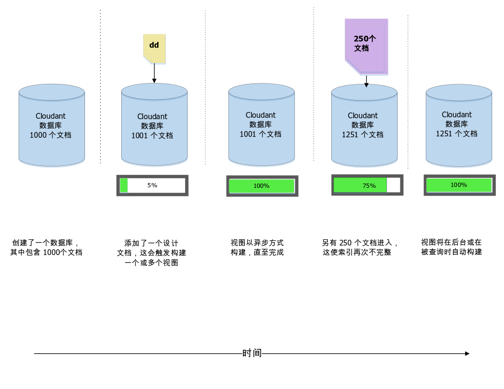
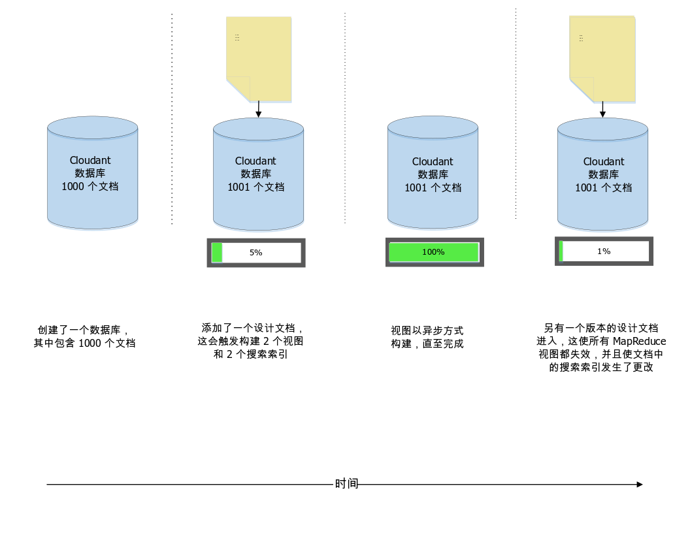
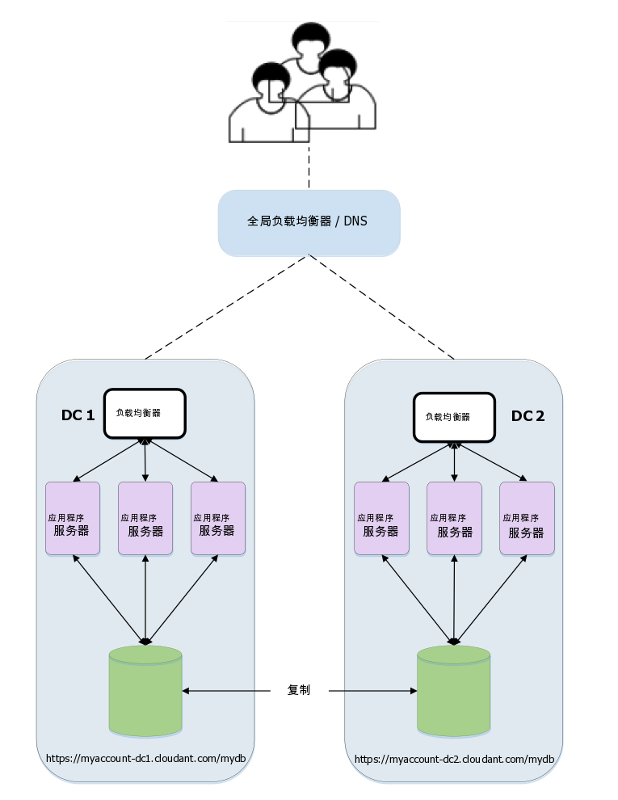

---

copyright:
  years: 2015, 2018
lastupdated: "2018-06-07"

---

{:new_window: target="_blank"}
{:shortdesc: .shortdesc}
{:screen: .screen}
{:codeblock: .codeblock}
{:pre: .pre}

# 设计文档管理

*本文由 IBM Cloudant 开发技术推广工程师 Glynn Bird ([glynn@cloudant.com ](mailto:glynn@cloudant.com){:new_window}) 投稿*

{{site.data.keyword.cloudantfull}} 的可扩展 JSON 数据存储具有多种查询机制，所有这些机制都将生成独立于核心数据进行创建和维护的索引。建立索引的操作不会在保存文档时立即执行，而是会安排在日后执行，从而实现更快、无阻塞的写入吞吐量。

-   MapReduce 视图是数据集内的索引，其中键值对存储在 B 型树中，以便通过键或键范围进行高效检索
-   搜索索引是使用 Apache Lucene 构造的，允许自由文本搜索、刻面和复杂的特别查询

{{site.data.keyword.cloudant_short_notm}} 的[搜索索引](../api/search.html)和 [MapReduce 视图](../api/creating_views.html)通过向数据库添加设计文档进行配置。设计文档是 JSON 文档，其中包含有关将如何构建视图或索引的指示信息。下面举一个简单的例子。假定有一个简单的数据文档集合，类似于以下示例。

_简单数据文档的示例：_

```json
{
    "_id": "23966717-5A6F-E581-AF79-BB55D6BBB613",
    "_rev": "1-96daf2e7c7c0c277d0a63c49b57919bc",
    "doc_name": "Markdown Reference",
    "body": "Lorem Ipsum",
    "ts": 1422358827
}
```
{:codeblock}

每个数据文档都包含一个名称、一个主体和一个时间戳记。我们希望创建 [MapReduce 视图](../api/creating_views.html)来按时间戳记对文档排序。

为此，我们创建了 Map 函数，类似于以下示例。

_用于返回文档的时间戳记字段（如果存在）的示例 map 函数：_

```javascript
function(doc) {
    if (doc.ts) {
        emit( doc.ts, null);
    }
}
```
{:codeblock}

此函数会发出文档的时间戳记，以便我们可以将其用作索引的键；因为我们不关心索引中的值，所以发出了 `null`。这样做的效果是提供了文档集内按时间排序的索引。

接下来我们会将此视图称为“`by_ts`”，并将其放入名为“`fetch`”的设计文档中，类似于以下示例。

_使用 map 函数定义视图的示例设计文档：_

```json
{
    "_id": "_design/fetch",
    "views": {
      "by_ts": {
        "map": "function(doc) {
          if (doc.ts) {
            emit( doc.ts, null);
          }
        }"
      }
    },
    "language": "javascript"
}
```
{:codeblock}

结果是，map 代码已转换为符合 JSON 的字符串，并且包含在设计文档中。

一旦保存了设计文档后，{{site.data.keyword.cloudant_short_notm}} 就会触发服务器端进程来构建 `fetch/by_ts` 视图。为此，Cloudant 对数据库中的每个文档执行迭代，然后将每个文档发送给 JavaScript map 函数。此函数会返回发出的键/值对。随着迭代继续，每个键/值对都会存储在 B 型树索引中。首次构建索引之后，后续重建索引操作将仅对新文档和更新后的文档执行。对于删除的文档，会除去其索引。这种省时的过程称为*增量 MapReduce*，如下图中所示：



此时应牢记的一点是：

-   索引构造是异步发生的。{{site.data.keyword.cloudant_short_notm}} 会确认设计文档是否已保存，但要检查索引构造的进度，必须轮询 {{site.data.keyword.cloudant_short_notm}} 的 [`_active_tasks`](../api/active_tasks.html) 端点。
-   拥有的数据越多，建立索引所需的时间就越长。
-   在初始索引构建正在进行的过程中，_将阻止针对该索引的任何查询_。
-   查询视图会触发对任何尚未以增量方式建立索引的文档执行“映射”。这可确保获得数据的最新视图。请参阅以下[“`stale`”参数](#stale)讨论，以了解此规则的例外情况。

## 同一设计文档中的多个视图

如果在同一个设计文档中定义多个视图，那么这些视图将以高效方式同时构建。每个文档只读取一次，并通过每个视图的 Map 函数传递。此方法的缺点是，修改设计文档会使该文档中定义的_所有现有 MapReduce 视图失效_，即便其中某些视图保持不变也是如此。 

如果 MapReduce 视图必须相互独立地进行变更，请将其定义放在单独的设计文档中。 

>   **注**：此行为不适用于 Lucene 搜索索引。
这种索引可以在同一设计文档中变更，而不会使同一文档中的其他未更改索引失效。




## 管理对设计文档的更改

假设在未来某个时候，我们决定更改视图的设计。这次，我们只对关心满足条件的文档数量统计，而不关心返回实际的时间戳记结果。为此，map 函数保持不变，但现在使用的 _reduce_ 为 "`_count`"。这样做的效果是设计文档类似于以下示例。

_使用 reduce 函数的示例设计文档：_

```json
{
    "_id": "_design/fetch",
    "_rev": "2-a2324c9e74a76d2a16179c56f5315dba",
    "views": {
        "by_ts": {
            "map": "function(doc) {
                if (doc.ts) {
                  emit( doc.ts, null);
                }
            }
        }",
        "reduce": "_count"
    },
    "language": "javascript"
}
```
{:codeblock}

保存此设计文档时，{{site.data.keyword.cloudant_short_notm}} 会使旧索引完全失效，并从头开始构建新索引，依次对每个文档进行迭代。与原始构建一样，所用时间取决于数据库中的文档数，并且会阻塞对该视图的入局查询，直到完成索引为止。

但有一个问题：

如果有一个应用程序正在_实时_访问此视图，那么我们很有可能会遇到部署困境：

-   依赖于原始设计文档的代码 V1 可能不再有效，因为旧视图已失效。
-   使用新设计文档的代码 V2 无法立即发布，因为新视图尚未完成构建，尤其是在数据库中有许多文档的情况下。
-   影响代码的一个更细微的问题是，V1 和 V2 预期从视图中生成不同的结果数据：V1 预期的是匹配文档的列表，而 V2 预期的是“减少的”结果数。

## 协调对设计文档的更改

有两种方法可用于处理此更改控制问题。

### 版本化的设计文档 

我们的解决方案是使用版本化的设计文档名：

-   最初，代码编写为使用名为 `_design/fetchv1` 的视图。
-   要发布新版本时，我们会创建名为 `_design/fetchv2` 的新视图，并查询该视图以确保它开始构建。
-   我们会一直轮询 `_active_tasks`，直至构建新索引的工作完成。
-   现在，我们已准备好发布依赖于第二个视图的代码。
-   确定不再需要 `_design/fetchv1` 时，将其删除。

使用版本化的设计文档是在设计文档中管理更改控制的一种简单方法，只要您记得日后除去旧版本即可！

### “移动并切换”设计文档

另一种方法（在[此处 ](http://wiki.apache.org/couchdb/How_to_deploy_view_changes_in_a_live_environment){:new_window} 记录）依赖于以下前提条件：{{site.data.keyword.cloudant_short_notm}} 能识别到何时有两个完全相同的设计文档，并且不会浪费时间和资源来重建已有的视图。换言之，如果采用设计文档 `_design/fetch` 并创建完全重复的 `_design/fetch_OLD`，那么这两个端点可以互换工作，而不会触发任何重建索引的操作。

切换到新视图的过程如下：

1.  创建要更改的设计文档的重复副本，例如，通过将 `_OLD` 添加到其名称：`_design/fetch_OLD`。
2.  使用后缀为 `_NEW` 的名称，将新的或“传入”设计文档放入数据库中：`_design/fetch_NEW`。
3.  查询 `fetch_NEW` 视图以确保它开始构建。
4.  轮询 `_active_tasks` 端点并等待索引完成构建。
5.  将新设计文档的重复副本放入 `_design/fetch` 中。
6.  删除设计文档 `_design/fetch_NEW`。
7.  删除设计文档 `_design/fetch_OLD`。

## 移动并切换工具

有一个用于自动执行“移动并切换”过程的命令行 Node.js 脚本，名为“`couchmigrate`”。此脚本可以按如下所示进行安装。

_用于安装 Node.js `couchmigrate` 脚本的命令：_

```sh
npm install -g couchmigrate
```
{:codeblock}

要使用 `couchmigrate` 脚本，请首先通过设置名为 `COUCH_URL` 的环境变量来定义 CouchDB/{{site.data.keyword.cloudant_short_notm}} 实例的 URL。

_定义 {{site.data.keyword.cloudant_short_notm}} 实例的 URL：_

```sh
export COUCH_URL=http://127.0.0.1:5984
```
{:codeblock}

该 URL 可以是 HTTP 或 HTTPS，并且可以包含认证凭证。

_使用认证凭证定义 {{site.data.keyword.cloudant_short_notm}} 实例的 URL：_

```sh
export COUCH_URL=https://$ACCOUNT:$PASSWORD@$HOST.cloudant.com
```
{:codeblock}

假定我们有一个 JSON 格式的设计文档存储在文件中，那么可以运行迁移命令。

在此示例中，`db` 指定要更改的数据库的名称，`dd` 指定设计文档文件的路径。

_运行 `couchmigrate` 命令：_

```sh
couchmigrate --db mydb --dd /path/to/my/dd.json
```
{:pre}

此脚本会协调“移动并切换”过程，并等待视图构建完成后再返回。如果传入设计文档与当前使用的设计文档相同，那么此脚本几乎会立即返回。

以下网址提供了脚本的源代码：[https://github.com/glynnbird/couchmigrate ](https://github.com/glynnbird/couchmigrate){:new_window}。

<div id="stale"></div>

## “`stale`”参数

如果索引已完成，但在数据库中添加了新记录，那么索引将安排为在后台更新。下图中显示了数据库的状态：



查询视图时，有三个选项：

-   缺省行为是确保索引是最新的，使用的是数据库中的最新文档，然后再返回应答。查询视图时，{{site.data.keyword.cloudant_short_notm}} 会先对 250 个新文档建立索引，然后返回应答。
-   替代方法是将“`stale=ok`”参数添加到 API 调用。此参数表示“返回已建立索引的数据，不管最新更新”。换言之，使用“`stale=ok`”查询视图时，{{site.data.keyword.cloudant_short_notm}} 会立即返回应答，而无需任何额外的索引重建。
-   另一种替代方法是将“`stale=update_after`”参数添加到 API 调用。此参数表示“返回已建立索引的数据，_并且_对所有新文档重建索引”。换言之，使用“`stale=update_after`”查询视图时，{{site.data.keyword.cloudant_short_notm}} 会立即返回应答，然后安排后台任务对新数据建立索引。

添加“`stale=ok`”或“`stale=update_after`”可能很适合从视图更快获得应答，但数据可能不够新。 

>   **注**：缺省行为是在 {{site.data.keyword.cloudant_short_notm}} 集群中的各节点之间平均分布负载。
如果使用替代选项 `stale=ok` 或 `stale=update_after`，这可能会偏好一部分集群节点，以便从整个最终一致性集返回一致的结果。这意味着“`stale`”参数并不是所有用例的完美解决方案。但是，如果应用程序乐意接受陈旧的结果，那么此参数有助于提供对快速变化的数据集的及时响应。如果数据的变化速率很低，那么添加“`stale=ok`”或“`stale=update_after`”不会带来性能优势，并且可能会在较大的集群上不均匀地分布负载。


请尽可能避免使用 `stale=ok` 或 `stale=update_after`。原因是缺省行为提供了最新的数据，并会在集群中分布数据。如果能使客户端应用程序知道正在进行大型数据处理任务（例如，在定期批量数据更新期间），那么该应用程序可在这些时间内临时切换到 `stale=ok`，之后再还原为缺省行为。

>   **注**：`stale` 选项仍然可用，
但更有用的选项 `stable` 和 `update` 可用，应该改为使用后两个选项。有关更多详细信息，请参阅[访问陈旧视图](../api/using_views.html#accessing-a-stale-view)。
