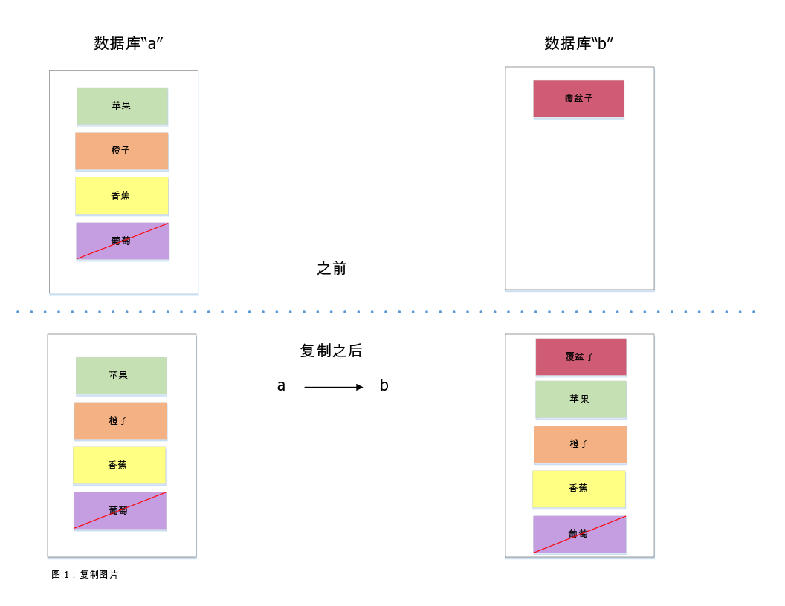
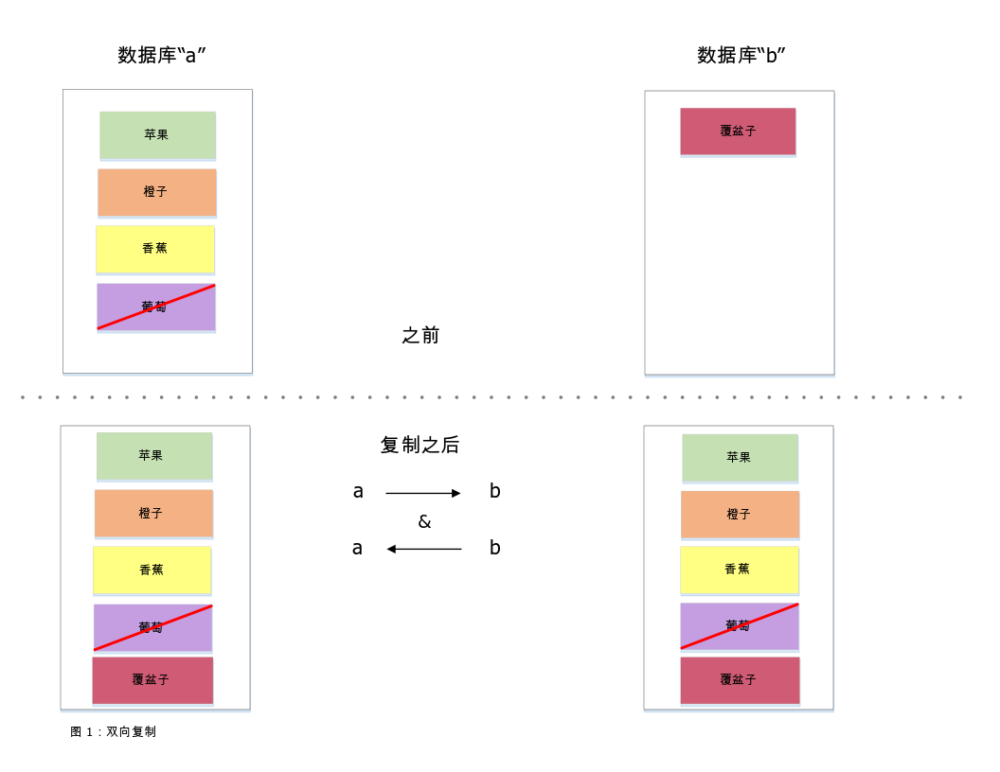

---

copyright:
  years: 2015, 2019
lastupdated: "2019-03-15"

keywords: start replicating with dashboard, run replication across different accounts, run replication on source or destination, start replication with api, checkpoints, permissions, two-way replication, continuous replication, monitoring replication, canceling replication, filtered replication, changes feed, pitfalls, tuning replication speed

subcollection: cloudant

---

{:new_window: target="_blank"}
{:shortdesc: .shortdesc}
{:screen: .screen}
{:codeblock: .codeblock}
{:pre: .pre}
{:tip: .tip}
{:note: .note}
{:important: .important}
{:deprecated: .deprecated}

<!-- Acrolinx: 2017-05-10 -->

# 复制指南
{: #replication-guide}

将数据从一个数据库复制到另一个数据库可以在同一 {{site.data.keyword.cloudantfull}} 帐户内执行，也可以跨帐户和跨数据中心执行。
{: shortdesc}

甚至还可以使用 [{{site.data.keyword.cloudant_short_notm}} Sync ](https://cloudant.com/product/cloudant-features/sync/){: new_window} 或 [PouchDB ](http://pouchdb.com/){: new_window} 将数据复制到 {{site.data.keyword.cloudant_short_notm}} 帐户和移动设备，或从中复制到其他位置。复制可以单向或双向运行，作为“单次”或持续操作运行，也可以使用参数进行微调。

{{site.data.keyword.cloudant_short_notm}} 的复制协议与一系列其他数据库和库相兼容，因此非常适合物联网 (IoT) 和移动应用程序。

本指南介绍了 {{site.data.keyword.cloudant_short_notm}} 的复制功能，讨论了常见的用例，并说明了如何使应用程序能够成功复制。

## 什么是复制？
{: #what-is-replication}

{{site.data.keyword.cloudant_short_notm}} 是一个具有 HTTP API 的分布式 JSON 数据存储。{{site.data.keyword.cloudant_short_notm}} 可以在多种云上或在服务器机架中作为服务运行。文档存储在数据库中，随着 {{site.data.keyword.cloudant_short_notm}} 跨多个节点对数据分片，文档可增大到任意大小。复制是将数据从源数据库复制到目标数据库的过程。源数据库和目标数据库不需要位于同一 {{site.data.keyword.cloudant_short_notm}} 帐户上，甚至不需要位于同一数据中心。



源数据库中每个文档的最新版本传输到目标数据库后，复制即完成。传输包含新文档、对现有文档的更新以及删除项。复制后，只保留文档的最新版本；较旧的版本会舍去。

复制不会改变源数据库，只是会向其写入检查点数据，以允许部分复制从最后一个已知位置恢复。目标数据库中预先存在的所有数据都会保留。

## 如何使用仪表板来启动复制
{: #how-to-start-replication-by-using-the-dashboard}

{{site.data.keyword.cloudant_short_notm}}“仪表板”提供了一个用户界面，可方便地触发复制。单击 {{site.data.keyword.cloudant_short_notm}}“仪表板”上的`复制`选项卡，然后单击`启动复制`。填写以下表单：


出于安全考虑，{{site.data.keyword.cloudant_short_notm}} 团队建议您将 IAM API 密钥或 {{site.data.keyword.cloudant_short_notm}} 旧认证
[API 密钥](/docs/services/Cloudant?topic=cloudant-authorization#api-keys){: new_window}（而不是帐户级别的凭证）用于复制作业。有关更多信息，请参阅
[IAM 指南](/docs/services/Cloudant?topic=cloudant-ibm-cloud-identity-and-access-management-iam-#ibm-cloud-identity-and-access-management-iam-){: new_window}或者旧[认证 API 文档](/docs/services/Cloudant?topic=cloudant-authentication#authentication){: new_window}以及旧[授权 API 文档](/docs/services/Cloudant?topic=cloudant-authorization#authorization){: new_window}。
{: important}

使用该表单定义源数据库和目标数据库，然后单击`启动复制`。


通过单击`复制`选项卡，可以查看每个复制任务的状态。随着每个作业的进展，其状态将从`正在运行`更改为`完成`。


## 如何跨不同 {{site.data.keyword.cloudant_short_notm}} 帐户运行复制
{: #how-to-run-replication-across-different-ibm-cloudant-accounts}

复制的源和目标是 {{site.data.keyword.cloudant_short_notm}} 数据库的 URL，如以下示例所示。

_定义复制的源 URL 和目标 URL 的示例：_

```json
{
    "source": "https://myfirstaccount.cloudant.com/a",
    "target": "https://mysecondaccount.cloudant.com/b"
}
```
{: codeblock}

源和目标不必位于同一帐户上。源和目标数据库名称也无需匹配。您必须有权访问源和目标，并且必须有权写入目标。

## 复制是在源还是在目标上运行？
{: #is-replication-run-on-the-source-or-the-destination}

复制可以在源端启动，也可以在目标端启动。此选项意味着您可以决定是帐户 A 将数据推送到帐户 B，还是帐户 B 从帐户 A 拉取数据。在某些情况下，可能无法通过上述任一配置来运行复制，例如，一个帐户位于防火墙后时。复制通过 HTTP 或 HTTPS 执行，因此无需打开非标准端口。哪个设备启动复制将由您决定。

## 如何使用 {{site.data.keyword.cloudant_short_notm}} API 启动复制
{: #how-to-start-replication-by-using-the-ibm-cloudant-api}

每个 {{site.data.keyword.cloudant_short_notm}} 帐户都有一个名为 `_replicator` 的特殊数据库，可以在其中插入复制作业。将文档添加到 `_replicator` 数据库来启动复制。该文档描述所需的复制，并包含以下字段：

字段            |用途
----------------|--------
`_id`           |提供 `_id` 字段是可选的，但它有助于标识复制任务。如果未提供，{{site.data.keyword.cloudant_short_notm}} 会生成一个值。
`source`        |源 {{site.data.keyword.cloudant_short_notm}} 数据库的 URL，包含登录凭证。
`target`        |目标 {{site.data.keyword.cloudant_short_notm}} 数据库的 URL，包含登录凭证。
`create_target` |（可选）确定在目标数据库尚不存在时是否加以创建。

_使用 HTTP 启动复制作业的示例：_

```http
POST /_replicator HTTP/1.1
Content-Type: application/json
Host: $ACCOUNT.cloudant.com
Authorization: ...
```
{: codeblock}

_使用命令行启动复制作业的示例：_

```sh
curl -X POST \
    -H 'Content-type: application/json' \
    'https://$ACCOUNT.cloudant.com/_replicator' \
    -d '@replication.json'
```
{: codeblock}

_用于描述所需复制的示例 JSON 文档：_

```json
{
    "_id": "weekly_backup",
    "source": "https://$ACCOUNT:$PASSWORD@$ACCOUNT1.cloudant.com/source",
    "target": "https://$ACCOUNT:$PASSWORD@$ACCOUNT2.cloudant.com/destination",
    "create_target": true
}
```
{: codeblock}

## 复制如何影响更改列表？
{: #how-does-replication-affect-the-list-of-changes-}

可以使用 [`_changes` 端点](/docs/services/Cloudant?topic=cloudant-databases#get-changes)来获取对文档所做更改的列表。但是，{{site.data.keyword.cloudant_short_notm}} 数据库的分布式性质意味着 `_changes` 订阅源提供的响应不可能是在特定日期和时间之后所发生更改的简单列表。

[CAP 定理](/docs/services/Cloudant?topic=cloudant-cap-theorem#cap-theorem)讨论内容明确表明 {{site.data.keyword.cloudant_short_notm}} 使用的是“最终一致性”模型。此模型意味着，如果同时请求一个文档的两个不同数据库副本，那么当其中一个数据库副本仍在等待完成复制时，您可能会获得不同的结果。最终，数据库副本会完成其复制，以便对文档的所有更改都反映在每个副本中。

此“最终一致性”模型有两个特征会影响更改列表：

1.  影响文档的更改几乎肯定会在不同时间在数据库的不同副本中执行。
2.  这些更改对文档发生影响的顺序在数据库的不同副本之间可能不同，具体取决于执行复制的时间和位置。

第一个特征的一个结果是，请求更改列表时，请求特定时间点之后的更改列表没有意义。原因是更改列表可能由不同的数据库副本提供，从而产生不同时间的文档更新。但是，请求特定更改（通过使用序列标识来指定）之后的更改列表_是_有意义的。

第一个特征的额外结果是，可能需要“回顾”先前的更改以就更改列表达成一致。换言之，要获取更改列表，您将从数据库副本达成一致的最新更改开始。在 {{site.data.keyword.cloudant_short_notm}} 中，数据库副本之间的一致点使用[检查点](#checkpoints)机制进行确定，该机制支持同步数据库副本之间的复制。

最后，第二个特征的一个结果是，在不同数据库副本所应答的后续请求中，更改列表中显示的各个更改可能会以不同顺序显示。换言之，初始更改列表可能按 `A`、`B`、`C` 的顺序报告更改。但后续更改列表可能按 `C`、`A`、`B` 的顺序报告更改。所有更改都会列出，但顺序不同。造成这种差异的原因是，在复制期间数据库两个不同副本收到更改的顺序可能不同。

### “最终一致性”对更改列表意味着什么
{: #what-eventual-consistency-means-for-the-list-of-changes}

请求更改列表时，获得的响应可能会有所不同，具体取决于是哪个数据库副本提供该列表。

如果使用 `since` 选项来获取特定更新序列标识之后的更改列表，那么您始终会获取该更新之后的更改列表，_并且_还可能获得该更新之前的某些更改。原因是对列表请求作出响应的数据库副本必须确保自己列出与所有副本一致的更改。为了实现这种一致性，数据库副本可能必须使更改列表从所有副本达成一致的点开始。此点通过使用检查点进行确定。

因此，使用 `_changes` 订阅源的应用程序必须具有[“幂等性”](http://www.eaipatterns.com/IdempotentReceiver.html){: new_window}。幂等性是指应用程序必须能够安全地多次接收到相同数据，并且如果重复的请求采用不同顺序，也可做到这一点。

## 检查点
{: #checkpoints}

在内部，复制过程会将其状态写入存储在源数据库和目标数据库中的“检查点”文档中。检查点允许从其停止的位置恢复复制任务，而不必从头开始。通过在请求复制时提供 [`"use_checkpoints": false`](/docs/services/Cloudant?topic=cloudant-replication-api#replication-document-format) 选项，可以阻止创建检查点。如果复制要从最后一个已知位置高效地恢复，那么使此功能保持开启非常有用。

## 许可权
{: #permissions}

要将文档插入到 `_replicator` 数据库中，需要管理访问权。在 source 和 target 参数中提供的登录凭证不需要完全管理许可权。只要凭证能执行以下操作即可：

-   在目标端写入文档。
-   在两端写入检查点文档。

{{site.data.keyword.cloudant_short_notm}} 具有特殊的 `_replicator` 用户许可权。此许可权允许创建检查点文档，但不允许在数据库中创建普通文档。通常，[创建符合以下条件的 API 密钥](/docs/services/Cloudant?topic=cloudant-authorization#creating-api-keys)：

-   具有对源端的 `_reader` 和 `_replicator` 访问权。
-   具有对目标端的 `_reader` 和 `_writer` 访问权。

可以在 {{site.data.keyword.cloudant_short_notm}}“仪表板”中逐个数据库创建和配置 API 密钥。


也可以使用 {{site.data.keyword.cloudant_short_notm}} API [通过编程方式](/docs/services/Cloudant?topic=cloudant-authorization#creating-api-keys)创建 API 密钥。

出于安全考虑，{{site.data.keyword.cloudant_short_notm}} 团队建议您将 IAM API 密钥或 {{site.data.keyword.cloudant_short_notm}} 旧认证
[API 密钥](/docs/services/Cloudant?topic=cloudant-authorization#creating-api-keys){: new_window}（而不是帐户级别的凭证）用于复制作业。有关更多信息，请参阅
[IAM 指南](/docs/services/Cloudant?topic=cloudant-ibm-cloud-identity-and-access-management-iam-#ibm-cloud-identity-and-access-management-iam-){: new_window}或者旧[认证 API 文档](/docs/services/Cloudant?topic=cloudant-authentication#authentication){: new_window}以及旧[授权 API 文档](/docs/services/Cloudant?topic=cloudant-authorization#authorization){: new_window}。
{: important}

## 双向复制
{: #two-way-replication}

可以在一个过程中双向复制数据，此过程称为双向复制或同步。您可通过设置两个单独的复制过程来启用此同步：一个过程将数据从 A 复制到 B，另一个过程将数据从 B 复制到 A。这两个复制过程独立运行，数据在两个方向无缝移动。



## 关于持续复制的讨论
{: #discussion-about-continuous-replication}

到目前为止，讨论仅涉及的是单次复制，它在所有源数据都写入目标数据库之后即完成。通过持续复制，数据可持续流动。对源数据库的所有后续更改都将实时传输到目标数据库。

通过在 {{site.data.keyword.cloudant_short_notm}}“仪表板”中定义复制任务时单击`使此复制成为持续的`复选框，或通过在 {{site.data.keyword.cloudant_short_notm}} API 中设置 [`continuous`](/docs/services/Cloudant?topic=cloudant-replication-api#replication-document-format) 标志，可触发持续复制。

通过设置 `continuous` 标志，可使双向复制在一个方向或两个方向持续进行。

_使用 HTTP 启动持续复制的示例：_

```http
POST /_replicator HTTP/1.1
Content-Type: application/json
Host: $ACCOUNT.cloudant.com
Authorization: ...
```
{: codeblock}

_使用命令行启动持续复制的示例：_

```sh
curl -X POST \
    -H "Content-type: application/json" \
    https://$ACCOUNT.cloudant.com/_replicator \
    -d @continuous-replication.json
```
{: codeblock}

_用于定义持续复制的 JSON 文档的示例：_

```json
{
    "_id": "weekly_continuous_backup",
    "source": "https://$ACCOUNT:$PASSWORD@$ACCOUNT1.cloudant.com/source",
    "target": "https://$ACCOUNT:$PASSWORD@$ACCOUNT2.cloudant.com/destination",
    "continuous": true
}
```
{: codeblock}

## 监视复制状态
{: #monitoring-replication-status}

可以使用仪表板或 API 随时检查 {{site.data.keyword.cloudant_short_notm}} 的 `_replicator` 数据库的状态。

如果复制失败（例如，如果认证凭证无效），那么错误状态将记录在 `_replicator` 文档中。此外，可以使用 {{site.data.keyword.cloudant_short_notm}} 帐户的 [`/_active_tasks` 端点](/docs/services/Cloudant?topic=cloudant-active-tasks#active-tasks)来查看进行中的复制工作。

_使用 HTTP 监视复制过程的示例：_

```http
GET /_replicator/weekly_backup HTTP/1.1
HOST: $ACCOUNT.cloudant.com
Authorization: ...
```
{: codeblock}

_使用命令行监视复制过程的示例：_

```sh
curl 'https://$ACCOUNT.cloudant.com/_replicator/weekly_backup'
```
{: codeblock}

_请求复制状态的示例响应：_

```json
{
    "_id": "weekly_backup",
    "_rev": "22-c57c18f7e761f1a76fa977caa03cd098",
    "source": "https://u:p@myaccount.cloudant.com/a",
    "create_target": false,
    "target": "https://u:p@myaccount.cloudant.com/b",
    "continuous": true,
    "_replication_state": "triggered",
    "_replication_state_time": "2014-12-01T15:19:01+00:00",
    "_replication_id": "4514b08cb4c2ded7da9ab04a87182ceb"
}
```
{: codeblock}

复制时，如果任何文档或附件超出目标上的最大限制，复制将失败。每次文档写入失败都将增加 `doc_write_failures` 中的复制统计计数。因此，强烈建议您监视该字段。

## 取消复制
{: #canceling-replication}

要停止正在进行的复制作业，请使用仪表板或 API 从 `_replicator` 数据库中删除复制文档。

_使用 HTTP 取消复制的示例：_

```http
DELETE /_replicator/weekly_backup?rev=22-c57c18f7e761f1a76fa977caa03cd098 HTTP/1.1
Host: $ACCOUNT.cloudant.com
Authorization:
```
{: codeblock}

_使用命令行取消复制的示例：_

```sh
curl -X DELETE 'https://$ACCOUNT.cloudant.com/_replicator/weekly_backup?rev=22-c57c18f7e761f1a76fa977caa03cd098'
```
{: codeblock}

## 其他复制用例
{: #other-replication-use-cases}

{{site.data.keyword.cloudant_short_notm}} 的复制协议与用于各种现实世界应用的其他数据库和库相兼容。

### Apache CouchDB
{: #apache-couchdb}

[Apache CouchDB ](http://couchdb.apache.org/){: new_window} 是一个开放式源代码数据库，可以与 {{site.data.keyword.cloudant_short_notm}} 进行通信，并且需要的设置极少。应用范围包括：

-   备份：将数据从 {{site.data.keyword.cloudant_short_notm}} 复制到自己的 CouchDB 数据库，并在夜间生成数据快照以用于归档。将数据发送到 [Amazon Glacier ](https://aws.amazon.com/glacier/){: new_window} 之类的备份服务进行保管。
-   本地优先的数据收集：先将数据写入本地 Apache CouchDB，然后将其复制到 {{site.data.keyword.cloudant_short_notm}} 以用于长期存储、聚集和分析。

### PouchDB
{: #pouchdb}

[PouchDB ](http://pouchdb.com/){: new_window} 是一种开放式源代码的浏览器内数据库，支持在浏览器和 {{site.data.keyword.cloudant_short_notm}} 之间双向复制数据。通过在客户端的 Web 浏览器中存储数据，Web 应用程序可以在没有因特网连接的情况下运行。当因特网连接可用时，PouchDB 可以与 {{site.data.keyword.cloudant_short_notm}} 相互同步任何发生更改的数据。从客户端设置复制需要几行 JavaScript 代码。

_使用 PouchDB 启用复制的示例 JavaScript：_

```javascript
var db = new PouchDB("myfirstdatabase");
var URL = "https://u:p@username.cloudant.com/my_database");
db.sync(URL, { live: true });
```
{: codeblock}

### CloudantSync
{: #cloudantsync}

[CloudantSync ](https://cloudant.com/cloudant-sync-resources/){: new_window} 是一组用于 iOS 和 Android 的库，支持在移动设备本地存储数据，并在移动连接允许时将数据与 {{site.data.keyword.cloudant_short_notm}} 同步。与 [PouchDB](#pouchdb) 一样，设置复制需要几行代码。

_使用 CloudantSync 启用复制的示例 JavaScript：_

```javascript
URI uri = new URI("https://u:p@username.cloudant.com/my_database");
Datastore ds = manager.openDatastore("my_datastore");
// Replicate from the local to remote database
Replicator replicator = ReplicatorFactory.oneway(ds, uri);
// Fire-and-forget (there are easy ways to monitor the state too)
replicator.start();
```
{: codeblock}

CloudantSync 在移动应用程序（如 iPhone 和 Android 游戏）中广泛使用，其中应用程序的状态通过复制持久存储到 {{site.data.keyword.cloudant_short_notm}}，但在设备上也提供了该数据以供脱机使用。

## 过滤的复制
{: #filtered-replications}

将一个数据库复制到另一个数据库时，能够在复制过程中除去某些数据会很有用。示例包括：

-   除去对已删除文档的所有跟踪，使目标数据库小于源数据库。
-   将数据划分为较小的区块，例如将英国数据存储在一个数据库中，将美国数据存储在另一个数据库中。

### 复制过滤函数
{: #replication-filter-functions}

{{site.data.keyword.cloudant_short_notm}} 的过滤复制支持定义 JavaScript 函数，该函数使用返回值来确定是否过滤数据库中的每个文档。 [过滤函数](/docs/services/Cloudant?topic=cloudant-design-documents#filter-functions)存储在[设计文档](/docs/services/Cloudant?topic=cloudant-design-documents#design-documents)中。

以下示例中的过滤函数仅允许复制未删除的文档。

_用于复制未删除的文档的示例过滤函数：_

```javascript
function(doc, req) {
    if (doc._deleted) {
        return false;
    }
    return true;
}
```
{: codeblock}

复制作业启动时，会将过滤函数的名称指定为其存储所在的设计文档与该过滤函数名称的组合。还可以指定 `query_params` 值。此值是一个对象，其中包含在其第二个 (`req`) 自变量的 `query` 字段中传递给过滤函数的属性。

_使用 HTTP 启动过滤复制的示例：_

```http
POST /_replicator HTTP/1.1
Content-Type: application/json
Host: $ACCOUNT.cloudant.com
Authorization: ...
```
{: codeblock}

_使用命令行启动过滤复制的示例：_

```sh
curl -X POST \
    -H "Content-type: application/json" \
    https://$ACCOUNT.cloudant.com/_replicator \
    -d @filtered-replication.json
```
{: codeblock}

_用于定义过滤复制的 JSON 文档的示例：_

```json
{
    "_id": "weekly_backup",
    "source": "https://$ACCOUNT:$PASSWORD@$ACCOUNT1.cloudant.com/source",
    "target": "https://$ACCOUNT:$PASSWORD@$ACCOUNT2.cloudant.com/destination",
    "filter": "mydesigndoc/myfilter",
    "query_params": {
        "foo": "bar",
        "baz": 5
    }
}
```
{: codeblock}

## 更改订阅源
{: #changes-feed}

{{site.data.keyword.cloudant_short_notm}} 通过单个 HTTP 订阅源从 [`_changes` 端点](/docs/services/Cloudant?topic=cloudant-databases#get-changes)发布影响数据库的添加、编辑和删除操作。应用程序可以使用此订阅源来触发事件。您可以使用 HTTP 或 `curl`（如示例中所示）来访问订阅源。使用 `feed=continuous` 选项意味着流会提供获取数据库中每个文档最新版本所需的每个更改。

_使用 HTTP 查询 changes 订阅源的示例：_

```http
GET /$DATABASE/_changes?feed=continuous HTTP/1.1
Host: $ACCOUNT.cloudant.com
Authorization: ...
```
{: codeblock}

_使用命令行查询 changes 订阅源的示例：_

```sh
curl "https://$ACCOUNT.cloudant.com/$DATABASE/_changes?feed=continuous"
```
{: codeblock}

描述更改时，每个更改一行。每个更改由以下部分组成：

1.  包含序号 (`seq`) 的字符串。
2.  包含已更改文档的标识的字符串。
3.  更改数组。

要查看文档主体本身，请将 `&include_docs=true` 附加到 curl 命令。

使用以下示例（缩略版）中显示的格式来描述每个更改。

_`_changes` 订阅源示例：_

```json
{
    "seq":"11-g1A...c1Q",
    "id":"6f8ab9fa52c117eb76240daa1a55827f",
    "changes":[
        {
          "rev":"1-619d7981d7027274a4b88810d318a7b1"
        }
    ]
}
```
{: codeblock}

要从已知位置连接 changes 订阅源，请传递 [`since` 自变量](/docs/services/Cloudant?topic=cloudant-databases#the-since-argument)以及要从其开始的序号。

_使用 HTTP 提供 `since` 选项在已知位置连接 `_changes` 订阅源的示例（缩略版）：_

```http
GET /$DATABASE/_changes?feed=continuous&include_docs=true&since=11-g1A...c1Q HTTP/1.1
HOST: $ACCOUNT.cloudant.com
Authorization: ...
```
{: codeblock}

_使用命令行提供 `since` 选项在已知位置连接 `_changes` 订阅源的示例（缩略版）：

```sh
curl "https://$ACCOUNT.cloudant.com/$DATABASE/_changes?feed=continuous&include_docs=true&since=11-g1A...c1Q"
```
{: codeblock}

要在此刻重新连接 changes 订阅源，请设置 `since=now`。

_使用 HTTP 提供 `since=now` 以在此刻连接 `_changes` 订阅源的示例：_

```http
GET /$DATABASE/_changes?feed=continuous&include_docs=true&since=now HTTP/1.1
Host: $ACCOUNT.cloudant.com
Authorization: ...
```
{: codeblock}

_使用命令行提供 `since=now` 以在此刻连接 `_changes` 订阅源的示例：_

```sh
curl "https://$ACCOUNT.cloudant.com/$DATABASE/_changes?feed=continuous&include_docs=true&since=now"
```
{: codeblock}

_使用 JavaScript 提供 `since=now` 以在此刻连接 `_changes` 订阅源的示例：_

```javascript
var feed = db.follow({since: "now", include_docs: true})
feed.on('change', function (change) {
    console.log("change: ", change);
})
feed.follow();
```
{: codeblock}

通过编程方式访问 `_changes` 数据十分简单。例如，使用 [{{site.data.keyword.cloudant_short_notm}} Node.js 库](/docs/services/Cloudant?topic=cloudant-supported-client-libraries#node-js)通过几行代码来跟踪更改。

示例用例可能为：

-   将项添加到消息队列以触发应用程序中的操作，例如发送客户电子邮件。
-   更新内存中的数据库以记录活动的实时计数。
-   将数据写入文本文件以将数据推送到 SQL 数据库。

changes 订阅源可以通过类似于[在复制期间过滤](#filtered-replication)的方法，使用过滤函数进行过滤。

_使用 HTTP 过滤 changes 订阅源的示例：_

```http
GET /$DATABASE/_changes?feed=continuous&include_docs=true&since=now&filter=mydesigndoc/myfilter HTTP/1.1
Host: $ACCOUNT.cloudant.com
Authorization: ...
```
{: codeblock}

_使用命令行过滤 changes 订阅源的示例：_

```sh
curl "https://$ACCOUNT.cloudant.com/$DATABASE/_changes?feed=continuous&include_docs=true&since=now&filter=mydesigndoc/myfilter"
```
{: codeblock}

`_changes` 订阅源中文档的顺序并不总是相同。换言之，更改可能不会按严格的时间顺序显示。原因是数据是从多个 {{site.data.keyword.cloudant_short_notm}} 节点返回的，并且最终一致性规则适用。
{: tip}

## 复制易犯错误
{: #replication-pitfalls}

要成功复制，文档大小和所有附件大小的总和必须小于目标集群的最大请求大小。例如，如果最大 HTTP 请求大小为 11 MB，那么以下场景适用：

文档大小|附件大小|总大小|是否复制？
--------------|----------------------|------------|------------
1 MB| 5 个 2 MB 的附件|11 MB|是
1 MB| 1 个 10 MB 的附件 |11 MB|是
0 MB | 100 个 1 MB 的附件| 100 MB |否

使用复制时，有一些事项需注意。

### 用户许可权不正确
{: #incorrect-user-permissions}

为了使从数据库“a”复制到数据库“b”的过程以最佳方式执行，提供的凭证必须具有：

*   对数据库“a”的 `_reader` 和 `_replicator` 许可权。
*   对数据库“b”的 `_writer` 许可权。

API 密钥在 {{site.data.keyword.cloudant_short_notm}} 仪表板中或者通过 [API](/docs/services/Cloudant?topic=cloudant-authorization#creating-api-keys) 生成。
可以为每个密钥提供与特定 {{site.data.keyword.cloudant_short_notm}} 数据库相关的各个权限。{{site.data.keyword.cloudant_short_notm}} 必须能够在复制的“读取”端写入其检查点文档，否则不会保存任何状态，并且无法从其停止的位置恢复复制。如果未保存状态，那么在恢复大型数据集的复制时，可能会导致性能问题。原因是，在没有检查点的情况下，复制过程每次恢复时都会从头重新开始。

### 复制文档发生冲突
{: #replication-document-is-conflicted}

未正确设置用户许可权的另一个结果是 `_replicator` 文档会出现冲突。`_replicator` 文档会记录复制过程的当前状态。在极端情况下，此文档可能会因包含许多未解决的冲突而变得很大。此类大型文档会占用大量可用空间，导致额外的服务器负载。

可以通过向 `/_replicator` 端点发送 `GET` 请求来检查 `_replicator` 数据库的大小：

```http
GET https://$ACCOUNT.cloudant.com/_replicator
```
{: codeblock}

在返回的 JSON 中，查找 `disk_size` 值。如果该值指示大小超过 1 GB，请联系 [{{site.data.keyword.cloudant_short_notm}} 支持团队 ](mailto:support@cloudant.com){: new_window} 以获取进一步的建议。

可以检查单个 `_replicator` 文档是否存在冲突，如以下示例所示：

```http
GET https://$ACCOUNT.cloudant.com/_replicator/<<docid>>?conflicts=true
```
{: codeblock}

如果要取消所有复制并从全新的干净 `_replicator` 数据库开始，请删除并重新创建 `replicator` 数据库。

_使用 HTTP 除去并重新创建 `_replicator` 数据库的示例：_

```http
DELETE /_replicator HTTP/1.1
HOST: $ACCOUNT.cloudant.com
Authorization: ...

PUT /_replicator HTTP/1.1
HOST: $ACCOUNT.cloudant.com
Authorization: ...
```
{: codeblock}

_使用命令行除去并重新创建 `_replicator` 数据库的示例：_

```sh
curl -X DELETE 'https://$ACCOUNT.cloudant.com/_replicator'
curl -X PUT 'https://$ACCOUNT.cloudant.com/_replicator'
```
{: codeblock}

### 多个同时复制
{: #many-simultaneous-replications}

很容易会忘记您先前在两个数据库之间设置过复制，因而错误地创建多余的复制过程。每个复制作业都相互独立，因此 {{site.data.keyword.cloudant_short_notm}} 不会阻止您创建多余的复制过程。但是，每个复制任务都会耗尽系统资源。

您可以在 {{site.data.keyword.cloudant_short_notm}}“仪表板”中选中“活动复制”，以确保不会有不需要的复制任务在运行。删除所有不再需要的 `_replicator` 文档。

## 调整复制速度
{: #tuning-replication-speed}

缺省情况下，{{site.data.keyword.cloudant_short_notm}} 复制会以适当的速率运行，以将数据从源获取到目标，而不会对性能产生负面影响。在其他任务的复制速率和集群性能之间进行选择是一种权衡。您的用例可能需要更快的复制，但代价是其他 {{site.data.keyword.cloudant_short_notm}} 服务的复制会变慢。或者，您可能需要集群性能优先，而将复制作为后台进程处理。

提供了[高级复制 API 选项](/docs/services/Cloudant?topic=cloudant-advanced-replication#advanced-replication)，支持增大或减小复制期间使用的计算能力。例如：

*   如果文档包含附件，那么可能要考虑减小 batch_size 而增大 worker_processes，以便在较小的批次中容纳更大的文档。
*   如果有许多微型文档，那么可以考虑增大 [`worker_process`](/docs/services/Cloudant?topic=cloudant-advanced-replication#performance-related-options) 和 [`http_connections`](/docs/services/Cloudant?topic=cloudant-advanced-replication#performance-related-options) 值。
*   如果要在运行复制时尽可能减少影响，将 `worker_processes` 和 `http_connections` 设置为 1 可能比较适合。

要获取有关您的用例的最佳配置的进一步帮助，请联系 [{{site.data.keyword.cloudant_short_notm}} 支持团队 ](mailto:support@cloudant.com){: new_window}。
