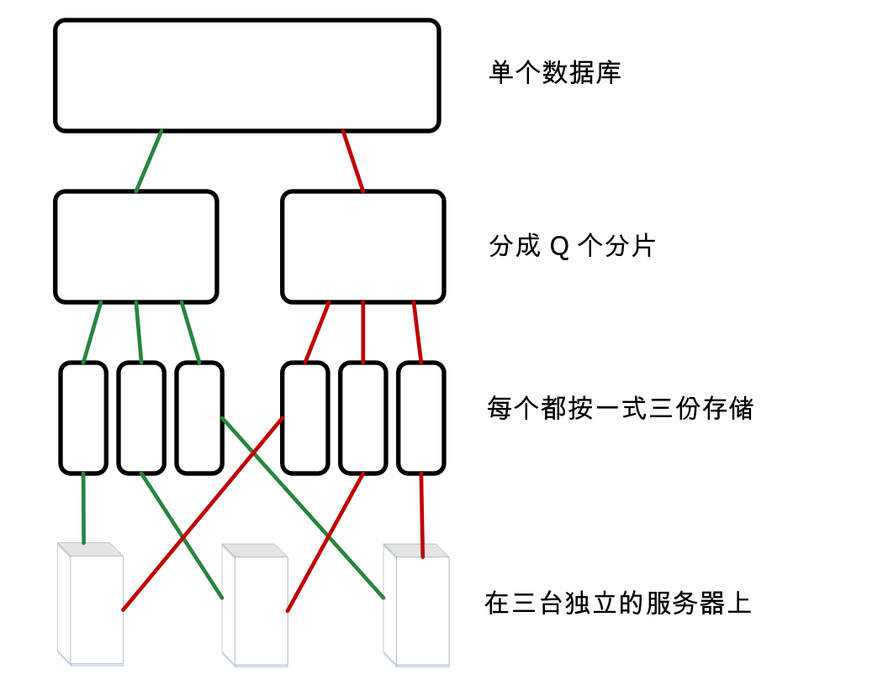
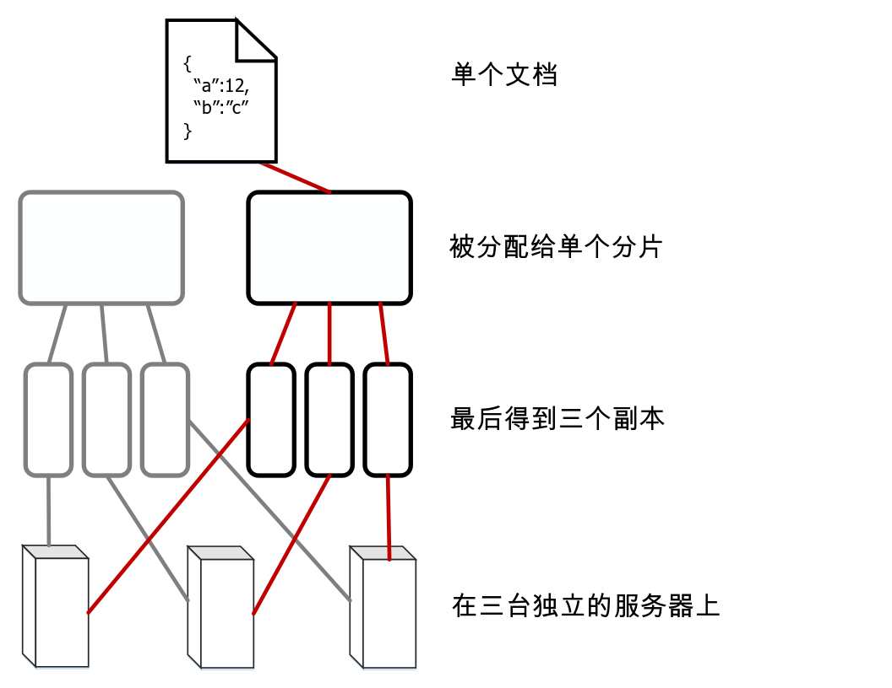

---

copyright:
  years: 2017
lastupdated: "2017-05-15"

---

{:new_window: target="_blank"}
{:shortdesc: .shortdesc}
{:screen: .screen}
{:codeblock: .codeblock}
{:pre: .pre}

<!-- Acrolinx: 2017-05-15 -->

# 如何在 Cloudant 中存储数据？

## 概念

Cloudant 中的每个数据库由一个或多个不同的_分片_组成，其中分片数称为 _Q_。分片是数据库中文档的非重复子集。所有 _Q_ 个分片一起包含数据库中的数据。每个分片存储为三个单独的拷贝。每个分片拷贝称为一个分片_副本_。每个分片副本存储在不同的服务器上。这些服务器在单个位置数据中心内可用。一个数据中心内的服务器集合称为一个集群。



通过使用文档标识的一致性散列处理，可将文档分配给特定分片。此分配意味着文档始终存储在已知分片和一组已知服务器上。



有时，会对分片进行_重新均衡_。重新均衡涉及将副本移至不同的服务器。执行重新均衡的原因有多种：例如，服务器监视表明某个服务器的使用量比其他服务器更多或更少，或者某个服务器必须暂时停止服务以进行维护。重新均衡后分片数和副本数保持不变，并且文档仍然分配给相同的分片，但分片副本的服务器存储位置会更改。

_Q_ 的缺省值因不同集群而异。可以随时间推移而调整此值。

此外，副本（分片的拷贝）的数量是可配置的。在实践中，对许多系统的观察和度量表明，三个副本在大多数情况下是比较实用的数目，能在性能和数据安全之间达到良好的平衡。对于 Cloudant 系统来说，使用其他副本计数是十分不寻常的。

## 分片如何影响性能？

数据库的分片数是可配置的，因为它会在多个方面影响数据库性能。

客户端应用程序向数据库发出请求时，会将集群中的一个服务器或“节点”分配为该请求的_协调程序_。此协调程序会向保存请求相关数据的节点发出内部请求，确定对请求的响应，然后将此响应返回给客户端。

数据库的分片数会在以下两个方面影响性能：

1.	数据库中的每个文档都存储在单个分片上。因此，对于任何单个文档请求，拥有大量分片可实现更高的并行性。原因是协调程序仅将请求发送到保存该文档的节点。因此，如果数据库有许多分片，那么很可能其他许多节点都不需要响应该请求。这些节点可以继续处理其他任务，不会因协调程序请求而中断。
2.	为了响应查询请求，数据库必须处理来自所有分片的结果。因此，拥有更多分片将产生更高的处理需求。原因是协调程序必须对每个分片发出一个请求，然后组合这些结果，再将响应返回给客户端。

为了帮助确定适合数据库的分片计数，请首先确定应用程序发出的最常见类型的请求。例如，考虑请求主要是针对单个文档操作，抑或请求主要是查询？是否有任何操作与时间相关？

对于所有查询，协调程序都会向所有副本发出读请求。使用此方法的原因是每个副本都会维护自己的索引副本，这有助于应答查询。此配置的一个重大结果是，_如果_文档写操作倾向于在集群中各分片之间均匀分布，那么拥有更多分片将支持并行索引构建。

在实践中，很难预测集群内各节点之间可能的索引负载。此外，预测索引负载往往不及处理请求模式有用。原因是执行文档写操作后可能需要建立索引，但在文档请求之后则不需要。因此，仅考虑建立索引无法提供足够的信息来估算合适的分片计数。

考虑数据大小时，一个重要的注意事项是每个分片的文档数。每个分片在磁盘上的一个大型 [B 型树 ](https://en.wikipedia.org/wiki/B-tree){:new_window} 中保存其文档。索引的存储方式相同。随着向一个分片添加更多文档，在典型的文档查找或查询期间用于遍历 B 型树的步骤数将增加。由于必须从高速缓存或磁盘读取更多数据，因此这种“深度增加”往往会导致请求变慢。

一般来说，请避免每个分片的文档数超过 1000 万个。在总体分片大小方面，出于运行原因，将分片保持在 10 GB 以内会很有用。例如，分片越小，在重新均衡期间通过网络移动就越容易。

鉴于避免文档过多的需求与保持较低分片大小的需求存在冲突，单个 _Q_ 值不可能是适用于所有情况的最佳值。Cloudant 会随时间推移根据使用模式的更改而调整集群的缺省值。

然而，对于特定数据库，花点时间来考虑观察到的请求模式和大小，并使用这些信息指导未来选择合适的分片数，往往会非常有用。使用代表性数据和请求模式进行测试，对于更好地估算合适 _Q_ 值至关重要。请随时准备根据生产体验来改变这些预期值。

<div id="summary"></div>

以下简单的准则在早期规划阶段可能会很有帮助。请务必通过使用代表性数据进行测试来验证建议的配置，尤其是对于较大的数据库：

*	如果数据的大小很小（例如几十或几百 MB 或者数千个文档），那么一个分片基本上就足够了。
*	对于几个 GB 或几百万个文档的数据库，个位数的分片计数（例如 8）可能是合适的。
*	对于几千万到几亿个文档或几十 GB 的更大型数据库，请考虑将数据库配置为使用 16 个分片。
*	对于还要大型的数据库，请考虑手动将数据分片为多个数据库。对于此类大型数据库，请联系 [Cloudant 支持 ](mailto:support@cloudant.com){:new_window} 以获取建议。

>	**注：**这些准则中的数字源自观察和经验，而不是精确计算出的。

<div id="API"></div>

## 使用分片

### 设置分片计数

数据库的分片数 _Q_ 在创建数据库时设置。日后不能更改 _Q_ 值。

要在创建数据库时指定 _Q_，请使用 `q` 查询字符串参数。

在以下示例中，将创建名为 `mynewdatabase` 的数据库。`q` 参数指定为该数据库创建 8 个分片。

```sh
curl -X PUT -u myusername https://myaccount.cloudant.com/mynewdatabase?q=8
```
{:codeblock}

>	**注：**Bluemix 上的 Cloudant 数据库不支持为数据库设置 _Q_。_Q_ 值在大多数 `cloudant.com` 多租户集群上不可用。

如果尝试设置不可用的 _Q_ 值，那么结果会生成 [`403` 响应](../api/http.html#403)，其 JSON 主体类似于以下示例：

```json
{
	"error": "forbidden",
	"reason": "q is not configurable"
}
```
{:codeblock}

### 设置副本计数

自 CouchDB V2 开始，创建数据库时，您可以[指定副本计数 ](http://docs.couchdb.org/en/2.0.0/cluster/databases.html?highlight=replicas#creating-a-database){:new_window}。但是，不能将副本计数值更改为缺省值 3 之外的值。尤其是，创建数据库时无法指定其他副本计数值。要获取进一步帮助，请联系 [Cloudant 支持 ](mailto:support@cloudant.com){:new_window}。

### 什么是 _R_ 和 _W_ 自变量？

某些请求可能有一些自变量会影响协调程序在应答请求时的行为。在请求查询字符串中，这些自变量的名称后面会标有 _R_ 和 _W_。这些自变量只能用于单个文档操作，对常规“查询样式”请求不起作用。

在实践中，指定 _R_ 和 _W_ 值通常没什么用。例如，指定 _R_ 或 _W_ 不会改变读操作或写操作的一致性。

#### 什么是 _R_？

_R_ 自变量只能在单个文档请求上指定。_R_ 会影响协调程序在回复客户端之前必须收到的响应数。这些响应必须来自托管包含该文档的分片副本的节点。 

将 _R_ 设置为 _1_ 可能会缩短总体响应时间，因为协调程序可以更快返回响应。原因是协调程序只须等待来自托管相应分片的任一副本的单个响应。

>	**注：**由于 Cloudant 使用的是[最终一致性](cap_theorem.html)模型，因此减小 _R_ 值会增加返回的响应不基于最新数据的可能性。使用缺省 _R_ 值有助于减轻此影响。

_R_ 的缺省值为 _2_。对于使用三个分片副本的典型数据库，此值对应于大部分副本。如果数据库的副本数高于或低于 3，那么 _R_ 的缺省值会相应更改。

#### 什么是 _W_？

_W_ 只能在单个文档写请求上指定。

_W_ 类似于 _R_，因为它也会影响协调程序在回复客户端之前必须收到的响应数。

>	**注：**_W_ 不会以任何方式影响实际的写操作行为。

_W_ 的值不会影响文档是否在数据库中写入。通过指定 _W_ 值，客户端可以检查响应中的 HTTP 状态码，以确定 _W_ 副本是否响应了协调程序。协调程序会等待来自托管文档副本的节点的 _W_ 响应，直至达到预先确定的超时，然后将响应返回给客户端。
