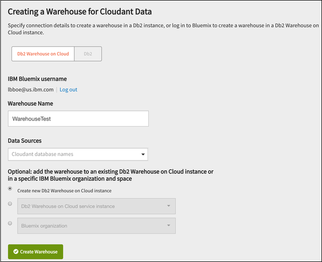

---

copyright:
  years: 2015, 2017
lastupdated: "2017-01-06"

---

{:new_window: target="_blank"}
{:shortdesc: .shortdesc}
{:screen: .screen}
{:codeblock: .codeblock}
{:pre: .pre}

# 数据仓储

数据库对于存储数据非常重要。但能够将这些数据应用于业务用途正是数据库的价值所在：能够快速、轻松地检索到相关数据，并在应用程序中将数据投入有效使用。
{:shortdesc}

但是，您对数据执行的许多存储、处理和分析任务在应用程序中会反复加以使用。或者，它们可能是行业最佳实践的良好示例。

因此，比较明智的做法是通过其他功能来扩展标准数据库功能，从而支持报告或分析之类的任务。

近 30 年来，“数据仓库”已成为基于关系数据库技术的数据存储、报告和分析的行业标准。一般来说，[数据仓库是指 ](https://en.wikipedia.org/wiki/Data_warehouse){:new_window}：“...集成来自一个或多个源的数据的中央存储库，用于存储当前和历史数据，并可用于在整个企业中为知识工作者执行分析和创建报告。”

近年来，为了响应处理“[大数据 ](https://en.wikipedia.org/wiki/Big_data){:new_window}”的需求，已经出现了各种支持数据存储、报告和分析的技术：“大数据这一术语是指传统数据处理应用程序不足以应付的太大或太复杂的数据集。”

同时，数据仓库和相关产品的属性和特性意味着使用关系数据库技术来支持数据仓库是一个常用选项，即使对于大数据任务也是如此。

有许多用例很好地说明了将 Cloudant 功能与关系数据仓库集成的优点，例如以下示例。

## 连接数据

将多个数据存储中的数据连接在一起以用于跨域分析，是一项可使用关系数据仓库轻松、高效执行的任务。

来自不同源的数据在装入数据仓库期间会做好准备并转换为通用格式。记录存储在表中，并可使用运算来连接这些表以支持组合分析。

如果某些数据已经以关系表示形式（例如，主数据或引用数据）提供，那么在关系数据仓库中执行连接会特别有用。

## 灵活性

Cloudant 数据库在表示数据方面非常灵活。例如，它们在读或写期间不强制实施模式。

相比之下，报告和分析任务需要明确定义并严格实施的模型。

通过在关系仓库中提供文档，可以使模型基于一组固定的表定义。只有符合表模式的文档才会装入，而违例会被拒绝。您可以使用固定关系模式通过一致数据来培训模型。

## 数据完整性断言

数据仓库可使用约束来断言数据完整性。例如：

-   没有两个记录可以具有相同的主键。
-   外键保证记录已完成。
-   提供了函数以根据业务规则验证记录。

唯一性、正确性和完整性是任何企业服务的基本需求。将 Cloudant 文档装入到数据仓库可帮助您满足这些需求。

## Cloudant 和数据仓储

数据仓库是一种成熟而重要的技术。Cloudant 提供与关系数据仓库的紧密集成，让您享受这项技术的优势。

IBM Cloudant 内置了基本的仓储功能，其形式为 [MapReduce 视图](../api/using_views.html)，支持您执行一系列的基本分析任务。

对于更高级的仓储任务，可以利用 IBM 基于云的仓储服务 [IBM dashDB ](http://www-01.ibm.com/software/data/dashdb/){:new_window} 提供的完整功能。

使用 IBM Cloudant 时，可以轻松访问集成的高级仓储功能，例如：

-   以关系数据库格式查看 JSON 数据。
-   对数据执行基于 SQL 的查询。
-   通过数据构建分析。

这些高级仓储功能通过 IBM dashDB（这是对 Cloudant 的自然补充）之类的服务来启用。

或者，如果只需要用于文档的关系数据存储，而无需仓储功能，那么可以将 Cloudant 文档装入 [IBM Db2 on Cloud](#ibm-db2-on-cloud) 服务。

## IBM dashDB

IBM dashDB 是基于云的数据仓库服务，专为分析工作而构建。虽然特别适用于 Cloudant JSON 数据，但 dashDB 也可以通过在数据装入时检查数据结构来接受来自各种源的数据。

有关更多信息，请参阅 [IBM dashDB Cloud Data Warehouse 文档 ](https://www.ibm.com/support/knowledgecenter/SS6NHC/com.ibm.swg.im.dashdb.kc.doc/welcome.html){:new_window}。

## IBM Db2 on Cloud

[IBM Db2 on Cloud ](https://console.ng.bluemix.net/catalog/services/ibm-db2-on-cloud){:new_window} 为您提供了基于 IBM SoftLayer® 全球云基础架构的数据库。它提供了本地 Db2 部署的丰富功能，但却没有管理自己基础架构的成本、复杂性和风险。

有关更多信息，请参阅 [IBM Db2 on Cloud 文档 ](https://console.ng.bluemix.net/docs/services/DB2OnCloud/index.html#DB2OnCloud){:new_window}。

## 创建仓库

可以通过两种方式来创建仓库：

1.  [使用 Cloudant 创建 dashDB 仓库](#use-cloudant-to-create-a-dashdb-warehouse)
2.  [将 Cloudant 连接到现有仓库](#connect-cloudant-to-an-existing-warehouse)

### 使用 Cloudant 创建 dashDB 仓库

创建仓库的最简单方法是由 Cloudant 代表您在 Bluemix 中创建 dashDB 仓库实例。为此，请单击 Cloudant“仪表板”的`集成`选项卡中`仓库`任务上的`创建仓库`按钮。

如果您尚未登录到 Bluemix，系统会要求您登录。

>   **注**：缺省情况下，
Cloudant 会在 Bluemix 上为您的仓库创建 dashDB 实例。

认证后，即可以请求使用 Bluemix 帐户创建新的 dashDB 实例。为此，请执行以下操作：

1.  在`仓库名称`字段中提供要用于仓库的名称。
2.  在`数据源`字段中提供您在 Cloudant 中的现有数据库的名称。
3.  确保选中表单上的`创建新的 dashDB 实例`选项。
4.  单击`创建仓库`按钮。

### 将 Cloudant 连接到现有仓库

您可以连接到现有 dashDB 实例，而不使用 Cloudant 创建 dashDB 仓库数据库。

此过程类似于[使用 Cloudant 创建 dashDB 仓库](#use-cloudant-to-create-a-dashdb-warehouse)，但不是选中`创建新的 dashDB 实例`选项，而是选中 `dashDB 服务实例`，并选择 Bluemix 中已存在的 dashDB 仓库。

### 使用 Db2 仓库实例

如果愿意，您可以连接到现有的 Db2 仓库实例而不是 dashDB。为此，请选中 Cloudant“仪表板”中的 `Db2` 选项来连接到现有 Db2 实例。

如果要连接到 Db2 实例，那么必须提供以下详细信息：

-   主机地址。
-   端口号。
-   数据库名称。
-   数据库的用户标识。
-   用户标识的密码。

>   **注**：本主题的其余部分均以 dashDB 为仓库实例。
但是，如果您使用的是 Db2 实例，那么本主题也同样适用。此外，还提供了教程来描述如何[将 JSON 数据从 Cloudant 装入到 dashDB ](https://developer.ibm.com/clouddataservices../dashdb/get/load-json-from-cloudant-database-in-to-dashdb/){:new_window}，并包含将 Db2 用作仓库数据库的示例。

## 仓库模式

首次在 Cloudant 中创建仓库时，dashDB 会为数据库中的数据创建尽可能最佳的模式，以帮助确保 JSON 文档中的每个字段在新模式中都有相应的条目。（可选）创建仓库时，可以选择手动[定制模式](#customizing-the-warehouse-schema)。

一旦创建了模式，仓库就能够以关系格式保存数据。然后，Cloudant 会进行[复制](../api/replication.html)以将数据库文档“初始装入”到仓库，从而在 dashDB 关系数据库中提供您数据的工作集合。

随着时间的推移，Cloudant 数据库内容可能会更改。您可以修改现有仓库的模式。

>   **注**：如果修改现有仓库的模式，
必须将 Cloudant 数据库中的数据再次复制到仓库数据库中。实际上，修改模式会导致将数据全新“初始装入”到仓库中。

## 使用仓库

通过 Cloudant 仓储，您可以完全在 dashDB 控制台中运行“传统”SQL 查询并查看结果。

外部应用程序可以按照与其他任何关系数据库交互的相同方式来与数据交互。

dashDB 的优点是您可以执行其他仓储任务，例如从其他源装入更多数据，以及使用内置分析工具来分析数据。DashDB 支持 [`R` 编程语言 ](https://en.wikipedia.org/wiki/R_%28programming_language%29){:new_window} 和软件环境用于统计计算和图形。这意味着您有权访问用于执行数据库分析任务（例如线性回归、“k 均值”聚类和地理空间分析）的算法。

通过 `RStudio` 工具，可以创建“`R`”脚本，然后这些脚本会上传到 dashDB 中，然后使用数据运行。

有关使用 dashDB 的更多信息，请参阅 [IBM dashDB Cloud Data Warehouse 文档 ](https://www.ibm.com/support/knowledgecenter/SS6NHC/com.ibm.swg.im.dashdb.kc.doc/welcome.html){:new_window}。

## 使数据和结构保持最新

数据使用[复制](../api/replication.html)过程从 Cloudant 装入到 dashDB。这意味着如果以某种方式更新或修改了 Cloudant 数据，就必须再次将文档复制到 dashDB，以确保分析任务继续使用最新的信息工作。

与标准 Cloudant 复制一样，数据仅单向传输：对于仓库，是从 Cloudant 传输到 dashDB。初始装入数据后，仓库会预订 Cloudant 数据库中的数据内容更改。任何更改都会从 Cloudant 源复制到 dashDB 目标。这意味着仓储是从 Cloudant 到 dashDB 持续复制的一种形式。

随着时间的推移，Cloudant 数据库的结构也可能更改。这可能包括添加或除去 JSON 文档中的字段。发生这种情况时，仓库使用的模式可能变得无效，导致将全新数据从 Cloudant 复制到 dashDB 时报告错误。

为了解决此问题，Cloudant 仓储有一个“重新扫描”工具。此工具将重新扫描 Cloudant 数据库的结构，并确定 dashDB 中所需的新模式。然后，将删除先前扫描期间创建的 dashDB 中旧表，使用新模式创建新表，最后以全新“初始装入”方式装入当前 Cloudant 数据。

要使用重新扫描工具，请首先确保仓库未在运行。为此，请按如下所示操作：

1.  选择 Cloudant“仪表板”中的`集成`选项卡。
2.  在`仓库`任务中，找到要重新扫描的仓库的名称： 
3.  单击仓库的名称。名称是一个链接，单击时将打开仓库详细视图： 
4.  检查仓库的当前状态。旋转的绿色圆圈指示仓库正在运行。要停止仓库，请单击“操作”列中的`停止数据库`图标： 
5.  仓库数据库未在运行时，“操作”列中的`重新扫描`图标处于启用状态： 

### 重新扫描源数据库

单击`重新扫描`图标时，会有两个选项：

-   对数据库进行直接扫描。这是缺省操作，与首次创建仓库时执行的数据库初始扫描非常类似。
-   定制仓库模式。

如果选择简单重新扫描这一缺省操作，那么会检查源数据库，并生成全新的仓库数据库模式。重新扫描完成后，会立即启动仓库。

如果要定制仓库模式，请先启用`定制模式`复选框，然后单击`重新扫描`按钮。

`定制模式`复选框会启用两个选项。

1.  使用的发现算法。
2.  样本大小。

### 发现算法

重新扫描的缺省选项是`并集`算法。此算法使用所有采样 Cloudant 数据库文档中的所有属性，在仓库数据库中创建一组表。结果是，所有 Cloudant 数据库文档都可以存储在仓库数据库中，但数据库中某些行的某些字段中可能没有内容。

重新扫描的另一个选项是`聚类`算法。此算法识别 Cloudant 数据库中具有相同属性集的文档，然后创建对应的仓库数据库表模式。

### 样本大小

此选项确定在模式确定过程中会检查 Cloudant 数据库中的多少个文档。

缺省值为 10,000 个文档。

将此值设置得太低有可能导致不能检测到某些 Cloudant 文档的一些属性，从而在仓库数据库结构中省略这些文档。

将此值设置得太高意味着用于确定仓库数据库结构的扫描过程需要更长时间才能完成。

### 重新扫描之后

Cloudant 数据库重新扫描完成后，仓库不会立即自动启动，而是保持“已暂停”状态，以便可以定制仓库数据库。

## 定制仓库模式

可以修改在初始仓库创建过程中或重新扫描后自动确定的数据库模式。为此，请确保在创建过程中选中`定制模式`选项：

仓库会在 dashDB 中正常创建，但不会立即启动，而是允许您定制模式之后再继续。

为此，请单击仓库对应的链接：

生成的显示内容中会提供一个按钮，以定制用于源数据库的模式。将鼠标悬停在“状态”指示符上将确认该模式已准备好进行定制：

单击“定制”按钮将生成一个面板，在其中可以修改数据库模式中的字段：

要将模式重置为缺省模式，请单击`重新扫描`按钮：

对仓库的数据库模式感到满意时，只需单击`运行`按钮即可：

这将保存模式，并启动仓库。

### 定制现有仓库模式

如果仓库的数据库模式已存在，那么您可以[选择进行定制](#keeping-the-data-and-structure-fresh)。

## 故障诊断

有时，使用仓储工具时可能会遇到问题。本主题的后续部分将提供有关其中一些问题的信息。

此外，在 [Stack Overflow ](http://stackoverflow.com/questions/tagged/cloudant+dashdb){:new_window} 中提供了一些常见错误或问题的讨论，以及有关如何对其进行故障诊断的详细信息。

如果需要进一步的帮助，并且在 Stack Overflow 中找不到解决方案，请联系 [Cloudant 支持 ](mailto:support@cloudant.com){:new_window}。

### 仪表板中显示的异常

有时，仓库会遇到错误条件。例如，如果尝试使用现有 Db2 数据库来创建仓库，但未能输入正确的数据库详细信息，那么无法成功创建仓库。

存在错误条件时，仓库的状态会更改为红色圆圈，指示存在需要注意的问题：

如果将鼠标“悬停”在该指示符上，将提供略多一些的信息：

单击该指示符时，会显示一个窗口，其中提供有关问题确切内容的更多详细信息。在此示例中，为 Db2 连接输入的主机详细信息无效：

### 警告和错误

Cloudant 数据库中的更改会复制到仓库数据库中。但有可能某个更改并不适合仓库或其模式。检测到此类问题后，会将其记录在仓库数据库的 `OVERFLOW` 表中。

例如，如果仓库模式具有类型为 `VARCHAR` 的 `Movie_earnings_rank` 字段，并且最多可以容纳 32 个字符，但 Cloudant 数据库中的某个更改需要存储 40 个字符，那么该字段会“溢出”。这将生成“警告”条件，并在仓库仪表板的“状态”图标中予以指示：

查看仓库数据库中指示的 overflow 表，可了解有关该警告的更多详细信息：

在此示例中，警告明确表明发生了截断，将影响 `_ID` 为 `70f6284d2a395396dbb3a60b4cf1cac2` 的 Cloudant 文档中的 `Move_earnings_rank` 字段。

有两种可能的解决方案选项：

-   更正 Cloudant 文档中的溢出字段。
-   [更新仓库模式](#customizing-the-warehouse-schema)。

选择的选项取决于字段中的多余内容是否有意为之。如果确实需要多余内容用于应用程序，那么必须[更新仓库模式](#customizing-the-warehouse-schema)以除去警告条件。

更重要的问题是，在 Cloudant 数据库的文档中引入了全新字段，但仓库数据库模式中并没有对等的字段。这会导致“错误”条件。

例如，Cloudant 数据库中的文档可能会“获取”名为 `my key` 的多余字段，该字段在仓库数据库模式中并不存在：

结果会生成错误条件，并在仓库仪表板的“状态”图标中予以指示：

查看仓库数据库中指示的 overflow 表，可了解有关该错误的更多详细信息：

在此示例中，错误明确表明遇到了在创建仓库数据库模式时并不存在的字段。在 `_ID` 为 `70f6284d2a395396dbb3a60b4cf1cac2` 的 Cloudant 文档中检测到该字段本身。

有两种可能的解决方案选项：

-   从 Cloudant 文档中除去多余的字段。
-   [更新仓库模式](#customizing-the-warehouse-schema)。

选择的选项取决于多余的字段是否有意为之。如果确实需要多余字段用于应用程序，那么必须[更新仓库模式](#customizing-the-warehouse-schema)以除去错误条件。
