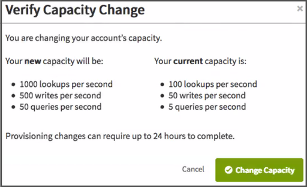

---

copyright:
  years: 2015, 2018
lastupdated: "2018-06-07"

---

{:new_window: target="_blank"}
{:shortdesc: .shortdesc}
{:screen: .screen}
{:codeblock: .codeblock}
{:pre: .pre}

<!-- Acrolinx: 2018-06-05 -->

# {{site.data.keyword.Bluemix_notm}} Public
{: #ibm-cloud-public}

{{site.data.keyword.cloudantfull}} Public 是 {{site.data.keyword.cloudant_short_notm}} 的功能最丰富的产品，最先接收更新和新功能。定价基于吞吐量和存储需求，使得此产品适用于任何所需负载。 

免费[轻量套餐](#lite-plan)包含固定数量的吞吐量容量和数据，可用于开发和评估用途。付费[标准套餐](#standard-plan)包含可配置的供应吞吐量容量和数据存储定价，可根据应用程序的需求变化来进行扩展。还提供了一个可选[专用硬件套餐](#dedicated-hardware-plan)，需要每月额外付费，以在专用硬件环境上运行一个或多个标准套餐实例。专用硬件环境仅供您独自使用，如果在美国某个位置供应了专用硬件套餐实例，那么可以选择符合 [HIPAA ](https://en.wikipedia.org/wiki/Health_Insurance_Portability_and_Accountability_Act){:new_window} 的配置。

下表汇总了轻量套餐的供应吞吐量容量和磁盘空间配置以及标准套餐的若干示例：

<table border='1'>

<tr>
<th id="plans">套餐</th><th id="lite">轻量</th><th id="standard" colspan='4'>标准</th>
</tr>
<tr>
<th id="base-priceperhour" headers="plans">基础价格（每小时）</td>
<td headers="lite base-priceperhour">0.00 美元</td>
<td headers="standard base-priceperhour" colspan='4'>请参阅<a href="../offerings/pricing.html#pricing" target="_blank">定价详细信息 </a>。</td>
</tr>
<tr>
<th id="provisionedthroughputcapacity-lookupspersecond" headers="plans">供应的吞吐量容量（每秒查找数）</td>
<td headers="lite provisionedthroughputcapacity-lookupspersecond-lite">20</td>
<td headers="standard provisionedthroughputcapacity-lookupspersecond">100</td>
<td headers="standard provisionedthroughputcapacity-lookupspersecond">1,000</td>
<td headers="standard provisionedthroughputcapacity-lookupspersecond">5,000</td>
<td headers="standard provisionedthroughputcapacity-lookupspersecond">20,000</td>
</tr>
<tr>
<th id="provisionedthroughputcapacity-writespersecond" headers="plans">供应的吞吐量容量（每秒写入数）</td>
<td headers="lite provisionedthroughputcapacity-writespersecond">10</td>
<td headers="standard provisionedthroughputcapacity-writespersecond">50</td>
<td headers="standard provisionedthroughputcapacity-writespersecond">500</td>
<td headers="standard provisionedthroughputcapacity-writespersecond">2,500</td>
<td headers="standard provisionedthroughputcapacity-writespersecond">10,000</td>
</tr>
<tr>
<th id="provisionedthroughputcapacity-queriespersecond" headers="plans">供应的吞吐量容量（每秒查询数）</td>
<td headers="lite provisionedthroughputcapacity-queriespersecond">5</td>
<td headers="standard provisionedthroughputcapacity-queriespersecond">5</td>
<td headers="standard provisionedthroughputcapacity-queriespersecond">50</td>
<td headers="standard provisionedthroughputcapacity-queriespersecond">250</td>
<td headers="standard provisionedthroughputcapacity-queriespersecond">1,000</td>
</tr>
<tr>
<th headers="diskspaceincluded" headers="plans">包含的磁盘空间</td>
<td headers="lite diskspaceincluded">1 GB</td>
<td headers="standard diskspaceincluded" colspan='4'>20 GB</td>
</tr>
<tr>
<th headers="diskoveragepergbhour" headers="plans">磁盘超额费（每 GB/小时）</td>
<td headers="lite diskoveragepergbhour">不可用</td>
<td headers="standard diskoveragepergbhour" colspan='4'>请参阅<a href="../offerings/pricing.html#pricing" target="_blank">定价详细信息 </a>。</td>
</tr>

</table>

## 套餐
{: #plans}

您可以选择[供应 {{site.data.keyword.cloudant_short_notm}} 服务实例](#provisioning-a-cloudant-instance-on-bluemix)时要使用的套餐。缺省情况下，选择了[轻量套餐](#lite-plan)。

### 轻量套餐
{: #lite-plan}

轻量套餐是免费的，但最大数据存储限制为 1 GB。此外，针对查找、写入和查询操作供应的吞吐量容量也有限制。 

每天都会检查存储使用情况。如果超过了存储限制，那么对帐户的 HTTP 请求将收到 402 状态码，错误消息为“帐户超过了其数据使用量配额。需要升级到付费套餐。”另外，还会在 {{site.data.keyword.cloudant_short_notm}}“仪表板”上显示相应的通知条幅。您仍可以读取和删除数据。但是，要写入新数据，必须升级到付费帐户，或者删除数据，然后等待下一次运行检查以重新激活帐户。 

如果要存储的数据多于 1 GB，或者希望拥有更大的吞吐量容量，请移至[标准套餐](#standard-plan)。

### 标准套餐
{: #standard-plan}

标准套餐包含 20 GB 的数据存储。如果存储的数据超过 20 GB，那么超出部分将按定义的每 GB/小时成本收费。有关当前成本，请参阅[定价](../offerings/pricing.html#pricing){:new_window}信息。在标准套餐上，还可以更改针对查找、写入和查询操作供应的吞吐量容量。

### 专用硬件套餐
{: #dedicated-hardware-plan}

作为替代方法，可以在任何 [{{site.data.keyword.IBM}} 数据中心 ](https://www.ibm.com/cloud-computing/bluemix/data-centers) 中的专用硬件环境上运行标准套餐实例，这需要每月付费。您可以为特定位置购买一个专用硬件套餐，然后在其上供应一个或多个标准套餐实例。要符合 HIPAA，需要使用此套餐，在供应时必须加以选择。 

专用硬件套餐不适用于 {{site.data.keyword.Bluemix_notm}} Dedicated 客户，仅适用于 {{site.data.keyword.Bluemix_notm}} Public 客户。
{: tip}

## 供应的吞吐量容量
{: #provisioned-throughput-capacity}

吞吐量供应会通过以下某个类型的事件进行确定和度量：

1.	查找，即读取特定文档，基于文档的 `_id`。
2.	写入，即创建、修改或删除单个文档，或由于索引构建而进行的任何更新。
3.	查询，即对某个 {{site.data.keyword.cloudant_short_notm}} 查询端点发出的请求，包括以下类型：
	-	主索引 ([`_all_docs`](../api/database.html#get-documents))
	-	MapReduce 视图 ([`_view`](../api/creating_views.html#using-views))
	-	搜索索引 ([`_search`](../api/search.html#queries))
	-	地理空间索引 ([`_geo`](../api/cloudant-geo.html#querying-a-cloudant-geo-index))
	-	{{site.data.keyword.cloudant_short_notm}} Query ([`_find`](../api/cloudant_query.html#finding-documents-using-an-index))

吞吐量度量是对每秒每种类型事件数的简单计数，其中秒是_滑动_时段。如果帐户超过为套餐供应的吞吐量事件数，那么请求会被拒绝，直至滑动时段中的事件数不再超过所供应的数目。将 1 秒的滑动时段视为 1,000 毫秒的任意连续时间段可能会很有用。

例如，标准套餐每秒供应 200 个查找。您的帐户在 1,000 毫秒（1 秒）的连续时间段内，最多可发出 200 个查找请求。在 1,000 毫秒的滑动时间段内发出的后续查找请求都将被拒绝，直到该时间段内的查找请求数重新降至 200 以下为止。

由于超出事件数而拒绝请求时，应用程序将收到 [`429` 请求太多](../api/http.html#429)响应。

受支持客户机库（对于 [Java](../libraries/supported.html#java)、[Node.js](../libraries/supported.html#node-js) 和 [Python](../libraries/supported.html#python) 语言）的最新版本可帮助您处理 `429` 响应。例如，Java 库会生成 [`TooManyRequestsException` ](http://static.javadoc.io/com.cloudant/cloudant-client/2.5.1/com/cloudant/client/org/lightcouch/TooManyRequestsException.html){:new_window} 响应。

缺省情况下，收到 `429` 响应时，支持的客户机库不会自动尝试重试请求。

最好确保应用程序能正确处理 `429` 响应。因为重试次数有限制；经常超过请求数限制往往意味着需要移至其他套餐配置。

如果正在迁移现有的应用程序，该应用程序可能无法处理 `429` 响应。在迁移验证过程中，请检查应用程序是否能正确处理 `429` 响应。

{: tip}

总之，必须确保应用程序能够正确处理 [`429`](../api/http.html#429) 响应。

### 查看和更改容量
{: #viewing-and-changing-capacity}

您可以查看套餐中可用于您帐户的吞吐量容量的详细信息。可以通过 {{site.data.keyword.cloudant_short_notm}} 帐户仪表板的“帐户”选项卡来选择要使用的供应级别。

要移至其他吞吐量容量，请选择所需的供应，然后单击`更新`。系统会要求您确认更改，并提醒您供应更改可能需要长达 24 小时才能完成。

### 监视使用情况 
{: #monitoring-usage}

有关使用情况的信息在 {{site.data.keyword.cloudant_short_notm}}“仪表板”内“监视”选项卡的“当前操作”窗格中提供。 

其中提供了详细信息，说明您的当前[吞吐量](#provisioned-throughput-capacity)以及[已存储数据](#disk-space-included)的数量。

监视可帮助您认识到可能最好对套餐中的供应进行更改。例如，如果经常接近最大数据库查找数，那么可以通过“仪表板”的“帐户”选项卡上的[“服务”窗格](#servicetier)来修改供应。

## 数据使用量
{: #data-usage}

### 包含的磁盘空间
{: #disk-space-included}

此值是套餐中包含的存储容量，用于数据和索引存储。

### 磁盘超额费
{: #disk-overage}

将监视所有标准和轻量套餐服务实例的已用磁盘空间。如果帐户使用的存储量超过套餐配置中提供的存储量，那么会将其视为“溢出”。溢出会导致对超过套餐分配量所使用的每个额外 GB，按指示价格向该帐户计费。

因使用超过套餐中所提供量的磁盘空间而必须支付的额外金额称为“超额费”。超额费按小时计算。在轻量套餐中，无法溢出可用磁盘空间。

例如，假定标准套餐实例的磁盘使用量增加到半天（12 小时）107 GB。此变化意味着在 12 小时内，相对于 20 GB 套餐分配量，该实例的溢出量为 87 GB。因此，对于该额外空间，超额费的计费公式是：87 GB x 12 小时 = 1044 GB 小时。

超额费是使用计费周期的特定小时内超过套餐分配量的最大 GB 数计算得来的。

### 磁盘超额费计算示例
{: #disk-overage-example}

假定您使用的是标准套餐服务，这个月有 30 天，您在这个月一开始使用了 9 GB 存储量。接下来，从第 3 天 02:00 这个小时的前 15 分钟内，存储量增加到 21.5 GB。实例在 02:00 这个小时接下来 10 分钟内使用的存储量降回 9.5 GB，然后在同一小时接下来 25 分钟内又增加到 108 GB。最后，在这个小时的末尾甚至这个月的其余时间，实例的存储量都降至 28 GB。

此模式表示在第 3 天的 02:00 这个小时，超过套餐分配量的最大 GB 数是 88 GB。对于第 3 天的 03:00 这个小时以及这个月的其余时间，实例使用的存储量比套餐分配量多 8 GB。

因此，对于第 3 天的 02:00 这个小时，帐单包含的超额费计算公式为：88 GB x 1 小时 = 88 GB 小时。

对于从第 3 天 03:00 到当天结束的时间段，帐单包含的超额费计算公式为：8 GB x 21 小时 = 168 GB 小时。

对于从第 4 天 00:00 到月末（以 30 天为一个月）的时间段，帐单包含的超额费计算公式为：8 GB x 24 小时 x 27 天 = 5184 GB 小时。

该月的超额费帐单总额等于 88 + 168 + 5184 = 5440 GB 小时。

## 请求和文档大小限制
{: #request-and-document-size-limits}

{{site.data.keyword.cloudant_short_notm}} JSON 文档和请求具有以下最大大小限制： 

限制|最大大小
------|-------------
单个文档大小|1 MB
单个附件大小|10 MB
请求主体大小|11 MB

超过上述任何限制都会生成 [413 响应](../api/http.html#413)。

建议在 Object Storage 中存储二进制附件或大型 JSON BLOB，并在 {{site.data.keyword.cloudant_short_notm}} JSON 文档中保存相应位置的链接。   

在复制时，大于这些限制的文档或附件不会复制到目标数据库。[此处](../api/replication.html#replication-errors)提供了有关如何检测复制错误的更多信息。

## 位置和租户
{: #locations-and-tenancy}

缺省情况下，在多租户环境上部署所有轻量和标准套餐。在套餐选择过程中，可以从以下 {{site.data.keyword.Bluemix_notm}} Public 区域中进行选择：

-   美国东部
-   美国南部
-   英国
-   悉尼
-   德国&Dagger;

可以在大多数 [{{site.data.keyword.IBM_notm}} 数据中心位置 ](https://www.ibm.com/cloud-computing/bluemix/data-centers) 中部署专用硬件套餐实例。
请参阅 {{site.data.keyword.Bluemix_notm}}“目录”中的下拉菜单以获取可用位置的最新列表。

&Dagger;所有从 {{site.data.keyword.Bluemix_notm}} Public 德国区域部署的 {{site.data.keyword.cloudant_short_notm}} 实例都会部署在欧盟管理的环境中。在欧盟管理的环境外部生成的任何 {{site.data.keyword.cloudant_short_notm}} 帐户或 API 密钥，都无法获得对欧盟管理的 {{site.data.keyword.cloudant_short_notm}} 实例的访问权。

## 安全性、加密和合规性
{: #security-encryption-and-compliance}

所有套餐都在使用[静态 ](https://en.wikipedia.org/wiki/Data_at_rest){:new_window} 磁盘加密的服务器上提供。访问会通过使用 HTTPS 的网络连接进行加密。有关更多详细信息，请参阅[{{site.data.keyword.Bluemix_notm}} 安全性 ](https://console.bluemix.net/docs/services/Cloudant/offerings/security.html#security){:new_window}。

套餐还提供了[安全合规性认证 ](https://cloudant.com/product/cloudant-features/cloudant-compliance/){:new_window}。[HIPAA ](https://en.wikipedia.org/wiki/Health_Insurance_Portability_and_Accountability_Act){:new_window} 合规性需要[专用环境](#dedicated-hardware-plan)，因此请在[供应过程](#provisioning-a-cloudant-instance-on-bluemix)中请求此环境。

如果需要使用自带密钥 (BYOK) 进行静态加密，可以通过 {{site.data.keyword.cloud}} Key Protect 启用此加密功能。{{site.data.keyword.cloudant_short_notm}} 支持此功能用于在所有区域中部署的新 {{site.data.keyword.cloudant_short_notm}} [专用硬件套餐](https://console.bluemix.net/docs/services/Cloudant/offerings/bluemix.html#ibm-cloud-public)实例。首先，通过 [{{site.data.keyword.cloud_notm}} 目录](https://console.bluemix.net/catalog/)创建一个专用硬件套餐实例。然后，提交支持凭单，我们的支持团队随后会协调获取您的新专用硬件实例的静态加密密钥，这些密钥由 Key Protect 实例进行管理。

## 高可用性、灾难恢复和备份
{: #high-availability-disaster-recovery-and-backup}

为了在数据中心内提供高可用性 (HA) 和灾难恢复 (DR)，所有数据将一式三份存储在集群中的三个单独的物理服务器上。您可以在多个数据中心内供应帐户，然后使用持续数据复制跨数据中心提供 HA/DR。{{site.data.keyword.cloudant_short_notm}} 数据不会自动备份，但您可以使用支持的工具  
来处理备份。查看[灾难恢复和备份指南 ](https://console.bluemix.net/docs/services/Cloudant/guides/disaster-recovery-and-backup.html#disaster-recovery-and-backup)，以探究所有 HA、DR 和备份注意事项来满足应用程序需求。 

## 支持
{: #support}

对标准套餐和专用套餐服务实例的支持是可选的，通过购买“{{site.data.keyword.Bluemix}} 标准支持”来提供支持。对于轻量套餐不提供支持。

[此处 ](https://console.ng.bluemix.net/?direct=classic/#/pricing/cloudOEPaneId=pricing&paneId=pricingSheet){:new_window} 提供了 针对 {{site.data.keyword.Bluemix_notm}} 标准支持的定价计算器。[此处 ](http://www-03.ibm.com/software/sla/sladb.nsf/pdf/6606-08/$file/i126-6606-08_05-2016_en_US.pdf){:new_window} 提供了有关支持服务级别协议 (SLA) 的详细信息。

## 在 {{site.data.keyword.Bluemix_notm}} 上供应 {{site.data.keyword.cloudant_short_notm}} 实例
{: #provisioning-a-cloudant-nosql-db-instance-on-ibm-cloud}

可以通过以下两种方式在 {{site.data.keyword.Bluemix}} 上供应 {{site.data.keyword.cloudant_short_notm}} 轻量或标准套餐实例：

- 使用“仪表板”。[此处 ](https://console.bluemix.net/docs/services/Cloudant/tutorials/create_service.html#creating-a-cloudant-instance-on-bluemix){:new_window} 提供了描述此过程的教程。
- 使用 Cloud Foundry 命令工具。[此处 ](https://console.bluemix.net/docs/services/Cloudant/tutorials/create_service_cli.html#creating-a-cloudant-instance-on-bluemix-using-the-cloud-foundry-tools){:new_window} 提供了描述此过程的教程。
 
要创建和利用 {{site.data.keyword.cloudant_short_notm}} 专用硬件套餐实例，请遵循[此处 ](https://console.bluemix.net/docs/services/Cloudant/tutorials/create_dedicated_hardware_plan.html#creating-and-leveraging-a-cloudant-dedicated-hardware-plan-instance-on-bluemix){:new_window} 描述此过程的教程。

