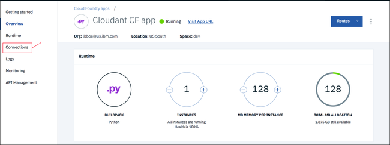
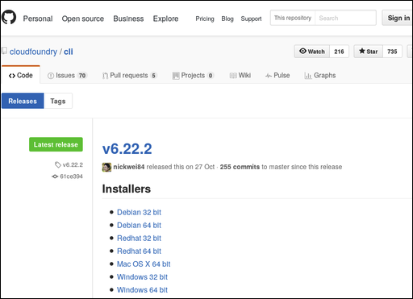

---

copyright:
  years: 2017, 2018
lastupdated: "2017-11-07"

---

{:new_window: target="_blank"}
{:shortdesc: .shortdesc}
{:screen: .screen}
{:codeblock: .codeblock}
{:pre: .pre}

<!-- Acrolinx: 2017-01-10 -->

# 创建简单 {{site.data.keyword.Bluemix_notm}} 应用程序以访问 {{site.data.keyword.cloudant_short_notm}} 数据库：应用程序环境

本部分教程描述了如何设置创建 {{site.data.keyword.Bluemix}} 应用程序所必须拥有的应用程序环境。
{:shortdesc}

<div id="creating"></div>

## 创建 Bluemix 应用程序环境

1.  登录到 {{site.data.keyword.Bluemix_notm}} 帐户。{{site.data.keyword.Bluemix_notm}}“仪表板”位于 [http://bluemix.net ](http://bluemix.net){:new_window}。使用用户名和密码进行认证后，将显示 {{site.data.keyword.Bluemix_notm}} 仪表板：<br/>
    

2.  单击“`目录`”链接：<br/>
    <br/>
这将显示 {{site.data.keyword.Bluemix_notm}} 上可用服务的列表。

3.  单击`应用程序`标题下的“`Cloud Foundry 应用程序`”条目。<br/>
    <br/>
这将显示 {{site.data.keyword.Bluemix_notm}} 上可用 Cloud Foundry 应用程序的列表。

4.  单击“`Python`”条目：<br/>
    <br/>
这将显示“`创建 Cloud Foundry 应用程序`”表单。

5.  使用“`创建 Cloud Foundry 应用程序`”表单来指定并创建 Python Cloud Foundry 应用程序的环境。输入应用程序的名称，例如“`Cloudant Python`”。系统会自动生成主机名，但您也可以对其进行定制：<br/>
    <br/>
    >   **注**：主机名在 {{site.data.keyword.Bluemix_notm}} 域中必须唯一。在此示例中，域为“`mybluemix.net`”，因此完整主机名为“`Cloudant-Python.mybluemix.net`”。

6.  单击“`创建`”以创建应用程序环境：<br/>
    

7.  在短暂停顿后，将显示新应用程序环境的“`入门`”窗口。测试应用程序会在环境中自动创建。应用程序会自动启动，如绿色图标和`您的应用程序正在运行`状态所示。此应用程序是“脉动信号”程序，足以说明新的应用程序环境已准备就绪，可随时使用。单击“`仪表板`”链接以返回到您的 {{site.data.keyword.Bluemix_notm}} 帐户仪表板。<br/>
    

8.  现在，您的仪表板已包含新创建的应用程序环境：<br/>
    

现在，您已拥有 {{site.data.keyword.Bluemix_notm}} Python 应用程序环境，可随时使用。

要使用 {{site.data.keyword.cloudant_short_notm}} 数据库实例，下一步是在应用程序环境与数据库实例之间创建“连接”。

<div id="connecting"></div>

## 连接 Bluemix 应用程序和服务

本部分教程说明了如何使用应用程序的配置和管理区域来连接 {{site.data.keyword.Bluemix_notm}} 应用程序环境和服务。

1.  在 {{site.data.keyword.Bluemix_notm}} 仪表板中，单击应用程序的条目。<br/>
    <br/>
    >   **注**：请避免单击“`路径`”列，因为单击与应用程序关联的链接将调用该应用程序，而不是转至配置区域。最好是单击应用程序的名称。

    这将显示应用程序的配置和管理概述区域。

2.  要将应用程序环境连接到其他服务，请单击“`连接`”链接：<br/>
    <br/>
这将显示一个区域，用于配置应用程序与您的帐户中可用的其他任何服务之间的连接。

3.  本教程的一个[先决条件](create_bmxapp_prereq.html#prerequisites)是存在现有的 {{site.data.keyword.cloudant_short_notm}} 数据库实例。单击“`连接现有项`”以在该数据库实例与应用程序之间建立连接：<br/>
    <br/>
这将显示您帐户中现有服务实例的列表。

4.  单击要使用的 {{site.data.keyword.cloudant_short_notm}} 数据库实例。本教程使用的是“`Cloudant Service 2017`”实例：<br/>
    

5.  系统将要求您确认是否确实要将该数据库实例连接到应用程序。单击“`连接`”以确认连接：<br>
    

6.  修改应用程序的服务连接会影响其总体配置。修改需要对应用程序“重新编译打包”，此操作还会强制停止运行的应用程序。这将显示一个窗口，供您确认是否已准备好继续执行“重新编译打包”。单击“`重新编译打包`”以继续：<br/>
    

7.  这将再次显示“服务连接”页面。现在，此页面包含新连接的数据库实例：<br/>
    

现在，应用程序环境和数据库实例已连接。下一步是确保安装了使用 {{site.data.keyword.Bluemix_notm}} 应用程序所必需的工具。

<div id="toolkits"></div>

## Cloud Foundry 和 {{site.data.keyword.Bluemix_notm}} 命令工具箱

本部分教程描述了必须安装后才能使用 {{site.data.keyword.Bluemix_notm}} 环境、应用程序和服务的工具箱。

[Cloud Foundry ](https://en.wikipedia.org/wiki/Cloud_Foundry){:new_window} 工具箱是工具集合，用于操作在 Cloud Foundry 兼容环境中部署的应用程序。使用这些工具可执行各种任务，例如更新部署的应用程序，或启动和停止运行的应用程序。

{{site.data.keyword.Bluemix_notm}} 工具箱提供了额外的功能，这些功能对于使用在 {{site.data.keyword.Bluemix_notm}} 环境中托管和运行的应用程序是必需的。

> **注**：确保安装了 Cloud Foundry _和_ {{site.data.keyword.Bluemix_notm}} 工具箱。

下载并安装工具箱是一次性任务。如果工具箱已安装并在系统上正常运行，那么除非工具箱有更新，否则无需再次下载。

有关工具箱的常规信息，请参阅[此处 ](https://console.ng.bluemix.net/docs/cli/index.html){:new_window}。

### 安装 Cloud Foundry 工具箱

某些操作系统分发版已经提供了某个版本的 Cloud Foundry 工具箱。如果支持的版本为 6.11 或更高版本，那么工具箱可与 {{site.data.keyword.Bluemix_notm}} 兼容并正常使用。您可以通过运行[此测试](#checkCFversion)来检查所安装的版本。

或者，使用以下步骤下载并在系统上安装 Cloud Foundry 工具箱： 

1.  在应用程序环境的“`入门`”窗口上提供了用于下载 Cloud Foundry 工具箱的链接：<br/>
    

2.  单击该链接可转至 [GitHub 上的下载页面 ](https://github.com/cloudfoundry/cli/releases){:new_window}：<br/>
    

3.  下载并运行适合您系统的最新版本安装程序。

4.  <div id='checkCFversion'></div>要检查是否具有适用的 Cloud Foundry 工具箱，请在提示符处运行以下命令：

    ```sh
    cf --version
    ```
    {:pre}
    
    预期的结果类似于以下输出：
    
    ```
    cf version 6.20.0+25b1961-2016-06-29
    ```
    {:codeblock}
    
    >   **注**：Cloud Foundry 工具箱版本必须为 6.11 或更高版本，才能与 {{site.data.keyword.Bluemix_notm}} 兼容。

### 安装 Bluemix 工具箱

使用以下步骤下载并在系统上安装 {{site.data.keyword.Bluemix_notm}} 工具箱。

1.  在应用程序环境的“`入门`”窗口上提供了用于下载 {{site.data.keyword.Bluemix_notm}} 工具箱的链接：<br/>
    

2.  单击该链接可转至[下载页面 ](http://clis.ng.bluemix.net/ui/home.html){:new_window}：<br/>
    

3.  下载并运行适合您系统的相应安装程序。

    安装程序将检查以确保安装的是适用版本的 Cloud Foundry 工具箱。如果一切正确，{{site.data.keyword.Bluemix_notm}} 工具箱将在系统上安装。

4.  要检查是否具有适用的 {{site.data.keyword.Bluemix_notm}} 工具箱，请在提示符处运行以下命令：
    
    ```sh
    bluemix --version
    ```
    {:pre}
    
    预期的结果类似于以下输出：
    
    ```
    bluemix version 0.4.5+03c29de-2016-12-08T07:01:01+00:00
    ```
    {:codeblock}
    
现在，用于操作 {{site.data.keyword.Bluemix_notm}} 应用程序的工具已可用。下一步是获取“入门模板”材料，以帮助创建 {{site.data.keyword.Bluemix_notm}} 应用程序。

<div id="starter"></div>

## “入门模板”应用程序

本部分教程描述了 {{site.data.keyword.Bluemix_notm}} 入门模板应用程序，并说明如何对其进行定制以访问 {{site.data.keyword.cloudant_short_notm}} 数据库实例。

{{site.data.keyword.Bluemix_notm}} 入门模板应用程序是用于创建适用 {{site.data.keyword.Bluemix_notm}} 应用程序所必需的源和配置文件的最小集合。在某些方面，它类似于[“Hello World”应用程序 ](https://en.wikipedia.org/wiki/%22Hello,_World!%22_program){:new_window}；但只足以说明基本系统和配置是否运行正常。

{{site.data.keyword.Bluemix_notm}} 入门模板应用程序是您开发 {{site.data.keyword.Bluemix_notm}} 应用程序时必须修改或扩展的示例文件的归档。

尤其是下面三个文件必不可少：

-   [“`Procfile`”](#procfile)
-   [“`manifest.yml`”](#manifest)
-   [“`requirements.txt`”](#requirements)

<div id="procfile"></div>

### “`Procfile`”文件

“`Procfile`”包含 {{site.data.keyword.Bluemix_notm}} 运行应用程序所需的详细信息。

更具体地说，“`Procfile`”是一种 Cloud Foundry 工件，用于定义应用程序进程类型以及运行应用程序的命令。[此处 ](https://docs.cloudfoundry.org/buildpacks/prod-server.html#procfile){:new_window} 提供了有关“`Procfile`”的更多信息。

{{site.data.keyword.Bluemix_notm}} Python 入门模板应用程序的“`Procfile`”类似于以下示例：

```
web: python server.py
```
{:codeblock}

此示例指示应用程序是一个 Python Web 应用程序，可通过运行以下命令启动：

```sh
python server.py
```
{:codeblock}

入门模板应用程序归档中包含入门模板“`server.py`”Python 源文件。“`server.py`”文件可针对您的应用程序修改。或者，创建一个全新的 Python 源文件。然后，更新“`Procfile`”，以便在应用程序启动时使用新文件。

<div id="manifest"></div>

### “`manifest.yml`”文件

“`manifest.yml`”文件是应用程序及其需要的运行环境的完整描述。

{{site.data.keyword.Bluemix_notm}} Python 入门模板应用程序的该文件类似于以下示例：

```
applications:
- path: .
  memory: 128M
  instances: 1
  domain: mybluemix.net
  name: Cloudant Python
  host: Cloudant-Python
  disk_quota: 1024M
  services:
  - Cloudant Service 2017
```
{:codeblock}

以下三点值得注意：

-   “`domain`”、“`name`”和“`host`”值对应于[创建](#creating) {{site.data.keyword.Bluemix_notm}} 应用程序时输入的值。
-   “`name`”值由 Cloud Foundry 工具箱用于确定要管理的应用程序。
-   “`services`”值用于确认“`Cloudant Service 2017`”{{site.data.keyword.cloudant_short_notm}} 数据库实例是否已连接到应用程序环境。

通常无需修改“`manifest.yml`”文件，但是应当了解为什么必须存在此文件应用程序才能正常运行。

<div id="requirements"></div>

### “`requirements.txt`”文件

“`requirements.txt`”文件指定应用程序正常运行所需的其他任何组件。

在入门模板应用程序中，“`requirements.txt`”文件为空。

但是，在本教程中，Python 应用程序会访问 {{site.data.keyword.cloudant_short_notm}} 数据库实例。因此，应用程序必须能够使用 [{{site.data.keyword.cloudant_short_notm}} Python 应用程序的客户机库](../libraries/supported.html#python)。

要启用 Python 客户机库，请将“`requirements.txt`”文件修改为：
```
cloudant==2.3.1
```
{:codeblock}

## 下一步

本教程中的下一步是[创建应用程序](create_bmxapp_createapp.html)。
