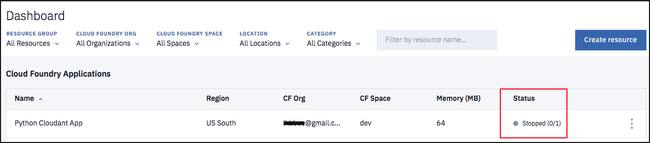
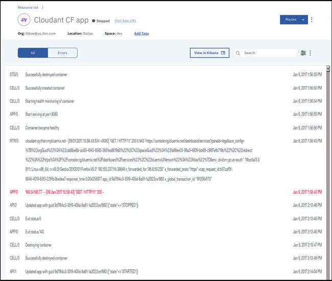

---

copyright:
  years: 2017, 2019
lastupdated: "2019-03-19"

keywords: maintenance tasks, find application status, start application, stop application, upload application, diagnose problems, resolve problems, application log

subcollection: cloudant

---

{:new_window: target="_blank"}
{:shortdesc: .shortdesc}
{:screen: .screen}
{:codeblock: .codeblock}
{:pre: .pre}
{:tip: .tip}
{:note: .note}
{:important: .important}
{:deprecated: .deprecated}

<!-- Acrolinx: 2017-01-11 -->

# 创建简单 {{site.data.keyword.cloud_notm}} 应用程序以访问 {{site.data.keyword.cloudant_short_notm}} 数据库：维护和故障诊断
{: #creating-a-simple-ibm-cloud-application-to-access-an-ibm-cloudant-database-maintaining-and-troubleshooting}

本教程说明了如何维护在 {{site.data.keyword.cloud_notm}} 服务实例中托管的 {{site.data.keyword.cloud}} 应用程序。
{: shortdesc}

## 执行基本应用程序维护任务
{: #performing-basic-application-maintenance-tasks}

本部分教程说明了如何在 {{site.data.keyword.cloud_notm}} 上刷新、启动和停止 Python 应用程序。

### 查找应用程序的状态
{: #finding-the-status-of-your-application}

{{site.data.keyword.cloud_notm}} 服务实例内应用程序的状态会显示在仪表板上。

在以下示例中，`Cloudant CF app` 应用程序未在运行，状态为`已停止`：

### 启动应用程序
{: #starting-your-application}

如果未先删除教程演示数据库就尝试启动教程应用程序，那么该应用程序无法正常工作。应用程序会陷入循环：尝试启动、因数据库存在而失败、停止、接着重试启动。要解决此问题，请[停止应用程序](#stopping-your-application)，然后删除教程演示数据库。随后，该应用程序就可以成功启动。

{: note}
    
要启动已停止的应用程序，请单击该菜单中的`启动`选项： 

### 停止应用程序
{: #stopping-your-application}

要停止正在运行的应用程序，请单击该菜单中的`停止`选项： 

### 上传全新版本的应用程序
{: #uploading-a-fresh-version-of-your-application}

要上传全新版本的应用程序，只需遵循[上传过程](/docs/services/Cloudant?topic=cloudant-creating-a-simple-ibm-cloud-application-to-access-an-ibm-cloudant-database-uploading-the-application#creating-a-simple-ibm-cloud-application-to-access-an-ibm-cloudant-database-uploading-the-application)即可。新版本应用程序将覆盖旧版本。

如果开始上传时旧版应用程序已在运行，那么 {{site.data.keyword.cloud_notm}} 会先自动停止该应用程序。
{: tip}

## 问题诊断和解决
{: #diagnosing-and-resolving-problems}

本部分教程提供了一些基本的故障诊断技巧，可帮助您识别、诊断和解决在开发和部署第一个 {{site.data.keyword.cloud_notm}} 应用程序时可能会遇到的一些问题。

[此处 ](https://docs.cloudfoundry.org/devguide/deploy-apps/prepare-to-deploy.html){: new_window} 提供了关于创建 {{site.data.keyword.cloud_notm}} 或 Cloud Foundry 应用程序的最佳做法的一些好建议。

尤其是有关[避免写入本地文件系统 ](https://docs.cloudfoundry.org/devguide/deploy-apps/prepare-to-deploy.html#filesystem){: new_window} 的建议非常谨慎。

为了简单起见，本教程将一些内容写入了本地文件系统。但是，写入的数据量很小。预计不会持久存储，而且不属于“关键任务”。

{: tip}

### 使用应用程序日志
{: #using-the-application-log}

对 {{site.data.keyword.cloud_notm}} 应用程序问题进行诊断和解决时，最有用的资源是日志文件。

通过单击`日志`选项卡来打开日志记录信息页面，可以找到 {{site.data.keyword.cloud_notm}} 应用程序的日志文件： 

与大多数日志文件一样，{{site.data.keyword.cloud_notm}} 应用程序日志也包含有关所发生事件和发生时间的详细信息。

该日志还会确定所记录事件中涉及的组件。下表标明了主要组件：

组件标签|组件
----------------|----------
`API`           |Cloud Foundry 系统。
`APP`           |应用程序。
`CELL`          |在 {{site.data.keyword.cloud_notm}} 中保存应用程序的容器。
`RTR`           |用于将消息传递到应用程序或从应用程序接收消息的联网组件。

例如，以下截屏包含许多典型事件： 

请注意以下时间的事件：

-   在下午 1:56:56，应用程序成功启动。
-   在下午 1:58:43，网络收到简单 HTTP 请求，要求执行 `GET /`。
-   片刻之后，应用程序收到该 HTTP 请求，并对其进行了回复。
-   在下午 2:13:46，收到停止应用程序的请求。
-   在下午 2:13:48，应用程序完成停止过程。

本教程中描述的应用程序有意用的是最小型的。作为特定示例，我们并未尝试确定目标数据库是否存在；如果目标数据库存在，请避免重试创建该目标数据库。事实上，如果未事先除去数据库，就多次尝试运行教程应用程序，那么应用程序会重复失败并重新启动。

在以下截屏中可以看到这一事实： 

在下午 2:31:23，应用程序检测到问题： 
`"Database {0} already exists".format(dbname)`

如果任何 Python 应用程序遇到问题，您就会收到其余的消息。

事实上，日志会显示哪个组件遇到了问题，并尽可能多地提供详细信息。然后，必须应用标准应用程序故障诊断过程来解决问题。

## 教程结束
{: #end-of-tutorial}

本教程已完成。
