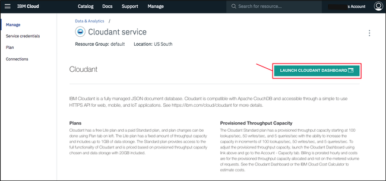

---

copyright:
  years: 2017, 2018
lastupdated: "2017-11-07"

---

{:new_window: target="_blank"}
{:shortdesc: .shortdesc}
{:screen: .screen}
{:codeblock: .codeblock}
{:pre: .pre}

<!-- Acrolinx: 2017-01-11 -->

# 创建简单 {{site.data.keyword.Bluemix_notm}} 应用程序以访问 {{site.data.keyword.cloudant_short_notm}} 数据库：上传应用程序

本部分教程描述了如何上传 {{site.data.keyword.Bluemix}} 应用程序。
{:shortdesc}

<div id="uploading"></div>

## 连接到 {{site.data.keyword.Bluemix_notm}}

第一个任务是连接到 {{site.data.keyword.Bluemix_notm}}。

[{{site.data.keyword.Bluemix_notm}} 工具箱](create_bmxapp_appenv.html#toolkits)可帮助您建立该连接。

Cloud Foundry 需要知道要用于进行 API 调用（例如，上传应用程序）的 URL。{{site.data.keyword.Bluemix_notm}} 工具箱使用“`cf api`”命令来管理 API 端点。有关“`cf api`”命令的更多信息[位于此处 ](https://console.ng.bluemix.net/docs/cli/reference/cfcommands/index.html#cf_api){:new_window}。

使用以下命令通知 Cloud Foundry 要使用的 URL：

```sh
bluemix api https://api.ng.bluemix.net
```
{:pre}

预期的结果类似于以下输出：

```
Invoking 'cf api https://api.ng.bluemix.net'...

Setting api endpoint to https://api.ng.bluemix.net...
OK

API endpoint:   https://api.ng.bluemix.net
API version:    2.54.0
Not logged in. Use 'bluemix login' to log in.
```
{:codeblock}

现在，Cloud Foundry 知道在何处发送用于管理应用程序的 API 调用。

下一步是登录到 {{site.data.keyword.Bluemix_notm}} 应用程序环境。必须提供以下帐户详细信息：

-   您的用户名，指定为“`-u`”参数的值。
-   您的组织名称，指定为“`-o`”参数的值。
-   您的空间，指定为“`-s`”参数的值。

>   **注**：通过 Web 浏览器登录时，帐户详细信息会在 {{site.data.keyword.Bluemix_notm}} 
仪表板上提供，如以下示例所示：<br/>
    

使用类似于以下示例的命令登录到 {{site.data.keyword.Bluemix_notm}} 应用程序环境。请注意，系统会要求您输入帐户密码。

```sh
bluemix login -u Adrian.Warman@uk.ibm.com -o Adrian.Warman@uk.ibm.com -s dev
```
{:pre}

预期的结果类似于以下输出：

```
Invoking 'cf login -u Adrian.Warman@uk.ibm.com -o Adrian.Warman@uk.ibm.com -s dev'...

API endpoint: https://api.ng.bluemix.net

Password> 
Authenticating...
OK

Targeted org Adrian.Warman@uk.ibm.com

Targeted space dev
                
API endpoint:   https://api.ng.bluemix.net (API version: 2.54.0)
User:           adrian.warman@uk.ibm.com
Org:            Adrian.Warman@uk.ibm.com
Space:          dev
```
{:codeblock}

## 上传应用程序

现在，{{site.data.keyword.cloudant_short_notm}} Foundry 工具箱知道如何连接到 {{site.data.keyword.Bluemix_notm}} 环境。

下一步是上传应用程序本身。{{site.data.keyword.Bluemix_notm}} 应用程序的详细信息在[清单文件](create_bmxapp_appenv.html#manifest)中提供。

教程应用程序的清单文件已更新，如[此处](create_bmxapp_createapp.html#essential-files)所述

使用类似于以下示例的命令登录以上传 {{site.data.keyword.Bluemix_notm}} 应用程序。

```sh
cf push "Cloudant Python"
```
{:pre}

这将显示一个结果消息序列。

```
Using manifest file /..../BMXDemo/manifest.yml

Updating app {{site.data.keyword.cloudant_short_notm}} Python in org Adrian.Warman@uk.ibm.com / space dev as Adrian.Warman@uk.ibm.com...
OK
```
{:codeblock}

Cloud Foundry 工具箱已找到清单文件，并正在准备使用您[先前](#uploading)提供的连接和标识详细信息来上传应用程序。

```
Using route Cloudant-Python.mybluemix.net
Uploading Cloudant Python...
Uploading app files from: /..../BMXDemo
Uploading 1.5K, 3 files
Done uploading               
OK
Binding service {{site.data.keyword.cloudant_short_notm}} Service 2017 to app {{site.data.keyword.cloudant_short_notm}} Python in org Adrian.Warman@uk.ibm.com / space dev as Adrian.Warman@uk.ibm.com...
OK
```
{:codeblock}

应用程序已成功上传，并已与 {{site.data.keyword.cloudant_short_notm}} 数据库实例建立了连接。

```
Starting app {{site.data.keyword.cloudant_short_notm}} Python in org Adrian.Warman@uk.ibm.com / space dev as Adrian.Warman@uk.ibm.com...
-----> Downloaded app package (4.0K)
-----> Downloaded app buildpack cache (29M)
-------> Buildpack version 1.5.5
     $ pip install -r requirements.txt
DEPRECATION: --allow-all-external has been deprecated and will be removed in the future. Due to changes in the repository protocol, it no longer has any effect.
       Collecting cloudant==2.3.1 (from -r requirements.txt (line 1))
         Downloading cloudant-2.3.1-py2-none-any.whl (63kB)
       Collecting requests<3.0.0,>=2.7.0 (from cloudant==2.3.1->-r requirements.txt (line 1))
         Downloading requests-2.12.4-py2.py3-none-any.whl (576kB)
       Installing collected packages: requests, cloudant
       Successfully installed cloudant-2.3.1 requests-2.12.4
You are using pip version 8.1.1, however version 9.0.1 is available.
You should consider upgrading via the 'pip install --upgrade pip' command.
You are using pip version 8.1.1, however version 9.0.1 is available.
You should consider upgrading via the 'pip install --upgrade pip' command.
-----> Uploading droplet (30M)

0 of 1 instances running, 1 starting
1 of 1 instances running

App started


OK

App {{site.data.keyword.cloudant_short_notm}} Python was started using this command `python server.py`
```
{:codeblock}

应用程序会自动启动。在启动过程中，会通过评估 [requirements.txt 文件](create_bmxapp_appenv.html#requirements)的内容进行检查，以确保满足所有需求。应用程序需要对创建应用程序时[指定](create_bmxapp_createapp.html#essential-files)的 {{site.data.keyword.cloudant_short_notm}} 库的访问权。

上传并启动应用程序后，会运行一些简单的系统检查，以确认对于 {{site.data.keyword.Bluemix_notm}} 而言，应用程序是否运行正常。

```
Showing health and status for app {{site.data.keyword.cloudant_short_notm}} Python in org Adrian.Warman@uk.ibm.com / space dev as Adrian.Warman@uk.ibm.com...
OK

requested state: started
instances: 1/1
usage: 128M x 1 instances
urls: Cloudant-Python.mybluemix.net
last uploaded: Thu Dec 22 15:58:18 UTC 2016
stack: cflinuxfs2
buildpack: python 1.5.5

     state     since                    cpu    memory          disk           details
#0   running   2016-12-22 03:59:21 PM   0.0%   49.9M of 128M   110.6M of 1G
```
{:codeblock}

## 测试样本应用程序

首次创建 {{site.data.keyword.Bluemix_notm}} 应用程序环境时，仪表板的`路径`列中包含该应用程序的链接：<br/>


单击此链接将打开浏览器窗口，并向正在侦听相应端口的应用程序请求一些数据。应用程序通过返回其启动时生成的日志文件内容进行响应：<br/>


此日志文件的内容很有意思。日志明确显示了开始时间和结束时间。在这两个时间之间，日志记录了检索 {{site.data.keyword.cloudant_short_notm}} 的连接信息时的每个详细信息。连接的实际值并不重要。日志表明教程应用程序能够找到、检索和使用这些值，在 {{site.data.keyword.cloudant_short_notm}} 数据库中创建新文档。

### 确认数据库详细信息

首先打开 {{site.data.keyword.cloudant_short_notm}} 仪表板。单击 {{site.data.keyword.cloudant_short_notm}} 服务页面中`管理`选项卡上的`启动`图标：<br/>


> **注**：要找到 {{site.data.keyword.cloudant_short_notm}} 服务页面，请参阅[“创建 {{site.data.keyword.cloudant_short_notm}} 实例”教程](create_service.html#locating-your-service-credentials)中的详细信息。

打开仪表板后，可以看到应用程序已创建“`databasedemo`”数据库：<br/>


该数据库包含由应用程序创建的单个文档。要验证该文档是否存在，请单击仪表板中该数据库的名称。这将显示该数据库的选项列表。选择`所有文档`选项卡时，将显示单个文档的详细信息：<br/>


要查看文档内容，请单击显示为画笔图像的`编辑`图标：<br/>


显示文档内容时，可以看到教程应用程序创建的每个字段。<br/>
<br/>
请特别注意包含文档创建日期和时间的 `rightNow` 字段。此值对应于在[应用程序日志文件](#testing-the-sample-application)中记录的相应时间。

## 下一步

本教程中的下一步是[操作和维护应用程序](create_bmxapp_maintain.html)，例如启动、停止和调试应用程序。
