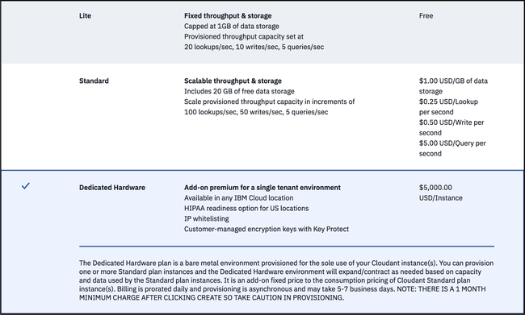

---

copyright:
  years: 2015, 2018
lastupdated: "2018-10-24"

---

{:new_window: target="_blank"}
{:shortdesc: .shortdesc}
{:screen: .screen}
{:codeblock: .codeblock}
{:pre: .pre}
{:tip: .tip}

<!-- Acrolinx: 2017-05-10 -->


# 在 {{site.data.keyword.cloud_notm}} 上创建和利用 {{site.data.keyword.cloudant_short_notm}} 专用硬件套餐实例

本教程说明了如何使用 {{site.data.keyword.cloud}}“仪表板”创建一个 {{site.data.keyword.cloudantfull}} 专用硬件套餐实例，以及后续如何使用 {{site.data.keyword.cloud_notm}}“目录”或 {{site.data.keyword.cloud_notm}} CLI 供应一个或多个标准套餐实例以在该实例上运行。 

通过创建 {{site.data.keyword.cloudant_short_notm}} 专用硬件套餐实例，可以在专用硬件上供应 {{site.data.keyword.cloudant_short_notm}} 环境以供您独自使用。服务实例在 {{site.data.keyword.cloud_notm}}“仪表板”中创建，但您无法直接访问专用硬件套餐实例，并且不会有此实例的任何服务凭证。通过在创建的 {{site.data.keyword.cloudant_short_notm}} 专用硬件套餐实例上供应一个或多个标准套餐实例，可以使用此专用硬件套餐实例。

## 创建 {{site.data.keyword.cloudant_short_notm}} 专用硬件套餐实例

1.  登录到 {{site.data.keyword.cloud_notm}} 帐户。<br/>
在以下地址可找到 {{site.data.keyword.cloud_notm}}“仪表板”：[http://bluemix.net ](http://bluemix.net){:new_window}。使用用户名和密码进行认证后，将显示 {{site.data.keyword.cloud_notm}}“仪表板”：<br/>
    

2.  单击`创建资源`按钮：<br/>
    <br/>
    
3.  请参阅 {{site.data.keyword.cloud_notm}}“目录”及可用的服务。单击`数据库`类别。
    

4.  单击 {{site.data.keyword.cloudant_short_notm}} 服务：<br/>
    <br/>
将显示用于创建服务的页面。

5.  从页面底部的价格套餐列表中选择`专用硬件`套餐：<br/>
    
    
6.  在页面顶部填写以下参数：<br/>
    -   输入服务名称。<br/>
    -   指定要在其中进行部署的区域/位置。<br/>
    -   选择资源组。</br>
    -   选择部署位置。<br/>
    -   选择`是`或`否`以回答是否需要 HIPAA。<br/>
   
    HIPAA 仅适用于美国的位置。{{site.data.keyword.IBM}} 可以供应专用或裸机集群以实施 HIPAA 控制。仅当确认与 {{site.data.keyword.IBM_notm}} 签订了“业务伙伴协议”(BAA) 时，才会供应集群。此协议在“服务描述”条款中进行了描述。供应集群以管理 HIPAA 数据所用的时间可能会超过估算的 5 天。
    {: tip}
    
    请在相同区域和空间中部署和供应标准套餐实例。
    {: tip}

    
        
7.  单击`创建`按钮以启动供应过程。<br/>

    每天按比例计费，因此在单击**创建**按钮之前，请确认您要针对环境供应和付费。
    {: tip}

    

    供应期间，在 {{site.data.keyword.cloud_notm}}“仪表板”中该实例旁会显示一个纺车。系统将发送一个请求以在裸机服务器上供应专用硬件套餐实例。供应时间是异步的，可能需要最多 5 天的时间。
    {: tip}   

    
    
## 在专用硬件环境上供应标准套餐实例

1.  登录到 {{site.data.keyword.cloud_notm}} 帐户。<br/>
在以下地址可找到 {{site.data.keyword.cloud_notm}}“仪表板”：[http://bluemix.net ](http://bluemix.net){:new_window}。使用用户名和密码进行认证后，将显示 {{site.data.keyword.cloud_notm}}“仪表板”：<br/>
    

2.  单击`创建资源`按钮：<br/>
    <br/>
这将显示 {{site.data.keyword.cloud_notm}} 上可用服务的列表。

3.  单击`数据库`类别，然后选择 `Cloudant` 服务：<br/>
    </br>
将显示用于创建服务的页面。<br/>  

4.  单击价格套餐中的`标准`。<br/>
    
    
    无法在专用硬件环境上供应轻量套餐实例。
    {: tip}
    
5.  填写以下参数：<br/>
    -   输入服务名称。<br/>
    -   指定要在其中进行部署的区域/位置。<br/>
    -   选择资源组。</br>
    -   选择身份验证方法。</br>
    -   选择环境。</br>
    
    
6.  单击`创建`按钮。<br/>
    几秒后，将在所选环境中供应该实例。<br/>
    
    
7.  获取服务凭证，然后访问 {{site.data.keyword.cloudant_short_notm}}“仪表板”（如同针对多租户 {{site.data.keyword.cloudant_short_notm}} 实例那样）。
     
    
    有关更多信息，请参阅[如何查找服务凭证](../tutorials/create_service.html#locating-your-service-credentials){:new_window}。 
    
## 使用 {{site.data.keyword.cloud_notm}} CLI 在专用硬件环境上供应标准套餐实例

要使用 {{site.data.keyword.cloud_notm}} CLI，您必须登录。有关如何登录和设置目标资源组的更多信息，请参阅[登录到 {{site.data.keyword.cloud_notm}} 帐户](create_service_cli.html#logging-in-to-your-ibm-cloud-account){:new_window}。 

要在 {{site.data.keyword.cloudant_short_notm}} 专用硬件套餐环境中创建 {{site.data.keyword.cloudant_short_notm}} 标准套餐实例，基本命令格式如下所示：


字段            |描述
------|------------
`NAME`|为实例指定的任意名称。
`SERVICE_NAME`|`cloudantnosqldb`
`PLAN_NAME`|标准套餐
`LOCATION`|要在其中进行部署的位置，例如，us-south、us-east 或 eu-gb。

请参阅以下示例命令： 

```sh
ibmcloud resource service-instance-create NAME SERVICE_NAME SERVICE_PLAN_NAME LOCATION [-p, --parameters @JSON_FILE | JSON_STRING ]
```

在专用硬件环境上部署的 {{site.data.keyword.cloudant_short_notm}} 实例还需要另外两个参数：

参数|描述
----------|------------
`environment_crn`|此参数必须设置为 {{site.data.keyword.cloudant_short_notm}} 专用硬件套餐实例的 CRN。可通过在 {{site.data.keyword.cloud_notm}}“仪表板”中查看 {{site.data.keyword.cloudant_short_notm}} 专用硬件套餐实例的“管理”选项卡中的示例 CLI 命令，确定 CRN 的内容。或者，可以使用 `ibmcloud resource service-instance SERVICE_INSTANCE_NAME` 命令来确定 CRN 的内容。
`legacyCredentials`|可选参数，缺省为 true，指示实例是同时使用旧凭证和 IAM 凭证还是仅使用 IAM 凭证。有关选择认证方法的更多详细信息，请参阅 [IAM 指南 ](../guides/iam.html#ibm-cloud-identity-and-access-management-iam-){:new_window}。

请参阅以下示例命令： 

```sh
ibmcloud resource service-instance-create cloudant_on_ded_hardware_cli cloudantnosqldb standard us-south -p '{"environment_crn":"crn:v1:bluemix:public:cloudantnosqldb:us-south:a/b43434444bb7e2abb0841ca25d28ee4c:301a3118-7678-4d99-b1b7-4d45cf5f7b29::","legacyCredentials":false}'
```
     
