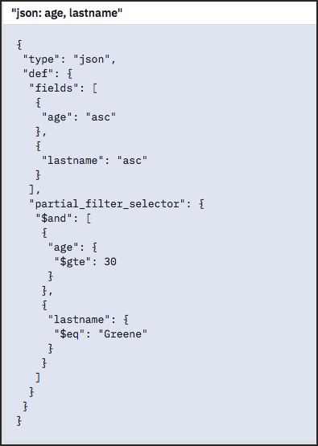
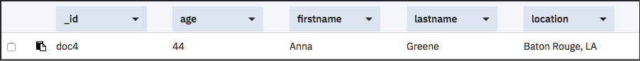

---

copyright:
  years: 2017, 2019
lastupdated: "2019-03-19"

keywords: create database, create documents, create index, create query, run query, fields, operators

subcollection: cloudant

---

{:new_window: target="_blank"}
{:shortdesc: .shortdesc}
{:screen: .screen}
{:codeblock: .codeblock}
{:pre: .pre}
{:tip: .tip}
{:note: .note}
{:important: .important}
{:deprecated: .deprecated}

<!-- Acrolinx: 2017-05-10 -->

# 创建 {{site.data.keyword.cloudant_short_notm}} 查询
{: #creating-an-ibm-cloudant-query}

本教程演示了如何创建数据库、使用文档填充数据库、创建索引以及使用索引来查询数据库。
{: shortdesc}

提供了针对  _命令行_和  _{{site.data.keyword.cloud}}“仪表板”_的练习。{{site.data.keyword.cloud_notm}}“仪表板”练习将为每个任务提供一个直观示例。您可以访问本教程中的链接来了解更多信息。

首先，创建 `query-demo` 数据库以及一些包含这些练习数据的文档。

## 假定情况
{: ##assumptions}

开始之前，请执行以下步骤以准备使用本教程：

1.  [创建 {{site.data.keyword.cloud_notm}} 帐户 ](https://cloud.ibm.com/registration){: new_window}。
2.  登录到
  [{{site.data.keyword.cloud_notm}}“仪表板”](https://cloud.ibm.com/catalog/services/cloudant){: new_window}。
3.  [在 {{site.data.keyword.cloud_notm}}](/docs/services/Cloudant?topic=cloudant-creating-an-ibm-cloudant-instance-on-ibm-cloud#creating-a-service-instance) 上创建 {{site.data.keyword.cloudant_short_notm}} 实例。
4.  （可选）[创建 acurl 别名](/docs/services/Cloudant?topic=cloudant-authorized-curl-acurl-#authorized-curl-acurl-)，以便更快、更轻松地通过命令行运行命令。
5.  将练习中包含的命令中的 `$ACCOUNT` 变量替换为您用于登录到 {{site.data.keyword.cloudant_short_notm}}“仪表板”的用户名。如果决定不设置 `acurl`，请使用以下 URL，而不要使用练习中提供的 URL：
  ``` sh
  curl https://$USERNAME:$PASSWORD@$ACCOUNT.cloudant.com/query-demo
  ```
  {: codeblock}

## 创建 `query-demo` 数据库
{: #creating-the-query-demo-database}

在本部分中，您将创建 `query-demo` [数据库](/docs/services/Cloudant?topic=cloudant-databases#create-database)，这是我们在本教程中使用的数据库。

在本教程中，我们将使用 `acurl` 别名，而不是 `curl` 命令。`acurl` 别名是使用[此处](docs/services/Cloudant?topic=cloudant-authorized-curl-acurl-#authorized-curl-acurl-)描述的步骤创建的。如果您希望使用 `curl` 命令或其他 API 端点调用方法，请替换本教程中的命令以及命令所需的参数（例如，用户名和密码）。
{: tip}

 _命令行_

1.  通过运行以下命令，创建数据库：
  ``` sh
  acurl https://$ACCOUNT.cloudant.com/query-demo -X PUT
  ```
  {: codeblock}
2.  查看结果：
  ```json
  {
    "ok": true
  }
  ```
  {: codeblock}

 _{{site.data.keyword.cloud_notm}}“仪表板”_

1.  打开已创建的 {{site.data.keyword.cloudant_short_notm}} 服务实例。
2.  在 {{site.data.keyword.cloudant_short_notm}} 服务页面上，单击**启动**。这将打开“数据库”选项卡。
    
  
4.  单击**创建数据库**。
5.  输入 `query-demo`，然后单击**创建**。

  `query-demo` 数据库将自动打开。

## 在数据库中创建文档
{: #creating-documents-in-the-database}

在本练习中创建的[文档](/docs/services/Cloudant?topic=cloudant-documents#documents)包含将在后续练习中用于查询 `query-demo` 数据库的数据。

 _命令行_

1.  将样本文本复制到名为 `bulkcreate.dat` 的数据文件中，以创建五个文档：
  ```json
  {
    "docs":
    [
      {
        "_id": "doc1",
        "firstname": "Sally",
        "lastname": "Brown",
        "age": 16,
        "location": "New York City, NY"
      },
      {
        "_id": "doc2",
        "firstname": "John",
        "lastname": "Brown",
        "age": 21,
        "location": "New York City, NY"
      },
      {
        "_id": "doc3",
        "firstname": "Greg",
        "lastname": "Greene",
        "age": 35,
        "location": "San Diego, CA"
      },
      {
        "_id": "doc4",
        "firstname": "Anna",
        "lastname": "Greene",
        "age": 44,
        "location": "Baton Rouge, LA"
      },
      {
        "_id": "doc5",
        "firstname": "Lois",
        "lastname": "Brown",
        "age": 33,
        "location": "Syracuse, NY"
      }
    ]
  }
  ```
  {: codeblock}

2.  运行以下命令创建文档：
  ```sh
  acurl https://$ACCOUNT.cloudant.com/query-demo/_bulk_docs -X POST -H "Content-Type: application/json" -d \@bulkcreate.dat
  ```
  {: codeblock}

请注意，“`@`”符号（用于指示数据包含在文件中）由提供的名称确定。
{: tip}

3.  查看结果：
  ```json
  [
    {
      "ok":true,
      "id":"doc1",
      "rev":"1-57a08e644ca8c1bb8d8931240427162e"
    },
    {
      "ok":true,
      "id":"doc2",
      "rev":"1-bf51eef712165a9999a52a97e2209ac0"
    },
    {
      "ok":true,
      "id":"doc3",
      "rev":"1-9c9f9b893fcdd1cbe09420bc4e62cc71"
    },
    {
      "ok":true,
      "id":"doc4",
      "rev":"1-6aa4873443ddce569b27ab35d7bf78a2"
    },
    {
      "ok":true,
      "id":"doc5",
      "rev":"1-d881d863052cd9681650773206c0d65a"
    }
  ]
  ```
  {: codeblock}

 _{{site.data.keyword.cloud_notm}}“仪表板”_

1.  单击 **`+`**，然后选择**新建文档**。这将打开“新建文档”窗口。
2.  要创建文档，请复制以下样本文本，并替换新文档中的现有文本。

  _第一个样本文档_：
  ```json
  {
    "firstname": "Sally",
    "lastname": "Brown",
    "age": 16,
    "location": "New York City, NY",
    "_id": "doc1"
  }
  ```
  {: codeblock}

3.  重复第 2 步以将剩余文档添加到数据库。

  _第二个样本文档_：
  ```json
  {
    "firstname": "John",
    "lastname": "Brown",
    "age": 21,
    "location": "New York City, NY",
    "_id": "doc2"
  }
  ```
  {: codeblock}

  _第三个样本文档_：
  ```json
  {
    "firstname": "Greg",
    "lastname": "Greene",
    "age": 35,
    "location": "San Diego, CA",
    "_id": "doc3"
  }
  ```
  {: codeblock}

  _第四个样本文档_：
  ```json
  {
    "firstname": "Anna",
    "lastname": "Greene",
    "age": 44,
    "location": "Baton Rouge, LA",
    "_id": "doc4"
  }
  ```
  {: codeblock}

  _第五个样本文档_：
  ```json
  {
    "firstname": "Lois",
    "lastname": "Brown",
    "age": 33,
    "location": "New York City, NY",
    "_id": "doc5"
  }
  ```
  {: codeblock}

  `query-demo` 数据库中已填充了五个记录。您可以在表视图中查看这些记录，如以下截屏所示：

       

## 创建索引以查询数据库
{: #creating-an-index-to-query-the-database}

{{site.data.keyword.cloudant_short_notm}} 提供了用于查询数据库的视图和索引。视图可运行保存到数据库的查询，结果称为结果集。向视图提交查询时，查询将搜索结果集。索引是用于对数据进行结构化的一种方法，可缩短检索时间。

在本教程中我们使用 {{site.data.keyword.cloudant_short_notm}} Query，它使用 Mongo 样式的查询语法通过逻辑运算符来搜索文档。{{site.data.keyword.cloudant_short_notm}} Query 是视图和搜索索引的组合。

使用 {{site.data.keyword.cloudant_short_notm}} Query 时，查询策划器查看选择器（您的查询）以确定要从中进行选择的正确索引。如果没有找到合适的索引，将使用 `_all_docs` 特殊索引，以按标识查找文档。最糟糕的情况下，将按标识返回所有文档（全表扫描）。在内存中，我们按选择器过滤掉文档，因此，即使没有索引，您仍可以使用各个字段进行查询。全表扫描非常昂贵，我们建议您创建索引。请参阅以下列表中不同类型的索引的描述：

*	主索引 - 按标识查找文档或文档列表。  
*	[视图](/docs/services/Cloudant?topic=cloudant-views-mapreduce#views-mapreduce) - 在数据库中搜索与指定的搜索条件（例如，计数、求和、平均值和其他数学函数）相匹配的信息。可以搜索的条件在视图的定义中指定。视图使用 MapReduce 范式。
*	[搜索索引](/docs/services/Cloudant?topic=cloudant-search#search) - 使用 [Lucene 查询解析器语法 ](http://lucene.apache.org/core/4_3_0/queryparser/org/apache/lucene/queryparser/classic/package-summary.html#Overview){: new_window} 搜索一个或多个字段、搜索大量文本，或使用通配符、模糊搜索或构面。

如果没有与指定查询相匹配的已定义索引可用，那么 {{site.data.keyword.cloudant_short_notm}} 将使用 `_all_docs` 索引。
{: tip}


 _命令行_

1.  将以下样本 JSON 数据复制到名为 `query-index.dat` 的文件中。
  ```json
{
	"index": {
      "fields": [
			"age",
			"lastname"
		],
		"partial_filter_selector": {
			"age": {
				"$gte": 30
			},
			"lastname": {
				"$eq": "Greene"
			}
		}
	},
  		"ddoc": "partial-index",
		"type": "json"
}
  ```
  {: codeblock}

2.  运行以下命令创建索引：
  ```sh
  acurl https://$ACCOUNT.cloudant.com/query-demo/_index -X POST -H "Content-Type: application/json" -d \@query-index.dat
  ```
  {: codeblock}

3.  查看结果：
  ```json
  {
    "result":"created",
    "id":"_design/752c7031f3eaee0f907d18e1424ad387459bfc1d",
    "name":"query-index"
  }
  ```
  {: codeblock}


 _{{site.data.keyword.cloud_notm}}“仪表板”_

1.  单击**所有文档**或**设计文档**选项卡上的 **`+` > 查询索引**。
2.  将以下样本 JSON 数据粘贴到**索引**字段中：
  ```json
  {
	"index": {
      "fields": [
			"age",
			"lastname"
		],
		"partial_filter_selector": {
			"age": {
				"$gte": 30
			},
			"lastname": {
				"$eq": "Greene"
			}
		}
	},
  		"ddoc": "partial-index",
		"type": "json"
  }
  ```
  {: codeblock}

  索引已创建。您可以查看该索引，如以下截屏所示：

  


## 创建查询
{: #creating-a-query}

通过查询，可以从 {{site.data.keyword.cloudant_short_notm}} 中抽取数据。编写良好的[查询](/docs/services/Cloudant?topic=cloudant-query#query)可以缩小搜索范围，并且搜索结果仅包括所需的数据。

此练习说明了如何编写和运行简单的查询、具有两个字段的查询以及具有两个[运算符](/docs/services/Cloudant?topic=cloudant-query#operators)的查询。使用具有运算符的查询时，请至少指定一个字段及其对应的值。然后，查询将使用此值在数据库中搜索匹配项。

除了最简单的查询外，对于其他查询，请向数据文件添加 JSON，并通过命令行运行查询。

### 运行简单查询
{: #running-a-simple-query}

此示例演示了 {{site.data.keyword.cloudant_short_notm}} Query 如何使用 `query-index` 来查找 `lastname`，并过滤内存中的结果以查找 `firstname`。   

 _命令行_

1.  将以下样本 JSON 复制到名为 `query1.dat` 的数据文件中。
  ```json
    {
      "selector": {
            "lastname" : "Greene",
            "firstname" : "Anna"            
         }        
    }       
  ```    
  {: codeblock}

2.  运行以下命令查询数据库：
  ```sh
  acurl https://$ACCOUNT.cloudant.com/query-demo/_find -X POST -H "Content-Type: application/json" -d \@query1.dat
  ```
  {: codeblock}

3.  查看查询结果：
  ```json
  {
    "docs": [
      {
        "_id":"doc4",
        "_rev":"3-751ab049e8b5dd1ba045cea010a33a72",
            "firstname":"Anna",
            "lastname":"Greene",
            "age":44,
            "location":"Baton Rouge, LA"
      }
    ]
  }
  ```
  {: codeblock}

 _{{site.data.keyword.cloud_notm}}“仪表板”_

1.  单击**查询**选项卡。
2.  将以下样本 JSON 复制并粘贴到“{{site.data.keyword.cloudant_short_notm}} 查询”窗口中：
  ```json
   {
      "selector": {
      "lastname" : "Greene",
            "firstname" : "Anna"            
         }        
   }
  ```
  {: codeblock}

3.  单击**运行查询**。

  这将显示查询结果。您可以在表视图中查看这些结果，如以下截屏所示：

  

### 运行具有两个字段的查询
{: #running-a-query-with-two-fields}

此示例使用两个字段来查找住在 `New York, NY`、名叫 `Brown` 的所有人。

我们使用类似于以下示例的[“selector”表达式](/docs/services/Cloudant?topic=cloudant-query#selector-syntax)来描述搜索：
```json
  {
    "selector": {
      "lastname": "Brown",
      "location": "New York City, NY"
    }
  }
```
{: codeblock}

通过在 selector 表达式中添加更多详细信息，可以调整结果以满足我们的需要。`fields` 参数指定要包含在结果中的字段。在此示例中，结果包括名字、姓氏和位置。结果根据 `sort` 参数中的值按名字升序排序。其他详细信息类似于以下示例：
```json
{
  ...
  "fields" : [
    "firstname",
      "lastname",
      "location"
    ]
}
```  
{: codeblock}

 _命令行_

1.  将样本 JSON 复制到名为 `query2.dat` 的数据文件中。
  ```json
  {
    "selector": {
      "lastname": "Brown",
      "location": "New York City, NY"
    },
    "fields": [
      "firstname",
     "lastname",
     "location"
  ]
  }
  ```
  {: codeblock}

2.  运行以下命令查询数据库：
  ```sh
  acurl https://$ACCOUNT.cloudant.com/query-demo/_find -X POST -H "Content-Type: application/json" -d \@query2.dat
  ```
  {: codeblock}

3.  查看查询结果：
  ```json
  {
    "docs": [
      {
        "firstname": "Sally",
        "lastname": "Brown",
        "location": "New York City, NY"
      },
      {
        "firstname": "John",
        "lastname": "Brown",
        "location": "New York City, NY"
      },
      {
        "firstname": "Lois",
        "lastname": "Brown",
        "location": "New York City, NY"
      }
    ]
  }
  ```
  {: codeblock}

 _{{site.data.keyword.cloud_notm}}“仪表板”_

1.  单击**查询**选项卡。
2.  将以下样本 JSON 复制并粘贴到“{{site.data.keyword.cloudant_short_notm}} 查询”窗口中：
  ```json
  {
    "selector": {
      "lastname": "Brown",
      "location": "New York City, NY"
    },
    "fields": [
      "firstname",
      "lastname",
      "location"
    ] 
  }
  ```
  {: codeblock}

3.  单击**运行查询**。

  这将显示查询结果。您可以在表视图中查看这些结果，如以下截屏所示：

  

### 运行具有运算符的查询
{: #running-a-query-with-operators}

在此示例中，`$eq`（等于）和 `$gt`（大于）运算符用于搜索包含姓氏 `Greene` 且包含的年龄大于 `30` 的文档。

我们使用类似于以下示例的 selector 表达式：
```json
{
  "selector": {
      "age": {
      "$gt": 30
    },
    "lastname": {
      "$eq": "Greene"
    }
  }
}
``` 
{: codeblock}

结果会根据 `sort` 参数中指定的值按年龄升序排序。

```json
    "sort": [
      {
        "age": "asc"   
      }] 
```  
{: codeblock}

 _命令行_

1.  将以下样本 JSON 复制到名为 `query3.dat` 的文件中。
  ```json
  {
   "selector": {
      "age": {
         "$gt": 30
      },
      "lastname": {
         "$eq": "Greene"
      }
   },
    "fields": [
      "age",
      "firstname"
   ],
    "sort": [
      {
        "age": "asc"   
      }],
   "use_index": "_design/partial-index"
  }
  ```
  {: codeblock}

2. 运行以下查询：
  ```sh
  acurl https://$ACCOUNT.cloudant.com/query-demo/_find -X POST -H "Content-Type: application/json" -d \@query3.dat
  ```
  {: codeblock}

3.  查看查询结果：
  ```json
{"docs":[
     {"age":35,"firstname":"Greg"},
     {"age":44,"firstname":"Anna"}
   ],
  "bookmark": "g1AAAABCeJzLYWBgYMpgSmHgKy5JLCrJTq2MT8lPzkzJBYqzAFkmIDkOmFwOSHWiDkiSzb0oNTUvNSsLAEsmEeQ"
  }
  ```
  {: codeblock}

 _{{site.data.keyword.cloud_notm}}“仪表板”_

1.  单击**查询**选项卡。
2.  将以下样本 JSON 复制并粘贴到“{{site.data.keyword.cloudant_short_notm}} 查询”窗口中：
  ```json
  {
   "selector": {
      "age": {
         "$gt": 30
      },
      "lastname": {
         "$eq": "Greene"
      }
   },
    "fields": [
      "age",
      "firstname"
   ],
    "sort": [
      {
        "age": "asc"   
      }],
   "use_index": "_design/partial-index"
  }
  ```
  {: codeblock}

3.  单击**运行查询**。

  这将显示查询结果。您可以在表视图中查看这些结果，如以下截屏所示：

  

有关 {{site.data.keyword.cloudant_short_notm}} 的更多信息，请参阅 [{{site.data.keyword.cloudant_short_notm}} 文档](/docs/services/Cloudant?topic=cloudant-overview#overview)。
