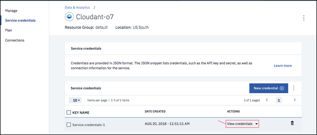
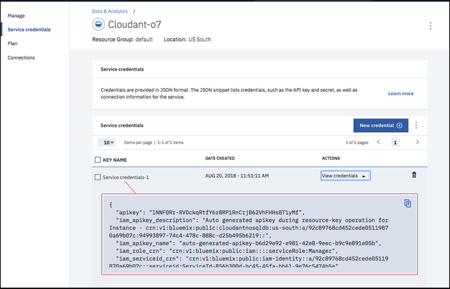

---

copyright:
  years: 2017, 2019
lastupdated: "2019-03-19"

keywords: create service instance, service credentials, locate service credentials

subcollection: cloudant

---

{:new_window: target="_blank"}
{:shortdesc: .shortdesc}
{:screen: .screen}
{:codeblock: .codeblock}
{:pre: .pre}
{:tip: .tip}
{:note: .note}
{:important: .important}
{:deprecated: .deprecated}

<!-- Acrolinx: 2018-09-19 -->

# 在 {{site.data.keyword.cloud_notm}} 上创建 {{site.data.keyword.cloudant_short_notm}} 实例
{: #creating-an-ibm-cloudant-instance-on-ibm-cloud}

本教程说明了如何使用 {{site.data.keyword.cloud}}“仪表板”来创建 {{site.data.keyword.cloudantfull}} 服务实例，以及在何处可找到支持应用程序使用数据库的基本信息。
{: shortdesc} 

## 创建服务实例
{: #creating-a-service-instance}

1.  登录到 {{site.data.keyword.cloud_notm}} 帐户。 
    在以下地址可以找到 {{site.data.keyword.cloud_notm}} 仪表板：[https://cloud.ibm.com/ ](https://cloud.ibm.com/){: new_window}。使用用户名和密码进行认证后，将显示 {{site.data.keyword.cloud_notm}} 仪表板。单击`创建资源`按钮。 
    

2.  单击左侧导航中的`数据库`，以及数据库服务列表中的 `Cloudant`： 
     

3.  在“服务配置”窗口中，输入服务名称。验证服务名称、区域/位置、资源组和认证方法是否正确。可根据需要添加标记。可用的认证方法包括`仅使用 IAM` 或`使用旧凭证和 IAM`。有关更多信息，请参阅[认证方法](/docs/services/Cloudant?topic=cloudant-ibm-cloud-identity-and-access-management-iam-#ibm-cloud-identity-and-access-management-iam-){: new_window}。在此示例中，服务名称为 `Cloudant-o7`： 
    
    
{{site.data.keyword.cloudant_short_notm}} 团队建议您尽可能对 {{site.data.keyword.cloudant_short_notm}} 旧认证使用 IAM 访问控制。
{: important}

4.  缺省情况下，将使用“轻量”价格套餐来创建服务，这是免费套餐，但其中供应的吞吐量容量和数据存储量固定不变。如果您有付费 {{site.data.keyword.cloud_notm}} 帐户，那么还可以选择付费“标准”套餐，以便可以根据需要切换供应的吞吐量容量和缩放数据使用量。有关价格套餐的更多信息，请参阅[套餐](/docs/services/Cloudant?topic=cloudant-ibm-cloud-public#plans){: new_window}。要创建服务，请单击`创建`按钮： 
    

5.  这将显示服务页面，在其中确认新的 {{site.data.keyword.cloudant_short_notm}} 服务是否可用。要创建应用程序连接到服务所需的连接信息，请单击`服务凭证`选项卡： 
    

6.  创建新的 {{site.data.keyword.cloudant_short_notm}} 服务凭证：
   a. 单击`新建凭证`按钮。
   
   b. 在“添加新凭证”窗口中，输入新凭证的名称。请参阅图像。
   c. 接受“管理者”角色。
   d.（可选）创建新的服务标识，或者让系统自动生成服务标识。
   d.（可选）添加内联配置参数。请注意，{{site.data.keyword.cloudant_short_notm}} 服务凭证当前未使用此参数，因此请将其忽略。
   e. 单击`添加`按钮。 
   
   新凭证将显示在表之后。 
   f. 单击“操作”下的`查看凭证`。
   

7.  这将显示服务凭证的详细信息： 
    

这些示例中的服务凭证是在 {{site.data.keyword.cloudant_short_notm}} 上创建演示 {{site.data.keyword.cloudant_short_notm}} 服务时定义的。在此重现这些凭证，是为了显示这些凭证在仪表板中的外观。但是，演示 {{site.data.keyword.cloudant_short_notm}} 服务已除去，因此这些凭证不再有效。您_必须_提供并使用自己的服务凭证。
{: note}

## 服务凭证
{: #the-service-credentials}

服务凭证十分重要。如果任何人或任何应用程序有权访问凭证，那么就能使用服务实例有效地执行所需的一切操作。例如，可能会创建虚假数据，或删除有价值的信息。因此，请谨慎保护这些凭证。

    
{{site.data.keyword.cloudant_short_notm}} 在供应时提供了两种认证方法：`仅使用 IAM` 或`使用旧凭证和 IAM`。仅当选择了`使用旧凭证和 IAM` 认证方法时，才能查看有关旧凭证的详细信息。凭证会显示在实例的“服务凭证”选项卡上。有关更多信息，请参阅 [IAM 指南](/docs/services/Cloudant?topic=cloudant-ibm-cloud-identity-and-access-management-iam-#ibm-cloud-identity-and-access-management-iam-)和[旧认证](/docs/services/Cloudant?topic=cloudant-authentication#authentication)文档，以获取有关使用任一种认证方式的详细信息。

服务凭证包含以下字段：

字段       |用途
------|--------
`username` |URL 中服务实例用户的服务名称。此字段还用作管理用户名。
`password` |应用程序访问服务实例所需的旧凭证密码。仅当选择了`使用旧凭证和 IAM` 选项时，此字段才会显示。
`host`     |应用程序用于查找服务实例的主机名。仅当选择了`使用旧凭证和 IAM` 选项时，此字段才会显示。
`port`     |用于访问主机上服务实例的 HTTPS 端口号。此端口为 443，因为 {{site.data.keyword.cloudant_short_notm}} 只允许 HTTPS 访问。仅当选择了`使用旧凭证和 IAM` 选项时，此字段才会显示。
`url`|用于访问 {{site.data.keyword.cloudant_short_notm}} 实例的 HTTPS URL。如果选择了`使用旧凭证和 IAM` 选项，那么还会包含嵌入的旧用户名和密码。
`apikey`|IAM API 密钥。
`iam_apikey_description`|IAM API 密钥的描述。
`iam_apikey_name`|IAM API 密钥的标识。
`iam_role_crn`|IAM API 密钥具有的 IAM 角色。
`iam_serviceid_crn`|服务标识的 CRN。

要创建可访问服务实例的应用程序，您需要这些凭证。

## 查找服务凭证
{: #locating-your-service-credentials}

您可以随时查找与帐户关联的服务的凭证。

1.  首先，登录到 {{site.data.keyword.cloud_notm}}。在以下地址可以找到 {{site.data.keyword.cloud_notm}} 仪表板：[https://cloud.ibm.com/ ](https://cloud.ibm.com/){: new_window}。使用用户名和密码进行认证后，将显示 {{site.data.keyword.cloud_notm}}“仪表板”： 
    

2.  在此示例中，我们希望查找在本教程先前部分中创建的 {{site.data.keyword.cloudant_short_notm}} 服务实例（名为 `Cloudant-o7`）的服务凭证。单击**菜单**图标 > **资源列表**以及相应的行： 
    

3.  要查看访问服务所需的凭证，请单击`查看凭证`： 
    

4.  这将显示服务凭证的详细信息： 
    

这些示例中的服务凭证是在 {{site.data.keyword.cloudant_short_notm}} 上创建演示 {{site.data.keyword.cloudant_short_notm}} 服务时定义的。在此重现这些凭证，是为了显示这些凭证在仪表板中的外观。但是，演示 {{site.data.keyword.cloudant_short_notm}} 服务已除去，因此这些凭证不再有效。您_必须_提供并使用自己的服务凭证。
{: note}

