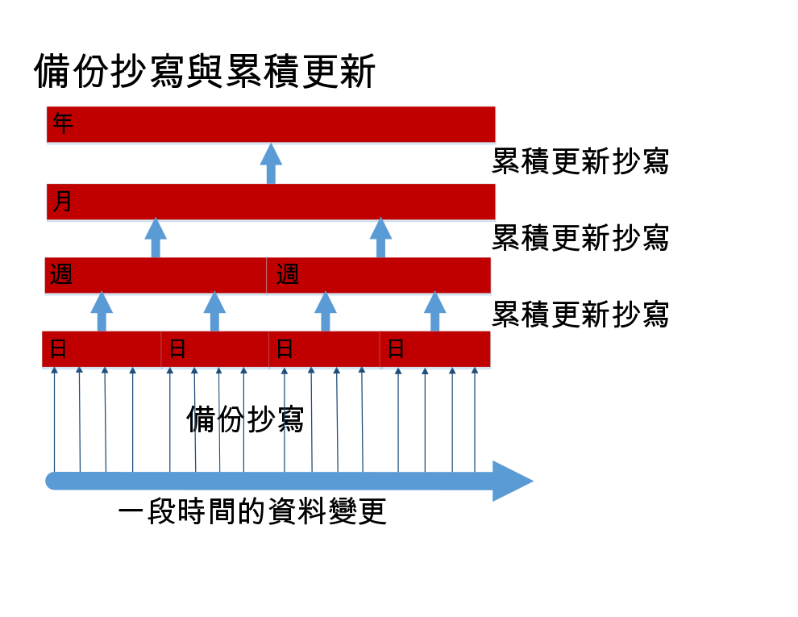

---

copyright:
  years: 2015, 2017
lastupdated: "2017-05-04"

---

{:new_window: target="_blank"}
{:shortdesc: .shortdesc}
{:screen: .screen}
{:codeblock: .codeblock}
{:pre: .pre}

# 備份資料

>   **附註**：本手冊參照*已淘汰* 的每日增量備份功能，
    先前僅適用於「企業」客戶的要求。如需現行備份指引，請參閱[災難回復和備份](disaster-recovery-and-backup.html)手冊。

此功能：
-   依預設不會啟用。
-   僅適用於必須特別要求它的「企業」客戶。
-   必須明確地配置之後，才能正常運作。
-   受限於[已知限制](#known-limitations)。
-   不適用於 [Cloudant Local ](https://www.ibm.com/support/knowledgecenter/SSTPQH_1.0.0/com.ibm.cloudant.local.doc/SSTPQH_1.0.0_welcome.html){:new_window}。如需相關資訊，請聯絡 [IBM Cloudant 小組團隊 ](mailto:support@cloudant.com){:new_window}。

>   **附註**：每日增量備份功能不適用於
    [Cloudant Local ](https://www.ibm.com/support/knowledgecenter/SSTPQH_1.0.0/com.ibm.cloudant.local.doc/SSTPQH_1.0.0_welcome.html){:new_window}。若要備份 Cloudant Local 中的資料，請使用[抄寫](../api/replication.html)來製作資料庫的備份。

為了確保高可用性，{{site.data.keyword.cloudant}} 會對每一份文件建立三個副本，並將它儲存在叢集中三個不同的伺服器上。此作法是所有 Cloudant 使用者的預設操作。即使將您的資料抄寫成三份，備份它仍是很重要的。

備份為什麼如此重要？一般而言，有許多方面可能讓您無法存取資料。例如，如果颶風破壞了您的資料中心，而且三個節點都在該位置，則您會失去資料。您可以將您的資料抄寫至不同地理位置中的叢集（專用或多方承租戶），以避免在災難中失去您的資料。不過，如果是錯誤的應用程式刪除或改寫資料庫中的資料，則複本資料沒有幫助。

具有完整且已測試的備份可讓您充滿自信地回答下列問題：「如果失去資料或資料毀損，我該如何還原資料？」

使用 Cloudant，「企業」客戶可具有每日增量備份。

如果您不是「企業」客戶，或想要建立自己的備份機制，請考量[使用抄寫來執行備份](disaster-recovery-and-backup.html)。

>   **附註**：「企業」客戶的每日增量備份目前是*測試版* 功能。
    依預設，不會啟用。

每日增量備份或「差異」可啟用文件比較，以及更輕鬆地單一文件還原。較小的每日差異會定期（可以配置）累積更新成每週差異。同樣地，每週差異會累積更新成每月差異，而每月差異會累積更新成每年差異。累積更新差異的這個處理程序是能夠確切地還原正確文件版本與需要許多儲存空格之間的務實妥協。

備份機能可讓您手動還原個別文件。如果想要還原整個資料庫（例如，作為災難回復實務範例的一部份），您可以聯絡支援團隊，讓您的資料還原至特定日、週、月或年，取決於可用的差異。

本主題的其餘部分中提供 Cloudant 如何備份資料的相關資訊。如需進一步協助，或要求啟用資料備份，請聯絡 Cloudant 支援團隊：[support@cloudant.com ](mailto:support@cloudant.com){:new_window}。

>   **附註**：Cloudant 備份機能僅適用於「企業」客戶。

>   **附註**：依預設，
    不會備份 `_design` 文件，因此_不會_ 在增量備份資料庫上建置索引。如果需要備份 `_design` 文件，您必須在偏好的來源控制工具中維護它們。

## 概念

參閱備份概念時，瞭解下列術語會很有幫助：

術語                 | 意義
---------------------|--------
備份清理             | 差異資料庫累積更新後，在可配置的時段之後會移除差異資料庫。這可讓您針對儲存空間的成本平衡高精度的資料保留。
備份累積更新         | 每日備份會結合成每週累積更新的資料庫。這些會將每日差異結合成較粗糙（精度較少）的備份。同樣地，每週資料庫會累積更新成每月資料庫，而每月資料庫會累積更新成每年資料庫。

備份執行             | 在備份期間，會使用順序值抄寫來源資料庫，來判斷在備份期間已變更的文件。完成時，此抄寫稱為每日備份。
基準線備份           | 差異資料庫可與其相互比較的文件集合。
每日備份             | 請參閱「備份執行」。
每日差異             | 每日備份的另一個名稱。
差異資料庫           | 在一段時間內已變更的文件集合（「差異」）。
高/低精度            | 這指出您可以指定文件的變更期間的精確度。高精度累積更新的變更期間的時間尺度較短，例如每日備份案例中的「日」。低精度累積更新的變更期間的時間尺度較長，例如每年備份案例中的「年」。
增量備份             | 自前次備份後在資料庫中已變更的文件集合。
累積更新             | 將一組增量備份聚集成較低的精度備份，例如，將一週的每日備份聚集成單一「每週」備份。

## 增量備份

啟用增量備份的首要步驟就是取得整個資料庫的完整備份，這會提供後續增量備份的「基準線」。

在第一個「基準線」備份之後，每天都會取得每日增量備份。每日增量備份只包含自前次備份後在資料庫中已變更的資料。每日備份就是「每日差異」。

作為啟用資料備份之要求的一部分，您可以指定執行備份的特定時刻。每天都會在您指定的時間建立每日差異。

## 累積更新

累積更新會將每日備份結合成每週累積更新的資料庫。這些累積更新資料庫會將每日差異結合成較粗糙或「精度較少」的時間片段。每週資料庫會累積更新成每月資料庫，而每月資料庫會累積更新成每年資料庫。



要求啟用備份時，您應該指定要保留多少個每日差異。一旦達到該數目，最舊的每日差異會累積更新成最新的每週資料庫。此後，會累積更新成每週資料庫，以建立每月資料庫，依此類推。

一旦差異資料庫累積更新後，即會移除它們以釋放儲存空間。

## 還原

當您有資料庫的備份時，您可以檢視該資料庫內的個別文件，也可以查看對該文件所做的變更。您也可以將文件還原至特定日期上的現行版本（如果可在差異精度內使用的話）。

>   **附註**：文件必須是靜態，才能從備份中還原。
    換言之，文件不應該持續接收變更項目和更新項目。

如需更複雜的還原（例如完整資料庫還原），請向 [Cloudant 支援中心 ](mailto:support@cloudant.com){:new_window} 要求協助。

## 使用儀表板

企業客戶可以使用「Cloudant 儀表板」來檢閱備份的狀態及歷程。

您可以執行的作業包括：

-   檢視前次備份的狀態，包括其日期和時間。
-   依日期和時間檢視備份文件版本的清單。
-   檢視現行文件，以及其與任何備份版本之間的差異。
-   從備份版本中還原文件。

### 檢視資料庫備份狀態


在「Cloudant 儀表板」內選取「資料庫」標籤時，您可以看到每一個資料庫的備份狀態欄。

### 檢視文件備份狀態


在資料庫內，您可以檢視特定文件的備份狀態。若要執行此動作，首先請查看您的文件是否有備份圖示（）。這會顯示備份作業內是否包括特定文件。

選取文件時，您可以看到備份標籤。


### 檢視文件備份版本之間的差異，然後還原


按一下文件的備份標籤時，您可以看到現行文件版本之間的差異，以及任何其他備份版本。

如果您決定要還原該文件的特定備份版本，只需選取要還原的備份日期，然後按一下「還原」按鈕。

>   **附註**：文件必須處於靜態，才能從備份中還原。
    換言之，文件不應該持續接收變更項目和更新項目。

## 使用 API

有一些 REST API 呼叫可用於使用 Cloudant 備份機能。

### 作業配置

`task` 呼叫可取得使用者的備份作業配置。

您可以使用 `format` 參數，指定回應中使用的格式。

_要求使用者之備份作業配置的範例，使用 HTTP 以清單格式（預設值）傳回結果：_

```http
GET /_api/v2/backup/task HTTP/1.1
```
{:codeblock}

_要求使用者之備份作業配置的範例，使用指令行以清單格式（預設值）傳回結果：_

```sh
curl https://$ACCOUNT.cloudant.com/_api/v2/backup/task \
    -X GET
```
{:codeblock}

_使用 HTTP 要求使用者之備份作業配置的範例，以對映格式傳回結果：_

```http
GET /_api/v2/backup/task?format=mapping HTTP/1.1
```
{:codeblock}

_使用指令行要求使用者之備份作業配置的範例，以對映格式傳回結果：_

```sh
curl https://$ACCOUNT.cloudant.com/_api/v2/backup/task?format=mapping \
     -X GET
```
{:codeblock}

預設回應格式為清單。您可以使用 `...backup/task?format=list` 參數，直接要求此格式。回應包含針對使用者定義之備份作業的簡式清單。

例如，您可以使用下列任一指令要求清單格式回應：

```http
https://$ACCOUNT.cloudant.com/_api/v2/backup/task

https://$ACCOUNT.cloudant.com/_api/v2/backup/task?format=list
```
{:codeblock}

_遵循清單格式要求的範例回應：_

```json
{
    "rows": [
        {
            "username": "$ACCOUNT",
            "task": "backup-0d0b0cf1b0ea42179f9c082ddc5e07cb",
            "source_db": "backmeup",
            "latest_completion": null
        },
        {
            "username": "$ACCOUNT",
            "task": "backup-d0ea6e8218074699a562af543db66615",
            "source_db": "backuptest",
            "latest_completion": "2016-01-17T05:57:44+00:00"
        },
        {
            "username": "$ACCOUNT",
            "task": "backup-24cd8359b94640be85b7d4071921e781",
            "source_db": "taskdb",
            "latest_completion": "2016-01-17T00:01:04+00:00"
        }
    ]
}
```
{:codeblock}

更完整的回應會以對映格式提供。您可以使用 `...backup/task?format=mapping` 參數，直接要求此格式。

例如，您可以使用下列指令要求對映格式回應：

```http
https://$ACCOUNT.cloudant.com/_api/v2/backup/task?format=mapping
```
{:codeblock}

_遵循對映格式要求的範例回應：_

```json
{
    "backmeup": {
        "username": "$ACCOUNT",
        "task": "backup-0d0b0cf1b0ea42179f9c082ddc5e07cb",
        "source_db": "backmeup",
        "latest_completion": null
    },
    "backuptest": {
        "username": "$ACCOUNT",
        "task": "backup-d0ea6e8218074699a562af543db66615",
        "source_db": "backuptest",
        "latest_completion": "2016-01-17T05:57:44+00:00"
    },
    "taskdb": {
        "username": "$ACCOUNT",
        "task": "backup-24cd8359b94640be85b7d4071921e781",
        "source_db": "taskdb",
        "latest_completion": "2016-01-17T00:01:04+00:00"
    }
}
```
{:codeblock}

### 決定特定資料庫的備份作業

`task` 要求的 `databases` 參數是用來尋找哪些備份作業與指定的資料庫相關聯。

回應會列出 `source_db` 欄位中所識別之資料庫的備份作業詳細資料。識別的 `task` 可用於其他備份 API 呼叫，例如[資料庫清單](#list-of-databases)。

_使用 HTTP 尋找 `backuptest` 及 `taskdb` 資料庫之備份作業的範例指令：_

```http
GET /_api/v2/backup/task?databases=backuptest,taskdb HTTP/1.1
```
{:codeblock}

_使用指令行尋找 `backuptest` 及 `taskdb` 資料庫之備份作業的範例指令：_

```sh
curl https://$ACCOUNT.cloudant.com/_api/v2/backup/task?databases=backuptest,taskdb \
    -X GET
```
{:codeblock}

_尋找特定資料庫之備份作業的範例回應：_

```json
{
    "rows": [
        {
            "username": "$ACCOUNT",
            "task": "backup-d0ea6e8218074699a562af543db66615",
            "source_db": "backuptest",
            "latest_completion": "2016-01-17T05:57:44+00:00"
        },
        {
            "username": "$ACCOUNT",
            "task": "backup-24cd8359b94640be85b7d4071921e781",
            "source_db": "taskdb",
            "latest_completion": "2016-01-17T00:01:04+00:00"
        }
    ]
}
```
{:codeblock}

### 資料庫清單

`monitor` 要求會取得備份作業 `$TASKNAME` 所建立之資料庫的清單，而這些資料庫也包含 `$DOCID` 文件。

此要求支援選用引數：`include_docs`。預設值是 `false`。如果設為 `true`，`monitor` 要求會對每一個包含 `$DOCID` 的備份資料庫傳回完整文件內容。

_使用 HTTP 擷取備份作業所建立之資料庫的清單，而這些資料庫包含特定的文件：_

```http
GET /_api/v2/backup/monitor/$TASKNAME/$DOCID?include_docs=true HTTP/1.1
```
{:codeblock}

_使用指令行擷取備份作業所建立之資料庫的清單，而這些資料庫包含特定的文件：_

```sh
curl https://$ACCOUNT.cloudant.com/_api/v2/backup/monitor/$TASKNAME/$DOCID?include_docs=true \
    -X GET
```
{:codeblock}

### 還原文件

`restore` 呼叫會從來源資料庫取代 `$DOCID` 所識別的文件。來源資料庫由 `$TASKNAME` 識別。`$TASKDATE` 是特定備份的時間戳記，並且是在執行備份時指定的。`$FREQUENCY` 是下列四個值的其中一個：
-   `"daily"`
-   `"weekly"`
-    `"monthly"`
-   `"yearly"`

>   **附註**：文件必須處於靜態，才能從備份中還原。
    換言之，文件不應該在還原進行中時接收任何變更項目和更新項目。

_使用 HTTP 要求還原文件的範例：_

```http
POST /_api/v2/backup/restore/document --data=@RESTORE.json HTTP/1.1
Content-Type: application/json
```
{:codeblock}

_使用指令行要求從特定備份資料庫中保留的最新版本還原文件的範例：_

```sh
curl https://$ACCOUNT.cloudant.com/_api/v2/backup/restore/document --data=@RESTORE.json \
    -X POS \
    -H "Content-Type: application/json" \
    -d "$JSON"
```
{:codeblock}

_JSON 文件的範例，此文件要求從特定備份資料庫中保留的最新版本還原文件：_

```json
{
    "doc_id": $DOCID,
    "task_name": $TASKNAME,
    "task_date": $TASKDATE,
    "frequency": $FREQUENCY
}
```
{:codeblock}

## 使用增量抄寫的備份運作方式

最簡單的備份形式為將資料庫[抄寫](../api/replication.html)至附上日期的備份資料庫。

此方法適用且容易執行。但是，如果資料庫很大，而且您需要多個復原點的備份（例如七個每日備份及四個每週備份），則最終會將所有文件的完整副本儲存在每一個新的備份資料庫中。這可能需要大量儲存空間。

增量備份是很好的解決方案，因為它只會儲存自前次備份後經過變更的文件。

一開始，您會執行整個資料庫的備份。在第一次備份之後，您可以執行定期的增量備份，只備份資料庫中自前次備份後經過變更的項目。通常，這些遞增量備份一天進行一次，因此這個抄寫為每日備份。

增量備份僅儲存各備份之間的差異。來源資料庫會定期抄寫至目標資料庫。抄寫會使用順序值，以識別在間隔期間經過變更的文件。

備份作業會使用抄寫來取得並儲存檢查點。這個檢查點是另一個具有內部名稱的資料庫。

資料庫的抄寫處理程序一開始會先尋找 `since_seq` 參數的值。此參數指出前次抄寫完成之處。

>   **附註**：根據定義，使用 `since_seq` 選項會停用一般抄寫檢查點檢查作業機能。務必小心使用 `since_seq`。 

下列步驟概述如何建立增量備份：

1.  [尋找前次抄寫之檢查點文件的 ID。](#find-the-id-of-the-checkpoint-document-for-the-last-replication)
2.  [取得 `recorded_seq` 值。](#get-the-recorded_seq-value)
3.  [執行增量備份。](#run-an-incremental-backup)

### 尋找前次抄寫之檢查點文件的 ID。

檢查點 ID 值儲存在 `_replicator` 資料庫中抄寫文件的 `_replication_id` 欄位中。

_使用 HTTP 為資料庫（稱為 `original`）取得前次增量備份之檢查點 ID 的範例要求：_

```http
GET /_replicator/original HTTP/1.1
```
{:codeblock}

_使用指令行為資料庫（稱為 `original`）取得前次增量備份之檢查點 ID 的範例要求：_

```sh
replication_id=$(curl "${url}/_replicator/original" | jq -r '._replication_id')
```
{:pre}

### 取得 `recorded_seq` 值

在取得檢查點 ID 之後，您可以使用它，從歷程陣列（位於原始資料庫的 `/_local/${replication_id}` 文件中）的第一個元素中取得 `recorded_seq` 值。

_使用 HTTP 從稱為 `original` 的資料庫中取得 `recorded_seq` 值的範例：_

```http
GET /original/_local/${replication_id} HTTP/1.1
```
{:codeblock}

_使用指令行從稱為 `original` 的資料庫中取得 `recorded_seq` 值的範例：_

```sh
recorded_seq=$(curl "${url}/original/_local/${replication_id}" | jq -r '.history[0].recorded_seq')
```
{:pre}

### 執行增量備份

既然您具有檢查點 ID 及 `recorded_seq`，就可以啟動新的增量備份。

_使用 HTTP 對稱為 `newbackup` 的增量資料庫啟動新的增量備份的範例：_

```http
PUT /_replicator/newbackup HTTP/1.1
Content-Type: application/json
```
{:codeblock}

_使用指令行對稱為 `newbackup` 的增量資料庫啟動新的增量備份的範例：_

```sh
curl -X PUT "${url}/_replicator/newbackup" -H "${ct}" -d @newbackup.json
```
{:codeblock}

_指定增量備份的 JSON 檔案範例：_

```json
{
    "_id": "newbackup",
    "source": "${url}/original",
    "target": "${url}/newbackup",
    "since_seq": "${recorded_seq}"
}
```
{:codeblock}

## 已知限制

>   **附註**：「企業」客戶的每日增量備份目前是「測試版」功能。
    依預設，不會啟用。

-   IBM Cloudant Backup 及關聯的還原功能係根據基礎抄寫技術。影響或甚至岔斷抄寫的因素將影響或甚至停滯備份或還原處理程序。
-   如果資料庫很龐大（例如，大小超過 100GB），則備份及還原處理程序可能需要相當長的時間。這適用於起始備份，資料庫若很龐大，可能需要數天的時間才能完成。同樣地，還原處理程序可能需要數小時到數天的時間，再次取決於資料庫的大小。
-   若為大型每日備份，備份處理程序可能無法在一天（24 小時）內完成。備份處理程序通常會執行至完成，因此它將包括多天的增量變更。
-   目前不支援備份完整使用者帳戶。反之，您必須在使用者帳戶內指定您要啟用以進行備份或還原的每一個資料庫。目前，在任何一個使用者帳戶內，最多只能啟用 50 個資料庫進行備份。
-   IBM Cloudant Backup 機能目前不支援[設計文件](../api/design_documents.html)的備份或還原。如果需要設計文件的備份，您必須使用偏好的來源控制工具來維護它們。
-   目前，執行資料庫還原的目標資料庫必須不同於原始來源資料庫。
