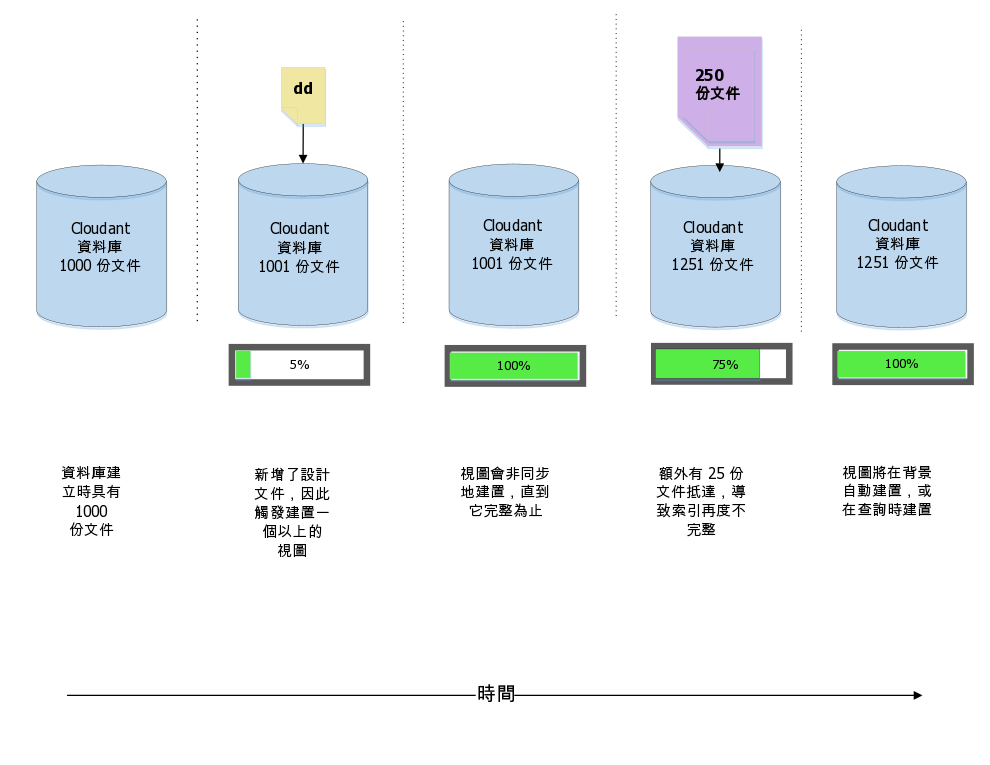
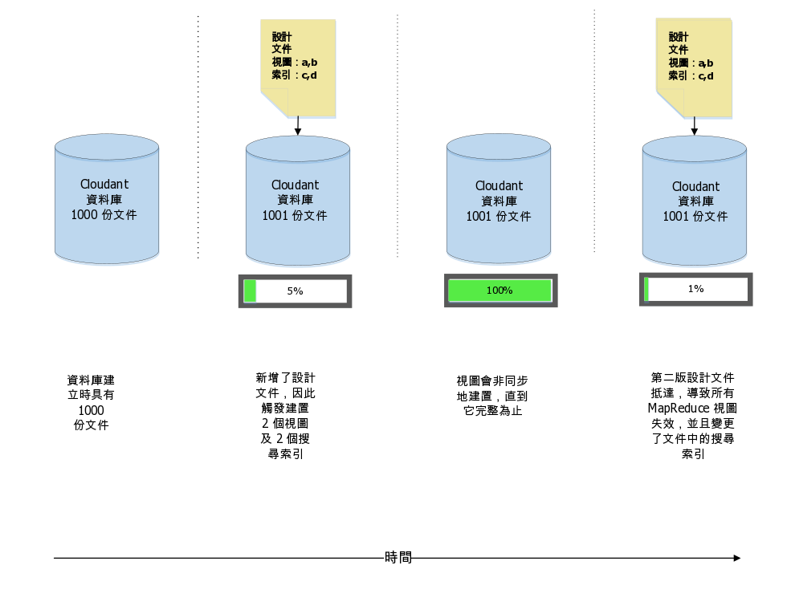
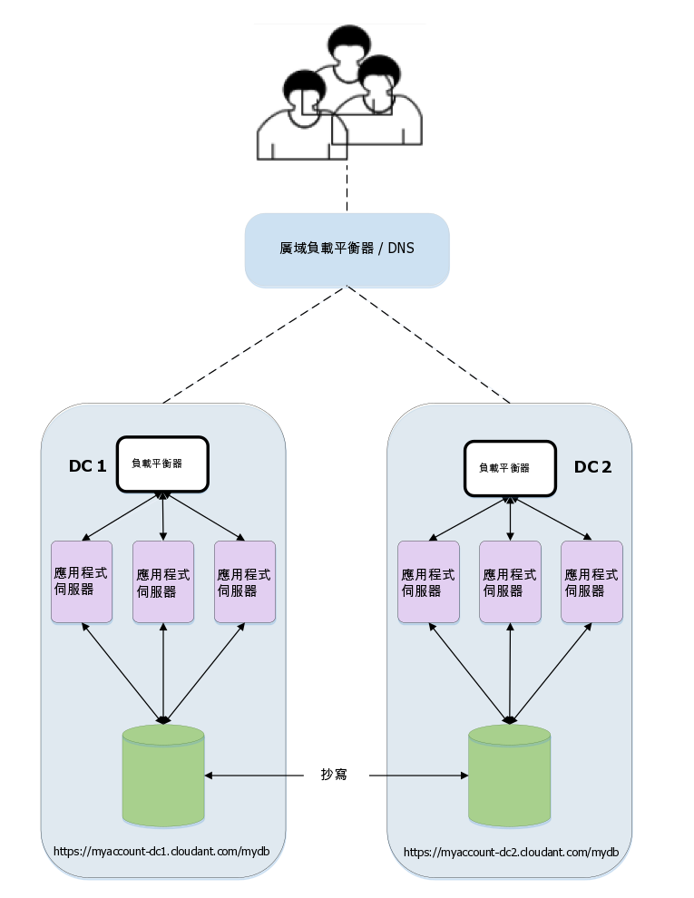

---

copyright:
  years: 2015, 2019
lastupdated: "2019-03-15"

keywords: multiple views, changes, versioned design documents, move and switch, the stale parameter

subcollection: cloudant

---

{:new_window: target="_blank"}
{:shortdesc: .shortdesc}
{:screen: .screen}
{:codeblock: .codeblock}
{:pre: .pre}
{:tip: .tip}
{:note: .note}
{:important: .important}
{:deprecated: .deprecated}

<!-- Acrolinx: 2017-05-10 -->

# 設計文件管理
{: #design-document-management}

*由 Glynn Bird（IBM Cloudant 的開發人員代言人）提出的文章，[glynn@cloudant.com ](mailto:glynn@cloudant.com){: new_window}*

{{site.data.keyword.cloudantfull}} 的可擴充 JSON 資料儲存庫具有數個查詢機制，全都會對核心資料產生個別建立且維護的索引。儲存文件時，不會立即執行索引。相反地，它會排定在稍後發生，這會提供更快、非封鎖的寫入量。

-   MapReduce 視圖是資料集的索引，搭配 BTree 中儲存的索引鍵值組，可依索引鍵或索引鍵範圍進行有效的擷取
-   「搜尋索引」是使用 Apache Lucene 建構的，容許任意文字搜尋、資料類型作業，以及複雜的特定查詢

{{site.data.keyword.cloudant_short_notm}} 的[搜尋索引](/docs/services/Cloudant?topic=cloudant-search#search)及 [MapReduce 視圖](/docs/services/Cloudant?topic=cloudant-views-mapreduce#views-mapreduce)的配置方法為將「設計文件」新增至資料庫。
「設計文件」是 JSON 文件，其中包含如何建置視圖或索引的相關資訊。讓我們舉一個簡單範例。假設我們具有資料文件的簡單集合，類似於下列範例：

_簡單資料文件的範例：_

```json
{
    "_id": "23966717-5A6F-E581-AF79-BB55D6BBB613",
    "_rev": "1-96daf2e7c7c0c277d0a63c49b57919bc",
    "doc_name": "Markdown Reference",
    "body": "Lorem Ipsum",
    "ts": 1422358827
}
```
{: codeblock}

每一個資料文件都包括名稱、內文及時間戳記。我們想要建立 [MapReduce 視圖](/docs/services/Cloudant?topic=cloudant-views-mapreduce#views-mapreduce)，依時間戳記排序我們的文件。

作法為建立 Map 函數，類似於下列範例：

_傳回文件的時間戳記欄位（如果存在的話）的 map 函數範例：_

```javascript
function(doc) {
    if (doc.ts) {
        emit( doc.ts, null);
    }
}
```
{: codeblock}

此函數會發出文件的時間戳記，讓我們可以使用它作為索引的索引鍵；當我們對索引中的值沒有興趣時，會發出 `null`。效果為在文件集中提供時間導向的索引。

我們會將此視圖稱為 "`by_ts`"，並將它放入稱為 "`fetch`" 的「設計文件」中，如下列範例所示。

_使用 map 函數定義視圖的設計文件範例：_

```json
{
    "_id": "_design/fetch",
    "views": {
      "by_ts": {
        "map": "function(doc) {
          if (doc.ts) {
            emit( doc.ts, null);
          }
        }"
      }
    },
    "language": "javascript"
}
```
{: codeblock}

結果為我們的對映程式碼已轉換為 JSON 相容字串，並內含在「設計文件」中。

儲存「設計文件」之後，{{site.data.keyword.cloudant_short_notm}} 就會觸發伺服器端處理程序來建置 `fetch/by_ts` 視圖。
作法為反覆運算資料庫中的每一份文件，並將每一份文件傳送至 Javascript map 函數。此函數會傳回已發出的鍵值組。當反覆運算繼續時，每一個鍵值組都會儲存在 B-Tree 索引中。在第一次建置索引之後，只會對新的及更新的文件執行後續的重新索引。已刪除的文件會解除索引。此省時的處理程序稱為*增量 MapReduce*，如下圖所示：



此時值得記住：

-   索引的建構會非同步發生。{{site.data.keyword.cloudant_short_notm}} 確認已儲存我們的「設計文件」，但若要檢查索引的建構進度，必須輪詢 {{site.data.keyword.cloudant_short_notm}} 的 [`_active_tasks`](/docs/services/Cloudant?topic=cloudant-active-tasks#active-tasks) 端點。
-   我們具有的資料越多，則索引就緒所需的時間就越長。
-   當起始索引建置進行中時，_針對該索引所做的任何查詢都將封鎖_。
-   查詢視圖會觸發尚未增量索引之任何文件的「對映」。這確保取得最新的資料視圖。如需此規則的例外狀況資訊，請參閱下列 ['`stale`' 參數](#the-stale-parameter)討論。

## 相同設計文件中的多重視圖
{: #multiple-views-in-the-same-design-document}

如果在相同的設計文件中定義數個視圖，則會同時有效地建置它們。每一份文件只會讀取一次，並透過每一個視圖的 Map 函數傳遞。此方法的缺點為，修改設計文件會讓該文件中定義的_所有現有 MapReduce 視圖失效_，即使部分視圖保持不變也一樣。 

如果必須彼此獨立變更 MapReduce 視圖，請將其定義放置在個別的設計文件中。 

此行為不適用於 Lucene 搜尋索引。您可在相同的設計文件內變更它們，這不會讓相同文件中其他未變更的索引失效。
{: note}



## 管理設計文件的變更
{: #managing-changes-to-a-design-document}

想像在未來的某個時刻，我們決定變更視圖的設計。現在，不是傳回實際的時間戳記結果，而是我們只對有多少份文件符合準則感興趣。為了達成此目的，map 函數會保持相同，但我們現在使用 _reduce_（共有 "`_count`"）。效果是我們的設計文件看起來像下列範例。

_使用 reduce 函數的設計文件範例：_

```json
{
    "_id": "_design/fetch",
    "_rev": "2-a2324c9e74a76d2a16179c56f5315dba",
    "views": {
        "by_ts": {
            "map": "function(doc) {
                if (doc.ts) {
                  emit( doc.ts, null);
                }
            }
        }",
        "reduce": "_count"
    },
    "language": "javascript"
}
```
{: codeblock}

儲存此設計文件時，{{site.data.keyword.cloudant_short_notm}} 會讓舊索引完全失效，並開始從頭建置新的索引，輸流反覆運算每一份文件。
進行原始建置時，所需時間取決於資料庫中有多少文件，並會封鎖該視圖上送入的查詢，直到完成為止。

但發生問題...

如果有一個應用程式正在_即時_ 存取此視圖，則我們很可能會遇到部署困境：

-   根據原始「設計文件」的程式碼的第 1 版可能不再運作，因為舊視圖已失效。
-   使用新「設計文件」的程式碼的第 2 版無法立即釋出，因為新視圖尚未完成建置，尤其是在資料庫中有許多文件時。
-   影響程式碼的更微妙問題為第 1 版與第 2 版預期來自視圖的結果資料不同：第 1 版預期為相符文件的清單，而第 2 版則預期為結果數「減少」。

## 協調設計文件的變更
{: #coordinating-changes-to-design-documents}

您可以利用下列兩種方式來處理此變更控制問題。

### 版本化的設計文件
{: #versioned-design-documents}

一種解決方案為使用版本化的設計文件名稱：

-   程式碼一開始會寫入至稱為 `_design/fetchv1` 的視圖。
-   開始釋出新版本時，會建立一個稱為 `_design/fetchv2` 的新視圖，並查詢該視圖以確定它開始建置。
-   輪詢 `_active_tasks`，直到建置新索引的工作完成。
-   現在我們已準備好釋出取決於第二個視圖的程式碼。
-   確定不再需要 `_design/fetchv1` 時，請將它刪除。

使用版本化的設計文件是一種簡單方式，可管理「設計文件」中的變更控制，只要您記住日後要移除較舊的版本！

### 「移動及切換」設計文件
{: #-move-and-switch-design-documents}

另一種方法係根據 {{site.data.keyword.cloudant_short_notm}} 在具有兩份相同的設計文件時可辨識它們的事實，因此在重建已有的視圖時不會浪費時間及資源。
換言之，如果取得設計文件 `_design/fetch`，並建立完全相同的複本 `_design/fetch_OLD`，則這兩個端點將可交換運作，不會觸發任何重新索引。

切換至新視圖的程序如下：

1.  建立想要變更之設計文件的副本，例如，方法為將 `_OLD` 新增至其名稱：`_design/fetch_OLD`。
2.  使用名稱與字尾 `_NEW` 搭配，將新的或「送入的」設計文件放入資料庫中：`_design/fetch_NEW`。
3.  查詢 `fetch_NEW` 視圖，以確保它開始建置。
4.  輪詢 `_active_tasks` 端點，並等到索引完成建置。
5.  將新設計文件的副本放入 `_design/fetch` 中。
6.  刪除「設計文件」`_design/fetch_NEW`。
7.  刪除「設計文件」`_design/fetch_OLD`。

## 移動及切換工具
{: #move-and-switch-tooling}

您可以利用指令行 Node.js Script，自動執行「移動及切換」程序（稱為 '`couchmigrate`'）。它可以如下所示進行安裝。

_安裝 Node.js `couchmigrate` Script 的指令：_

```sh
npm install -g couchmigrate
```
{: codeblock}

若要使用 `couchmigrate` Script，請先透過設定稱為 `COUCH_URL` 的環境變數來定義 CouchDB/{{site.data.keyword.cloudant_short_notm}} 實例的 URL。

_定義 {{site.data.keyword.cloudant_short_notm}} 實例的 URL：_

```sh
export COUCH_URL=http://127.0.0.1:5984
```
{: codeblock}

URL 可以是 HTTP 或 HTTPS，而且可以包括鑑別認證。

_定義具有鑑別認證之 {{site.data.keyword.cloudant_short_notm}} 實例的 URL：_

```sh
export COUCH_URL=https://$ACCOUNT:$PASSWORD@$HOST.cloudant.com
```
{: codeblock}

假設具有 JSON 格式的設計文件（儲存在檔案中），則可以執行移轉指令。

在此範例中，`db` 指定要變更的資料庫名稱，而 `dd` 指定「設計文件」檔案的路徑。

_執行 `couchmigrate` 指令：_

```sh
couchmigrate --db mydb --dd /path/to/my/dd.json
```
{: pre}

Script 會協調「移動及切換」程序，等到視圖完成建置後再返回。如果送入的設計文件與現任的設計文件相同，則 Script 幾乎立即返回。

這裡提供 Script 的原始碼：[https://github.com/glynnbird/couchmigrate ](https://github.com/glynnbird/couchmigrate){: new_window}。

## '`stale`' 參數
{: #the-stale-parameter}

如果索引完成，但有新記錄新增至資料庫中，則索引會排定為在背景中更新。這是資料庫的狀態，如下圖所示：



查詢視圖時，有三個選項：

-   預設行為是確保在傳回答案之前索引保持最新狀態，而且資料庫中有最新文件。查詢視圖時，{{site.data.keyword.cloudant_short_notm}} 首先會對 250 份新文件編製索引，然後傳回答案。
-   替代方案為將 "`stale=ok`" 參數新增至 API 呼叫。此參數表示「傳給我已編製索引的資料，我不在意最新的更新項目」。換言之，利用 "`stale=ok`" 查詢視圖時，{{site.data.keyword.cloudant_short_notm}} 會立即傳回答案，不進行任何其他重新索引。
-   第二個替代方案為將 "`stale=update_after`" 參數新增至 API 呼叫。此參數表示「傳給我已編製索引的資料，_並且_ 接著對任何新文件重新編製索引」。換言之，利用 "`stale=update_after`" 查詢視圖時，{{site.data.keyword.cloudant_short_notm}} 會立即傳回答案，並且接著排定背景作業來對新資料編製索引。

新增 "`stale=ok`" 或 "`stale=update_after`" 可能是更快從視圖取得答案的好方式，但會以即時性為代價。 

預設行為會將負載平均分配至 {{site.data.keyword.cloudant_short_notm}} 叢集的各個節點。如果使用替代方案 `stale=ok` 或 `stale=update_after` 選項，這可能會優先使用叢集節點的子集，以從最終一致集合傳回一致結果。這表示 '`stale`' 參數不是所有使用案例的完美解決方案。不過，如果您的應用程式樂意接受過時的結果，則對快速變更的資料集提供及時回應，可能會很有用。如果資料的變更率很小，新增 "`stale=ok`" 或 "`stale=update_after`" 將不會帶來效能優勢，而且可能無法在大型叢集上平均分配負載。
{: note}

盡可能避免使用 `stale=ok` 或 `stale=update_after`。原因是預設行為會提供全新資料，並在叢集內分送資料。如果可讓用戶端應用程式意識到有一個大型資料處理作業進行中（例如，定期大量資料更新），則應用程式可在這些時間暫時切換至 `stale=ok`，之後再回復為預設行為。

仍提供 `stale` 選項，但提供更有用的選項 `stable` 及 `update`，必須改用它們。如需相關資訊，請參閱[存取過時視圖](/docs/services/Cloudant?topic=cloudant-using-views#view-freshness)。
{: note}
