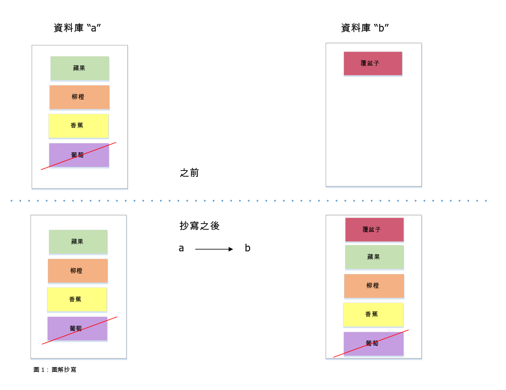
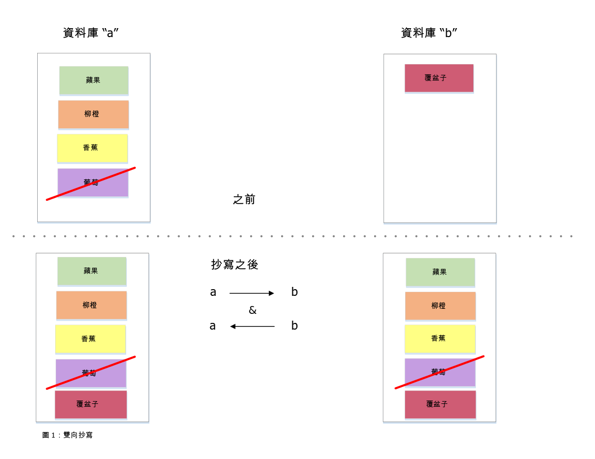

---

copyright:
  years: 2015, 2019
lastupdated: "2019-03-15"

keywords: start replicating with dashboard, run replication across different accounts, run replication on source or destination, start replication with api, checkpoints, permissions, two-way replication, continuous replication, monitoring replication, canceling replication, filtered replication, changes feed, pitfalls, tuning replication speed

subcollection: cloudant

---

{:new_window: target="_blank"}
{:shortdesc: .shortdesc}
{:screen: .screen}
{:codeblock: .codeblock}
{:pre: .pre}
{:tip: .tip}
{:note: .note}
{:important: .important}
{:deprecated: .deprecated}

<!-- Acrolinx: 2017-05-10 -->

# 抄寫手冊
{: #replication-guide}

可以在相同的 {{site.data.keyword.cloudantfull}} 帳戶中、跨帳戶以及跨資料中心，將資料從某個資料庫複製到另一個資料庫。
{: shortdesc}

使用 [{{site.data.keyword.cloudant_short_notm}} Sync ](https://cloudant.com/product/cloudant-features/sync/){: new_window} 或 [PouchDB ](http://pouchdb.com/){: new_window}，即可在 {{site.data.keyword.cloudant_short_notm}} 帳戶與行動裝置之間來回抄寫資料。
抄寫可以單向或雙向執行為「一次性」或持續作業，並且可以使用參數進行微調。

{{site.data.keyword.cloudant_short_notm}} 的抄寫通訊協定與某範圍的其他資料庫及程式庫相容，使其最適用於 Internet of Things (IoT) 及行動應用程式。

本手冊介紹 {{site.data.keyword.cloudant_short_notm}} 的抄寫功能、討論一般使用案例，以及顯示如何順利抄寫應用程式。

## 何謂抄寫？
{: #what-is-replication}

{{site.data.keyword.cloudant_short_notm}} 是具有 HTTP API 的分散式 JSON 資料儲存庫。
在多個雲端上或您的伺服器框架中，{{site.data.keyword.cloudant_short_notm}} 可以執行為服務。
文件會儲存在資料庫中，而且可以成長到任何大小，因為 {{site.data.keyword.cloudant_short_notm}} 會將其資料分派到多個節點。
抄寫是將資料從來源資料庫複製到目標資料庫。來源及目標資料庫不需要位在相同的 {{site.data.keyword.cloudant_short_notm}} 帳戶中，甚至不需要在相同的資料中心內。



來源中每份文件的最新版本傳送至目的地資料庫時，抄寫即完成。傳送包括新文件、現有文件的更新項目，以及刪除項目。在抄寫之後，只會保留最新版本的文件；較舊的版本則會予以省略。

抄寫的來源資料庫會保持不變，這與寫入它的檢查點資料不同，而這項檢查點資料容許從上一個已知位置繼續局部抄寫。會保留目的地資料庫中的任何既有資料。

## 如何使用儀表板開始抄寫
{: #how-to-start-replication-by-using-the-dashboard}

{{site.data.keyword.cloudant_short_notm}} 儀表板提供一種便利的使用者介面來觸發抄寫。
按一下 {{site.data.keyword.cloudant_short_notm}} 儀表板上的`抄寫`標籤，然後按一下`開始抄寫`。
請完成下列表單：


基於安全目的，{{site.data.keyword.cloudant_short_notm}} 團隊建議您針對抄寫工作使用 IAM API 金鑰或 {{site.data.keyword.cloudant_short_notm}} 舊式鑑別 [API 金鑰](/docs/services/Cloudant?topic=cloudant-authorization#api-keys){: new_window}，而不是帳戶層次認證。如需相關資訊，請參閱 [IAM 手冊](/docs/services/Cloudant?topic=cloudant-ibm-cloud-identity-and-access-management-iam-#ibm-cloud-identity-and-access-management-iam-){: new_window}或舊式[授權 API 文件](/docs/services/Cloudant?topic=cloudant-authentication#authentication){: new_window}及舊式[授權 API 文件](/docs/services/Cloudant?topic=cloudant-authorization#authorization){: new_window}。
{: important}

使用此表單，定義來源及目標資料庫，然後按一下`開始抄寫`。


按一下`抄寫`標籤，即可顯示每個抄寫作業的狀態。
每個進行中工作的狀態都會從`執行中`變更為`已完成`。


## 如何跨不同的 {{site.data.keyword.cloudant_short_notm}} 帳戶執行抄寫
{: #how-to-run-replication-across-different-ibm-cloudant-accounts}

抄寫的來源及目標是 {{site.data.keyword.cloudant_short_notm}} 資料庫的 URL，如下列範例所示。

_定義抄寫來源及目標 URL 的範例：_

```json
{
    "source": "https://myfirstaccount.cloudant.com/a",
    "target": "https://mysecondaccount.cloudant.com/b"
}
```
{: codeblock}

來源及目標不需要位在相同的帳戶中。來源及目標資料庫名稱不需要相符。您必須獲得授權才能存取來源及目標，而且您必須獲得授權才能寫入目標。

## 抄寫是在來源還是目的地上執行？
{: #is-replication-run-on-the-source-or-the-destination}

抄寫可以在來源或目的地端上啟動。此選項表示您可以決定帳戶 A 將資料推送至帳戶 B，還是帳戶 B 從帳戶 A 取回資料。在某些情況下，可能無法在任一配置中執行抄寫（例如，其中一個帳戶受防火牆保護時）。抄寫透過 HTTP 或 HTTPS 進行，因此不需要開啟非標準埠。您可以自行決定從哪個裝置開始抄寫。

## 如何使用 {{site.data.keyword.cloudant_short_notm}} API 開始抄寫
{: #how-to-start-replication-by-using-the-ibm-cloudant-api}

每個 {{site.data.keyword.cloudant_short_notm}} 帳戶都有稱為 `_replicator` 的特殊資料庫，您在其中可以插入抄寫工作。
將文件新增至 `_replicator` 資料庫，以開始抄寫。這份文件說明想要的抄寫，並包含下列欄位：

欄位            |用途
----------------|--------
`_id`           |提供 `_id` 欄位是選用作業，但可以用於識別抄寫作業。如果您未提供值，則 {{site.data.keyword.cloudant_short_notm}} 會為您產生值。
`source`        |來源 {{site.data.keyword.cloudant_short_notm}} 資料庫的 URL（包括登入認證）。
`target`        |目的地 {{site.data.keyword.cloudant_short_notm}} 資料庫的 URL（包括登入認證）。
`create_target` |（選用）判斷是否要建立不存在的目的地資料庫。

_使用 HTTP 開始抄寫工作的範例：_

```http
POST /_replicator HTTP/1.1
Content-Type: application/json
Host: $ACCOUNT.cloudant.com
Authorization: ...
```
{: codeblock}

_使用指令行開始抄寫工作的範例：_

```sh
curl -X POST \
    -H 'Content-type: application/json' \
    'https://$ACCOUNT.cloudant.com/_replicator' \
    -d '@replication.json'
```
{: codeblock}

_說明想要的抄寫的範例 JSON 文件：_

```json
{
    "_id": "weekly_backup",
    "source": "https://$ACCOUNT:$PASSWORD@$ACCOUNT1.cloudant.com/source",
    "target": "https://$ACCOUNT:$PASSWORD@$ACCOUNT2.cloudant.com/destination",
    "create_target": true
}
```
{: codeblock}

## 抄寫如何影響變更清單？
{: #how-does-replication-affect-the-list-of-changes-}

您可以使用 [`_changes` 端點](/docs/services/Cloudant?topic=cloudant-databases#get-changes)，以取得對文件進行的變更清單。不過，{{site.data.keyword.cloudant_short_notm}} 資料庫的分散式本質表示 `_changes` 資訊來源所提供的回應不能是特定日期和時間之後發生的簡單變更清單。

[CAP 定理](/docs/services/Cloudant?topic=cloudant-cap-theorem#cap-theorem)討論清楚指出 {{site.data.keyword.cloudant_short_notm}} 使用「最終一致」的模型。
此模型表示，如果您同時要求文件的資料庫的兩個不同抄本，則在其中一個資料庫副本仍然等待完成抄寫時，可能會取得不同結果。最後，資料庫副本會完成其抄寫，因此每一個副本中都會有對文件的所有變更。

這個「最終一致性」模型有兩個影響變更清單的特徵：

1.  影響文件的變更幾乎一定會在不同的時間於資料庫的不同副本中發生。
2.  在資料庫的不同副本之間，變更影響文件的順序可能會不同（視抄寫的發生時間及位置而定）。

第一個特徵的結果是，當您要求變更清單時，要求特定時間點之後的變更清單並沒有意義。原因在於變更清單可能是由不同的資料庫副本所提供，因而導致不同時間的文件更新。不過，要求特定變更之後的變更清單_有_ 其意義，而此特定變更是使用序列 ID 所指定。

第一個特徵的額外結果是，可能需要「回顧」先前的變更，以與變更清單一致。換句話說，若要取得變更清單，請從與資料庫副本一致的最新變更開始。使用讓資料庫副本之間的抄寫同步的[檢查點](#checkpoints)機制，即可識別 {{site.data.keyword.cloudant_short_notm}} 內資料庫副本之間的一致點。

最後，第二個性質的結果是，出現在變更清單中的個別變更可能會以不同的順序呈現在不同資料庫副本所回答的後續要求中。換句話說，起始變更清單可能會以 `A`、`B`、`C` 這個順序報告變更。但是，後續的變更清單可能會以 `C`、`A`、`B` 這個順序報告變更。所有變更都會列出，但順序不同。這項差異的原因是，抄寫期間所收到的一系列變更在資料庫的兩個不同副本之間可能會不同。

### 「最終一致性」對變更清單的意義為何
{: #what-eventual-consistency-means-for-the-list-of-changes}

當您要求變更清單時，您收到的回應可能會不同（視哪個資料庫副本提供清單而定）。

如果您使用 `since` 選項來取得特定更新序列 ID 之後的變更清單，則一律會取得該更新之後的變更清單，_而且_ 也可能會取得該更新之前的某些變更。原因在於回應清單要求的資料庫副本必須確定它列出的變更與所有抄本一致。為了達到該一致性，資料庫副本可能需要從所有副本都一致的時間點開始變更清單。此時間點是使用檢查點進行識別。

因此，使用 `_changes` 資訊來源的應用程式必須是[等冪 ](http://www.eaipatterns.com/IdempotentReceiver.html){: new_window}。等冪表示應用程式必須可以安全地接收相同的資料多次，而且重複要求的順序可能會不同。

## 檢查點
{: #checkpoints}

抄寫處理程序會在內部將其狀態寫入來源及目的地資料庫中所儲存的「檢查點」文件內。檢查點容許從其停止位置繼續抄寫作業，而不需要從頭開始。在您要求抄寫時提供 [`"use_checkpoints": false`](/docs/services/Cloudant?topic=cloudant-replication-api#replication-document-format) 選項，即可防止建立檢查點。如果您的抄寫是要有效率地從其上一個已知位置繼續，則這有助於開啟這項特性。

## 許可權
{: #permissions}

需要有管理者存取權，才能將文件插入 `_replicator` 資料庫。來源及目標參數中所提供的登入認證不需要完整的管理者許可權。如果認證可以進行下列作業，則這就已足夠：

-   在目的地端寫入文件。
-   在兩端寫入檢查點文件。

{{site.data.keyword.cloudant_short_notm}} 具有特殊 `_replicator` 使用者許可權。此許可權容許建立檢查點文件，但不容許在資料庫中建立一般文件。一般而言，會[建立 API 金鑰](/docs/services/Cloudant?topic=cloudant-authorization#creating-api-keys)，而 API 金鑰具有：

-   來源端的 `_reader` 及 `_replicator` 存取權。
-   目的地端的 `_reader` 及 `_writer` 存取權。

根據每個資料庫，可以在 {{site.data.keyword.cloudant_short_notm}} 儀表板內建立及配置 API 金鑰。


使用 {{site.data.keyword.cloudant_short_notm}} API，也可以[透過程式設計方式](/docs/services/Cloudant?topic=cloudant-authorization#creating-api-keys)建立它們。

基於安全目的，{{site.data.keyword.cloudant_short_notm}} 團隊建議您針對抄寫工作使用 IAM API 金鑰或 {{site.data.keyword.cloudant_short_notm}} 舊式鑑別 [API 金鑰](/docs/services/Cloudant?topic=cloudant-authorization#creating-api-keys){: new_window}，而不是帳戶層次認證。如需相關資訊，請參閱 [IAM 手冊](/docs/services/Cloudant?topic=cloudant-ibm-cloud-identity-and-access-management-iam-#ibm-cloud-identity-and-access-management-iam-){: new_window}或舊式[授權 API 文件](/docs/services/Cloudant?topic=cloudant-authentication#authentication){: new_window}及舊式[授權 API 文件](/docs/services/Cloudant?topic=cloudant-authorization#authorization){: new_window}。
{: important}

## 雙向抄寫
{: #two-way-replication}

在稱為雙向抄寫或同步化的處理程序中，可以雙向複製資料。啟用此同步化的方式是設定兩個不同的抄寫處理程序，而其中一個接受從 A 到 B 的資料，另一個則接受從 B 到 A 的資料。兩個抄寫處理程序會獨立運作，並且雙向順暢地移動資料。



## 有關持續抄寫的討論
{: #discussion-about-continuous-replication}

到目前為止，討論只涉及一次性抄寫，而這會在將所有來源資料寫入目標資料庫時完成。使用持續抄寫，資料會持續流動。來源資料庫的所有後續變更都會即時傳輸至目標資料庫。

當您在 {{site.data.keyword.cloudant_short_notm}} 儀表板中定義抄寫作業時按一下`將此抄寫設為持續`勾選框，或在 {{site.data.keyword.cloudant_short_notm}} API 中設定 [`continuous`](/docs/services/Cloudant?topic=cloudant-replication-api#replication-document-format) 旗標，即會觸發持續抄寫。

設定 `continuous` 旗標，即可以單向或雙向持續進行雙向抄寫。

_使用 HTTP 開始持續抄寫的範例：_

```http
POST /_replicator HTTP/1.1
Content-Type: application/json
Host: $ACCOUNT.cloudant.com
Authorization: ...
```
{: codeblock}

_使用指令行開始持續抄寫的範例：_

```sh
curl -X POST \
    -H "Content-type: application/json" \
    https://$ACCOUNT.cloudant.com/_replicator \
    -d @continuous-replication.json
```
{: codeblock}

_定義持續抄寫的 JSON 文件的範例：_

```json
{
    "_id": "weekly_continuous_backup",
    "source": "https://$ACCOUNT:$PASSWORD@$ACCOUNT1.cloudant.com/source",
    "target": "https://$ACCOUNT:$PASSWORD@$ACCOUNT2.cloudant.com/destination",
    "continuous": true
}
```
{: codeblock}

## 監視抄寫狀態
{: #monitoring-replication-status}

您隨時可以使用儀表板或 API 來檢查 {{site.data.keyword.cloudant_short_notm}} `_replicator` 資料庫的狀態。

如果抄寫失敗（例如，如果鑑別認證無效），則錯誤狀態會記錄在 `_replicator` 文件中。此外，也可以使用 {{site.data.keyword.cloudant_short_notm}} 帳戶的 [`/_active_tasks` 端點](/docs/services/Cloudant?topic=cloudant-active-tasks#active-tasks)來查看進行中的抄寫工作。

_使用 HTTP 監視抄寫處理程序的範例：_

```http
GET /_replicator/weekly_backup HTTP/1.1
HOST: $ACCOUNT.cloudant.com
Authorization: ...
```
{: codeblock}

_使用指令行監視抄寫處理程序的範例：_

```sh
curl 'https://$ACCOUNT.cloudant.com/_replicator/weekly_backup'
```
{: codeblock}

_要求抄寫狀態的範例回應：_

```json
{
    "_id": "weekly_backup",
    "_rev": "22-c57c18f7e761f1a76fa977caa03cd098",
    "source": "https://u:p@myaccount.cloudant.com/a",
    "create_target": false,
    "target": "https://u:p@myaccount.cloudant.com/b",
    "continuous": true,
    "_replication_state": "triggered",
    "_replication_state_time": "2014-12-01T15:19:01+00:00",
    "_replication_id": "4514b08cb4c2ded7da9ab04a87182ceb"
}
```
{: codeblock}

當您抄寫時，若有任何文件或附件超出目標上的上限時，抄寫會失敗。每次文件寫入失敗都會增加 `doc_write_failures` 中的抄寫統計資料計數。由於這個原因，會強烈要求您監視該欄位。

## 取消抄寫
{: #canceling-replication}

若要停止進行中的抄寫工作，請使用儀表板或 API 刪除 `_replicator` 資料庫中的抄寫文件。

_使用 HTTP 取消抄寫的範例：_

```http
DELETE /_replicator/weekly_backup?rev=22-c57c18f7e761f1a76fa977caa03cd098 HTTP/1.1
Host: $ACCOUNT.cloudant.com
Authorization:
```
{: codeblock}

_使用指令行取消抄寫的範例：_

```sh
curl -X DELETE 'https://$ACCOUNT.cloudant.com/_replicator/weekly_backup?rev=22-c57c18f7e761f1a76fa977caa03cd098'
```
{: codeblock}

## 其他抄寫使用案例
{: #other-replication-use-cases}

{{site.data.keyword.cloudant_short_notm}} 的抄寫通訊協定與各種實際應用程式的其他資料庫及程式庫相容。

### Apache CouchDB
{: #apache-couchdb}

[Apache CouchDB ](http://couchdb.apache.org/){: new_window} 是一種開放程式碼資料庫，可以與 {{site.data.keyword.cloudant_short_notm}} 進行通訊，並且需要進行最少設定。應用程式包括：

-   備份：將資料從 {{site.data.keyword.cloudant_short_notm}} 抄寫至您自己的 CouchDB 資料庫，並基於保存用途建立資料的晚間 Snapshot。將資料傳送至備份服務（例如 [Amazon Glacier ](https://aws.amazon.com/glacier/){: new_window}），以進行安全保留。
-   本端優先資料收集：先將資料寫入本端 Apache CouchDB，再將它抄寫至 {{site.data.keyword.cloudant_short_notm}} 以進行長期儲存、聚集及分析。

### PouchDB
{: #pouchdb}

[PouchDB ](http://pouchdb.com/){: new_window} 是一種開放程式碼瀏覽器內資料庫，容許在瀏覽器與 {{site.data.keyword.cloudant_short_notm}} 之間雙向抄寫資料。將資料儲存在用戶端的 Web 瀏覽器中，甚至可容許 Web 應用程式在沒有網際網路連線的情況下運作。PouchDB 可以在具有網際網路連線時，與 {{site.data.keyword.cloudant_short_notm}} 之間同步化任何變更的資料。設定從用戶端抄寫需要幾行 JavaScript。

_使用 PouchDB 啟用抄寫的範例 JavaScript：_

```javascript
var db = new PouchDB("myfirstdatabase");
var URL = "https://u:p@username.cloudant.com/my_database");
db.sync(URL, { live: true });
```
{: codeblock}

### CloudantSync
{: #cloudantsync}

[CloudantSync ](https://cloudant.com/cloudant-sync-resources/){: new_window} 是一組適用於 iOS 及 Android 的程式庫，容許將資料儲存在行動裝置本端中，並在允許行動連線功能時與 {{site.data.keyword.cloudant_short_notm}} 同步。與 [PouchDB](#pouchdb) 相同，設定抄寫需要幾行程式碼。

_使用 CloudantSync 啟用抄寫的範例 JavaScript：_

```javascript
URI uri = new URI("https://u:p@username.cloudant.com/my_database");
Datastore ds = manager.openDatastore("my_datastore");
// Replicate from the local to remote database
Replicator replicator = ReplicatorFactory.oneway(ds, uri);
// Fire-and-forget (there are easy ways to monitor the state too)
replicator.start();
```
{: codeblock}

CloudantSync 廣泛用於行動應用程式（例如 iPhone 及 Android 遊戲），其中，透過抄寫將應用程式狀態持續保存至 {{site.data.keyword.cloudant_short_notm}}，但裝置上也提供資料以供離線使用。

## 過濾的抄寫
{: #filtered-replications}

當您將某個資料庫抄寫至另一個資料庫時，這有助於在抄寫處理程序期間移除某些資料。範例包括：

-   移除已刪除文件的所有追蹤，讓目標資料庫小於來源資料庫。
-   將資料分割成較小的片段（例如將英國資料儲存在某個資料庫中，並將美國資料儲存在另一個資料庫中）。

### 抄寫過濾函數
{: #replication-filter-functions}

{{site.data.keyword.cloudant_short_notm}} 的過濾抄寫容許定義 JavaScript 函數，以使用回覆值來判斷是否要過濾資料庫中的每一份文件。[過濾函數](/docs/services/Cloudant?topic=cloudant-design-documents#filter-functions)儲存在[設計文件](/docs/services/Cloudant?topic=cloudant-design-documents#design-documents)中。

下列範例是只容許抄寫非刪除文件的過濾函數。

_抄寫非刪除文件的範例過濾函數：_

```javascript
function(doc, req) {
    if (doc._deleted) {
        return false;
    }
    return true;
}
```
{: codeblock}

抄寫工作啟動時，會將過濾函數的名稱指定為儲存它的設計文件與過濾函數名稱的組合。您也可以指定 `query_params` 值。此值是一個物件，內含傳遞至其第二個 (`req`) 引數的 `query` 欄位中的過濾函數的內容。

_使用 HTTP 開始過濾抄寫的範例：_

```http
POST /_replicator HTTP/1.1
Content-Type: application/json
Host: $ACCOUNT.cloudant.com
Authorization: ...
```
{: codeblock}

_使用指令行開始過濾抄寫的範例：_

```sh
curl -X POST \
    -H "Content-type: application/json" \
    https://$ACCOUNT.cloudant.com/_replicator \
    -d @filtered-replication.json
```
{: codeblock}

_定義過濾抄寫的 JSON 文件的範例：_

```json
{
    "_id": "weekly_backup",
    "source": "https://$ACCOUNT:$PASSWORD@$ACCOUNT1.cloudant.com/source",
    "target": "https://$ACCOUNT:$PASSWORD@$ACCOUNT2.cloudant.com/destination",
    "filter": "mydesigndoc/myfilter",
    "query_params": {
        "foo": "bar",
        "baz": 5
    }
}
```
{: codeblock}

## changes 資訊來源
{: #changes-feed}

{{site.data.keyword.cloudant_short_notm}} 會透過來自 [`_changes` 端點](/docs/services/Cloudant?topic=cloudant-databases#get-changes)的單一 HTTP 資訊來源，來發佈影響資料庫的新增、編輯及刪除。應用程式可以使用此資訊來源來觸發事件。使用
HTTP 或 `curl`，即可存取資訊來源，如範例所示。使用 `feed=continuous` 選項表示串流提供取得資料庫中每份文件的最新版本所需的每個變更。

_使用 HTTP 查詢 changes 資訊來源的範例：_

```http
GET /$DATABASE/_changes?feed=continuous HTTP/1.1
Host: $ACCOUNT.cloudant.com
Authorization: ...
```
{: codeblock}

_使用指令行查詢 changes 資訊來源的範例：_

```sh
curl "https://$ACCOUNT.cloudant.com/$DATABASE/_changes?feed=continuous"
```
{: codeblock}

使用一個變更一行的方式來說明變更。每一個變更都包含：

1.  包含序號的字串 (`seq`)。
2.  包含已變更文件 ID 的字串。
3.  變更陣列。

若要查看文件主體本身，請將 `&include_docs=true` 附加至 curl 指令。

每一個變更都是使用下列（縮短的）範例中所顯示的格式來說明。

_範例 `_changes` 資訊來源：

```json
{
    "seq":"11-g1A...c1Q",
    "id":"6f8ab9fa52c117eb76240daa1a55827f",
    "changes":[
        {
          "rev":"1-619d7981d7027274a4b88810d318a7b1"
        }
    ]
}
```
{: codeblock}

若要結合已知位置中的 changes 資訊來源，請傳遞含有您要從其開始的序號的 [`since` 引數](/docs/services/Cloudant?topic=cloudant-databases#the-since-argument)。

_使用 HTTP 提供 `since` 選項以結合已知位置的 `_changes` 資訊來源的簡略範例：

```http
GET /$DATABASE/_changes?feed=continuous&include_docs=true&since=11-g1A...c1Q HTTP/1.1
HOST: $ACCOUNT.cloudant.com
Authorization: ...
```
{: codeblock}

_使用指令行提供 `since` 選項以結合已知位置的 `_changes` 資訊來源的簡略範例：

```sh
curl "https://$ACCOUNT.cloudant.com/$DATABASE/_changes?feed=continuous&include_docs=true&since=11-g1A...c1Q"
```
{: codeblock}

若要從現行時間點重新結合 changes 資訊來源，請設定 `since=now`。

_使用 HTTP 提供 `since=now` 以結合現行時間點的 `_changes` 資訊來源的範例：

```http
GET /$DATABASE/_changes?feed=continuous&include_docs=true&since=now HTTP/1.1
Host: $ACCOUNT.cloudant.com
Authorization: ...
```
{: codeblock}

_使用指令行提供 `since=now` 以結合現行時間點的 `_changes` 資訊來源的範例：

```sh
curl "https://$ACCOUNT.cloudant.com/$DATABASE/_changes?feed=continuous&include_docs=true&since=now"
```
{: codeblock}

_使用 JavaScript 提供 `since=now` 以結合現行時間點的 `_changes` 資訊來源的範例：

```javascript
var feed = db.follow({since: "now", include_docs: true})
feed.on('change', function (change) {
    console.log("change: ", change);
})
feed.follow();
```
{: codeblock}

以程式設計方式存取 `_changes` 資料十分簡單。例如，使用 [{{site.data.keyword.cloudant_short_notm}} Node.js 程式庫](/docs/services/Cloudant?topic=cloudant-supported-client-libraries#node-js)，透過幾行程式碼來追蹤變更。

範例使用案例可能是：

-   將項目新增至訊息佇列，以在應用程式內觸發動作（例如傳送客戶電子郵件）。
-   更新記憶體內資料庫，以記錄活動的即時計數。
-   將資料寫入文字檔，以將資料推送至 SQL 資料庫。

使用與[抄寫期間過濾](#filtered-replication)類似的技術，即可使用過濾函數來過濾 changes 資訊來源。

_使用 HTTP 過濾 changes 資訊來源的範例：_

```http
GET /$DATABASE/_changes?feed=continuous&include_docs=true&since=now&filter=mydesigndoc/myfilter HTTP/1.1
Host: $ACCOUNT.cloudant.com
Authorization: ...
```
{: codeblock}

_使用指令行過濾 changes 資訊來源的範例：_

```sh
curl "https://$ACCOUNT.cloudant.com/$DATABASE/_changes?feed=continuous&include_docs=true&since=now&filter=mydesigndoc/myfilter"
```
{: codeblock}

`_changes` 資訊來源內的文件排序不一定都相同。換句話說，可能不會以嚴格的時間順序來顯示變更。原因在於資料是從多個 {{site.data.keyword.cloudant_short_notm}} 節點傳回，並套用最終一致性規則。
{: tip}

## 抄寫陷阱
{: #replication-pitfalls}

若要順利抄寫，文件大小與所有附件大小的總和必須小於目標叢集的要求大小上限。比方說，如果 HTTP 要求大小上限為 11 MB，則適用下列情境：

文件大小 | 附件大小 | 大小總計 | 是否抄寫？
--------------|----------------------|------------|------------
1 MB| 五個 2-MB 附件 | 11 MB| 是
1 MB| 一個 10-MB 附件 | 11 MB| 是
0 MB | 一百個 1-MB 附件 | 100 MB | 否

當您使用抄寫時需要進行數項考量。

### 使用者許可權不正確
{: #incorrect-user-permissions}

當您從資料庫 "a" 抄寫至資料庫 "b" 時，若要以最佳方式繼續抄寫，則提供的認證必須具有：

*   資料庫 "a" 的 `_reader` 及 `_replicator` 許可權。
*   資料庫 "b" 的 `_writer` 許可權。

API 金鑰是在 {{site.data.keyword.cloudant_short_notm}} 儀表板中或透過 [API](/docs/services/Cloudant?topic=cloudant-authorization#creating-api-keys) 所產生。
每一個金鑰都可以獲指派與特定 {{site.data.keyword.cloudant_short_notm}} 資料庫相關的個別權限。
{{site.data.keyword.cloudant_short_notm}} 必須可以寫入其在抄寫「讀取」端的檢查點文件，否則，不會儲存任何狀態，而且無法從其停止位置繼續抄寫。
如果未儲存狀態，可能會在繼續抄寫大型資料集時導致發生效能問題。原因在於沒有檢查點，抄寫處理程序在每次繼續時，都會從頭重新開始。

### 抄寫文件衝突
{: #replication-document-is-conflicted}

不正確設定使用者許可權的另一個結果是 `_replicator` 文件發生衝突。`_replicator` 文件會記錄抄寫處理程序的現行狀態。在特別情況下，文件可能會變得過大，因為它包含許多尚未解決的衝突。這類大型文件會使用大部分的可用空間，而導致額外的伺服器負載。

將 `GET` 要求傳送至 `/_replicator` 端點，即可檢查 `_replicator` 資料庫大小：

```http
GET https://$ACCOUNT.cloudant.com/_replicator
```
{: codeblock}

在傳回的 JSON 中，尋找 `disk_size` 值。如果值指出超過 1 GB 的大小，請與 [{{site.data.keyword.cloudant_short_notm}} 支援團隊 ](mailto:support@cloudant.com){: new_window} 聯絡，以取得進一步的建議。

您可以檢查個別 `_replicator` 文件是否有衝突，如下列範例中所示：

```http
GET https://$ACCOUNT.cloudant.com/_replicator/<<docid>>?conflicts=true
```
{: codeblock}

如果您要取消所有抄寫，並以全新的 `_replicator` 資料庫開始，請在刪除後重建 `_replicator` 資料庫。

_使用 HTTP 移除並重建 `_replicator` 資料庫的範例：_

```http
DELETE /_replicator HTTP/1.1
HOST: $ACCOUNT.cloudant.com
Authorization: ...

PUT /_replicator HTTP/1.1
HOST: $ACCOUNT.cloudant.com
Authorization: ...
```
{: codeblock}

_使用指令行移除並重建 `_replicator` 資料庫的範例：_

```sh
curl -X DELETE 'https://$ACCOUNT.cloudant.com/_replicator'
curl -X PUT 'https://$ACCOUNT.cloudant.com/_replicator'
```
{: codeblock}

### 許多同時抄寫
{: #many-simultaneous-replications}

很容易忘記您先前已在兩個資料庫之間設定抄寫，因而錯誤地建立額外的抄寫處理程序。
每一個抄寫工作都彼此獨立，因此 {{site.data.keyword.cloudant_short_notm}} 不會讓您無法建立額外的抄寫處理程序。
不過，每一個抄寫作業都會消耗系統資源。

您可以檢查 {{site.data.keyword.cloudant_short_notm}} 儀表板中的「作用中抄寫」，確定沒有不想要的抄寫作業正在進行中。刪除任何不再需要的 `_replicator` 文件。

## 調整抄寫速度
{: #tuning-replication-speed}

依預設，{{site.data.keyword.cloudant_short_notm}} 抄寫會以適當的速率執行，以取得從來源至目標的資料，而不會嚴重影響效能。
選擇抄寫速率與其他作業的叢集效能是一種取捨。您的使用案例可能需要以犧性其他 {{site.data.keyword.cloudant_short_notm}} 服務為代價，才能進行更快的抄寫。
或者，您可能需要讓叢集效能取得優先權，並將抄寫視為背景處理程序。

提供[進階抄寫 API 選項](/docs/services/Cloudant?topic=cloudant-advanced-replication#advanced-replication)，以增加或減少抄寫期間所使用的總運算能力。例如：

*   如果您的文件包含附件，則可能要考慮減少 batch_size 並增加 worker_processes，以在較小的批次中容納更大的文件。
*   如果您有許多小型文件，則可能會考慮增加 [`worker_process`](/docs/services/Cloudant?topic=cloudant-advanced-replication#performance-related-options) 及 [`http_connections`](/docs/services/Cloudant?topic=cloudant-advanced-replication#performance-related-options) 值。
*   如果您要在影響最小的情況下執行抄寫，則可能適合將 `worker_processes` 及 `http_connections` 設為 1。

如需使用案例最佳配置的進一步協助，請與 [{{site.data.keyword.cloudant_short_notm}} 支援團隊 ](mailto:support@cloudant.com){: new_window} 聯絡。
