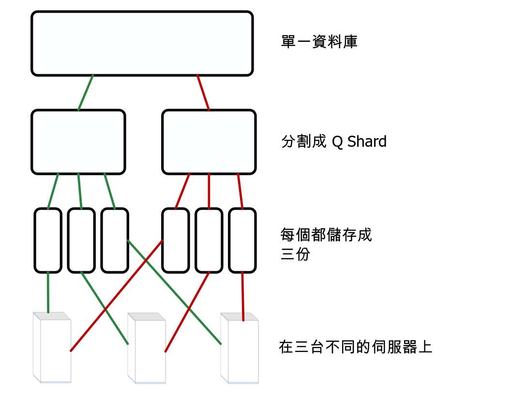
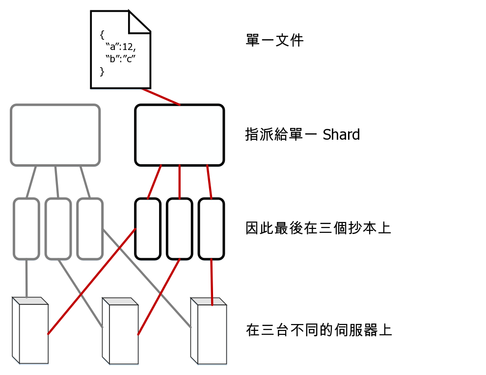

---

copyright:
  years: 2017, 2018
lastupdated: "2017-11-06"

---

{:new_window: target="_blank"}
{:shortdesc: .shortdesc}
{:screen: .screen}
{:codeblock: .codeblock}
{:pre: .pre}

<!-- Acrolinx: 2017-05-15 -->

# 如何在 {{site.data.keyword.cloudant_short_notm}} 中儲存資料？

## 概念

{{site.data.keyword.cloudantfull}} 中的每個資料庫都是由一個以上的不同 _Shard_ 所形成，其中，Shard 數目稱為 _Q_。
Shard 是資料庫中文件的不同子集。所有 _Q_ 個 Shard 都會包含資料庫內的資料。每一個 Shard 都會儲存為三個不同的副本。每一個 Shard 副本都稱為 Shard _抄本_。每一個 Shard 抄本都會儲存在不同的伺服器上。這些伺服器位在單一位置資料中心內。資料中心內的伺服器集合稱為叢集。



文件會指派給特定 Shard，方法是使用其 ID 的一致雜湊。這項指派表示文件一律儲存在已知 Shard 以及一組已知的伺服器上。



有時候，會_重新平衡_ Shard。重新平衡包含將抄本移至不同的伺服器。它的發生原因有數個，例如，伺服器監視建議某部伺服器比其他伺服器更頻繁或更不頻繁使用時，或伺服器必須暫時停止服務來進行維護時。Shard 及抄本數目會保持相同，而且文件仍然會指派給相同的 Shard，但 Shard 抄本的伺服器儲存空間位置會變更。

不同叢集的 _Q_ 預設值會不同。此值會隨著時間進行調整。

抄本數目（Shard 副本）也可以進行配置。實際上，許多系統的觀察及測量都建議在大部分情況下，三個抄本是在效能與資料安全之間取得良好平衡的實用數目。如果 {{site.data.keyword.cloudant_short_notm}} 系統使用不同的抄本計數，則會發生異常。

## Shard 處理如何影響效能？

資料庫的 Shard 數目可進行配置，因為它會以多種方式影響資料庫效能。

要求從用戶端應用程式進入資料庫時，會將叢集中的一部伺服器或一個「節點」指派為要求的_協調程式_。此協調程式會對保留要求相關資料的節點進行內部要求，並決定要求的回應，然後將此回應傳回給用戶端。

資料庫的 Shard 數目可能會以兩種方式影響效能：

1.	資料庫中的每一份文件都會儲存在單一 Shard 中。因此，具有許多 Shard 會對任何單一文件要求啟用更高的平行化。原因是協調程式只會將要求傳送至保留文件的節點。因此，如果資料庫有許多 Shard，則可能會有許多不需要回應要求的其他節點。這些節點可以繼續處理其他作業，而不必中斷協調程式要求。
2.	若要回應查詢要求，資料庫必須處理所有 Shard 的結果。因此，有更多 Shard 會產生更多的處理需求。原因是協調程式必須一個 Shard 進行一個要求，然後先結合結果，再將回應傳回給用戶端。

若要協助判定資料庫的合適 Shard 計數，首先請識別應用程式所進行要求的最常見類型。例如，考慮要求主要用於單一文件作業，還是要求大部分是查詢？有任何作業具有時效性嗎？

針對所有查詢，協調程式會對所有抄本發出讀取要求。會使用此方式，因為每一個抄本都會針對可協助回答查詢的索引維護其自己的副本。此配置的重要結果是_如果_ 文件寫入傾向平均分散到叢集中的 Shard，則具有多個 Shard 會啟用平行索引建置。

實際上，很難預測跨叢集中節點的可能索引作業負載。甚至，預測索引作業負載可能還比處理要求模式更不實用。原因是可能需要索引作業的時間是在文件寫入之後，而不是在文件要求之後。因此，單獨考量索引作業無法提供足夠的資訊來預估適當的 Shard 計數。

當您考慮資料大小時，重要考量是每個 Shard 的文件數目。每一個 Shard 都會將其文件保留在磁碟的大型 [B-Tree ](https://en.wikipedia.org/wiki/B-tree){:new_window} 中。索引會以相同的方式儲存。將更多文件新增至 Shard 時，在一般文件查閱或查詢期間用來遍訪 B-Tree 的步驟數目會增加。此「深度增加」很容易會拖慢要求，因為必須從快取或磁碟讀取更多資料。

一般而言，避免每個 Shard 超過 1 千萬份文件。就整體 Shard 大小而言，基於作業原因，將 Shard 數目保持低於 10 GB 會有所幫助。例如，在重新平衡期間，較小的 Shard 較容易透過網路移動。

如果有避免過多文件並保持小的 Shard 大小的衝突需求，則單一 _Q_ 值無法完全適用於所有情況。使用模式變更時，{{site.data.keyword.cloudant_short_notm}} 會隨著時間調整叢集的預設值。

不過，針對特定資料庫，花時間考量觀察到的要求模式和大小，以及使用此資訊來引導未來選取適當的 Shard 數目通常十分實用。具有代表性資料及要求模式的測試對於更恰當預估適當的 _Q_ 值十分重要。請準備好體驗正式作業環境，以變更這些預期。

<div id="summary"></div>

在早期規劃階段期間，下列簡單準則可能十分有用。請記得使用代表性資料進行測試（特別是針對較大的資料庫）來驗證提出的配置：

*	如果您資料的大小微不足道（例如數十或數百 MB，或者數千份文件），則不太需要使用超過單一 Shard。
*	對於數 GB 或數百萬份文件的資料庫，則可接受單位數的 Shard 計數（例如 8）。
*	對於數千萬或數億份文件或數十 GB 的較大資料庫，請考慮將資料庫配置為使用 16 個 Shard。
*	對於更大的資料庫，請考慮手動將資料分割成數個資料庫。針對這類大型資料庫，請聯絡 [{{site.data.keyword.cloudant_short_notm}} 支援中心 ](mailto:support@cloudant.com){:new_window} 以尋求建議。

>	**附註：**這些準則中的數目來自於觀察及經驗，而不是精確計算。

<div id="API"></div>

## 使用 Shard

### 設定 Shard 計數

建立資料庫時，會設定資料庫的 Shard 數目 _Q_。稍後無法變更 _Q_ 值。

若要在建立資料庫時指定 _Q_，請使用 `q` 查詢字串參數。

在下列範例中，會建立稱為 `mynewdatabase` 的資料庫。`q` 參數指定為資料庫建立八個 Shard。

```sh
curl -X PUT -u myusername https://myaccount.cloudant.com/mynewdatabase?q=8
```
{:codeblock}

>	**附註：**對於 Bluemix 上的 {{site.data.keyword.cloudant_short_notm}} 資料庫，未啟用為資料庫設定 _Q_ 的功能。
 在大部分的 `cloudant.com` 多方承租戶叢集上，無法使用 _Q_ 值。

如果您嘗試在無法使用的位置設定 _Q_ 值，則結果是 JSON 主體與下列範例類似的 [`403` 回應](../api/http.html#403)：

```json
{
	"error": "forbidden",
	"reason": "q is not configurable"
}
```
{:codeblock}

### 設定抄本計數

從 CouchDB 第 2 版開始，您可以在建立資料庫時[指定抄本計數 ](http://docs.couchdb.org/en/2.0.0/cluster/databases.html?highlight=replicas#creating-a-database){:new_window}。不過，您無法變更預設值 3 的抄本計數值。特別的是，建立資料庫時，無法指定不同的抄本計數值。如需進一步協助，請聯絡 [{{site.data.keyword.cloudant_short_notm}} 支援中心 ](mailto:support@cloudant.com){:new_window}。

### 何謂 _R_ 及 _W_ 引數？

部分要求的引數會影響協調程式在回答要求時的行為。這些引數在要求查詢字串的其名稱後面稱為 _R_ 及 _W_。它們只能用於單一文件作業。它們不會影響一般「查詢樣式」要求。

實際上，指定 _R_ 及 _W_ 值沒有什麼太大用處。例如，指定 _R_ 或 _W_ 不會變更讀取或寫入的一致性。

#### 何謂 _R_？

只能在單一文件要求上指定 _R_ 引數。_R_ 會影響協調程式必須先接收多少回應，再回覆用戶端。回應必須來自管理包含文件之 Shard 抄本的節點。 

將 _R_ 設定為 _1_ 可能會改善整體回應時間，因為協調程式可以更快速地傳回回應。原因是協調程式只需等待來自任何一個管理適當 Shard 的抄本的單一回應。

>	**附註：**減少 _R_ 值會增加所傳回回應因 {{site.data.keyword.cloudant_short_notm}} 所使用的[最終一致性](cap_theorem.html)模型而未根據最新資料的可能性。
 使用預設 _R_ 值有助於減少此影響。

_R_ 的預設值是 _2_。此值對應於使用三個 Shard 抄本的一般資料庫的大部分抄本。如果資料庫的抄本數目高於或低於 3，則 _R_ 的預設值會相應地變更。

#### 何謂 _W_？

只能在單一文件寫入要求上指定 _W_。

_W_ 類似 _R_，因為它會影響協調程式必須先接收多少回應，再回覆用戶端。

>	**附註：**_W_ 不會以任何方式影響實際寫入行為。

_W_ 的值不會影響是否在資料庫內寫入文件。藉由指定 _W_ 值，用戶端可以檢查回應中的 HTTP 狀態碼，以判斷 _W_ 抄本是否已回應協調程式。協調程式會先等待來自管理文件副本之節點的 _W_ 回應預定逾時，再將回應傳回給用戶端。
