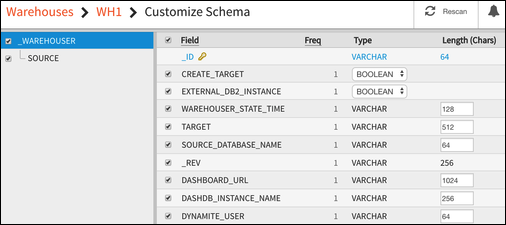

---

copyright:
  years: 2015, 2018
lastupdated: "2018-03-06"

---

{:new_window: target="_blank"}
{:shortdesc: .shortdesc}
{:screen: .screen}
{:codeblock: .codeblock}
{:pre: .pre}

# 資料倉儲

## 淘汰 {{site.data.keyword.cloudant_short_notm}} 的 {{site.data.keyword.dashdbshort_notm}} 特性（2018 年 2 月 7 日）
{: #deprecating-cloudant-nosql-db-s-db2-warehouse-on-cloud-feature-february-7-2018-}

{{site.data.keyword.cloudantfull}} 的 {{site.data.keyword.dashdblong}} 特性已遭淘汰，並且會根據下面的時間表予以撤銷。並不會從任一系統移除資料，但會停止同步化。 

淘汰日期         | 被淘汰的內容
-----------------|--------------------------
2018 年 1 月 16 日| 「倉儲」標籤只適用於已在「倉儲」標籤中建立 {{site.data.keyword.dashdbshort_notm}} 工作的 {{site.data.keyword.cloudant_short_notm}} 服務實例。如果您尚未建立 {{site.data.keyword.dashdbshort_notm}} 工作，則無法存取此特性。
2018 年 3 月 31 日| 在 1 月 16 日之前開始使用 {{site.data.keyword.dashdbshort_notm}} 功能的用戶端無法建立新的 {{site.data.keyword.dashdbshort_notm}} 工作。
2018 年 5 月 5 日 | 將會停止現有 {{site.data.keyword.dashdbshort_notm}} 工作。仍然可以在儀表板上檢視最終狀態。
2018 年 5 月 31 日| 已移除 {{site.data.keyword.dashdbshort_notm}} 特性的使用者介面。{{site.data.keyword.dashdbshort_notm}} 工作的狀態會變成無法使用。
 
已在 2018 年 4 月 30 日之前傳送至 {{site.data.keyword.dashdbshort_notm}} 的資料將會保留在 {{site.data.keyword.dashdbshort_notm}} 中，而且 {{site.data.keyword.cloudant_short_notm}} 資料也不會受到影響。

### {{site.data.keyword.dashdbshort_notm}} 特性的替代方案

請參閱 [data-flow-examples 儲存庫 ](https://github.com/cloudant-labs/data-flow-examples){:new_window}，以取得擷取 {{site.data.keyword.cloudant_short_notm}} 文件並將資料寫入至 {{site.data.keyword.dashdbshort_notm}} 表格的指導教學。

## 資料倉儲概觀

資料庫對於儲存資料十分重要。而可以基於商業用途套用該資料讓資料庫更具價值：可以快速且輕鬆地擷取相關資料，並讓資料在您的應用程式內處理。
{:shortdesc}

但是，使用資料所執行的許多儲存、處理及分析作業會在應用程式中重複使用。或者，它們可能是不錯的產業最佳作法範例。

因此，可以使用其他特性來擴充標準資料庫功能，以支援作業（例如報告或分析）。

近 30 年來，「資料倉儲」已成為根據關聯式資料庫技術之資料儲存、報告及分析的業界標準。一般而言，[資料倉儲是 ](https://en.wikipedia.org/wiki/Data_warehouse){:new_window}：「... 一個以上來源的整合資料的中央儲存庫。它會儲存現行及歷程資料。它可以用於執行分析，以及建立整個企業的知識工作者的報告。」

最近幾年出現啟用資料儲存、報告及分析的技術，以因應處理[海量資料 ](https://en.wikipedia.org/wiki/Big_data){:new_window} 的需求：「海量資料這個術語是指夠大或夠複雜而傳統資料處理應用程式不足以處理的資料集。」

同時，「資料倉儲」及相關產品的內容及特徵表示使用關聯式資料庫技術來啟用「資料倉儲」是熱門選擇，即使是海量資料作業也一樣。

有許多使用案例可以妥善地說明整合 {{site.data.keyword.cloudant_short_notm}} 功能與關聯式資料倉儲的好處，例如下列範例。

## 此整合是否適合我的使用案例？

{{site.data.keyword.cloudant_short_notm}} 的倉儲整合是一個簡化的處理程序，將自動探索文件的綱目，並將資料聰明地匯入至 {{site.data.keyword.dashdbshort_notm}} 或 {{site.data.keyword.Db2_on_Cloud_short}}。當您在 {{site.data.keyword.cloudant_short_notm}} 上建立倉儲時，會先自動探索綱目，然後將資料匯入至已連接的 {{site.data.keyword.dashdbshort_notm}} 資料庫。 

當您的資料具有下列特徵時，適合進行整合：

* 它具有一組多數是靜態的綱目。已變更的綱目需要重新啟動倉儲，以從頭開始重新匯入資料。
* 掃描相對較少的文件（最多數萬份），即可探索到綱目。當然，在探索到綱目之後，即可將數百萬份文件匯入至倉儲。
* 倉儲不需要完全即時。已更新的文件一般會在數秒內出現在倉儲中，但這不是一定的，並且會根據您的資料庫負載而不同。
* {{site.data.keyword.Db2_on_Cloud_short}} 會將綱目限制為 1,012 個欄位。具有大量欄位（包括巢狀物件及大型陣列）的 JSON 文件可能會超過此限制。

## 結合資料

結合用於跨網域分析的多個資料儲存庫的資料是一項作業，可以使用關聯式資料倉儲輕鬆且有效率地執行。

在載入資料倉儲期間，會準備不同來源的資料並將其轉換成一般格式。記錄會儲存在表格中，並且提供作業來結合這些表格以啟用結合的分析。

如果已經以關聯式呈現提供部分資料（例如主要資料或參照資料），則在關聯式資料倉儲中執行結合特別有用。

## 彈性

{{site.data.keyword.cloudant_short_notm}} 資料庫在呈現資料時具有彈性。
例如，它們不會在讀取或寫入期間強制執行綱目。

相反地，報告及分析作業需要明確定義並嚴格強制執行的模型。

關聯式倉儲中有了您的文件之後，您就可以將固定一組表格定義作為模型的基礎。拒絕違規時，只能載入符合表格綱目的文件。您可以使用固定關聯式綱目來訓練具有一致資料的模型。

## 資料完整性主張

「資料倉儲」可以使用限制來主張資料完整性。例如：

-   不能有兩筆記錄具有相同的主要索引鍵。
-   外部索引鍵保證記錄完整。
-   提供函數，以根據商業規則來驗證記錄。

唯一性、正確性及完整性是任何企業服務的基本需求。將 {{site.data.keyword.cloudant_short_notm}} 文件載入資料倉儲可協助您符合這些需求。

## {{site.data.keyword.cloudant_short_notm}} 及資料倉儲

「資料倉儲」是一種成熟且重要的技術。{{site.data.keyword.cloudant_short_notm}} 與關聯式資料倉儲緊密整合，可提供此技術的好處。

{{site.data.keyword.cloudant_short_notm}} 內建 [MapReduce 視圖](../api/using_views.html)形式的基本倉儲功能，可讓您執行某範圍的基本分析作業。

對於更進階的倉儲作業，您可以利用 IBM Cloud 型倉儲服務 [{{site.data.keyword.IBM}} {{site.data.keyword.dashdbshort_notm}} ](https://www.ibm.com/analytics/us/en/data-management/data-warehouse/){:new_window} 所提供的完整功能。

當您使用 {{site.data.keyword.cloudant_short_notm}} 時，即可對進階倉儲功能進行整合且輕鬆的存取，例如：

-   查看關聯式資料庫格式的 JSON 資料。
-   對您的資料執行 SQL 型查詢。
-   從您的資料建置分析。

這些進階倉儲功能是透過 {{site.data.keyword.dashdbshort_notm}}（即 {{site.data.keyword.cloudant_short_notm}} 的自然補充功能）這類服務啟用。

或者，如果您只需要文件的關聯式資料儲存庫，則可以在沒有倉儲功能的情況下將 {{site.data.keyword.cloudant_short_notm}} 文件載入至 [{{site.data.keyword.Db2_on_Cloud_short}}](#ibm-db2-on-cloud) 服務。

## {{site.data.keyword.dashdblong_notm}}

{{site.data.keyword.dashdbshort_notm}} 是一種雲端型資料倉儲服務，專門針對分析工作所建置。特別適用於 {{site.data.keyword.cloudant_short_notm}} JSON 資料時，透過在載入資料時檢查資料結構，{{site.data.keyword.dashdbshort_notm}} 即可接受各種來源的資料。

如需相關資訊，請參閱 [{{site.data.keyword.dashdblong_notm}} 文件 ](https://www.ibm.com/support/knowledgecenter/SS6NHC/com.ibm.swg.im.dashdb.kc.doc/welcome.html){:new_window}。

## {{site.data.keyword.Db2Hosted_notm}}

[{{site.data.keyword.Db2Hosted_full}} ](https://console.ng.bluemix.net/catalog/services/ibm-db2-on-cloud){:new_window} 提供 IBM SoftLayer® 全球雲端基礎架構的資料庫。它提供內部部署 Db2 部署的豐富特性，但沒有管理您自己的基礎架構的成本、複雜性及風險。

如需相關資訊，請參閱 [{{site.data.keyword.Db2Hosted_short}} 文件 ](https://console.ng.bluemix.net/docs/services/DB2OnCloud/index.html#DB2OnCloud){:new_window}。

## 建立倉儲

您有兩種方式可以建立倉儲：

1.  [使用 {{site.data.keyword.cloudant_short_notm}} 以建立 {{site.data.keyword.dashdbshort_notm}} 倉儲](#use-cloudant-to-create-a-db2-warehouse-on-cloud-warehouse)
2.  [將 {{site.data.keyword.cloudant_short_notm}} 連接至現有倉儲](#connect-cloudant-to-an-existing-warehouse)

### 使用 {{site.data.keyword.cloudant_short_notm}} 以建立 {{site.data.keyword.dashdbshort_notm}} 倉儲

建立倉儲的最簡單方法是讓 {{site.data.keyword.cloudant_short_notm}} 代表您在 {{site.data.keyword.Bluemix}} 內建立 {{site.data.keyword.dashdbshort_notm}} 倉儲實例。
作法是在 {{site.data.keyword.cloudant_short_notm}} 儀表板的`整合`標籤內按一下`倉儲`作業上的`建立倉儲`按鈕。

如果您尚未登入 {{site.data.keyword.Bluemix_notm}}，則系統會要求您這麼做。

>   **附註**：依預設，{{site.data.keyword.cloudant_short_notm}} 會在 {{site.data.keyword.Bluemix_notm}} 上建立倉儲的 {{site.data.keyword.dashdbshort_notm}} 實例。

當您已進行鑑別時，可以要求使用 {{site.data.keyword.Bluemix_notm}} 帳戶來建立新的 {{site.data.keyword.dashdbshort_notm}} 實例。

若要這麼做，請執行下列動作：

1.  在`倉儲名稱`欄位中，提供您要用於「倉儲」的名稱。
2.  在`資料來源`欄位中，提供 {{site.data.keyword.cloudant_short_notm}} 內現有資料庫的名稱。
3.  確定在表單上選取`建立新的 {{site.data.keyword.dashdbshort_notm}} 實例`選項。
4.  按一下`建立倉儲`按鈕。

### 將 {{site.data.keyword.cloudant_short_notm}} 連接至現有倉儲

您可以連接至現有 {{site.data.keyword.dashdbshort_notm}} 實例，而不是使用 {{site.data.keyword.cloudant_short_notm}} 建立 {{site.data.keyword.dashdbshort_notm}} 倉儲資料庫。

此處理程序類似[使用 {{site.data.keyword.cloudant_short_notm}} 以建立 {{site.data.keyword.dashdbshort_notm}} 倉儲](#use-cloudant-to-create-a-db2-warehouse-on-cloud-warehouse)，不過是選取 `{{site.data.keyword.dashdbshort_notm}} 服務實例`，並選擇 {{site.data.keyword.Bluemix_notm}} 內的現有 {{site.data.keyword.dashdbshort_notm}} 倉儲，而不是選取`建立新的 {{site.data.keyword.dashdbshort_notm}} 實例`選項。

### 使用 {{site.data.keyword.Db2_on_Cloud_short}} 倉儲實例

如果您願意，可以連接至現有 {{site.data.keyword.Db2_on_Cloud_short}} 倉儲實例，而不是 {{site.data.keyword.dashdbshort_notm}}。作法是選取 {{site.data.keyword.cloudant_short_notm}} 儀表板內的 `Db2` 選項以連接至現有 {{site.data.keyword.Db2_on_Cloud_short}} 實例。

如果您要連接至 {{site.data.keyword.Db2_on_Cloud_short}} 實例，則必須提供下列詳細資料：

-   主機位址
-   埠號
-   資料庫名稱
-   資料庫的使用者 ID
-   使用者 ID 的密碼

>   **附註**：本主題的其餘部分是將 {{site.data.keyword.dashdbshort_notm}} 作為倉儲實例。
    不過，如果您使用的是 {{site.data.keyword.Db2_on_Cloud_short}} 實例，此主題也同樣適用。
    同時提供指導教學來說明如何[將 JSON 資料從 {{site.data.keyword.cloudant_short_notm}} 載入至 {{site.data.keyword.dashdbshort_notm}} ](https://developer.ibm.com/clouddataservices../dashdb/get/load-json-from-cloudant-database-in-to-dashdb/){:new_window}，並包括使用 {{site.data.keyword.Db2_on_Cloud_short}} 作為倉儲資料庫的範例。

## 倉儲綱目

當您在 {{site.data.keyword.cloudant_short_notm}} 內第一次建立倉儲時，{{site.data.keyword.dashdbshort_notm}} 會在資料庫內建立資料的最佳可能綱目，協助確保 JSON 文件內的每一個欄位在新綱目內都具有對應項目。
在建立倉儲時，您可以選擇性地選擇手動[自訂綱目](#customizing-the-warehouse-schema)。

建立綱目之後，倉儲就可以保留關聯式格式的資料。{{site.data.keyword.cloudant_short_notm}} 接著會[抄寫](../api/replication.html)以執行將資料庫文件「起始載入」到倉儲的作業，以提供您 {{site.data.keyword.dashdbshort_notm}} 關聯式資料庫中資料的有效集合。

一段時間之後，{{site.data.keyword.cloudant_short_notm}} 資料庫內容可能會變更。
您可以修改現有倉儲的綱目。

>   **附註**：如果您修改現有倉儲的綱目，
    必須再次將 {{site.data.keyword.cloudant_short_notm}} 資料庫中的資料抄寫至倉儲資料庫。
    實際上，修改綱目會導致全新「起始載入」到倉儲。

## 使用倉儲

使用 {{site.data.keyword.cloudant_short_notm}} 倉儲，您可以執行「傳統」SQL 查詢以及檢視結果，而這些都是透過 {{site.data.keyword.dashdbshort_notm}} 主控台完成。

外部應用程式與資料的互動方式，與任何其他關聯式資料庫相同。{{site.data.keyword.dashdbshort_notm}} 的優點是您可以執行其他倉儲作業（例如，從其他來源載入更多資料，以及使用內建分析工具來分析資料）。
{{site.data.keyword.dashdbshort_notm}} 支援用於統計計算及圖形的 [`'R'` 程式設計語言 ](https://en.wikipedia.org/wiki/R_%28programming_language%29){:new_window} 及軟體環境。
這表示您可以存取演算法，以讓您執行資料庫分析作業（例如線性迴歸、「k 平均值」叢集作業及地理空間分析）。

`RStudio` 工具可讓您建立 `'R'` Script，而此 Script 接著會上傳至 {{site.data.keyword.dashdbshort_notm}}，然後使用您的資料執行。

如需使用 {{site.data.keyword.dashdbshort_notm}} 的相關資訊，請參閱 [{{site.data.keyword.dashdblong_notm}} 文件 ](https://www.ibm.com/support/knowledgecenter/SS6NHC/com.ibm.swg.im.dashdb.kc.doc/welcome.html){:new_window}。

## 保持全新的資料及結構

使用[抄寫](../api/replication.html)處理程序，將資料從 {{site.data.keyword.cloudant_short_notm}} 載入至 {{site.data.keyword.dashdbshort_notm}}。
這表示如果使用某種方法更新或修改您的 {{site.data.keyword.cloudant_short_notm}} 資料，則必須再次將文件抄寫至 {{site.data.keyword.dashdbshort_notm}}，以確保分析作業使用最新資訊繼續進行運作。

與一般 {{site.data.keyword.cloudant_short_notm}} 抄寫相同，只會單向傳送資料：對於倉儲，傳送是從 {{site.data.keyword.cloudant_short_notm}} 到 {{site.data.keyword.dashdbshort_notm}}。
起始載入資料之後，倉儲會訂閱 {{site.data.keyword.cloudant_short_notm}} 資料庫中的資料內容變更。
任何變更都會從 {{site.data.keyword.cloudant_short_notm}} 來源抄寫至 {{site.data.keyword.dashdbshort_notm}} 目標。
這表示倉儲是一種從 {{site.data.keyword.cloudant_short_notm}} 至 {{site.data.keyword.dashdbshort_notm}} 的持續抄寫。

一段時間之後，{{site.data.keyword.cloudant_short_notm}} 資料庫也可能會有結構變更。
這可能包括新增或移除 JSON 文件中的欄位。發生這種情況時，倉儲所使用的綱目可能會變成無效，導致將全新資料從 {{site.data.keyword.cloudant_short_notm}} 抄寫至 {{site.data.keyword.dashdbshort_notm}} 時報告錯誤。

為了解決此問題，{{site.data.keyword.cloudant_short_notm}} 倉儲具有「重新掃描」機能。
這會重新掃描 {{site.data.keyword.cloudant_short_notm}} 資料庫的結構，並判斷 {{site.data.keyword.dashdbshort_notm}} 中所需的新綱目。接著捨棄 {{site.data.keyword.dashdbshort_notm}} 內在前一次掃描期間建立的舊表格，並使用新綱目建立新表格，最後載入現行 {{site.data.keyword.cloudant_short_notm}} 資料作為全新「起始載入」。

若要使用重新掃描機能，請先確定倉儲未執行。具體請執行如下動作：

1.  選取 {{site.data.keyword.cloudant_short_notm}} 儀表板內的`整合`標籤。
2.  尋找`倉儲`作業上您要重新掃描的「倉儲」名稱： 
3.  按一下「倉儲」名稱。它是一個鏈結，而且按一下它時會開啟倉儲詳細資料視圖： 
4.  檢查倉儲的現行狀態。旋轉綠色圓圈指出倉儲正在執行中。若要停止倉儲，請按一下「動作」直欄中的`停止資料庫`圖示： 
5.  倉儲資料庫未執行時，會啟用「動作」直欄中的`重新掃描`圖示： 

### 重新掃描來源資料庫

當您按一下`重新掃描`圖示時，會有兩個選項：

-   資料庫的直接明確掃描。這是預設動作，並且極為類似第一次建立倉儲時所執行的資料庫起始掃描。
-   自訂倉儲綱目。

如果您選擇簡單重新掃描的預設動作，則會檢查來源資料庫，並產生全新倉儲資料庫綱目。重新掃描完成後，就會立即啟動倉儲。

如果您要自訂倉儲綱目，請先啟用`自訂綱目`勾選框，再按一下`重新掃描`按鈕。

`自訂綱目`勾選框會啟用兩個選項。

1.  使用的探索演算法。
2.  樣本大小。

### 探索演算法

重新掃描的預設選項是`聯集`演算法。這使用所有取樣 {{site.data.keyword.cloudant_short_notm}} 資料庫文件中的所有屬性，以在倉儲資料庫中建立一組表格。
結果是所有 {{site.data.keyword.cloudant_short_notm}} 資料庫文件都可以儲存在倉儲資料庫中，但資料庫的某些列中有部分欄位可能沒有內容。

重新掃描的替代選項是`叢集`演算法。這可識別 {{site.data.keyword.cloudant_short_notm}} 資料庫內具有同一組屬性的文件，然後建立對應的倉儲資料庫表格綱目。

### 樣本大小

此選項決定在綱目判定期間 {{site.data.keyword.cloudant_short_notm}} 資料庫內要檢查多少文件 。

預設值是 10,000 份文件。

設定太低的值所造成的風險是部分 {{site.data.keyword.cloudant_short_notm}} 文件具有偵測不到的屬性，因此在倉儲資料庫結構中予以省略。

設定太高的值表示判定倉儲資料庫結構的掃描處理程序需要更長的時間才能完成。

### 重新掃描之後

{{site.data.keyword.cloudant_short_notm}} 資料庫重新掃描完成之後，不會自動啟動倉儲。
相反地，它會保持停止狀態，因此，可以自訂倉儲資料庫。

## 自訂倉儲綱目

您可以修改在起始倉儲建立處理程序期間或重新掃描之後自動判定的資料庫綱目。若要這麼做，請確定您在建立處理程序期間勾選`自訂綱目`選項：

會如常在 {{site.data.keyword.dashdbshort_notm}} 中建立倉儲，不過，不會立即啟動它。
相反地，您可以先自訂綱目，再繼續進行。

若要這麼做，請按一下倉儲的鏈結：

產生的顯示畫面會提供一個按鈕，讓您自訂用於來源資料庫的綱目。將滑鼠游標移至「狀態」指示器上方，確認綱目已可以進行自訂：

按一下「自訂」按鈕會產生一個畫面，您可以在其中修改資料庫綱目的欄位：

若要將綱目重設為預設值，請按一下`重新掃描`按鈕：

當您滿意倉儲的資料庫綱目時，請按一下`執行`按鈕：

即會儲存綱目，並啟動倉儲。

### 自訂現有倉儲綱目

如果倉儲的資料庫綱目已存在，您可以[選擇自訂它](#keeping-the-data-and-structure-fresh)。

## 疑難排解

有時，您可能會在使用倉儲機能時發生問題。本主題稍後會提供其中一些問題的相關資訊。

此外，[Stack Overflow ](http://stackoverflow.com/questions/tagged/cloudant+dashdb){:new_window} 中也提供一些常見錯誤或問題的討論，以及如何對其進行疑難排解的詳細資料。

如果您需要進一步協助，但在 Stack Overflow 中找不到解決方案，請聯絡 [{{site.data.keyword.cloudant_short_notm}} 支援中心 ](mailto:support@cloudant.com){:new_window}。

### 儀表板中可見的異常狀況

有時，倉儲會發生錯誤狀況。例如，如果您嘗試使用現有 {{site.data.keyword.Db2_on_Cloud_short}} 資料庫來建立倉儲，但無法輸入正確的資料庫詳細資料，則無法順利建立倉儲。

發生錯誤狀況時，倉儲的狀態會變更為紅色圓圈，指出有需要注意的問題：

如果您將滑鼠游標「移至」指示器上方，則會提供多一點資訊：

當您按一下指示器時，會出現一個視窗，讓您取得確切問題的詳細資料。在此範例中，針對 {{site.data.keyword.Db2_on_Cloud_short}} 連線輸入的主機詳細資料無效：

### 警告及錯誤

{{site.data.keyword.cloudant_short_notm}} 資料庫中的變更會抄寫至倉儲資料庫。
變更可能不適合倉儲或其綱目。會偵測到這類型的問題，並將其記載至倉儲資料庫的 `OVERFLOW` 表格中。

例如，如果倉儲綱目有類型為 `VARCHAR` 的 `Movie_earnings_rank` 欄位，而且可以保留最多 32 個字元，但 {{site.data.keyword.cloudant_short_notm}} 資料庫中的變更需要儲存 40 個字元，欄位就會「溢位」。
這將會產生「警告」狀況，而此狀況是以倉儲儀表板的狀態圖示指出：

查看倉儲資料庫中指出的 overflow 表格，您會看到警告的詳細資料：

在此範例中，警告清楚指出發生截斷，並影響 `_ID` 為 `70f6284d2a395396dbb3a60b4cf1cac2` 的 {{site.data.keyword.cloudant_short_notm}} 文件的 `Movie_earnings_rank` 欄位。

有兩個可能的解決方案選項：

-   更正 {{site.data.keyword.cloudant_short_notm}} 文件內的溢位欄位。
-   [更新倉儲綱目](#customizing-the-warehouse-schema)。

您選擇的選項取決於欄位中的額外內容是否為策劃內容。如果您確實需要應用程式的額外內容，則需要[更新倉儲綱目](#customizing-the-warehouse-schema)才能移除警告狀況。

更重要的問題是將全新欄位引進 {{site.data.keyword.cloudant_short_notm}} 資料庫的文件中，但欄位在倉儲資料庫綱目中沒有對應項目。
這會導致「錯誤」狀況。

例如，{{site.data.keyword.cloudant_short_notm}} 資料庫中的文件可能會「獲得」稱為 `my key` 且不存在於倉儲資料庫綱目內的額外欄位：

結果是錯誤狀況，而此狀況是以倉儲儀表板的狀態圖示指出：

查看倉儲資料庫中指出的 overflow 表格，您會看到錯誤的詳細資料：

在此範例中，錯誤清楚指出發現在建立倉儲資料庫綱目時不存在的欄位。在 `_ID` 為 `70f6284d2a395396dbb3a60b4cf1cac2` 的 {{site.data.keyword.cloudant_short_notm}} 文件中，偵測到欄位本身。

有兩個可能的解決方案選項：

-   從 {{site.data.keyword.cloudant_short_notm}} 文件中移除額外欄位。
-   [更新倉儲綱目](#customizing-the-warehouse-schema)。

您選擇的選項取決於額外欄位是否為策劃欄位。如果您確實需要應用程式的額外欄位，則需要[更新倉儲綱目](#customizing-the-warehouse-schema)才能移除錯誤狀況。
