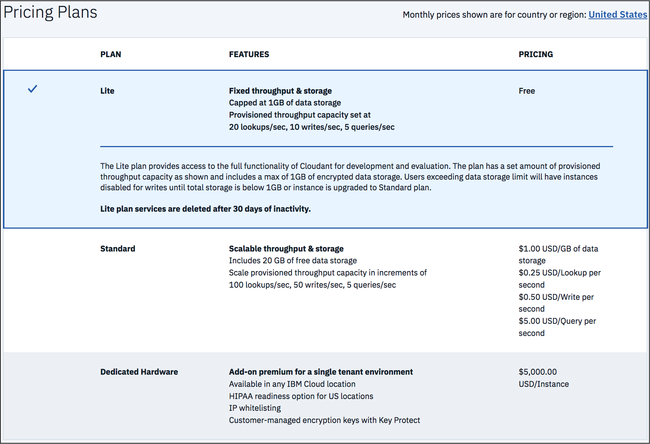
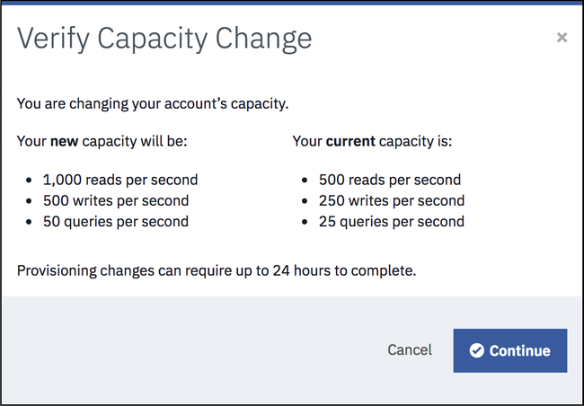

---

copyright:
  years: 2015, 2018
lastupdated: "2018-10-24"

---

{:new_window: target="_blank"}
{:shortdesc: .shortdesc}
{:screen: .screen}
{:codeblock: .codeblock}
{:pre: .pre}
{:tip: .tip}

<!-- Acrolinx: 2017-05-10 -->

# {{site.data.keyword.cloud_notm}} Public
{: #ibm-cloud-public}

{{site.data.keyword.cloudantfull}} Public 是 {{site.data.keyword.cloudant_short_notm}} 特性最豐富的供應項目，且會先收到更新及新特性。定價是根據傳輸量及儲存空間需求，因此能適合任何必要負載。 

免費的[精簡方案](#lite-plan)包括固定數量的傳輸量容量及資料，可用來進行開發及評估。付費的[標準方案](#standard-plan)可提供隨著應用程式需求變更而調整的可配置佈建傳輸量容量及資料儲存空間定價。每月額外支付月費，還能使用選用性的[專用硬體方案](#dedicated-hardware-plan)，可以在專用硬體環境上執行一個以上的「標準方案」實例。專用硬體環境可供您單獨使用，而且，如果在美國地區內佈建「專用硬體方案」實例，您可以選擇性地選取符合 [HIPAA ](https://en.wikipedia.org/wiki/Health_Insurance_Portability_and_Accountability_Act){:new_window} 標準的配置。

下表彙總「精簡方案」的已佈建傳輸量容量及磁碟空間配置，以及一些「標準方案」範例：

<table>

<tr>
<th id="capacity-config-plan">方案 </th><th id="lite">精簡</th><th id="standard" colspan='4'>標準</th>
</tr>
<tr>
<th id="base-priceperhour" headers="capacity-config-plan">基本價（每小時）</td>
<td headers="lite base-priceperhour">$0.00</td>
<td headers="standard base-priceperhour" colspan='4'>請參閱<a href="../offerings/pricing.html#pricing" target="_blank">定價詳細資料 </a>。</td>
</tr>
<tr>
<th id="provisionedthroughputcapacity-lookupspersecond" headers="capacity-config-plan">已佈建的傳輸量容量（每秒查閱數）</td>
<td headers="lite provisionedthroughputcapacity-lookupspersecond-lite">20</td>
<td headers="standard provisionedthroughputcapacity-lookupspersecond">100</td>
<td headers="standard provisionedthroughputcapacity-lookupspersecond">1,000</td>
<td headers="standard provisionedthroughputcapacity-lookupspersecond">5,000</td>
<td headers="standard provisionedthroughputcapacity-lookupspersecond">20,000</td>
</tr>
<tr>
<th id="provisionedthroughputcapacity-writespersecond" headers="capacity-config-plan">已佈建的傳輸量容量（每秒寫入數）</td>
<td headers="lite provisionedthroughputcapacity-writespersecond">10</td>
<td headers="standard provisionedthroughputcapacity-writespersecond">50</td>
<td headers="standard provisionedthroughputcapacity-writespersecond">500</td>
<td headers="standard provisionedthroughputcapacity-writespersecond">2,500</td>
<td headers="standard provisionedthroughputcapacity-writespersecond">10,000</td>
</tr>
<tr>
<th id="provisionedthroughputcapacity-queriespersecond" headers="capacity-config-plan">已佈建的傳輸量容量（每秒查詢數）</td>
<td headers="lite provisionedthroughputcapacity-queriespersecond">5</td>
<td headers="standard provisionedthroughputcapacity-queriespersecond">5</td>
<td headers="standard provisionedthroughputcapacity-queriespersecond">50</td>
<td headers="standard provisionedthroughputcapacity-queriespersecond">250</td>
<td headers="standard provisionedthroughputcapacity-queriespersecond">1,000</td>
</tr>
<tr>
<th id="diskspaceincluded" headers="capacity-config-plan">所含的磁碟空間</td>
<td headers="lite diskspaceincluded">1 GB</td>
<td headers="standard diskspaceincluded" colspan='4'>20 GB</td>
</tr>
<tr>
<th id="diskoveragepergbhour" headers="capacity-config-plan">磁碟超額（每 GB/小時）</td>
<td headers="lite diskoveragepergbhour">無法使用</td>
<td headers="standard diskoveragepergbhour" colspan='4'>請參閱<a href="../offerings/pricing.html#pricing" target="_blank">定價詳細資料 </a>。</td>
</tr>

</table>

## 方案
{: #plans}

當您[佈建 {{site.data.keyword.cloudant_short_notm}} 服務實例](#provisioning-a-cloudant-nosql-db-instance-on-ibm-cloud)時，可以選取要使用的方案。依預設，會選取[精簡方案](#lite-plan)。

### 精簡方案
{: #lite-plan}

精簡方案是免費方案，其設計目的是用於開發及評估。內含 {{site.data.keyword.cloudant_short_notm}} 的完整功能，但「精簡方案」實例有固定數量的已佈建傳輸量容量及資料儲存空間。已佈建傳輸量容量固定為 20 次查閱/秒、10 次寫入/秒及 5 次查詢/秒，資料儲存空間上限則為 1 GB。 

儲存空間用量會每日進行檢查。如果您超出 1 GB 的儲存空間限制，則對 {{site.data.keyword.cloudant_short_notm}} 實例的要求會收到 402 狀態碼，以及錯誤訊息：「帳戶已超出其資料用量配額。需要升級為付費方案。」「{{site.data.keyword.cloudant_short_notm}} 儀表板」上也會出現橫幅。您仍然可以讀取及刪除資料。不過，若要寫入新資料，您有兩個選項。首先，您可以升級至付費的[標準方案](#standard-plan)，它會立即移除寫入限制。或者，您也可以刪除資料，讓總儲存空間低於 1 GB 的限制，並等到執行下次的每日儲存空間檢查，您的實例即會再次容許寫入。 

如果您要儲存超過 1 GB 的資料，或是要能夠調整已佈建的傳輸量容量，請移至[標準方案](#standard-plan)。

每個 {{site.data.keyword.cloud_notm}} 帳戶只能使用一個「{{site.data.keyword.cloudant_short_notm}} 精簡方案」實例。如果您已有一個「精簡方案」實例，則任何嘗試建立新「精簡方案」實例或將「標準方案」實例變更為「精簡方案」都會傳回訊息：『每個服務只能有一個「精簡方案」實例。若要建立新實例，請刪除現有「精簡方案」實例，或選取付費方案。』
{: tip}

### 標準方案
{: #standard-plan}

「{{site.data.keyword.cloudant_short_notm}} 標準方案」適用於所有付費的 {{site.data.keyword.cloud}} 帳戶（無論是隨收隨付制還是訂閱），並且會調整以符合應用程式需求。「標準方案」根據兩個因素計價：所配置的已佈建傳輸量容量，以及實例中所儲存的資料量。 

定價是每小時按比例分配，起始已佈建傳輸量容量為 100 次查閱/秒、50 次寫入/秒及 5 次查詢/秒，這等於起始成本 $0.105 美元/小時。您可以在「{{site.data.keyword.cloudant_short_notm}} 儀表板」中以 100 次查閱/秒、50 次寫入/秒及 5 次查詢/秒的增量增加或減少已佈建的傳輸量容量。成本計算是針對所配置的已佈建傳輸量容量，而不是根據請求的計量容量。「標準方案」包含 20 GB 的資料儲存空間。如果您的儲存量超過 20 GB，則會根據每小時每 GB 的定義成本向您收取費用。 

請參閱「{{site.data.keyword.cloud_notm}} 定價計算機」以取得不同容量和貨幣的定價，參閱[定價](../offerings/pricing.html#pricing){:new_window}資訊則可取得成本預估範例。

### 專用硬體方案
{: #dedicated-hardware-plan}

「{{site.data.keyword.cloudant_short_notm}} 專用硬體方案」實例是一種裸機 {{site.data.keyword.cloudant_short_notm}} 環境，佈建以專用於您的「{{site.data.keyword.cloudant_short_notm}} 標準方案」實例。「{{site.data.keyword.cloudant_short_notm}} 專用硬體方案」環境可以佈建至任何 [{{site.data.keyword.IBM}} 資料中心 ](https://www.ibm.com/cloud-computing/bluemix/data-centers)。此方案對於 HIPAA 法規遵循而言是必要的，且必須在佈建時間進行選取。此外，「{{site.data.keyword.cloudant_short_notm}} 專用硬體方案」環境的使用者還可以使用 IBM Key Protect 來採用 IP 白名單及「自帶金鑰 (BYOK)」客戶管理加密金鑰。 

您可以佈建一個以上的「標準方案」實例，而「專用硬體」環境會根據「標準方案」實例所使用的容量及資料，視需要擴充或縮減。這是「{{site.data.keyword.cloudant_short_notm}} 標準方案」實例之使用定價的附加固定價格。計費是每日按比例分配，並且針對環境收取一個月的最短持續期間費用。佈建「{{site.data.keyword.cloudant_short_notm}} 專用硬體方案」是不同步的作業，可能需要 5-7 個營業日。若要建立「{{site.data.keyword.cloudant_short_notm}} 專用硬體方案」實例並在其上佈建「標準方案」實例，請遵循[在 {{site.data.keyword.cloud_notm}} 上建立及運用 {{site.data.keyword.cloudant_short_notm}} 專用硬體方案實例 ](../tutorials/create_dedicated_hardware_plan.html#creating-and-leveraging-a-cloudant-dedicated-hardware-plan-instance-on-bluemix){:new_window} 指導教學。 

「專用硬體方案」不適用於 {{site.data.keyword.cloud_notm}} Dedicated 客戶。「專用硬體方案」只適用於 {{site.data.keyword.cloud_notm}} Public 客戶。
{: tip}

## 已佈建的傳輸量容量
{: #provisioned-throughput-capacity}

傳輸量佈建會識別並測量為下列類型之事件中的其中一種：

1.	根據文件 `_id` 的查閱（這是特定文件的讀取）。
2.	寫入，這是個別文件的建立、修改或刪除，或因為索引建置而起的任何更新。
3.	查詢，這是對其中一個 {{site.data.keyword.cloudant_short_notm}} 查詢端點提出的要求，包括下列類型：
	-	主要索引 ([`_all_docs`](../api/database.html#get-documents))
	-	MapReduce 視圖 ([`_view`](../api/creating_views.html#using-views))
	-	搜尋索引 ([`_search`](../api/search.html#queries))
	-	地理空間索引 ([`_geo`](../api/cloudant-geo.html#querying-a-cloudant-geo-index))
	-	{{site.data.keyword.cloudant_short_notm}} 查詢 ([`_find`](../api/cloudant_query.html#finding-documents-using-an-index))

傳輸量的測量是每秒對每一種類型之事件數目的簡單計數，其中的秒是_滑動_ 的時間範圍。如果您的帳戶超出針對方案所佈建的傳輸量事件數目，則在滑動時間範圍內的事件數目不再超出所佈建的數目之前，都會拒絕要求。將滑動的 1 秒時間範圍視為 1,000 毫秒的任何連續期間，可能會有所助益。

例如，「標準方案」佈建為每秒 200 次查閱。您的帳戶在 1,000 毫秒（1 秒）的連續期間最多可能提出 200 次查閱要求。在滑動的 1,000 毫秒期間，查閱要求數目再度掉到少於 200 之前，都會拒絕在該期間進行的後續查閱要求。

因為已超出事件數目而拒絕要求時，應用程式會收到 [`429` Too Many Requests](../api/http.html#429) 回應。

所支援用戶端程式庫的最新版本（適用於 [Java](../libraries/supported.html#java)、[Node.js](../libraries/supported.html#node-js) 及 [Python](../libraries/supported.html#python) 語言）可協助您處理 `429` 回應。例如，Java 程式庫產生 [`TooManyRequestsException` ](http://static.javadoc.io/com.cloudant/cloudant-client/2.5.1/com/cloudant/client/org/lightcouch/TooManyRequestsException.html){:new_window} 回應。

依預設，在收到 `429` 回應時，受支援的用戶端程式庫不會自動嘗試重試要求。

最好確定您的應用程式能正確地處理 `429` 回應。原因是重試次數有限；定期超過要求數目便強烈表示應該移至不同方案配置。

如果您要移轉現有應用程式，則可能無法處理 `429` 回應。在移轉驗證期間，請確認您的應用程式能正確地處理 `429` 回應。

{: tip}

總而言之，您必須確定您的應用程式可以正確地處理 [`429`](../api/http.html#429) 回應。

### 檢視及變更容量
{: #viewing-and-changing-capacity}

您可以在帳戶可用方案內看到傳輸量容量的詳細資料。您可以透過 {{site.data.keyword.cloudant_short_notm}} 帳戶儀表板的「帳戶」標籤，來選取您要使用的佈建層次。

若要移至不同傳輸量容量，請選取您要的佈建，然後按一下 `Update`。系統會要求您確認變更，並提醒佈建變更最多可能需要 24 個小時才能完成。

容量增加大小限制為每次變更 10 個單位（1000 次查閱/秒、500 次寫入/秒及 50 次查詢/秒）。減少則不受單位數目限制。任何容量變更（無論是增加還是減少）都限制為每小時一次。如果您需要的容量超過 {{site.data.keyword.cloudant_short_notm}} 儀表板上可用的容量，請與 [{{site.data.keyword.cloudant_short_notm}} 支援中心 ](mailto:support@cloudant.com){:new_window} 聯絡。
{: tip}

### 監視用量 
{: #monitoring-usage}

在 {{site.data.keyword.cloudant_short_notm}} 儀表板內「監視」標籤的「現行作業」窗格中，可以看到您的用量相關資訊。 

這裡提供詳細資料，說明現行[傳輸量](#provisioned-throughput-capacity)以及[已儲存資料](#disk-space-included)的數量。

監視可協助您辨識方案中的佈建變更是否適當。例如，如果您經常達到資料庫查閱數目上限，則可以透過儀表板之「帳戶」標籤上的[服務窗格](#servicetier)來修改佈建。

## 資料用量
{: #data-usage}

### 所含的磁碟空間
{: #disk-space-included}

此值是方案中所含的儲存空間容量。它同時用於資料及索引儲存空間。

### 磁碟超額
{: #disk-overage}

所有「標準方案」及「精簡方案」都包括磁碟空間，其用於 JSON 資料、附件及索引。所有「標準方案」及「精簡方案」都受到已使用磁碟空間方面的監視。當您使用的資料超過方案配置時，可以預期會適用下表中所述的情況：

<table>

<tr>
<th id="disk-overage-plan">方案 </th><th id="description"> 說明</th>
</tr>
<tr>
<th headers="standard-plan">標準</td>
<td headers="description">

<ul><li>如果帳戶使用超過方案配置中所配置的儲存空間量，則會將它視為「溢位」。「溢位」會導致依照指出的價格，針對超出方案配置所額外使用的每 GB，對帳戶進行收費。</li>
<li>您因為用量超過方案中所提供之磁碟空間而必須額外支付的金額稱為「超額」。超額是根據每小時來計算。</li></ul>
</td>
</tr>
<tr>
<th headers="lite-plan">精簡</td>
<td headers="description">

<ul><li>「精簡方案」上的磁碟用量有限制。在您到達上限之後，就無法寫入新資料。若要寫入新的資料，您必須升級為「標準方案」，或刪除資料並等到執行下次檢查，以重新啟動帳戶。

</li></ul></td>
</tr>
</table>

例如，假設「標準方案」將磁碟用量增加為半天（12 小時）107 GB。這項變更表示您的實例比起 20 GB 的方案配置，多溢出了 87 GB 且長達 12 小時。因此，會根據 87 GB x 12 小時 = 1044 GB 小時，向您收取該額外空間的超額費用。

超額的計算方式是使用計費週期內特定小時期間超過方案配置的 GB 數目最大值。

### 磁碟超額範例
{: #disk-overage-example}

假設您以使用 9 GB 儲存空間的「標準方案」服務實例，開始為期 30 天的一個月。接下來，在第 3 天 02:00 開始的那個小時期間，您的儲存空間增加到 21.5 GB 且長達 15 分鐘。在 02:00 小時的接下來 10 分鐘，此實例降回 9.5 GB，然後在 02:00 小時的接下來 25 分鐘增加為 108 GB。最後，您的實例降到 28 GB 後度過了該小時以及該月的剩餘時間。

此模式表示在第 3 天第 2 小時期間，超過方案配置的 GB 數目最大值為 88 GB。針對第 3 天的 03:00 小時，以及該月的剩餘時間，您的實例超過方案配置 8 GB。

因此，針對第 3 天的 02:00 小時，您的帳單會包括 88 GB x 1 小時 = 88 GB 小時的超額費用。

針對第 3 天的 03:00 小時到第 3 天結束，您的帳單會包括 8 GB x 21 小時 = 168 GB 小時的超額費用。

針對第 4 天的 00:00 小時到該月（共 30 天）結束，您的帳單會包括 8 GB x 24 小時 x 27 天 = 5184 GB 小時的超額費用。

該月的總超額帳單是根據總計值 88 + 168 + 5184 = 5440 GB 小時來計算。

## 要求及文件大小限制
{: #request-and-document-size-limits}

{{site.data.keyword.cloudant_short_notm}} JSON 文件及要求的大小上限如下： 

限制  | 大小上限
------|-------------
個別文件大小 |1 MB
單一附件大小 | 10 MB
要求內文大小 | 11 MB

超出上述任何限制都會導致 [413 回應](../api/http.html#413)。

建議您將二進位附件或大型 JSON Blob 儲存在物件儲存空間，並將位置的鏈結儲存在 {{site.data.keyword.cloudant_short_notm}} JSON 文件中。   

當您抄寫時，大於這些限制的文件或附件不會抄寫到目標資料庫。[這裡](../api/replication.html#replication-errors)提供如何偵測抄寫錯誤的相關資訊。

## 位置及租賃
{: #locations-and-tenancy}

依預設，所有「精簡方案」及「標準方案」都會部署至多方承租戶環境。在方案選取期間，您可以從下列 {{site.data.keyword.cloud_notm}} Public 地區中進行選擇：

-   美國東部
-   美國南部
-   英國
-   雪梨
-   德國&Dagger;
-   亞太地區北部（東京）

「專用硬體方案」實例可以部署至大部分的 [{{site.data.keyword.IBM_notm}} 資料中心位置 ](https://www.ibm.com/cloud-computing/bluemix/data-centers)。
請參閱 {{site.data.keyword.cloud_notm}} 型錄中的下拉功能表，以取得最新的可用位置清單。

&Dagger;從 {{site.data.keyword.cloud_notm}} Public「德國」地區部署的所有 {{site.data.keyword.cloudant_short_notm}} 實例都會部署在歐盟管理的環境中。在歐盟管理的環境之外產生的任何 {{site.data.keyword.cloudant_short_notm}} 帳戶或 API 金鑰，都無法獲授與對歐盟管理之 {{site.data.keyword.cloudant_short_notm}} 實例的存取權。

## 鑑別方法
{: #authentication-methods}

{{site.data.keyword.cloudant_short_notm}} 是使用 HTTPS API 進行存取。如果 API 端點需要它，則會針對 {{site.data.keyword.cloudant_short_notm}} 收到的每個 HTTPS 要求鑑別使用者。在佈建期間，可用的鑑別方法包括「同時使用 Legacy 認證及 IAM」及「僅使用 IAM」。如需相關資訊，請參閱 [IAM 手冊](../guides/iam.html){:new_window}或舊式[鑑別 API 文件](../api/authentication.html){:new_window}。

佈建 {{site.data.keyword.cloudant_short_notm}} 實例之後，在 {{site.data.keyword.cloud_notm}} 儀表板的「服務認證」標籤中產生新認證時，可以找到連線 URL 及 IAM 授權詳細資料。如果您在佈建期間選擇此選項，則也會包含 {{site.data.keyword.cloudant_short_notm}} Legacy 使用者名稱和密碼。

## 高可用性、災難回復及備份
{: #high-availability-disaster-recovery-and-backup}

為了在資料中心內提供高可用性 (HA) 及災難回復 (DR)，所有資料都會跨叢集裡的三台不同實體伺服器，儲存成一式三份。您可以在多個資料中心內佈建帳戶，然後使用持續資料抄寫以提供跨資料中心的 HA/DR。{{site.data.keyword.cloudant_short_notm}} 資料不會自動進行備份，但提供支援的工具來處理備份。請檢閱[災難回復及備份 ](https://console.bluemix.net/docs/services/Cloudant/guides/disaster-recovery-and-backup.html#disaster-recovery-and-backup) 手冊來探索所有 HA、DR 及備份考量，以符合應用程式需求。 

## 支援
{: #support}

「標準方案」及「專用方案」服務實例的支援都是選用項目。其提供方式是購買 *{{site.data.keyword.cloud_notm}} 標準支援*。未提供「精簡方案」的支援。

如需支援方案的相關資訊，請參閱 [{{site.data.keyword.cloud_notm}} 標準支援方案 ](https://www.ibm.com/cloud/support#944376){:new_window}。如需支援的相關資訊，請參閱 [{{site.data.keyword.IBM_notm}} 支援手冊 ](https://www.ibm.com/support/home/pages/support-guide/){:new_window}。

針對包含「醫療保健資訊」、健康資料、「受保護健康資訊」或得遵守其他法規需求的資料，用於 {{site.data.keyword.cloudant_short_notm}} 的支援系統不提供內容保護特性。因此，「客戶」不得輸入或提供這類資料。
{: tip}

## 在 {{site.data.keyword.cloud_notm}} 上佈建 {{site.data.keyword.cloudant_short_notm}} 實例
{: #provisioning-a-cloudant-nosql-db-instance-on-ibm-cloud}

您可以使用兩種方式在 {{site.data.keyword.cloud_notm}} 上佈建「{{site.data.keyword.cloudant_short_notm}} 精簡方案」或「標準方案」實例：

- 使用儀表板。[這裡 ](https://console.bluemix.net/docs/services/Cloudant/tutorials/create_service.html#creating-a-cloudant-instance-on-bluemix){:new_window} 提供說明此處理程序的指導教學。
- 使用 Cloud Foundry 指令工具。[這裡 ](https://console.bluemix.net/docs/services/Cloudant/tutorials/create_service_cli.html#creating-a-cloudant-instance-on-bluemix-using-the-cloud-foundry-tools){:new_window} 提供說明此處理程序的指導教學。
 
若要建立及運用「{{site.data.keyword.cloudant_short_notm}} 專用硬體方案」實例，請遵循[這裡 ](https://console.bluemix.net/docs/services/Cloudant/tutorials/create_dedicated_hardware_plan.html#creating-and-leveraging-a-cloudant-dedicated-hardware-plan-instance-on-bluemix){:new_window} 說明此處理程序的指導教學。

