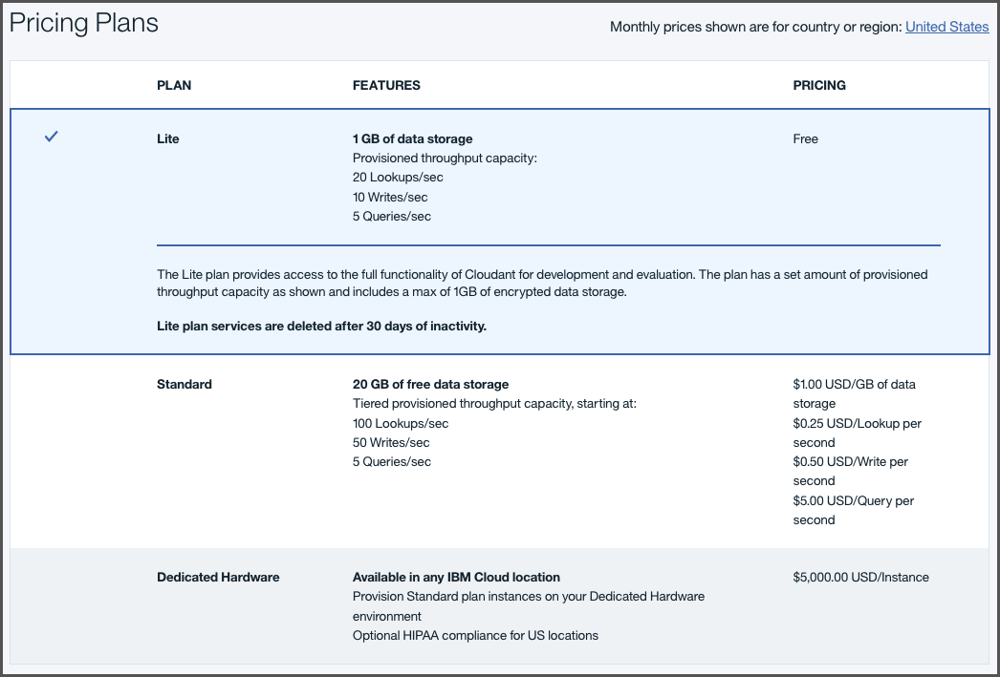

---

copyright:
  years: 2015, 2018
lastupdated: "2017-12-11"

---

{:new_window: target="_blank"}
{:shortdesc: .shortdesc}
{:screen: .screen}
{:codeblock: .codeblock}
{:pre: .pre}

<!-- Acrolinx: 2017-02-23 -->

# {{site.data.keyword.Bluemix_notm}} 公用

「{{site.data.keyword.cloudantfull}} 公用」是 {{site.data.keyword.cloudant_short_notm}} 特性最豐富的供應項目，且會先收到更新項目及新特性。定價是根據傳輸量及儲存空間需求，因此能適合任何必要負載。 

有一個免費的[精簡方案](#lite-plan)，其具有固定數量的傳輸量及資料可用來進行開發及評估。還有一個付費[標準方案](#standard-plan)，可提供隨著應用程式需求變更而調整的可配置佈建傳輸量及資料儲存空間定價。每月額外支付月費，還能使用選用性的[專用硬體方案](#dedicated-hardware-plan)，可以在專用硬體環境上執行一個以上的「標準方案」實例。專用硬體環境可供您單獨使用，而且，如果在美國地區內佈建「專用硬體方案」實例，您可以選擇性地選取遵循 [HIPAA ](https://en.wikipedia.org/wiki/Health_Insurance_Portability_and_Accountability_Act){:new_window} 的配置。

下表彙總各方案的已佈建傳輸量及磁碟空間配置：

<table border='1'>

<tr>
<th>方案</th><th>精簡</th><th colspan='4'>標準</th>
</tr>
<tr>
<td>基本價（每小時）</td>
<td>$0.00</td>
<td colspan='4'>請參閱<a href="https://www.ibm.com/cloud/cloudant/pricing" target="_blank">定價詳細資料 </a>。</td>
</tr>
<tr>
<td>已佈建傳輸量（每秒查閱數）</td>
<td>20</td>
<td>100</td>
<td>1,000</td>
<td>5,000</td>
<td>20,000</td>
</tr>
<tr>
<td>已佈建傳輸量（每秒寫入數）</td>
<td>10</td>
<td>50</td>
<td>500</td>
<td>2,500</td>
<td>10,000</td>
</tr>
<tr>
<td>已佈建傳輸量（每秒查詢數）</td>
<td>5</td>
<td>5</td>
<td>50</td>
<td>250</td>
<td>1,000</td>
</tr>
<tr>
<td>個別文件大小上限</td>
<td>1 MB</td>
<td colspan='4'>1 MB</td>
</tr>
<tr>
<td>所含的磁碟空間</td>
<td>1 GB</td>
<td colspan='4'>20 GB</td>
</tr>
<tr>
<td>磁碟超額（每 GB/小時）</td>
<td>無法使用</td>
<td colspan='4'>請參閱<a href="https://www.ibm.com/cloud/cloudant/pricing" target="_blank">定價詳細資料 </a>。</td>
</tr>

</table>

## 方案

當您[佈建 {{site.data.keyword.cloudant_short_notm}} 服務實例](#provisioning-a-cloudant-instance-on-bluemix)時可以選取要使用的方案。依預設，會選取[精簡方案](#lite-plan)。

### 精簡方案

「精簡方案」是免費的，但限制您最多可以使用 1 GB 的資料儲存空間。這些限制也適用於針對查閱、寫入及查詢所佈建的傳輸量。 

儲存空間用量會每日進行檢查。如果您超出儲存空間限制，則帳戶的 HTTP 要求會收到 402 狀態碼，且錯誤訊息為「帳戶已超出其資料用量配額。需要升級為付費方案。」{{site.data.keyword.cloudant_short_notm}} 儀表板上也會出現橫幅來通知您。您仍然可以讀取及刪除資料。不過，若要寫入新的資料，您必須升級為付費帳戶，或刪除資料並等到下次檢查執行，才能重新啟動帳戶。 

如果您要儲存超過 1 GB 的資料，或者具有較大的傳輸量，請移至[標準方案](#standard-plan)。

### 標準方案

「標準方案」包括 20 GB 的資料儲存空間。如果您的儲存量超過 20 GB，則會根據每小時每 GB 的定義成本向您收取費用。請參閱現行成本的[定價 ](https://www.ibm.com/cloud/cloudant/pricing){:new_window} 資訊。在「標準方案」上，您也可以變更針對查閱、寫入及查詢所佈建的傳輸量。

### 專用硬體方案

您可以在任何 [{{site.data.keyword.IBM}} 資料中心 ](https://www.ibm.com/cloud-computing/bluemix/data-centers) 的專用硬體環境上選擇性地執行按月計費的「標準方案」實例。您可以購買給定位置的單一專用硬體方案，而且可以在其上佈建一個以上的「標準方案」實例。此方案對於 HIPAA 遵循而言是必要的，且必須在佈建時間進行選取。請注意，「專用硬體方案」不適用於「{{site.data.keyword.Bluemix_notm}} 專用」客戶，只適用於「{{site.data.keyword.Bluemix_notm}} 公用」客戶。

## 已佈建傳輸量

傳輸量佈建會識別並測量為三種事件中的其中一種：

1.	根據文件 `_id` 的查閱（這是特定文件的讀取）。
2.	寫入（這是個別文件的建立、修改或刪除），或因索引建置而起的任何更新。
3.	查詢（這是對其中一個 {{site.data.keyword.cloudant_short_notm}} 查詢端點提出的要求），包括下列類型：
	-	主要索引 ([`_all_docs`](../api/database.html#get-documents))
	-	MapReduce 視圖 ([`_view`](../api/creating_views.html#using-views))
	-	搜尋索引 ([`_search`](../api/search.html#queries))
	-	地理空間索引 ([`_geo`](../api/cloudant-geo.html#querying-a-cloudant-geo-index))
	-	{{site.data.keyword.cloudant_short_notm}} 查詢 ([`_find`](../api/cloudant_query.html#finding-documents-using-an-index))

傳輸量測量是每秒每一種類型之事件數目的簡單計數，其中的秒是_滑動_ 的時間範圍。如果您的帳戶超出針對方案所佈建的傳輸量事件數目，則除非滑動時間範圍內的事件數目不再超出佈建的數目，否則會拒絕要求。它可能有助於將滑動的 1 秒時間範圍視為 1,000 毫秒的任何連續期間。

例如，如果您是使用每秒佈建 200 個查閱數的「標準方案」，則您的帳戶在 1,000 毫秒（1 秒）的連續期間最多可以進行 200 個查閱要求。在滑動的 1,000 毫秒期間的查閱要求數目再度掉到小於 200 之前，都會拒絕在該期間進行的後續查閱要求。

因為已超出事件數目而拒絕要求時，應用程式會收到 [`429` 要求太多](../api/http.html#429)回應。

所支援用戶端程式庫的最新版本（適用於 [Java](../libraries/supported.html#java)、[Node.js](../libraries/supported.html#node-js) 及 [Python](../libraries/supported.html#python) 語言）可協助您處理 `429` 回應。例如，Java 程式庫擲出 [`TooManyRequestsException` ](http://static.javadoc.io/com.cloudant/cloudant-client/2.5.1/com/cloudant/client/org/lightcouch/TooManyRequestsException.html){:new_window}。

依預設，在收到 `429` 回應時，受支援的用戶端程式庫不會自動嘗試重試要求。

最好確定應用程式能正確地處理 `429` 回應。原因是重試次數有限；定期超過要求數目便強烈表示應該移至不同方案配置。

>   **附註**：如果您要移轉現有應用程式，
則可能無法處理 `429` 回應。在移轉驗證期間，請確認應用程式能正確地處理 `429` 回應。

總而言之，您必須確定您的應用程式可以正確地處理 [`429`](../api/http.html#429) 回應。

### 檢視及變更容量

您可以在帳戶可用方案內看到傳輸量的詳細資料。您可以透過 {{site.data.keyword.cloudant_short_notm}} 帳戶「儀表板」的「帳戶」標籤來選取要使用的佈建層次。

若要移至不同傳輸量，請選取您要的佈建，然後按一下`變更容量`選項按鈕。系統會要求您確認變更，並提醒佈建變更最多可能需要 24 個小時才能完成。

### 監視用量 

在「{{site.data.keyword.cloudant_short_notm}} 儀表板」內「監視」標籤的「現行作業」窗格中，可以看到您的用量相關資訊。 

這裡提供詳細資料，說明現行[傳輸量](#provisioned-throughput-capacity)以及[已儲存資料](#disk-space-included)的數量。

監視可協助您辨識方案中的佈建變更是否適當。例如，如果您經常達到資料庫查閱數目上限，則可以透過「儀表板」的「帳戶」標籤上的[服務窗格](#servicetier)來修改佈建。

## 資料用量

### 所含的磁碟空間

此值是方案中所含的儲存空間容量。它同時用於資料及索引儲存空間。

### 磁碟超額

會監視所有「標準方案」及「精簡方案」服務實例的已使用磁碟空間。如果帳戶使用超過方案配置中所提供的儲存空間量，則會將它視為「溢位」。「溢位」會導致依照指出的價格，針對超出方案配置所額外使用的每 GB，對帳戶進行收費。

您因為用量超過方案中所提供之磁碟空間而必須額外支付的金額，稱為「超額」。「超額」是根據每小時來計算。不可能溢出「精簡方案」中可用的磁碟空間。

例如，假設「標準方案」實例將磁碟用量增加為半天（12 小時）107 GB。這項變更表示您的實例比起 20 GB 的方案配置，多溢出了 87 GB 且長達 12 小時。因此，會根據 87 GB x 12 小時 = 1044 GB 小時，向您收取該額外空間的超額費用。

超額的計算方式是使用計費週期內特定小時期間超過方案配置的 GB 數目上限。

### 磁碟超額範例

假設您以使用 9 GB 儲存空間的「標準方案」服務實例，開始為期 30 天的一個月。接下來，在第 3 天 02:00 開始的那個小時期間，您的儲存空間增加到 21.5 GB 且長達 15 分鐘。在 02:00 小時的接下來 10 分鐘，此實例降回 9.5 GB，然後在 02:00 小時的接下來 25 分鐘增加為 108 GB。最後，您的實例降到 28 GB 後度過了該小時以及該月的剩餘時間。

此模式表示在第 3 天第 2 小時期間，超過方案配置的 GB 數目上限為 88 GB。針對第 3 天的 03:00 小時，以及該月的剩餘時間，您的實例是超過方案配置 8 GB。

因此，針對第 3 天的 02:00 小時，會根據 88 GB x 1 小時 = 88 GB 小時，向您收取超額費用。

針對第 3 天的 03:00 小時到第 3 天結束，會根據 8 GB x 21 小時 = 168 GB 小時，向您收取超額費用。

針對第 4 天的 00:00 小時到該月結束（共 30 天），會根據 8 GB x 24 小時 x 27 天 = 5184 GB 小時，向您收取超額費用。

該月的總超額帳單將根據總計值 88 + 168 + 5184 = 5440 GB 小時來計算。

### 個別文件大小上限

資料會以 [JSON 文件](../api/document.html)形式儲存在 {{site.data.keyword.cloudant_short_notm}} 內。對於 {{site.data.keyword.Bluemix_notm}} 上 {{site.data.keyword.cloudant_short_notm}} 服務中的文件，個別文件的大小上限為 1 MB。超出此限制會導致 [`413` 錯誤](../api/http.html#413)。

## 位置及承租戶

依預設，所有「精簡方案」及「標準方案」都會部署至多方承租戶環境。在方案選取期間，您可以從下列「{{site.data.keyword.Bluemix_notm}} 公用」地區中進行選擇：

-   美國南部
-   英國
-   雪梨
-   德國

「專用硬體方案」實例可以部署至大部分的 [{{site.data.keyword.IBM_notm}} 資料中心位置 ](https://www.ibm.com/cloud-computing/bluemix/data-centers)。
請參閱 {{site.data.keyword.Bluemix_notm}} 型錄中的下拉功能表，以取得最新的可用位置清單。

## 安全、加密及法規遵循

在使用[靜態 ](https://en.wikipedia.org/wiki/Data_at_rest){:new_window} 磁碟加密的伺服器上，會提供所有方案。透過網路連線的存取是使用 HTTPS 進行加密。如需詳細資料，請參閱 [{{site.data.keyword.Bluemix_notm}} 安全 ](https://console.bluemix.net/docs/services/Cloudant/offerings/security.html#security){:new_window}。

這些方案也提供[安全規範憑證 ](https://cloudant.com/product/cloudant-features/cloudant-compliance/){:new_window}。[HIPAA ](https://en.wikipedia.org/wiki/Health_Insurance_Portability_and_Accountability_Act){:new_window} 遵循需要[專用環境](#dedicated-hardware-plan)，因此，請在[佈建處理程序](#provisioning-a-cloudant-instance-on-bluemix)期間要求此環境。

## 高可用性、災難回復及備份

若要在資料中心內提供高可用性 (HA) 及災難回復 (DR)，所有資料都會跨叢集裡的三台不同實體伺服器，儲存成一式三份。您可以在多個資料中心內佈建帳戶，然後使用持續資料抄寫以提供跨資料中心的 HA/DR。{{site.data.keyword.cloudant_short_notm}} 資料不會自動進行備份，但提供了支援的工具來處理備份。請檢閱[災難回復及備份 ](https://console.bluemix.net/docs/services/Cloudant/guides/disaster-recovery-and-backup.html#disaster-recovery-and-backup) 手冊來探索所有 HA、DR 及備份考量，以符合應用程式需求。 

## 支援

「標準方案」及「專用方案」服務實例的支援都是選用項目。其提供方式是購買「{{site.data.keyword.Bluemix}} 標準支援」。未提供「精簡方案」的支援。

[這裡 ](https://console.ng.bluemix.net/?direct=classic/#/pricing/cloudOEPaneId=pricing&paneId=pricingSheet){:new_window} 提供「{{site.data.keyword.Bluemix_notm}} 標準支援」的定價計算機。[這裡 ](http://www-03.ibm.com/software/sla/sladb.nsf/pdf/6606-08/$file/i126-6606-08_05-2016_en_US.pdf){:new_window} 提供「支援服務水準合約 (SLA)」詳細資料的相關資訊。

## 在 {{site.data.keyword.Bluemix_notm}} 上佈建 {{site.data.keyword.cloudant_short_notm}} 實例

您可以使用以下兩種方式在 {{site.data.keyword.Bluemix}} 上佈建「{{site.data.keyword.cloudant_short_notm}} 精簡方案」或「標準方案」實例：

- 使用「儀表板」。[這裡 ](https://console.bluemix.net/docs/services/Cloudant/tutorials/create_service.html#creating-a-cloudant-instance-on-bluemix){:new_window} 提供可說明此處理程序的指導教學。
- 使用 Cloud Foundry 指令工具。[這裡 ](https://console.bluemix.net/docs/services/Cloudant/tutorials/create_service_cli.html#creating-a-cloudant-instance-on-bluemix-using-the-cloud-foundry-tools){:new_window} 提供可說明此處理程序的指導教學。
 
若要建立及運用「{{site.data.keyword.cloudant_short_notm}} 專用硬體方案」實例，請遵循[這裡 ](https://console.bluemix.net/docs/services/Cloudant/tutorials/create_dedicated_hardware_plan.html#creating-and-leveraging-a-cloudant-dedicated-hardware-plan-instance-on-bluemix){:new_window} 說明此處理程序的指導教學。

