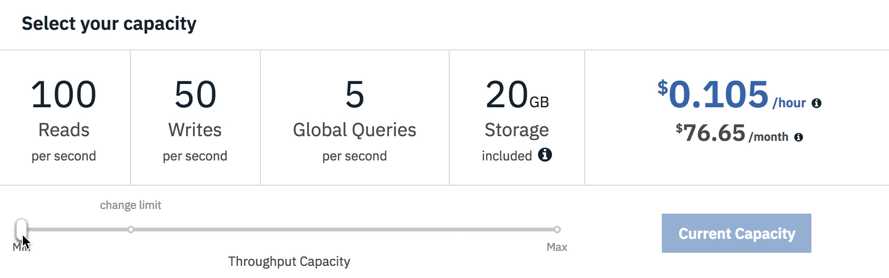

---

copyright:
  years: 2015, 2019
lastupdated: "2019-03-07"

keywords: pricing examples, data usage, ibm cloud usage dashboard

subcollection: cloudant

---

{:new_window: target="_blank"}
{:shortdesc: .shortdesc}
{:screen: .screen}
{:codeblock: .codeblock}
{:pre: .pre}
{:note: .note}
{:important: .important}
{:deprecated: .deprecated}

<!-- Acrolinx: 2019-01-11 -->

# 定價
{: #pricing}

{{site.data.keyword.cloudantfull}} 是根據您針對實例所配置的已佈建傳輸量，以及所耗用的資料儲存空間數量而計價。{{site.data.keyword.cloudant_short_notm}} 可讓您擴增和縮減已佈建傳輸量，並每小時按比例付費。已佈建傳輸量是保留且配置給實例的每秒讀取數、每秒寫入數及每秒廣域查詢數。傳輸量設定是給定秒的最大用量層次。如果您嘗試超出保留給讀取、寫入或廣域查詢的容量，則會收到 HTTP 429 狀態碼，指出應用程式正在嘗試超出其已佈建的傳輸量額度。

下表顯示各種已佈建之傳輸量設定的每小時定價範例。您可以根據每小時以 100 次讀取/秒、50 次寫入/秒及 5 次廣域查詢/秒的精細區塊切換容量。也會對每一個設定顯示約略的每月成本，假設一個月平均 730 小時。顯示的價格以美元為單位。您可以使用 {{site.data.keyword.cloud_notm}} 定價計算機，從 {{site.data.keyword.cloudant_short_notm}} 型錄磚按一下`新增至預估`按鈕，來查看其他貨幣的預估成本。

您可以啟動 {{site.data.keyword.cloudant_short_notm}} **儀表板** > **帳戶** > **容量**標籤，來檢視及變更已佈建傳輸量，以及查看每小時及約略的每月成本： 

## 定價範例 
{: #pricing-examples}

假設您正在使用 {{site.data.keyword.cloudant_short_notm}} 建置行動應用程式，且尚不瞭解您可能需要的容量。在此情況下，建議您從最低的已佈建傳輸量開始，並依應用程式一段時間的用量視需要增加它。{{site.data.keyword.cloudant_short_notm}} 帳單會按比例每小時計費，而且變更已佈建的傳輸量並不會導致關閉。 

在行動應用程式範例中，您一開始使用「標準方案」的最低已佈建傳輸量，也就是 100 次讀取/秒、50 次寫入/秒及 5 次廣域查詢/秒。此容量的成本是每小時 $0.105。100 次讀取/秒、50 次寫入/秒及 5 次廣域查詢/秒是一個區塊的已佈建傳輸量。當您需要擴增（或縮減）時，可以依這些容量區塊的增量來調整。假設實例具有小於「標準方案」所含 20 GB 的儲存空間，則不會產生任何儲存空間成本。在「{{site.data.keyword.cloudant_short_notm}} 儀表板」的 >「帳戶」>「容量」標籤上，已佈建的傳輸量設定類似於下列畫面擷取：

容量調節器會以 USD $0.105/小時為單位顯示 100 次讀取/秒、50 次寫入/秒及 5 次廣域查詢/秒已佈建傳輸量的每小時成本。調節器顯示每月成本約略為 $76.65。每月金額是根據每月平均 730 小時的預估值。取決於該月份中的小時數，任何月份中的成本可能會略有不同。

範例方程式： 

- 每小時 $0.105 \* 1 個區塊（即 100 次讀取/秒、50 次寫入/秒及 5 次查詢/秒已佈建傳輸量）\* 730 小時（一個月的大約時數）
- 總計 = $76.65

無法獨立調整讀取、寫入及查詢次數。請根據應用程式所需的讀取/秒、寫入/秒或廣域查詢/秒次數上限，使用調節器來選取已佈建傳輸量區塊的數目。例如，如果您的應用程式每秒需要 1,000 次讀取，請使用調節器來選取可提供 1,000 次讀取/秒、500 次寫入/秒及 50 次廣域查詢/秒的容量，即使您不需要對應的寫入或廣域查詢次數也一樣。

如何預估每月 1,000 次讀取、500 次寫入及 50 次廣域查詢的已佈建傳輸量總成本？ 

- 每小時 $0.105 \* 10 個區塊（即 100 次讀取/秒、50 次寫入/秒及 5 次查詢/秒已佈建傳輸量）\* 730 小時（一個月的大約時數）
- 或者，調節器會顯示 1000 次讀取/秒、500 寫入/秒及 50 次廣域查詢/秒已佈建傳輸量的成本為 $1.050/小時 \* 730 小時
- 總計 = $766.50

## 資料用量定價
{: #data-usage-pricing}

資料超額定價為何，其運作方式為何？

方案 | 所含的儲存空間 | 超額限制
-----|------------------|--------------
精簡|1 GB| 在您刪除足夠的資料使其低於 1-GB 限制，或升級為更高的方案之前，您的帳戶會遭到封鎖，無法寫入新資料。
標準|20 GB| 每小時每 GB 的額外儲存空間成本 $0.0014（每個月大約 $1/GB）。

## {{site.data.keyword.cloud_notm}} 用量儀表板 
{: #usage-dashboard}

資料如何顯示在「{{site.data.keyword.cloud_notm}} 用量儀表板」中？

可在「{{site.data.keyword.cloud_notm}} 儀表板」的「管理」->「計費及用量」->「用量」下看到現行及歷程用量帳單。此視圖顯示在服務、方案或實例層次於特定月期間所增加的用量總計。「預估總計」會反映該月到目前為止或過去整個月的帳單。它只會顯示直到當月該點的應計每小時費用。月底時您會看到平均的已佈建傳輸量反映在 `LOOKUPS_PER_MONTH`、`WRITES_PER_MONTH` 及 `QUERIES_PER_MONTH` 欄位中。（請注意，查閱現在稱為讀取，而查詢現在稱為廣域查詢。）`STORAGE_MANAGED_PER_MONTH` 欄位只會顯示付費的儲存空間，不會包括「標準方案」中包括的 20 GB。在下列範例中，20+ GB 的數量反映當月在實例中有平均 40 GB 的資料。當您使用的儲存空間小於 20 GB 時，顯示畫面會顯示 0 GB，因為您未超過限制。   

