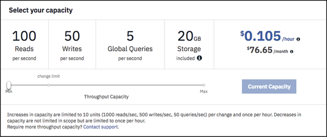

---

copyright:
  years: 2015, 2018
lastupdated: "2018-06-07"

---

{:new_window: target="_blank"}
{:shortdesc: .shortdesc}
{:screen: .screen}
{:codeblock: .codeblock}
{:pre: .pre}
{:tip: .tip}

<!-- Acrolinx: 2018-06-07 -->

# 定價
{: #pricing}

{{site.data.keyword.cloudantfull}} 容許調整來擴增及縮減您所佈建的傳輸量，這是配置給實例的每秒查閱、寫入及查詢保留次數。傳輸量層次是最大用量層次。如果您嘗試超出保留容量，則會收到 HTTP 429 狀態碼，指出應用程式正在嘗試超出其已佈建傳輸量額度。

## 定價範例 
{: #pricing-examples}

假設您正在建置具有 {{site.data.keyword.cloudant_short_notm}} 的行動應用程式，但尚不瞭解您可能需要的容量。在此情況下，建議您從最低已佈建傳輸量開始，並視需要依應用程式一段時間的用量來增加它。{{site.data.keyword.cloudant_short_notm}} 帳單會按比例每小時計費，而且變更已佈建的傳輸量不會導致關閉。 

在行動應用程式範例中，您起始於「標準方案」的 100 次查閱/秒、50 次寫入/秒及 5 次查詢/秒的最小已佈建傳輸量。此容量的成本是每小時 $0.105。100 次查閱/秒、50 次寫入/秒及 5 次查詢/秒是已佈建傳輸量區塊。當您需要擴增（或縮減）時，可以依這些容量區塊的增量來調整。假設實例小於「標準方案」中所含的 20 GB 儲存空間，則不會產生任何儲存空間成本。在「{{site.data.keyword.cloudant_short_notm}} 儀表板」的 >「帳戶」>「容量」標籤上，已佈建傳輸量設定類似下列畫面擷取：

容量調節器會以 USD $0.105/小時為單位顯示 100 次查閱/秒、50 次寫入/秒及 5 次查詢/秒已佈建傳輸量的每小時成本。調節器會顯示每月 $76.65 的約略成本。每月金額是根據每月平均 730 小時的預估值。取決於該月份中的小時數，任何月份中的成本可能會略有不同。

範例方程式： 

- 1 個 100 次查閱/秒、50 次寫入/秒及 5 次查詢/秒已佈建傳輸量區塊每小時 $0.105 * 730 小時（一個月的大約時數）
- 總計 = $76.65

無法個別調整查閱、寫入及查詢次數。根據應用程式所需的查閱/秒、寫入/秒或查詢/秒上限，使用調節器來選取已佈建傳輸量區塊數目。例如，如果您的應用程式每秒需要 1,000 次查閱，請使用調節器來選取可提供 1,000 次查閱/秒、500 次寫入/秒及 50 次查詢/秒的容量，即使您不需要對應的寫入或查詢次數。

如何預估每月 1,000 次查閱、500 次寫入及 50 次查詢的已佈建傳輸量總成本？ 

- 10 個 100 次查閱/秒、50 次寫入/秒及 5 次查詢/秒已佈建傳輸量區塊每小時 $0.105 * 730 小時（一個月的大約時數）
- 或者，調節器會顯示 1000 次查閱/秒、500 寫入/秒及 50 次查詢/秒已佈建傳輸量的成本為 $1.050/小時 * 730 小時
- 總計 = $766.50

## 資料用量 
{: #data-usage}

資料超額定價為何，其運作方式為何？

方案 | 所含的儲存空間 | 超額限制
-----|------------------|--------------
精簡|1 GB| 除非您刪除足夠的資料使其低於 1 GB 限制，或升級為更高的方案，否則您的帳戶會遭到封鎖而無法寫入新資料。
標準|20 GB| 每小時每 GB 的額外儲存空間成本 $0.0014（每個月大約 $1/GB）。

資料如何顯示在「{{site.data.keyword.cloud_notm}} 用量儀表板」中？

此視圖顯示本月期間所增加的用量總計，因此只會顯示本月到目前為止的成本。「預估總計」會反映該月到目前為止的帳單。在月底之前，您會看到該月的平均容量，即每月帳單總計。`STORAGE_MANAGED_PER_MONTH` 欄位只會顯示高於 20 GB（含）的數量，因此，在下列範例中，您會看到大約 40 GB 的帳戶資料總計。  

當您使用的儲存空間小於 20 GB 時，顯示畫面會顯示 0 GB，因為您未超過此限制。
