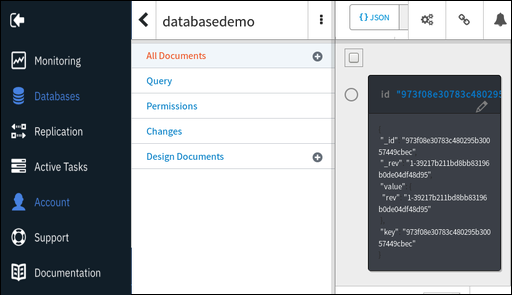

---

copyright:
  years: 2017, 2019
lastupdated: "2019-06-12"

keywords: connect to ibm cloud, upload application, test sample application, confirm database details

subcollection: cloudant

---

{:new_window: target="_blank"}
{:shortdesc: .shortdesc}
{:screen: .screen}
{:codeblock: .codeblock}
{:pre: .pre}
{:tip: .tip}
{:note: .note}
{:important: .important}
{:deprecated: .deprecated}

<!-- Acrolinx: 2017-05-10 -->

# 建立簡單的 {{site.data.keyword.cloud_notm}} 應用程式以存取 {{site.data.keyword.cloudant_short_notm}} 資料庫：上傳應用程式
{: #creating-a-simple-ibm-cloud-application-to-access-an-ibm-cloudant-database-uploading-the-application}

指導教學的這一節說明如何上傳 {{site.data.keyword.cloud}} 應用程式。
{: shortdesc}

## 連接至 {{site.data.keyword.cloud_notm}}
{: #connecting-to-ibm-cloud}

第一項作業是連接至 {{site.data.keyword.cloud_notm}}。

{{site.data.keyword.cloud_notm}} CLI 需要知道要用於發出 API 呼叫的 URL。例如，上傳應用程式時，{{site.data.keyword.cloud_notm}} 工具箱使用 `ibmcloud api` 指令來管理 API 端點。如需 `ibmcloud api` 指令的相關資訊，請參閱 [ {{site.data.keyword.cloud_notm}} 開始使用 CLI ](https://cloud.ibm.com/docs/cli?topic=cloud-cli-ibmcloud-cli){: new_window}。

使用下列指令，以告知 Cloud Foundry 要使用的 URL：

```sh
ibmcloud api https://api.ng.bluemix.net
```
{: pre}

預期結果類似下列輸出：

```
Invoking 'cf api https://api.ng.bluemix.net'...

Setting api endpoint to https://api.ng.bluemix.net...
OK

API endpoint:   https://api.ng.bluemix.net
API version:    2.54.0
Not logged in. Use 'ibmcloud login' to log in.
```
{: codeblock}

Cloud Foundry 現在知道將 API 呼叫傳送到哪裏，以便管理應用程式。

下一步是登入 {{site.data.keyword.cloud_notm}} 應用程式環境。您必須提供下列帳戶詳細資料：

-   您的使用者名稱（其指定為 '`-u`' 參數）。
-   您的組織名稱（其指定為 '`-o`' 參數）。
-   您的空間（其指定為 '`-s`' 參數）。

  當您透過 Web 瀏覽器登入時，{{site.data.keyword.cloud_notm}} 儀表板上會提供帳戶詳細資料，如下列範例所示：
  {: tip}

  

使用與下列範例類似的指令來登入 {{site.data.keyword.cloud_notm}} 應用程式環境。請注意，系統會要求您輸入您的帳戶密碼。

```sh
ibmcloud login -u Adrian.Warman@uk.ibm.com -o Adrian.Warman@uk.ibm.com -s dev
```
{: pre}

預期結果類似下列輸出：

```
Invoking 'cf login -u Adrian.Warman@uk.ibm.com -o Adrian.Warman@uk.ibm.com -s dev'...

API endpoint: https://api.ng.bluemix.net

Password> 
Authenticating...
OK

Targeted org Adrian.Warman@uk.ibm.com

Targeted space dev
                
API endpoint:   https://api.ng.bluemix.net (API version: 2.54.0)
User:           adrian.warman@uk.ibm.com
Org:            Adrian.Warman@uk.ibm.com
Space:          dev
```
{: codeblock}

## 上傳應用程式
{: #uploading-the-application}

{{site.data.keyword.cloudant_short_notm}} Foundry 工具箱現在知道如何連接至 {{site.data.keyword.cloud_notm}} 環境。

下一步是上傳應用程式本身。[資訊清單檔](/docs/services/Cloudant?topic=cloudant-creating-a-simple-ibm-cloud-application-to-access-an-ibm-cloudant-database-the-application-environment#the-manifest.yml-file)中提供 {{site.data.keyword.cloud_notm}} 應用程式的詳細資料。

請使用與下列範例類似的指令進行登入，以上傳 {{site.data.keyword.cloud_notm}} 應用程式。

```sh
cf push "Cloudant Python"
```
{: pre}

即會顯示一系列的結果訊息。

```
Using manifest file /..../BMXDemo/manifest.yml

Updating app {{site.data.keyword.cloudant_short_notm}} Python in org Adrian.Warman@uk.ibm.com / space dev as Adrian.Warman@uk.ibm.com...
OK
```
{: codeblock}

Cloud Foundry 工具箱已找到資訊清單檔，並且準備好使用您[稍早](#uploading-the-application)提供的連線及識別詳細資料來上傳應用程式。

```
Using route Cloudant-Python.mybluemix.net
Uploading Cloudant Python...
Uploading app files from: /..../BMXDemo
Uploading 1.5K, 3 files
Done uploading               
OK
Binding service {{site.data.keyword.cloudant_short_notm}} Service 2017 to app {{site.data.keyword.cloudant_short_notm}} Python in org Adrian.Warman@uk.ibm.com / space dev as Adrian.Warman@uk.ibm.com...
OK
```
{: codeblock}

已順利上傳應用程式，並與 {{site.data.keyword.cloudant_short_notm}} 資料庫實例進行連線。

```
Starting app {{site.data.keyword.cloudant_short_notm}} Python in org Adrian.Warman@uk.ibm.com / space dev as Adrian.Warman@uk.ibm.com...
-----> Downloaded app package (4.0K)
-----> Downloaded app buildpack cache (29M)
-------> Buildpack version 1.5.5
     $ pip install -r requirements.txt
DEPRECATION: --allow-all-external has been deprecated and will be removed in the future. Due to changes in the repository protocol, it no longer has any effect.
       Collecting cloudant==2.3.1 (from -r requirements.txt (line 1))
         Downloading cloudant-2.3.1-py2-none-any.whl (63kB)
       Collecting requests<3.0.0,>=2.7.0 (from cloudant==2.3.1->-r requirements.txt (line 1))
         Downloading requests-2.12.4-py2.py3-none-any.whl (576kB)
       Installing collected packages: requests, cloudant
       Successfully installed cloudant-2.3.1 requests-2.12.4
You are using pip version 8.1.1, however version 9.0.1 is available.
You should consider upgrading via the 'pip install --upgrade pip' command.
You are using pip version 8.1.1, however version 9.0.1 is available.
You should consider upgrading via the 'pip install --upgrade pip' command.
-----> Uploading droplet (30M)

0 of 1 instances running, 1 starting
1 of 1 instances running

App started


OK

App {{site.data.keyword.cloudant_short_notm}} Python was started using this command `python server.py`
```
{: codeblock}

應用程式會自動啟動。在啟動期間，會透過評估 [requirements.txt 檔案](/docs/services/Cloudant?topic=cloudant-creating-a-simple-ibm-cloud-application-to-access-an-ibm-cloudant-database-the-application-environment#the-requirements.txt-file)的內容，進行檢查以確保符合所有需求。

在您上傳並啟動應用程式之後，會執行一些簡單的系統檢查，確認對於 {{site.data.keyword.cloud_notm}} 而言，應用程式正確地在執行中。

```
Showing health and status for app {{site.data.keyword.cloudant_short_notm}} Python in org Adrian.Warman@uk.ibm.com / space dev as Adrian.Warman@uk.ibm.com...
OK

requested state: started
instances: 1/1
usage: 128M x 1 instances
urls: Cloudant-Python.mybluemix.net
last uploaded: Thu Dec 22 15:58:18 UTC 2016
stack: cflinuxfs2
buildpack: python 1.5.5

     state     since                    cpu    memory          disk           details
#0   running   2016-12-22 03:59:21 PM   0.0%   49.9M of 128M   110.6M of 1G
```
{: codeblock}

## 測試範例應用程式
{: #testing-the-sample-application}

現在，請測試您的應用程式，並驗證其適當地執行。 

1.  從 {{site.data.keyword.cloud_notm}} 儀表板中，移至**功能表**圖示 > **資源清單**，然後開啟您的應用程式。在「Cloud Foundry 應用程式」下，按一下 `Cloudant CF 應用程式`，以開啟詳細資料頁面。<br/>  


2.  在 `Cloudant CF 應用程式`詳細資料頁面上，按一下`路徑`，然後按一下 `Cloudant-CF-app.mybluemix.net` 鏈結。<br/>


3. 即會在 `https://cloudant-cf-app.mybluemix.net/` 開啟新的瀏覽器視窗。訊息會藉由顯示 'Hello World! Thanks for creating a Python Starter Application' 的訊息，驗證應用程式正在執行中。<br/>


### 確認資料庫詳細資料
{: #confirming-the-database-details}

從 {{site.data.keyword.cloud_notm}} 儀表板中，移至**功能表**圖示 > **資源清單**，然後開啟您的服務實例。移至`管理`標籤，然後按一下`啟動 Cloudant 儀表板`。<br/>


若要尋找 {{site.data.keyword.cloudant_short_notm}} 服務頁面，請參閱[建立 {{site.data.keyword.cloudant_short_notm}} 實例指導教學](/docs/services/Cloudant?topic=cloudant-creating-an-ibm-cloudant-instance-on-ibm-cloud#locating-your-service-credentials)中的詳細資料。
{: note}

儀表板開啟時，您可以看到應用程式已建立 '`databasedemo`' 資料庫：<br/>


資料庫包含應用程式所建立的單一文件。若要驗證文件是否存在，請按一下儀表板內的資料庫名稱。即會出現資料庫的選項清單。當您選取`所有文件`標籤時，即會出現單一文件的詳細資料：<br/>


若要查看文件的內容，請按一下顯示為鉛筆影像的`編輯`圖示：<br/>


文件的內容出現時，您可以查看指導教學應用程式已建立的每一個欄位。<br/>
<br/>
特別值得一提的是，`rightNow` 欄位具有建立文件的日期和時間。此值對應於[應用程式日誌檔](#testing-the-sample-application)內已記錄的時間。

指導教學中的下一步是[操作及維護應用程式](/docs/services/Cloudant?topic=cloudant-creating-a-simple-ibm-cloud-application-to-access-an-ibm-cloudant-database-maintaining-and-troubleshooting#creating-a-simple-ibm-cloud-application-to-access-an-ibm-cloudant-database-maintaining-and-troubleshooting)，例如，當您啟動、停止及除錯應用程式時。
